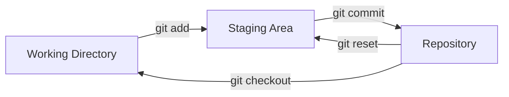
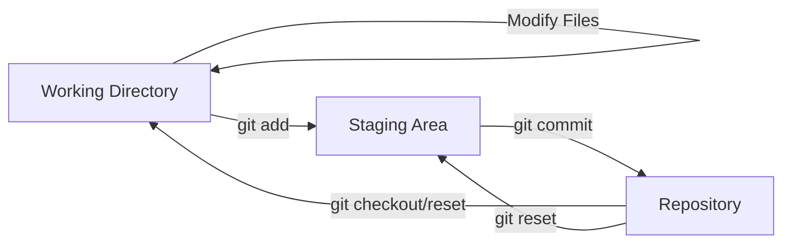

# Git Fundamentals Theory

## Table of Contents

1. [Introduction to Version Control](#introduction-to-version-control)
2. [The Story of Sarah and Her First Git Repository](#the-story-of-sarah-and-her-first-git-repository)
3. [Understanding Git's Core Concepts](#understanding-gits-core-concepts)
4. [Getting Started with Git](#getting-started-with-git)
5. [Basic Git Operations](#basic-git-operations)
6. [Working with Branches](#working-with-branches)
7. [Remote Repositories and GitHub](#remote-repositories-and-github)
8. [Advanced Git Concepts](#advanced-git-concepts)
9. [Git Workflows and Best Practices](#git-workflows-and-best-practices)
10. [Collaboration with Git](#collaboration-with-git)
11. [Troubleshooting Common Git Issues](#troubleshooting-common-git-issues)
12. [Summary and Next Steps](#summary-and-next-steps)

---

## Introduction to Version Control

Imagine you're writing an important document, and you want to keep track of all your changes. You might create different versions like `document_v1.doc`, `document_v2.doc`, `document_final.doc`, `document_really_final.doc`. As your project grows, managing these versions becomes a nightmare.

This is exactly what version control systems (VCS) solve. Version control is a system that tracks changes to files over time, allowing you to:

- **Recall specific versions** of your files at any point in time
- **Compare different versions** to see what changed
- **Revert changes** if something goes wrong
- **Collaborate with others** without overwriting each other's work
- **Maintain different versions** for different features or purposes

**Sarah's First Encounter with Chaos**

Sarah was a computer science student working on her final year project. She had spent months developing a mobile app for campus food ordering. One day, her laptop crashed, and she lost three weeks of work because she hadn't saved backup copies. She vowed never to let this happen again.

This is when her professor introduced her to Git - a distributed version control system that would change how she worked forever.

---

## The Story of Sarah and Her First Git Repository

### Sarah's Initial Hesitation

"Git sounds complicated," Sarah thought, looking at the command line interface. Her professor had given her a simple assignment: "Initialize a Git repository, make a few commits, and push to GitHub."

"Sarah," her professor had said, "imagine Git as a time machine for your code. You can travel back to any point in your project's history, see what changed, and even create parallel universes where you try different approaches."

### The First Step: Initializing a Repository

Sarah opened her terminal and navigated to her project directory:

```bash
cd /path/to/your/project
git init
```

"When I ran `git init`," Sarah later explained, "Git created a hidden `.git` folder in my directory. This folder is like the DNA of my project - it contains all the information about every change I've ever made."

The `git init` command created a new Git repository. In a Git repository, Git doesn't just store the current state of your files - it stores the complete history of how your files evolved over time.

### Sarah's First Commit

Sarah created a simple `README.md` file:

```markdown
# Campus Food Ordering App

A mobile app for ordering food from campus restaurants.

## Features

- Browse restaurant menus
- Place orders
- Track order status
```

She then added this file to Git's staging area and made her first commit:

```bash
git add README.md
git commit -m "Initial commit: Add README with project description"
```

"Making that first commit felt like taking a photograph of my project at that moment in time," Sarah realized. "Git was now tracking every file in my project."

### The Three States of Files

Sarah learned about Git's fundamental concept: files can be in three different states:

1. **Working Directory**: Files on your local machine that you can edit
2. **Staging Area (Index)**: Files that are ready to be committed
3. **Repository**: Files that have been committed and are stored safely



"Think of it like preparing a meal," Sarah's professor explained. "The working directory is your kitchen where you cook. The staging area is your plate where you arrange the food before serving. The repository is the menu where the finished dish is officially recorded."

---

## Understanding Git's Core Concepts

### What is Git?

Git is a distributed version control system created by Linus Torvalds in 2005. Unlike older version control systems like Subversion (SVN) or CVS, Git is distributed, meaning every developer has a complete copy of the repository on their local machine.

### Key Features of Git

1. **Distributed Architecture**: No single point of failure
2. **Fast Performance**: Most operations are local
3. **Strong Support for Branching**: Easy to create and merge branches
4. **Data Integrity**: Uses SHA-1 checksums to ensure data integrity
5. **Staging Area**: Flexible workflow control
6. **Free and Open Source**: Available for all operating systems

### Sarah's Understanding of Git's Advantages

Sarah's professor explained why Git was better than other systems:

"Imagine you're working on a group project with your classmates. With older systems like Subversion, you need a central server to coordinate everyone's work. If that server goes down, the whole team stops working. With Git, every team member has a complete copy of the project, and they can work offline. When they're ready, they can synchronize their changes."

### The Git Object Model

Git stores data using a simple object model. The main objects are:

1. **Blob**: Stores file content
2. **Tree**: Stores directory structure
3. **Commit**: Stores metadata and points to a tree
4. **Tag**: Provides a human-readable name for a commit

Sarah learned that every piece of data in Git is identified by a SHA-1 hash, ensuring data integrity and making tampering virtually impossible.

---

## Getting Started with Git

### Installing Git

Sarah needed to install Git on her system:

**Windows:**

- Download from [git-scm.com](https://git-scm.com/download/win)
- Use Git Bash for command line interface
- Git GUI is also available for visual users

**macOS:**

```bash
# Using Homebrew
brew install git

# Or download from git-scm.com
```

**Linux:**

```bash
# Ubuntu/Debian
sudo apt-get install git

# Fedora/CentOS
sudo yum install git
```

### Configuring Git

Before using Git, Sarah needed to configure her identity:

```bash
git config --global user.name "Sarah Johnson"
git config --global user.email "sarah@university.edu"
```

"The global config is like your Git ID card," her professor explained. "It tells everyone who made each change to the project."

She also set up her default branch name and text editor:

```bash
git config --global init.defaultBranch main
git config --global core.editor "code --wait"  # VS Code
```

### Creating a New Repository

Sarah created a new project and initialized it as a Git repository:

```bash
mkdir my-awesome-project
cd my-awesome-project
git init
```

She also learned she could clone an existing repository:

```bash
git clone https://github.com/user/repo.git
```

"Cloning creates a complete copy of the repository including all the history," Sarah discovered.

### Basic Git Status

Sarah learned to check the status of her repository:

```bash
git status
```

This command shows:

- Which files have been modified
- Which files are staged for the next commit
- Which files are not being tracked by Git

---

## Basic Git Operations

### Understanding the Git Workflow

Sarah's professor taught her the basic Git workflow:

1. **Modify** files in your working directory
2. **Stage** files to the index (add changes to staging area)
3. **Commit** changes from the staging area to the repository



### Adding Files (git add)

Sarah learned to add files to the staging area:

```bash
# Add a specific file
git add filename.txt

# Add all files in current directory
git add .

# Add all files with specific extension
git add *.py

# Add files interactively
git add -i
```

"The staging area lets me choose exactly what goes into my next commit," Sarah realized. "I can commit some changes and leave others for later."

### Making Commits (git commit)

The commit command creates a snapshot of the staged changes:

```bash
# Basic commit
git commit -m "Add user authentication feature"

# Commit with automatic staging of modified files
git commit -a -m "Update existing files"

# Amend the last commit
git commit --amend -m "Fix commit message"
```

### Viewing Commit History (git log)

Sarah learned to view the project history:

```bash
# Basic log
git log

# Compact log
git log --oneline

# Log with graph
git log --graph --oneline --all

# Show specific commit
git log -1
```

### Understanding Commit Messages

Sarah learned the importance of good commit messages:

```bash
# Good commit message
git commit -m "Fix: Resolve null pointer exception in user login"

# Bad commit message
git commit -m "fixed stuff"
```

The conventional format is:

- **Type**: Fix, Feature, Refactor, Docs, etc.
- **Scope**: (optional) The module affected
- **Description**: Clear explanation of the change

### Removing and Moving Files

Sarah learned to manage files in Git:

```bash
# Remove a file and stage the removal
git rm filename.txt

# Remove a file from Git but keep it locally
git rm --cached filename.txt

# Move or rename a file
git mv oldname.txt newname.txt
```

### Reverting Changes

When Sarah made mistakes, she learned how to revert changes:

```bash
# Discard changes in working directory
git checkout -- filename.txt

# Unstage a file (keep changes)
git reset HEAD filename.txt

# Create a new commit that reverts a previous commit
git revert <commit-hash>
```

---

## Working with Branches

### What are Branches?

Sarah's professor introduced the concept of branches: "Imagine your project as a tree. The main trunk is your main branch, where the stable version lives. You can create branches to develop new features without affecting the main codebase. When the feature is complete, you can merge it back."

### Creating Branches

Sarah created her first branch:

```bash
# Create a new branch
git branch feature-login

# Create and switch to new branch
git checkout -b feature-login

# Or using the newer syntax
git switch -c feature-login
```

### Switching Branches

Sarah learned to move between branches:

```bash
# Switch to an existing branch
git checkout feature-login
git switch feature-login

# Switch back to main branch
git checkout main
git switch main
```

### Branch Management

She learned to manage her branches:

```bash
# List all branches
git branch

# List remote branches
git branch -r

# Delete a branch
git branch -d feature-login

# Delete a branch forcefully
git branch -D feature-login
```

### Understanding Branch Head

Sarah learned about HEAD - a pointer to the current branch:

"When I switch branches with `git checkout`, I'm moving the HEAD pointer. HEAD always points to the tip of the current branch, which is the most recent commit on that branch."

### Merging Branches

When Sarah finished developing a feature, she merged it back:

```bash
# First, switch to the branch you want to merge INTO
git checkout main

# Then merge the feature branch
git merge feature-login
```

### Types of Merges

Sarah learned about different types of merges:

1. **Fast-forward merge**: When the main branch hasn't changed
2. **Three-way merge**: Creates a new merge commit
3. **Merge conflict**: When the same lines were changed differently

### Handling Merge Conflicts

When Sarah encountered her first merge conflict:

```bash
# Git marks conflicts in files
# <<<<<<< HEAD
# Current branch content
# =======
# Incoming branch content
# >>>>>>> feature-branch
```

She resolved conflicts by:

1. Opening the conflicting file
2. Editing the file to keep the correct changes
3. Removing the conflict markers
4. Adding and committing the resolved file

### Branching Strategies

Sarah's professor introduced common branching strategies:

1. **Git Flow**: Main, develop, feature, release, hotfix branches
2. **GitHub Flow**: Main and feature branches
3. **GitLab Flow**: Main and environment branches

"Choose a strategy that works for your team," her professor advised. "Consistency is more important than complexity."

---

## Remote Repositories and GitHub

### What is a Remote Repository?

Sarah learned that remote repositories are versions of her project stored on servers, typically on platforms like GitHub, GitLab, or Bitbucket.

"Think of remote repositories as backup copies in the cloud," her professor explained. "You can sync your local work with the remote, allowing collaboration and backup."

### Connecting to GitHub

Sarah created a GitHub account and connected her local repository:

```bash
# Add a remote repository
git remote add origin https://github.com/username/repository.git

# View remote repositories
git remote -v

# Rename a remote
git remote rename origin upstream
```

### Pushing Changes

Sarah learned to upload her local changes to the remote:

```bash
# Push to remote branch
git push origin main

# Push and set upstream tracking
git push -u origin main

# Push all branches
git push --all

# Push tags
git push --tags
```

### Pulling Changes

To download changes from the remote:

```bash
# Pull changes
git pull origin main

# Fetch without merging
git fetch origin

# Pull with rebase
git pull --rebase origin main
```

### Understanding git fetch vs git pull

Sarah learned the difference:

- **git fetch**: Downloads changes but doesn't merge them
- **git pull**: Downloads changes and merges them automatically

"Use fetch when you want to review changes before merging," her professor advised. "Use pull when you trust the changes and want them automatically integrated."

### Cloning Repositories

Sarah cloned her GitHub repository to work on another computer:

```bash
git clone https://github.com/username/repo.git
```

"Cloning creates a complete copy including all branches and history," she discovered.

### Remote Branches

Sarah learned about tracking remote branches:

```bash
# List remote branches
git branch -r

# Create a local branch tracking a remote branch
git checkout -b develop origin/develop

# Set up tracking for current branch
git branch --set-upstream-to=origin/main main
```

---

## Advanced Git Concepts

### Rebasing

Sarah learned about rebasing - an alternative to merging:

```bash
# Rebase current branch on top of main
git rebase main

# Interactive rebase (squash commits)
git rebase -i HEAD~3

# Abort a rebase
git rebase --abort

# Continue after resolving conflicts
git rebase --continue
```

### When to Use Rebase vs Merge

Sarah's professor explained:

- **Use merge**: When you want to preserve the exact history
- **Use rebase**: When you want a clean, linear history
- **Never rebase public branches**: It can cause problems for others

### Cherry-picking

Sarah learned to apply specific commits to another branch:

```bash
# Apply a specific commit
git cherry-pick <commit-hash>

# Cherry-pick multiple commits
git cherry-pick <commit-hash1>..<commit-hash2>

# Cherry-pick without making a commit
git cherry-pick --no-commit <commit-hash>
```

### Stashing

Sarah discovered she could temporarily save changes without committing:

```bash
# Stash changes
git stash

# Stash with a message
git stash save "Work in progress on feature X"

# List all stashes
git stash list

# Apply latest stash
git stash pop

# Apply specific stash
git stash apply stash@{2}

# Drop a stash
git stash drop
```

### Tagging

Sarah learned to mark specific points in history:

```bash
# Create an annotated tag
git tag -a v1.0.0 -m "Release version 1.0.0"

# Create a lightweight tag
git tag v1.0.0

# List all tags
git tag

# Show tag information
git show v1.0.0

# Push tags to remote
git push origin --tags
```

### Submodules

Sarah learned about Git submodules for including other repositories:

```bash
# Add a submodule
git submodule add https://github.com/user/repo.git

# Update submodules
git submodule update

# Initialize submodules in cloned repository
git submodule update --init --recursive
```

---

## Git Workflows and Best Practices

### Feature Branch Workflow

Sarah's team adopted the feature branch workflow:

1. Create a new branch for each feature
2. Develop and test the feature
3. Create a pull request for review
4. Merge after approval
5. Delete the feature branch

### GitHub Flow

For her team projects, Sarah used GitHub Flow:

1. Create a branch from main
2. Make changes and commit
3. Open a pull request
4. Review and discuss
5. Merge to main
6. Deploy immediately

### Choosing the Right Workflow

Sarah learned to choose workflows based on project needs:

- **Feature Branch**: Complex projects with thorough testing
- **GitHub Flow**: Web applications with frequent deployments
- **Git Flow**: Release-based software with maintenance branches
- **Forking Workflow**: Open source projects with many contributors

### Commit Best Practices

Sarah adopted these commit practices:

1. **Write meaningful commit messages**
2. **Make small, focused commits**
3. **Commit early and often**
4. **Test before committing**
5. **Don't commit sensitive data**

### Branch Protection Rules

On GitHub, Sarah learned to set up branch protection:

- Require pull request reviews
- Require status checks to pass
- Require branches to be up to date
- Restrict who can push to protected branches

### Code Review Process

Sarah's team used pull requests for code review:

1. **Create descriptive PRs**: Explain what and why
2. **Keep PRs small**: Easier to review
3. **Respond to feedback**: Address all comments
4. **Use checklists**: Ensure quality
5. **Test thoroughly**: Verify functionality

---

## Collaboration with Git

### Fork and Pull Workflow

For open source projects, Sarah used the fork and pull workflow:

1. Fork the repository
2. Clone your fork locally
3. Create a feature branch
4. Make changes and commit
5. Push to your fork
6. Create a pull request to the original repository

### Handling Large Teams

Sarah learned strategies for large team collaboration:

- **Use meaningful branch names**: feature/login, bugfix/navigation-issue
- **Keep branches short-lived**: Merge features quickly
- **Use pull requests**: Enable code review
- **Establish naming conventions**: Consistent, predictable branch names
- **Regular synchronization**: Keep branches updated

### Conflict Prevention

Sarah learned to prevent conflicts:

1. **Communicate early**: Let team know what you're working on
2. **Pull frequently**: Regularly sync with main branch
3. **Work in small batches**: Make small, frequent commits
4. **Use feature branches**: Keep development isolated

### Conflict Resolution Strategies

When conflicts occurred, Sarah followed these steps:

1. **Don't panic**: Conflicts are normal
2. **Understand the conflict**: Read the file carefully
3. **Talk to team members**: Discuss the best solution
4. **Test thoroughly**: Ensure the solution works
5. **Commit the resolution**: Document how you solved it

### Git Hooks

Sarah learned about Git hooks for automation:

- **pre-commit**: Run checks before committing
- **commit-msg**: Validate commit message format
- **pre-push**: Run tests before pushing
- **post-commit**: Send notifications

### Continuous Integration

Sarah's team used CI/CD with Git:

- **Automated testing**: Run tests on every push
- **Code quality checks**: Linting, formatting, security scans
- **Build verification**: Ensure code compiles successfully
- **Deployment automation**: Deploy after tests pass

---

## Troubleshooting Common Git Issues

### Merge Conflicts

**Problem**: Git can't automatically merge changes
**Solution**:

1. Open conflicting files
2. Look for conflict markers: <<<<<<<, =======, >>>>>>>
3. Choose the correct changes
4. Remove conflict markers
5. Add and commit the resolution

### Detached HEAD State

**Problem**: You're in a 'detached HEAD' state
**Solution**:

```bash
# Return to a branch
git checkout main

# Or create a new branch from current state
git checkout -b new-branch
```

### Undoing Things

Sarah learned various ways to undo changes:

**Revert**: Undo a commit by creating a new commit

```bash
git revert <commit-hash>
```

**Reset**: Move HEAD pointer to an earlier commit

```bash
# Soft reset (keep changes staged)
git reset --soft HEAD~1

# Mixed reset (keep changes in working directory)
git reset HEAD~1

# Hard reset (discard all changes)
git reset --hard HEAD~1
```

**Reflog**: Find lost commits

```bash
git reflog
git checkout <lost-commit-hash>
```

### Large Files in Repository

**Problem**: Repository is too large
**Solution**:

1. Find large files: `git log --name-only --oneline | head -20`
2. Remove from history: `git filter-branch --tree-filter 'rm -f file.txt' HEAD`
3. Or use BFG Repo Cleaner

### Accidental Commits

Sarah learned to fix accidental commits:

**Wrong commit message**:

```bash
git commit --amend -m "Correct message"
```

**Forgot to add files**:

```bash
git add forgotten-file.txt
git commit --amend --no-edit
```

### Reset to Remote State

When Sarah needed to reset her local branch to match remote:

```bash
git fetch origin
git reset --hard origin/main
```

### Stash Recovery

If Sarah lost her stash:

```bash
git fsck --unreachable | grep commit | cut -d\  -f3 | xargs git log --oneline --no-walk | sort -u
```

### Pushing Empty Commits

To trigger builds or testing:

```bash
git commit --allow-empty -m "Trigger CI/CD"
```

---

## Summary and Next Steps

### Sarah's Git Journey Summary

By the end of her course, Sarah had mastered:

- ✅ **Basic Git operations**: add, commit, push, pull
- ✅ **Branching and merging**: Feature branches, conflict resolution
- ✅ **Remote repositories**: GitHub integration, collaboration
- ✅ **Advanced features**: Rebase, cherry-pick, stash
- ✅ **Best practices**: Meaningful commits, code review, workflows
- ✅ **Troubleshooting**: Conflict resolution, undo operations

### Essential Git Commands Reference

```bash
# Basic operations
git init          # Create new repository
git clone <url>   # Clone existing repository
git status        # Check repository status
git add <file>    # Stage changes
git commit -m ""  # Commit staged changes
git log           # View commit history

# Branching
git branch        # List branches
git branch <name> # Create branch
git checkout <b>  # Switch branch
git merge <b>     # Merge branch

# Remote operations
git remote add <name> <url>  # Add remote
git push <remote> <branch>   # Push changes
git pull <remote> <branch>   # Pull changes

# Advanced
git rebase <branch>    # Rebase current branch
git stash             # Save changes temporarily
git tag <name>        # Create tag
```

### Best Practices Checklist

- [ ] Write clear, descriptive commit messages
- [ ] Make small, focused commits
- [ ] Use feature branches for new development
- [ ] Pull frequently to avoid large conflicts
- [ ] Review changes before committing
- [ ] Don't commit sensitive information
- [ ] Use .gitignore for unnecessary files
- [ ] Keep your local repository clean
- [ ] Test before pushing to remote
- [ ] Communicate with your team about big changes

### Common Workflow Patterns

1. **Feature Development**

   ```bash
   git checkout -b feature/new-feature
   # Make changes
   git add .
   git commit -m "Add new feature"
   git push origin feature/new-feature
   # Create pull request
   ```

2. **Bug Fix**

   ```bash
   git checkout -b bugfix/issue-123
   # Fix the bug
   git add .
   git commit -m "Fix: Resolve issue #123"
   git push origin bugfix/issue-123
   # Create pull request
   ```

3. **Hotfix**
   ```bash
   git checkout -b hotfix/critical-bug
   # Fix critical issue
   git add .
   git commit -m "Hotfix: Critical bug fix"
   git push origin hotfix/critical-bug
   # Fast-track review and merge
   ```

### Next Learning Steps

Sarah's next steps in her Git journey:

1. **Git automation**: Learn to create Git aliases and custom scripts
2. **Advanced workflows**: Master GitFlow, GitHub Flow for large projects
3. **CI/CD integration**: Set up automated testing and deployment
4. **Git hooks**: Implement pre-commit hooks and automation
5. **Monorepo management**: Handle large codebases with many components

### Professional Git Skills

For her future career, Sarah knew she needed:

- **Version control expertise**: Essential for any software development role
- **Collaboration skills**: Working effectively in development teams
- **Code review proficiency**: Providing and receiving quality feedback
- **Branching strategy knowledge**: Choosing the right workflow for projects
- **Troubleshooting abilities**: Resolving conflicts and recovering from mistakes

"Git is more than a tool," Sarah reflected. "It's a way of thinking about development, collaboration, and project management. Mastering Git has made me a better developer and a more valuable team member."

### Final Thoughts

Version control is an essential skill for any software developer. Whether you're working on personal projects, contributing to open source, or developing enterprise software, Git provides the foundation for professional software development.

Remember Sarah's journey from zero Git experience to version control expert. With practice, patience, and the right approach, you can master Git just like she did. The key is to start small, learn by doing, and gradually build your expertise through real projects and collaboration.

In the next chapter, we'll put this theory into practice with hands-on exercises that will help you become comfortable with Git's daily operations.

## 🤔 Common Confusions

### Git Fundamentals

1. **Working directory vs staging area vs repository**: The working directory contains your actual files, staging area (index) is where you prepare commits, repository (.git folder) stores the committed history
2. **HEAD vs HEAD~1 confusion**: HEAD points to your current branch, HEAD~1 (or HEAD^) refers to the commit before HEAD
3. **Merge vs rebase conceptual difference**: Merge preserves history exactly as it happened, rebase creates a linear history by moving commits
4. **Remote vs local repository understanding**: Local repository is on your machine, remote repositories (like GitHub) are on servers and can be shared

### Git Operations

5. **Staging confusion**: Changes can be in working directory (unstaged), staging area (staged), or committed - understanding the three states is crucial
6. **Branch creation and switching**: `git branch` creates a branch, `git checkout` switches to it, `git switch` is the modern alternative
7. **Conflict resolution complexity**: Merge conflicts happen when Git can't automatically merge changes - manual intervention is required
8. **Detached HEAD state**: Checking out a specific commit puts you in "detached HEAD" state, where you can experiment but shouldn't make permanent changes

### Advanced Concepts

9. **Rebase vs cherry-pick vs merge**: All integrate changes but in different ways - rebase rewrites history, cherry-pick copies individual commits, merge preserves history
10. **.gitignore patterns**: Understanding wildcards, negation, and directory vs file patterns for ignoring files
11. **Submodules and subtrees**: Managing dependencies and external repositories within your project
12. **Git hooks and automation**: Pre-commit hooks, post-commit hooks, and automated workflows for team development

---

## 📝 Micro-Quiz: Git Fundamentals

**Instructions**: Answer these 6 questions. Need 5/6 (83%) to pass.

1. **Question**: What does the staging area (index) in Git represent?
   - a) The committed history
   - b) A snapshot ready to be committed
   - c) The current working directory
   - d) The remote repository

2. **Question**: If you're on branch `main` and want to see commits from another branch `feature` without switching, which command should you use?
   - a) `git checkout feature`
   - b) `git log main feature`
   - c) `git log feature..main`
   - d) `git diff main feature`

3. **Question**: What's the main difference between `git merge` and `git rebase`?
   - a) Merge is faster than rebase
   - b) Merge preserves history, rebase creates linear history
   - c) They are identical operations
   - d) Rebase is only for small projects

4. **Question**: When would you use `git stash`?
   - a) To save your current changes temporarily
   - b) To delete unwanted commits
   - c) To merge with remote changes
   - d) To create a new branch

5. **Question**: What does `git reset --hard HEAD~1` do?
   - a) Deletes the last commit
   - b) Moves to the commit before HEAD
   - c) Undoes the last commit and discards changes
   - d) Reverts the last commit

6. **Question**: What's the difference between `git pull` and `git fetch`?
   - a) They are identical
   - b) `git pull` = `git fetch` + `git merge`
   - c) `git fetch` updates remote tracking branches
   - d) Both b and c

**Answer Key**: 1-b, 2-b, 3-b, 4-a, 5-c, 6-d

---

## 🎯 Reflection Prompts

### 1. Version Control Mental Model

Close your eyes and think about your current development workflow without version control. How do you currently keep track of changes? What happens when you make a mistake? How do you share your work with others? This reflection helps you appreciate why version control is essential and how Git solves these fundamental problems.

### 2. Collaboration Challenges

Consider a team project you've worked on. How did you manage different people's contributions? How did you handle conflicts when multiple people edited the same file? What would happen if someone accidentally deleted important code? This thinking helps you understand the collaborative benefits of Git and why teams use specific workflows like GitFlow or GitHub Flow.

### 3. Professional Development Journey

Think about the progression from Sarah's story in this chapter. What Git skills do you think are most important for a professional developer? Which scenarios (like code reviews, branching strategies, conflict resolution) do you think you'll encounter most frequently in your career? This reflection helps you prioritize your learning and see the practical value of mastering Git.

---

## 🚀 Mini Sprint Project: Interactive Git Simulator

**Time Estimate**: 2-3 hours  
**Difficulty**: Beginner to Intermediate

### Project Overview

Create an interactive web application that simulates Git operations in a visual environment, helping users understand Git concepts through hands-on practice.

### Core Features

1. **Visual Git Repository**
   - Interactive file tree representation
   - Commit history visualization as a timeline/graph
   - Branch visualization with different colors
   - Staging area representation (working, staging, committed states)

2. **Git Command Simulator**
   - Step-by-step Git operation execution
   - Visual feedback for each command
   - Command validation and error messages
   - Pre-built scenarios for common workflows

3. **Interactive Tutorials**
   - **Beginner Level**: Basic commands (add, commit, status, log)
   - **Intermediate Level**: Branching, merging, conflict resolution
   - **Advanced Level**: Rebase, cherry-pick, stash operations
   - **Expert Level**: Complex workflows and team collaboration

4. **Scenario-Based Learning**
   - **Solo Developer**: Personal project workflow
   - **Team Collaboration**: Multiple developers scenario
   - **Feature Development**: Feature branch workflow
   - **Hotfix Management**: Emergency bug fix scenarios

### Technical Requirements

- **Frontend**: Modern web application with interactive visualizations
- **Git Logic**: JavaScript implementation of core Git operations
- **Visualization**: D3.js or similar for commit graphs and file trees
- **User Experience**: Intuitive interface with clear feedback

### Success Criteria

- [ ] All major Git operations are correctly simulated
- [ ] Visual representations accurately reflect Git state
- [ ] Tutorials progress logically from basic to advanced
- [ ] Scenarios provide realistic learning experiences
- [ ] Error handling is comprehensive and educational

### Extension Ideas

- Add real Git integration for practicing with actual repositories
- Include collaboration scenarios with multiple simulated users
- Add code review and pull request simulations
- Implement Git hook demonstrations

---

## 🌟 Full Project Extension: Professional Git Workflow Management Platform

**Time Estimate**: 12-18 hours  
**Difficulty**: Advanced

### Project Overview

Build a comprehensive Git workflow management platform that helps teams and individuals optimize their version control practices with advanced features for collaboration, automation, and project management.

### Advanced Features

1. **Advanced Workflow Management**
   - **Multiple Workflow Support**: GitFlow, GitHub Flow, GitLab Flow, custom workflows
   - **Workflow Analysis**: Branch analysis, merge pattern detection, workflow optimization suggestions
   - **Branch Strategy Designer**: Visual tool for designing team-specific branching strategies
   - **Release Management**: Automated release notes, version tagging, changelog generation

2. **Team Collaboration Suite**
   - **Code Review Platform**: In-browser code review with inline comments
   - **Pull Request Management**: Automated PR templates, review assignment, merge strategies
   - **Contribution Analytics**: Developer productivity metrics, code review statistics
   - **Team Dashboards**: Project health indicators, merge queue status, development velocity

3. **Automation & Integration**
   - **CI/CD Integration**: GitHub Actions, GitLab CI, Jenkins pipeline integration
   - **Git Hooks Management**: Server-side and client-side hook configuration
   - **Automated Testing**: Pre-commit testing, automated quality checks
   - **Deployment Automation**: Blue-green deployments, canary releases, rollback mechanisms

4. **Enterprise Features**
   - **Repository Management**: Large repository optimization, submodule management
   - **Security & Compliance**: Access control, audit trails, compliance reporting
   - **Performance Optimization**: Large file storage (LFS), shallow clones, sparse checkouts
   - **Backup & Recovery**: Automated backups, disaster recovery procedures

5. **Learning & Certification System**
   - **Git Skills Assessment**: Automated testing of Git proficiency
   - **Interactive Training**: Hands-on scenarios for different experience levels
   - **Certification Program**: Industry-recognized Git expertise certification
   - **Knowledge Base**: Comprehensive documentation and best practices

### Technical Architecture

```
Git Workflow Management Platform
├── Workflow Engine/
│   ├── Multi-workflow support
│   ├── Strategy analysis
│   ├── Branch designer
│   └── Release management
├── Collaboration Tools/
│   ├── Code review platform
│   ├── PR management
│   ├── Analytics dashboard
│   └── Team coordination
├── Automation System/
│   ├── CI/CD integration
│   ├── Hook management
│   ├── Testing automation
│   └── Deployment pipeline
├── Enterprise Suite/
│   ├── Repository management
│   ├── Security controls
│   ├── Performance optimization
│   └── Backup systems
└── Learning Platform/
    ├── Skills assessment
    ├── Interactive training
    ├── Certification program
    └── Knowledge base
```

### Advanced Implementation Requirements

- **Scalable Architecture**: Support for large teams and enterprise-scale repositories
- **Security Framework**: Enterprise-grade security with audit trails and compliance
- **Integration Capabilities**: API support for popular development tools and platforms
- **Performance Optimization**: Efficient handling of large repositories and high-traffic operations
- **User Experience**: Intuitive interface design for both technical and non-technical users

### Learning Outcomes

- Complete mastery of Git workflows and best practices
- Experience with team collaboration and code review processes
- Knowledge of enterprise Git management and security
- Skills in automation and CI/CD integration
- Understanding of software development lifecycle management

### Success Metrics

- [ ] Platform supports multiple enterprise workflows effectively
- [ ] Collaboration features enhance team productivity and code quality
- [ ] Automation tools reduce manual overhead and improve reliability
- [ ] Learning system provides measurable skill improvement
- [ ] Platform performance scales to enterprise requirements
- [ ] Security features meet enterprise compliance standards

This comprehensive platform will establish you as a Git expert and prepare you for senior development roles, DevOps positions, and team leadership responsibilities in software engineering.
