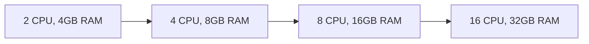
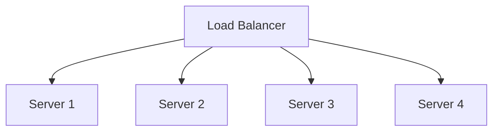
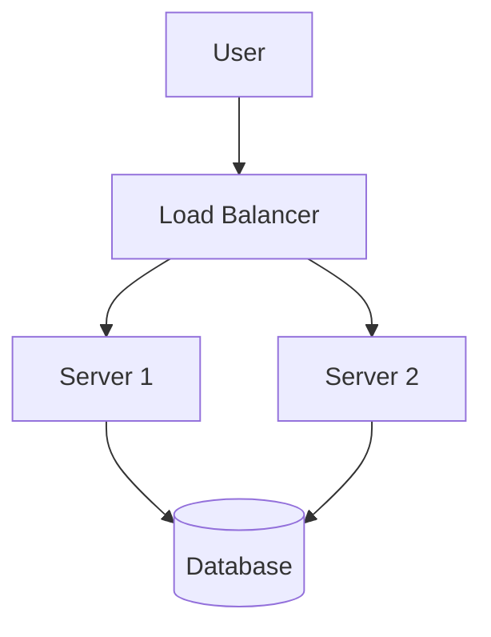

# Cloud Platforms Fundamentals Theory (Part 2)

## Table of Contents (Continued)

7. [Scalability and Reliability](#scalability-and-reliability)
8. [Cloud Security Fundamentals](#cloud-security-fundamentals)
9. [Cost Management](#cost-management)
10. [Cloud Migration Strategies](#cloud-migration-strategies)
11. [DevOps and Cloud](#devops-and-cloud)
12. [Future of Cloud Computing](#future-of-cloud-computing)
13. [Summary and Next Steps](#summary-and-next-steps)

---

## Scalability and Reliability

### Understanding Scalability

Scalability is the ability of a system to handle increased load by adding resources (vertical or horizontal scaling).

**Vertical Scaling (Scale Up):**

- **Definition**: Increasing the capacity of existing resources
- **Examples**: Upgrading from 2 CPU cores to 4 cores, 4GB RAM to 8GB RAM
- **Pros**: Simple, no application changes needed
- **Cons**: Limited by hardware maximums, downtime during upgrade
- **Use Cases**: Quick fixes, small-scale improvements



**Horizontal Scaling (Scale Out):**

- **Definition**: Adding more instances of resources
- **Examples**: Adding more servers to handle increased load
- **Pros**: No single point of failure, unlimited scale, cost-effective
- **Cons**: Requires application to be designed for distributed systems
- **Use Cases**: High availability, large-scale applications



**Auto-Scaling:**

Auto-scaling automatically adjusts compute resources based on defined conditions.

**Auto-Scaling Components:**

**1. Launch Configuration/Templates:**

```yaml
launch_template:
  name: "web-app-template"
  image_id: "ami-12345678"
  instance_type: "t3.medium"
  key_name: "my-keypair"
  security_groups: ["web-sg"]
  user_data: |
    #!/bin/bash
    yum update -y
    yum install -y httpd
    systemctl start httpd
    systemctl enable httpd
```

**2. Auto-Scaling Groups:**

```yaml
autoscaling_group:
  name: "web-app-asg"
  min_size: 2
  max_size: 10
  desired_capacity: 3
  launch_template: "web-app-template"
  target_groups: ["web-tg"]

  scaling_policies:
    - name: "scale-up"
      type: "target_tracking"
      metric: "CPUUtilization"
      target_value: 70

    - name: "scale-down"
      type: "target_tracking"
      metric: "CPUUtilization"
      target_value: 30
```

**3. CloudWatch Alarms:**

```yaml
cloudwatch_alarms:
  - name: "high-cpu-alarm"
    metric: "CPUUtilization"
    threshold: 80
    period: 300
    evaluation_periods: 2
    actions: ["autoscaling:PutScalingNotification"]

  - name: "low-cpu-alarm"
    metric: "CPUUtilization"
    threshold: 20
    period: 300
    evaluation_periods: 2
    actions: ["autoscaling:PutScalingNotification"]
```

**Scaling Strategies:**

**Reactive Scaling:**

- **Trigger**: Metrics-based (CPU, memory, request count)
- **Use Cases**: Applications with predictable load patterns
- **Pros**: Simple to implement
- **Cons**: May not respond fast enough to sudden spikes

**Predictive Scaling:**

- **Trigger**: Machine learning-based predictions
- **Use Cases**: Applications with predictable patterns
- **Pros**: Proactive scaling, better user experience
- **Cons**: Requires historical data, more complex

**Scheduled Scaling:**

- **Trigger**: Time-based schedules
- **Use Cases**: Applications with known traffic patterns
- **Pros**: Precise control, cost optimization
- **Cons**: Not suitable for unpredictable traffic

### Reliability and High Availability

**Reliability vs Availability:**

**Reliability:**

- **Definition**: Probability that a system will perform correctly over a period of time
- **Measured by**: MTBF (Mean Time Between Failures)
- **Focus**: Preventing failures

**Availability:**

- **Definition**: Percentage of time a system is operational
- **Measured by**: Uptime percentage (99.9%, 99.99%, etc.)
- **Focus**: Minimizing downtime

**Availability Tiers:**

**99.9% Availability (Three 9s):**

- **Downtime**: 8.77 hours per year
- **Use Cases**: Non-critical applications
- **Cost**: Lowest cost option
- **Implementation**: Single region, basic redundancy

**99.99% Availability (Four 9s):**

- **Downtime**: 52.6 minutes per year
- **Use Cases**: Business-critical applications
- **Cost**: Moderate cost
- **Implementation**: Multiple zones, automated failover

**99.999% Availability (Five 9s):**

- **Downtime**: 5.26 minutes per year
- **Use Cases**: Mission-critical applications
- **Cost**: Highest cost
- **Implementation**: Multiple regions, extensive redundancy

**High Availability Patterns:**

**1. Redundancy:**

**Active-Active Configuration:**



**Active-Passive Configuration:**

```mermaid
graph TB
    A[User] --> LB[Load Balancer]
    LB --> B[Server 1 (Active)]
    B --> DB1[(Database)]

    B -.-> C[Server 2 (Standby)]
    C -.-> DB2[(Database Replica)]
```

**2. Failover:**

**Automatic Failover:**

```yaml
# Database failover configuration
database:
  type: "multi-az"
  primary_az: "us-east-1a"
  standby_az: "us-east-1b"
  failover: "automatic"
  recovery_time: "1-2 minutes"

  backup:
    retention: 7
    backup_window: "03:00-04:00"

# Load balancer failover
load_balancer:
  health_check:
    path: "/health"
    interval: 30
    timeout: 5
    healthy_threshold: 2
    unhealthy_threshold: 3
  failure_threshold: 2
  recovery_time: "30 seconds"
```

**3. Circuit Breaker Pattern:**

```python
import time
import random
from enum import Enum

class CircuitState(Enum):
    CLOSED = 1
    OPEN = 2
    HALF_OPEN = 3

class CircuitBreaker:
    def __init__(self, failure_threshold=5, recovery_timeout=60):
        self.failure_threshold = failure_threshold
        self.recovery_timeout = recovery_timeout
        self.failure_count = 0
        self.last_failure_time = None
        self.state = CircuitState.CLOSED

    def call(self, func, *args, **kwargs):
        if self.state == CircuitState.OPEN:
            if time.time() - self.last_failure_time > self.recovery_timeout:
                self.state = CircuitState.HALF_OPEN
            else:
                raise Exception("Circuit breaker is OPEN")

        try:
            result = func(*args, **kwargs)
            if self.state == CircuitState.HALF_OPEN:
                self.state = CircuitState.CLOSED
                self.failure_count = 0
            return result
        except Exception as e:
            self.failure_count += 1
            self.last_failure_time = time.time()

            if self.failure_count >= self.failure_threshold:
                self.state = CircuitState.OPEN
            raise e

# Usage
circuit_breaker = CircuitBreaker()
result = circuit_breaker.call(external_service_call)
```

**4. Bulkhead Pattern:**

```python
# Separate thread pools for different services
from concurrent.futures import ThreadPoolExecutor

class BulkheadExecutor:
    def __init__(self, max_workers_dict):
        self.executors = {
            service: ThreadPoolExecutor(max_workers=max_workers)
            for service, max_workers in max_workers_dict.items()
        }

    def submit(self, service, func, *args, **kwargs):
        if service not in self.executors:
            raise ValueError(f"Service {service} not configured")
        return self.executors[service].submit(func, *args, **kwargs)

# Configuration
executors = BulkheadExecutor({
    'user-service': 10,
    'payment-service': 5,
    'notification-service': 2
})

# Usage
future = executors.submit('user-service', get_user_data, user_id)
result = future.result()
```

**Disaster Recovery Strategies:**

**Backup and Restore:**

- **Recovery Time**: Hours to days
- **Cost**: Lowest
- **Use Cases**: Non-critical data, development environments
- **Process**: Regular backups, restore from backup when needed

**Pilot Light:**

- **Recovery Time**: Minutes to hours
- **Cost**: Low to moderate
- **Use Cases**: Critical applications
- **Process**: Keep minimal critical services running, scale up during disaster

**Warm Standby:**

- **Recovery Time**: Minutes
- **Cost**: Moderate
- **Use Cases**: Important applications
- **Process**: Keep scaled-down version running, scale up during disaster

**Multi-Site:**

- **Recovery Time**: Seconds
- **Cost**: High
- **Use Cases**: Mission-critical applications
- **Process**: Run full-scale application in multiple regions

**Recovery Time Objective (RTO) and Recovery Point Objective (RPO):**

**RTO (Recovery Time Objective):**

- **Definition**: Maximum acceptable time to restore service
- **Example**: "RTO of 4 hours means service must be restored within 4 hours"

**RPO (Recovery Point Objective):**

- **Definition**: Maximum acceptable data loss measured in time
- **Example**: "RPO of 1 hour means can lose up to 1 hour of data"

```yaml
# Example: Disaster recovery plan
applications:
  web_app:
    criticality: "high"
    rto: "1 hour"
    rpo: "15 minutes"
    backup_frequency: "every 15 minutes"
    backup_retention: "30 days"
    regions:
      primary: "us-east-1"
      secondary: "us-west-2"

  database:
    criticality: "critical"
    rto: "30 minutes"
    rpo: "5 minutes"
    backup_frequency: "continuous"
    backup_retention: "90 days"
    regions:
      primary: "us-east-1"
      secondary: "us-west-2"
      tertiary: "eu-west-1"
```

---

## Cloud Security Fundamentals

### Shared Responsibility Model

The shared responsibility model defines which security aspects are managed by the cloud provider and which are managed by the customer.

**Cloud Provider Responsibilities (Security OF the cloud):**

- **Physical Security**: Data center security, environmental controls
- **Network Security**: Network infrastructure, DDoS protection
- **Hypervisor Security**: Virtualization layer security
- **Host Operating System**: Core infrastructure software
- **Compliance Certifications**: SOC, ISO, PCI DSS

**Customer Responsibilities (Security IN the cloud):**

- **Guest Operating System**: OS updates, patches, security configurations
- **Applications**: Application code, security vulnerabilities
- **Data**: Data classification, encryption, access control
- **Identity and Access Management**: User accounts, permissions
- **Network Configuration**: Security groups, firewall rules
- **Client-side Protection**: End-user devices, mobile apps

**Responsibility Matrix:**

| Security Domain         | Cloud Provider | Customer |
| ----------------------- | -------------- | -------- |
| Physical Security       | ✓              |          |
| Network Infrastructure  | ✓              |          |
| Virtualization Layer    | ✓              |          |
| Operating System        |                | ✓        |
| Applications            |                | ✓        |
| Data                    |                | ✓        |
| Network Security Groups |                | ✓        |
| Identity Management     |                | ✓        |
| Client Applications     |                | ✓        |

### Identity and Access Management (IAM)

IAM controls who can access cloud resources and what actions they can perform.

**IAM Components:**

**1. Users:**

- **Root User**: Account owner with full access
- **IAM Users**: Individual user accounts
- **Service Accounts**: Applications and services

**2. Groups:**

- **Purpose**: Organize users with similar permissions
- **Benefits**: Easier to manage permissions
- **Example**: "Developers", "Admins", "Read-Only"

**3. Roles:**

- **Purpose**: Define permissions that can be assumed by users or services
- **Types**: Service roles, cross-account roles, instance profiles
- **Benefits**: No permanent permissions, temporary access

**4. Policies:**

- **Definition**: Documents that define permissions
- **Format**: JSON documents
- **Types**: AWS managed policies, customer managed policies, inline policies

**IAM Policy Example:**

```json
{
  "Version": "2012-10-17",
  "Statement": [
    {
      "Effect": "Allow",
      "Action": ["s3:GetObject", "s3:PutObject", "s3:ListBucket"],
      "Resource": ["arn:aws:s3:::my-app-bucket", "arn:aws:s3:::my-app-bucket/*"]
    },
    {
      "Effect": "Deny",
      "Action": "s3:DeleteObject",
      "Resource": ["arn:aws:s3:::my-app-bucket/production/*"]
    }
  ]
}
```

**IAM Best Practices:**

**1. Principle of Least Privilege:**

```json
{
  "Version": "2012-10-17",
  "Statement": [
    {
      "Effect": "Allow",
      "Action": ["s3:GetObject", "s3:PutObject"],
      "Resource": ["arn:aws:s3:::my-app-bucket/user-data/${aws:username}/*"]
    }
  ]
}
```

**2. Use Groups for Permission Management:**

```yaml
# Developer group policy
developer_group:
  name: "developers"
  policies:
    - "EC2ReadOnly"
    - "S3ReadWrite"

# Admin group policy
admin_group:
  name: "admins"
  policies:
    - "AdministratorAccess"

# Read-only group policy
readonly_group:
  name: "readonly"
  policies:
    - "ReadOnlyAccess"
```

**3. Enable Multi-Factor Authentication (MFA):**

```python
import boto3
import qrcode
from io import BytesIO
import base64

def enable_mfa_for_user(username):
    iam = boto3.client('iam')

    # Create virtual MFA device
    response = iam.create_virtual_mf_device(VirtualMfaDeviceName=username)

    # Get QR code
    qr_code_url = response['VirtualMFADevice']['QRCodePNG']

    print(f"QR Code for {username}:")
    print(qr_code_url)

    # Enable MFA (would need user to authenticate with MFA device)
    # iam.enable_mfa_device(UserName=username, SerialNumber=serial_number, AuthenticationCode1=code1, AuthenticationCode2=code2)
```

**4. Regular Access Reviews:**

```python
def generate_access_report():
    iam = boto3.client('iam')

    # Get all users
    users = iam.list_users()['Users']

    report = []
    for user in users:
        user_name = user['UserName']

        # Get user policies
        user_policies = iam.list_user_policies(UserName=user_name)
        attached_policies = iam.list_attached_user_policies(UserName=user_name)

        # Get last activity
        access_keys = iam.list_access_keys(UserName=user_name)
        last_activity = None

        for key in access_keys['AccessKeyMetadata']:
            if key['LastUsedDate']:
                if not last_activity or key['LastUsedDate'] > last_activity:
                    last_activity = key['LastUsedDate']

        report.append({
            'user': user_name,
            'policies': user_policies['PolicyNames'] + [p['PolicyName'] for p in attached_policies['AttachedPolicies']],
            'last_activity': last_activity,
            'needs_review': not last_activity or (datetime.now() - last_activity).days > 90
        })

    return report
```

### Data Encryption

Data encryption protects data at rest and in transit from unauthorized access.

**Encryption at Rest:**

**Server-Side Encryption:**

- **Automatic**: Encryption managed by cloud provider
- **Customer Managed**: You manage encryption keys
- **Transparent**: Applications work without changes

```yaml
# S3 bucket encryption configuration
s3_bucket:
  name: "secure-data-bucket"
  encryption:
    type: "AES256" # or "aws:kms"
    kms_key_id: "arn:aws:kms:us-east-1:123456789012:key/12345678-1234-1234-1234-123456789012"

  bucket_policy:
    effect: "Deny"
    actions: ["s3:PutObject"]
    principals: ["*"]
    conditions:
      StringNotEquals:
        "s3:x-amz-server-side-encryption": "AES256"
```

**Client-Side Encryption:**

- **Application Level**: Encrypt data before sending to cloud
- **Full Control**: You manage encryption process
- **Use Cases**: Highly sensitive data, compliance requirements

```python
import boto3
import base64
from cryptography.fernet import Fernet

class S3ClientSideEncryption:
    def __init__(self, key):
        self.cipher = Fernet(key)
        self.s3 = boto3.client('s3')

    def upload_encrypted(self, bucket, key, data):
        # Encrypt data
        encrypted_data = self.cipher.encrypt(data.encode())

        # Upload encrypted data
        self.s3.put_object(
            Bucket=bucket,
            Key=key,
            Body=encrypted_data,
            ServerSideEncryption='AES256',
            Metadata={
                'encrypted': 'true',
                'encryption_method': 'client-side'
            }
        )

    def download_decrypted(self, bucket, key):
        # Download encrypted data
        response = self.s3.get_object(Bucket=bucket, Key=key)
        encrypted_data = response['Body'].read()

        # Decrypt data
        decrypted_data = self.cipher.decrypt(encrypted_data)

        return decrypted_data.decode()
```

**Encryption in Transit:**

**HTTPS/TLS:**

- **Certificate Management**: SSL/TLS certificates
- **HTTP to HTTPS Redirect**: Force encrypted connections
- **Certificate Monitoring**: Track certificate expiration

```yaml
# Load balancer HTTPS configuration
load_balancer:
  name: "web-app-lb"
  listeners:
    - port: 80
      protocol: "HTTP"
      rules:
        - redirect:
            port: 443
            protocol: "HTTPS"
            status_code: "HTTP_301"

    - port: 443
      protocol: "HTTPS"
      ssl_policy: "ELBSecurityPolicy-TLS-1-2-2017-01"
      certificate_arn: "arn:aws:acm:us-east-1:123456789012:certificate/12345678-1234-1234-1234-123456789012"
```

**VPN and Private Connectivity:**

- **Site-to-Site VPN**: Connect on-premises to cloud
- **Direct Connect**: Dedicated network connection
- **PrivateLink**: Private access to cloud services

### Security Monitoring and Compliance

**Security Monitoring:**

**1. Log Collection:**

```yaml
# CloudTrail configuration for audit logging
cloudtrail:
  name: "multi-region-trail"
  include_global_service_events: true
  is_multi_region_trail: true

  s3_bucket: "my-audit-logs-bucket"
  sns_topic: "security-alerts"

  cloudwatch_logs:
    log_group: "/aws/cloudtrail"
    log_stream: "multi-region"

  event_selectors:
    - read_write_type: "All"
      include_management_events: true
      exclude_management_event_sources: ["kms.amazonaws.com"]
```

**2. Security Information and Event Management (SIEM):**

```python
import json
import boto3
from datetime import datetime, timedelta

def analyze_security_events():
    cloudtrail = boto3.client('cloudtrail')

    # Get events from last 24 hours
    end_time = datetime.now()
    start_time = end_time - timedelta(hours=24)

    events = cloudtrail.lookup_events(
        LookupAttributes=[
            {
                'AttributeKey': 'EventName',
                'AttributeValue': 'ConsoleLogin'
            }
        ],
        StartTime=start_time,
        EndTime=end_time
    )

    suspicious_activities = []

    for event in events['Events']:
        event_time = event['EventTime']
        username = event['Username']
        source_ip = event.get('CloudTrailEvent', {})

        # Check for unusual login patterns
        if is_suspicious_login(event):
            suspicious_activities.append({
                'time': event_time,
                'user': username,
                'ip': source_ip,
                'risk_level': 'HIGH'
            })

    return suspicious_activities

def is_suspicious_login(event):
    # Implement logic to detect suspicious activities
    # - Multiple failed login attempts
    # - Logins from unusual locations
    # - Logins outside business hours
    # - Privilege escalations
    pass
```

**3. Intrusion Detection:**

```yaml
# AWS GuardDuty configuration
guardduty:
  enable: true

  finding_publishing_frequency: "FIFTEEN_MIN"

  destinations:
    - type: "S3"
      destination_id: "arn:aws:guardduty:us-east-1:123456789012:detector/12345678-1234-1234-1234-123456789012"

  member_accounts:
    - account_id: "111111111111"
    - account_id: "222222222222"
```

**Compliance Frameworks:**

**1. SOC 2 (Service Organization Control 2):**

- **Type I**: Design effectiveness at a point in time
- **Type II**: Operating effectiveness over a period
- **Focus**: Security, availability, processing integrity, confidentiality, privacy

**2. ISO 27001:**

- **Focus**: Information security management
- **Requirements**: 114 controls across 14 domains
- **Certification**: Valid for 3 years

**3. PCI DSS (Payment Card Industry Data Security Standard):**

- **Focus**: Cardholder data protection
- **Requirements**: 12 requirements across 6 goals
- **Scope**: All systems that store, process, or transmit cardholder data

**4. GDPR (General Data Protection Regulation):**

- **Focus**: Data protection and privacy
- **Requirements**: Lawful basis, consent, data minimization
- **Penalties**: Up to 4% of annual global turnover

**Compliance Automation:**

```python
import boto3
from botocore.exceptions import ClientError

class ComplianceChecker:
    def __init__(self):
        self.config = boto3.client('config')
        self.iam = boto3.client('iam')

    def check_mfa_enabled(self):
        """Check if MFA is enabled for all IAM users"""
        users = self.iam.list_users()['Users']
        users_without_mfa = []

        for user in users:
            try:
                mfa_devices = self.iam.list_mfa_devices(UserName=user['UserName'])
                if not mfa_devices['MFADevices']:
                    users_without_mfa.append(user['UserName'])
            except ClientError:
                users_without_mfa.append(user['UserName'])

        return {
            'check': 'MFA_ENABLED',
            'status': 'COMPLIANT' if not users_without_mfa else 'NON_COMPLIANT',
            'violations': users_without_mfa
        }

    def check_unused_iam_credentials(self):
        """Check for unused IAM credentials"""
        users = self.iam.list_users()['Users']
        unused_credentials = []

        for user in users:
            access_keys = self.iam.list_access_keys(UserName=user['UserName'])

            for key in access_keys['AccessKeyMetadata']:
                last_used = self.iam.get_access_key_last_used(AccessKeyId=key['AccessKeyId'])

                if not last_used['AccessKeyLastUsed']:
                    unused_credentials.append({
                        'user': user['UserName'],
                        'access_key_id': key['AccessKeyId'],
                        'create_date': key['CreateDate']
                    })

        return {
            'check': 'UNUSED_CREDENTIALS',
            'status': 'COMPLIANT' if not unused_credentials else 'NON_COMPLIANT',
            'violations': unused_credentials
        }
```

---

## Cost Management

### Understanding Cloud Pricing Models

**Pay-as-you-go Pricing:**

- **Characteristics**: Pay only for what you use
- **Benefits**: No upfront costs, flexible scaling
- **Use Cases**: Variable workloads, experimentation
- **Considerations**: Costs can be unpredictable

**Reserved Instances/Commitments:**

- **Characteristics**: 1-3 year commitments for discounted rates
- **Benefits**: Significant cost savings (up to 75%)
- **Use Cases**: Predictable workloads, baseline capacity
- **Types**: Standard convertible, scheduled

**Spot Instances/Preemptible VMs:**

- **Characteristics**: Use spare compute capacity at discounted rates
- **Benefits**: Massive cost savings (up to 90%)
- **Use Cases**: Batch processing, testing, non-critical workloads
- **Risks**: Instances can be terminated with short notice

**Savings Plans:**

- **Characteristics**: Flexible commitment across services
- **Benefits**: Consistent discounts with flexibility
- **Use Cases**: Multi-service architectures
- **Coverage**: Compute, machine learning, container services

### Cost Optimization Strategies

**1. Right-sizing Resources:**

**Current State Analysis:**

```python
import boto3
import pandas as pd
from datetime import datetime, timedelta

def analyze_instance_utilization():
    cloudwatch = boto3.client('cloudwatch')
    ec2 = boto3.client('ec2')

    # Get all running instances
    instances = ec2.describe_instances(Filters=[
        {'Name': 'instance-state-name', 'Values': ['running']}
    ])

    recommendations = []

    for reservation in instances['Reservations']:
        for instance in reservation['Instances']:
            instance_id = instance['InstanceId']
            instance_type = instance['InstanceType']

            # Get CPU utilization
            cpu_metrics = cloudwatch.get_metric_statistics(
                Namespace='AWS/EC2',
                MetricName='CPUUtilization',
                Dimensions=[
                    {
                        'Name': 'InstanceId',
                        'Value': instance_id
                    }
                ],
                StartTime=datetime.now() - timedelta(days=30),
                EndTime=datetime.now(),
                Period=3600,
                Statistics=['Average']
            )

            if cpu_metrics['Datapoints']:
                avg_cpu = sum(dp['Average'] for dp in cpu_metrics['Datapoints']) / len(cpu_metrics['Datapoints'])

                # Recommendation logic
                if avg_cpu < 20:
                    recommendations.append({
                        'instance_id': instance_id,
                        'current_type': instance_type,
                        'avg_cpu': avg_cpu,
                        'recommendation': 'downsize',
                        'suggested_type': get_smaller_instance_type(instance_type)
                    })

    return recommendations

def get_smaller_instance_type(current_type):
    # Logic to find appropriate smaller instance type
    type_hierarchy = {
        't3.xlarge': 't3.large',
        't3.large': 't3.medium',
        'm5.xlarge': 'm5.large',
        'm5.large': 'm5.medium'
    }
    return type_hierarchy.get(current_type, current_type)
```

**2. Reserved Instance Optimization:**

```python
def analyze_reserved_instances():
    ec2 = boto3.client('ec2')

    # Get all running instances
    instances = ec2.describe_instances(Filters=[
        {'Name': 'instance-state-name', 'Values': ['running']}
    ])

    # Get current reserved instances
    reserved_instances = ec2.describe_reserved_instances()

    # Analyze utilization
    ri_utilization = []

    for ri in reserved_instances['ReservedInstances']:
        ri_id = ri['ReservedInstancesId']
        instance_type = ri['InstanceType']
        state = ri['State']

        if state == 'active':
            # Calculate utilization percentage
            utilization = calculate_ri_utilization(ri_id, instance_type)
            ri_utilization.append({
                'ri_id': ri_id,
                'instance_type': instance_type,
                'utilization': utilization,
                'recommendation': 'keep' if utilization > 0.8 else 'modify'
            })

    return ri_utilization
```

**3. Storage Optimization:**

**S3 Lifecycle Policies:**

```json
{
  "Rules": [
    {
      "ID": "StandardToIAtoGlacier",
      "Status": "Enabled",
      "Filter": {
        "Prefix": "logs/"
      },
      "Transitions": [
        {
          "Days": 30,
          "StorageClass": "STANDARD_IA"
        },
        {
          "Days": 90,
          "StorageClass": "GLACIER"
        },
        {
          "Days": 365,
          "StorageClass": "DEEP_ARCHIVE"
        }
      ]
    },
    {
      "ID": "DeleteOldBackups",
      "Status": "Enabled",
      "Filter": {
        "Prefix": "backups/"
      },
      "Expiration": {
        "Days": 90
      }
    }
  ]
}
```

**Database Storage Optimization:**

```sql
-- PostgreSQL storage optimization
-- 1. Analyze table sizes
SELECT
    schemaname,
    tablename,
    attname,
    n_distinct,
    correlation
FROM pg_stats
WHERE schemaname = 'public'
ORDER BY tablename, attname;

-- 2. Check index usage
SELECT
    schemaname,
    tablename,
    indexname,
    idx_scan,
    idx_tup_read,
    idx_tup_fetch
FROM pg_stat_user_indexes
WHERE idx_scan = 0;

-- 3. Unused indexes
SELECT
    indexrelid::regclass as index,
    relid::regclass as table
FROM pg_stat_user_indexes
WHERE idx_scan = 0;

-- 4. Table bloat analysis
SELECT
    schemaname,
    tablename,
    n_dead_tup,
    n_live_tup,
    (n_dead_tup::float / NULLIF(n_live_tup, 0)) * 100 as dead_tuple_ratio
FROM pg_stat_user_tables
WHERE n_dead_tup > 0;
```

**4. Network Cost Optimization:**

**Data Transfer Analysis:**

```python
import boto3
from datetime import datetime, timedelta

def analyze_data_transfer_costs():
    cloudwatch = boto3.client('cloudwatch')
    billing = boto3.client('ce')  # Cost Explorer

    # Get data transfer costs
    cost_data = billing.get_cost_and_usage(
        TimePeriod={
            'Start': (datetime.now() - timedelta(days=30)).strftime('%Y-%m-%d'),
            'End': datetime.now().strftime('%Y-%m-%d')
        },
        Granularity='DAILY',
        Metrics=['UnblendedCost'],
        GroupBy=[
            {
                'Type': 'DIMENSION',
                'Key': 'USAGE_TYPE'
            }
        ],
        Filter={
            'Dimensions': {
                'Key': 'SERVICE',
                'Values': ['AmazonCloudWatch', 'AmazonEC2']
            }
        }
    )

    transfer_costs = []
    for result in cost_data['ResultsByTime']:
        date = result['TimePeriod']['Start']
        for group in result['Groups']:
            if 'DataTransfer' in group['Keys'][0]:
                transfer_costs.append({
                    'date': date,
                    'usage_type': group['Keys'][0],
                    'cost': group['Metrics']['UnblendedCost']['Amount']
                })

    return transfer_costs
```

### Cost Monitoring and Alerting

**Cost Budgets:**

```json
{
  "BudgetName": "MonthlyEC2Budget",
  "BudgetLimit": {
    "Amount": "1000",
    "Unit": "USD"
  },
  "TimeUnit": "MONTHLY",
  "BudgetType": "COST",
  "Notification": {
    "ComparisonOperator": "GREATER_THAN",
    "Threshold": 80,
    "ThresholdType": "PERCENTAGE",
    "NotificationType": "ACTUAL"
  },
  "Notification": {
    "ComparisonOperator": "GREATER_THAN",
    "Threshold": 100,
    "ThresholdType": "PERCENTAGE",
    "NotificationType": "FORECASTED"
  }
}
```

**Cost Anomaly Detection:**

```python
def setup_cost_anomaly_detection():
    ce = boto3.client('ce')  # Cost Explorer

    # Create cost anomaly monitor
    response = ce.create_anomaly_monitor(
        AnomalyMonitor={
            'MonitorName': 'EC2CostAnomalies',
            'MonitorType': 'DIMENSIONAL',
            'MonitorSpecification': {
                'Dimensions': {
                    'Key': 'SERVICE',
                    'Values': ['AmazonEC2']
                }
            },
            'StatisticalMethod': 'ANOMALY_DETECTION'
        }
    )

    return response['MonitorArn']
```

**Automated Cost Optimization:**

```python
def automated_cost_optimization():
    """Automated cost optimization based on policies"""
    recommendations = []

    # 1. Stop idle instances
    idle_instances = find_idle_instances()
    for instance in idle_instances:
        stop_instance(instance['InstanceId'])
        recommendations.append(f"Stopped idle instance {instance['InstanceId']}")

    # 2. Delete unattached volumes
    unattached_volumes = find_unattached_volumes()
    for volume in unattached_volumes:
        delete_volume(volume['VolumeId'])
        recommendations.append(f"Deleted unattached volume {volume['VolumeId']}")

    # 3. Clean up old snapshots
    old_snapshots = find_old_snapshots(90)  # Older than 90 days
    for snapshot in old_snapshots:
        delete_snapshot(snapshot['SnapshotId'])
        recommendations.append(f"Deleted old snapshot {snapshot['SnapshotId']}")

    # 4. Optimize S3 lifecycle
    s3_buckets = list_s3_buckets()
    for bucket in s3_buckets:
        apply_lifecycle_policy(bucket)
        recommendations.append(f"Applied lifecycle policy to {bucket}")

    return recommendations
```

### FinOps (Financial Operations)

**FinOps Culture:**

- **Collaboration**: Finance, engineering, and business teams work together
- **Data-driven decisions**: Use data to guide cloud spending decisions
- **Continuous optimization**: Regular review and optimization of cloud costs
- **Accountability**: Clear ownership of cloud costs

**FinOps Metrics:**

**1. Unit Economics:**

```python
def calculate_unit_economics():
    """Calculate cost per unit of business value"""

    # Get monthly costs
    monthly_costs = get_monthly_costs()

    # Get business metrics
    monthly_users = get_monthly_active_users()
    monthly_transactions = get_monthly_transactions()

    # Calculate unit costs
    cost_per_user = monthly_costs / monthly_users
    cost_per_transaction = monthly_costs / monthly_transactions

    return {
        'cost_per_user': cost_per_user,
        'cost_per_transaction': cost_per_transaction,
        'total_monthly_cost': monthly_costs,
        'monthly_users': monthly_users,
        'monthly_transactions': monthly_transactions
    }
```

**2. Waste Identification:**

```python
def identify_cloud_waste():
    """Identify and quantify cloud waste"""
    waste_categories = {
        'idle_resources': 0,
        'overprovisioned_resources': 0,
        'unused_storage': 0,
        'data_transfer': 0,
        'license_overuse': 0
    }

    # Check for idle resources
    idle_instances = find_idle_instances()
    waste_categories['idle_resources'] = sum(instance['hourly_cost'] for instance in idle_instances) * 24 * 30

    # Check for overprovisioned resources
    overprovisioned = find_overprovisioned_instances()
    waste_categories['overprovisioned_resources'] = sum(instance['waste'] for instance in overprovisioned) * 24 * 30

    # Check for unused storage
    unused_storage = find_unused_storage()
    waste_categories['unused_storage'] = unused_storage['monthly_cost']

    return waste_categories
```

**3. ROI Analysis:**

```python
def calculate_cloud_roi():
    """Calculate return on investment for cloud migration"""

    # Current on-premises costs
    on_prem_costs = {
        'hardware': 50000,  # Annual
        'software_licenses': 30000,  # Annual
        'maintenance': 20000,  # Annual
        'power_cooling': 10000,  # Annual
        'staff': 100000  # Annual
    }

    # Cloud costs
    cloud_costs = {
        'compute': 80000,  # Annual
        'storage': 20000,  # Annual
        'networking': 10000,  # Annual
        'managed_services': 15000,  # Annual
        'support': 25000  # Annual
    }

    # Benefits
    benefits = {
        'reduced_downtime': 30000,  # Annual savings
        'faster_deployment': 50000,  # Value of faster time to market
        'scalability': 25000,  # Value of elastic capacity
        'reduced_maintenance': 20000  # Reduced operational overhead
    }

    on_prem_total = sum(on_prem_costs.values())
    cloud_total = sum(cloud_costs.values())
    total_benefits = sum(benefits.values())

    # Calculate ROI
    investment = cloud_total + (on_prem_total - cloud_total)  # Incremental investment
    net_benefit = total_benefits - cloud_total
    roi = (net_benefit / investment) * 100

    return {
        'on_prem_annual_cost': on_prem_total,
        'cloud_annual_cost': cloud_total,
        'annual_benefits': total_benefits,
        'net_annual_benefit': net_benefit,
        'roi_percentage': roi,
        'payback_period_months': (investment / (net_benefit / 12))
    }
```

This completes the extended Cloud Platforms Fundamentals Theory. The content covers scalability, reliability, security, and cost management - all critical aspects of cloud computing that developers and system architects need to understand. Each section includes practical examples, code snippets, and real-world scenarios to help understand these concepts in action.

The next sections would cover cloud migration strategies, DevOps integration, and the future of cloud computing to complete the comprehensive theory coverage.

## 🤔 Common Confusions

### Scalability & Performance

1. **Vertical vs Horizontal scaling confusion**: Vertical scaling (scaling up) increases server power, horizontal scaling (scaling out) adds more servers
2. **Auto-scaling triggers**: Understanding what metrics to use for scaling decisions (CPU, memory, requests per second, custom metrics)
3. **Load balancing algorithms**: Round-robin, least connections, weighted algorithms - choosing the right one for your application
4. **Caching strategies**: Application-level, database-level, CDN caching - different types and when to use each

### Reliability & Availability

5. **High availability vs disaster recovery**: High availability prevents downtime, disaster recovery handles catastrophic failures
6. **RTO vs RPO understanding**: Recovery Time Objective (how quickly to recover) vs Recovery Point Objective (acceptable data loss)
7. **Circuit breaker pattern**: Understanding when to use circuit breakers to prevent cascade failures
8. **Graceful degradation**: Designing systems that provide reduced functionality during partial failures

### Security Fundamentals

9. **Shared responsibility model confusion**: Understanding what cloud provider handles vs what customer must manage
10. **Zero trust security model**: Never trust, always verify approach to security architecture
11. **Encryption at rest vs in transit**: Different encryption strategies and compliance requirements
12. **Identity and access management**: Role-based vs attribute-based access control for cloud resources

### Cost Management

13. **Cost allocation vs cost attribution**: Cost allocation groups costs by resource, attribution tracks costs to specific users/projects
14. **Reserved instance vs savings plan confusion**: Reserved instances are specific to instance types, savings plans offer more flexibility
15. **Data egress costs surprises**: Often much higher than expected, especially for cross-region transfers
16. **Waste identification challenges**: Finding idle resources, overprovisioned instances, orphaned volumes, unused IP addresses

---

## 📝 Micro-Quiz: Cloud Platforms Advanced Concepts

**Instructions**: Answer these 6 questions. Need 5/6 (83%) to pass.

1. **Question**: What's the main difference between scaling up and scaling out?
   - a) Scaling up is faster
   - b) Scaling up increases server power, scaling out adds more servers
   - c) They are identical operations
   - d) Scaling out is more expensive

2. **Question**: In the shared responsibility model, what is typically the customer's responsibility?
   - a) Physical security of data centers
   - b) Network infrastructure management
   - c) Application-level security
   - d) Hardware maintenance

3. **Question**: What's the primary purpose of a load balancer?
   - a) Increase server performance
   - b) Distribute traffic across multiple servers
   - c) Reduce data transfer costs
   - d) Improve security

4. **Question**: What does RTO stand for in disaster recovery planning?
   - a) Recovery Time Objective
   - b) Response Time Objective
   - c) Resource Time Optimization
   - d) Risk Tolerance Organization

5. **Question**: Which type of scaling automatically adjusts capacity based on demand?
   - a) Manual scaling
   - b) Scheduled scaling
   - c) Dynamic scaling
   - d) Fixed scaling

6. **Question**: What are the two main types of encryption in cloud security?
   - a) In-memory and in-storage
   - b) At-rest and in-transit
   - c) Client-side and server-side
   - d) Software and hardware

**Answer Key**: 1-b, 2-c, 3-b, 4-a, 5-c, 6-b

---

## 🎯 Reflection Prompts

### 1. System Design Thinking

Think about the last time you experienced a slow website or application. What could have caused the performance issues? Was it a database bottleneck, network latency, or insufficient server capacity? How would you redesign that system using cloud scalability principles? This reflection helps you understand how cloud platforms solve real-world performance problems and what design decisions matter most.

### 2. Business Risk Assessment

Consider a business you know that experienced downtime or security issues. What was the impact? Lost sales, damaged reputation, compliance violations? How would cloud reliability features like multi-region deployment, automated backups, and monitoring help prevent or mitigate these risks? This thinking helps you connect technical cloud features to real business value and risk management.

### 3. Cost-Benefit Analysis

Imagine you're responsible for choosing between on-premises infrastructure and cloud for a growing business. What factors would you consider? Initial investment vs ongoing costs, technical expertise required, scalability needs, security requirements, compliance obligations? This analysis helps you understand why organizations choose cloud platforms and how to evaluate different deployment models.

---

## 🚀 Mini Sprint Project: Cloud Performance & Cost Analyzer

**Time Estimate**: 2-3 hours  
**Difficulty**: Intermediate

### Project Overview

Create a web application that analyzes cloud resource performance and cost patterns, providing optimization recommendations and budget tracking.

### Core Features

1. **Resource Monitoring Dashboard**
   - Real-time resource utilization tracking (CPU, memory, storage, network)
   - Performance metrics visualization (response times, throughput, error rates)
   - Historical performance data analysis and trend identification
   - Automated performance alert system

2. **Cost Analysis & Tracking**
   - Detailed cost breakdown by service, region, and time period
   - Budget tracking with spending alerts and predictions
   - Cost comparison between different pricing models
   - ROI analysis for cloud vs on-premises scenarios

3. **Optimization Engine**
   - Right-sizing recommendations for over/under-provisioned resources
   - Reserved instance opportunity identification
   - Data transfer cost optimization suggestions
   - Security cost-benefit analysis

4. **Reporting & Insights**
   - Automated cost and performance reports
   - Executive dashboard with key metrics
   - Compliance reporting for audit requirements
   - Custom report builder with drill-down capabilities

### Technical Requirements

- **Frontend**: React/Vue.js with interactive dashboards and charts
- **Backend**: Python/Node.js for data processing and analysis
- **Database**: Time-series database for performance data (InfluxDB/TimescaleDB)
- **APIs**: Cloud provider API integration for real-time data

### Success Criteria

- [ ] Dashboard provides clear and actionable insights
- [ ] Cost tracking is accurate and provides useful alerts
- [ ] Optimization recommendations are practical and valuable
- [ ] Reports meet executive and technical audience needs
- [ ] Interface is intuitive and responsive

### Extension Ideas

- Add predictive analytics for cost and performance forecasting
- Include multi-cloud cost comparison capabilities
- Implement automated optimization actions
- Add compliance and security assessment features

---

## 🌟 Full Project Extension: Enterprise Cloud Operations Management Platform

**Time Estimate**: 15-20 hours  
**Difficulty**: Advanced

### Project Overview

Build a comprehensive cloud operations management platform that provides enterprise-grade monitoring, optimization, security, and governance across multi-cloud environments with AI-powered insights and automation.

### Advanced Features

1. **Unified Cloud Operations Center**
   - **Multi-Cloud Monitoring**: Unified view across AWS, Azure, Google Cloud, private clouds
   - **Real-Time Observability**: Metrics, logs, traces with intelligent correlation
   - **Predictive Analytics**: AI-powered anomaly detection and capacity planning
   - **Incident Management**: Automated incident response and resolution workflows

2. **Intelligent Cost & Resource Optimization**
   - **AI-Powered Right-Sizing**: Machine learning recommendations for optimal resource allocation
   - **FinOps Automation**: Automated cost optimization and budget enforcement
   - **Carbon Footprint Tracking**: Environmental impact monitoring and optimization
   - **Resource Governance**: Automated policy enforcement and compliance checking

3. **Advanced Security & Compliance**
   - **Threat Intelligence**: Real-time threat detection and automated response
   - **Compliance Automation**: Continuous compliance monitoring and reporting
   - **Zero Trust Architecture**: Identity-centric security model implementation
   - **Data Protection**: Automated encryption, key management, and data classification

4. **DevOps & Platform Engineering**
   - **GitOps Integration**: Infrastructure and application deployment automation
   - **Platform as a Service**: Internal platform engineering and self-service capabilities
   - **Service Mesh Management**: Microservices communication and security
   - **Policy as Code**: Automated policy enforcement across all cloud resources

5. **Business Intelligence & Governance**
   - **Executive Dashboards**: C-level visibility into cloud investments and performance
   - **Governance Automation**: Automated policy enforcement and exception management
   - **Portfolio Management**: Application lifecycle and resource ownership tracking
   - **Vendor Management**: Multi-cloud vendor relationship and contract optimization

### Technical Architecture

```
Enterprise Cloud Operations Platform
├── Operations Center/
│   ├── Multi-cloud monitoring
│   ├── Real-time observability
│   ├── Predictive analytics
│   └── Incident management
├── Optimization Engine/
│   ├── AI right-sizing
│   ├── FinOps automation
│   ├── Carbon tracking
│   └── Resource governance
├── Security Platform/
│   ├── Threat intelligence
│   ├── Compliance automation
│   ├── Zero trust architecture
│   └── Data protection
├── DevOps Integration/
│   ├── GitOps automation
│   ├── Platform engineering
│   ├── Service mesh
│   └── Policy as code
└── Business Intelligence/
    ├── Executive dashboards
    ├── Governance automation
    ├── Portfolio management
    └── Vendor management
```

### Advanced Implementation Requirements

- **Enterprise Scale**: Handle millions of resources across multiple cloud environments
- **AI/ML Integration**: Advanced analytics, prediction, and optimization algorithms
- **Security First**: Zero-trust architecture with comprehensive security controls
- **Compliance Ready**: Support for major industry standards and regulations
- **High Availability**: 99.99% uptime with disaster recovery capabilities

### Learning Outcomes

- Mastery of enterprise cloud operations and management
- Advanced knowledge of cloud cost optimization and FinOps practices
- Expertise in cloud security, compliance, and risk management
- Skills in DevOps automation and platform engineering
- Understanding of business governance and strategy in cloud environments

### Success Metrics

- [ ] Platform successfully manages enterprise-scale multi-cloud environments
- [ ] Optimization features provide measurable cost savings and efficiency improvements
- [ ] Security and compliance features meet enterprise requirements
- [ ] DevOps automation reduces operational overhead and improves reliability
- [ ] Business intelligence provides actionable insights for strategic decision making
- [ ] Platform performance and reliability meet enterprise standards

This enterprise platform will prepare you for senior cloud architect roles, DevOps leadership positions, cloud platform engineering, and cloud strategy consulting, providing the skills and experience needed to lead cloud transformation initiatives in large organizations.
