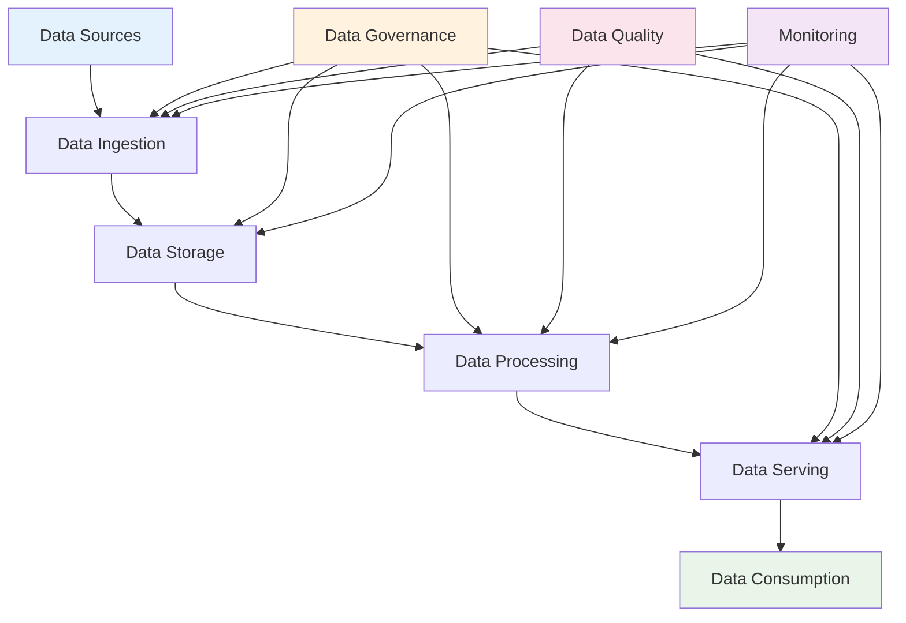

# Data Engineering Fundamentals: Theory and Core Principles

## Table of Contents

1. [Introduction to Data Engineering](#introduction-to-data-engineering)
2. [Core Data Engineering Concepts](#core-data-engineering-concepts)
3. [Data Architecture Principles](#data-architecture-principles)
4. [Data Storage and Management](#data-storage-and-management)
5. [Data Processing Paradigms](#data-processing-paradigms)
6. [Data Quality and Governance](#data-quality-and-governance)
7. [Scalability and Performance](#scalability-and-performance)
8. [Data Security and Compliance](#data-security-and-compliance)
9. [Modern Data Stack](#modern-data-stack)
10. [Data Engineering Patterns](#data-engineering-patterns)
11. [Emerging Trends and Future](#emerging-trends-and-future)

## Introduction to Data Engineering

Data Engineering is the practice of designing, building, and maintaining systems that enable data-driven decision making. It sits at the intersection of software engineering, data science, and business requirements, focusing on the infrastructure and processes that make data accessible, reliable, and actionable.

### The Evolution of Data Engineering

#### Traditional Data Engineering (2010s)

- **Batch Processing**: ETL (Extract, Transform, Load) pipelines
- **Centralized Warehouses**: Traditional data warehouses
- **Structured Data**: Primarily relational databases
- **Scheduled Jobs**: Daily or hourly batch jobs

#### Modern Data Engineering (2020s)

- **Real-time Processing**: Stream processing and event-driven architectures
- **Distributed Systems**: Cloud-native data platforms
- **Unstructured Data**: Support for diverse data types
- **Continuous Data Flows**: Real-time and near-real-time processing

### The Data Engineering Value Chain



### Key Responsibilities of Data Engineers

1. **Data Architecture Design**
   - System design and infrastructure planning
   - Technology stack selection
   - Scalability and performance optimization

2. **Data Pipeline Development**
   - Building ETL/ELT pipelines
   - Real-time stream processing
   - Data transformation and enrichment

3. **Data Storage Management**
   - Database design and optimization
   - Data modeling and schema design
   - Performance tuning and maintenance

4. **Data Quality Assurance**
   - Data validation and testing
   - Quality monitoring and alerting
   - Data lineage and documentation

5. **Infrastructure Operations**
   - System monitoring and maintenance
   - Security and access management
   - Disaster recovery and backup

## Core Data Engineering Concepts

### 1. Data Pipeline Architecture

#### Linear Pipeline

```python
# Simple linear pipeline
class LinearDataPipeline:
    def __init__(self):
        self.stages = [
            DataExtraction(),
            DataTransformation(),
            DataValidation(),
            DataLoading()
        ]

    def execute(self, source_data):
        """Execute pipeline stages sequentially"""
        current_data = source_data

        for stage in self.stages:
            current_data = stage.process(current_data)

        return current_data

# Stage implementation
class DataExtraction:
    def process(self, source_config):
        """Extract data from source"""
        # Implementation depends on source type
        return extracted_data

class DataTransformation:
    def process(self, raw_data):
        """Transform data for target format"""
        # Apply transformations
        return transformed_data

class DataValidation:
    def process(self, transformed_data):
        """Validate data quality"""
        if self.validate(transformed_data):
            return transformed_data
        else:
            raise DataValidationError("Data validation failed")

class DataLoading:
    def process(self, validated_data):
        """Load data to target system"""
        # Load to database, data lake, etc.
        return "Data loaded successfully"
```

#### DAG (Directed Acyclic Graph) Pipeline

```python
# Complex pipeline with dependencies
from airflow import DAG
from airflow.operators.python_operator import PythonOperator
from datetime import datetime, timedelta

def extract_sales_data():
    """Extract sales data from multiple sources"""
    pass

def extract_customer_data():
    """Extract customer data"""
    pass

def transform_sales_data():
    """Transform sales data"""
    pass

def transform_customer_data():
    """Transform customer data"""
    pass

def join_sales_customer():
    """Join sales and customer data"""
    pass

def load_analytics_data():
    """Load to analytics database"""
    pass

# Define DAG
default_args = {
    'owner': 'data_engineer',
    'depends_on_past': False,
    'start_date': datetime(2023, 1, 1),
    'email_on_failure': False,
    'email_on_retry': False,
    'retries': 1,
    'retry_delay': timedelta(minutes=5)
}

dag = DAG(
    'sales_analytics_pipeline',
    default_args=default_args,
    description='Process sales and customer data for analytics',
    schedule_interval=timedelta(days=1),
    catchup=False,
    tags=['sales', 'analytics', 'etl']
)

# Define task dependencies
extract_sales = PythonOperator(
    task_id='extract_sales_data',
    python_callable=extract_sales_data,
    dag=dag
)

extract_customer = PythonOperator(
    task_id='extract_customer_data',
    python_callable=extract_customer_data,
    dag=dag
)

transform_sales = PythonOperator(
    task_id='transform_sales_data',
    python_callable=transform_sales_data,
    dag=dag
)

transform_customer = PythonOperator(
    task_id='transform_customer_data',
    python_callable=transform_customer_data,
    dag=dag
)

join_data = PythonOperator(
    task_id='join_sales_customer',
    python_callable=join_sales_customer,
    dag=dag
)

load_data = PythonOperator(
    task_id='load_analytics_data',
    python_callable=load_analytics_data,
    dag=dag
)

# Set dependencies
extract_sales >> transform_sales >> join_data
extract_customer >> transform_customer >> join_data
join_data >> load_data
```

### 2. Data Models and Schemas

#### Star Schema Design

```sql
-- Fact table for sales transactions
CREATE TABLE fact_sales (
    sale_id BIGINT PRIMARY KEY,
    customer_id BIGINT NOT NULL,
    product_id BIGINT NOT NULL,
    store_id BIGINT NOT NULL,
    date_id BIGINT NOT NULL,
    quantity_sold INTEGER NOT NULL,
    unit_price DECIMAL(10,2) NOT NULL,
    total_amount DECIMAL(12,2) NOT NULL,
    discount_amount DECIMAL(10,2) DEFAULT 0,
    gross_amount DECIMAL(12,2) NOT NULL
);

-- Dimension tables
CREATE TABLE dim_customer (
    customer_id BIGINT PRIMARY KEY,
    customer_name VARCHAR(255) NOT NULL,
    customer_email VARCHAR(255),
    customer_city VARCHAR(100),
    customer_state VARCHAR(50),
    customer_country VARCHAR(100),
    customer_segment VARCHAR(50),
    effective_date DATE NOT NULL,
    expiration_date DATE,
    is_current BOOLEAN NOT NULL
);

CREATE TABLE dim_product (
    product_id BIGINT PRIMARY KEY,
    product_name VARCHAR(255) NOT NULL,
    product_category VARCHAR(100),
    product_subcategory VARCHAR(100),
    brand VARCHAR(100),
    unit_cost DECIMAL(10,2),
    unit_price DECIMAL(10,2),
    effective_date DATE NOT NULL,
    expiration_date DATE,
    is_current BOOLEAN NOT NULL
);

CREATE TABLE dim_date (
    date_id BIGINT PRIMARY KEY,
    full_date DATE NOT NULL,
    day_of_week INTEGER NOT NULL,
    day_name VARCHAR(20) NOT NULL,
    day_of_month INTEGER NOT NULL,
    day_of_year INTEGER NOT NULL,
    week_of_year INTEGER NOT NULL,
    month_number INTEGER NOT NULL,
    month_name VARCHAR(20) NOT NULL,
    quarter INTEGER NOT NULL,
    year INTEGER NOT NULL,
    is_weekend BOOLEAN NOT NULL,
    is_holiday BOOLEAN NOT NULL
);

-- Foreign key constraints
ALTER TABLE fact_sales
ADD CONSTRAINT fk_sales_customer
FOREIGN KEY (customer_id) REFERENCES dim_customer(customer_id);

ALTER TABLE fact_sales
ADD CONSTRAINT fk_sales_product
FOREIGN KEY (product_id) REFERENCES dim_product(product_id);

ALTER TABLE fact_sales
ADD CONSTRAINT fk_sales_date
FOREIGN KEY (date_id) REFERENCES dim_date(date_id);
```

#### Data Vault 2.0 Architecture

```sql
-- Hub tables (business keys)
CREATE TABLE hub_customer (
    customer_hash_key VARCHAR(32) PRIMARY KEY,
    customer_id VARCHAR(50) NOT NULL,
    load_date DATE NOT NULL,
    record_source VARCHAR(50) NOT NULL
);

CREATE TABLE hub_product (
    product_hash_key VARCHAR(32) PRIMARY KEY,
    product_id VARCHAR(50) NOT NULL,
    load_date DATE NOT NULL,
    record_source VARCHAR(50) NOT NULL
);

-- Satellite tables (descriptive attributes)
CREATE TABLE sat_customer_pii (
    customer_hash_key VARCHAR(32) PRIMARY KEY,
    load_date DATE NOT NULL,
    record_source VARCHAR(50) NOT NULL,
    hash_diff VARCHAR(32) NOT NULL,
    customer_name VARCHAR(255),
    customer_email VARCHAR(255),
    customer_phone VARCHAR(20),
    effective_from_date DATE NOT NULL
);

CREATE TABLE sat_customer_address (
    customer_hash_key VARCHAR(32) PRIMARY KEY,
    load_date DATE NOT NULL,
    record_source VARCHAR(50) NOT NULL,
    hash_diff VARCHAR(32) NOT NULL,
    address_line1 VARCHAR(255),
    address_line2 VARCHAR(255),
    city VARCHAR(100),
    state VARCHAR(50),
    postal_code VARCHAR(20),
    country VARCHAR(100),
    effective_from_date DATE NOT NULL
);

-- Link tables (relationships)
CREATE TABLE link_customer_product (
    customer_hash_key VARCHAR(32) NOT NULL,
    product_hash_key VARCHAR(32) NOT NULL,
    load_date DATE NOT NULL,
    record_source VARCHAR(50) NOT NULL,
    PRIMARY KEY (customer_hash_key, product_hash_key)
);

-- Add foreign key constraints
ALTER TABLE sat_customer_pii
ADD CONSTRAINT fk_sat_customer_hub
FOREIGN KEY (customer_hash_key) REFERENCES hub_customer(customer_hash_key);

ALTER TABLE sat_customer_address
ADD CONSTRAINT fk_sat_address_hub
FOREIGN KEY (customer_hash_key) REFERENCES hub_customer(customer_hash_key);

ALTER TABLE link_customer_product
ADD CONSTRAINT fk_link_customer_hub
FOREIGN KEY (customer_hash_key) REFERENCES hub_customer(customer_hash_key);

ALTER TABLE link_customer_product
ADD CONSTRAINT fk_link_product_hub
FOREIGN KEY (product_hash_key) REFERENCES hub_product(product_hash_key);
```

### 3. Data Processing Patterns

#### Lambda Architecture

```python
# Lambda Architecture implementation
from abc import ABC, abstractmethod
from typing import List, Dict, Any
import asyncio

class DataProcessor(ABC):
    @abstractmethod
    async def process(self, data: Any) -> Any:
        pass

class BatchProcessor(DataProcessor):
    """Handles batch processing of historical data"""

    def __init__(self, batch_size: int = 1000):
        self.batch_size = batch_size

    async def process(self, data: List[Dict]) -> List[Dict]:
        """Process data in batches"""
        processed_data = []

        for i in range(0, len(data), self.batch_size):
            batch = data[i:i + self.batch_size]
            processed_batch = await self._process_batch(batch)
            processed_data.extend(processed_batch)

        return processed_data

    async def _process_batch(self, batch: List[Dict]) -> List[Dict]:
        """Process a single batch"""
        # Implement batch processing logic
        return [self._transform_record(record) for record in batch]

    def _transform_record(self, record: Dict) -> Dict:
        """Transform individual record"""
        # Implement transformation logic
        return record

class SpeedProcessor(DataProcessor):
    """Handles real-time processing of streaming data"""

    def __init__(self):
        self.buffer = []
        self.buffer_size = 100

    async def process(self, data: Any) -> Any:
        """Process streaming data"""
        # Add to buffer
        self.buffer.append(data)

        # Process when buffer is full
        if len(self.buffer) >= self.buffer_size:
            processed = await self._process_buffer()
            self.buffer.clear()
            return processed

        return None

    async def _process_buffer(self) -> List[Dict]:
        """Process accumulated buffer"""
        return [self._transform_record(record) for record in self.buffer]

class LambdaArchitecture:
    """Combines batch and speed layers"""

    def __init__(self):
        self.batch_processor = BatchProcessor()
        self.speed_processor = SpeedProcessor()
        self.serving_layer = ServingLayer()

    async def process_data(self, data: Any, is_streaming: bool = False):
        """Process data through appropriate layer"""

        if is_streaming:
            # Speed layer processing
            result = await self.speed_processor.process(data)
            if result:
                await self.serving_layer.update_recent_data(result)
        else:
            # Batch layer processing
            result = await self.batch_processor.process(data)
            await self.serving_layer.update_historical_data(result)

        return result

class ServingLayer:
    """Serves processed data for queries"""

    def __init__(self):
        self.recent_data = {}
        self.historical_data = {}

    async def update_recent_data(self, data: List[Dict]):
        """Update recent data from speed layer"""
        for record in data:
            key = self._get_record_key(record)
            self.recent_data[key] = record

    async def update_historical_data(self, data: List[Dict]):
        """Update historical data from batch layer"""
        for record in data:
            key = self._get_record_key(record)
            if key not in self.historical_data:
                self.historical_data[key] = []
            self.historical_data[key].append(record)

    def query(self, key: str) -> Dict:
        """Query combined view of recent and historical data"""
        recent = self.recent_data.get(key, {})
        historical = self.historical_data.get(key, [])

        return {
            'recent': recent,
            'historical': historical
        }

    def _get_record_key(self, record: Dict) -> str:
        """Extract key from record for indexing"""
        return record.get('id', str(hash(str(record))))
```

#### Kappa Architecture

```python
# Kappa Architecture - stream processing only
import asyncio
from typing import AsyncGenerator, Dict, Any
import json

class StreamProcessor:
    """Unified stream processing approach"""

    def __init__(self):
        self.processors = [
            DataValidator(),
            DataEnricher(),
            DataAggregator(),
            DataSink()
        ]

    async def process_stream(self, data_stream: AsyncGenerator[Dict, None]):
        """Process data stream through pipeline"""

        async for data_batch in self.chunk_stream(data_stream, batch_size=1000):
            processed_batch = data_batch

            for processor in self.processors:
                processed_batch = await processor.process(parallel_batch(processed_batch))

            # Log processing results
            await self.log_processing_results(processed_batch)

    async def chunk_stream(self, stream: AsyncGenerator[Dict, None], batch_size: int):
        """Chunk stream into batches"""
        batch = []

        async for item in stream:
            batch.append(item)

            if len(batch) >= batch_size:
                yield batch
                batch = []

        if batch:
            yield batch

class ParallelProcessor:
    """Process data in parallel"""

    def __init__(self, max_concurrency: int = 10):
        self.max_concurrency = max_concurrency

    async def process_parallel(self, data: List[Dict], process_func) -> List[Dict]:
        """Process data items in parallel"""

        semaphore = asyncio.Semaphore(self.max_concurrency)

        async def process_item(item):
            async with semaphore:
                return await process_func(item)

        tasks = [process_item(item) for item in data]
        results = await asyncio.gather(*tasks, return_exceptions=True)

        # Filter out exceptions
        return [result for result in results if not isinstance(result, Exception)]

# Backfill processing using same stream processor
async def backfill_historical_data(source_data: List[Dict]):
    """Use same stream processor for historical data backfill"""

    # Convert historical data to stream
    async def historical_stream():
        for record in source_data:
            yield record

    # Process through same stream pipeline
    stream_processor = StreamProcessor()
    await stream_processor.process_stream(historical_stream())
```

## Data Architecture Principles

### 1. Data Mesh Principles

#### Domain-Oriented Decentralized Data Ownership

```python
# Domain data ownership implementation
from abc import ABC, abstractmethod
from typing import Dict, List, Any

class DataDomain(ABC):
    """Abstract base class for data domains"""

    @abstractmethod
    def get_domain_id(self) -> str:
        pass

    @abstractmethod
    def get_domain_data(self) -> Dict[str, Any]:
        pass

    @abstractmethod
    def validate_domain_data(self, data: Any) -> bool:
        pass

class SalesDomain(DataDomain):
    """Sales domain implementation"""

    def __init__(self):
        self.domain_id = "sales"
        self.data_products = [
            "sales_transactions",
            "sales_analytics",
            "customer_sales_history"
        ]

    def get_domain_id(self) -> str:
        return self.domain_id

    def get_domain_data(self) -> Dict[str, Any]:
        return {
            "domain": self.domain_id,
            "data_products": self.data_products,
            "owner": "sales_team",
            "steward": "data_steward_sales"
        }

    def validate_domain_data(self, data: Any) -> bool:
        """Validate data belongs to sales domain"""
        required_fields = ['transaction_id', 'customer_id', 'amount', 'timestamp']
        return all(field in data for field in required_fields)

class DomainRegistry:
    """Registry of all data domains"""

    def __init__(self):
        self.domains: Dict[str, DataDomain] = {}
        self.data_products: Dict[str, Dict] = {}

    def register_domain(self, domain: DataDomain):
        """Register a data domain"""
        domain_id = domain.get_domain_id()
        self.domains[domain_id] = domain

        # Register domain's data products
        domain_data = domain.get_domain_data()
        for product in domain_data["data_products"]:
            self.data_products[product] = {
                "domain": domain_id,
                "owner": domain_data["owner"],
                "steward": domain_data["steward"],
                "data_contract": self._get_data_contract(product)
            }

    def _get_data_contract(self, product_name: str) -> Dict[str, Any]:
        """Define data contract for data product"""
        # This would be defined per data product
        return {
            "schema": {},
            "quality_rules": [],
            "sla_requirements": {},
            "access_policies": {}
        }

    def get_domain_for_data_product(self, product_name: str) -> DataDomain:
        """Find domain that owns a data product"""
        if product_name in self.data_products:
            domain_id = self.data_products[product_name]["domain"]
            return self.domains.get(domain_id)
        raise ValueError(f"Data product {product_name} not found")
```

#### Data as a Product

```python
# Data product implementation
from dataclasses import dataclass
from typing import Any, Dict, List, Optional
from datetime import datetime

@dataclass
class DataProduct:
    """Represents a data product"""
    id: str
    name: str
    description: str
    domain: str
    owner: str
    steward: str
    version: str
    schema: Dict[str, Any]
    quality_rules: List[Dict[str, Any]]
    sla_requirements: Dict[str, Any]
    access_policies: Dict[str, Any]
    created_at: datetime
    updated_at: datetime
    metadata: Dict[str, Any]

class DataProductManager:
    """Manages data products"""

    def __init__(self):
        self.data_products: Dict[str, DataProduct] = {}
        self.quality_monitor = DataQualityMonitor()
        self.access_manager = DataAccessManager()

    def create_data_product(self, product_spec: Dict[str, Any]) -> DataProduct:
        """Create a new data product"""

        # Validate product specification
        self._validate_product_spec(product_spec)

        # Create data product
        data_product = DataProduct(
            id=product_spec["id"],
            name=product_spec["name"],
            description=product_spec["description"],
            domain=product_spec["domain"],
            owner=product_spec["owner"],
            steward=product_spec["steward"],
            version=product_spec.get("version", "1.0.0"),
            schema=product_spec["schema"],
            quality_rules=product_spec.get("quality_rules", []),
            sla_requirements=product_spec.get("sla_requirements", {}),
            access_policies=product_spec.get("access_policies", {}),
            created_at=datetime.utcnow(),
            updated_at=datetime.utcnow(),
            metadata=product_spec.get("metadata", {})
        )

        # Register data product
        self.data_products[data_product.id] = data_product

        # Setup quality monitoring
        self.quality_monitor.register_data_product(data_product)

        # Setup access policies
        self.access_manager.register_data_product(data_product)

        return data_product

    def get_data_product(self, product_id: str) -> Optional[DataProduct]:
        """Retrieve data product by ID"""
        return self.data_products.get(product_id)

    def update_data_product(self, product_id: str, updates: Dict[str, Any]) -> DataProduct:
        """Update existing data product"""

        if product_id not in self.data_products:
            raise ValueError(f"Data product {product_id} not found")

        data_product = self.data_products[product_id]

        # Apply updates
        for key, value in updates.items():
            if hasattr(data_product, key):
                setattr(data_product, key, value)

        data_product.updated_at = datetime.utcnow()

        return data_product

    def _validate_product_spec(self, spec: Dict[str, Any]):
        """Validate data product specification"""
        required_fields = ["id", "name", "description", "domain", "owner", "schema"]

        for field in required_fields:
            if field not in spec:
                raise ValueError(f"Missing required field: {field}")
```

#### Self-Serve Data Platform

```python
# Self-serve data platform
class SelfServeDataPlatform:
    """Provides self-serve data capabilities"""

    def __init__(self):
        self.catalog = DataCatalog()
        self.query_engine = QueryEngine()
        self.data_quality = DataQualityService()
        self.access_manager = AccessManager()
        self.monitoring = MonitoringService()

    def discover_data(self, query: str, user_context: Dict[str, Any]) -> List[Dict[str, Any]]:
        """Discover relevant datasets"""

        # Search catalog for relevant datasets
        candidate_datasets = self.catalog.search(query)

        # Filter by access permissions
        accessible_datasets = [
            dataset for dataset in candidate_datasets
            if self.access_manager.has_access(user_context, dataset)
        ]

        # Rank by relevance and quality
        ranked_datasets = self._rank_datasets(accessible_datasets, query)

        return ranked_datasets

    def create_dataset(self, spec: Dict[str, Any], user_context: Dict[str, Any]) -> str:
        """Create a new dataset"""

        # Validate user permissions
        if not self.access_manager.has_create_permission(user_context):
            raise PermissionError("User does not have dataset creation permission")

        # Validate specification
        self._validate_dataset_spec(spec)

        # Create dataset
        dataset_id = self._create_dataset(spec)

        # Setup monitoring and quality checks
        self.monitoring.track_dataset(dataset_id)
        self.data_quality.setup_quality_checks(dataset_id, spec.get("quality_rules", []))

        return dataset_id

    def query_data(self, query: str, user_context: Dict[str, Any]) -> Dict[str, Any]:
        """Execute query against data platform"""

        # Parse and validate query
        parsed_query = self.query_engine.parse(query)

        # Check access permissions
        if not self.access_manager.has_query_permission(user_context, parsed_query):
            raise PermissionError("User does not have permission to query this data")

        # Execute query
        result = self.query_engine.execute(parsed_query)

        # Log query for auditing
        self._log_query(user_context, query, result)

        return result

    def _rank_datasets(self, datasets: List[Dict[str, Any]], query: str) -> List[Dict[str, Any]]:
        """Rank datasets by relevance and quality"""

        # Calculate relevance scores
        for dataset in datasets:
            relevance_score = self._calculate_relevance(dataset, query)
            quality_score = self._calculate_quality_score(dataset)

            dataset["relevance_score"] = relevance_score
            dataset["quality_score"] = quality_score
            dataset["combined_score"] = (relevance_score * 0.7) + (quality_score * 0.3)

        # Sort by combined score
        ranked_datasets = sorted(datasets, key=lambda x: x["combined_score"], reverse=True)

        return ranked_datasets
```

### 2. Data Lake Architecture

#### Multi-Zone Data Lake

```python
# Multi-zone data lake implementation
from enum import Enum
from typing import List, Dict, Any
import os

class DataZone(Enum):
    RAW = "raw"
    BRONZE = "bronze"
    SILVER = "silver"
    GOLD = "gold"

class DataLakeZone:
    """Represents a zone in the data lake"""

    def __init__(self, zone_type: DataZone, base_path: str):
        self.zone_type = zone_type
        self.base_path = base_path
        self.partition_strategy = self._get_partition_strategy()
        self.retention_policy = self._get_retention_policy()

    def _get_partition_strategy(self) -> Dict[str, Any]:
        """Define partitioning strategy for this zone"""
        strategies = {
            DataZone.RAW: {"by": ["source", "ingestion_date"], "format": "YYYY/MM/DD"},
            DataZone.BRONZE: {"by": ["entity_type", "date"], "format": "YYYY/MM/DD"},
            DataZone.SILVER: {"by": ["domain", "date"], "format": "YYYY/MM/DD"},
            DataZone.GOLD: {"by": ["use_case", "date"], "format": "YYYY/MM/DD"}
        }
        return strategies.get(self.zone_type, {})

    def _get_retention_policy(self) -> Dict[str, Any]:
        """Define retention policy for this zone"""
        policies = {
            DataZone.RAW: {"retention_days": 90, "archive_after": True},
            DataZone.BRONZE: {"retention_days": 180, "archive_after": True},
            DataZone.SILVER: {"retention_days": 365, "archive_after": False},
            DataZone.GOLD: {"retention_days": -1, "archive_after": False}  # Permanent
        }
        return policies.get(self.zone_type, {})

class DataLakeManager:
    """Manages multi-zone data lake"""

    def __init__(self, base_path: str):
        self.base_path = base_path
        self.zones = {
            zone_type: DataLakeZone(zone_type, os.path.join(base_path, zone_type.value))
            for zone_type in DataZone
        }
        self.catalog = DataCatalog()

    def ingest_data(self, source: str, data: Any, metadata: Dict[str, Any]) -> str:
        """Ingest data into raw zone"""

        # Generate unique identifier
        data_id = self._generate_data_id(source, metadata)

        # Store in raw zone
        raw_zone = self.zones[DataZone.RAW]
        raw_path = self._construct_path(raw_zone, data_id, metadata)

        # Write data
        self._write_data(raw_path, data)

        # Register in catalog
        self.catalog.register_dataset({
            "id": data_id,
            "path": raw_path,
            "zone": DataZone.RAW.value,
            "source": source,
            "ingestion_time": metadata.get("ingestion_time"),
            "schema": metadata.get("schema"),
            "metadata": metadata
        })

        return data_id

    def promote_data(self, data_id: str, target_zone: DataZone, transformations: List[Dict] = None):
        """Promote data to higher zone with transformations"""

        # Get source data info
        source_info = self.catalog.get_dataset(data_id)
        if not source_info:
            raise ValueError(f"Data {data_id} not found in catalog")

        # Read source data
        source_data = self._read_data(source_info["path"])

        # Apply transformations if specified
        if transformations:
            source_data = self._apply_transformations(source_data, transformations)

        # Write to target zone
        target_zone_obj = self.zones[target_zone]
        target_path = self._construct_path(target_zone_obj, data_id, source_info["metadata"])

        self._write_data(target_path, source_data)

        # Update catalog
        self.catalog.update_dataset(data_id, {
            "path": target_path,
            "zone": target_zone.value,
            "promoted_at": datetime.utcnow(),
            "transformations": transformations
        })

    def query_zone(self, zone: DataZone, query: Dict[str, Any]) -> List[Dict]:
        """Query data in specific zone"""

        zone_obj = self.zones[zone]
        datasets = self.catalog.get_datasets_by_zone(zone.value)

        results = []
        for dataset in datasets:
            if self._matches_query(dataset, query):
                data = self._read_data(dataset["path"])
                results.append({
                    "dataset_id": dataset["id"],
                    "data": data,
                    "metadata": dataset["metadata"]
                })

        return results

    def _construct_path(self, zone: DataLakeZone, data_id: str, metadata: Dict[str, Any]) -> str:
        """Construct path based on partition strategy"""

        path_parts = [zone.base_path]

        # Add partition directories
        for partition_col, partition_format in zone.partition_strategy.items():
            if partition_col in metadata:
                value = metadata[partition_col]
                if partition_format == "YYYY/MM/DD" and isinstance(value, datetime):
                    path_parts.append(value.strftime(partition_format))
                else:
                    path_parts.append(str(value))

        # Add data file
        path_parts.append(f"{data_id}.parquet")

        return os.path.join(*path_parts)

    def _apply_transformations(self, data: Any, transformations: List[Dict]) -> Any:
        """Apply transformation pipeline to data"""

        for transform in transformations:
            transform_type = transform.get("type")

            if transform_type == "filter":
                data = self._apply_filter(data, transform["conditions"])
            elif transform_type == "aggregate":
                data = self._apply_aggregation(data, transform["group_by"], transform["aggregations"])
            elif transform_type == "join":
                data = self._apply_join(data, transform["other_data"], transform["join_conditions"])
            elif transform_type == "calculate":
                data = self._apply_calculation(data, transform["expressions"])

        return data
```

### 3. Stream Processing Architecture

#### Event Sourcing Pattern

```python
# Event sourcing implementation
from dataclasses import dataclass, asdict
from typing import List, Dict, Any, Optional
from datetime import datetime
import uuid

@dataclass
class Event:
    """Base event class"""
    event_id: str
    event_type: str
    aggregate_id: str
    version: int
    timestamp: datetime
    data: Dict[str, Any]
    metadata: Dict[str, Any]

class EventStore:
    """Stores and manages events"""

    def __init__(self):
        self.events: List[Event] = []
        self.streams: Dict[str, List[Event]] = {}

    def append_events(self, aggregate_id: str, events: List[Event], expected_version: int):
        """Append events to stream"""

        # Check version conflicts
        current_version = self.get_current_version(aggregate_id)
        if current_version != expected_version:
            raise VersionConflictError(f"Expected version {expected_version}, got {current_version}")

        # Append events
        for event in events:
            self._append_event(aggregate_id, event)

    def _append_event(self, aggregate_id: str, event: Event):
        """Append single event"""

        # Add to main event list
        self.events.append(event)

        # Add to stream
        if aggregate_id not in self.streams:
            self.streams[aggregate_id] = []

        self.streams[aggregate_id].append(event)

    def get_events(self, aggregate_id: str, from_version: int = 0) -> List[Event]:
        """Get events for aggregate from version"""

        if aggregate_id not in self.streams:
            return []

        stream = self.streams[aggregate_id]
        return [event for event in stream if event.version > from_version]

    def get_current_version(self, aggregate_id: str) -> int:
        """Get current version of aggregate"""

        if aggregate_id not in self.streams:
            return 0

        stream = self.streams[aggregate_id]
        return max(event.version for event in stream) if stream else 0

class AggregateRoot:
    """Base aggregate root"""

    def __init__(self, aggregate_id: str):
        self.aggregate_id = aggregate_id
        self.version = 0
        self.uncommitted_events: List[Event] = []

    def load_from_history(self, events: List[Event]):
        """Load aggregate state from events"""

        for event in events:
            self._handle_event(event)
            self.version = event.version

    def _handle_event(self, event: Event):
        """Handle event (to be implemented by subclasses)"""
        pass

    def get_uncommitted_events(self) -> List[Event]:
        """Get uncommitted events"""
        return self.uncommitted_events.copy()

    def mark_events_as_committed(self):
        """Mark events as committed"""
        self.uncommitted_events.clear()

# Example aggregate for customer
class CustomerAggregate(AggregateRoot):
    """Customer aggregate implementing event sourcing"""

    def __init__(self, customer_id: str):
        super().__init__(customer_id)
        self.name: Optional[str] = None
        self.email: Optional[str] = None
        self.status: Optional[str] = None
        self.created_at: Optional[datetime] = None

    def create_customer(self, name: str, email: str):
        """Create new customer"""

        if self.version > 0:
            raise InvalidOperationError("Customer already created")

        event = Event(
            event_id=str(uuid.uuid4()),
            event_type="CustomerCreated",
            aggregate_id=self.aggregate_id,
            version=1,
            timestamp=datetime.utcnow(),
            data={
                "name": name,
                "email": email
            },
            metadata={}
        )

        self._handle_event(event)
        self.uncommitted_events.append(event)

    def update_email(self, new_email: str):
        """Update customer email"""

        if self.version == 0:
            raise InvalidOperationError("Customer does not exist")

        event = Event(
            event_id=str(uuid.uuid4()),
            event_type="EmailUpdated",
            aggregate_id=self.aggregate_id,
            version=self.version + 1,
            timestamp=datetime.utcnow(),
            data={
                "new_email": new_email,
                "old_email": self.email
            },
            metadata={}
        )

        self._handle_event(event)
        self.uncommitted_events.append(event)

    def _handle_event(self, event: Event):
        """Apply event to aggregate state"""

        if event.event_type == "CustomerCreated":
            self.name = event.data["name"]
            self.email = event.data["email"]
            self.status = "Active"
            self.created_at = event.timestamp

        elif event.event_type == "EmailUpdated":
            self.email = event.data["new_email"]

        self.version = event.version

# Event handlers for projections
class CustomerProjection:
    """Projection for customer read model"""

    def __init__(self):
        self.customers: Dict[str, Dict[str, Any]] = {}

    def handle_event(self, event: Event):
        """Handle event to update projection"""

        if event.event_type == "CustomerCreated":
            self.customers[event.aggregate_id] = {
                "id": event.aggregate_id,
                "name": event.data["name"],
                "email": event.data["email"],
                "status": "Active",
                "created_at": event.timestamp
            }

        elif event.event_type == "EmailUpdated":
            if event.aggregate_id in self.customers:
                self.customers[event.aggregate_id]["email"] = event.data["new_email"]

    def get_customer(self, customer_id: str) -> Optional[Dict[str, Any]]:
        """Get customer by ID"""
        return self.customers.get(customer_id)

    def get_all_customers(self) -> List[Dict[str, Any]]:
        """Get all customers"""
        return list(self.customers.values())
```

#### CQRS (Command Query Responsibility Segregation)

```python
# CQRS implementation
from abc import ABC, abstractmethod
from typing import List, Dict, Any, Optional

class Command(ABC):
    """Base command class"""
    pass

class Query(ABC):
    """Base query class"""

    @abstractmethod
    def execute(self) -> Any:
        pass

class CommandHandler(ABC):
    """Base command handler"""

    @abstractmethod
    def handle(self, command: Command) -> Any:
        pass

class QueryHandler(ABC):
    """Base query handler"""

    @abstractmethod
    def handle(self, query: Query) -> Any:
        pass

# Commands
class CreateCustomerCommand(Command):
    def __init__(self, name: str, email: str):
        self.name = name
        self.email = email

class UpdateCustomerEmailCommand(Command):
    def __init__(self, customer_id: str, new_email: str):
        self.customer_id = customer_id
        self.new_email = new_email

# Queries
class GetCustomerQuery(Query):
    def __init__(self, customer_id: str):
        self.customer_id = customer_id

    def execute(self) -> Optional[Dict[str, Any]]:
        return customer_read_model.get_customer(self.customer_id)

class GetAllCustomersQuery(Query):
    def execute(self) -> List[Dict[str, Any]]:
        return customer_read_model.get_all_customers()

# Command Handlers
class CustomerCommandHandler(CommandHandler):
    """Handles customer commands"""

    def __init__(self, event_store: EventStore, event_handlers: List):
        self.event_store = event_store
        self.event_handlers = event_handlers

    def: Command) -> handle(self, command Any:
        if isinstance(command, CreateCustomerCommand):
            return self._handle_create_customer(command)
        elif isinstance(command, UpdateCustomerEmailCommand):
            return self._handle_update_email(command)
        else:
            raise ValueError(f"Unknown command type: {type(command)}")

    def _handle_create_customer(self, command: CreateCustomerCommand):
        """Handle create customer command"""

        # Create aggregate
        customer_id = str(uuid.uuid4())
        aggregate = CustomerAggregate(customer_id)

        # Create customer
        aggregate.create_customer(command.name, command.email)

        # Get uncommitted events
        events = aggregate.get_uncommitted_events()

        # Save to event store
        self.event_store.append_events(customer_id, events, 0)

        # Publish events to handlers
        for event in events:
            for handler in self.event_handlers:
                handler.handle_event(event)

        # Mark events as committed
        aggregate.mark_events_as_committed()

        return {"customer_id": customer_id, "status": "created"}

    def _handle_update_email(self, command: UpdateCustomerEmailCommand):
        """Handle update email command"""

        # Load aggregate from event store
        events = self.event_store.get_events(command.customer_id)
        aggregate = CustomerAggregate(command.customer_id)
        aggregate.load_from_history(events)

        # Update email
        aggregate.update_email(command.new_email)

        # Get uncommitted events
        events = aggregate.get_uncommitted_events()

        # Save to event store
        self.event_store.append_events(command.customer_id, events, aggregate.version - len(events))

        # Publish events to handlers
        for event in events:
            for handler in self.event_handlers:
                handler.handle_event(event)

        # Mark events as committed
        aggregate.mark_events_as_committed()

        return {"customer_id": command.customer_id, "status": "updated"}

# Query Handlers
class CustomerQueryHandler(QueryHandler):
    """Handles customer queries"""

    def __init__(self, read_model: CustomerProjection):
        self.read_model = read_model

    def handle(self, query: Query) -> Any:
        if isinstance(query, GetCustomerQuery):
            return self.read_model.get_customer(query.customer_id)
        elif isinstance(query, GetAllCustomersQuery):
            return self.read_model.get_all_customers()
        else:
            raise ValueError(f"Unknown query type: {type(query)}")

# Application service orchestrating commands and queries
class CustomerApplicationService:
    """Application service for customer domain"""

    def __init__(self, command_handler: CustomerCommandHandler, query_handler: CustomerQueryHandler):
        self.command_handler = command_handler
        self.query_handler = query_handler

    def execute_command(self, command: Command) -> Any:
        """Execute command"""
        return self.command_handler.handle(command)

    def execute_query(self, query: Query) -> Any:
        """Execute query"""
        return self.query_handler.handle(query)
```

## Data Storage and Management

### 1. Database Design Patterns

#### Database Normalization

```sql
-- 1NF: Eliminate repeating groups
CREATE TABLE customer_orders_1nf (
    order_id INT PRIMARY KEY,
    customer_id INT NOT NULL,
    customer_name VARCHAR(100) NOT NULL,
    customer_email VARCHAR(100) NOT NULL,
    order_date DATE NOT NULL,
    product_id INT NOT NULL,
    product_name VARCHAR(100) NOT NULL,
    product_category VARCHAR(50) NOT NULL,
    quantity INT NOT NULL,
    unit_price DECIMAL(10,2) NOT NULL,
    total_amount DECIMAL(10,2) NOT NULL
);

-- 2NF: Eliminate partial dependencies
CREATE TABLE customers_2nf (
    customer_id INT PRIMARY KEY,
    customer_name VARCHAR(100) NOT NULL,
    customer_email VARCHAR(100) NOT NULL,
    customer_address VARCHAR(200),
    registration_date DATE NOT NULL
);

CREATE TABLE orders_2nf (
    order_id INT PRIMARY KEY,
    customer_id INT NOT NULL,
    order_date DATE NOT NULL,
    order_status VARCHAR(20) NOT NULL,
    total_amount DECIMAL(10,2) NOT NULL,
    FOREIGN KEY (customer_id) REFERENCES customers_2nf(customer_id)
);

CREATE TABLE order_items_2nf (
    order_item_id INT PRIMARY KEY,
    order_id INT NOT NULL,
    product_id INT NOT NULL,
    quantity INT NOT NULL,
    unit_price DECIMAL(10,2) NOT NULL,
    total_amount DECIMAL(10,2) NOT NULL,
    FOREIGN KEY (order_id) REFERENCES orders_2nf(order_id)
);

-- 3NF: Eliminate transitive dependencies
CREATE TABLE products_3nf (
    product_id INT PRIMARY KEY,
    product_name VARCHAR(100) NOT NULL,
    category_id INT NOT NULL,
    unit_price DECIMAL(10,2) NOT NULL,
    description TEXT,
    FOREIGN KEY (category_id) REFERENCES product_categories_3nf(category_id)
);

CREATE TABLE product_categories_3nf (
    category_id INT PRIMARY KEY,
    category_name VARCHAR(50) NOT NULL,
    category_description TEXT
);
```

#### Polyglot Persistence

```python
# Polyglot persistence implementation
from abc import ABC, abstractmethod
from typing import Dict, Any, List, Optional
import json

class DataStore(ABC):
    """Abstract data store interface"""

    @abstractmethod
    async def save(self, key: str, data: Any) -> bool:
        pass

    @abstractmethod
    async def get(self, key: str) -> Optional[Any]:
        pass

    @abstractmethod
    async def delete(self, key: str) -> bool:
        pass

class RedisStore(DataStore):
    """Redis-based key-value store"""

    def __init__(self, redis_client):
        self.redis = redis_client

    async def save(self, key: str, data: Any) -> bool:
        try:
            serialized_data = json.dumps(data)
            await self.redis.set(key, serialized_data)
            return True
        except Exception:
            return False

    async def get(self, key: str) -> Optional[Any]:
        try:
            data = await self.redis.get(key)
            if data:
                return json.loads(data)
            return None
        except Exception:
            return None

    async def delete(self, key: str) -> bool:
        try:
            result = await self.redis.delete(key)
            return result > 0
        except Exception:
            return False

class MongoDBStore(DataStore):
    """MongoDB document store"""

    def __init__(self, mongo_client, database_name: str, collection_name: str):
        self.client = mongo_client
        self.db = self.client[database_name]
        self.collection = self.db[collection_name]

    async def save(self, key: str, data: Any) -> bool:
        try:
            data['_id'] = key
            await self.collection.replace_one({'_id': key}, data, upsert=True)
            return True
        except Exception:
            return False

    async def get(self, key: str) -> Optional[Any]:
        try:
            document = await self.collection.find_one({'_id': key})
            if document:
                document.pop('_id', None)  # Remove MongoDB _id field
                return document
            return None
        except Exception:
            return None

    async def delete(self, key: str) -> bool:
        try:
            result = await self.collection.delete_one({'_id': key})
            return result.deleted_count > 0
        except Exception:
            return False

class PostgreSQLStore(DataStore):
    """PostgreSQL relational store"""

    def __init__(self, db_connection):
        self.conn = db_connection

    async def save(self, key: str, data: Any) -> bool:
        try:
            # Assuming a table with JSONB column
            query = """
                INSERT INTO documents (id, data)
                VALUES ($1, $2::jsonb)
                ON CONFLICT (id)
                DO UPDATE SET data = $2::jsonb, updated_at = NOW()
            """
            await self.conn.execute(query, key, json.dumps(data))
            return True
        except Exception:
            return False

    async def get(self, key: str) -> Optional[Any]:
        try:
            query = "SELECT data FROM documents WHERE id = $1"
            row = await self.conn.fetchrow(query, key)
            if row:
                return dict(row['data'])
            return None
        except Exception:
            return None

    async def delete(self, key: str) -> bool:
        try:
            query = "DELETE FROM documents WHERE id = $1"
            result = await self.conn.execute(query, key)
            return result.split()[-1] > 0  # Check if any rows were deleted
        except Exception:
            return False

class PolyglotPersistenceManager:
    """Manages multiple data stores based on use case"""

    def __init__(self):
        self.stores = {}

    def register_store(self, name: str, store: DataStore):
        """Register a data store"""
        self.stores[name] = store

    async def save(self, store_name: str, key: str, data: Any) -> bool:
        """Save data to specific store"""
        if store_name not in self.stores:
            raise ValueError(f"Store {store_name} not registered")

        return await self.stores[store_name].save(key, data)

    async def get(self, store_name: str, key: str) -> Optional[Any]:
        """Get data from specific store"""
        if store_name not in self.stores:
            raise ValueError(f"Store {store_name} not registered")

        return await self.stores[store_name].get(key)

    async def save_session_data(self, session_id: str, session_data: Dict[str, Any]):
        """Save session data to Redis (fast access)"""
        await self.save("redis", f"session:{session_id}", session_data)

    async def get_session_data(self, session_id: str) -> Optional[Dict[str, Any]]:
        """Get session data from Redis"""
        return await self.get("redis", f"session:{session_id}")

    async def save_user_profile(self, user_id: str, profile_data: Dict[str, Any]):
        """Save user profile to MongoDB (flexible schema)"""
        await self.save("mongodb", f"user_profile:{user_id}", profile_data)

    async def get_user_profile(self, user_id: str) -> Optional[Dict[str, Any]]:
        """Get user profile from MongoDB"""
        return await self.get("mongodb", f"user_profile:{user_id}")

    async def save_transaction(self, transaction_id: str, transaction_data: Dict[str, Any]):
        """Save transaction to PostgreSQL (ACID compliance)"""
        await self.save("postgresql", f"transaction:{transaction_id}", transaction_data)

    async def get_transaction(self, transaction_id: str) -> Optional[Dict[str, Any]]:
        """Get transaction from PostgreSQL"""
        return await self.get("postgresql", f"transaction:{transaction_id}")
```

### 2. Data Partitioning and Sharding

#### Horizontal Partitioning

```sql
-- Range partitioning by date
CREATE TABLE sales_range_partitioned (
    sale_id BIGINT,
    customer_id BIGINT,
    sale_date DATE,
    amount DECIMAL(10,2),
    product_id BIGINT
) PARTITION BY RANGE (sale_date);

-- Create partitions for different date ranges
CREATE TABLE sales_2023_q1 PARTITION OF sales_range_partitioned
    FOR VALUES FROM ('2023-01-01') TO ('2023-04-01');

CREATE TABLE sales_2023_q2 PARTITION OF sales_range_partitioned
    FOR VALUES FROM ('2023-04-01') TO ('2023-07-01');

CREATE TABLE sales_2023_q3 PARTITION OF sales_range_partitioned
    FOR VALUES FROM ('2023-07-01') TO ('2023-10-01');

CREATE TABLE sales_2023_q4 PARTITION OF sales_range_partitioned
    FOR VALUES FROM ('2023-10-01') TO ('2024-01-01');

-- Hash partitioning by customer ID
CREATE TABLE customers_hash_partitioned (
    customer_id BIGINT,
    customer_name VARCHAR(100),
    email VARCHAR(100),
    registration_date DATE
) PARTITION BY HASH (customer_id);

-- Create hash partitions
CREATE TABLE customers_hash_0 PARTITION OF customers_hash_partitioned
    FOR VALUES WITH (modulus 4, remainder 0);

CREATE TABLE customers_hash_1 PARTITION OF customers_hash_partitioned
    FOR VALUES WITH (modulus 4, remainder 1);

CREATE TABLE customers_hash_2 PARTITION OF customers_hash_partitioned
    FOR VALUES WITH (modulus 4, remainder 2);

CREATE TABLE customers_hash_3 PARTITION OF customers_hash_partitioned
    FOR VALUES WITH (modulus 4, remainder 3);
```

#### Sharding Implementation

```python
# Application-level sharding
from abc import ABC, abstractmethod
from typing import Dict, Any, List, Optional
import hashlib

class ShardStrategy(ABC):
    """Base shard strategy"""

    @abstractmethod
    def get_shard_id(self, key: str) -> str:
        pass

class HashShardStrategy(ShardStrategy):
    """Hash-based sharding strategy"""

    def __init__(self, num_shards: int):
        self.num_shards = num_shards

    def get_shard_id(self, key: str) -> str:
        hash_value = int(hashlib.md5(key.encode()).hexdigest(), 16)
        shard_number = hash_value % self.num_shards
        return f"shard_{shard_number}"

class RangeShardStrategy(ShardStrategy):
    """Range-based sharding strategy"""

    def __init__(self, ranges: List[tuple]):
        self.ranges = ranges  # [(start, end, shard_id), ...]

    def get_shard_id(self, key: str) -> str:
        # Convert key to comparable value (e.g., timestamp)
        key_value = self._convert_key_to_value(key)

        for start, end, shard_id in self.ranges:
            if start <= key_value <= end:
                return shard_id

        raise ValueError(f"Key {key} does not fall within any shard range")

class ShardedDataStore:
    """Sharded data store manager"""

    def __init__(self, shard_strategy: ShardStrategy, shard_connections: Dict[str, Any]):
        self.shard_strategy = shard_strategy
        self.shard_connections = shard_connections
        self.connections = self._initialize_connections()

    def _initialize_connections(self) -> Dict[str, Any]:
        """Initialize connections to each shard"""
        connections = {}

        for shard_id, connection_config in self.shard_connections.items():
            # Initialize connection based on database type
            connections[shard_id] = self._create_connection(connection_config)

        return connections

    async def save(self, key: str, data: Any) -> bool:
        """Save data to appropriate shard"""
        shard_id = self.shard_strategy.get_shard_id(key)

        if shard_id not in self.connections:
            raise ValueError(f"Shard {shard_id} not available")

        try:
            connection = self.connections[shard_id]
            await self._execute_save(connection, key, data)
            return True
        except Exception as e:
            print(f"Failed to save to shard {shard_id}: {e}")
            return False

    async def get(self, key: str) -> Optional[Any]:
        """Get data from appropriate shard"""
        shard_id = self.shard_strategy.get_shard_id(key)

        if shard_id not in self.connections:
            return None

        try:
            connection = self.connections[shard_id]
            return await self._execute_get(connection, key)
        except Exception as e:
            print(f"Failed to get from shard {shard_id}: {e}")
            return None

    async def get_from_all_shards(self, key: str) -> Dict[str, Any]:
        """Get data from all shards (for cross-shard queries)"""
        results = {}

        for shard_id, connection in self.connections.items():
            try:
                data = await self._execute_get(connection, key)
                results[shard_id] = data
            except Exception as e:
                results[shard_id] = None
                print(f"Failed to get from shard {shard_id}: {e}")

        return results

    def add_shard(self, shard_id: str, connection_config: Dict[str, Any]):
        """Dynamically add a new shard"""
        connection = self._create_connection(connection_config)
        self.connections[shard_id] = connection
        self.shard_connections[shard_id] = connection_config

    def remove_shard(self, shard_id: str):
        """Remove a shard"""
        if shard_id in self.connections:
            self.connections[shard_id].close()
            del self.connections[shard_id]

        if shard_id in self.shard_connections:
            del self.shard_connections[shard_id]
```

### 3. Data Replication and Backup

#### Master-Slave Replication

```sql
-- PostgreSQL replication setup (on master)
-- postgresql.conf
wal_level = replica
max_wal_senders = 3
wal_keep_segments = 32
archive_mode = on
archive_command = 'cp %p /var/lib/postgresql/archive/%f'

-- pg_hba.conf (on master)
host replication replicator 192.168.1.0/24 md5

-- Create replication user
CREATE USER replicator WITH REPLICATION ENCRYPTED PASSWORD 'replication_password';

-- On slave: Create base backup and recovery configuration
-- recovery.conf
standby_mode = on
primary_conninfo = 'host=192.168.1.100 port=5432 user=replicator password=replication_password'
restore_command = 'cp /var/lib/postgresql/archive/%f %p'
```

#### Multi-Master Replication

```python
# Application-level multi-master replication
import asyncio
from typing import List, Dict, Any, Optional
import uuid
from datetime import datetime

class ConflictResolutionStrategy(ABC):
    """Base conflict resolution strategy"""

    @abstractmethod
    def resolve_conflict(self, conflicts: List[Dict[str, Any]]) -> Any:
        pass

class LastWriteWinsStrategy(ConflictResolutionStrategy):
    """Last write wins conflict resolution"""

    def resolve_conflict(self, conflicts: List[Dict[str, Any]]) -> Any:
        # Sort by timestamp and take the latest
        sorted_conflicts = sorted(conflicts, key=lambda x: x['timestamp'])
        return sorted_conflicts[-1]['value']

class VectorClockStrategy(ConflictResolutionStrategy):
    """Vector clock based conflict resolution"""

    def resolve_conflict(self, conflicts: List[Dict[str, Any]]) -> Any:
        # Implementation would use vector clocks to determine causality
        # This is a simplified example
        return conflicts[0]['value']  # Placeholder

class MultiMasterReplicator:
    """Multi-master replication manager"""

    def __init__(self, nodes: List[str], conflict_strategy: ConflictResolutionStrategy):
        self.nodes = nodes
        self.conflict_strategy = conflict_strategy
        self.node_connections = {}
        self.change_log = []

    async def replicate_write(self, data: Dict[str, Any]) -> str:
        """Replicate write across all nodes"""

        change_id = str(uuid.uuid4())
        change_record = {
            'change_id': change_id,
            'data': data,
            'timestamp': datetime.utcnow(),
            'node_id': self.get_current_node_id()
        }

        # Apply change to all nodes
        results = []
        for node_id in self.nodes:
            try:
                result = await self.apply_change_to_node(node_id, change_record)
                results.append((node_id, result))
            except Exception as e:
                results.append((node_id, f"Error: {e}"))

        # Log the replication attempt
        self.change_log.append(change_record)

        return change_id

    async def apply_change_to_node(self, node_id: str, change_record: Dict[str, Any]) -> str:
        """Apply change to specific node"""

        # This would implement the actual database operation
        # For example, using asyncpg for PostgreSQL
        connection = self.node_connections.get(node_id)
        if not connection:
            connection = await self._connect_to_node(node_id)
            self.node_connections[node_id] = connection

        query = """
            INSERT INTO replicated_changes (change_id, data, timestamp, node_id)
            VALUES ($1, $2::jsonb, $3, $4)
            ON CONFLICT (change_id) DO UPDATE SET
                data = EXCLUDED.data,
                timestamp = EXCLUDED.timestamp
        """

        await connection.execute(
            query,
            change_record['change_id'],
            change_record['data'],
            change_record['timestamp'],
            change_record['node_id']
        )

        return "Success"

    async def detect_and_resolve_conflicts(self, key: str) -> Optional[Any]:
        """Detect and resolve conflicts for a key"""

        # Get current values from all nodes
        values = []
        for node_id in self.nodes:
            try:
                value = await self.get_value_from_node(node_id, key)
                if value:
                    values.append(value)
            except Exception:
                continue

        # Check for conflicts
        if len(values) > 1:
            # Extract conflicting values
            conflicts = []
            for value in values:
                conflicts.append({
                    'value': value['data'],
                    'timestamp': value['timestamp'],
                    'node_id': value['node_id']
                })

            # Resolve conflicts
            resolved_value = self.conflict_strategy.resolve_conflict(conflicts)

            # Apply resolved value to all nodes
            await self.replicate_write({key: resolved_value})

            return resolved_value

        return values[0]['data'] if values else None

    async def get_value_from_node(self, node_id: str, key: str) -> Optional[Dict[str, Any]]:
        """Get value from specific node"""

        connection = self.node_connections.get(node_id)
        if not connection:
            connection = await self._connect_to_node(node_id)
            self.node_connections[node_id] = connection

        query = "SELECT data, timestamp, node_id FROM replicated_changes WHERE data->>'key' = $1 ORDER BY timestamp DESC LIMIT 1"

        row = await connection.fetchrow(query, key)
        if row:
            return dict(row)
        return None

    def get_current_node_id(self) -> str:
        """Get current node ID (implementation dependent)"""
        # This would be implemented based on how nodes identify themselves
        return "node_1"  # Placeholder
```

This comprehensive guide to data engineering fundamentals covers the core concepts, principles, and methodologies that form the foundation of modern data engineering. The theoretical framework presented here provides the basis for understanding how to design, build, and maintain scalable, reliable data systems.

The concepts covered include:

1. **Core Concepts**: Understanding what data engineering is and its role in the data ecosystem
2. **Architecture Principles**: Modern approaches like Data Mesh and Lambda/Kappa architectures
3. **Data Storage**: Various storage solutions and their appropriate use cases
4. **Processing Patterns**: Batch and stream processing approaches
5. **Quality and Governance**: Ensuring data reliability and compliance
6. **Scalability**: Techniques for handling growing data volumes and velocities

These foundational concepts are essential for any data engineer to understand and apply effectively in real-world scenarios.
