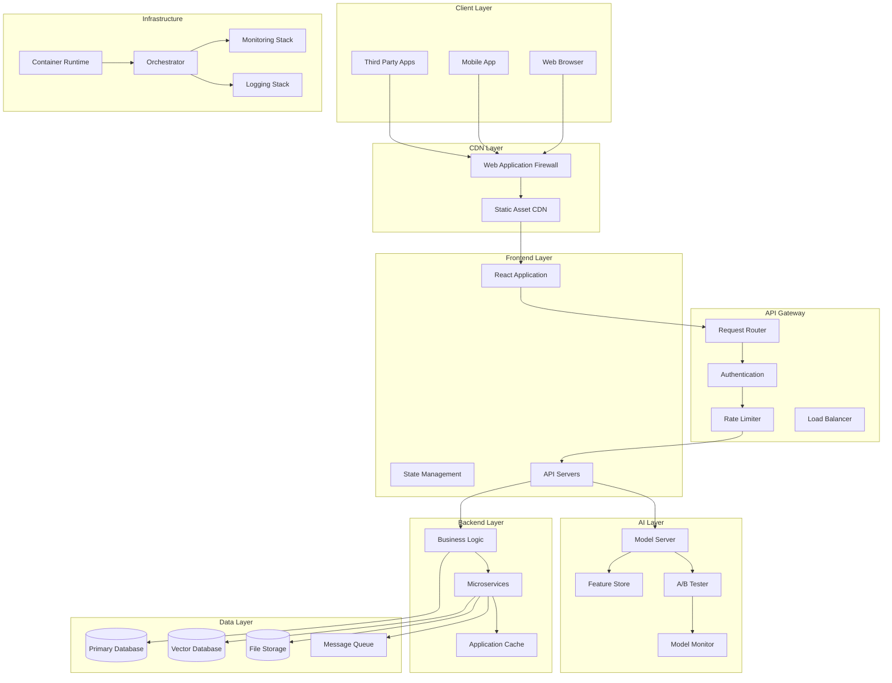

# Project 2: Full-Stack AI Application Development

## Application Development Domain - End-to-End AI Integration

### 2.1 Business Case and Problem Statement

#### The Full-Stack AI Challenge

Building production-ready AI applications requires integrating machine learning models with robust backend services, responsive frontend interfaces, and scalable infrastructure. This integration presents unique challenges that differ significantly from either pure ML development or traditional web application construction. Models that perform well in Jupyter notebooks may fail in production due to input validation issues, latency requirements, scalability demands, or unexpected user behavior patterns.

The market demand for developers who can bridge the gap between data science and production engineering continues to grow rapidly. Organizations investing in AI capabilities struggle to find talent that understands both the statistical foundations of machine learning and the engineering practices required for reliable production systems. This skills gap creates significant opportunities for developers who can demonstrate full-stack AI competencies.

A well-constructed full-stack AI application demonstrates the complete spectrum of modern software development skills: data engineering for model training and feature preparation, backend engineering for API design and business logic, frontend engineering for user experience and accessibility, and DevOps practices for deployment and monitoring. This breadth of demonstration makes full-stack AI projects particularly valuable for career advancement.

This project guides learners through building a complete, production-ready AI application that demonstrates professional engineering practices at every layer. The focus is not just on making something that works but on building something that will continue to work reliably under production conditions with real users.

#### Market Context and Opportunity

The AI application market continues expanding as organizations move from experimentation to production deployment. Companies are investing heavily in AI capabilities that deliver tangible business value, creating demand for developers who can build and maintain these systems. The most sought-after professionals combine deep technical skills with practical deployment experience.

Full-stack AI skills command premium compensation due to their relative scarcity. While many developers can build web applications and many data scientists can train models, relatively few can effectively bridge these domains. This positioning creates significant career advantages and opens doors to leadership opportunities in AI-focused organizations.

The portfolio value of a deployed full-stack AI application extends beyond technical demonstration. It shows potential employers that a candidate understands the complete development lifecycle, can make practical decisions about technology selection, and has experience with the operational challenges of running AI systems in production.

#### Success Metrics and Acceptance Criteria

The full-stack AI application must achieve specific quality targets across all layers. API latency for model inference must remain under 500 milliseconds at the 95th percentile. The application must handle at least 100 concurrent users without degradation. System availability must exceed 99% during testing periods.

Frontend metrics include page load times under 3 seconds, accessibility compliance with WCAG 2.1 AA standards, and mobile-responsive design. Backend metrics include API test coverage exceeding 80%, error handling for all expected failure modes, and rate limiting to prevent abuse.

Model performance metrics depend on the specific use case but must demonstrate meaningful predictive capability. The application must include model monitoring to track prediction distribution shifts over time. A/B testing infrastructure must support model version comparisons.

### 2.2 Architecture Design

#### System Overview

The full-stack AI application architecture follows modern cloud-native patterns designed for scalability, reliability, and maintainability. The system separates concerns across frontend, backend, AI inference, and infrastructure layers while maintaining clean interfaces between components. This separation enables independent scaling and updating of each layer.

The architecture prioritizes observability throughout the system. Every component generates structured logs, exposes health metrics, and traces request flow across boundaries. This operational visibility enables rapid diagnosis of issues and data-driven optimization decisions.

Security considerations address the full application lifecycle from authentication and authorization through data protection to API security. The architecture implements defense-in-depth principles with multiple security layers that can be updated independently as threats evolve.



#### Technology Stack Summary

| Component | Technology | Justification |
|-----------|------------|---------------|
| Frontend Framework | React 18 + Next.js 14 | Server-side rendering, excellent developer experience |
| State Management | Zustand + React Query | Lightweight, effective for server state |
| Styling | Tailwind CSS | Rapid development, consistent design system |
| Backend Framework | FastAPI 0.109+ | Native async, automatic API documentation |
| Database | PostgreSQL 15 + Redis 7 | ACID compliance, caching layer |
| Vector Database | Qdrant 1.4+ | Fast similarity search for embeddings |
| ML Framework | PyTorch 2.0 + ONNX | Flexible model development, deployment options |
| Model Serving | Triton Inference Server | Production-grade model serving |
| Containerization | Docker + Docker Compose | Environment consistency |
| Orchestration | Kubernetes (GKE/EKS) | Production-grade orchestration |
| CI/CD | GitHub Actions | Native integration, extensive ecosystem |
| Monitoring | Prometheus + Grafana | Industry-standard metrics |
| Logging | ELK Stack | Centralized logging, search capabilities |
| Tracing | Jaeger | Distributed tracing for debugging |

#### Data Flow Architecture

The data flow architecture separates training and inference pipelines while maintaining consistency in data transformation. Training data flows from source systems through feature engineering to model training, with features and preprocessing steps versioned for reproducibility. Inference data flows from user requests through validation, feature computation, model prediction, and response formatting.

Event-driven patterns using message queues enable asynchronous processing for non-critical paths. This architecture supports real-time user interactions while enabling background processing for expensive operations like model retraining or report generation.

### 2.3 Implementation Guide

#### Project Structure

```
fullstack-ai-application/
├── frontend/                          # Frontend application
│   ├── src/
│   │   ├── app/                      # Next.js App Router
│   │   │   ├── (auth)/              # Authentication pages
│   │   │   │   ├── login/
│   │   │   │   ├── register/
│   │   │   │   └── forgot-password/
│   │   │   ├── (dashboard)/         # Protected dashboard pages
│   │   │   │   ├── overview/
│   │   │   │   ├── predictions/
│   │   │   │   └── settings/
│   │   │   ├── api/                 # API routes
│   │   │   ├── layout.tsx
│   │   │   └── page.tsx
│   │   ├── components/
│   │   │   ├── ui/                  # Reusable UI components
│   │   │   ├── forms/               # Form components
│   │   │   ├── charts/              # Visualization components
│   │   │   └── layout/              # Layout components
│   │   ├── hooks/                   # Custom React hooks
│   │   ├── lib/                     # Utility libraries
│   │   ├── services/                # API client services
│   │   ├── stores/                  # State stores
│   │   ├── types/                   # TypeScript types
│   │   └── utils/                   # Utility functions
│   ├── public/                      # Static assets
│   ├── tests/                       # Frontend tests
│   ├── next.config.js
│   ├── tailwind.config.ts
│   ├── tsconfig.json
│   ├── Dockerfile
│   └── package.json
│
├── backend/                          # Backend application
│   ├── src/
│   │   ├── api/
│   │   │   ├── routes/              # API route definitions
│   │   │   ├── middleware/          # Custom middleware
│   │   │   └── deps.py              # Dependency injection
│   │   ├── core/                    # Core application logic
│   │   │   ├── config.py            # Configuration
│   │   │   ├── security.py          # Security utilities
│   │   │   └── logging.py           # Logging setup
│   │   ├── models/                  # Data models
│   │   │   ├── database.py          # SQLAlchemy models
│   │   │   ├── pydantic.py          # Pydantic schemas
│   │   │   └── domain.py            # Domain models
│   │   ├── services/                # Business logic
│   │   │   ├── auth.py              # Authentication
│   │   │   ├── ai.py                # AI/ML services
│   │   │   ├── data.py              # Data services
│   │   │   └── integrations.py      # External integrations
│   │   └── main.py                  # Application entry point
│   ├── tests/                       # Backend tests
│   ├── alembic/                     # Database migrations
│   ├── Dockerfile
│   ├── requirements.txt
│   └── pyproject.toml
│
├── ml/                              # ML components
│   ├── src/
│   │   ├── models/                  # Model architectures
│   │   ├── training/                # Training scripts
│   │   ├── evaluation/              # Evaluation scripts
│   │   ├── preprocessing/           # Feature engineering
│   │   ├── serving/                 # Model serving utilities
│   │   └── monitoring/              # Model monitoring
│   ├── data/                        # Data directories
│   │   ├── raw/                     # Raw data
│   │   ├── processed/               # Processed data
│   │   └── features/                # Feature stores
│   ├── notebooks/                   # Jupyter notebooks
│   ├── experiments/                 # Experiment tracking
│   ├── tests/                       # ML tests
│   ├── Dockerfile
│   └── pyproject.toml
│
├── infrastructure/                   # Infrastructure as code
│   ├── terraform/
│   │   ├── main.tf
│   │   ├── variables.tf
│   │   ├── outputs.tf
│   │   └── modules/
│   │       ├── network/
│   │       ├── compute/
│   │       ├── database/
│   │       └── ml/
│   ├── kubernetes/
│   │   ├── base/
│   │   ├── overlays/
│   │   │   ├── development/
│   │   │   └── production/
│   │   └── helm/
│  ,── ansible/
│  │   ├── playbooks/
│  │   └── roles/
│  └── docker-compose/
│       ├── docker-compose.yml
│       ├── docker-compose.override.yml
│       └── monitoring/
│
├── .github/
│   ├── workflows/
│   │   ├── ci.yml
│   │   ├── cd.yml
│   │   └── ml-pipeline.yml
│
├── docs/
│   ├── architecture/
│   │   ├── system-design.md
│   │   └── adrs/
│   ├── api/
│   │   └── openapi.yaml
│   ├── deployment/
│   │   ├── kubernetes.md
│   │   └── monitoring.md
│   └── user-guide.md
│
├── scripts/
│   ├── setup.sh
│   ├── lint.sh
│   ├── test.sh
│   ├── migrate.sh
│   └── seed.sh
│
├── .env.example
├── .gitignore
├── .dockerignore
├── Makefile
├── README.md
└── LICENSE
```

#### Core API Implementation

```python
# backend/src/main.py
from fastapi import FastAPI, Request, status
from fastapi.middleware.cors import CORSMiddleware
from fastapi.responses import JSONResponse
from contextlib import asynccontextmanager
import logging
import time

from app.core.config import settings
from app.core.logging import setup_logging
from app.db.session import engine, Base
from app.api.deps import get_db
from app.api.routes import router as api_router

# Setup logging
setup_logging()
logger = logging.getLogger(__name__)


@asynccontextmanager
async def lifespan(app: FastAPI):
    """Application lifespan events."""
    # Startup
    logger.info("Starting up application...")
    
    # Create database tables
    async with engine.begin() as conn:
        await conn.run_sync(Base.metadata.create_all)
    
    logger.info("Application startup complete")
    
    yield
    
    # Shutdown
    logger.info("Shutting down application...")


app = FastAPI(
    title=settings.app_name,
    description="Full-Stack AI Application API",
    version="1.0.0",
    lifespan=lifespan,
    docs_url="/api/docs",
    redoc_url="/api/redoc",
    openapi_url="/api/openapi.json"
)


# CORS configuration
app.add_middleware(
    CORSMiddleware,
    allow_origins=settings.cors_origins,
    allow_credentials=True,
    allow_methods=["*"],
    allow_headers=["*"],
)


# Request timing middleware
@app.middleware("http")
async def timing_middleware(request: Request, call_next):
    start_time = time.time()
    response = await call_next(request)
    process_time = time.time() - start_time
    
    response.headers["X-Process-Time"] = str(process_time)
    
    if settings.debug:
        logger.debug(
            f"{request.method} {request.url.path} - "
            f"Status: {response.status_code} - "
            f"Time: {process_time:.4f}s"
        )
    
    return response


# Exception handlers
@app.exception_handler(ValueError)
async def value_error_handler(request: Request, exc: ValueError):
    return JSONResponse(
        status_code=status.HTTP_400_BAD_REQUEST,
        content={"detail": str(exc)}
    )


@app.exception_handler(Exception)
async def general_error_handler(request: Request, exc: Exception):
    logger.exception(f"Unhandled exception: {exc}")
    return JSONResponse(
        status_code=status.HTTP_500_INTERNAL_SERVER_ERROR,
        content={"detail": "Internal server error"}
    )


# Include routers
app.include_router(api_router, prefix="/api/v1")


# Health check endpoints
@app.get("/health")
async def health_check():
    """Basic health check."""
    return {"status": "healthy"}


@app.get("/health/detailed")
async def detailed_health_check(db=Depends(get_db)):
    """Detailed health check including database."""
    try:
        await db.execute("SELECT 1")
        db_status = "healthy"
    except Exception as e:
        logger.error(f"Database health check failed: {e}")
        db_status = "unhealthy"
    
    return {
        "status": "healthy" if db_status == "healthy" else "degraded",
        "components": {
            "database": db_status,
        }
    }


# frontend/src/app/api/client.ts
import { createApi, fetchBaseQuery } from '@reduxjs/toolkit/query/react';
import type { 
  PredictionRequest, 
  PredictionResponse,
  User,
  UserCreate,
  LoginRequest,
  LoginResponse,
  HealthResponse 
} from './types';

export const api = createApi({
  reducerPath: 'api',
  baseQuery: fetchBaseQuery({
    baseUrl: import.meta.env.VITE_API_URL || 'http://localhost:8000/api/v1',
    prepareHeaders: (headers, { getState }) => {
      const token = (getState() as RootState).auth.token;
      if (token) {
        headers.set('authorization', `Bearer ${token}`);
      }
      return headers;
    },
  }),
  tagTypes: ['Prediction', 'User', 'Health'],
  endpoints: (builder) => ({
    // Authentication endpoints
    login: builder.mutation<LoginResponse, LoginRequest>({
      query: (credentials) => ({
        url: '/auth/login',
        method: 'POST',
        body: credentials,
      }),
    }),
    
    register: builder.mutation<User, UserCreate>({
      query: (userData) => ({
        url: '/auth/register',
        method: 'POST',
        body: userData,
      }),
    }),
    
    // Prediction endpoints
    createPrediction: builder.mutation<PredictionResponse, PredictionRequest>({
      query: (predictionRequest) => ({
        url: '/predictions',
        method: 'POST',
        body: predictionRequest,
      }),
      invalidatesTags: ['Prediction'],
    }),
    
    getPredictions: builder.query<PredictionResponse[], void>({
      query: () => '/predictions',
      providesTags: ['Prediction'],
    }),
    
    getPrediction: builder.query<PredictionResponse, string>({
      query: (id) => `/predictions/${id}`,
      providesTags: (result, error, id) => [{ type: 'Prediction', id }],
    }),
    
    // Health endpoints
    healthCheck: builder.query<HealthResponse, void>({
      query: () => '/health/detailed',
      providesTags: ['Health'],
    }),
  }),
});

export const {
  useLoginMutation,
  useRegisterMutation,
  useCreatePredictionMutation,
  useGetPredictionsQuery,
  useGetPredictionQuery,
  useHealthCheckQuery,
} = api;
```

#### AI Model Service

```python
# backend/src/services/ai/model_service.py
import asyncio
import logging
from typing import Optional, Dict, Any, List
from datetime import datetime
from dataclasses import dataclass
import numpy as np
from PIL import Image

from app.core.config import settings
from app.services.ai.base import ModelBase, ModelInput, ModelOutput
from app.services.ai.registry import ModelRegistry

logger = logging.getLogger(__name__)


@dataclass
class PredictionMetadata:
    """Metadata for a prediction."""
    model_version: str
    inference_time_ms: float
    confidence: float
    input_features: Dict[str, Any]
    warnings: List[str] = None


class ModelService:
    """
    Service for managing and running AI models.
    
    Handles model loading, inference, and monitoring.
    """
    
    def __init__(self):
        self.registry = ModelRegistry()
        self.loaded_models: Dict[str, ModelBase] = {}
        self._initialize_models()
    
    def _initialize_models(self):
        """Initialize models from registry."""
        logger.info("Initializing AI models...")
        
        model_configs = self.registry.list_models()
        
        for config in model_configs:
            try:
                model = self.registry.load_model(config.name, config.version)
                self.loaded_models[config.name] = model
                logger.info(f"Loaded model: {config.name} v{config.version}")
            except Exception as e:
                logger.error(f"Failed to load model {config.name}: {e}")
        
        logger.info(f"Initialized {len(self.loaded_models)} models")
    
    async def predict(
        self,
        model_name: str,
        input_data: ModelInput,
        options: Dict[str, Any] = None
    ) -> ModelOutput:
        """
        Run model inference.
        
        Args:
            model_name: Name of the model to use
            input_data: Input data for prediction
            options: Additional inference options
        
        Returns:
            ModelOutput with predictions and metadata
        """
        start_time = datetime.utcnow()
        
        # Get model
        model = self.loaded_models.get(model_name)
        if not model:
            raise ValueError(f"Model {model_name} not loaded")
        
        # Validate input
        validation_warnings = model.validate_input(input_data)
        if not validation_warnings:
            raise ValueError(f"Invalid input for model {model_name}")
        
        # Run inference
        try:
            output = model.predict(input_data, options)
        except Exception as e:
            logger.error(f"Inference error for {model_name}: {e}")
            raise
        
        # Calculate inference time
        inference_time = (datetime.utcnow() - start_time).total_seconds() * 1000
        
        # Add metadata
        output.metadata = PredictionMetadata(
            model_version=model.version,
            inference_time_ms=inference_time,
            confidence=output.confidence,
            input_features=input_data.to_dict() if hasattr(input_data, 'to_dict') else input_data,
            warnings=validation_warnings
        )
        
        return output
    
    async def batch_predict(
        self,
        model_name: str,
        inputs: List[ModelInput],
        options: Dict[str, Any] = None
    ) -> List[ModelOutput]:
        """Run batch inference for multiple inputs."""
        tasks = [
            self.predict(model_name, input_data, options)
            for input_data in inputs
        ]
        
        results = await asyncio.gather(*tasks, return_exceptions=True)
        
        # Handle exceptions
        outputs = []
        for result in results:
            if isinstance(result, Exception):
                logger.error(f"Batch prediction error: {result}")
                outputs.append(ModelOutput(prediction=None, confidence=0.0))
            else:
                outputs.append(result)
        
        return outputs
    
    def get_model_info(self, model_name: str) -> Dict[str, Any]:
        """Get information about a loaded model."""
        model = self.loaded_models.get(model_name)
        if not model:
            raise ValueError(f"Model {model_name} not loaded")
        
        return {
            "name": model.name,
            "version": model.version,
            "input_schema": model.input_schema,
            "output_schema": model.output_schema,
            "performance_metrics": model.get_performance_metrics(),
            "last_updated": model.last_updated.isoformat() if model.last_updated else None
        }
    
    def list_models(self) -> List[Dict[str, Any]]:
        """List all loaded models."""
        return [
            self.get_model_info(name)
            for name in self.loaded_models.keys()
        ]
    
    async def reload_model(self, model_name: str):
        """Reload a model from the registry."""
        if model_name in self.loaded_models:
            old_model = self.loaded_models[model_name]
            await old_model.unload()
        
        config = self.registry.get_model_config(model_name)
        model = self.registry.load_model(config.name, config.version)
        self.loaded_models[model_name] = model
        
        logger.info(f"Reloaded model: {model_name}")


# frontend/src/hooks/usePrediction.ts
import { useCallback } from 'react';
import { useDispatch, useSelector } from 'react-redux';
import { api } from '../services/api';
import type { RootState, AppDispatch } from '../store';

export function usePrediction() {
  const dispatch = useDispatch<AppDispatch>();
  const { predictions, currentPrediction, isLoading, error } = useSelector(
    (state: RootState) => state.prediction
  );
  
  const [createPredictionMutation] = api.useCreatePredictionMutation();
  const { refetch: refetchPredictions } = api.useGetPredictionsQuery();
  
  const createPrediction = useCallback(
    async (inputData: PredictionRequest) => {
      try {
        const result = await createPredictionMutation(inputData).unwrap();
        await refetchPredictions();
        return result;
      } catch (error) {
        console.error('Prediction failed:', error);
        throw error;
      }
    },
    [createPredictionMutation, refetchPredictions]
  );
  
  const getPrediction = useCallback(
    async (id: string) => {
      try {
        const result = await dispatch(
          api.endpoints.getPrediction.initiate(id)
        ).unwrap();
        return result;
      } catch (error) {
        console.error('Failed to get prediction:', error);
        throw error;
      }
    },
    [dispatch]
  );
  
  return {
    predictions,
    currentPrediction,
    isLoading,
    error,
    createPrediction,
    getPrediction,
  };
}
```

#### Real-Time WebSocket Integration

```python
# backend/src/api/websocket/manager.py
import asyncio
import json
import logging
from typing import Dict, Set, Optional
from dataclasses import dataclass, field
from datetime import datetime
from fastapi import WebSocket, WebSocketDisconnect
from enum import Enum

logger = logging.getLogger(__name__)


class ConnectionState(Enum):
    CONNECTED = "connected"
    DISCONNECTED = "disconnected"
    ERROR = "error"


@dataclass
class Client:
    """Represents a connected client."""
    client_id: str
    websocket: WebSocket
    user_id: Optional[str] = None
    subscriptions: Set[str] = field(default_factory=set)
    state: ConnectionState = ConnectionState.DISCONNECTED
    connected_at: datetime = field(default_factory=datetime.utcnow)
    last_activity: datetime = field(default_factory=datetime.utcnow)


class ConnectionManager:
    """
    Manages WebSocket connections and message routing.
    
    Provides real-time communication capabilities for
    predictions, notifications, and live updates.
    """
    
    def __init__(self):
        self.active_connections: Dict[str, Client] = {}
        self._lock = asyncio.Lock()
    
    async def connect(
        self,
        websocket: WebSocket,
        client_id: str,
        user_id: Optional[str] = None
    ) -> Client:
        """Accept and register a new WebSocket connection."""
        await websocket.accept()
        
        client = Client(
            client_id=client_id,
            websocket=websocket,
            user_id=user_id,
            state=ConnectionState.CONNECTED
        )
        
        async with self._lock:
            self.active_connections[client_id] = client
        
        logger.info(f"Client connected: {client_id}")
        
        # Start heartbeat
        asyncio.create_task(self._heartbeat(client))
        
        # Send welcome message
        await self.send_message(client, {
            "type": "connected",
            "client_id": client_id,
            "timestamp": datetime.utcnow().isoformat()
        })
        
        return client
    
    async def disconnect(self, client_id: str):
        """Remove a client connection."""
        async with self._lock:
            client = self.active_connections.pop(client_id, None)
            if client:
                client.state = ConnectionState.DISCONNECTED
                logger.info(f"Client disconnected: {client_id}")
    
    async def send_message(
        self,
        client: Client,
        message: dict,
        timeout: float = 10.0
    ):
        """Send a message to a specific client."""
        if client.state != ConnectionState.CONNECTED:
            logger.warning(f"Cannot send to disconnected client: {client.client_id}")
            return
        
        try:
            await asyncio.wait_for(
                client.websocket.send_json(message),
                timeout=timeout
            )
            client.last_activity = datetime.utcnow()
        except asyncio.TimeoutError:
            logger.warning(f"Timeout sending to client: {client.client_id}")
        except Exception as e:
            logger.error(f"Error sending to client {client.client_id}: {e}")
            client.state = ConnectionState.ERROR
    
    async def broadcast(
        self,
        message: dict,
        topic: Optional[str] = None,
        user_ids: Optional[Set[str]] = None
    ):
        """Broadcast a message to multiple clients."""
        targets = []
        
        async with self._lock:
            for client in self.active_connections.values():
                if user_ids and client.user_id not in user_ids:
                    continue
                if topic and topic not in client.subscriptions:
                    continue
                targets.append(client)
        
        # Send to all targets
        await asyncio.gather(
            *[self.send_message(client, message) for client in targets],
            return_exceptions=True
        )
    
    async def subscribe(
        self,
        client_id: str,
        topics: Set[str]
    ):
        """Subscribe a client to topics."""
        async with self._lock:
            client = self.active_connections.get(client_id)
            if client:
                client.subscriptions.update(topics)
                logger.info(f"Client {client_id} subscribed to: {topics}")
    
    async def unsubscribe(
        self,
        client_id: str,
        topics: Set[str]
    ):
        """Unsubscribe a client from topics."""
        async with self._lock:
            client = self.active_connections.get(client_id)
            if client:
                client.subscriptions -= topics
                logger.info(f"Client {client_id} unsubscribed from: {topics}")
    
    async def _heartbeat(self, client: Client, interval: float = 30.0):
        """Send periodic heartbeat to client."""
        while client.client_id in self.active_connections:
            await asyncio.sleep(interval)
            
            try:
                await self.send_message(client, {"type": "heartbeat"})
            except Exception:
                break
    
    def get_connection_stats(self) -> dict:
        """Get connection statistics."""
        total = len(self.active_connections)
        authenticated = sum(
            1 for c in self.active_connections.values() if c.user_id
        )
        
        return {
            "total_connections": total,
            "authenticated_connections": authenticated,
            "topics": self._get_topic_stats()
        }
    
    def _get_topic_stats(self) -> dict:
        """Get subscription statistics by topic."""
        topic_counts = {}
        
        for client in self.active_connections.values():
            for topic in client.subscriptions:
                topic_counts[topic] = topic_counts.get(topic, 0) + 1
        
        return topic_counts


# WebSocket endpoint handler
from fastapi import APIRouter

router = APIRouter()
manager = ConnectionManager()


@router.websocket("/ws/{client_id}")
async def websocket_endpoint(
    websocket: WebSocket,
    client_id: str,
    token: Optional[str] = None
):
    """WebSocket endpoint for real-time communication."""
    # Authenticate if token provided
    user_id = None
    if token:
        try:
            user_id = await verify_websocket_token(token)
        except Exception as e:
            logger.error(f"WebSocket authentication failed: {e}")
    
    # Connect
    client = await manager.connect(websocket, client_id, user_id)
    
    try:
        # Handle messages
        while True:
            data = await websocket.receive_json()
            
            # Handle different message types
            if data.get("type") == "subscribe":
                topics = set(data.get("topics", []))
                await manager.subscribe(client_id, topics)
            
            elif data.get("type") == "unsubscribe":
                topics = set(data.get("topics", []))
                await manager.unsubscribe(client_id, topics)
            
            elif data.get("type") == "ping":
                await manager.send_message(client, {"type": "pong"})
            
            else:
                # Handle application-specific messages
                await handle_application_message(client, data)
    
    except WebSocketDisconnect:
        await manager.disconnect(client_id)
    except Exception as e:
        logger.error(f"WebSocket error: {e}")
        await manager.disconnect(client_id)


async def handle_application_message(client: Client, data: dict):
    """Handle application-specific WebSocket messages."""
    # Route to appropriate handler based on message type
    if data.get("type") == "prediction_request":
        result = await process_prediction(data)
        await manager.send_message(client, {
            "type": "prediction_result",
            "request_id": data.get("request_id"),
            "result": result
        })
```

### 2.4 Common Pitfalls and Solutions

#### Pitfall 1: Model Deployment Complexity

Models that perform well in development environments often fail in production due to dependency conflicts, environment differences, or unexpected input distributions. Debugging production model issues is significantly harder than local debugging.

**Detection:** Monitor model performance metrics for distribution shifts. Track prediction latency and error rates. Implement comprehensive logging for all model inputs and outputs.

**Solution:** Containerize models from the beginning of development. Implement comprehensive input validation and error handling. Build model versioning and A/B testing infrastructure. Create automated testing pipelines that validate model behavior across expected input distributions.

#### Pitfall 2: Frontend-Backend Integration

Integrating frontend and backend components often reveals mismatched assumptions about data formats, API behaviors, and error handling. These issues can lead to poor user experiences and difficult debugging sessions.

**Detection:** Implement automated integration tests that exercise complete user flows. Track API error rates by endpoint and client. Monitor frontend JavaScript errors for API-related issues.

**Solution:** Generate TypeScript types from OpenAPI specifications. Implement comprehensive API documentation with examples. Use contract testing to verify API compatibility. Create shared validation schemas between frontend and backend.

#### Pitfall 3: Scalability Misalignment

Applications designed without scalability in mind often require significant rework to handle production loads. Performance issues may not appear until production traffic increases, leading to stressful emergency fixes.

**Detection:** Conduct load testing before production deployment. Monitor resource utilization during peak usage. Track latency percentiles, not just averages.

**Solution:** Design for horizontal scaling from the beginning. Implement caching at appropriate layers. Use async processing for expensive operations. Build monitoring dashboards that track scalability metrics.

### 2.5 Extension Opportunities

#### Extension 1: Multi-Tenant Architecture

Extend the application to support multiple tenants with data isolation, custom branding, and tenant-specific configurations. This pattern is common in B2B SaaS applications.

Technical approach: Implement tenant-aware authentication and authorization. Add tenant ID to all database queries. Create tenant-specific configuration storage. Implement tenant-aware caching.

#### Extension 2: Advanced AI Capabilities

Enhance the AI component with additional capabilities such as model comparison, custom model training interfaces, or automated hyperparameter optimization.

Technical approach: Build model comparison dashboard with statistical significance testing. Create custom model training workflow with UI. Implement automated hyperparameter optimization with visual results.

#### Extension 3: Mobile Application

Develop a mobile companion application using React Native or Flutter. This extends the application's reach and demonstrates cross-platform development skills.

Technical approach: Share API specifications between web and mobile. Implement responsive design that works on mobile browsers first. Build native mobile features where appropriate.

### 2.6 Code Review Checklist

#### Backend Quality

- All API endpoints include input validation
- Authentication and authorization on protected routes
- Error handling returns appropriate status codes
- Logging captures relevant context without sensitive data
- Database queries use parameterized statements
- Rate limiting prevents abuse

#### Frontend Quality

- TypeScript types are used throughout
- Components are properly typed with props interfaces
- API errors are handled gracefully with user feedback
- Loading states are displayed during async operations
- Responsive design works on mobile and desktop
- Accessibility requirements are met (ARIA labels, keyboard navigation)

#### AI/ML Quality

- Model inputs are validated before inference
- Predictions include confidence scores
- Model version is tracked with all predictions
- Performance metrics are monitored over time
- Model drift detection is implemented
- A/B testing infrastructure supports model comparisons

#### Infrastructure Quality

- Dockerfiles follow best practices
- Kubernetes configurations include resource limits
- CI/CD pipeline runs tests automatically
- Secrets are managed securely (not in code)
- Backups are configured for persistent data
- Monitoring covers all production components

### 2.7 Project Presentation Guidelines

#### Structure

1. **Application Overview (3 minutes)**
   - Problem being solved and target users
   - Key features and user value proposition
   - Demonstration of main user flows

2. **Technical Architecture (5 minutes)**
   - System architecture and component interactions
   - Technology choices and rationale
   - AI model architecture and training approach
   - Data flow and storage strategy

3. **Implementation Deep-Dive (5 minutes)**
   - Key implementation challenges and solutions
   - Code structure and organization
   - Testing approach and coverage
   - Deployment pipeline and infrastructure

4. **Live Demo (5 minutes)**
   - Complete user journey demonstration
   - Show production deployment
   - Demonstrate key features
   - Highlight user experience

5. **Challenges and Future (2 minutes)**
   - Major challenges encountered
   - What would be done differently
   - Planned enhancements and extensions

#### Presentation Requirements

- Professional, well-designed slides
- Clear speaker notes for each section
- Working demo environment
- Code samples where relevant
- Time management within allocation

### 2.8 Open Source Contribution Guide

#### Contribution Areas

**Frontend Improvements**
- Add new UI components
- Improve accessibility
- Optimize performance
- Add internationalization support

**Backend Enhancements**
- Add new API endpoints
- Improve database queries
- Add authentication providers
- Implement caching improvements

**AI/ML Extensions**
- Add new model architectures
- Improve training pipelines
- Add model monitoring features
- Implement new preprocessing methods

**Infrastructure**
- Improve deployment configurations
- Add monitoring dashboards
- Enhance CI/CD pipelines
- Add security improvements

#### Contribution Process

1. Fork the repository
2. Create feature branch
3. Make changes following coding standards
4. Add tests for new functionality
5. Run linting and tests
6. Submit pull request with description
7. Address reviewer feedback

#### Good First Issues

- Documentation improvements
- Test additions
- Bug fixes with clear reproduction steps
- Small feature enhancements
- Performance optimizations
