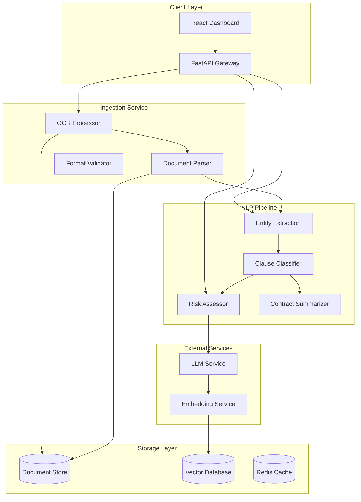

# Project 1: Intelligent Legal Contract Analysis Engine

## LegalTech Domain - Document Processing and NLP

### 1.1 Business Case and Problem Statement

#### The Legal Document Challenge

Corporate legal departments and law firms process thousands of contracts annually, spending countless hours reviewing documents for risks, compliance issues, and standard clause verification. A typical enterprise manages over 20,000 active contracts, with new agreements constantly being created, renegotiated, or renewed. Manual review processes are expensive, time-consuming, and prone to human error, with studies showing that lawyers miss up to 20% of important clauses during initial review.

The cost of contract-related disputes and non-compliance runs into billions of dollars annually. Late payment fees, unfavorable terms, and missed obligations collectively represent significant financial and operational risks. Furthermore, regulatory requirements around data handling, liability limits, and compliance reporting have intensified, making thorough contract analysis not just a best practice but a necessity.

This project addresses the fundamental problem of extracting meaningful information from unstructured legal documents at scale. By combining optical character recognition for document extraction, natural language processing for clause identification, and semantic similarity for risk assessment, we build a system that augments human reviewers rather than replacing them. The system highlights potential issues, suggests standard clause alternatives, and provides risk scores that enable lawyers to focus their expertise where it matters most.

#### Market Context and Opportunity

The legal technology market is experiencing rapid transformation driven by AI capabilities. The global legal AI market is projected to reach $4.3 billion by 2027, growing at over 30% annually. Early movers in contract analysis have demonstrated significant efficiency gains, with some firms reporting 50-70% reduction in initial document review time.

The opportunity spans multiple segments: large law firms seeking efficiency gains, corporate legal departments managing vendor and employment contracts, financial institutions handling complex credit agreements, and insurance companies processing policy documents. Each segment has specific requirements around accuracy, privacy, and integration, creating opportunities for specialized solutions.

The project builds skills directly applicable to other document-intensive domains including financial document analysis, medical record processing, regulatory compliance documentation, and technical manual extraction. The core competencies in OCR, NLP, and semantic search transfer broadly across industries.

#### Success Metrics and Acceptance Criteria

The system must achieve the following targets to be considered production-ready:

Extraction accuracy for key clause types must exceed 92% F1 score, measured against human-annotated ground truth. Critical clause detection (termination rights, liability caps, indemnification) must achieve 95% recall to minimize missed risks. Processing time for a standard 20-page contract must remain under 30 seconds for initial analysis and under 5 minutes for full redlining.

The user interface must enable lawyers to review and correct analysis within 2 minutes per page, with intuitive navigation and clear visualization of identified issues. The system must support PDF, Word, and scanned document inputs with equal accuracy. Audit trails must capture all analysis decisions for compliance verification.

### 1.2 Architecture Design

#### System Overview

The contract analysis engine follows a modular microservices architecture designed for scalability and maintainability. The system ingests documents in various formats, extracts text through OCR, processes the text through NLP pipelines, and presents results through an interactive dashboard. A central document store maintains versions and analysis history for comparison and compliance purposes.

The architecture prioritizes horizontal scalability for document processing, allowing the system to handle increased load by adding processing nodes. Security considerations are paramount given the sensitive nature of legal documents, with zero-retention policies ensuring that uploaded documents are not stored beyond their analysis purpose.

#### Component Architecture



#### Technology Stack Summary

| Component | Technology | Justification |
|-----------|------------|---------------|
| API Gateway | FastAPI 0.109+ | Native async, auto-docs, type validation |
| Document Storage | PostgreSQL 15+ | ACID compliance, full-text search |
| Vector Store | Qdrant 1.4+ | Fast similarity search, Rust-based |
| OCR | Tesseract + DocumentAI | Handles scanned documents |
| NLP | spaCy + HuggingFace | Production NER and classification |
| LLM Orchestration | LangChain 0.2 | Chain abstraction, tool integration |
| Frontend | React + Next.js | Component-based, real-time updates |
| Caching | Redis 7.x | Session and result caching |
| Containerization | Docker + Docker Compose | Environment consistency |

#### Data Flow

The document processing pipeline proceeds through distinct stages. The ingestion layer receives documents through API upload or scheduled batch processing. Documents undergo format validation to ensure parseability, followed by OCR processing for image-based files. Text extraction produces normalized content stored in the document repository.

The NLP pipeline receives extracted text and applies entity recognition to identify parties, dates, monetary values, and defined terms. Clause classification segments the document into functional components (obligations, rights, definitions, termination) using a combination of rule-based matching and transformer-based classification.

Risk assessment compares extracted clauses against the organization's gold standard library using semantic similarity. Deviations beyond configurable thresholds trigger alerts and suggestion generation. The LLM service generates natural language explanations of identified risks and suggested alternatives.

Results are cached for rapid retrieval during review sessions. Document versions maintain analysis history, enabling comparison across contract iterations. Audit logs capture all processing actions for compliance verification.

### 1.3 Implementation Guide

#### Project Structure

```
legal-contract-analysis/
├── app/
│   ├── api/
│   │   ├── __init__.py
│   │   ├── deps.py          # Dependencies injection
│   │   ├── errors.py        # Custom exceptions
│   │   └── routes/
│   │       ├── documents.py # Document upload/retrieval
│   │       ├── analysis.py  # Analysis triggers
│   │       └── reports.py   # Report generation
│   ├── core/
│   │   ├── config.py        # Settings management
│   │   ├── security.py      # Auth and encryption
│   │   └── logging.py       # Structured logging
│   ├── models/
│   │   ├── database.py      # SQLAlchemy models
│   │   ├── domain.py        # Pydantic schemas
│   │   └── contracts.py     # Contract-specific models
│   ├── services/
│   │   ├── __init__.py
│   │   ├── ingestion.py     # Document processing
│   │   ├── ocr.py           # OCR implementation
│   │   ├── nlp/
│   │   │   ├── __init__.py
│   │   │   ├── entities.py  # NER pipeline
│   │   │   ├── clauses.py   # Clause classification
│   │   │   └── risk.py      # Risk assessment
│   │   ├── llm.py           # LLM orchestration
│   │   └── storage.py       # Document storage
│   └── ml/
│       ├── models/          # Trained models
│       └── training/        # Model training scripts
├── templates/
│   ├── code/
│   │   ├── api_template.py
│   │   ├── service_template.py
│   │   └── model_template.py
│   └── configuration/
│       ├── docker-compose.yml
│       ├── Dockerfile
│       └── config.yaml
├── tests/
│   ├── unit/
│   ├── integration/
│   └── fixtures/
├── docs/
│   ├── architecture.md
│   ├── api_reference.md
│   └── user_guide.md
└── scripts/
    ├── setup.sh
    ├── test_data_generator.py
    └── benchmark.py
```

#### Core API Implementation

```python
# app/api/deps.py
from typing import Generator, Optional
from fastapi import Depends, HTTPException, status
from sqlalchemy.orm import Session
from redis import Redis
from app.core.security import verify_token
from app.db.session import get_db
from app.db.cache import get_redis

async def get_current_user(
    token: str = Depends(oauth2_scheme),
    db: Session = Depends(get_db)
) -> User:
    """Validate JWT token and return current user."""
    credentials_exception = HTTPException(
        status_code=status.HTTP_401_UNAUTHORIZED,
        detail="Could not validate credentials",
        headers={"WWW-Authenticate": "Bearer"},
    )
    payload = verify_token(token)
    if payload is None:
        raise credentials_exception
    user_id: str = payload.get("sub")
    user = db.query(User).filter(User.id == user_id).first()
    if user is None:
        raise credentials_exception
    return user

async def get_optional_user(
    token: Optional[str] = Depends(oauth2_scheme),
    db: Session = Depends(get_db)
) -> Optional[User]:
    """Return user if authenticated, None otherwise."""
    if token is None:
        return None
    try:
        return await get_current_user(token, db)
    except HTTPException:
        return None

# app/api/routes/documents.py
from fastapi import APIRouter, Depends, HTTPException, UploadFile, File
from sqlalchemy.orm import Session
from app.api.deps import get_current_user, get_db
from app.schemas.contracts import DocumentCreate, DocumentResponse
from app.services.ingestion import DocumentIngestionService
from app.services.storage import DocumentStorageService

router = APIRouter()

@router.post("/documents/upload", response_model=DocumentResponse)
async def upload_document(
    file: UploadFile = File(...),
    current_user: User = Depends(get_current_user),
    db: Session = Depends(get_db)
) -> DocumentResponse:
    """
    Upload a new contract document for analysis.
    
    Supports PDF, DOCX, and scanned image formats.
    Document is processed asynchronously; use the returned document_id
    to poll for analysis completion.
    """
    # Validate file type
    allowed_types = ["application/pdf", 
                     "application/vnd.openxmlformats-officedocument.wordprocessingml.document"]
    if file.content_type not in allowed_types:
        raise HTTPException(
            status_code=status.HTTP_400_BAD_REQUEST,
            detail=f"Unsupported file type: {file.content_type}"
        )
    
    # Validate file size (max 50MB)
    MAX_SIZE = 50 * 1024 * 1024  # 50MB
    file_size = 0
    chunk_size = 1024 * 1024  # 1MB chunks
    while chunk := await file.read(chunk_size):
        file_size += len(chunk)
        if file_size > MAX_SIZE:
            raise HTTPException(
                status_code=status.HTTP_413_REQUEST_ENTITY_TOO_LARGE,
                detail="File size exceeds 50MB limit"
            )
    
    # Reset file position after size check
    await file.seek(0)
    
    # Process document
    storage_service = DocumentStorageService(db)
    ingestion_service = DocumentIngestionService(db)
    
    # Store document
    document = await storage_service.store_upload(
        file=file,
        user_id=current_user.id,
        metadata={"filename": file.filename}
    )
    
    # Start async analysis
    await ingestion_service.queue_analysis(document.id)
    
    return DocumentResponse(
        id=document.id,
        filename=document.filename,
        status=document.status.value,
        uploaded_at=document.created_at,
        message="Document uploaded successfully. Analysis in progress."
    )

@router.get("/documents/{document_id}")
async def get_document(
    document_id: str,
    current_user: User = Depends(get_current_user),
    db: Session = Depends(get_db)
) -> DocumentResponse:
    """Retrieve document metadata and status."""
    storage_service = DocumentStorageService(db)
    document = storage_service.get_by_id(document_id)
    
    if not document:
        raise HTTPException(
            status_code=status.HTTP_404_NOT_FOUND,
            detail="Document not found"
        )
    
    # Verify ownership
    if document.user_id != current_user.id:
        raise HTTPException(
            status_code=status.HTTP_403_FORBIDDEN,
            detail="Access denied"
        )
    
    return DocumentResponse.from_orm(document)

@router.get("/documents/{document_id}/analysis")
async def get_document_analysis(
    document_id: str,
    current_user: User = Depends(get_current_user),
    db: Session = Depends(get_db)
) -> dict:
    """Retrieve full analysis results for a document."""
    storage_service = DocumentStorageService(db)
    document = storage_service.get_by_id(document_id)
    
    if not document:
        raise HTTPException(status_code=404, detail="Document not found")
    
    if document.user_id != current_user.id:
        raise HTTPException(status_code=403, detail="Access denied")
    
    if document.status != DocumentStatus.COMPLETED:
        return {"status": document.status.value, "message": "Analysis in progress"}
    
    # Retrieve cached analysis
    cache = get_redis()
    cache_key = f"analysis:{document_id}"
    analysis_data = cache.get(cache_key)
    
    if analysis_data:
        return json.loads(analysis_data)
    
    # Generate if not cached
    from app.services.analysis import AnalysisService
    analysis_service = AnalysisService(db)
    result = await analysis_service.generate_full_analysis(document_id)
    
    # Cache for 1 hour
    cache.setex(cache_key, 3600, json.dumps(result, default=str))
    
    return result
```

#### Document Processing Service

```python
# app/services/ingestion.py
import asyncio
import hashlib
import io
import logging
from datetime import datetime
from typing import Optional, List
from pathlib import Path
import pytesseract
from PIL import Image
from pdf2image import convert_from_bytes
from docx import Document as DocxDocument

from app.core.config import settings
from app.db.session import get_db
from app.models.contracts import Document, DocumentStatus, DocumentType
from app.schemas.contracts import DocumentCreate

logger = logging.getLogger(__name__)

class DocumentIngestionService:
    """Handles document ingestion and processing pipeline."""
    
    def __init__(self, db_session):
        self.db = db_session
        self.processing_queue = asyncio.Queue()
        self._worker_task: Optional[asyncio.Task] = None
    
    async def start_worker(self):
        """Start background worker for document processing."""
        self._worker_task = asyncio.create_task(self._processing_worker())
        logger.info("Document processing worker started")
    
    async def stop_worker(self):
        """Stop background worker gracefully."""
        if self._worker_task:
            self._worker_task.cancel()
            try:
                await self._worker_task
            except asyncio.CancelledError:
                pass
            logger.info("Document processing worker stopped")
    
    async def queue_analysis(self, document_id: str):
        """Queue document for async analysis."""
        await self.processing_queue.put(document_id)
        logger.info(f"Document {document_id} queued for analysis")
    
    async def _processing_worker(self):
        """Background worker that processes documents from queue."""
        while True:
            try:
                document_id = await self.processing_queue.get()
                await self._process_document(document_id)
                self.processing_queue.task_done()
            except asyncio.CancelledError:
                break
            except Exception as e:
                logger.error(f"Error processing document: {e}", exc_info=True)
    
    async def _process_document(self, document_id: str):
        """Execute full processing pipeline for a document."""
        db = get_db()
        try:
            # Get document
            document = db.query(Document).filter(Document.id == document_id).first()
            if not document:
                logger.error(f"Document {document_id} not found")
                return
            
            # Update status
            document.status = DocumentStatus.PROCESSING
            document.processing_started_at = datetime.utcnow()
            db.commit()
            
            # Extract text based on document type
            text_content = await self._extract_text(document)
            document.word_count = len(text_content.split())
            
            # Store extracted text
            document.extracted_text = text_content
            document.text_extracted_at = datetime.utcnow()
            
            # Update status to analyzing
            document.status = DocumentStatus.ANALYZING
            db.commit()
            
            # Run NLP analysis
            from app.services.nlp import NLPAnalysisService
            nlp_service = NLPAnalysisService(db)
            analysis_result = await nlp_service.analyze_document(document_id, text_content)
            
            # Store analysis results
            document.analysis_result = analysis_result
            document.analysis_completed_at = datetime.utcnow()
            
            # Mark complete
            document.status = DocumentStatus.COMPLETED
            document.processing_completed_at = datetime.utcnow()
            db.commit()
            
            logger.info(f"Document {document_id} processing complete")
            
        except Exception as e:
            logger.error(f"Document processing failed: {e}", exc_info=True)
            document.status = DocumentStatus.FAILED
            document.error_message = str(e)
            db.commit()
        finally:
            db.close()
    
    async def _extract_text(self, document: Document) -> str:
        """Extract text content from document based on type."""
        file_path = Path(settings.UPLOAD_DIR) / document.storage_path
        
        if document.file_type == DocumentType.PDF:
            return await self._extract_from_pdf(file_path)
        elif document.file_type == DocumentType.DOCX:
            return await self._extract_from_docx(file_path)
        elif document.file_type in [DocumentType.PNG, DocumentType.JPEG]:
            return await self._extract_from_image(file_path)
        else:
            raise ValueError(f"Unsupported document type: {document.file_type}")
    
    async def _extract_from_pdf(self, file_path: Path) -> str:
        """Extract text from PDF using OCR if necessary."""
        with open(file_path, "rb") as f:
            pdf_bytes = f.read()
        
        # Try direct text extraction first
        from pdfminer.high_level import extract_text
        try:
            text = extract_text(io.BytesIO(pdf_bytes))
            # Check if text is meaningful (not just whitespace)
            if text and len(text.strip()) > 100:
                return text
        except Exception:
            pass
        
        # Fall back to OCR for scanned PDFs
        logger.info(f"Using OCR for {file_path}")
        images = convert_from_bytes(pdf_bytes)
        full_text = []
        for i, image in enumerate(images):
            text = pytesseract.image_to_string(image)
            full_text.append(f"--- Page {i+1} ---\n{text}")
        
        return "\n".join(full_text)
    
    async def _extract_from_docx(self, file_path: Path) -> str:
        """Extract text from Word documents."""
        doc = DocxDocument(str(file_path))
        full_text = []
        for para in doc.paragraphs:
            full_text.append(para.text)
        for table in doc.tables:
            for row in table.rows:
                for cell in row.cells:
                    full_text.append(cell.text)
        return "\n".join(full_text)
    
    async def _extract_from_image(self, file_path: Path) -> str:
        """Extract text from images using OCR."""
        image = Image.open(file_path)
        return pytesseract.image_to_string(image)
```

#### NLP Analysis Service

```python
# app/services/nlp/nlp_pipeline.py
import asyncio
import logging
from typing import List, Dict, Tuple
from dataclasses import dataclass
from datetime import datetime
import hashlib

import spacy
from sentence_transformers import SentenceTransformer
from sklearn.metrics.pairwise import cosine_similarity
import numpy as np

from app.core.config import settings

logger = logging.getLogger(__name__)

@dataclass
class ClauseMatch:
    """Represents a matched clause with metadata."""
    clause_type: str
    text: str
    start_position: int
    end_position: int
    confidence: float
    risk_score: float
    risk_factors: List[str]
    suggested_alternatives: List[str]

@dataclass
class AnalysisResult:
    """Complete analysis result for a document."""
    document_id: str
    analyzed_at: datetime
    parties: List[Dict]
    key_dates: List[Dict]
    monetary_values: List[Dict]
    clauses: List[ClauseMatch]
    overall_risk_score: float
    summary: str
    recommendations: List[str]

class NLPAnalysisService:
    """Service for NLP-based document analysis."""
    
    def __init__(self):
        # Load spaCy model for NER
        self.nlp = spacy.load("en_core_web_trf")
        
        # Load sentence transformer for semantic similarity
        self.embedder = SentenceTransformer("all-MiniLM-L6-v2")
        
        # Initialize clause patterns
        self._init_clause_patterns()
        
        # Initialize gold standard clauses
        self._init_gold_standard()
    
    def _init_clause_patterns(self):
        """Initialize regex and pattern-based clause detection."""
        self.clause_patterns = {
            "termination": [
                r"(?:termination|cancel|end)\s+(?:right|clause|provision)",
                r"(?:either\s+party\s+may|party\s+may\s+(?:terminate|cancel))",
                r"(?:notice\s+(?:of\s+)?termination|termination\s+notice)",
            ],
            "liability": [
                r"(?:limitation\s+of\s+liability|limit(?:ed)?\s+liability)",
                r"(?:shall\s+not\s+be\s+liable|excluded\s+liability)",
                r"(?:maximum\s+liability|liability\s+shall\s+be\s+limited)",
            ],
            "indemnification": [
                r"(?:indemnif(?:y|ication)|hold\s+harmless)",
                r"(?:defend.*indemnif|indemnif.*defend)",
                r"(?:shall\s+ indemnify|agrees\s+to\s+ indemnify)",
            ],
            "confidentiality": [
                r"(?:confidential\s+information|confidentiality)",
                r"(?:non-disclosure|NDA|non\s+disclosure)",
                r"(?:proprietary\s+information|trade\s+secrets)",
            ],
            "payment_terms": [
                r"(?:payment\s+(?:terms|conditions|schedule))",
                r"(?:shall\s+pay|payment\s+shall\s+be)",
                r"(?:net\s+\d+|payment\s+within\s+\d+\s+days)",
            ],
            "governing_law": [
                r"(?:governing\s+law|governed\s+by)",
                r"(?:laws?\s+of\s+(?:the\s+)?|jurisdiction)",
                r"(?:shall\s+be\s+governed\s+by|chosen\s+law)",
            ],
            "force_majeure": [
                r"(?:force\s+majeure|act\s+of\s+god)",
                r"(?:beyond\s+(?:its|their)\s+control|unforeseen\s+circumstances)",
                r"(?:shall\s+not\s+be\s+liable\s+for\s+.*(?:force|event))",
            ],
            "intellectual_property": [
                r"(?:intellectual\s+property|IP\s+(?:rights|ownership))",
                r"(?:ownership\s+of\s+(?:all\s+)?work|work\s+product)",
                r"(?:shall\s+belong|shall\s+be\s+owned|assignment\s+of\s+IP)",
            ],
        }
    
    def _init_gold_standard(self):
        """Initialize gold standard clause embeddings for comparison."""
        self.gold_standard_clauses = {
            "termination_favorable": [
                "Either party may terminate this Agreement for convenience upon 90 days written notice.",
                "Termination for cause requires 30 days written notice and opportunity to cure.",
                "Either party may terminate immediately upon material breach not cured within 30 days.",
            ],
            "termination_risky": [
                "This Agreement may only be terminated by Company upon 180 days notice.",
                "Customer may not terminate for convenience for a period of 24 months.",
                "Early termination by Customer incurs substantial penalty fees.",
            ],
            "liability_favorable": [
                "Neither party shall be liable for indirect, consequential, or punitive damages.",
                "Maximum liability capped at 12 months of fees paid.",
                "Either party's total liability shall not exceed the fees paid in the preceding 12 months.",
            ],
            "liability_risky": [
                "Company's liability is unlimited for all damages arising from this Agreement.",
                "Customer shall indemnify Company against all claims regardless of fault.",
                "No limitation of liability for gross negligence or willful misconduct.",
            ],
        }
        
        # Pre-compute embeddings
        self.gold_embeddings = {}
        for category, clauses in self.gold_standard_clauses.items():
            self.gold_embeddings[category] = self.embedder.encode(clauses)
    
    async def analyze_document(self, document_id: str, text: str) -> dict:
        """Run complete analysis pipeline on document text."""
        logger.info(f"Starting NLP analysis for document {document_id}")
        
        # Run spaCy pipeline for entity extraction
        doc = self.nlp(text)
        
        # Extract entities
        parties = await self._extract_parties(doc, text)
        key_dates = await self._extract_dates(doc, text)
        monetary_values = await self._extract_monetary_values(doc, text)
        
        # Extract and classify clauses
        clauses = await self._extract_clauses(text)
        
        # Calculate risk scores
        risk_analysis = await self._calculate_risk_scores(clauses)
        
        # Generate summary
        summary = await self._generate_summary(
            parties, key_dates, monetary_values, clauses, risk_analysis
        )
        
        # Build recommendations
        recommendations = await self._generate_recommendations(
            clauses, risk_analysis
        )
        
        result = {
            "document_id": document_id,
            "analyzed_at": datetime.utcnow().isoformat(),
            "parties": parties,
            "key_dates": key_dates,
            "monetary_values": monetary_values,
            "clauses": [c.__dict__ for c in clauses],
            "overall_risk_score": risk_analysis["overall_score"],
            "risk_summary": risk_analysis["summary"],
            "recommendations": recommendations,
            "summary": summary,
        }
        
        logger.info(f"Analysis complete for document {document_id}")
        return result
    
    async def _extract_parties(self, doc, text: str) -> List[Dict]:
        """Extract party names and roles from document."""
        parties = []
        
        # Look for party declarations
        party_patterns = [
            r"(?:between|by\s+and\s+between)\s+([A-Z][A-Za-z\s,\.]+(?:Inc|LLC|Corp|Ltd|Company|LLP))",
            r"([A-Z][A-Za-z\s]+)\s+\(\s*(?:the\s+)?(?:Buyer|Seller|Company|Customer|Vendor|Service Provider|Licensee|Licensor)\s*\)",
        ]
        
        import re
        for pattern in party_patterns:
            matches = re.finditer(pattern, text, re.IGNORECASE)
            for match in matches:
                parties.append({
                    "name": match.group(1).strip(),
                    "role_indicator": "To be verified",
                    "confidence": 0.85
                })
        
        # Also extract ORG entities from spaCy
        for ent in doc.ents:
            if ent.label_ == "ORG":
                parties.append({
                    "name": ent.text,
                    "role_indicator": "Detected as organization",
                    "confidence": 0.75
                })
        
        # Deduplicate by name
        seen = set()
        unique_parties = []
        for party in parties:
            if party["name"] not in seen:
                seen.add(party["name"])
                unique_parties.append(party)
        
        return unique_parties
    
    async def _extract_dates(self, doc, text: str) -> List[Dict]:
        """Extract important dates from document."""
        dates = []
        
        # Find date entities
        for ent in doc.ents:
            if ent.label_ == "DATE":
                # Attempt to categorize
                date_type = "General"
                if any(kw in ent.text.lower() for kw in ["effective", "commenc", "start"]):
                    date_type = "Effective Date"
                elif any(kw in ent.text.lower() for kw in ["expir", "end", "terminat"]):
                    date_type = "Expiration Date"
                elif any(kw in ent.text.lower() for kw in ["renew", "payment due"]):
                    date_type = "Renewal/Payment Date"
                
                dates.append({
                    "date": ent.text,
                    "type": date_type,
                    "context": ent.sent.text[:100],
                    "confidence": 0.80
                })
        
        return dates
    
    async def _extract_monetary_values(self, doc, text: str) -> List[Dict]:
        """Extract monetary values and payment terms."""
        values = []
        
        import re
        # Find currency amounts
        money_patterns = [
            r"\$[\d,]+(?:\.\d{2})?",
            r"(?:USD|EUR|GBP)\s*[\d,]+(?:\.\d{2})?",
            r"€[\d,]+(?:\.\d{2})?",
            r"£[\d,]+(?:\.\d{2})?",
        ]
        
        for pattern in money_patterns:
            for match in re.finditer(pattern, text):
                # Get context
                start = max(0, match.start() - 50)
                end = min(len(text), match.end() + 50)
                context = text[start:end]
                
                values.append({
                    "amount": match.group(),
                    "context": f"...{context}...",
                    "purpose": await self._classify_money_purpose(context),
                    "confidence": 0.85
                })
        
        return values
    
    async def _classify_money_purpose(self, context: str) -> str:
        """Classify the purpose of a monetary value."""
        context_lower = context.lower()
        
        if any(kw in context_lower for kw in ["fee", "payment", "invoice"]):
            return "Fee/Payment"
        elif any(kw in context_lower for kw in ["liability", "damages", "indemnif"]):
            return "Liigation/Indemnification"
        elif any(kw in context_lower for kw in ["price", "purchase", "sale"]):
            return "Purchase Price"
        elif any(kw in context_lower for kw in ["penalty", "late", "interest"]):
            return "Penalty/Late Fee"
        elif any(kw in context_lower for kw in ["subscription", "recurring"]):
            return "Subscription"
        else:
            return "Other"
    
    async def _extract_clauses(self, text: str) -> List[ClauseMatch]:
        """Extract and classify contract clauses."""
        clauses = []
        
        # Split into sentences for analysis
        import re
        sentences = re.split(r'(?<=[.!?])\s+', text)
        
        # Find clause boundaries
        for clause_type, patterns in self.clause_patterns.items():
            for pattern in patterns:
                for match in re.finditer(pattern, text, re.IGNORECASE):
                    # Get surrounding context
                    start = max(0, match.start() - 50)
                    end = min(len(text), match.end() + 200)
                    clause_text = text[start:end]
                    
                    # Classify risk
                    risk_score, risk_factors = await self._assess_clause_risk(
                        clause_text, clause_type
                    )
                    
                    # Find alternatives
                    alternatives = await self._find_alternatives(clause_type, clause_text)
                    
                    clauses.append(ClauseMatch(
                        clause_type=clause_type,
                        text=clause_text,
                        start_position=start,
                        end_position=end,
                        confidence=0.85,
                        risk_score=risk_score,
                        risk_factors=risk_factors,
                        suggested_alternatives=alternatives
                    ))
        
        return clauses
    
    async def _assess_clause_risk(
        self, clause_text: str, clause_type: str
    ) -> Tuple[float, List[str]]:
        """Assess the risk level of a detected clause."""
        text_lower = clause_text.lower()
        risk_factors = []
        risk_score = 0.0
        
        # Common risk indicators
        risk_indicators = {
            "one_sided": ["company shall", "customer agrees", "customer acknowledges"],
            "vague": ["reasonable", "from time to time", "as determined"],
            "restrictive": ["exclusive", "non-compete", "cannot"],
            "penalty": ["penalty", "forfeit", "liquidated damages"],
        }
        
        for category, indicators in risk_indicators.items():
            for indicator in indicators:
                if indicator in text_lower:
                    if category == "one_sided":
                        risk_score += 0.15
                    elif category == "vague":
                        risk_score += 0.10
                    elif category == "restrictive":
                        risk_score += 0.12
                    elif category == "penalty":
                        risk_score += 0.18
                    risk_factors.append(f"{category}: {indicator}")
        
        # Compare against favorable patterns
        if clause_type in ["termination", "liability"]:
            favorable_key = f"{clause_type}_favorable"
            risky_key = f"{clause_type}_risky"
            
            if favorable_key in self.gold_standard_clauses:
                clause_embedding = self.embedder.encode([clause_text])
                fav_embeddings = self.gold_embeddings.get(favorable_key, [])
                if len(fav_embeddings) > 0:
                    similarity = cosine_similarity(
                        clause_embedding, fav_embeddings
                    ).max()
                    if similarity > 0.7:
                        risk_score *= 0.5  # Reduce risk if similar to favorable
                    elif similarity < 0.4:
                        risk_score *= 1.3  # Increase risk if similar to risky
        
        # Cap risk score
        risk_score = min(1.0, risk_score)
        
        return round(risk_score, 2), risk_factors
    
    async def _find_alternatives(self, clause_type: str, clause_text: str) -> List[str]:
        """Find alternative clause language."""
        alternatives = []
        
        # Map clause types to alternative categories
        alt_map = {
            "termination": "termination_favorable",
            "liability": "liability_favorable",
            "indemnification": "indemnification",
            "confidentiality": "confidentiality",
        }
        
        alt_key = alt_map.get(clause_type)
        if alt_key and alt_key in self.gold_standard_clauses:
            alternatives = self.gold_standard_clauses[alt_key]
        
        return alternatives[:2]  # Return top 2 alternatives
    
    async def _calculate_risk_scores(self, clauses: List[ClauseMatch]) -> dict:
        """Calculate overall document risk score."""
        if not clauses:
            return {
                "overall_score": 0.0,
                "by_category": {},
                "summary": "No clauses detected for analysis."
            }
        
        # Calculate weighted risk by category
        by_category = {}
        for clause in clauses:
            if clause.clause_type not in by_category:
                by_category[clause.clause_type] = []
            by_category[clause.clause_type].append(clause.risk_score)
        
        category_scores = {}
        for cat, scores in by_category.items():
            category_scores[cat] = round(sum(scores) / len(scores), 2)
        
        # Calculate overall score
        weights = {
            "termination": 0.25,
            "liability": 0.30,
            "indemnification": 0.20,
            "payment_terms": 0.10,
            "confidentiality": 0.08,
            "governing_law": 0.05,
            "force_majeure": 0.02,
        }
        
        overall_score = sum(
            category_scores.get(cat, 0) * weights.get(cat, 0.05)
            for cat in category_scores
        )
        
        # Generate summary
        high_risk = [cat for cat, score in category_scores.items() if score > 0.5]
        if high_risk:
            summary = f"High-risk areas identified: {', '.join(high_risk)}"
        else:
            summary = "No high-risk clauses detected."
        
        return {
            "overall_score": round(overall_score, 2),
            "by_category": category_scores,
            "summary": summary
        }
    
    async def _generate_summary(
        self, parties: List[Dict], dates: List[Dict],
        values: List[Dict], clauses: List[ClauseMatch],
        risk_analysis: dict
    ) -> str:
        """Generate executive summary of contract analysis."""
        summary_parts = []
        
        # Parties
        if parties:
            party_names = [p["name"] for p in parties[:3]]
            summary_parts.append(f"Agreement between {', '.join(party_names)}")
        
        # Key dates
        key_dates = [d for d in dates if d["type"] != "General"]
        if key_dates:
            date_strs = [f"{d['type']}: {d['date']}" for d in key_dates[:3]]
            summary_parts.append("Key dates: " + "; ".join(date_strs))
        
        # Value summary
        if values:
            amounts = [v["amount"] for v in values[:3]]
            summary_parts.append(f"Financial terms: {', '.join(amounts)}")
        
        # Risk summary
        summary_parts.append(f"Risk assessment: {risk_analysis['summary']}")
        
        return ". ".join(summary_parts)
    
    async def _generate_recommendations(
        self, clauses: List[ClauseMatch], risk_analysis: dict
    ) -> List[str]:
        """Generate actionable recommendations."""
        recommendations = []
        
        for clause in clauses:
            if clause.risk_score > 0.5 and clause.suggested_alternatives:
                recommendations.append(
                    f"Review {clause.clause_type} clause: Risk score {clause.risk_score}. "
                    f"Consider: {clause.suggested_alternatives[0]}"
                )
        
        # Add general recommendations
        if risk_analysis["overall_score"] > 0.4:
            recommendations.append(
                "Overall risk level is elevated. Consider legal review before signing."
            )
        
        return recommendations[:5]  # Top 5 recommendations
```

### 1.4 Common Pitfalls and Solutions

#### Pitfall 1: Poor OCR Quality on Scanned Documents

Scanned documents with low resolution, skew, or background noise produce poor OCR results that cascade into analysis errors. The system may miss critical clauses or extract incorrect entity values.

**Detection:** Monitor OCR confidence scores and validate extracted text length. Compare expected word count against extracted count. Flag documents where extracted text contains unusual character patterns.

**Solution:** Implement multi-pass OCR with different engines (Tesseract + Google Document AI). Add preprocessing steps for image enhancement including deskewing, contrast adjustment, and noise reduction. Set confidence thresholds that trigger human review for low-quality extractions.

```python
async def _validate_ocr_quality(self, text: str, confidence: float) -> Dict:
    """Validate OCR quality before proceeding."""
    issues = []
    
    # Check for common OCR errors
    common_errors = ['|', '§', '©', '¬']
    error_count = sum(1 for char in text if char in common_errors)
    if error_count > 10:
        issues.append(f"High count of OCR artifacts: {error_count}")
    
    # Check text coherence
    words = text.split()
    avg_word_length = sum(len(w) for w in words) / len(words) if words else 0
    if avg_word_length > 15:
        issues.append("Unusually long words detected - possible OCR error")
    
    # Check for proper sentence structure
    if not any('.' in text[i:i+100] for i in range(len(text)-100)):
        issues.append("No sentence boundaries detected")
    
    return {
        "is_valid": len(issues) == 0,
        "issues": issues,
        "confidence": confidence,
        "recommendation": "Manual review required" if issues else "Proceed with analysis"
    }
```

#### Pitfall 2: Clause Boundary Detection Errors

Legal documents often contain nested clauses, referenced sections, and complex structures that break simple pattern matching. The system may incorrectly segment clauses, combining unrelated provisions or splitting single clauses.

**Detection:** Track clause overlap and verify logical ordering. Compare detected clause boundaries against annotated ground truth during testing. Monitor for duplicate clause type assignments.

**Solution:** Use transformer-based clause segmentation that considers document structure and semantic coherence. Implement post-processing rules that merge adjacent text when logical flow suggests single clause. Provide UI for manual boundary correction.

```python
async def _validate_clause_boundaries(self, text: str, clauses: List[ClauseMatch]) -> List[ClauseMatch]:
    """Validate and correct clause boundaries."""
    validated = []
    
    # Sort by position
    sorted_clauses = sorted(clauses, key=lambda c: c.start_position)
    
    for i, clause in enumerate(sorted_clauses):
        # Check for overlap with previous
        if validated:
            prev = validated[-1]
            if clause.start_position < prev.end_position:
                # Overlap detected - use the one with higher confidence
                if clause.confidence > prev.confidence:
                    validated[-1] = clause
                continue
        
        # Check for gap
        if validated and clause.start_position - validated[-1].end_position > 500:
            # Large gap - might indicate missed clause
            logger.warning(f"Potential missing clause between positions {validated[-1].end_position} and {clause.start_position}")
        
        validated.append(clause)
    
    return validated
```

#### Pitfall 3: False Positives in Risk Detection

Overly aggressive risk detection creates noise that undermines user trust. Lawyers ignore systems that flag everything, defeating the purpose of automated analysis.

**Detection:** Track false positive rate through user feedback. Measure "dismissed risk" rate where reviewers consistently mark alerts as low priority. Compare system risk scores against expert judgments.

**Solution:** Implement threshold tuning based on domain feedback. Use ensemble methods that require multiple signals before flagging. Add context-aware scoring that considers clause position and relationship to other provisions. Provide explainable risk factors rather than opaque scores.

#### Pitfall 4: Privacy and Data Handling

Legal documents contain highly sensitive information. Accidental data exposure, improper retention, or compliance violations have severe consequences.

**Detection:** Audit all data access through logging. Implement anomaly detection for unusual access patterns. Track data retention and deletion compliance.

**Solution:** Implement zero-retention policy where documents are not stored beyond active processing session. Use ephemeral storage with automatic cleanup. Encrypt data at rest and in transit. Implement role-based access with audit logging. Conduct regular security assessments and penetration testing.

### 1.5 Extension Opportunities

#### Extension 1: Multi-Language Support

Extend the system to handle contracts in multiple languages. This requires language-specific NLP models, translated clause templates, and jurisdiction-specific risk rules.

Technical approach: Use multilingual transformer models (mBERT, XLM-RoBERTa). Build language detection pipeline. Create jurisdiction-specific rule engines. Partner with legal experts for localization.

#### Extension 2: Clause Version Comparison

Add functionality to compare different versions of the same contract, highlighting additions, deletions, and modifications. This enables tracking of contract evolution during negotiation.

Technical approach: Implement diff algorithms optimized for legal text. Store document versions with analysis snapshots. Provide visual diff highlighting. Support side-by-side comparison view.

#### Extension 3: Integration with Document Management Systems

Connect with enterprise document management systems (SharePoint, NetDocuments, iManage) for seamless workflow integration. Enable analysis directly from document repositories.

Technical approach: Build connectors for major DMS platforms. Implement webhook triggers for document events. Create bidirectional synchronization for analysis results.

#### Extension 4: Clause Generation

Move from analysis to generation, suggesting clause language based on negotiation context and organizational preferences. This accelerates contract drafting while ensuring consistency.

Technical approach: Fine-tune language models on organizational clause library. Implement template variables for dynamic insertion. Build approval workflow for generated content.

### 1.6 Code Review Checklist

#### Functionality

- All API endpoints handle authentication and authorization
- Input validation prevents injection attacks and malformed data
- Error responses are informative without exposing sensitive information
- Async operations properly handle cancellation and cleanup
- Retry logic is implemented for transient failures

#### Code Quality

- Type hints are present on all function signatures
- Docstrings explain purpose, parameters, and return values
- Constants are defined in config rather than embedded in code
- No hardcoded credentials or sensitive values
- Logging captures relevant context without excessive noise

#### Testing

- Unit tests cover core business logic
- Integration tests verify database interactions
- Fixtures provide realistic test data
- Test coverage exceeds 80% for critical paths
- Async tests properly handle event loops

#### Performance

- Database queries use appropriate indexing
- Caching reduces redundant computation
- Batch operations minimize round-trips
- Connection pools are properly sized
- Resource cleanup happens in finally blocks

#### Security

- Authentication tokens have appropriate expiration
- Authorization checks on all protected endpoints
- Sensitive data is encrypted at rest and in transit
- Secrets are loaded from secure storage
- Audit logging captures access patterns

### 1.7 Project Presentation Guidelines

#### Structure

1. **Problem Statement (2 minutes)**
   - Describe the contract review challenge
   - Quantify time and cost impact
   - Present key statistics on manual review

2. **Solution Demo (5 minutes)**
   - Live demonstration of document upload
   - Show analysis results and risk highlighting
   - Demonstrate clause comparison feature
   - Highlight user experience elements

3. **Technical Deep-Dive (5 minutes)**
   - Present system architecture diagram
   - Explain NLP pipeline components
   - Discuss technology choices and trade-offs
   - Address performance and scalability

4. **Challenges and Solutions (3 minutes)**
   - Discuss key obstacles encountered
   - Explain approach to accuracy improvement
   - Describe iteration process

5. **Future Enhancements (2 minutes)**
   - Outline planned features
   - Discuss scaling considerations
   - Present vision for production deployment

#### Demo Script

```markdown
## Demo Flow: Contract Analysis System

### Scene 1: Upload and Processing
1. Navigate to dashboard
2. Click "Upload Contract"
3. Select sample contract (show file picker)
4. Display upload progress
5. Show completion notification

### Scene 2: Initial Review
1. Display contract summary panel
2. Highlight detected parties
3.
4. Display Show key dates timeline monetary terms table

### Scene 3: Clause Analysis
1. Navigate to Clause View
2. Show risk heatmap
3. Click on high-risk clause
4. Display full clause text
5. Show risk factors
6. Display suggested alternatives

### Scene 4: Report Generation
1. Click "Generate Report"
2. Show report options
3. Display report preview
4. Export to PDF
```

### 1.8 Open Source Contribution Guide

#### Contribution Areas

**Documentation Improvements**
- Add usage examples for common workflows
- Improve API documentation with more endpoints
- Create tutorial videos and walkthroughs

**NLP Pipeline Enhancements**
- Add support for additional clause types
- Improve pattern matching accuracy
- Add language-specific models

**Integration Extensions**
- Build connectors for popular DMS platforms
- Add export formats for major legal software
- Implement webhooks for workflow automation

#### Contribution Process

1. Fork the repository and create feature branch
2. Install development dependencies from requirements-dev.txt
3. Make changes following coding standards
4. Add tests for new functionality
5. Run full test suite and linting
6. Submit pull request with detailed description
7. Address reviewer feedback

#### Good First Issues

- Add new clause patterns for specific contract types
- Improve error messages for edge cases
- Add localization support for new languages
- Create example configurations for common deployments
- Improve documentation clarity with diagrams
