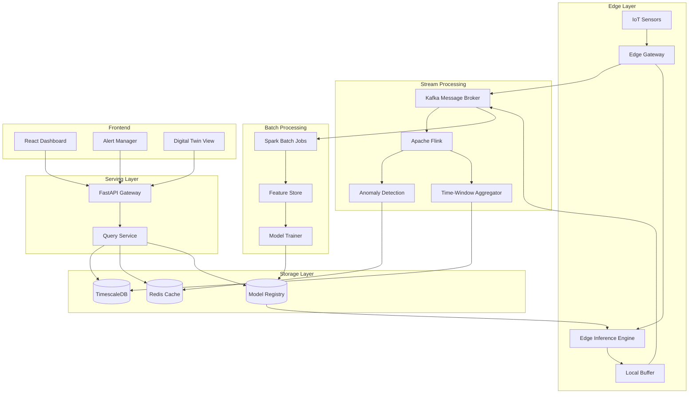

# Project 2: Predictive Maintenance and Asset Performance Platform

## Manufacturing/IoT Domain - Time-Series Analytics and Edge Computing

### 2.1 Business Case and Problem Statement

#### The Manufacturing Downtime Challenge

Unplanned equipment downtime costs manufacturing companies billions of dollars annually. Studies indicate that the average factory experiences 800 hours of unplanned downtime per year, with costs ranging from $10,000 to $250,000 per hour depending on the industry and equipment complexity. Traditional maintenance approaches—reactive maintenance that waits for failures, and preventive maintenance that follows fixed schedules—both fail to optimize the balance between reliability and cost.

Reactive maintenance results in unexpected production stoppages, rushed repairs, and potential safety incidents. Preventive maintenance, while reducing unexpected failures, leads to premature component replacement, excessive inventory costs, and unnecessary labor. Neither approach accounts for actual equipment condition, operating patterns, or environmental factors that influence component degradation.

Predictive maintenance addresses this gap by continuously monitoring equipment health and predicting failures before they occur. By analyzing sensor data streams for early warning signs, organizations can schedule maintenance during planned windows, order parts in advance, and optimize production schedules around maintenance needs. The result is typically 30-50% reduction in maintenance costs, 70-75% reduction in unplanned downtime, and extended equipment lifespan.

#### Market Context and Opportunity

The Industrial Internet of Things (IIoT) market is experiencing explosive growth, with manufacturing representing the largest segment. Global predictive maintenance market size is projected to reach $28.2 billion by 2027, growing at over 25% annually. Early adopters in automotive, aerospace, energy, and process industries have demonstrated compelling return on investment.

The opportunity spans multiple equipment types: rotating machinery (motors, pumps, compressors), production lines (conveyor systems, robotics), process equipment (boilers, reactors, separators), and facility systems (HVAC, electrical, utilities). Each equipment type presents unique monitoring requirements and failure modes, creating opportunities for specialized solutions.

The skills developed in this project transfer broadly to any domain involving sensor data, time-series analysis, and real-time monitoring. The combination of IoT protocols, streaming analytics, and machine learning deployment provides a foundation applicable to smart buildings, fleet management, healthcare devices, and infrastructure monitoring.

#### Success Metrics and Acceptance Criteria

The system must achieve the following targets for production readiness:

Detection accuracy for critical failures must exceed 85% recall with 90% precision, measured against labeled historical failure events. False positive rate should remain below 15% to prevent maintenance team alert fatigue. Prediction lead time should provide at least 24 hours advance warning for critical failures, enabling parts procurement and schedule adjustment.

Processing latency from sensor data receipt to alert generation must remain under 500 milliseconds for real-time scenarios. Data ingestion must support 10,000+ messages per second from simulated sensor networks. System must handle 30-day data retention with sub-second query performance for historical analysis.

The dashboard must enable operators to view asset health within 3 clicks from login. Alert notifications must reach maintenance teams within 30 seconds of detection through configurable channels (email, SMS, mobile push). System must maintain 99.5% uptime for production deployments.

### 2.2 Architecture Design

#### System Overview

The predictive maintenance platform follows a lambda architecture pattern combining batch and stream processing. Historical data analysis using batch pipelines provides model training and long-term trend analysis. Real-time streaming pipelines detect anomalies and generate immediate alerts. A serving layer unifies query access across both sources.

The architecture prioritizes edge computing for latency-sensitive operations. Anomaly detection models run on edge devices or gateway servers, providing immediate alerts even during network outages. Cloud resources handle model training, historical analysis, and cross-facility insights. A digital twin layer provides visualization and simulation capabilities.

Security considerations address industrial network requirements including protocol conversion, DMZ architectures, and network segmentation. The system must operate within OT (Operational Technology) network constraints while enabling IT integration for enterprise visibility.

#### Component Architecture



#### Technology Stack Summary

| Component | Technology | Justification |
|-----------|------------|---------------|
| Message Broker | Apache Kafka 3.x | High-throughput, durable streaming |
| Stream Processing | Apache Flink 1.17 | Stateful processing, exactly-once semantics |
| Time-Series DB | TimescaleDB (PostgreSQL) | SQL interface, automatic partitioning |
| Edge Runtime | AWS Greengrass / K3s | Lightweight K8s for edge |
| ML at Edge | ONNX Runtime / TFLite | Cross-platform inference optimization |
| Protocol Adapters | MQTT, OPC-UA | Industrial protocol standards |
| Orchestration | Airflow 2.x | Batch pipeline orchestration |
| Feature Store | Feast | Feature reuse across training/serving |
| Dashboard | React + Three.js | 3D visualization for digital twin |
| Alerting | Prometheus Alertmanager | Proven alerting at scale |

#### Data Flow

Sensor data flows from field devices through edge gateways that perform protocol conversion and initial filtering. OPC UA connections capture standardized industrial data. MQTT messages from distributed sensors arrive at the message broker for distribution to processing pipelines.

Stream processing applies windowing functions to compute rolling statistics, detects anomalies using statistical methods and trained models, and routes alerts based on severity and asset criticality. Alert routing considers maintenance schedules, on-call rotations, and escalation policies.

Batch processing runs periodically to retrain models using accumulated data. Feature stores maintain consistent feature definitions across training and serving. Model registry tracks model versions, performance metrics, and deployment status.

The serving layer provides unified query access for dashboards and APIs. Time-series queries retrieve historical trends. Real-time queries fetch current health status. Model serving endpoints provide inference for comparison operations.

### 2.3 Implementation Guide

#### Project Structure

```
predictive-maintenance/
├── edge/
│   ├── gateway/              # Edge gateway services
│   │   ├── opcua_client.py   # OPC UA protocol adapter
│   │   ├── mqtt_bridge.py    # MQTT to Kafka bridge
│   │   └── config.py         # Gateway configuration
│   ├── inference/            # Edge ML inference
│   │   ├── engine.py         # ONNX inference engine
│   │   ├── models/           # Deployed model files
│   │   └── test_data/        # Simulation test data
│   └── deployment/           # Edge deployment configs
│       ├── k3s-manifests/
│       └── docker/
├── stream/
│   ├── kafka/                # Kafka configurations
│   ├── flink-jobs/           # Flink streaming jobs
│   │   ├── anomaly_detection.py
│   │   ├── aggregation.py
│   │   └── alerting.py
│   └── monitoring/           # Stream monitoring
├── batch/
│   ├── spark/                # Spark batch jobs
│   ├── feature_engineering/
│   ├── model_training/
│   └── evaluation/
├── serving/
│   ├── api/                  # FastAPI application
│   ├── models/
│   │   ├── schemas.py        # Pydantic models
│   │   ├── queries.py        # Time-series queries
│   │   └── inference.py      # Model serving
│   └── services/
│       ├── asset_service.py
│       ├── alert_service.py
│       └── report_service.py
├── frontend/
│   ├── src/
│   │   ├── components/
│   │   ├── pages/
│   │   ├── hooks/
│   │   └── services/
│   └── public/
├── deployment/
│   ├── docker/
│   ├── kubernetes/
│   └── terraform/
├── tests/
│   ├── unit/
│   ├── integration/
│   └── load/
└── docs/
```

#### Edge Gateway Implementation

```python
# edge/gateway/opcua_client.py
import asyncio
from datetime import datetime
from typing import Dict, List, Optional, Callable
import logging
from dataclasses import dataclass, asdict

from asyncua import Client, Node, ua
from asyncua.common import calibrate_system_parameters

logger = logging.getLogger(__name__)

@dataclass
class SensorReading:
    """Represents a single sensor measurement."""
    asset_id: str
    sensor_id: str
    value: float
    timestamp: datetime
    quality: str  # "good", "uncertain", "bad"
    unit: str

@dataclass
class OPCUAConfig:
    """Configuration for OPC UA connection."""
    endpoint_url: str
    username: Optional[str] = None
    password: Optional[str] = None
    certificate_path: Optional[str] = None
    private_key_path: Optional[str] = None
    subscription_interval: float = 1.0  # seconds
    reconnect_interval: float = 5.0  # seconds
    max_reconnect_attempts: int = 10

class OPCUAGateway:
    """
    OPC UA client for connecting to industrial equipment.
    
    Supports subscription-based data collection and
    node browsing for asset discovery.
    """
    
    def __init__(self, config: OPCUAConfig):
        self.config = config
        self.client: Optional[Client] = None
        self.subscription = None
        self.subscription_handle: Optional[int] = None
        self.connected = False
        self.reading_callback: Optional[Callable[[List[SensorReading]], None]] = None
        self._reconnect_task: Optional[asyncio.Task] = None
        
        # Asset node mappings
        self.asset_nodes: Dict[str, Node] = {}
        self.node_cache: Dict[str, Node] = {}
    
    async def connect(self) -> bool:
        """Establish connection to OPC UA server."""
        try:
            self.client = Client(url=self.config.endpoint_url)
            
            # Configure security if certificates provided
            if self.config.certificate_path and self.config.private_key_path:
                self.client.set_security_string(
                    "Basic256Sha256,SignAndEncrypt",
                    certificate=self.config.certificate_path,
                    private_key=self.config.private_key_path,
                    server_certificate=None
                )
            
            # Configure authentication
            if self.config.username and self.config.password:
                self.client.set_user(self.config.username)
                self.client.set_password(self.config.password)
            
            await self.client.connect()
            
            # Calibrate for optimal performance
            calibrate_system_parameters(
                max_messages_per_second=1000,
                max_subscription_inquiries=10000
            )
            
            self.connected = True
            logger.info(f"Connected to OPC UA server: {self.config.endpoint_url}")
            
            # Start reconnection handler
            self._reconnect_task = asyncio.create_task(self._reconnect_loop())
            
            return True
            
        except Exception as e:
            logger.error(f"Failed to connect to OPC UA server: {e}")
            self.connected = False
            return False
    
    async def disconnect(self):
        """Gracefully disconnect from OPC UA server."""
        if self._reconnect_task:
            self._reconnect_task.cancel()
            try:
                await self._reconnect_task
            except asyncio.CancelledError:
                pass
        
        if self.subscription and self.subscription_handle:
            try:
                await self.client.delete_subscription(self.subscription_handle)
            except Exception as e:
                logger.warning(f"Error deleting subscription: {e}")
        
        if self.client:
            try:
                await self.client.disconnect()
            except Exception as e:
                logger.warning(f"Error during disconnect: {e}")
        
        self.connected = False
        logger.info("Disconnected from OPC UA server")
    
    async def _reconnect_loop(self):
        """Handle automatic reconnection on disconnect."""
        while True:
            try:
                await asyncio.sleep(self.config.reconnect_interval)
                if not self.connected:
                    logger.info("Attempting to reconnect...")
                    if await self.connect():
                        # Resubscribe to nodes
                        if self.asset_nodes:
                            await self.subscribe_to_nodes(list(self.asset_nodes.keys()))
            except asyncio.CancelledError:
                break
            except Exception as e:
                logger.error(f"Reconnection error: {e}")
    
    async def discover_assets(self) -> List[Dict]:
        """Browse OPC UA server to discover available assets."""
        if not self.client:
            raise RuntimeError("Not connected to OPC UA server")
        
        assets = []
        root = self.client.nodes.root
        objects = self.client.nodes.objects
        
        # Browse objects folder for device nodes
        try:
            children = await objects.get_children()
            for node in children:
                try:
                    node_class = await node.read_node_class()
                    if node_class == ua.NodeClass.Object:
                        browse_name = await node.read_browse_name()
                        assets.append({
                            "node_id": node.nodeid.to_string(),
                            "name": browse_name.Name,
                            "type": "asset"
                        })
                except Exception:
                    continue
        except Exception as e:
            logger.error(f"Error browsing assets: {e}")
        
        return assets
    
    async def read_node_value(
        self, node_id: str
    ) -> Optional[SensorReading]:
        """Read a single node value."""
        if not self.client:
            raise RuntimeError("Not connected")
        
        try:
            node = self.client.get_node(node_id)
            value = await node.read_value()
            data_value = await node.read_data_value()
            
            # Get node attributes for metadata
            browse_name = await node.read_browse_name()
            display_name = await node.read_display_name()
            
            return SensorReading(
                asset_id=node_id,
                sensor_id=browse_name.Name,
                value=float(value) if value is not None else 0.0,
                timestamp=data_value.source_timestamp or datetime.utcnow(),
                quality=data_value.status_code.name if data_value.status_code else "good",
                unit="raw"  # Would need additional query for unit
            )
            
        except Exception as e:
            logger.error(f"Error reading node {node_id}: {e}")
            return None
    
    async def subscribe_to_nodes(
        self, node_ids: List[str], callback: Optional[Callable[[List[SensorReading]], None]] = None
    ) -> bool:
        """
        Subscribe to multiple nodes for continuous monitoring.
        
        Args:
            node_ids: List of OPC UA node IDs to monitor
            callback: Async callback for receiving readings
        """
        if not self.client:
            raise RuntimeError("Not connected to OPC UA server")
        
        self.reading_callback = callback
        
        try:
            # Create subscription
            self.subscription = await self.client.create_subscription(
                self.config.subscription_interval,
                self._subscription_callback
            )
            
            # Get node objects
            nodes = [self.client.get_node(nid) for nid in node_ids]
            
            # Create monitored items
            handles = await self.subscription.subscribe_data_change(
                nodes, 
                attr=ua.AttributeIds.Value
            )
            
            self.subscription_handle = self.subscription.subscription_id
            logger.info(f"Subscribed to {len(node_ids)} nodes")
            
            return True
            
        except Exception as e:
            logger.error(f"Failed to subscribe to nodes: {e}")
            return False
    
    async def _subscription_callback(self, data: List):
        """Handle incoming subscription data."""
        readings = []
        
        for item in data:
            try:
                node = item.monitored_item.node
                value = item.value.Value.Value
                timestamp = item.value.SourceTimestamp or datetime.utcnow()
                
                browse_name = await node.read_browse_name()
                
                reading = SensorReading(
                    asset_id=node.nodeid.to_string(),
                    sensor_id=browse_name.Name,
                    value=float(value) if value is not None else 0.0,
                    timestamp=timestamp,
                    quality=item.value.StatusCode.name if item.value.StatusCode else "good",
                    unit="raw"
                )
                readings.append(reading)
                
            except Exception as e:
                logger.error(f"Error processing subscription data: {e}")
        
        # Invoke callback if registered
        if self.reading_callback and readings:
            try:
                await self.reading_callback(readings)
            except Exception as e:
                logger.error(f"Error in reading callback: {e}")
    
    async def write_node_value(self, node_id: str, value: float) -> bool:
        """Write a value to an OPC UA node."""
        if not self.client:
            raise RuntimeError("Not connected")
        
        try:
            node = self.client.get_node(node_id)
            await node.write_value(ua.DataValue(ua.Variant(value, ua.VariantType.Double)))
            return True
        except Exception as e:
            logger.error(f"Error writing to node {node_id}: {e}")
            return False
```

#### MQTT Bridge Implementation

```python
# edge/gateway/mqtt_bridge.py
import asyncio
import json
import logging
from datetime import datetime
from typing import Dict, List, Optional, Callable
from dataclasses import dataclass, asdict

import aiomqtt
from aiomqtt import MqttQualityOfService

logger = logging.getLogger(__name__)

@dataclass
class MQTTConfig:
    """Configuration for MQTT connection."""
    broker_host: str
    broker_port: int = 1883
    username: Optional[str] = None
    password: Optional[str] = None
    client_id: str = "edge-gateway"
    use_tls: bool = False
    keepalive: int = 60
    qos: int = 1  # At least once delivery

class MQTTBridge:
    """
    MQTT client for connecting to IoT sensor networks.
    
    Handles message publishing to Kafka and subscribing
    for command/control operations.
    """
    
    def __init__(self, config: MQTTConfig, kafka_producer):
        self.config = config
        self.kafka_producer = kafka_producer
        self.client: Optional[aiomqtt.Client] = None
        self.connected = False
        self.sensor_callback: Optional[Callable[[List[Dict]], None]] = None
        
        # Topic mappings
        self.topic_mappings: Dict[str, List[str]] = {
            "sensors": ["sensors/+/data", "devices/+/telemetry"],
            "alerts": ["alerts/#"],
            "commands": ["commands/#"],
        }
    
    async def connect(self) -> bool:
        """Establish connection to MQTT broker."""
        try:
            # Create client with configuration
            self.client = aiomqtt.Client(
                hostname=self.config.broker_host,
                port=self.config.broker_port,
                client_id=self.config.client_id,
                keepalive=self.config.keepalive,
                qos=MqttQualityOfService(self.config.qos)
            )
            
            # Configure authentication if provided
            if self.config.username and self.config.password:
                self.client.username_pw_set(
                    self.config.username,
                    self.config.password
                )
            
            # Configure TLS if enabled
            if self.config.use_tls:
                self.client.tls_set()
            
            await self.client.connect()
            self.connected = True
            logger.info(f"Connected to MQTT broker: {self.config.broker_host}:{self.config.broker_port}")
            
            # Start background tasks
            asyncio.create_task(self._message_handler())
            
            return True
            
        except Exception as e:
            logger.error(f"Failed to connect to MQTT broker: {e}")
            self.connected = False
            return False
    
    async def disconnect(self):
        """Disconnect from MQTT broker."""
        if self.client:
            try:
                await self.client.disconnect()
            except Exception as e:
                logger.warning(f"Error disconnecting from MQTT: {e}")
        self.connected = False
        logger.info("Disconnected from MQTT broker")
    
    async def publish(self, topic: str, payload: Dict, qos: int = None) -> bool:
        """
        Publish a message to a MQTT topic.
        
        Args:
            topic: MQTT topic path
            payload: Dictionary to serialize as JSON
            qos: Quality of service level (defaults to config value)
        """
        if not self.client or not self.connected:
            raise RuntimeError("Not connected to MQTT broker")
        
        try:
            qos = qos or self.config.qos
            message = aiomqtt.Message(
                topic=topic,
                payload=json.dumps(payload, default=str),
                qos=MqttQualityOfService(qos),
                retain=False
            )
            await self.client.publish(message)
            return True
        except Exception as e:
            logger.error(f"Error publishing to {topic}: {e}")
            return False
    
    async def subscribe(self, topics: List[str]) -> bool:
        """
        Subscribe to MQTT topics for receiving messages.
        
        Args:
            topics: List of topic patterns to subscribe to
        """
        if not self.client or not self.connected:
            raise RuntimeError("Not connected to MQTT broker")
        
        try:
            for topic in topics:
                await self.client.subscribe(topic)
                logger.info(f"Subscribed to topic: {topic}")
            return True
        except Exception as e:
            logger.error(f"Error subscribing to topics: {e}")
            return False
    
    async def _message_handler(self):
        """Background task to handle incoming MQTT messages."""
        try:
            async with self.client.messages() as messages:
                async for message in messages:
                    try:
                        # Parse message
                        topic = message.topic.value
                        payload = json.loads(message.payload.decode())
                        
                        # Route to appropriate handler
                        if "data" in topic or "telemetry" in topic:
                            await self._handle_sensor_data(topic, payload)
                        elif "alerts" in topic:
                            await self._handle_alert(topic, payload)
                        elif "commands" in topic:
                            await self._handle_command(topic, payload)
                            
                    except json.JSONDecodeError:
                        logger.warning(f"Invalid JSON in message from {message.topic}")
                    except Exception as e:
                        logger.error(f"Error processing MQTT message: {e}")
                        
        except asyncio.CancelledError:
            logger.info("MQTT message handler cancelled")
        except Exception as e:
            logger.error(f"MQTT message handler error: {e}")
    
    async def _handle_sensor_data(self, topic: str, payload: Dict):
        """Process incoming sensor data message."""
        try:
            # Normalize sensor data format
            sensor_data = {
                "asset_id": payload.get("device_id", payload.get("asset_id")),
                "sensor_id": payload.get("sensor_id", payload.get("sensor_id")),
                "value": payload.get("value", payload.get("reading")),
                "timestamp": payload.get("timestamp", datetime.utcnow().isoformat()),
                "unit": payload.get("unit", "raw"),
                "topic": topic,
                "received_at": datetime.utcnow().isoformat()
            }
            
            # Forward to Kafka
            await self.kafka_producer.send(
                topic="maintenance.sensors.raw",
                value=sensor_data,
                key=sensor_data["asset_id"].encode()
            )
            
            # Invoke callback if registered
            if self.sensor_callback:
                await self.sensor_callback([sensor_data])
                
        except Exception as e:
            logger.error(f"Error processing sensor data: {e}")
    
    async def _handle_alert(self, topic: str, payload: Dict):
        """Process incoming alert message."""
        alert_data = {
            "alert_id": payload.get("alert_id"),
            "severity": payload.get("severity", "warning"),
            "message": payload.get("message"),
            "asset_id": payload.get("asset_id"),
            "timestamp": payload.get("timestamp", datetime.utcnow().isoformat()),
            "topic": topic
        }
        
        # Forward to Kafka for processing
        await self.kafka_producer.send(
            topic="maintenance.alerts",
            value=alert_data,
            key=alert_data["asset_id"].encode()
        )
    
    async def _handle_command(self, topic: str, payload: Dict):
        """Process incoming command message."""
        logger.info(f"Received command on {topic}: {payload}")
        
        # Commands could trigger edge actions
        # This is a placeholder for command handling logic
        command = payload.get("command")
        target = payload.get("target")
        
        if command == "ping":
            response = {
                "command": "pong",
                "target": target,
                "timestamp": datetime.utcnow().isoformat()
            }
            await self.publish(f"commands/{target}/response", response)
```

#### Stream Processing with Apache Flink

```python
# stream/flink-jobs/anomaly_detection.py
"""
Apache Flink job for real-time anomaly detection on sensor data.

This job performs:
1. Sensor data ingestion from Kafka
2. Time-windowed aggregation
3. Statistical anomaly detection
4. Alert generation and routing
"""

from pyflink.datastream import StreamExecutionEnvironment
from pyflink.datastream.connectors import FlinkKafkaConsumer, FlinkKafkaProducer
from pyflink.datastream.formats.json import JsonRowDeserializationSchema, JsonRowSerializationSchema
from pyflink.datastream.window import TumblingEventTimeWindows, Time
from pyflink.common import Row, Types, TimeWindow
from pyflink.common.watermark_strategy import WatermarkStrategy
from datetime import timedelta
import logging
import json
import statistics

# Configure logging
logging.basicConfig(level=logging.INFO)
logger = logging.getLogger(__name__)

class AnomalyDetectionJob:
    """
    Flink job for detecting anomalies in sensor data streams.
    
    Uses multiple detection algorithms:
    - Z-score based detection for normal distributions
    - IQR-based detection for robust statistics
    - Rate-of-change detection for sudden changes
    """
    
    # Detection thresholds (configurable per sensor type)
    THRESHOLDS = {
        "temperature": {
            "z_score": 3.0,
            "iqr_multiplier": 1.5,
            "rate_of_change": 10.0,  # degrees per minute
            "min_value": -40.0,
            "max_value": 200.0
        },
        "vibration": {
            "z_score": 3.0,
            "iqr_multiplier": 1.5,
            "rate_of_change": 50.0,  # mm/s per minute
            "min_value": 0.0,
            "max_value": 500.0
        },
        "pressure": {
            "z_score": 3.0,
            "iqr_multiplier": 1.5,
            "rate_of_change": 5.0,  # bar per minute
            "min_value": 0.0,
            "max_value": 100.0
        },
        "default": {
            "z_score": 3.0,
            "iqr_multiplier": 1.5,
            "rate_of_change": 0.0,
            "min_value": float('-inf'),
            "max_value": float('inf')
        }
    }
    
    def __init__(self, kafka_config: dict, window_size_seconds: int = 60):
        self.kafka_config = kafka_config
        self.window_size = window_size_seconds
        self.env = StreamExecutionEnvironment.get_execution_environment()
    
    def create_source(self) -> FlinkKafkaConsumer:
        """Create Kafka consumer for sensor data."""
        deserialization_schema = JsonRowDeserializationSchema.builder() \
            .type_info(Types.ROW([
                Types.STRING(),  # asset_id
                Types.STRING(),  # sensor_id
                Types.DOUBLE(),  # value
                Types.STRING(),  # timestamp
                Types.STRING(),  # sensor_type
                Types.STRING()   # unit
            ])).build()
        
        kafka_consumer = FlinkKafkaConsumer(
            topics="maintenance.sensors.raw",
            deserialization_schema=deserialization_schema,
            properties={
                "bootstrap.servers": self.kafka_config["bootstrap_servers"],
                "group.id": "anomaly-detection-job",
                "auto.offset.reset": "latest"
            }
        )
        
        # Configure watermark strategy for event time processing
        watermark_strategy = WatermarkStrategy.for_bounded_out_of_orderness(
            timedelta(seconds=30)
        ).with_timestamp_assigner(
            event_time_timestamp_extractor=lambda row: int(row[3])
        )
        
        return kafka_consumer.configure_timestamp_assigner(watermark_strategy)
    
    def create_sink(self) -> FlinkKafkaProducer:
        """Create Kafka producer for anomaly alerts."""
        serialization_schema = JsonRowSerializationSchema.builder() \
            .with_field_names([
                "asset_id", "sensor_id", "timestamp", "alert_type",
                "anomaly_score", "value", "expected_range", "severity"
            ]) \
            .with_type_info(Types.ROW([
                Types.STRING(),  # asset_id
                Types.STRING(),  # sensor_id
                Types.STRING(),  # timestamp
                Types.STRING(),  # alert_type
                Types.DOUBLE(),  # anomaly_score
                Types.DOUBLE(),  # value
                Types.STRING(),  # expected_range
                Types.STRING()   # severity
            ])).build()
        
        return FlinkKafkaProducer(
            topic="maintenance.alerts.anomaly",
            serialization_schema=serialization_schema,
            producer_properties={
                "bootstrap.servers": self.kafka_config["bootstrap_servers"],
                "acks": "all"
            }
        )
    
    def run(self):
        """Execute the Flink job."""
        # Set parallelism
        self.env.set_parallelism(4)
        
        # Create source and sink
        source = self.create_source()
        sink = self.create_sink()
        
        # Build processing pipeline
        stream = self.env.add_source(source)
        
        # Key by asset and sensor for windowing
        keyed_stream = stream.key_by(
            lambda row: f"{row[0]}_{row[1]}"  # asset_id_sensor_id
        )
        
        # Apply tumbling window for aggregation
        windowed_stream = keyed_stream.window(
            TumblingEventTimeWindows.of(Time.seconds(self.window_size))
        )
        
        # Process window to detect anomalies
        anomaly_stream = windowed_stream.process(
            self._AnomalyDetectionFunction()
        )
        
        # Filter non-anomalies and send to output
        anomaly_stream.filter(lambda row: row[7] != "normal") \
            .add_sink(sink)
        
        # Execute job
        self.env.execute("Anomaly Detection Job")
    
    class _AnomalyDetectionFunction:
        """Process function for anomaly detection within windows."""
        
        def process_element(self, values, ctx):
            """
            Process a window of sensor readings.
            
            Values format: list of rows with
            [asset_id, sensor_id, value, timestamp, sensor_type, unit]
            """
            asset_id = values[0][0]
            sensor_id = values[0][1]
            sensor_type = values[0][4] if len(values[0]) > 4 else "default"
            timestamp = values[0][3]
            
            # Extract values
            readings = [v[2] for v in values]
            
            if len(readings) < 3:
                # Not enough data for statistical analysis
                return
            
            # Get thresholds for sensor type
            thresholds = AnomalyDetectionJob.THRESHOLDS.get(
                sensor_type,
                AnomalyDetectionJob.THRESHOLDS["default"]
            )
            
            # Calculate statistics
            mean_val = statistics.mean(readings)
            std_val = statistics.stdev(readings) if len(readings) > 1 else 0
            min_val = min(readings)
            max_val = max(readings)
            
            # Z-score detection
            z_scores = []
            if std_val > 0:
                z_scores = [(v - mean_val) / std_val for v in readings]
                max_z = max(abs(s) for s in z_scores)
            else:
                max_z = 0
            
            # IQR detection
            sorted_readings = sorted(readings)
            q1_idx = len(sorted_readings) // 4
            q3_idx = 3 * len(sorted_readings) // 4
            q1 = sorted_readings[q1_idx]
            q3 = sorted_readings[q3_idx]
            iqr = q3 - q1
            lower_bound = q1 - thresholds["iqr_multiplier"] * iqr
            upper_bound = q3 + thresholds["iqr_multiplier"] * iqr
            
            # Rate of change detection
            if len(readings) > 1:
                rate_of_change = abs(readings[-1] - readings[0]) / len(readings)
            else:
                rate_of_change = 0
            
            # Determine anomalies
            anomalies = []
            for i, (value, z_score) in enumerate(zip(readings, z_scores)):
                anomaly_types = []
                score = 0.0
                severity = "normal"
                
                # Z-score anomaly
                if abs(z_score) > thresholds["z_score"]:
                    anomaly_types.append("statistical")
                    score = max(score, abs(z_score) / thresholds["z_score"])
                
                # IQR anomaly
                if value < lower_bound or value > upper_bound:
                    anomaly_types.append("iqr_outlier")
                    score = max(score, 0.8)
                
                # Range check
                if value < thresholds["min_value"] or value > thresholds["max_value"]:
                    anomaly_types.append("range_violation")
                    score = max(score, 1.0)
                
                # Rate of change anomaly
                if rate_of_change > thresholds["rate_of_change"]:
                    anomaly_types.append("rapid_change")
                    score = max(score, 0.6)
                
                if anomaly_types:
                    # Determine severity
                    if score >= 1.0:
                        severity = "critical"
                    elif score >= 0.7:
                        severity = "high"
                    elif score >= 0.4:
                        severity = "medium"
                    else:
                        severity = "low"
                    
                    anomalies.append((
                        asset_id, sensor_id, timestamp,
                        ",".join(anomaly_types), score, value,
                        f"[{lower_bound:.2f}, {upper_bound:.2f}]",
                        severity
                    ))
            
            # Emit anomalies
            for anomaly in anomalies:
                yield anomaly


# Main execution
if __name__ == "__main__":
    kafka_config = {
        "bootstrap.servers": "kafka:9092"
    }
    
    job = AnomalyDetectionJob(kafka_config, window_size_seconds=60)
    job.run()
```

### 2.4 Common Pitfalls and Solutions

#### Pitfall 1: Sensor Data Quality Issues

Real-world sensor data contains missing values, noise, outliers, and calibration errors. Naive analysis produces spurious anomalies that erode trust in the system.

**Detection:** Monitor data quality metrics: missing value rates, value distributions, sensor health indicators. Track calibration drift through baseline comparisons. Flag sensors with consistently high anomaly rates.

**Solution:** Implement robust data quality pipelines that validate, clean, and impute missing values before analysis. Use rolling statistics that are robust to outliers. Calibrate sensors against known references and monitor drift. Provide data quality scores that factor into anomaly confidence.

```python
async def validate_sensor_reading(
    self, reading: SensorReading, asset_config: AssetConfig
) -> Tuple[bool, str]:
    """Validate sensor reading quality before processing."""
    issues = []
    
    # Check for missing values
    if reading.value is None:
        return False, "Missing value"
    
    # Range validation
    min_val = asset_config.sensor_ranges.get(reading.sensor_id, {}).get("min")
    max_val = asset_config.sensor_ranges.get(reading.sensor_id, {}).get("max")
    
    if min_val is not None and reading.value < min_val:
        issues.append(f"Value below minimum: {reading.value} < {min_val}")
    if max_val is not None and reading.value > max_val:
        issues.append(f"Value above maximum: {reading.value} > {max_val}")
    
    # Rate of change validation
    if hasattr(self, f"_last_reading_{reading.sensor_id}"):
        last = getattr(self, f"_last_reading_{reading.sensor_id}")
        time_diff = (reading.timestamp - last.timestamp).total_seconds()
        if time_diff > 0:
            rate = abs(reading.value - last.value) / time_diff
            max_rate = asset_config.max_rate_of_change.get(reading.sensor_id, 1000)
            if rate > max_rate:
                issues.append(f"Rate of change exceeded: {rate:.2f} > {max_rate}")
    
    # Update last reading
    setattr(self, f"_last_reading_{reading.sensor_id}", reading)
    
    return len(issues) == 0, "; ".join(issues) if issues else "OK"
```

#### Pitfall 2: Model Degradation Over Time

Machine learning models trained on historical data degrade as equipment ages, operating conditions change, and new failure modes emerge. Without continuous monitoring, prediction accuracy drifts lower over time.

**Detection:** Track prediction accuracy against actual outcomes. Monitor feature distribution drift between training data and current data. Set alerts for declining model performance metrics.

**Solution:** Implement continuous model monitoring with automated retraining triggers. Use concept drift detection algorithms. Maintain model versioning with rollback capability. A/B test new models against current production models.

#### Pitfall 3: Alert Fatigue

Excessive false positives cause operators to ignore alerts, potentially missing real failures. The system becomes noise rather than signal.

**Detection:** Track alert dismissal rates and escalation patterns. Measure mean time to acknowledge and respond to alerts. Survey operator satisfaction with alert quality.

**Solution:** Implement smart alerting that considers asset criticality, time of day, and operational context. Use alert bundling for related issues. Provide feedback mechanisms for operators to tune sensitivity. Implement severity stratification with different notification channels.

### 2.5 Extension Opportunities

#### Extension 1: Digital Twin Integration

Create 3D virtual representations of physical assets that visualize sensor data in real-time, enable simulation of operating scenarios, and support augmented reality maintenance instructions.

Technical approach: Use Three.js or Babylon.js for 3D rendering. Connect digital twin to streaming data for live updates. Build simulation engine for what-if analysis. Integrate AR frameworks for mobile maintenance assistance.

#### Extension 2: Spare Parts Optimization

Combine predictive maintenance with inventory optimization to ensure parts availability for predicted failures while minimizing inventory costs.

Technical approach: Integrate failure prediction with parts inventory system. Build optimization model balancing stockout risk against holding costs. Implement automatic purchase order generation based on predictions.

#### Extension 3: Multi-Site Aggregation

Extend single-facility deployment to multi-site enterprise architecture with centralized model training and distributed inference.

Technical approach: Implement federated learning for cross-site model improvement. Build centralized dashboard with site comparison. Create enterprise-wide reporting and compliance analytics.

### 2.6 Code Review Checklist

**Functionality:**
- Edge gateway handles connection failures gracefully
- Stream processing provides exactly-once semantics
- Alert routing considers severity and escalation policies
- Model inference runs within latency budget
- Data quality validation catches invalid inputs

**Code Quality:**
- Protocol adapters handle all defined OPC UA/MQTT features
- Time-series queries use appropriate window functions
- Configuration externalized for environment-specific values
- Logging provides sufficient context for debugging

**Testing:**
- Unit tests cover all detection algorithms
- Integration tests verify end-to-end data flow
- Load tests validate performance under peak load
- Chaos tests verify failure handling

**Security:**
- OPC UA security configuration documented
- MQTT credentials stored securely
- Network segmentation implemented between IT/OT
- Audit logging captures all access

### 2.7 Project Presentation Guidelines

**Structure:**

1. Problem Statement (2 minutes): Manufacturing downtime costs, predictive maintenance benefits, industry statistics

2. Solution Demo (5 minutes): Live dashboard showing asset health, simulated sensor data stream, alert demonstration, digital twin visualization

3. Technical Deep-Dive (5 minutes): Edge computing architecture, streaming pipeline design, ML model explanation, scaling considerations

4. Challenges (3 minutes): Protocol integration complexity, data quality challenges, model drift management

5. Future Vision (2 minutes): Digital twin roadmap, enterprise scaling, autonomous maintenance

### 2.8 Open Source Contribution Guide

**Contribution Areas:**
- Additional protocol adapters (Modbus, BACnet, Profinet)
- New anomaly detection algorithms
- Dashboard visualization improvements
- Edge deployment automation
- Documentation and tutorials

**Good First Issues:**
- Add unit tests for protocol adapters
- Improve error messages for configuration issues
- Add example configurations for common equipment types
- Create deployment guides for different cloud providers
