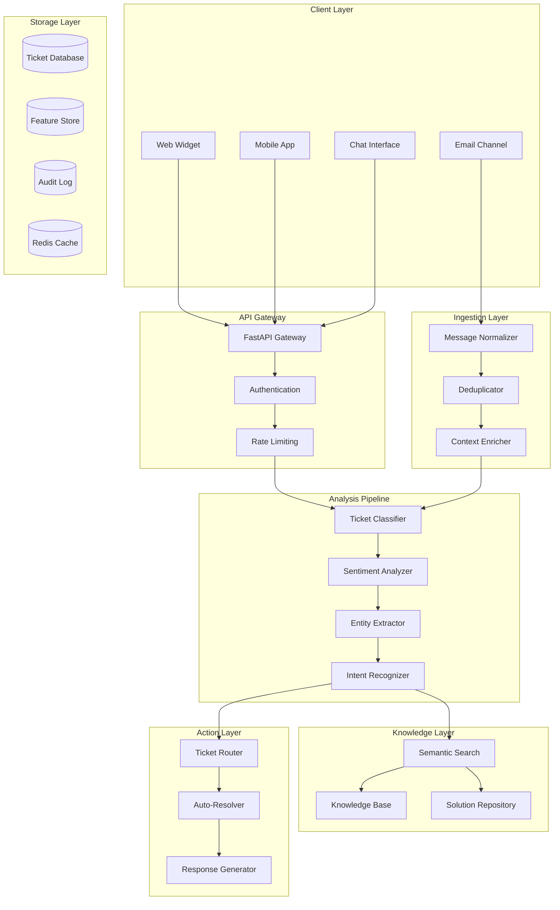

# Project 3: Autonomous Customer Support Resolution System

## Customer Service AI - NLP and Classification

### 3.1 Business Case and Problem Statement

#### The Customer Support Challenge

Modern organizations face unprecedented pressure on their customer support operations. As digital channels multiply and customer expectations rise, support teams struggle to maintain service quality while managing escalating ticket volumes. A typical mid-sized company receives thousands of support requests monthly across email, chat, social media, and phone channels. Each ticket requires classification, prioritization, routing to appropriate teams, and ideally, resolution. Manual processing introduces delays, inconsistencies, and escalating labor costs that directly impact customer satisfaction and brand reputation.

The economics of customer support reveal significant inefficiencies in traditional approaches. Industry research indicates that 60-70% of support tickets fall into repetitive categories with standard resolutions. Yet human agents spend valuable time on basic inquiries that could be automated, while complex cases requiring human judgment face delays due to overwhelmed queues. The cost of support staffing, training, and turnover compounds these challenges, with enterprise support organizations spending hundreds of millions annually on personnel alone.

Customer expectations have transformed dramatically in the digital age. Consumers expect instant responses, 24/7 availability, and consistent service quality across all interaction channels. Long wait times, repetitive information requests, and transfers between departments create frustration that drives customer churn. Studies show that customers who experience poor support are significantly more likely to defect to competitors and share negative experiences through reviews and social media, amplifying the business impact beyond immediate transaction losses.

This project addresses the fundamental challenge of intelligent ticket automation that augments human agents rather than replacing them. By building a system that automatically classifies incoming requests, identifies customer intent and sentiment, suggests relevant solutions from knowledge bases, and routes complex cases to appropriate specialists, we create infrastructure that dramatically improves response times, consistency, and customer satisfaction while reducing operational costs.

#### Market Context and Opportunity

The customer service software market represents a massive and growing opportunity. Global spending on customer relationship management and support solutions exceeds $50 billion annually, with AI-powered automation driving the fastest growth segment. Early adopters of intelligent ticket handling report 30-50% reductions in response times, 40-60% improvements in first-contact resolution rates, and corresponding decreases in support staffing requirements for routine inquiries.

The opportunity spans multiple industry verticals with distinct requirements. E-commerce companies need rapid resolution of order, shipping, and return inquiries. SaaS providers must handle technical troubleshooting and account management. Financial services require compliance-aware handling of sensitive account issues. Healthcare organizations need patient-friendly communication with strict privacy controls. Each domain presents unique challenges around terminology, compliance, and customer expectations that create opportunities for specialized solutions built on common underlying technology.

The skills developed in this project transfer broadly to related domains including sentiment analysis for social media monitoring, document classification for content moderation, and intent recognition for conversational interfaces. The core competencies in text classification, sequence modeling, and feedback-driven optimization apply across industries facing similar challenges of processing unstructured natural language inputs at scale.

#### Success Metrics and Acceptance Criteria

The autonomous support system must achieve specific performance targets to demonstrate production viability. Ticket classification accuracy must exceed 94% for top-level categories and 88% for detailed subcategories, measured against human-annotated ground truth datasets. Sentiment classification must achieve 90% agreement with human reviewers on positive, neutral, and negative categorization, with 85% accuracy on more granular emotion detection.

Response time improvements form a core success criterion. The system must auto-resolve 35% of incoming tickets without human agent involvement while maintaining customer satisfaction scores equivalent to or exceeding human-handled interactions. Average first response time for auto-classified and routed tickets must decrease by 70% compared to manual processing. Customer satisfaction ratings for resolved tickets must remain within 3% of human-handled satisfaction scores.

The system must handle production scale requirements. Processing latency for ticket classification must remain under 200 milliseconds to enable real-time recommendations during customer interactions. The architecture must support 1,000 concurrent ticket processing requests with sub-second response times. System availability must meet 99.9% uptime requirements for mission-critical support operations.

### 3.2 Architecture Design

#### System Overview

The autonomous support system follows a modern event-driven microservices architecture designed for scalability, resilience, and continuous learning. The system ingests customer communications from multiple channels, processes them through intelligent analysis pipelines, and generates appropriate responses or routing decisions. A central feature store maintains customer and ticket embeddings for similarity-based retrieval, while feedback loops enable continuous model improvement based on agent corrections and customer outcomes.

The architecture prioritizes real-time processing for immediate customer response while supporting batch processing for analytics and model retraining. Horizontal scaling capabilities ensure the system grows with ticket volume increases without architectural changes. Security considerations address the sensitive nature of customer communications, implementing encryption, access controls, and compliance frameworks appropriate for regulated industries.



#### Technology Stack Summary

| Component | Technology | Justification |
|-----------|------------|---------------|
| API Gateway | FastAPI 0.109+ | Native async support, automatic OpenAPI documentation, type validation |
| Message Queue | RabbitMQ 3.12+ | Reliable message delivery, flexible routing, dead-letter support |
| Feature Store | Redis 7.x + MLflow | Low-latency feature retrieval, experiment tracking, model versioning |
| Classification | Scikit-learn + XGBoost | Production-proven for structured feature classification |
| Deep Learning | PyTorch 2.0+ | Flexible model development, transformer integration |
| NLP Models | Hugging Face Transformers | Pre-trained models, transfer learning, active community |
| Knowledge Base | Elasticsearch 8+ | Full-text search, fuzzy matching, scalable indexing |
| Monitoring | Prometheus + Grafana | Time-series metrics, visualization, alerting |
| Tracing | Jaeger | Distributed tracing for debugging pipeline issues |

#### Data Flow

Customer communications enter the system through multiple ingestion paths. Web and chat interfaces submit messages via WebSocket connections for real-time processing. Email channels receive messages through IMAP integration, parsed and normalized into standardized ticket format. Each incoming message undergoes deduplication to handle multi-channel copies of the same inquiry and context enrichment to attach customer history and account information.

The analysis pipeline processes normalized messages through sequential stages. Text preprocessing normalizes Unicode characters, expands abbreviations, and corrects common OCR and typing errors. Classification models assign tickets to appropriate categories and subcategories based on content analysis. Sentiment analysis determines customer emotional state and urgency level. Named entity extraction identifies products, order numbers, account details, and other specific references requiring action.

Knowledge retrieval matches analyzed tickets against the solution repository using semantic similarity. When high-confidence matches exist, the system suggests relevant help articles or proposes automated resolution. Lower confidence matches trigger routing to human agents with generated summaries and recommended responses. All processing actions, model predictions, and system decisions are logged for audit, debugging, and model training purposes.

Feedback loops enable continuous system improvement. Agent corrections to auto-classified tickets provide training data for classification model updates. Customer satisfaction responses to auto-resolved tickets inform confidence thresholds and auto-resolution policies. Analytics dashboards surface performance trends and identify improvement opportunities.

### 3.3 Implementation Guide

#### Project Structure

```
autonomous-support-system/
├── app/
│   ├── api/
│   │   ├── __init__.py
│   │   ├── deps.py              # Dependency injection
│   │   ├── errors.py            # Custom exceptions
│   │   └── routes/
│   │       ├── tickets.py       # Ticket submission and retrieval
│   │       ├── analysis.py      # Analysis endpoints
│   │       └── feedback.py      # Feedback submission
│   ├── core/
│   │   ├── config.py            # Configuration management
│   │   ├── security.py          # Auth and encryption
│   │   └── logging.py           # Structured logging
│   ├── models/
│   │   ├── database.py          # SQLAlchemy models
│   │   ├── domain.py            # Pydantic schemas
│   │   └── tickets.py           # Ticket-specific models
│   ├── services/
│   │   ├── __init__.py
│   │   ├── ingestion.py         # Message ingestion
│   │   ├── analysis/
│   │   │   ├── __init__.py
│   │   │   ├── classifier.py    # Ticket classification
│   │   │   ├── sentiment.py     # Sentiment analysis
│   │   │   ├── entities.py      # Entity extraction
│   │   │   └── intent.py        # Intent recognition
│   │   ├── knowledge/           # Knowledge base services
│   │   ├── routing.py           # Ticket routing logic
│   │   └── automation.py        # Auto-resolution engine
│   └── ml/
│       ├── models/              # Trained model artifacts
│       ├── training/            # Model training scripts
│       └── evaluation/          # Model evaluation utilities
├── templates/
│   ├── code/
│   │   ├── api_template.py
│   │   ├── service_template.py
│   │   └── model_template.py
│   └── configuration/
│       ├── docker-compose.yml
│       ├── Dockerfile
│       └── config.yaml
├── tests/
│   ├── unit/
│   ├── integration/
│   └── fixtures/
├── data/
│   ├── training/                # Training datasets
│   ├── evaluation/              # Evaluation datasets
│   └── knowledge/               # Knowledge base content
└── scripts/
    ├── setup.sh
    ├── train_models.py
    └── evaluate_system.py
```

#### Core API Implementation

```python
# app/api/deps.py
from typing import Generator, Optional
from fastapi import Depends, HTTPException, status
from sqlalchemy.orm import Session
from redis import Redis
from app.core.security import verify_token
from app.db.session import get_db
from app.db.cache import get_redis

async def get_current_user(
    token: str = Depends(oauth2_scheme),
    db: Session = Depends(get_db)
) -> User:
    """Validate JWT token and return current user."""
    credentials_exception = HTTPException(
        status_code=status.HTTP_401_UNAUTHORIZED,
        detail="Could not validate credentials",
        headers={"WWW-Authenticate": "Bearer"},
    )
    payload = verify_token(token)
    if payload is None:
        raise credentials_exception
    user_id: str = payload.get("sub")
    user = db.query(User).filter(User.id == user_id).first()
    if user is None:
        raise credentials_exception
    return user

async def get_optional_user(
    token: Optional[str] = Depends(oauth2_scheme),
    db: Session = Depends(get_db)
) -> Optional[User]:
    """Return user if authenticated, None otherwise."""
    if token is None:
        return None
    try:
        return await get_current_user(token, db)
    except HTTPException:
        return None

# app/api/routes/tickets.py
from fastapi import APIRouter, Depends, HTTPException, BackgroundTasks
from sqlalchemy.orm import Session
from typing import List, Optional
from pydantic import BaseModel

from app.api.deps import get_current_user, get_db, get_optional_user
from app.schemas.tickets import TicketCreate, TicketResponse, TicketUpdate
from app.services.ingestion import TicketIngestionService
from app.services.analysis import AnalysisService
from app.services.routing import RoutingService

router = APIRouter()

class TicketSubmission(BaseModel):
    """Request model for ticket submission."""
    channel: str  # email, chat, web, phone
    subject: Optional[str] = None
    body: str
    customer_id: Optional[str] = None
    order_id: Optional[str] = None
    metadata: Optional[dict] = None

class TicketAnalysisResponse(BaseModel):
    """Response model with analysis results."""
    ticket_id: str
    category: str
    subcategory: str
    confidence: float
    sentiment: str
    sentiment_score: float
    urgency: str
    entities: List[dict]
    suggested_category: str
    suggested_response: Optional[str] = None
    knowledge_articles: List[dict] = []
    requires_human: bool
    routing_destination: Optional[str] = None

@router.post("/tickets", response_model=TicketResponse)
async def submit_ticket(
    submission: TicketSubmission,
    background_tasks: BackgroundTasks,
    current_user: User = Depends(get_optional_user),
    db: Session = Depends(get_db)
) -> TicketResponse:
    """
    Submit a new support ticket for processing.
    
    The ticket is queued for async analysis. Use the returned ticket_id
    to poll for analysis completion via the analysis endpoint.
    """
    ingestion_service = TicketIngestionService(db)
    analysis_service = AnalysisService(db)
    routing_service = RoutingService(db)
    
    # Create ticket record
    ticket = await ingestion_service.create_ticket(
        channel=submission.channel,
        subject=submission.subject,
        body=submission.body,
        customer_id=submission.customer_id,
        order_id=submission.order_id,
        metadata=submission.metadata,
        user_id=current_user.id if current_user else None
    )
    
    # Queue analysis as background task
    background_tasks.add_task(
        process_ticket_analysis,
        ticket.id,
        analysis_service,
        routing_service
    )
    
    return TicketResponse(
        id=ticket.id,
        channel=ticket.channel,
        status=ticket.status.value,
        created_at=ticket.created_at,
        message="Ticket submitted successfully. Analysis in progress."
    )

@router.get("/tickets/{ticket_id}/analysis", response_model=TicketAnalysisResponse)
async def get_ticket_analysis(
    ticket_id: str,
    current_user: User = Depends(get_current_user),
    db: Session = Depends(get_db)
) -> TicketAnalysisResponse:
    """Retrieve analysis results for a specific ticket."""
    from app.models.tickets import Ticket, TicketStatus
    
    ticket = db.query(Ticket).filter(Ticket.id == ticket_id).first()
    
    if not ticket:
        raise HTTPException(
            status_code=status.HTTP_404_NOT_FOUND,
            detail="Ticket not found"
        )
    
    # Verify access
    if ticket.user_id and ticket.user_id != current_user.id:
        raise HTTPException(
            status_code=status.HTTP_403_FORBIDDEN,
            detail="Access denied"
        )
    
    # Return cached or computed analysis
    cache = get_redis()
    cache_key = f"analysis:{ticket_id}"
    cached = cache.get(cache_key)
    
    if cached:
        return json.loads(cached)
    
    if ticket.status not in [TicketStatus.ANALYZED, TicketStatus.COMPLETED]:
        raise HTTPException(
            status_code=status.HTTP_400_BAD_REQUEST,
            detail="Analysis still in progress"
        )
    
    # Retrieve analysis results from ticket record
    analysis_data = ticket.analysis_result
    
    response = TicketAnalysisResponse(
        ticket_id=ticket.id,
        category=analysis_data.get("category", ""),
        subcategory=analysis_data.get("subcategory", ""),
        confidence=analysis_data.get("confidence", 0.0),
        sentiment=analysis_data.get("sentiment", ""),
        sentiment_score=analysis_data.get("sentiment_score", 0.0),
        urgency=analysis_data.get("urgency", ""),
        entities=analysis_data.get("entities", []),
        suggested_category=analysis_data.get("suggested_category", ""),
        suggested_response=analysis_data.get("suggested_response"),
        knowledge_articles=analysis_data.get("knowledge_articles", []),
        requires_human=analysis_data.get("requires_human", True),
        routing_destination=analysis_data.get("routing_destination")
    )
    
    # Cache for 5 minutes
    cache.setex(cache_key, 300, json.dumps(response.dict(), default=str))
    
    return response

@router.post("/tickets/{ticket_id}/feedback")
async def submit_feedback(
    ticket_id: str,
    feedback: dict,
    current_user: User = Depends(get_current_user),
    db: Session = Depends(get_db)
):
    """
    Submit feedback on ticket analysis or resolution.
    
    Feedback is used to improve model accuracy over time.
    """
    from app.models.tickets import Ticket
    
    ticket = db.query(Ticket).filter(Ticket.id == ticket_id).first()
    
    if not ticket:
        raise HTTPException(
            status_code=status.HTTP_404_NOT_FOUND,
            detail="Ticket not found"
        )
    
    # Store feedback for model improvement
    feedback_record = TicketFeedback(
        ticket_id=ticket_id,
        user_id=current_user.id,
        feedback_type=feedback.get("type"),  # classification, sentiment, resolution
        original_prediction=feedback.get("prediction"),
        corrected_value=feedback.get("correction"),
        comments=feedback.get("comments")
    )
    db.add(feedback_record)
    
    # If classification correction, log for training
    if feedback.get("type") == "classification":
        await log_training_sample(
            text=ticket.body,
            correct_category=feedback.get("correction"),
            incorrect_category=feedback.get("prediction")
        )
    
    db.commit()
    
    return {"status": "feedback recorded", "ticket_id": ticket_id}

async def process_ticket_analysis(
    ticket_id: str,
    analysis_service: AnalysisService,
    routing_service: RoutingService
):
    """Background task to process ticket analysis."""
    try:
        # Run full analysis pipeline
        results = await analysis_service.analyze_ticket(ticket_id)
        
        # Determine routing and auto-resolution
        routing = await routing_service.determine_routing(results)
        
        # Update ticket with results
        await analysis_service.update_ticket_analysis(ticket_id, results, routing)
        
    except Exception as e:
        logger.error(f"Ticket analysis failed: {e}", exc_info=True)
        await analysis_service.mark_failed(ticket_id, str(e))
```

#### Ticket Classification Service

```python
# app/services/analysis/classifier.py
import re
import logging
from typing import Tuple, List, Dict, Optional
from dataclasses import dataclass
from collections import Counter

import numpy as np
from sklearn.feature_extraction.text import TfidfVectorizer
from sklearn.linear_model import LogisticRegression
from sklearn.ensemble import RandomForestClassifier, GradientBoostingClassifier
from sklearn.preprocessing import LabelEncoder
from sklearn.model_selection import train_test_split
from sklearn.metrics import classification_report, accuracy_score
import joblib

from app.core.config import settings

logger = logging.getLogger(__name__)

@dataclass
class ClassificationResult:
    """Result of ticket classification."""
    category: str
    subcategory: str
    confidence: float
    category_scores: Dict[str, float]
    subcategory_scores: Dict[str, float]

@dataclass
class ClassificationConfig:
    """Configuration for classifier."""
    max_features: int = 10000
    ngram_range: Tuple[int, int] = (1, 3)
    min_df: int = 2
    model_type: str = "ensemble"  # logistic, random_forest, gradient_boost, ensemble
    threshold: float = 0.7

class TicketClassifier:
    """
    Multi-level ticket classifier for support categorization.
    
    Handles both top-level category classification and detailed
    subcategory assignment using ensemble methods.
    """
    
    def __init__(self, config: Optional[ClassificationConfig] = None):
        self.config = config or ClassificationConfig()
        self.category_vectorizer: Optional[TfidfVectorizer] = None
        self.subcategory_vectorizer: Optional[TfidfVectorizer] = None
        self.category_model = None
        self.subcategory_models: Dict[str, any] = {}
        self.category_encoder = LabelEncoder()
        self.subcategory_encoders: Dict[str, LabelEncoder] = {}
        self._is_trained = False
    
    def preprocess_text(self, text: str) -> str:
        """Preprocess text for classification."""
        if not text:
            return ""
        
        # Convert to lowercase
        text = text.lower()
        
        # Normalize whitespace
        text = re.sub(r'\s+', ' ', text).strip()
        
        # Expand common abbreviations
        abbreviations = {
            r'\bpls\b': 'please',
            r'\bthx\b': 'thanks',
            r'\bbtw\b': 'by the way',
            r'\b asap\b': ' as soon as possible',
            r'\bfaq\b': 'frequently asked question',
            r'\brom\b': 'read only memory',
            r'\bfaq\b': 'frequently asked question',
        }
        for pattern, expansion in abbreviations.items():
            text = re.sub(pattern, expansion, text)
        
        # Remove special characters but keep important punctuation
        text = re.sub(r'[^\w\s\.\!\?]', ' ', text)
        
        return text
    
    def extract_features(self, texts: List[str]) -> np.ndarray:
        """Extract TF-IDF features from texts."""
        processed = [self.preprocess_text(t) for t in texts]
        return self.category_vectorizer.transform(processed)
    
    def train(
        self,
        texts: List[str],
        categories: List[str],
        subcategories: Optional[List[str]] = None
    ):
        """Train the classifier on labeled data."""
        logger.info("Starting classifier training")
        
        # Preprocess texts
        processed_texts = [self.preprocess_text(t) for t in texts]
        
        # Initialize and fit category vectorizer
        self.category_vectorizer = TfidfVectorizer(
            max_features=self.config.max_features,
            ngram_range=self.config.ngram_range,
            min_df=self.config.min_df,
            sublinear_tf=True
        )
        X = self.category_vectorizer.fit_transform(processed_texts)
        
        # Encode categories
        y_category = self.category_encoder.fit_transform(categories)
        
        # Train category model
        X_train, X_test, y_train, y_test = train_test_split(
            X, y_category, test_size=0.2, random_state=42, stratify=y_category
        )
        
        if self.config.model_type == "logistic":
            self.category_model = LogisticRegression(
                max_iter=1000, class_weight="balanced", n_jobs=-1
            )
        elif self.config.model_type == "random_forest":
            self.category_model = RandomForestClassifier(
                n_estimators=100, class_weight="balanced", n_jobs=-1
            )
        elif self.config.model_type == "gradient_boost":
            self.category_model = GradientBoostingClassifier(
                n_estimators=100, max_depth=5
            )
        elif self.config.model_type == "ensemble":
            from sklearn.ensemble import VotingClassifier
            self.category_model = VotingClassifier(
                estimators=[
                    ("lr", LogisticRegression(max_iter=1000, class_weight="balanced")),
                    ("rf", RandomForestClassifier(n_estimators=50, class_weight="balanced")),
                    ("gb", GradientBoostingClassifier(n_estimators=50, max_depth=3))
                ],
                voting="soft"
            )
        
        self.category_model.fit(X_train, y_train)
        
        # Evaluate category model
        y_pred = self.category_model.predict(X_test)
        logger.info(f"Category classification accuracy: {accuracy_score(y_test, y_pred):.4f}")
        
        # Train subcategory models if provided
        if subcategories:
            unique_categories = self.category_encoder.classes_
            for category in unique_categories:
                mask = np.array(categories) == category
                if mask.sum() < 10:
                    continue
                
                sub_texts = np.array(processed_texts)[mask]
                sub_cats = np.array(subcategories)[mask]
                
                if len(set(sub_cats)) < 2:
                    continue
                
                # Filter subcategory data
                sub_X = self.category_vectorizer.transform(sub_texts)
                sub_y = np.array(sub_cats)
                
                # Split for this category
                (
                    sub_X_train, sub_X_test,
                    sub_y_train, sub_y_test
                ) = train_test_split(
                    sub_X, sub_y, test_size=0.2, random_state=42
                )
                
                # Create subcategory encoder
                sub_encoder = LabelEncoder()
                sub_y_encoded = sub_encoder.fit_transform(sub_y_train)
                
                # Train subcategory model
                sub_model = GradientBoostingClassifier(
                    n_estimators=50, max_depth=4
                )
                sub_model.fit(sub_X_train, sub_y_encoded)
                
                self.subcategory_models[category] = sub_model
                self.subcategory_encoders[category] = sub_encoder
        
        self._is_trained = True
        logger.info("Classifier training complete")
    
    def predict(
        self,
        texts: List[str],
        return_scores: bool = True
    ) -> List[ClassificationResult]:
        """Predict categories for new tickets."""
        if not self._is_trained:
            raise RuntimeError("Classifier must be trained before prediction")
        
        results = []
        processed = [self.preprocess_text(t) for t in texts]
        X = self.category_vectorizer.transform(processed)
        
        # Get category predictions
        category_probs = self.category_model.predict_proba(X)
        category_preds = self.category_model.predict(X)
        
        for i, text in enumerate(texts):
            cat_idx = category_preds[i]
            category = self.category_encoder.inverse_transform([cat_idx])[0]
            confidence = category_probs[i][cat_idx]
            cat_scores = {
                cat: category_probs[i][j]
                for j, cat in enumerate(self.category_encoder.classes_)
            }
            
            # Get subcategory prediction
            subcategory = ""
            subcategory_scores = {}
            if category in self.subcategory_models:
                sub_model = self.subcategory_models[category]
                sub_encoder = self.subcategory_encoders[category]
                
                sub_probs = sub_model.predict_proba(X[i])
                sub_idx = np.argmax(sub_probs)
                subcategory = sub_encoder.inverse_transform([sub_idx])[0]
                subcategory_scores = {
                    cat: sub_probs[0][j]
                    for j, cat in enumerate(sub_encoder.classes_)
                }
            
            # Adjust confidence for subcategory
            if subcategory:
                confidence = confidence * sub_probs[0][sub_idx]
            
            results.append(ClassificationResult(
                category=category,
                subcategory=subcategory,
                confidence=confidence,
                category_scores=cat_scores,
                subcategory_scores=subcategory_scores
            ))
        
        return results
    
    def save(self, path: str):
        """Save trained model to disk."""
        import os
        os.makedirs(path, exist_ok=True)
        
        joblib.dump(self.category_vectorizer, f"{path}/category_vectorizer.pkl")
        joblib.dump(self.category_model, f"{path}/category_model.pkl")
        joblib.dump(self.category_encoder, f"{path}/category_encoder.pkl")
        
        joblib.dump(self.subcategory_models, f"{path}/subcategory_models.pkl")
        joblib.dump(self.subcategory_encoders, f"{path}/subcategory_encoders.pkl")
        
        joblib.dump(self.config, f"{path}/config.pkl")
        
        logger.info(f"Classifier saved to {path}")
    
    def load(self, path: str):
        """Load trained model from disk."""
        self.category_vectorizer = joblib.load(f"{path}/category_vectorizer.pkl")
        self.category_model = joblib.load(f"{path}/category_model.pkl")
        self.category_encoder = joblib.load(f"{path}/category_encoder.pkl")
        
        self.subcategory_models = joblib.load(f"{path}/subcategory_models.pkl")
        self.subcategory_encoders = joblib.load(f"{path}/subcategory_encoders.pkl")
        
        self.config = joblib.load(f"{path}/config.pkl")
        self._is_trained = True
        
        logger.info(f"Classifier loaded from {path}")
```

#### Sentiment Analysis Service

```python
# app/services/analysis/sentiment.py
import re
import logging
from typing import Tuple, Dict, List
from dataclasses import dataclass
from enum import Enum

import numpy as np
from collections import Counter

logger = logging.getLogger(__name__)

class SentimentType(str, Enum):
    POSITIVE = "positive"
    NEUTRAL = "neutral"
    NEGATIVE = "negative"
    ANGRY = "angry"
    FRUSTRATED = "frustrated"

class UrgencyLevel(str, Enum):
    LOW = "low"
    MEDIUM = "medium"
    HIGH = "high"
    CRITICAL = "critical"

@dataclass
class SentimentResult:
    """Result of sentiment analysis."""
    sentiment: SentimentType
    sentiment_score: float  # -1 to 1 scale
    urgency: UrgencyLevel
    urgency_score: float
    key_phrases: List[str]
    emotion_indicators: Dict[str, float]
    confidence: float

class SentimentAnalyzer:
    """
    Sentiment and urgency analyzer for customer communications.
    
    Uses lexicon-based approach with pattern matching for
    detection of customer emotional state and communication urgency.
    """
    
    def __init__(self):
        # Sentiment lexicons
        self.positive_words = self._load_lexicon("positive")
        self.negative_words = self._load_lexicon("negative")
        self.intensifiers = self._load_lexicon("intensifiers")
        self.negators = self._load_lexicon("negators")
        
        # Urgency indicators
        self.urgent_keywords = self._load_lexicon("urgent")
        self.critical_keywords = self._load_lexicon("critical")
        self.time_sensitive = self._load_lexicon("time_sensitive")
        
        # Emotion indicators
        self.anger_markers = self._load_lexicon("anger")
        self.frustration_markers = self._load_lexicon("frustration")
        self.satisfaction_markers = self._load_lexicon("satisfaction")
        
        # Sentence patterns
        self.question_patterns = self._init_question_patterns()
        self.exclamation_patterns = self._init_exclamation_patterns()
    
    def _load_lexicon(self, category: str) -> set:
        """Load word lexicon for category."""
        # In production, load from file or database
        # This is a simplified example
        lexicons = {
            "positive": {
                "thank", "thanks", "great", "excellent", "wonderful",
                "helpful", "appreciate", "good", "happy", "pleased",
                "satisfied", "resolved", "fixed", "working", "perfect"
            },
            "negative": {
                "bad", "terrible", "awful", "horrible", "worst",
                "broken", "failed", "error", "problem", "issue",
                "disappointed", "unacceptable", "ridiculous", "frustrating"
            },
            "intensifiers": {
                "very", "really", "extremely", "absolutely", "completely",
                "totally", "highly", "incredibly", "especially"
            },
            "negators": {
                "not", "no", "never", "neither", "nobody", "nothing",
                "nowhere", "hardly", "barely", "doesn't", "didn't",
                "won't", "wouldn't", "couldn't", "shouldn't"
            },
            "urgent": {
                "urgent", "asap", "immediately", "right away", "emergency",
                "critical", "priority", "important", "urgent", "deadline"
            },
            "critical": {
                "lawsuit", "attorney", "lawyer", "sue", "legal action",
                "escalate", "manager", "supervisor", "corporate", "media",
                "social media", "twitter", "facebook", "review", "rating"
            },
            "time_sensitive": {
                "today", "tomorrow", "deadline", "expire", "expired",
                "within", "hours", "days", "time limit", "last chance"
            },
            "anger": {
                "angry", "furious", "outraged", "hate", "unbelievable",
                "ridiculous", "incompetent", "disgusting", "shame", "pathetic"
            },
            "frustration": {
                "again", "still", "yet", "multiple", "repeatedly",
                "continues", "persistent", "always", "every time", "why"
            },
            "satisfaction": {
                "resolved", "fixed", "working", "solved", "helped",
                "appreciate", "grateful", "thankful", "impressive"
            }
        }
        return lexicons.get(category, set())
    
    def _init_question_patterns(self) -> List[re.Pattern]:
        """Initialize patterns for detecting questions."""
        return [
            re.compile(r'\?$', re.MULTILINE),
            re.compile(r'\b(what|why|how|when|where|who|which)\b', re.IGNORECASE),
            re.compile(r'\b(can you|could you|would you|please)\b', re.IGNORECASE),
        ]
    
    def _init_exclamation_patterns(self) -> re.Pattern:
        """Initialize pattern for detecting exclamations."""
        return re.compile(r'!')
    
    def _tokenize(self, text: str) -> List[str]:
        """Simple tokenization."""
        return re.findall(r'\b\w+\b', text.lower())
    
    def _get_ngrams(self, text: str, n: int = 2) -> List[str]:
        """Extract n-grams from text."""
        words = self._tokenize(text)
        return [' '.join(words[i:i+n]) for i in range(len(words)-n+1)]
    
    def analyze(self, text: str) -> SentimentResult:
        """Analyze sentiment and urgency of customer message."""
        words = self._tokenize(text)
        word_count = len(words)
        
        if word_count == 0:
            return SentimentResult(
                sentiment=SentimentType.NEUTRAL,
                sentiment_score=0.0,
                urgency=UrgencyLevel.MEDIUM,
                urgency_score=0.5,
                key_phrases=[],
                emotion_indicators={},
                confidence=1.0
            )
        
        # Calculate sentiment scores
        positive_count = sum(1 for w in words if w in self.positive_words)
        negative_count = sum(1 for w in words if w in self.negative_words)
        
        # Check for intensifiers affecting negative words
        in_intensifier = False
        intensifier_multiplier = 1.0
        for i, word in enumerate(words):
            if word in self.intensifiers:
                in_intensifier = True
                intensifier_multiplier = 1.5
            elif in_intensifier and word in self.negative_words:
                negative_count *= intensifier_multiplier
                in_intensifier = False
            elif word not in self.intensifiers:
                in_intensifier = False
        
        # Check for negators flipping sentiment
        negator_count = sum(1 for w in words if w in self.negators)
        if negator_count > 0:
            # Negation reduces sentiment magnitude
            negation_factor = max(0.3, 1 - (negator_count * 0.2))
            positive_count *= negation_factor
            negative_count *= negation_factor
        
        # Calculate base sentiment
        total_sentiment = positive_count - negative_count
        max_possible = max(word_count, 1)
        sentiment_score = total_sentiment / max_possible
        sentiment_score = max(-1.0, min(1.0, sentiment_score))
        
        # Determine sentiment category
        if sentiment_score > 0.1:
            if any(w in self.satisfaction_markers for w in words):
                sentiment = SentimentType.POSITIVE
            else:
                sentiment = SentimentType.POSITIVE
        elif sentiment_score < -0.1:
            # Check for anger vs frustration
            anger_count = sum(1 for w in words if w in self.anger_markers)
            frustration_count = sum(1 for w in words if w in self.frustration_markers)
            
            if anger_count > frustration_count:
                sentiment = SentimentType.ANGRY
            else:
                sentiment = SentimentType.NEGATIVE
        else:
            sentiment = SentimentType.NEUTRAL
        
        # Calculate urgency
        urgency_score = 0.5
        urgency = UrgencyLevel.MEDIUM
        
        urgent_count = sum(1 for w in words if w in self.urgent_keywords)
        critical_count = sum(1 for w in words if w in self.critical_keywords)
        time_count = sum(1 for w in words if w in self.time_sensitive_keywords)
        
        urgency_score += (urgent_count * 0.1) + (critical_count * 0.2) + (time_count * 0.05)
        urgency_score = min(1.0, urgency_score)
        
        if urgency_score >= 0.8:
            urgency = UrgencyLevel.CRITICAL
        elif urgency_score >= 0.6:
            urgency = UrgencyLevel.HIGH
        elif urgency_score <= 0.3:
            urgency = UrgencyLevel.LOW
        
        # Extract key phrases
        key_phrases = self._extract_key_phrases(text)
        
        # Calculate emotion indicators
        emotion_indicators = {
            "anger": sum(1 for w in words if w in self.anger_markers) / max(1, word_count),
            "frustration": sum(1 for w in words if w in self.frustration_markers) / max(1, word_count),
            "satisfaction": sum(1 for w in words if w in self.satisfaction_markers) / max(1, word_count),
            "confusion": sum(1 for w in ["what", "how", "why", "confused", "unclear"] if w in words) / max(1, word_count),
        }
        
        # Calculate confidence based on signal strength
        signal_strength = (positive_count + negative_count + urgent_count + critical_count) / max(1, word_count)
        confidence = min(1.0, 0.5 + signal_strength)
        
        return SentimentResult(
            sentiment=sentiment,
            sentiment_score=sentiment_score,
            urgency=urgency,
            urgency_score=urgency_score,
            key_phrases=key_phrases,
            emotion_indicators=emotion_indicators,
            confidence=confidence
        )
    
    def _extract_key_phrases(self, text: str) -> List[str]:
        """Extract important key phrases from text."""
        phrases = []
        
        # Extract bigrams and trigrams
        for n in [2, 3]:
            ngrams = self._get_ngrams(text, n)
            for ngram in ngrams:
                # Filter for meaningful ngrams
                words = ngram.split()
                if any(w in self.positive_words or w in self.negative_words for w in words):
                    phrases.append(ngram)
        
        # Extract patterns
        patterns = [
            r'(?:not working|doesn\'t work|won\'t work|cannot work)',
            r'(?:order (?:status|number|issue|problem)',
            r'(?:delivery (?:date|time|status|issue)',
            r'(?:refund (?:status|request|process)',
            r'(?:account (?:issue|problem|access|locked)',
        ]
        
        for pattern in patterns:
            matches = re.findall(pattern, text, re.IGNORECASE)
            phrases.extend(matches[:3])  # Limit per pattern
        
        return list(set(phrases))[:10]  # Return unique phrases, limited

    def batch_analyze(self, texts: List[str]) -> List[SentimentResult]:
        """Analyze sentiment for multiple texts."""
        return [self.analyze(text) for text in texts]
```

#### Knowledge Base Integration Service

```python
# app/services/knowledge/retrieval.py
import logging
from typing import List, Dict, Optional, Tuple
from dataclasses import dataclass
from sentence_transformers import SentenceTransformer
from sklearn.metrics.pairwise import cosine_similarity
import numpy as np

from app.core.config import settings

logger = logging.getLogger(__name__)

@dataclass
class ArticleMatch:
    """Represents a matched knowledge base article."""
    article_id: str
    title: str
    content: str
    url: str
    similarity: float
    category: str
    helpfulness_score: float

class KnowledgeBaseService:
    """
    Semantic search service for knowledge base articles.
    
    Uses embeddings to find relevant articles for customer
    inquiries and suggested resolutions.
    """
    
    def __init__(self):
        self.embedder = SentenceTransformer("all-MiniLM-L6-v2")
        self.articles: Dict[str, dict] = {}
        self.article_embeddings: Optional[np.ndarray] = None
        self.article_ids: List[str] = []
    
    def load_articles(self, articles: List[dict]):
        """Load and index knowledge base articles."""
        logger.info(f"Loading {len(articles)} knowledge base articles")
        
        self.articles = {a["id"]: a for a in articles}
        self.article_ids = [a["id"] for a in articles]
        
        # Generate embeddings
        texts = [
            f"{a['title']} {a.get('content', '')} {a.get('summary', '')}"
            for a in articles
        ]
        
        self.article_embeddings = self.embedder.encode(texts)
        logger.info(f"Indexed {len(articles)} articles with embeddings")
    
    def search(
        self,
        query: str,
        category: Optional[str] = None,
        limit: int = 5,
        min_similarity: float = 0.3
    ) -> List[ArticleMatch]:
        """Search knowledge base for relevant articles."""
        if self.article_embeddings is None:
            logger.warning("No articles indexed")
            return []
        
        # Generate query embedding
        query_embedding = self.embedder.encode([query])
        
        # Calculate similarities
        similarities = cosine_similarity(
            query_embedding,
            self.article_embeddings
        )[0]
        
        # Get top matches
        top_indices = np.argsort(similarities)[::-1][:limit * 2]  # Get extra for filtering
        
        matches = []
        for idx in top_indices:
            article_id = self.article_ids[idx]
            article = self.articles[article_id]
            similarity = similarities[idx]
            
            # Filter by category if specified
            if category and article.get("category") != category:
                continue
            
            # Filter by minimum similarity
            if similarity < min_similarity:
                continue
            
            matches.append(ArticleMatch(
                article_id=article_id,
                title=article["title"],
                content=article.get("content", ""),
                url=article.get("url", ""),
                similarity=similarity,
                category=article.get("category", ""),
                helpfulness_score=article.get("helpfulness_score", 0.5)
            ))
            
            if len(matches) >= limit:
                break
        
        logger.info(f"Found {len(matches)} articles for query")
        return matches
    
    def find_solution(
        self,
        ticket_text: str,
        category: str,
        sentiment_score: float
    ) -> Optional[Tuple[ArticleMatch, str]]:
        """
        Find best solution for a support ticket.
        
        Returns the best matching article and a suggested response.
        """
        # Search within category first
        articles = self.search(ticket_text, category=category, limit=3)
        
        if not articles:
            # Broaden search if no category matches
            articles = self.search(ticket_text, limit=5)
        
        if not articles:
            return None
        
        best_match = articles[0]
        
        # Adjust confidence based on sentiment
        # Negative sentiment may indicate unresolved issues
        if sentiment_score < -0.2 and best_match.similarity < 0.6:
            # Need higher confidence for upset customers
            if len(articles) > 1 and articles[1].similarity > 0.5:
                best_match = articles[1]
        
        # Generate suggested response based on article
        response = self._generate_response_suggestion(best_match, ticket_text)
        
        return best_match, response
    
    def _generate_response_suggestion(
        self,
        article: ArticleMatch,
        ticket_text: str
    ) -> str:
        """Generate response suggestion based on matched article."""
        # In production, this could use an LLM for more natural responses
        # For now, use template-based generation
        
        templates = {
            "informational": "Thank you for reaching out. Based on your question, I believe this article will help: '{title}'. {summary}",
            "troubleshooting": "I understand you're experiencing an issue. Let me help you resolve this. Based on our troubleshooting guide '{title}', here's what we recommend: {steps}",
            "account": "I can help you with your account inquiry. For questions about {category}, please review: '{title}'.",
        }
        
        template_type = "informational"
        if any(w in ticket_text.lower() for w in ["error", "broken", "not working", "issue", "problem"]):
            template_type = "troubleshooting"
        elif any(w in ticket_text.lower() for w in ["account", "login", "password", "access"]):
            template_type = "account"
        
        template = templates.get(template_type, templates["informational"])
        
        response = template.format(
            title=article.title,
            summary=article.content[:200] if article.content else "",
            steps=article.content[:300] if article.content else "",
            category=article.category
        )
        
        return response
    
    def log_feedback(self, article_id: str, helpful: bool, ticket_id: str):
        """Log user feedback on article helpfulness."""
        if article_id in self.articles:
            article = self.articles[article_id]
            current_score = article.get("helpfulness_score", 0.5)
            n = article.get("feedback_count", 0)
            
            # Update moving average
            new_score = ((current_score * n) + (1.0 if helpful else 0.0)) / (n + 1)
            article["helpfulness_score"] = new_score
            article["feedback_count"] = n + 1
            
            logger.info(f"Article {article_id} helpfulness: {new_score:.2f} ({n+1} votes)")
    
    def reindex(self, articles: List[dict]):
        """Reindex knowledge base with updated articles."""
        self.load_articles(articles)
        logger.info("Knowledge base reindexed")
```

### 3.4 Common Pitfalls and Solutions

#### Pitfall 1: Classification Degradation Over Time

Support ticket distributions change as products evolve, seasons shift, and customer bases grow. Models trained on historical data may become less accurate as new issue types emerge or language patterns shift. The system may gradually lose accuracy without obvious warning signs.

**Detection:** Implement continuous monitoring of classification confidence distributions. Track accuracy on manually reviewed tickets. Compare prediction confidence against actual model performance. Set alerts for declining precision on new categories.

**Solution:** Build automated retraining pipelines that incorporate agent corrections and newly labeled data. Implement versioned model deployments with A/B testing capabilities. Create feedback loops that capture human corrections as training data. Design the taxonomy to accommodate new categories through hierarchical classification that transfers knowledge from parent categories.

```python
async def monitor_classification_accuracy(
    classifier: TicketClassifier,
    validation_data: List[Tuple[str, str, str]],
    threshold: float = 0.92
) -> dict:
    """Monitor classification accuracy on recent data."""
    texts, true_categories, true_subcategories = zip(*validation_data)
    
    predictions = classifier.predict(list(texts))
    
    category_matches = sum(
        1 for p, t in zip(predictions, true_categories)
        if p.category == t
    )
    accuracy = category_matches / len(predictions)
    
    # Check for degradation
    if accuracy < threshold:
        logger.warning(
            f"Classification accuracy ({accuracy:.3f}) below threshold ({threshold})"
        )
        return {
            "status": "degraded",
            "accuracy": accuracy,
            "threshold": threshold,
            "recommendation": "Retrain model with recent data"
        }
    
    return {
        "status": "healthy",
        "accuracy": accuracy,
        "threshold": threshold
    }
```

#### Pitfall 2: Auto-Resolution False Positives

Overly aggressive auto-resolution can damage customer relationships when incorrect automated responses are sent. Customers frustrated by incorrect automated responses may escalate to managers or abandon the company entirely. The cost of false positive auto-resolution often exceeds the savings from automation.

**Detection:** Track auto-resolution outcomes through customer feedback and agent takeover rates. Monitor customer satisfaction scores for auto-resolved versus human-handled tickets. Set thresholds for auto-resolution confidence that balance automation rate against error rate.

**Solution:** Implement confidence thresholds that require human review for marginal cases. Provide escalating confidence requirements based on customer sentiment. Add human-in-the-loop checkpoints for first-time customers or high-value accounts. Create rollback mechanisms that automatically escalate tickets showing signs of customer dissatisfaction after initial auto-response.

#### Pitfall 3: Knowledge Base Drift

Knowledge base articles become outdated as products change, policies evolve, and common issues shift. Outdated articles may provide incorrect solutions that create new problems or confuse customers. Automated systems matching against stale content compound these issues with inappropriate recommendations.

**Detection:** Monitor solution acceptance rates by article age. Track ticket reopen rates following suggested solutions. Implement content freshness scoring based on last update date and topic volatility. Alert when frequently matched articles have not been recently reviewed.

**Solution:** Build article freshness into matching algorithms, reducing prominence of older content. Create review workflows that surface potentially stale articles. Implement version tracking for articles with rollback capabilities. Connect change management systems to automatically flag affected articles when product changes occur.

#### Pitfall 4: Imbalanced Category Distribution

Support tickets naturally cluster around common issues, creating severe class imbalance. Rare but critical issue types may receive inadequate training data, leading to poor detection and routing. Standard training approaches may ignore minority categories entirely.

**Detection:** Analyze category distribution in training data. Flag categories with representation below certain thresholds. Monitor prediction distribution against actual ticket distribution to identify sampling bias.

**Solution:** Use oversampling and data augmentation for minority categories. Implement cost-sensitive learning that penalizes misclassification of rare categories differently. Design hierarchical classification that groups rare categories under more general parents for initial routing. Create synthetic training data through paraphrase generation for underrepresented categories.

### 3.5 Extension Opportunities

#### Extension 1: Multi-Language Support

Extend the system to handle customer communications in multiple languages. This requires language detection, language-specific classifiers, translated knowledge bases, and appropriate routing to language-specialized agents.

Technical approach: Implement language detection as first pipeline step. Build parallel classification models for each supported language. Create multilingual embeddings for cross-lingual knowledge retrieval. Partner with localization experts for culturally appropriate automated responses.

#### Extension 2: Predictive Ticket Routing

Add machine learning models that predict optimal agent assignment based on historical resolution data. Match ticket characteristics against agent specializations, past success rates, and current workload to maximize first-contact resolution.

Technical approach: Build outcome prediction models trained on resolution history. Implement agent profiling that captures specialization, performance metrics, and availability. Create routing optimization algorithms that balance predicted outcome quality against queue wait times and agent utilization.

#### Extension 3: Conversation History Understanding

Enhance single-ticket analysis to understand conversation context. Track issues across multiple exchanges, understanding when customers are continuing conversations versus starting new topics. Recognize when customers are escalating existing issues versus introducing new concerns.

Technical approach: Implement conversation threading based on customer, subject, and temporal patterns. Build models that summarize conversation history for agent context. Create state tracking that understands when issues are resolved versus ongoing.

#### Extension 4: Voice Channel Integration

Extend support capabilities to phone and voice channels through speech-to-text integration. Handle transcribed voice conversations through the same analysis pipeline while adapting response generation for voice-appropriate outputs.

Technical approach: Integrate speech-to-text services for voice transcription. Adapt sentiment analysis for transcribed speech patterns. Build voice-optimized response templates. Implement real-time analysis for live call assistance.

### 3.6 Code Review Checklist

#### Functionality

- All API endpoints handle authentication and authorization
- Input validation prevents injection attacks and malformed data
- Error responses are informative without exposing sensitive information
- Async operations properly handle cancellation and cleanup
- Retry logic is implemented for transient failures
- Classification models handle unseen categories gracefully

#### Code Quality

- Type hints are present on all function signatures
- Docstrings explain purpose, parameters, and return values
- Constants are defined in config rather than embedded in code
- No hardcoded credentials or sensitive values
- Logging captures relevant context without excessive noise
- Machine learning models are versioned and reproducible

#### Testing

- Unit tests cover core classification and sentiment logic
- Integration tests verify database interactions and API responses
- Fixtures provide realistic test data with appropriate distribution
- Test coverage exceeds 80% for critical paths
- Async tests properly handle event loops
- Model evaluation tests verify accuracy against held-out data

#### Performance

- Database queries use appropriate indexing for ticket retrieval
- Caching reduces redundant classification computation
- Batch operations minimize round-trips for bulk processing
- Connection pools are properly sized for expected load
- Resource cleanup happens in finally blocks
- Model inference is optimized for production throughput

#### Security

- Authentication tokens have appropriate expiration
- Authorization checks on all protected endpoints
- Customer data is encrypted at rest and in transit
- PII is identified and handled according to privacy policies
- Audit logging captures access patterns and data operations
- Rate limiting prevents abuse of ticket submission endpoints

### 3.7 Project Presentation Guidelines

#### Structure

1. **Problem Statement (2 minutes)**
   - Describe the customer support volume challenge
   - Quantify cost and time impacts of manual processing
   - Present statistics on repetitive ticket types

2. **Solution Demo (5 minutes)**
   - Live demonstration of ticket submission from multiple channels
   - Show real-time classification and sentiment analysis
   - Demonstrate knowledge base matching and solution suggestions
   - Highlight auto-resolution for simple issues
   - Show routing to human agents for complex cases

3. **Technical Deep-Dive (5 minutes)**
   - Present system architecture diagram
   - Explain classification model approach and training
   - Discuss sentiment analysis methodology
   - Address knowledge base integration and retrieval
   - Discuss performance and scalability considerations

4. **Challenges and Solutions (3 minutes)**
   - Discuss class imbalance and data quality challenges
   - Explain confidence calibration and error handling
   - Describe iteration process and model improvement

5. **Future Enhancements (2 minutes)**
   - Outline planned features (multi-language, voice)
   - Discuss scaling for enterprise deployment
   - Present vision for autonomous support evolution

#### Demo Script

```markdown
## Demo Flow: Autonomous Support System

### Scene 1: Ticket Submission
1. Navigate to support dashboard
2. Submit test ticket via web form
3. Display raw customer message
4. Show real-time processing indicator

### Scene 2: Analysis Results
1. Display classification results (category, confidence)
2. Show sentiment analysis (sentiment, urgency)
3. Highlight extracted entities (order numbers, products)
4. Display key phrases and emotion indicators

### Scene 3: Knowledge Base Matching
1. Show top matching knowledge base articles
2. Display similarity scores
3. Present suggested response template
4. Demonstrate article relevance ranking

### Scene 4: Routing Decision
1. Show routing recommendation
2. Explain confidence-based routing logic
3. Display agent queue assignment
4. Show estimated wait time if applicable

### Scene 5: Auto-Resolution (for simple issues)
1. Submit ticket with clear, common issue
2. Show high-confidence match
3. Display auto-generated response
4. Show customer feedback collection
```

### 3.8 Open Source Contribution Guide

#### Contribution Areas

**Documentation Improvements**
- Add usage examples for common ticket types
- Improve API documentation with more endpoints
- Create tutorial videos and walkthroughs

**Classification Enhancements**
- Add support for additional ticket categories
- Improve pattern matching accuracy
- Add language-specific models

**Knowledge Base Integration**
- Build connectors for popular CMS platforms
- Add export formats for major support software
- Implement webhook triggers for article updates

**Analysis Improvements**
- Enhance sentiment analysis accuracy
- Add new emotion detection categories
- Improve entity extraction for domain-specific terms

#### Contribution Process

1. Fork the repository and create feature branch
2. Install development dependencies from requirements-dev.txt
3. Make changes following coding standards
4. Add tests for new functionality
5. Run full test suite and linting
6. Submit pull request with detailed description
7. Address reviewer feedback

#### Good First Issues

- Add new category patterns for specific industries
- Improve error messages for edge cases
- Add localization support for new languages
- Create example configurations for common deployments
- Improve documentation clarity with diagrams
- Add benchmark scripts for model performance evaluation
