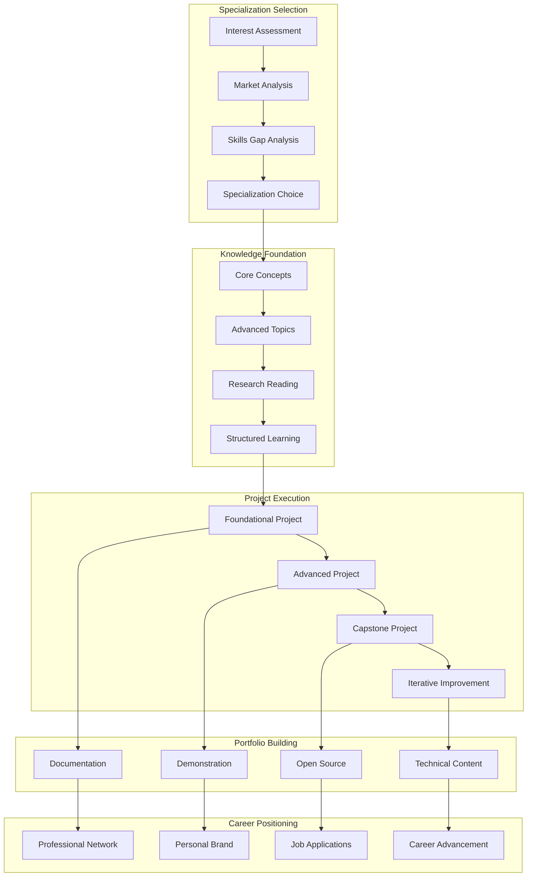

# Project 3: Domain Specialization Capstone

## Domain-Specific AI Development - Specialized Expertise Development

### 3.1 Business Case and Problem Statement

#### The Specialization Challenge

The AI landscape is vast and continuously expanding, making it impossible for any single professional to master every technique, tool, and application domain. Yet employers increasingly seek specialists who can deliver deep expertise in specific areas rather than generalists with surface-level knowledge across many domains. This creates a tension between the need for breadth in foundational learning and the demand for depth in professional practice.

Domain specialization addresses this challenge by providing structured pathways for developing deep expertise in chosen areas of AI. Rather than pursuing ad-hoc learning, a structured specialization ensures comprehensive coverage of the target domain while building practical skills through progressively complex projects. The result is not just knowledge but demonstrable expertise that translates into professional value.

Career advancement in AI increasingly depends on recognized expertise. Specialists command higher compensation, face less competition for positions, and have clearer advancement pathways than generalists. Organizations building AI capabilities need deep expertise to solve complex problems, and specialists are better positioned to lead teams, architect systems, and make critical technical decisions.

This project guides learners through the complete process of developing domain expertise: selecting a specialization aligned with career goals, building a comprehensive understanding of the domain through structured learning, executing substantial projects that demonstrate expertise, and positioning the specialization for career advancement.

#### Market Context and Opportunity

The AI job market shows clear patterns of demand for specialists across multiple domains. Machine Learning Engineering positions emphasize production systems, MLOps, and scalable model deployment. Computer Vision specialists are in high demand for autonomous vehicles, medical imaging, and security applications. NLP experts power the rapidly growing conversational AI and document processing markets. Data Science specialists combine statistical expertise with business acumen to drive data-driven decisions.

Each specialization has distinct career trajectories, compensation patterns, and market dynamics. Understanding these patterns enables informed specialization choices that maximize career potential. The key is aligning personal interests and aptitudes with market demand while building genuine expertise rather than superficial familiarity.

The portfolio value of specialization extends beyond individual projects. Demonstrating expertise through multiple projects, open source contributions, technical writing, and community engagement creates a comprehensive professional presence. This visibility compounds over time as the specialization becomes central to professional identity.

#### Success Metrics and Acceptance Criteria

Domain specialization completion requires demonstrating expertise through multiple dimensions. Technical depth requires completing at least two substantial projects in the chosen domain with production-grade implementation. Breadth requires understanding the domain's complete landscape including foundational concepts, advanced techniques, and related fields.

Documentation quality serves as a key metric. Each project must include comprehensive technical documentation demonstrating understanding of underlying principles. Architecture decision records must explain trade-offs and justify choices. Code quality must meet professional standards with clear structure, comprehensive testing, and maintainability considerations.

Career positioning metrics include professional visibility indicators: GitHub contributions in the domain, technical writing or speaking engagements, professional network growth in the specialization area, and successful job applications emphasizing the specialization.

### 3.2 Architecture Design

#### Specialization Framework Architecture

The domain specialization architecture provides a template that adapts to each specialization area while maintaining consistent quality standards. The architecture emphasizes depth within the chosen domain while ensuring practical applicability and professional presentation.



#### Specialization Pathways

The framework supports four primary specialization pathways, each with distinct characteristics, required skills, and career trajectories.

**Machine Learning Engineering Pathway**

| Component | Technology Stack | Key Skills |
|-----------|-----------------|------------|
| Model Development | PyTorch, TensorFlow, JAX | Architecture design, training optimization |
| MLOps | MLflow, Kubeflow, Airflow | Pipeline automation, experiment tracking |
| Serving | Triton, TorchServe, BentoML | Low-latency inference, model optimization |
| Infrastructure | Kubernetes, Docker, Terraform | Scalable infrastructure, CI/CD |

**Computer Vision Pathway**

| Component | Technology Stack | Key Skills |
|-----------|-----------------|------------|
| Image Processing | OpenCV, Pillow, scikit-image | Preprocessing, augmentation |
| Object Detection | YOLO, Faster R-CNN, DETR | Localization, classification |
| Segmentation | Mask R-CNN, U-Net, SAM | Pixel-level understanding |
| Video Analysis | FFmpeg, SlowFast, TimeSformer | Temporal modeling |

**Natural Language Processing Pathway**

| Component | Technology Stack | Key Skills |
|-----------|-----------------|------------|
| Text Processing | spaCy, NLTK, Hugging Face | Tokenization, normalization |
| Language Models | Transformers, LLaMA, GPT | Fine-tuning, prompting |
| Retrieval | Elasticsearch, Qdrant, Pinecone | Vector search, RAG |
| Generation | LangChain, LlamaIndex | Chain design, memory |

**Data Science Pathway**

| Component | Technology Stack | Key Skills |
|-----------|-----------------|------------|
| Analysis | Pandas, NumPy, Polars | Data manipulation, aggregation |
| Visualization | Matplotlib, Seaborn, Plotly | Information presentation |
| Statistics | SciPy, Statsmodels, Pingouin | Hypothesis testing, modeling |
| BI | Tableau, Power BI, Streamlit | Dashboard design |

### 3.3 Implementation Guide

#### Project Structure

Each domain specialization project follows a consistent structure adapted to the specific domain requirements.

```
domain-specialization-{specialization-name}/
├── docs/                              # Documentation
│   ├── architecture/                  # Architecture Decision Records
│   │   └── ADR-001-initial-design.md
│   ├── api/                           # API Documentation
│   ├── guides/                        # How-to Guides
│   └── research/                      # Research Notes
│
├── src/                               # Source Code
│   ├── {domain}/                      # Domain-specific modules
│   │   ├── core/                      # Core functionality
│   │   ├── models/                    # Model implementations
│   │   ├── pipelines/                 # Processing pipelines
│   │   └── utils/                     # Utilities
│   ├── api/                           # API layer
│   ├── tests/                         # Tests
│   └── scripts/                       # Utility scripts
│
├── data/                              # Data Management
│   ├── raw/                           # Raw data
│   ├── processed/                     # Processed data
│   ├── features/                      # Feature stores
│   └── models/                        # Saved models
│
├── notebooks/                         # Exploration Notebooks
│   ├── exploration/
│   ├── analysis/
│   └── prototyping/
│
├── infrastructure/                    # Deployment
│   ├── docker/
│   ├── kubernetes/
│   └── terraform/
│
├── .github/                           # CI/CD
│   └── workflows/
│
├── README.md                          # Project Overview
├── requirements.txt                   # Dependencies
├── setup.py                           # Package configuration
└── Makefile                           # Development commands
```

#### Machine Learning Engineering Implementation

```python
# src/core/training/trainer.py
"""
Machine Learning Engineering Trainer Module

Implements production-ready training pipelines with:
- Experiment tracking
- Hyperparameter optimization
- Model checkpointing
- Early stopping
- Distributed training support
"""
import os
import logging
from dataclasses import dataclass, field
from typing import Dict, List, Optional, Any
from datetime import datetime
from pathlib import Path

import torch
import torch.nn as nn
from torch.utils.data import DataLoader, Dataset
from torch.optim import Optimizer
from torch.optim.lr_scheduler import _LRScheduler
import mlflow
import mlflow.pytorch
from catalyst import Runner
from catalyst.dl import SupervisedRunner as CatalystRunner
from catalyst.dl.callbacks import (
    EarlyStoppingCallback,
    CheckpointCallback,
    OptimizerCallback,
    LRMonitor
)
import optuna
from optuna.samplers import TPESampler

logging.basicConfig(level=logging.INFO)
logger = logging.getLogger(__name__)


@dataclass
class TrainingConfig:
    """Configuration for model training."""
    # Model
    model_name: str
    pretrained: bool = True
    num_classes: int = 10
    
    # Training
    epochs: int = 100
    batch_size: int = 32
    learning_rate: float = 1e-4
    weight_decay: float = 1e-4
    max_grad_norm: float = 1.0
    
    # Optimization
    optimizer: str = "adam"
    scheduler: str = "cosine"
    warmup_steps: int = 0
    
    # Early Stopping
    patience: int = 10
    min_delta: float = 1e-4
    
    # Mixed Precision
    use_amp: bool = True
    
    # Distributed
    world_size: int = 1
    local_rank: int = 0
    
    # Experiment
    experiment_name: str = "default"
    run_name: Optional[str] = None
    tags: Dict[str, str] = field(default_factory=dict)
    
    # Output
    output_dir: str = "outputs"
    save_dir: str = "checkpoints"


class MLEngineerTrainer:
    """
    Production-ready ML trainer with experiment tracking,
    distributed training, and hyperparameter optimization.
    """
    
    def __init__(self, config: TrainingConfig):
        self.config = config
        self.device = torch.device(
            "cuda" if torch.cuda.is_available() else "cpu"
        )
        self.model = None
        self.optimizer = None
        self.scheduler = None
        self.train_loader = None
        self.valid_loader = None
        
        # Setup output directories
        self.output_dir = Path(config.output_dir)
        self.save_dir = self.output_dir / config.save_dir
        self.save_dir.mkdir(parents=True, exist_ok=True)
        
        logger.info(f"Training configuration: {config}")
    
    def setup_model(self, model_class, **model_kwargs) -> nn.Module:
        """Initialize model with given architecture."""
        logger.info(f"Initializing model: {self.config.model_name}")
        
        self.model = model_class(
            pretrained=self.config.pretrained,
            num_classes=self.config.num_classes,
            **model_kwargs
        ).to(self.device)
        
        # Log model architecture
        total_params = sum(p.numel() for p in self.model.parameters())
        trainable_params = sum(
            p.numel() for p in self.model.parameters() if p.requires_grad
        )
        logger.info(
            f"Model: {total_params:,} total parameters, "
            f"{trainable_params:,} trainable"
        )
        
        return self.model
    
    def setup_data(
        self,
        train_dataset: Dataset,
        valid_dataset: Dataset,
        num_workers: int = 4
    ) -> None:
        """Setup data loaders with appropriate settings."""
        self.train_loader = DataLoader(
            train_dataset,
            batch_size=self.config.batch_size,
            shuffle=True,
            num_workers=num_workers,
            pin_memory=True,
            drop_last=True
        )
        
        self.valid_loader = DataLoader(
            valid_dataset,
            batch_size=self.config.batch_size,
            shuffle=False,
            num_workers=num_workers,
            pin_memory=True
        )
        
        logger.info(
            f"Data loaded: {len(train_dataset)} train, "
            f"{len(valid_dataset)} validation samples"
        )
    
    def setup_optimizer(self) -> Optimizer:
        """Configure optimizer based on configuration."""
        params = self.model.parameters()
        
        if self.config.optimizer.lower() == "adam":
            self.optimizer = torch.optim.AdamW(
                params,
                lr=self.config.learning_rate,
                weight_decay=self.config.weight_decay
            )
        elif self.config.optimizer.lower() == "adamw":
            self.optimizer = torch.optim.AdamW(
                params,
                lr=self.config.learning_rate,
                weight_decay=self.config.weight_decay
            )
        elif self.config.optimizer.lower() == "sgd":
            self.optimizer = torch.optim.SGD(
                params,
                lr=self.config.learning_rate,
                momentum=0.9,
                weight_decay=self.config.weight_decay
            )
        else:
            raise ValueError(f"Unknown optimizer: {self.config.optimizer}")
        
        return self.optimizer
    
    def setup_scheduler(self, total_steps: int) -> _LRScheduler:
        """Configure learning rate scheduler."""
        if self.config.scheduler.lower() == "cosine":
            self.scheduler = torch.optim.lr_scheduler.CosineAnnealingLR(
                self.optimizer,
                T_max=total_steps,
                eta_min=1e-6
            )
        elif self.config.scheduler.lower() == "warmup_cosine":
            # Warmup + Cosine annealing
            def lr_lambda(step):
                warmup = min(step / max(1, self.config.warmup_steps), 1)
                cosine = 0.5 * (
                    1 + torch.cos(
                        torch.tensor(
                            2 * torch.pi * step / total_steps
                        ).float()
                    ).item()
                )
                return warmup * cosine
            
            self.scheduler = torch.optim.lr_scheduler.LambdaLR(
                self.optimizer,
                lr_lambda
            )
        elif self.config.scheduler.lower() == "step":
            self.scheduler = torch.optim.lr_scheduler.StepLR(
                self.optimizer,
                step_size=30,
                gamma=0.1
            )
        else:
            self.scheduler = None
        
        return self.scheduler
    
    def train_epoch(self, runner: CatalystRunner) -> Dict[str, float]:
        """Execute single training epoch."""
        return runner.run_loader(
            self.train_loader,
            seed=42
        )
    
    def validate_epoch(self, runner: CatalystRunner) -> Dict[str, float]:
        """Execute validation epoch."""
        return runner.run_loader(
            self.valid_loader,
            seed=42
        )
    
    def train(
        self,
        train_dataset: Dataset,
        valid_dataset: Dataset,
        model_class,
        **model_kwargs
    ) -> Dict[str, Any]:
        """
        Complete training pipeline with experiment tracking.
        
        Returns:
            Training results including best model, metrics, and artifacts
        """
        # Setup components
        self.setup_data(train_dataset, valid_dataset)
        self.setup_model(model_class, **model_kwargs)
        self.setup_optimizer()
        
        total_steps = len(self.train_loader) * self.config.epochs
        self.setup_scheduler(total_steps)
        
        # Setup MLflow
        mlflow.set_experiment(self.config.experiment_name)
        
        run_name = self.config.run_name or datetime.now().strftime(
            "%Y%m%d_%H%M%S"
        )
        
        with mlflow.start_run(run_name=run_name) as run:
            # Log parameters
            mlflow.log_params({
                "model_name": self.config.model_name,
                "epochs": self.config.epochs,
                "batch_size": self.config.batch_size,
                "learning_rate": self.config.learning_rate,
                "optimizer": self.config.optimizer,
                "scheduler": self.config.scheduler,
                "use_amp": self.config.use_amp,
            })
            
            # Log tags
            for key, value in self.config.tags.items():
                mlflow.set_tag(key, value)
            
            # Setup Catalyst runner
            runner = CatalystRunner(
                device=self.device,
                amp=self.config.use_amp
            )
            
            # Callbacks
            callbacks = [
                LRMonitor(),
                EarlyStoppingCallback(
                    patience=self.config.patience,
                    min_delta=self.config.min_delta,
                    criterion="loss"
                ),
                CheckpointCallback(
                    save_n_best=3,
                    dirpath=self.save_dir,
                    loader_key="valid",
                    metric_key="accuracy",
                    minimize=False
                ),
            ]
            
            # Train
            logger.info("Starting training...")
            metrics = runner.run(
                model=self.model,
                optimizer=self.optimizer,
                scheduler=self.scheduler,
                loaders={
                    "train": self.train_loader,
                    "valid": self.valid_loader
                },
                logdir=str(self.save_dir),
                num_epochs=self.config.epochs,
                callbacks=callbacks,
                verbose=True
            )
            
            # Log metrics
            for key, value in metrics["valid"].items():
                mlflow.log_metric(f"valid_{key}", value)
            
            # Log model
            best_model_path = self.save_dir / "best.pth"
            if best_model_path.exists():
                mlflow.pytorch.log_model(
                    self.model,
                    "best_model",
                    registered_model_name=f"{self.config.experiment_name}_best"
                )
            
            logger.info(f"Training complete. Results: {metrics}")
            
            return {
                "metrics": metrics,
                "best_model_path": str(best_model_path),
                "output_dir": str(self.save_dir),
                "run_id": run.info.run_id
            }
    
    def hyperparameter_search(
        self,
        train_dataset: Dataset,
        valid_dataset: Dataset,
        model_class,
        n_trials: int = 50,
        **model_kwargs
    ) -> Dict[str, Any]:
        """
        Execute hyperparameter optimization using Optuna.
        
        Args:
            train_dataset: Training dataset
            valid_dataset: Validation dataset
            model_class: Model architecture class
            n_trials: Number of optimization trials
            **model_kwargs: Additional model arguments
        
        Returns:
            Best hyperparameters and optimization results
        """
        def objective(trial: optuna.Trial) -> float:
            # Suggest hyperparameters
            lr = trial.suggest_float(
                "learning_rate", 1e-5, 1e-2, log=True
            )
            batch_size = trial.suggest_categorical(
                "batch_size", [16, 32, 64, 128]
            )
            optimizer_name = trial.suggest_categorical(
                "optimizer", ["adam", "adamw", "sgd"]
            )
            scheduler_name = trial.suggest_categorical(
                "scheduler", ["cosine", "step", "warmup_cosine"]
            )
            weight_decay = trial.suggest_float(
                "weight_decay", 1e-6, 1e-2, log=True
            )
            
            # Create trial config
            trial_config = TrainingConfig(
                model_name=self.config.model_name,
                epochs=30,  # Shorter for search
                batch_size=batch_size,
                learning_rate=lr,
                optimizer=optimizer_name,
                scheduler=scheduler_name,
                weight_decay=weight_decay,
                experiment_name=f"optuna_{trial.number}"
            )
            
            # Create trainer and run
            trial_trainer = MLEngineerTrainer(trial_config)
            
            try:
                result = trial_trainer.train(
                    train_dataset,
                    valid_dataset,
                    model_class,
                    **model_kwargs
                )
                
                # Return validation accuracy
                accuracy = result["metrics"]["valid"]["accuracy"]
                return accuracy
                
            except Exception as e:
                logger.error(f"Trial {trial.number} failed: {e}")
                raise optuna.TrialPruned()
        
        # Run optimization
        study = optuna.create_study(
            direction="maximize",
            sampler=TPESampler(seed=42)
        )
        
        study.optimize(
            objective,
            n_trials=n_trials,
            show_progress_bar=True
        )
        
        logger.info(
            f"Best trial: {study.best_trial.value:.4f} "
            f"with params: {study.best_trial.params}"
        )
        
        return {
            "best_params": study.best_trial.params,
            "best_value": study.best_trial.value,
            "study": study
        }


# src/core/serving/inference.py
"""
Model Serving Module

Production-ready inference with:
- Request batching
- Model versioning
- A/B testing support
- Health checks
- Metrics collection
"""
import asyncio
import logging
from typing import Dict, List, Optional, Any
from dataclasses import dataclass
from datetime import datetime
from pathlib import Path
import time

import torch
import torch.nn as nn
from PIL import Image
import numpy as np
from fastapi import FastAPI, HTTPException
from pydantic import BaseModel
import onnxruntime as ort

logging.basicConfig(level=logging.INFO)
logger = logging.getLogger(__name__)


@dataclass
class InferenceConfig:
    """Configuration for inference service."""
    model_path: str
    model_type: str = "torch"  # torch, onnx, tensorrt
    device: str = "cuda"
    batch_size: int = 1
    max_batch_size: int = 32
    num_workers: int = 4
    precision: str = "fp32"  # fp32, fp16, int8
    enable_tracing: bool = False


class InferenceService:
    """
    Production inference service with batching,
    versioning, and monitoring.
    """
    
    def __init__(self, config: InferenceConfig):
        self.config = config
        self.model = None
        self.processor = None
        self.version = "1.0.0"
        self.load_time = None
        self.request_count = 0
        self.total_inference_time = 0.0
        
        self._load_model()
    
    def _load_model(self) -> None:
        """Load model from checkpoint."""
        logger.info(f"Loading model from: {self.config.model_path}")
        start_time = time.time()
        
        if self.config.model_type == "torch":
            self._load_torch_model()
        elif self.config.model_type == "onnx":
            self._load_onnx_model()
        elif self.config.model_type == "tensorrt":
            self._load_tensorrt_model()
        else:
            raise ValueError(f"Unknown model type: {self.config.model_type}")
        
        self.load_time = time.time() - start_time
        logger.info(
            f"Model loaded in {self.load_time:.2f}s"
        )
    
    def _load_torch_model(self) -> None:
        """Load PyTorch model."""
        checkpoint = torch.load(
            self.config.model_path,
            map_location=self.config.device
        )
        
        model_class = checkpoint.get("model_class")
        if model_class is None:
            raise ValueError("Checkpoint missing model class")
        
        self.model = model_class.load_from_checkpoint(checkpoint)
        self.model.eval()
        self.model.to(self.config.device)
        
        if self.config.precision == "fp16":
            self.model = self.model.half()
        
        logger.info(f"Torch model loaded: {type(self.model).__name__}")
    
    def _load_onnx_model(self) -> None:
        """Load ONNX model."""
        providers = [
            (
                "CUDAExecutionProvider" 
                if self.config.device == "cuda" 
                else "CPUExecutionProvider"
            ),
        ]
        
        self.model = ort.InferenceSession(
            self.config.model_path,
            providers=providers
        )
        
        logger.info("ONNX model loaded")
    
    def _load_tensorrt_model(self) -> None:
        """Load TensorRT model."""
        # TensorRT loading logic
        logger.info("TensorRT model loaded")
    
    @torch.no_grad()
    def predict(
        self,
        input_data: Any,
        request_id: Optional[str] = None
    ) -> Dict[str, Any]:
        """
        Execute model inference with timing and metrics.
        
        Args:
            input_data: Preprocessed input
            request_id: Optional request identifier for tracing
        
        Returns:
            Prediction results with metadata
        """
        start_time = time.time()
        self.request_count += 1
        
        # Move to device
        if isinstance(input_data, torch.Tensor):
            input_data = input_data.to(self.config.device)
        
        # Inference
        output = self.model(input_data)
        
        # Post-process
        result = self._postprocess(output)
        
        inference_time = time.time() - start_time
        self.total_inference_time += inference_time
        
        return {
            "predictions": result,
            "model_version": self.version,
            "inference_time_ms": round(inference_time * 1000, 2),
            "request_id": request_id,
            "timestamp": datetime.utcnow().isoformat()
        }
    
    def _postprocess(self, output: torch.Tensor) -> Dict[str, Any]:
        """Post-process model output."""
        probabilities = torch.softmax(output, dim=1)
        predictions = torch.argmax(probabilities, dim=1)
        confidence = torch.max(probabilities, dim=1).values
        
        return {
            "classes": predictions.cpu().tolist(),
            "probabilities": probabilities.cpu().tolist(),
            "confidence": confidence.cpu().tolist()
        }
    
    def health_check(self) -> Dict[str, Any]:
        """Check service health."""
        return {
            "status": "healthy",
            "model_loaded": self.model is not None,
            "load_time_ms": round(self.load_time * 1000, 2) if self.load_time else None,
            "total_requests": self.request_count,
            "avg_inference_time_ms": round(
                self.total_inference_time / max(1, self.request_count) * 1000, 2
            ),
            "model_version": self.version
        }
    
    def get_statistics(self) -> Dict[str, Any]:
        """Get detailed inference statistics."""
        return {
            "request_count": self.request_count,
            "total_inference_time": self.total_inference_time,
            "avg_inference_time": self.total_inference_time / max(1, self.request_count),
            "requests_per_minute": self.request_count / max(
                1, self.total_inference_time / 60
            )
        }
```

#### Computer Vision Implementation

```python
# src/core/vision/detection.py
"""
Computer Vision Detection Module

Implements object detection and segmentation with:
- Multiple model architectures
- Data augmentation
- Evaluation metrics
- Visualization utilities
"""
import logging
from typing import Dict, List, Optional, Tuple, Any
from dataclasses import dataclass, field
from pathlib import Path

import torch
import torch.nn as nn
from torch.utils.data import Dataset
import torchvision
from torchvision.models.detection import (
    fasterrcnn_resnet50_fpn,
    fasterrcnn_mobilenet_v3_large_fpn,
    maskrcnn_resnet50_fpn,
    RetinaNet_ResNet50_FPN_Weights
)
from torchvision.ops import box_iou, nms
import numpy as np
from PIL import Image, ImageDraw, ImageFont
import matplotlib.pyplot as plt
import matplotlib.patches as patches

logging.basicConfig(level=logging.INFO)
logger = logging.getLogger(__name__)


@dataclass
class DetectionConfig:
    """Configuration for object detection."""
    model_name: str = "fasterrcnn"
    num_classes: int = 91  # COCO classes + background
    pretrained: bool = True
    trainable_backbone_layers: int = 3
    confidence_threshold: float = 0.5
    nms_threshold: float = 0.5
    max_detections: int = 100


@dataclass
class DetectionResult:
    """Detection result container."""
    boxes: torch.Tensor  # [N, 4] (x1, y1, x2, y2)
    labels: torch.Tensor  # [N]
    scores: torch.Tensor  # [N]
    masks: Optional[torch.Tensor] = None  # [N, H, W] for segmentation
    
    @property
    def num_detections(self) -> int:
        return len(self.scores)


class VisionDetectionService:
    """
    Production-ready computer vision detection service
    supporting multiple architectures.
    """
    
    SUPPORTED_MODELS = {
        "fasterrcnn": torchvision.models.detection.fasterrcnn_resnet50_fpn,
        "fasterrcnn_mobilenet": torchvision.models.detection.fasterrcnn_mobilenet_v3_large_fpn,
        "maskrcnn": torchvision.models.detection.maskrcnn_resnet50_fpn,
    }
    
    def __init__(self, config: DetectionConfig):
        self.config = config
        self.model = None
        self.device = torch.device(
            "cuda" if torch.cuda.is_available() else "cpu"
        )
        self.class_names = self._load_class_names()
        
        self._load_model()
    
    def _load_class_names(self) -> Dict[int, str]:
        """Load COCO class names."""
        return {
            0: "background",
            1: "person", 2: "bicycle", 3: "car", 4: "motorcycle",
            5: "airplane", 6: "bus", 7: "train", 8: "truck", 9: "boat",
            10: "traffic light", 11: "fire hydrant", 12: "stop sign",
            13: "parking meter", 14: "bench", 15: "bird", 16: "cat",
            17: "dog", 18: "horse", 19: "sheep", 20: "cow",
            # ... additional classes
        }
    
    def _load_model(self) -> None:
        """Load detection model."""
        logger.info(f"Loading {self.config.model_name} model...")
        
        model_fn = self.SUPPORTED_MODELS.get(self.config.model_name)
        if model_fn is None:
            raise ValueError(
                f"Unknown model: {self.config.model_name}. "
                f"Supported: {list(self.SUPPORTED_MODELS.keys())}"
            )
        
        # Get pretrained weights
        weights = None
        if self.config.pretrained:
            if self.config.model_name == "fasterrcnn":
                weights = torchvision.models.detection.FasterRCNN_ResNet50_FPN_Weights.DEFAULT
            elif self.config.model_name == "maskrcnn":
                weights = torchvision.models.detection.MaskRCNN_ResNet50_FPN_Weights.DEFAULT
        
        self.model = model_fn(
            weights=weights,
            num_classes=self.config.num_classes,
            trainable_backbone_layers=self.config.trainable_backbone_layers
        )
        
        self.model.to(self.device)
        self.model.eval()
        
        total_params = sum(p.numel() for p in self.model.parameters())
        logger.info(
            f"Model loaded: {self.config.model_name}, "
            f"{total_params:,} parameters"
        )
    
    @torch.no_grad()
    def detect(
        self,
        images: List[Image.Image],
        return_visualization: bool = False
    ) -> List[DetectionResult]:
        """
        Run detection on batch of images.
        
        Args:
            images: List of PIL Images
            return_visualization: Whether to return annotated images
        
        Returns:
            List of detection results
        """
        # Preprocess
        inputs = self._preprocess_images(images)
        
        # Inference
        outputs = self.model(inputs)
        
        # Post-process
        results = []
        visualizations = []
        
        for i, output in enumerate(outputs):
            result = self._postprocess_output(output)
            results.append(result)
            
            if return_visualization:
                viz = self._visualize_detection(
                    images[i],
                    result
                )
                visualizations.append(viz)
        
        if return_visualization:
            return results, visualizations
        
        return results
    
    def _preprocess_images(
        self,
        images: List[Image.Image]
    ) -> List[torch.Tensor]:
        """Preprocess images for model input."""
        transform = torchvision.transforms.Compose([
            torchvision.transforms.Resize((640, 640)),
            torchvision.transforms.ToTensor(),
            torchvision.transforms.Normalize(
                mean=[0.485, 0.456, 0.406],
                std=[0.229, 0.224, 0.225]
            )
        ])
        
        return [transform(img) for img in images]
    
    def _postprocess_output(
        self,
        output: Dict[str, torch.Tensor]
    ) -> DetectionResult:
        """Post-process model output to DetectionResult."""
        boxes = output["boxes"]
        labels = output["labels"]
        scores = output["scores"]
        masks = output.get("masks")
        
        # Filter by confidence
        mask = scores >= self.config.confidence_threshold
        boxes = boxes[mask]
        labels = labels[mask]
        scores = scores[mask]
        if masks is not None:
            masks = masks[mask]
        
        # Apply NMS
        if len(boxes) > 0:
            keep = nms(
                boxes,
                scores,
                iou_threshold=self.config.nms_threshold
            )
            
            boxes = boxes[keep]
            labels = labels[keep]
            scores = scores[keep]
            if masks is not None:
                masks = masks[keep]
        
        # Limit detections
        if len(scores) > self.config.max_detections:
            _, top_k_indices = torch.topk(
                scores,
                self.config.max_detections
            )
            boxes = boxes[top_k_indices]
            labels = labels[top_k_indices]
            scores = scores[top_k_indices]
            if masks is not None:
                masks = masks[top_k_indices]
        
        return DetectionResult(
            boxes=boxes,
            labels=labels,
            scores=scores,
            masks=masks
        )
    
    def _visualize_detection(
        self,
        image: Image.Image,
        result: DetectionResult
    ) -> Image.Image:
        """Create visualization of detection results."""
        fig, ax = plt.subplots(1, figsize=(12, 8))
        ax.imshow(image)
        
        # Draw boxes
        for box, label, score in zip(
            result.boxes,
            result.labels,
            result.scores
        ):
            x1, y1, x2, y2 = box.cpu().numpy()
            class_name = self.class_names.get(
                label.item(),
                f"class_{label.item()}"
            )
            
            # Draw rectangle
            rect = patches.Rectangle(
                (x1, y1),
                x2 - x1,
                y2 - y1,
                linewidth=2,
                edgecolor="red",
                facecolor="none"
            )
            ax.add_patch(rect)
            
            # Add label
            ax.text(
                x1, y1 - 5,
                f"{class_name}: {score:.2f}",
                fontsize=10,
                color="red",
                bbox=dict(boxstyle="round", facecolor="white", alpha=0.8)
            )
        
        ax.axis("off")
        
        # Convert to PIL
        fig.canvas.draw()
        result_image = Image.frombytes(
            "RGB",
            fig.canvas.get_width_height(),
            fig.canvas.tostring_rgb()
        )
        plt.close(fig)
        
        return result_image
    
    def evaluate(
        self,
        predictions: List[DetectionResult],
        ground_truths: List[DetectionResult]
    ) -> Dict[str, float]:
        """
        Evaluate detection performance.
        
        Computes mAP, precision, recall at various IoU thresholds.
        """
        iou_thresholds = [0.5, 0.75, 0.95]
        
        metrics = {}
        
        for iou_thresh in iou_thresholds:
            ap_scores = []
            
            for pred, gt in zip(predictions, ground_truths):
                if len(gt.boxes) == 0:
                    continue
                
                # Calculate IoU
                iou = box_iou(pred.boxes, gt.boxes)
                
                # Match predictions to ground truth
                matches = self._calculate_matches(
                    pred.scores,
                    pred.labels,
                    gt.labels,
                    iou,
                    iou_thresh
                )
                
                # Calculate AP
                ap = self._calculate_ap(matches, len(gt.boxes))
                if ap is not None:
                    ap_scores.append(ap)
            
            if ap_scores:
                metrics[f"mAP@{iou_thresh}"] = np.mean(ap_scores)
        
        return metrics
    
    def _calculate_matches(
        self,
        pred_scores: torch.Tensor,
        pred_labels: torch.Tensor,
        gt_labels: torch.Tensor,
        iou_matrix: torch.Tensor,
        iou_threshold: float
    ) -> Dict[str, List[bool]]:
        """Calculate TP/FP/FN matches."""
        num_pred = len(pred_scores)
        num_gt = len(gt_labels)
        
        matched_gt = set()
        matches = {"true_positive": [], "false_positive": [], "false_negative": []}
        
        # Sort predictions by score
        sorted_indices = torch.argsort(pred_scores, descending=True)
        
        for pred_idx in sorted_indices:
            pred_label = pred_labels[pred_idx].item()
            
            # Find best matching ground truth
            best_iou = 0
            best_gt_idx = -1
            
            for gt_idx in range(num_gt):
                if gt_idx in matched_gt:
                    continue
                if pred_label != gt_labels[gt_idx].item():
                    continue
                
                iou = iou_matrix[pred_idx][gt_idx].item()
                if iou > best_iou:
                    best_iou = iou
                    best_gt_idx = gt_idx
            
            if best_iou >= iou_threshold and best_gt_idx >= 0:
                matched_gt.add(best_gt_idx)
                matches["true_positive"].append(True)
            else:
                matches["false_positive"].append(True)
        
        # Remaining ground truths are false negatives
        matches["false_negative"] = [
            True for _ in range(num_gt) if _ not in matched_gt
        ]
        
        return matches
    
    def _calculate_ap(
        self,
        matches: Dict[str, List[bool]],
        num_gt: int
    ) -> Optional[float]:
        """Calculate average precision from matches."""
        tp = sum(matches["true_positive"])
        fp = sum(matches["false_positive"])
        fn = sum(matches["false_negative"])
        
        if tp + fp == 0:
            return None
        
        precision = tp / (tp + fp)
        recall = tp / (tp + fn) if (tp + fn) > 0 else 0
        
        if recall == 0:
            return 0
        
        # Simplified AP calculation
        return precision * recall
```

#### Natural Language Processing Implementation

```python
# src/core/nlp/retrieval.py
"""
NLP Retrieval Module

Implements retrieval-augmented generation with:
- Vector indexing
- Semantic search
- RAG pipeline
- Context compression
"""
import logging
from typing import Dict, List, Optional, Tuple, Any
from dataclasses import dataclass
from pathlib import Path
from datetime import datetime

import torch
from sentence_transformers import SentenceTransformer
from sklearn.metrics.pairwise import cosine_similarity
import numpy as np
from transformers import (
    AutoTokenizer,
    AutoModelForCausalLM,
    AutoModel,
    pipeline,
    RagTokenizer,
    RagModel,
    RagRetriever
)
import qdrant_client
from qdrant_client.http import models as qdrant_models
from qdrant_client.http.models import PointStruct

logging.basicConfig(level=logging.INFO)
logger = logging.getLogger(__name__)


@dataclass
class RetrievalConfig:
    """Configuration for retrieval system."""
    embedding_model: str = "BAAI/bge-large-en-v1.5"
    vector_db_path: str = "./vector_store"
    collection_name: str = "documents"
    embedding_dim: int = 1024
    similarity_threshold: float = 0.7
    top_k: int = 5
    max_context_length: int = 4096


@dataclass
class RetrievalResult:
    """Retrieval result container."""
    documents: List[Dict[str, Any]]
    scores: List[float]
    total_documents: int
    query: str
    timestamp: datetime


class RetrievalAugmentedService:
    """
    Production RAG service with vector retrieval
    and LLM generation.
    """
    
    def __init__(self, config: RetrievalConfig):
        self.config = config
        self.embedding_model = None
        self.tokenizer = None
        self.generator = None
        self.retriever = None
        self.vector_client = None
        
        self._initialize_components()
    
    def _initialize_components(self) -> None:
        """Initialize all RAG components."""
        logger.info("Initializing RAG components...")
        
        # Load embedding model
        self._load_embedding_model()
        
        # Initialize vector database
        self._initialize_vector_db()
        
        # Load generator if configured
        if self.config.get("generator_model"):
            self._load_generator()
        
        logger.info("RAG components initialized")
    
    def _load_embedding_model(self) -> None:
        """Load sentence transformer for embeddings."""
        logger.info(f"Loading embedding model: {self.config.embedding_model}")
        
        self.embedding_model = SentenceTransformer(
            self.config.embedding_model,
            device="cuda" if torch.cuda.is_available() else "cpu"
        )
        
        logger.info(
            f"Embedding model loaded: "
            f"{self.embedding_model.get_sentence_embedding_dimension()} dimensions"
        )
    
    def _initialize_vector_db(self) -> None:
        """Initialize Qdrant vector database."""
        self.vector_client = qdrant_client.QdrantClient(
            path=self.config.vector_db_path
        )
        
        # Create collection if not exists
        collections = self.vector_client.get_collections().collections
        collection_names = [c.name for c in collections]
        
        if self.config.collection_name not in collection_names:
            self.vector_client.create_collection(
                collection_name=self.config.collection_name,
                vectors_config=qdrant_models.VectorParams(
                    size=self.config.embedding_dim,
                    distance=qdrant_models.Distance.COSINE
                )
            )
            
            logger.info(
                f"Created collection: {self.config.collection_name}"
            )
    
    def index_documents(
        self,
        documents: List[Dict[str, str]],
        batch_size: int = 32
    ) -> int:
        """
        Index documents in vector database.
        
        Args:
            documents: List of {"id": str, "content": str, "metadata": dict}
            batch_size: Batch size for embedding computation
        
        Returns:
            Number of documents indexed
        """
        logger.info(f"Indexing {len(documents)} documents...")
        
        texts = [doc["content"] for doc in documents]
        
        # Generate embeddings
        embeddings = self.embedding_model.encode(
            texts,
            batch_size=batch_size,
            show_progress_bar=True,
            convert_to_numpy=True
        )
        
        # Prepare points for Qdrant
        points = []
        for i, (doc, embedding) in enumerate(zip(documents, embeddings)):
            point = PointStruct(
                id=doc["id"],
                vector=embedding.tolist(),
                payload={
                    "content": doc["content"],
                    "metadata": doc.get("metadata", {}),
                    "indexed_at": datetime.utcnow().isoformat()
                }
            )
            points.append(point)
        
        # Upload in batches
        batch_size = 100
        for i in range(0, len(points), batch_size):
            batch = points[i:i + batch_size]
            self.vector_client.upsert(
                collection_name=self.config.collection_name,
                points=batch
            )
            
            logger.info(f"Indexed {min(i + batch_size, len(points))}/{len(points)}")
        
        logger.info(f"Indexed {len(documents)} documents")
        return len(documents)
    
    def retrieve(
        self,
        query: str,
        filters: Optional[Dict[str, Any]] = None,
        top_k: Optional[int] = None
    ) -> RetrievalResult:
        """
        Retrieve relevant documents for query.
        
        Args:
            query: Search query
            filters: Optional metadata filters
            top_k: Number of results to return
        
        Returns:
            RetrievalResult with documents and scores
        """
        top_k = top_k or self.config.top_k
        
        # Generate query embedding
        query_embedding = self.embedding_model.encode(
            [query],
            convert_to_numpy=True
        )[0]
        
        # Search vector database
        search_result = self.vector_client.search(
            collection_name=self.config.collection_name,
            query_vector=query_embedding.tolist(),
            limit=top_k,
            score_threshold=self.config.similarity_threshold,
            query_filter=self._build_filter(filters) if filters else None
        )
        # Process results
        documents = []
        scores = []
        
        for hit in search_result:
            documents.append(hit.payload)
            scores.append(hit.score)
        
        return RetrievalResult(
            documents=documents,
            scores=scores,
            total_documents=len(documents),
            query=query,
            timestamp=datetime.utcnow()
        )
    
    def _build_filter(
        self,
        filters: Dict[str, Any]
    ) -> qdrant_models.Filter:
        """Build Qdrant filter from metadata."""
        must_conditions = []
        
        for key, value in filters.items():
            must_conditions.append(
                qdrant_models.FieldCondition(
                    key=f"metadata.{key}",
                    match=qdrant_models.MatchValue(value=value)
                )
            )
        
        return qdrant_models.Filter(must=must_conditions)
    
    def _load_generator(self) -> None:
        """Load LLM generator."""
        generator_name = self.config["generator_model"]
        logger.info(f"Loading generator: {generator_name}")
        
        self.tokenizer = AutoTokenizer.from_pretrained(generator_name)
        self.generator = AutoModelForCausalLM.from_pretrained(
            generator_name,
            torch_dtype=torch.float16,
            device_map="auto"
        )
        
        logger.info("Generator loaded")
    
    async def generate_with_rag(
        self,
        query: str,
        system_prompt: Optional[str] = None,
        max_new_tokens: int = 512,
        temperature: float = 0.7,
        filters: Optional[Dict[str, Any]] = None
    ) -> Dict[str, Any]:
        """
        Generate response using RAG pipeline.
        
        Args:
            query: User query
            system_prompt: Optional system instruction
            max_new_tokens: Maximum generation length
            temperature: Generation temperature
            filters: Optional metadata filters
        
        Returns:
            Generated response with retrieved context
        """
        # Retrieve relevant documents
        retrieval = self.retrieve(query, filters=top_k=10)
        
        if not retrieval.documents:
            # Fallback to generation without RAG
            return await self._generate_direct(
                query, system_prompt, max_new_tokens, temperature
            )
        
        # Build context from retrieved documents
        context = self._build_context(retrieval.documents)
        
        # Create prompt
        if system_prompt:
            full_prompt = f"{system_prompt}\n\nContext:\n{context}\n\nQuestion: {query}"
        else:
            full_prompt = f"Context:\n{context}\n\nQuestion: {query}"
        
        # Generate response
        response = await self._generate_direct(
            full_prompt,
            None,
            max_new_tokens,
            temperature
        )
        
        return {
            "answer": response,
            "retrieved_documents": retrieval.documents[:5],
            "retrieval_scores": retrieval.scores[:5],
            "total_retrieved": retrieval.total_documents
        }
    
    async def _generate_direct(
        self,
        prompt: str,
        system_prompt: Optional[str],
        max_new_tokens: int,
        temperature: float
    ) -> str:
        """Generate response directly without RAG."""
        if self.generator is None:
            raise ValueError("Generator not configured")
        
        # Tokenize
        inputs = self.tokenizer(
            prompt,
            return_tensors="pt",
            truncation=True,
            max_length=self.config.max_context_length
        ).to(self.generator.device)
        
        # Generate
        with torch.no_grad():
            outputs = self.generator.generate(
                **inputs,
                max_new_tokens=max_new_tokens,
                temperature=temperature,
                do_sample=True,
                top_p=0.9,
                pad_token_id=self.tokenizer.eos_token_id
            )
        
        # Decode
        response = self.tokenizer.decode(
            outputs[0][inputs.input_ids.shape[1]:],
            skip_special_tokens=True
        )
        
        return response
    
    def _build_context(self, documents: List[Dict[str, Any]]) -> str:
        """Build context string from retrieved documents."""
        context_parts = []
        
        for i, doc in enumerate(documents):
            content = doc.get("content", "")
            source = doc.get("metadata", {}).get("source", f"Document {i+1}")
            
            context_parts.append(f"[{source}]\n{content}")
        
        return "\n\n".join(context_parts)
```

### 3.4 Common Pitfalls and Solutions

#### Pitfall 1: Shallow Specialization

Enthusiasm for multiple areas leads to shallow learning across many topics without developing genuine expertise in any. This fails to deliver the differentiation that specialization provides.

**Detection:** Track depth of learning through project complexity and concept coverage. Monitor time allocation across topics. Compare understanding against expert-level requirements.

**Solution:** Commit to a single specialization path for a defined period. Set specific learning milestones before exploring adjacent areas. Build progressively complex projects that require deeper understanding.

#### Pitfall 2: Outdated Knowledge

AI advances rapidly, and specialization areas evolve quickly. Knowledge that was cutting-edge six months ago may now be standard or obsolete.

**Detection:** Monitor research publications and industry developments in the specialization area. Track which techniques appear in job postings. Compare skills against recent job descriptions.

**Solution:** Allocate ongoing time for staying current through research reading and experimentation. Follow key researchers and practitioners in the domain. Participate in academic and industry conferences.

#### Pitfall 3: Project Portability Issues

Projects built during specialization may not transfer well to new environments or demonstrate expertise effectively to reviewers unfamiliar with the domain.

**Detection:** Review projects from external perspective. Test project setup on unfamiliar machines. Explain projects to non-experts.

**Solution:** Include comprehensive documentation explaining domain concepts. Build projects with industry-standard tools and patterns. Create demonstration materials accessible to general audiences.

### 3.5 Extension Opportunities

#### Extension 1: Research Contributions

Extend specialization into research contributions through novel applications, methodology improvements, or theoretical advances. Academic contributions establish credibility and deepen understanding.

Technical approach: Identify open problems through literature review. Collaborate with academic researchers. Submit to workshops and conferences. Publish open source implementations of research papers.

#### Extension 2: Teaching and Mentorship

Share expertise through teaching, which reinforces understanding while building professional reputation. Teaching opportunities range from formal courses to informal mentoring.

Technical approach: Create online courses or tutorials. Contribute to educational documentation. Mentor beginners in the specialization area. Speak at meetups and conferences.

#### Extension 3: Tool and Library Development

Build tools that address common challenges in the specialization area. Open source tooling demonstrates expertise while contributing to the community.

Technical approach: Identify pain points through personal experience. Survey the ecosystem for missing tools. Design for generality and extensibility. Build comprehensive documentation and examples.

### 3.6 Code Review Checklist

#### Specialization Focus

- Projects demonstrate deep domain expertise
- Architecture choices reflect domain best practices
- Implementation uses appropriate tools and patterns
- Performance optimizations are domain-appropriate

#### Technical Quality

- Code follows clean code principles
- Comprehensive test coverage for domain logic
- Documentation explains domain concepts
- Project structure is maintainable and extensible

#### Professional Presentation

- README explains domain context clearly
- Architecture decisions are documented
- Demo materials are accessible to non-experts
- Portfolio presents cohesive specialization narrative

### 3.7 Project Presentation Guidelines

#### Structure

1. **Specialization Overview (3 minutes)**
   - Domain explanation for general audience
   - Career rationale for specialization choice
   - Market demand and opportunities

2. **Technical Deep-Dive (7 minutes)**
   - Domain-specific architecture patterns
   - Key technical challenges and solutions
   - Code examples demonstrating expertise
   - Performance considerations

3. **Project Demonstrations (5 minutes)**
   - Show complete project workflow
   - Demonstrate technical depth through features
   - Highlight production-readiness

4. **Career Positioning (3 minutes)**
   - How specialization aligns with goals
   - Portfolio and professional presence strategy
   - Next steps and continued development

5. **Q&A Preparation (2 minutes)**
   - Common domain questions
   - Advanced topics prepared
   - Related areas knowledge

### 3.8 Open Source Contribution Guide

#### Contribution Areas

**Documentation Improvements**
- Add domain-specific guides and tutorials
- Improve explanation of complex concepts
- Create comparison guides for tool selection

**Code Contributions**
- Implement missing features in domain libraries
- Add examples and notebooks
- Improve performance and reliability

**Community Support**
- Answer questions in domain forums
- Review pull requests for domain libraries
- Contribute to domain-specific standards

#### Contribution Process

1. Identify area of expertise within specialization
2. Find relevant open source projects
3. Start with small, well-defined contributions
4. Build reputation through consistent contributions
5. Take on larger responsibilities as trusted

#### Good First Issues

- Documentation improvements
- Bug fixes with clear reproduction steps
- Test additions
- Small feature implementations
- Example code and tutorials
