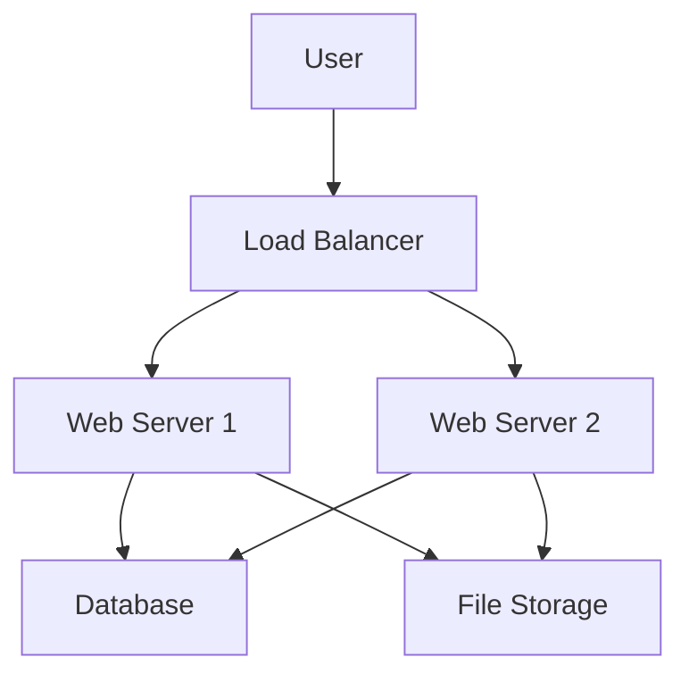
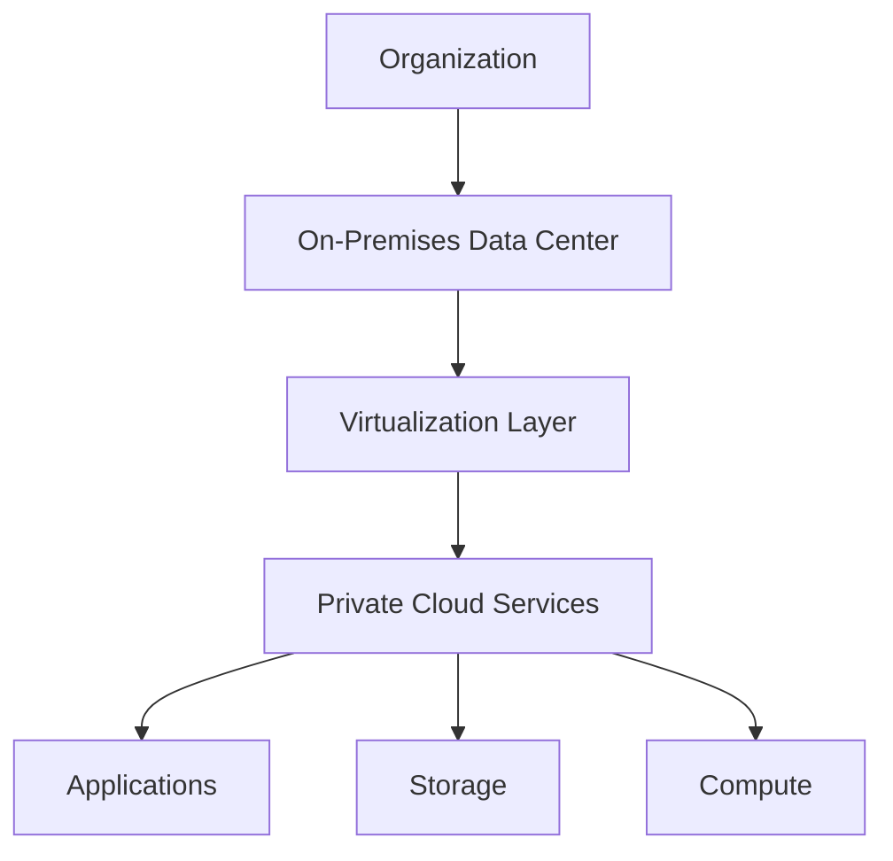
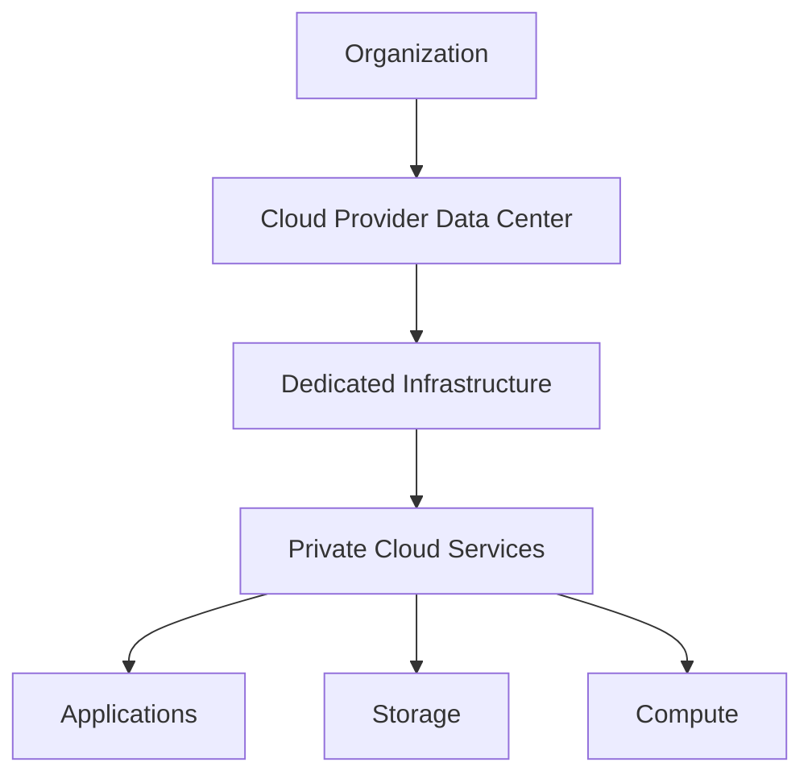
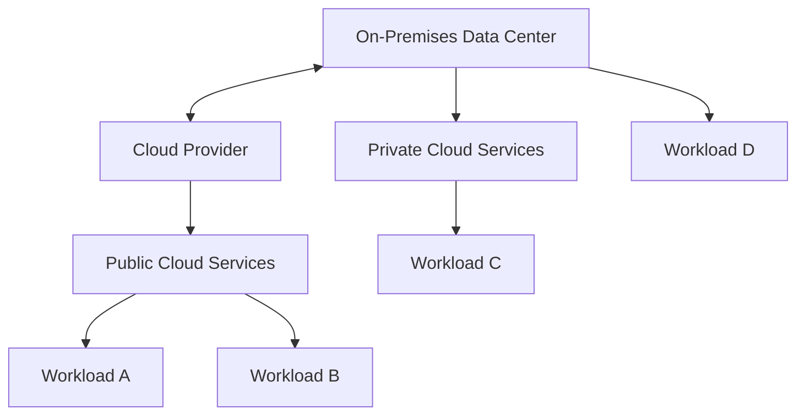
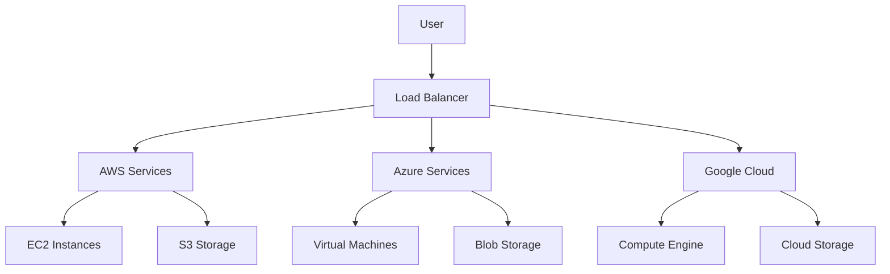

# Cloud Platforms Fundamentals Theory

## Table of Contents

1. [Introduction to Cloud Computing](#introduction-to-cloud-computing)
2. [The Story of Sarah's Cloud Journey](#the-story-of-sarahs-cloud-journey)
3. [Understanding Cloud Service Models](#understanding-cloud-service-models)
4. [Cloud Deployment Models](#cloud-deployment-models)
5. [Major Cloud Providers](#major-cloud-providers)
6. [Core Cloud Services](#core-cloud-services)
7. [Scalability and Reliability](#scalability-and-reliability)
8. [Cloud Security Fundamentals](#cloud-security-fundamentals)
9. [Cost Management](#cost-management)
10. [Cloud Migration Strategies](#cloud-migration-strategies)
11. [DevOps and Cloud](#devops-and-cloud)
12. [Future of Cloud Computing](#future-of-cloud-computing)
13. [Summary and Next Steps](#summary-and-next-steps)

---

## Introduction to Cloud Computing

Cloud computing is the delivery of computing services including servers, storage, databases, networking, software, analytics, and intelligence over the Internet ("the cloud") to offer faster innovation, flexible resources, and economies of scale.

**Key Characteristics of Cloud Computing:**

1. **On-Demand Self-Service**: Users can provision computing capabilities automatically without requiring human interaction with each service provider.

2. **Broad Network Access**: Capabilities are available over the network and accessed through standard mechanisms that promote use by heterogeneous thin or thick client platforms.

3. **Resource Pooling**: The provider's computing resources are pooled to serve multiple consumers using a multi-tenant model, with different physical and virtual resources dynamically assigned and reassigned.

4. **Rapid Elasticity**: Capabilities can be elastically provisioned and released to scale rapidly outward and inward commensurate with demand.

5. **Measured Service**: Resource usage is monitored, controlled, and reported automatically, providing transparency for both the provider and consumer.

**Sarah's First Encounter**

Sarah was a software developer working on a web application that needed to handle varying loads. During a product launch, her server crashed because of unexpected traffic. This incident made her realize the limitations of traditional hosting and sparked her interest in cloud computing.

"Traditional servers are like owning a house," her mentor explained. "Cloud computing is like staying in a hotel - you get what you need, when you need it, and you only pay for what you use."

**Benefits of Cloud Computing:**

1. **Cost Savings**: Pay-as-you-go pricing models eliminate capital expenses
2. **Scalability**: Scale resources up or down based on demand
3. **Reliability**: Built-in redundancy and disaster recovery
4. **Performance**: Global reach and optimized infrastructure
5. **Security**: Enterprise-grade security features
6. **Speed**: Rapid deployment of resources
7. **Maintenance**: Reduced IT maintenance and overhead

**Types of Cloud Services:**

- **IaaS (Infrastructure as a Service)**: Virtual machines, storage, networks
- **PaaS (Platform as a Service)**: Development frameworks, databases, middleware
- **SaaS (Software as a Service)**: Complete applications accessible via web browser
- **FaaS (Function as a Service)**: Serverless computing for event-driven applications

---

## The Story of Sarah's Cloud Journey

### Phase 1: The Learning Curve

Sarah started her cloud journey with a simple question: "How do I make my app handle sudden spikes in traffic?" Her search led her to understand the three main service models.

**Understanding Service Models:**

When Sarah first heard about IaaS, PaaS, and SaaS, her mentor used an analogy:

**IaaS - "Renting an Apartment":**

```markdown
- You get the basic structure (infrastructure)
- You can install and configure anything
- You manage the operating system and applications
- You're responsible for security, updates, and maintenance

Examples: AWS EC2, Google Compute Engine, Azure Virtual Machines
```

**PaaS - "Renting a Furnished Apartment":**

```markdown
- You get infrastructure + platform
- Focus only on your application code
- Platform handles OS, runtime, middleware
- You manage applications and data

Examples: AWS Elastic Beanstalk, Google App Engine, Azure App Service
```

**SaaS - "Staying in a Hotel":**

```markdown
- You get everything ready to use
- Just log in and use the application
- Provider manages everything
- You just consume the service

Examples: Gmail, Office 365, Salesforce
```

### Phase 2: Choosing Her First Cloud Provider

Sarah had to choose between AWS, Google Cloud, and Microsoft Azure. Each had its strengths:

**AWS (Amazon Web Services):**

- Market leader with the most services
- Mature ecosystem and documentation
- Best for: Startups, enterprises, machine learning

**Google Cloud Platform:**

- Strong in data analytics and machine learning
- Competitive pricing
- Best for: Data-heavy applications, AI/ML workloads

**Microsoft Azure:**

- Excellent integration with Microsoft products
- Hybrid cloud capabilities
- Best for: Enterprise applications, Microsoft-centric environments

Sarah chose AWS for her first project because of its comprehensive documentation and vast community support.

### Phase 3: Building Her First Cloud Application

Sarah's first cloud application was an e-commerce platform. She started with a simple architecture:

**Initial Architecture:**



**Her Learning Path:**

1. **Week 1**: Set up EC2 instances
   - Learned about AMIs, security groups, key pairs
   - Understood networking basics
   - Connected via SSH for the first time

2. **Week 2**: Database setup
   - Chose RDS (Relational Database Service)
   - Learned about backup and replication
   - Understood connection pooling

3. **Week 3**: Storage and content delivery
   - Used S3 for static files
   - Implemented CloudFront for CDN
   - Learned about caching strategies

4. **Week 4**: Monitoring and scaling
   - Set up CloudWatch for monitoring
   - Configured auto-scaling groups
   - Learned about load balancing

### Phase 4: Overcoming Challenges

Sarah faced several challenges in her cloud journey:

**Challenge 1: Understanding Costs**

```markdown
Problem: Unexpected high bills
Solution:

- Set up billing alerts
- Used AWS Cost Explorer
- Implemented resource tagging
- Learned about reserved instances
```

**Challenge 2: Security Misconfigurations**

```markdown
Problem: Left S3 bucket public by mistake
Solution:

- Implemented IAM policies
- Used security groups properly
- Enabled MFA for root account
- Regular security audits
```

**Challenge 3: Downtime During Deployments**

```markdown
Problem: Application went down during updates
Solution:

- Implemented blue-green deployments
- Used rolling updates
- Set up health checks
- Created rollback procedures
```

### Phase 5: Advanced Concepts

As Sarah gained experience, she explored more advanced cloud concepts:

**Serverless Computing:**

```javascript
// AWS Lambda function example
exports.handler = async (event) => {
  const userId = event.pathParameters.userId;

  // Process user data
  const userData = await getUserFromDatabase(userId);

  return {
    statusCode: 200,
    body: JSON.stringify({
      user: userData,
    }),
  };
};
```

**Container Orchestration:**

```yaml
# Kubernetes deployment example
apiVersion: apps/v1
kind: Deployment
metadata:
  name: web-app
spec:
  replicas: 3
  selector:
    matchLabels:
      app: web-app
  template:
    metadata:
      labels:
        app: web-app
    spec:
      containers:
        - name: web-app
          image: nginx:latest
          ports:
            - containerPort: 80
```

**Infrastructure as Code:**

```hcl
# Terraform example - AWS VPC
resource "aws_vpc" "main" {
  cidr_block           = "10.0.0.0/16"
  enable_dns_hostnames = true
  enable_dns_support   = true

  tags = {
    Name = "main-vpc"
    Environment = "production"
  }
}
```

---

## Understanding Cloud Service Models

### Infrastructure as a Service (IaaS)

IaaS provides the most fundamental cloud computing service. It offers virtualized computing infrastructure over the internet.

**What IaaS Provides:**

- **Virtual Machines**: Complete server environments
- **Storage**: Block and object storage
- **Networks**: Virtual networks and load balancers
- **Operating Systems**: You manage the OS layer
- **Applications**: You install and manage applications
- **Data**: You manage data and security

**IaaS Characteristics:**

- **Maximum Control**: Full control over infrastructure
- **Scalability**: Scale resources up or down
- **Pay-as-you-use**: No upfront capital investment
- **Multi-tenant**: Shared infrastructure with isolation
- **Self-service**: Provision resources through web portal or API

**Common IaaS Services:**

**AWS IaaS:**

- **EC2**: Virtual servers
- **EBS**: Block storage
- **S3**: Object storage
- **VPC**: Virtual networking
- **ELB**: Load balancing

**Azure IaaS:**

- **Virtual Machines**: Compute instances
- **Blob Storage**: Object storage
- **Virtual Network**: Networking
- **Load Balancer**: Traffic distribution

**GCP IaaS:**

- **Compute Engine**: Virtual machines
- **Persistent Disk**: Block storage
- **Cloud Storage**: Object storage
- **VPC**: Networking
- **Load Balancing**: Traffic management

**IaaS Use Cases:**

1. **Web Hosting**: Host websites and web applications
2. **Development/Testing**: Quickly provision test environments
3. **Disaster Recovery**: Backup and recovery solutions
4. **High-Performance Computing**: Scientific and research workloads
5. **Legacy Application Migration**: Move on-premises applications to cloud

**IaaS Advantages:**

- **Flexibility**: Install any software
- **Cost-effective**: Pay only for used resources
- **Scalability**: Scale resources dynamically
- **Disaster Recovery**: Built-in backup solutions
- **Geographic Distribution**: Deploy globally

**IaaS Disadvantages:**

- **Complexity**: You manage everything from OS up
- **Security Responsibility**: Shared responsibility model
- **Skill Requirements**: Need infrastructure expertise
- **Maintenance**: You handle OS updates and patches

### Platform as a Service (PaaS)

PaaS provides a platform allowing customers to develop, run, and manage applications without the complexity of building and maintaining infrastructure.

**What PaaS Provides:**

- **Runtime Environment**: Execution environment for applications
- **Development Tools**: IDEs, SDKs, and development frameworks
- **Middleware**: Operating system, web server, database management
- **Business Analytics**: Data analysis and business intelligence
- **Integration Services**: API management and integration tools

**PaaS Characteristics:**

- **Managed Runtime**: Provider manages OS and runtime
- **Focus on Code**: Developers focus on business logic
- **Rapid Development**: Accelerate application development
- **Built-in Services**: Database, messaging, authentication
- **Automatic Scaling**: Handle traffic spikes automatically

**Common PaaS Services:**

**AWS PaaS:**

- **Elastic Beanstalk**: Application deployment and management
- **AWS Lambda**: Serverless computing
- **RDS**: Managed database service
- **API Gateway**: API management
- **Cognito**: Identity and user management

**Azure PaaS:**

- **App Service**: Web and mobile app platform
- **Functions**: Serverless compute
- **SQL Database**: Managed database
- **Service Bus**: Messaging and integration
- **Active Directory**: Identity management

**GCP PaaS:**

- **App Engine**: Application hosting platform
- **Cloud Functions**: Event-driven serverless compute
- **Cloud SQL**: Managed database
- **Cloud Endpoints**: API management
- **Identity Platform**: Authentication and identity

**PaaS Use Cases:**

1. **Web Applications**: Build and deploy web apps quickly
2. **Mobile Backends**: Create mobile app backends
3. **API Development**: Build and manage APIs
4. **Data Processing**: Batch and streaming data processing
5. **IoT Applications**: Handle IoT device data

**PaaS Advantages:**

- **Faster Time to Market**: Focus on application logic
- **Reduced Complexity**: No infrastructure management
- **Built-in Scalability**: Automatic scaling features
- **Integrated Services**: Access to databases, storage, etc.
- **Collaboration**: Easy team collaboration tools

**PaaS Disadvantages:**

- **Vendor Lock-in**: Difficult to migrate away
- **Limited Control**: Less control over underlying infrastructure
- **Runtime Constraints**: Platform-specific limitations
- **Cost**: Can be more expensive for high-resource applications

### Software as a Service (SaaS)

SaaS is a software distribution model in which applications are hosted by a service provider and made available to customers over the internet.

**What SaaS Provides:**

- **Complete Applications**: Ready-to-use software
- **User Interface**: Web-based interface
- **Data Storage**: Cloud-based data management
- **Security**: Authentication and authorization
- **Updates**: Automatic updates and maintenance
- **Support**: Customer support and training

**SaaS Characteristics:**

- **No Installation**: Access through web browser
- **Subscription Model**: Pay monthly or annually
- **Multi-tenant**: Shared infrastructure
- **Automatic Updates**: Provider handles updates
- **Accessible Anywhere**: Access from any device with internet

**Common SaaS Services:**

**Business Applications:**

- **CRM**: Salesforce, HubSpot, Zoho CRM
- **ERP**: NetSuite, SAP, Oracle
- **Email**: Gmail, Outlook, Zoho Mail
- **Collaboration**: Slack, Microsoft Teams, Zoom
- **Project Management**: Asana, Trello, Monday.com

**Development Tools:**

- **IDE**: GitHub Codespaces, Replit, CodePen
- **Analytics**: Google Analytics, Mixpanel
- **Monitoring**: Datadog, New Relic, AppDynamics
- **CI/CD**: GitHub Actions, GitLab CI, CircleCI
- **Communication**: Discord, Microsoft Teams

**SaaS Use Cases:**

1. **Customer Relationship Management**: Manage customer interactions
2. **Enterprise Resource Planning**: Integrate business processes
3. **Collaboration Tools**: Team communication and project management
4. **Analytics and Reporting**: Business intelligence and data analysis
5. **Human Resources**: Employee management and payroll

**SaaS Advantages:**

- **No Infrastructure Management**: Provider handles everything
- **Lower Costs**: No upfront investment
- **Accessibility**: Access from anywhere
- **Automatic Updates**: Always use the latest version
- **Scalability**: Handle growth automatically

**SaaS Disadvantages:**

- **Internet Dependency**: Requires internet connection
- **Limited Customization**: Restricted to provider's features
- **Data Security Concerns**: Data stored on provider's servers
- **Vendor Lock-in**: Difficult to switch providers
- **Limited Integration**: May not integrate with all systems

### Function as a Service (FaaS)

FaaS is a serverless computing service that allows developers to execute code in response to events without managing servers.

**What FaaS Provides:**

- **Serverless Compute**: Execute code without managing servers
- **Event-driven**: Triggered by specific events
- **Auto-scaling**: Automatic scaling based on demand
- **Pay-per-execution**: Only pay for compute time used
- **No Server Management**: Provider manages infrastructure

**Common FaaS Services:**

**AWS Lambda:**

```javascript
// Example Lambda function
exports.handler = async (event) => {
  // Process the event
  const name = event.queryStringParameters.name;

  // Return a response
  return {
    statusCode: 200,
    headers: {
      "Content-Type": "application/json",
    },
    body: JSON.stringify({
      message: `Hello, ${name}!`,
    }),
  };
};
```

**Azure Functions:**

```csharp
// C# Azure Function
public static async Task<IActionResult> Run(
    [HttpTrigger(AuthorizationLevel.Function, "get", "post", Route = null)] HttpRequest req)
{
    string name = req.Query["name"];

    return new OkObjectResult($"Hello, {name}!");
}
```

**Google Cloud Functions:**

```python
# Python Cloud Function
def main(request):
    request_json = request.get_json()
    name = request_json.get('name')

    return f'Hello, {name}!'
```

**FaaS Characteristics:**

- **Stateless**: Each function execution is independent
- **Event-driven**: Triggered by HTTP requests, file uploads, etc.
- **Automatic Scaling**: Scale automatically based on demand
- **Limited Execution Time**: Functions have maximum execution time
- **No Server Management**: Focus only on code

**FaaS Use Cases:**

1. **API Endpoints**: Create RESTful APIs
2. **Data Processing**: Process files and streams
3. **Webhooks**: Handle webhook events
4. **Scheduled Tasks**: Run periodic jobs
5. **IoT Data Processing**: Process IoT device data

**FaaS Advantages:**

- **Cost-effective**: Pay only for actual usage
- **Scalability**: Automatic scaling
- **Simplicity**: No server management
- **Fast Development**: Quick to implement
- **Resource Efficiency**: Optimized resource usage

**FaaS Disadvantages:**

- **Cold Starts**: Initial function invocations are slower
- **Execution Limits**: Time and memory constraints
- **Vendor Lock-in**: Platform-specific implementations
- **Limited State**: Difficult to maintain state
- **Debugging Challenges**: Harder to debug and test

---

## Cloud Deployment Models

### Public Cloud

Public cloud is cloud computing that delivers computing services over the public internet and makes them available to anyone who wants to purchase or use them.

**Characteristics of Public Cloud:**

- **Shared Infrastructure**: Resources shared among multiple customers
- **Internet-based**: Accessible via public internet
- **Pay-as-you-go**: Consumption-based pricing
- **Provider Managed**: Cloud provider manages infrastructure
- **Elastic**: Resources can scale automatically

**Public Cloud Services:**

- **AWS**: Amazon Web Services
- **Microsoft Azure**: Microsoft's cloud platform
- **Google Cloud Platform**: Google's cloud services
- **IBM Cloud**: IBM's cloud offerings
- **Alibaba Cloud**: Alibaba's cloud platform

**Public Cloud Advantages:**

1. **Cost-effective**: No capital investment required
2. **Scalability**: Easily scale resources up or down
3. **Reliability**: Built-in redundancy and availability
4. **Accessibility**: Access from anywhere with internet
5. **Latest Technology**: Access to cutting-edge services
6. **Global Reach**: Deploy applications worldwide

**Public Cloud Disadvantages:**

1. **Security Concerns**: Data stored on shared infrastructure
2. **Compliance Issues**: May not meet regulatory requirements
3. **Vendor Lock-in**: Difficult to migrate away from provider
4. **Internet Dependency**: Requires reliable internet connection
5. **Limited Control**: Less control over infrastructure
6. **Potential Downtime**: Service availability depends on provider

**Public Cloud Use Cases:**

- **Startups**: Quick launch without infrastructure investment
- **Web Applications**: Host websites and web applications
- **Development/Testing**: Rapid provisioning of test environments
- **Disaster Recovery**: Backup and recovery solutions
- **Burst Computing**: Handle peak loads temporarily

### Private Cloud

Private cloud is cloud computing that is dedicated to a single organization and is not shared with other organizations.

**Characteristics of Private Cloud:**

- **Dedicated Infrastructure**: Resources dedicated to one organization
- **Controlled Environment**: Organization has full control
- **Enhanced Security**: Higher security and compliance
- **Customization**: Can be customized to specific needs
- **On-premises or Hosted**: Can be on-premises or in a data center

**Private Cloud Deployment Options:**

**On-Premises Private Cloud:**



**Hosted Private Cloud:**



**Private Cloud Technologies:**

- **VMware vSphere**: Enterprise virtualization platform
- **OpenStack**: Open source cloud computing platform
- **Microsoft Azure Stack**: Hybrid cloud platform
- **Nutanix**: Hyperconverged infrastructure
- **Red Hat OpenShift**: Container platform

**Private Cloud Advantages:**

1. **Enhanced Security**: Greater control over data and security
2. **Compliance**: Meet regulatory and compliance requirements
3. **Customization**: Tailor to specific business needs
4. **Performance**: Consistent performance and latency
5. **Control**: Full control over infrastructure and data
6. **Integration**: Easy integration with existing systems

**Private Cloud Disadvantages:**

1. **High Costs**: Significant capital and operational expenses
2. **Maintenance**: Organization responsible for management
3. **Limited Scalability**: Physical capacity constraints
4. **Skill Requirements**: Need cloud and infrastructure expertise
5. **Time to Deploy**: Longer implementation timelines
6. **Resource Utilization**: May have lower resource utilization

**Private Cloud Use Cases:**

- **Regulated Industries**: Healthcare, finance, government
- **Large Enterprises**: Organizations with complex requirements
- **Data Privacy**: Companies with strict data privacy requirements
- **Legacy Applications**: Existing applications that can't be migrated
- **Hybrid Integration**: Combine with public cloud services

### Hybrid Cloud

Hybrid cloud is a computing environment that combines on-premises infrastructure, private cloud services, and public cloud services with orchestration between the platforms.

**Characteristics of Hybrid Cloud:**

- **Multiple Environments**: Combines private and public clouds
- **Orchestration**: Manages workloads across environments
- **Flexibility**: Move workloads between environments
- **Cost Optimization**: Use most cost-effective environment
- **Unified Management**: Single pane of glass for management

**Hybrid Cloud Architecture:**



**Hybrid Cloud Strategies:**

**1. Cloud Bursting:**

- Run workloads in private cloud normally
- Burst to public cloud during peak demand
- Return to private cloud when demand decreases

**2. Data Synchronization:**

- Keep data synchronized between environments
- Use replication for disaster recovery
- Ensure compliance with data residency requirements

**3. Workload Migration:**

- Gradually migrate workloads to public cloud
- Keep sensitive workloads in private cloud
- Use hybrid for phased migration

**Hybrid Cloud Technologies:**

- **Cloud Integration Platforms**: MuleSoft, Dell Boomi
- **Hybrid Cloud Management**: Microsoft Azure Arc, VMware Cloud
- **Network Connectivity**: VPN, Direct Connect, ExpressRoute
- **Data Replication**: Cloud-based replication tools
- **Unified Security**: Identity and access management across environments

**Hybrid Cloud Advantages:**

1. **Flexibility**: Choose best environment for each workload
2. **Cost Optimization**: Use most cost-effective option
3. **Risk Mitigation**: Reduce vendor lock-in risks
4. **Gradual Migration**: Phased approach to cloud adoption
5. **Compliance**: Meet regulatory requirements
6. **Performance**: Optimize for latency and performance

**Hybrid Cloud Disadvantages:**

1. **Complexity**: More complex to manage and monitor
2. **Integration Challenges**: Integrating different environments
3. **Network Latency**: Potential latency between environments
4. **Security Management**: Complex security across environments
5. **Skill Requirements**: Need expertise in multiple platforms
6. **Tool Proliferation**: Multiple management tools required

**Hybrid Cloud Use Cases:**

- **Disaster Recovery**: Backup to public cloud
- **Development/Testing**: Test in public cloud, deploy to private
- **Burst Computing**: Use public cloud for peak loads
- **Legacy Modernization**: Gradually migrate to cloud
- **Data Analytics**: Process in public cloud, store in private

### Multi-Cloud

Multi-cloud is the use of multiple cloud computing services in a single architecture to reduce reliance on any single vendor, increase flexibility, and mitigate risk.

**Characteristics of Multi-Cloud:**

- **Multiple Providers**: Use services from different cloud providers
- **Vendor Independence**: Reduce dependency on single provider
- **Best-of-Breed**: Use best services from each provider
- **Risk Distribution**: Distribute risk across providers
- **Compliance**: Meet data residency requirements

**Multi-Cloud Architecture:**



**Multi-Cloud Strategies:**

**1. Service Selection:**

- Use AWS for compute and storage
- Use Google Cloud for AI/ML services
- Use Azure for Microsoft integration
- Use specialized providers for specific services

**2. Geographic Distribution:**

- Deploy in multiple regions for redundancy
- Meet data residency requirements
- Optimize for performance and latency

**3. Workload Distribution:**

- Different workloads on different providers
- Migrate based on cost and performance
- Use provider strengths for specific tasks

**Multi-Cloud Technologies:**

- **Cloud Management Platforms**: RightScale, Turbonomic
- **Container Orchestration**: Kubernetes, Docker Swarm
- **API Gateways**: Manage API traffic across clouds
- **Monitoring Tools**: Cross-cloud monitoring and management
- **Security Tools**: Unified security across multiple clouds

**Multi-Cloud Advantages:**

1. **Vendor Independence**: Avoid lock-in to single provider
2. **Best-of-Breed**: Use best services from each provider
3. **Risk Mitigation**: Reduce impact of provider outages
4. **Cost Optimization**: Choose most cost-effective services
5. **Compliance**: Meet regulatory and data requirements
6. **Innovation**: Access to latest services from all providers

**Multi-Cloud Disadvantages:**

1. **Complexity**: Highly complex to manage
2. **Skill Requirements**: Need expertise in multiple platforms
3. **Integration Challenges**: Difficult integration between services
4. **Data Consistency**: Challenges with data synchronization
5. **Security Management**: Complex security across platforms
6. **Cost**: Potential for higher overall costs

**Multi-Cloud Use Cases:**

- **Enterprise Applications**: Large enterprises with diverse needs
- **Global Companies**: Companies operating in multiple regions
- **Regulatory Compliance**: Meet various compliance requirements
- **Disaster Recovery**: Cross-cloud backup and recovery
- **Innovation**: Access to latest technologies from all providers

---

## Major Cloud Providers

### Amazon Web Services (AWS)

AWS is the most comprehensive and widely adopted cloud platform in the world, offering over 200 fully featured services from data centers globally.

**AWS Global Infrastructure:**

- **Regions**: 30+ geographic regions worldwide
- **Availability Zones**: Multiple data centers in each region
- **Edge Locations**: CloudFront and Route 53 locations
- **Local Zones**: Low-latency access to metropolitan areas
- **Wavelength**: Ultra-low latency for mobile apps

**Core AWS Services:**

**Compute Services:**

- **EC2 (Elastic Compute Cloud)**: Virtual servers
- **Lambda**: Serverless computing
- **ECS (Elastic Container Service)**: Container management
- **EKS (Elastic Kubernetes Service)**: Kubernetes orchestration
- **Fargate**: Serverless containers
- **Auto Scaling**: Automatic resource scaling

**Storage Services:**

- **S3 (Simple Storage Service)**: Object storage
- **EBS (Elastic Block Store)**: Block storage
- **EFS (Elastic File System)**: File storage
- **FSx**: Managed file systems
- **Storage Gateway**: Hybrid storage

**Database Services:**

- **RDS (Relational Database Service)**: Managed relational databases
- **DynamoDB**: NoSQL database
- **Aurora**: MySQL and PostgreSQL compatible
- **Redshift**: Data warehouse
- **DocumentDB**: MongoDB compatible

**Networking Services:**

- **VPC (Virtual Private Cloud)**: Networking isolation
- **ELB (Elastic Load Balancing)**: Load distribution
- **Route 53**: DNS service
- **CloudFront**: Content delivery network
- **Direct Connect**: Dedicated network connection

**AWS Strengths:**

1. **Market Leadership**: Largest market share and adoption
2. **Service Breadth**: Most comprehensive service portfolio
3. **Documentation**: Extensive documentation and tutorials
4. **Community**: Large developer community
5. **Innovation**: First to market with many new services
6. **Reliability**: Proven track record of reliability

**AWS Use Cases:**

- **Web Hosting**: Host websites and web applications
- **Big Data**: Data processing and analytics
- **Machine Learning**: AI and ML workloads
- **Mobile Apps**: Backend services for mobile applications
- **DevOps**: CI/CD and infrastructure automation

**AWS Pricing:**

- **On-Demand**: Pay-as-you-go pricing
- **Reserved Instances**: Discounts for 1-3 year commitments
- **Spot Instances**: Discounts for interruptible compute
- **Savings Plans**: Flexible pricing for compute
- **Free Tier**: Free tier for new customers

### Microsoft Azure

Microsoft Azure is a cloud computing service created by Microsoft for building, deploying, and managing applications and services through Microsoft-managed data centers.

**Azure Global Infrastructure:**

- **Regions**: 60+ regions worldwide
- **Availability Zones**: Redundant data centers within regions
- **Sovereign Clouds**: Dedicated regions for government and regulated industries
- **Edge Sites**: CDN and edge computing locations
- **Azure Arc**: Hybrid and multi-cloud management

**Core Azure Services:**

**Compute Services:**

- **Virtual Machines**: IaaS virtual machines
- **App Service**: PaaS for web and mobile apps
- **Functions**: Serverless compute
- **Container Instances**: Container hosting
- **AKS (Azure Kubernetes Service)**: Kubernetes orchestration
- **Service Fabric**: Microservices platform

**Storage Services:**

- **Blob Storage**: Object storage
- **File Storage**: Managed file shares
- **Disk Storage**: Block storage
- **Archive Storage**: Long-term storage
- **Data Lake Storage**: Big data analytics

**Database Services:**

- **SQL Database**: Managed SQL Server
- **Cosmos DB**: Multi-model database
- **MySQL Database**: Managed MySQL
- **PostgreSQL Database**: Managed PostgreSQL
- **SQL Data Warehouse**: Data warehousing
- **Azure Synapse**: Analytics service

**Networking Services:**

- **Virtual Network**: Networking isolation
- **Load Balancer**: Load distribution
- **Application Gateway**: Application delivery
- **CDN**: Content delivery
- **ExpressRoute**: Private network connection

**Azure Strengths:**

1. **Enterprise Integration**: Seamless integration with Microsoft products
2. **Hybrid Cloud**: Strong hybrid cloud capabilities
3. **Active Directory**: Enterprise identity management
4. **Compliance**: Extensive compliance certifications
5. **Government Cloud**: Dedicated government cloud
6. **Developer Tools**: Strong development ecosystem

**Azure Use Cases:**

- **Microsoft-centric Environments**: Organizations using Microsoft stack
- **Enterprise Applications**: Large enterprise applications
- **Hybrid Cloud**: Combining on-premises and cloud
- **DevOps**: Integration with Visual Studio and Azure DevOps
- **AI/ML**: Cognitive services and machine learning

**Azure Pricing:**

- **Pay-as-you-go**: Consumption-based pricing
- **Reserved VM Instances**: Discounts for 1-3 year commitments
- **Azure Savings Plan**: Compute savings plan
- **Spot VMs**: Discounts for interruptible compute
- **Free Account**: Free tier for new users

### Google Cloud Platform (GCP)

Google Cloud Platform is a suite of cloud computing services that run on the same infrastructure that Google uses internally for its end-user products.

**GCP Global Infrastructure:**

- **Regions**: 35+ regions worldwide
- **Zones**: Multiple zones within each region
- **Edge Points of Presence**: Global network edge
- **Submarine Cables**: Private network connections
- **Network**: Global fiber network

**Core GCP Services:**

**Compute Services:**

- **Compute Engine**: Virtual machines
- **App Engine**: PaaS application platform
- **Cloud Functions**: Serverless compute
- **Google Kubernetes Engine**: Container orchestration
- **Cloud Run**: Serverless containers
- **Preemptible VMs**: Cost-effective compute

**Storage Services:**

- **Cloud Storage**: Object storage
- **Persistent Disk**: Block storage
- **Filestore**: Managed file storage
- **Archive Storage**: Long-term storage
- **Transfer Service**: Data transfer

**Database Services:**

- **Cloud SQL**: Managed relational databases
- **Firestore**: NoSQL document database
- **Bigtable**: NoSQL wide-column database
- **Spanner**: Globally distributed SQL database
- **BigQuery**: Data warehouse and analytics
- **Memorystore**: Managed Redis and Memcached

**Networking Services:**

- **VPC**: Virtual networking
- **Load Balancing**: Traffic distribution
- **Cloud CDN**: Content delivery
- **Cloud DNS**: DNS service
- **Dedicated Interconnect**: Private network connection

**GCP Strengths:**

1. **Data Analytics**: Industry-leading analytics capabilities
2. **Machine Learning**: Advanced AI/ML services
3. **Data Processing**: Big data processing capabilities
4. **Networking**: Global network and edge computing
5. **Open Source**: Strong open source support
6. **Innovation**: Cutting-edge technology adoption

**GCP Use Cases:**

- **Data Analytics**: Big data processing and analytics
- **Machine Learning**: AI/ML model development and deployment
- **Web Applications**: Modern web applications
- **APIs**: API development and management
- **IoT**: Internet of Things data processing

**GCP Pricing:**

- **Sustained Use Discounts**: Automatic discounts for long-running workloads
- **Committed Use Discounts**: Discounts for 1-3 year commitments
- **Preemptible Instances**: Discounts for interruptible compute
- **Free Tier**: Free tier for new users
- **Custom Machine Types**: Right-sized compute instances

### Other Cloud Providers

**IBM Cloud:**

- **Strengths**: Enterprise focus, hybrid cloud, AI/ML
- **Services**: Cloud Pak, Watson AI, blockchain
- **Use Cases**: Enterprise applications, AI/ML, blockchain

**Oracle Cloud:**

- **Strengths**: Database expertise, enterprise applications
- **Services**: Autonomous Database, ERP, HCM
- **Use Cases**: Database workloads, enterprise applications

**Alibaba Cloud:**

- **Strengths**: Asia-Pacific presence, e-commerce integration
- **Services**: Global ecosystem, AI services, IoT
- **Use Cases**: E-commerce, Asia-Pacific expansion

**DigitalOcean:**

- **Strengths**: Simplicity, developer-friendly, cost-effective
- **Services**: Droplets, managed databases, Kubernetes
- **Use Cases**: Simple web applications, startups

**Linode:**

- **Strengths**: Simple cloud hosting, developer focus
- **Services**: Linux cloud servers, managed Kubernetes
- **Use Cases**: Web hosting, development environments

---

## Core Cloud Services

### Compute Services

Compute services provide virtualized computing resources including virtual machines, containers, and serverless functions.

**Virtual Machines (VMs):**

**What are Virtual Machines?**
Virtual machines are virtualized instances of physical computers that run an operating system and applications.

**VM Characteristics:**

- **Guest OS**: Runs its own operating system
- **Hypervisor**: Manages virtual hardware
- **Isolation**: Complete isolation from other VMs
- **Flexibility**: Install any software or OS
- **Resource Allocation**: CPU, memory, storage allocation

**VM Use Cases:**

1. **Legacy Application Hosting**: Run old applications
2. **Development/Testing**: Create isolated test environments
3. **Windows Applications**: Run Windows-specific applications
4. **Custom Configurations**: Highly customized environments
5. **Disaster Recovery**: Backup and recovery solutions

**VM Best Practices:**

```yaml
# Example VM configuration
name: "web-server-01"
type: "virtual-machine"
resources:
  cpu: 4
  memory: "8GB"
  storage: "100GB SSD"
  network: "high-speed"
os:
  type: "linux"
  distribution: "ubuntu"
  version: "20.04"
security:
  firewall: "enabled"
  ssh: "enabled"
  monitoring: "enabled"
```

**Containers:**

**What are Containers?**
Containers are lightweight, portable, and self-contained environments that package applications and their dependencies.

**Container Characteristics:**

- **Shared OS Kernel**: Share the host operating system
- **Fast Startup**: Boot in seconds
- **Resource Efficiency**: Lower overhead than VMs
- **Portability**: Run consistently across environments
- **Microservices**: Ideal for microservices architecture

**Container Technologies:**

- **Docker**: Containerization platform
- **Kubernetes**: Container orchestration
- **Docker Compose**: Multi-container applications
- **Container Registry**: Store and distribute containers

**Container Best Practices:**

```dockerfile
# Example Dockerfile
FROM node:16-alpine

# Set working directory
WORKDIR /app

# Copy package files
COPY package*.json ./

# Install dependencies
RUN npm install

# Copy application code
COPY . .

# Expose port
EXPOSE 3000

# Health check
HEALTHCHECK --interval=30s --timeout=3s \
  CMD curl -f http://localhost:3000/health || exit 1

# Start application
CMD ["npm", "start"]
```

**Serverless Computing:**

**What is Serverless Computing?**
Serverless computing allows developers to run code without managing servers, scaling, or infrastructure.

**Serverless Characteristics:**

- **No Server Management**: Provider manages infrastructure
- **Automatic Scaling**: Scale based on demand
- **Event-driven**: Triggered by events
- **Pay-per-execution**: Pay only for compute time
- **Function-based**: Deploy individual functions

**Serverless Use Cases:**

1. **API Endpoints**: Create RESTful APIs
2. **Data Processing**: Process files and streams
3. **Scheduled Tasks**: Run periodic jobs
4. **Webhooks**: Handle webhook events
5. **IoT Data Processing**: Process device data

**Serverless Best Practices:**

```javascript
// Example serverless function best practices
exports.handler = async (event) => {
  try {
    // Validate input
    const { userId, action } = event.body;
    if (!userId || !action) {
      return {
        statusCode: 400,
        body: JSON.stringify({ error: "Invalid input" }),
      };
    }

    // Process business logic
    const result = await processUserAction(userId, action);

    // Return success response
    return {
      statusCode: 200,
      headers: {
        "Content-Type": "application/json",
        "Access-Control-Allow-Origin": "*",
      },
      body: JSON.stringify({ data: result }),
    };
  } catch (error) {
    // Handle errors
    console.error("Error:", error);
    return {
      statusCode: 500,
      body: JSON.stringify({ error: "Internal server error" }),
    };
  }
};
```

### Storage Services

Cloud storage provides scalable, durable, and cost-effective storage for various data types and use cases.

**Object Storage:**

**What is Object Storage?**
Object storage stores data as objects rather than files or blocks, with each object containing data, metadata, and a unique identifier.

**Object Storage Characteristics:**

- **Scalability**: Unlimited storage capacity
- **Durability**: High availability and durability
- **Access**: RESTful API access
- **Metadata**: Rich metadata support
- **Cost-effective**: Pay only for storage used

**Object Storage Use Cases:**

1. **Static Website Hosting**: Host static websites
2. **Media Storage**: Store images, videos, audio files
3. **Backup and Archive**: Long-term data backup
4. **Data Lake**: Store raw data for analytics
5. **Content Distribution**: Global content delivery

**Object Storage Best Practices:**

```json
{
  "bucket_policy": {
    "version": "2012-10-17",
    "statement": [
      {
        "effect": "Allow",
        "principal": "*",
        "action": "s3:GetObject",
        "resource": "arn:aws:s3:::my-bucket/public/*"
      },
      {
        "effect": "Deny",
        "principal": "*",
        "action": "s3:GetObject",
        "resource": "arn:aws:s3:::my-bucket/private/*"
      }
    ]
  },
  "lifecycle_rules": [
    {
      "id": "delete-old-objects",
      "status": "Enabled",
      "expiration": {
        "days": 30
      }
    }
  ]
}
```

**Block Storage:**

**What is Block Storage?**
Block storage stores data in fixed-size blocks and provides low-latency, high-performance storage for databases and applications.

**Block Storage Characteristics:**

- **High Performance**: Low latency and high IOPS
- **Consistency**: Consistent performance characteristics
- **Snapshots**: Point-in-time snapshots for backup
- **Encryption**: Built-in encryption support
- **Scaling**: Easy to scale storage capacity

**Block Storage Use Cases:**

1. **Database Storage**: High-performance database storage
2. **Application Data**: Application data requiring low latency
3. **File Systems**: Traditional file system storage
4. **Virtual Machine Disks**: VM root and data volumes
5. **Analytics Workloads**: High-performance analytics storage

**File Storage:**

**What is File Storage?**
File storage provides shared file systems that can be accessed by multiple compute instances simultaneously.

**File Storage Characteristics:**

- **Shared Access**: Multiple instances can access simultaneously
- **NFS/SMB Protocols**: Standard file sharing protocols
- **Hierarchical Structure**: Traditional directory structure
- **Concurrent Access**: Supports concurrent read/write access
- **Permission-based**: File-level permissions and security

**File Storage Use Cases:**

1. **Web Content**: Shared web content and media files
2. **Application Data**: Shared application data
3. **Development Files**: Shared development environments
4. **Backup Storage**: Centralized backup storage
5. **Log Storage**: Centralized log file storage

**Storage Classes and Tiers:**

**Hot Storage:**

- **Use Case**: Frequently accessed data
- **Characteristics**: Low latency, higher cost
- **Examples**: Active databases, frequently accessed files

**Cool Storage:**

- **Use Case**: Infrequently accessed data
- **Characteristics**: Lower cost, higher latency
- **Examples**: Monthly reports, archived documents

**Cold Storage:**

- **Use Case**: Rarely accessed data
- **Characteristics**: Lowest cost, highest latency
- **Examples**: Long-term archives, compliance data

### Database Services

Cloud database services provide managed, scalable, and reliable database solutions.

**Relational Database Service (RDS):**

**What is Managed Relational Database?**
Managed relational databases provide fully managed database services for SQL databases with automated backup, scaling, and maintenance.

**RDS Features:**

- **Automated Backups**: Point-in-time recovery
- **Multi-AZ Deployment**: High availability across zones
- **Read Replicas**: Scale read operations
- **Automated Patching**: Operating system and database updates
- **Monitoring**: Built-in monitoring and metrics

**Supported Databases:**

- **MySQL**: Open source relational database
- **PostgreSQL**: Advanced open source database
- **SQL Server**: Microsoft SQL Server
- **Oracle**: Oracle Database
- **MariaDB**: MySQL-compatible database

**RDS Best Practices:**

```sql
-- Example: RDS configuration best practices
-- 1. Use Multi-AZ for production
CREATE DATABASE production_db
  WITH MULTI_AZ = true;

-- 2. Enable automated backups
ALTER SYSTEM SET backup_retention_period = 30;

-- 3. Use read replicas for scaling
CREATE REPLICA production_db_replica;

-- 4. Monitor performance
SELECT * FROM pg_stat_activity;
```

**NoSQL Databases:**

**What are NoSQL Databases?**
NoSQL databases provide flexible, scalable databases that don't require fixed schemas and can handle unstructured data.

**NoSQL Database Types:**

**Document Databases:**

- **Characteristics**: Store documents (JSON, XML)
- **Use Cases**: Content management, user profiles
- **Examples**: MongoDB, CouchDB, Firestore

**Key-Value Stores:**

- **Characteristics**: Store data as key-value pairs
- **Use Cases**: Caching, session storage
- **Examples**: Redis, DynamoDB, Azure Cosmos DB

**Column-Family Stores:**

- **Characteristics**: Store data in columns rather than rows
- **Use Cases**: Big data analytics, time-series data
- **Examples**: Cassandra, HBase, Bigtable

**Graph Databases:**

- **Characteristics**: Store data in graph structures
- **Use Cases**: Social networks, recommendation engines
- **Examples**: Neo4j, Amazon Neptune, Azure Cosmos DB

**NoSQL Best Practices:**

```javascript
// Example: MongoDB document design
{
  _id: ObjectId("..."),
  user_id: "user123",
  email: "user@example.com",
  profile: {
    first_name: "John",
    last_name: "Doe",
    preferences: {
      theme: "dark",
      language: "en"
    }
  },
  created_at: ISODate("2023-01-01T00:00:00Z"),
  last_login: ISODate("2023-01-15T10:30:00Z"),

  // Array for flexible data
  activities: [
    {
      type: "login",
      timestamp: ISODate("2023-01-15T10:30:00Z")
    }
  ]
}
```

**Data Warehousing:**

**What is Cloud Data Warehouse?**
Cloud data warehouses provide scalable, petabyte-scale analytics databases optimized for complex queries and reporting.

**Data Warehouse Characteristics:**

- **Massive Scale**: Handle petabytes of data
- **Columnar Storage**: Optimized for analytics queries
- **Automatic Scaling**: Scale storage and compute independently
- **Integration**: Integrate with various data sources
- **Security**: Enterprise-grade security and compliance

**Data Warehouse Use Cases:**

1. **Business Intelligence**: Generate reports and dashboards
2. **Data Analytics**: Analyze large datasets
3. **Machine Learning**: Provide training data for ML models
4. **Financial Reporting**: Generate financial reports
5. **Log Analysis**: Analyze application and system logs

**Data Warehouse Best Practices:**

```sql
-- Example: Data warehouse optimization
-- 1. Use proper data types
CREATE TABLE sales (
  id BIGINT,
  date DATE,
  amount DECIMAL(10,2),
  product_id STRING,
  customer_id STRING
);

-- 2. Partition large tables
ALTER TABLE sales
PARTITION BY DATE_TRUNC('month', date);

-- 3. Cluster data
ALTER TABLE sales
CLUSTER BY (product_id, customer_id);

-- 4. Use materialized views for common queries
CREATE MATERIALIZED VIEW monthly_sales AS
SELECT
  DATE_TRUNC('month', date) as month,
  product_id,
  SUM(amount) as total_sales
FROM sales
GROUP BY 1, 2;
```

### Networking Services

Cloud networking provides virtual networks, load balancers, and connectivity options for cloud resources.

**Virtual Networks:**

**What is Virtual Networking?**
Virtual networks provide network isolation and segmentation for cloud resources, similar to on-premises networks.

**Virtual Network Components:**

- **Subnets**: Divide networks into smaller segments
- **Network Security Groups**: Control inbound and outbound traffic
- **Route Tables**: Define traffic routing rules
- **Network Interfaces**: Virtual network interfaces for VMs
- **Private Endpoints**: Private access to cloud services

**Virtual Network Use Cases:**

1. **Network Segmentation**: Isolate different tiers of applications
2. **Security**: Control network traffic and access
3. **Compliance**: Meet regulatory requirements
4. **Multi-tier Applications**: Separate web, application, and database tiers
5. **Hybrid Cloud**: Connect on-premises and cloud networks

**Virtual Network Best Practices:**

```yaml
# Example: Network security configuration
network:
  vpc:
    cidr: "10.0.0.0/16"
    subnets:
      - name: "public"
        cidr: "10.0.1.0/24"
        az: "us-east-1a"
      - name: "private"
        cidr: "10.0.2.0/24"
        az: "us-east-1b"

  security_groups:
    web_sg:
      name: "web-servers"
      rules:
        - inbound:
            - port: 80
              source: "0.0.0.0/0"
            - port: 443
              source: "0.0.0.0/0"
          outbound:
            - port: 443
              destination: "0.0.0.0/0"

    db_sg:
      name: "database-servers"
      rules:
        - inbound:
            - port: 5432
              source: "10.0.2.0/24" # private subnet only
          outbound:
            - port: 443
              destination: "0.0.0.0/0"
```

**Load Balancing:**

**What is Load Balancing?**
Load balancing distributes incoming network traffic across multiple compute instances to ensure high availability and reliability.

**Load Balancing Types:**

**Application Load Balancer (Layer 7):**

- **Features**: HTTP/HTTPS routing, content-based routing
- **Use Cases**: Web applications, microservices
- **Benefits**: Advanced routing, SSL termination, health checks

**Network Load Balancer (Layer 4):**

- **Features**: TCP/UDP routing, high performance
- **Use Cases**: Gaming applications, high-throughput workloads
- **Benefits**: Ultra-low latency, handle millions of requests

**Classic Load Balancer:**

- **Features**: Basic load balancing for HTTP/HTTPS/TCP
- **Use Cases**: Simple web applications
- **Benefits**: Easy to use, cost-effective

**Load Balancing Best Practices:**

```yaml
# Example: Load balancer configuration
load_balancer:
  name: "web-app-lb"
  type: "application"
  scheme: "internet-facing"

  listeners:
    - port: 80
      protocol: "HTTP"
      rules:
        - condition:
            path: "/api/*"
          actions:
            - type: "forward"
              target_group: "api-targets"
        - condition:
            path: "/*"
          actions:
            - type: "forward"
              target_group: "web-targets"

  target_groups:
    - name: "web-targets"
      protocol: "HTTP"
      port: 80
      health_check:
        path: "/health"
        interval: 30
        timeout: 5
        healthy_threshold: 2
        unhealthy_threshold: 3
      targets:
        - id: "web-server-1"
          port: 80
        - id: "web-server-2"
          port: 80
```

**Content Delivery Network (CDN):**

**What is CDN?**
CDN caches content at edge locations worldwide to reduce latency and improve user experience.

**CDN Features:**

- **Global Edge Network**: Cache content at locations worldwide
- **Custom Domain**: Use custom domain for content delivery
- **SSL/TLS**: Secure content delivery
- **Image Optimization**: Automatic image compression and resizing
- **Real-time Analytics**: Monitor content delivery performance

**CDN Use Cases:**

1. **Static Content**: Images, CSS, JavaScript files
2. **Video Streaming**: On-demand and live video content
3. **API Acceleration**: Accelerate API responses
4. **Global Distribution**: Serve content worldwide
5. **DDoS Protection**: Protection against distributed attacks

**CDN Best Practices:**

```yaml
# Example: CDN configuration
cdn:
  name: "website-cdn"
  domain: "cdn.example.com"

  origin:
    type: "s3"
    bucket: "website-content"

  behaviors:
    - path: "/images/*"
      ttl: 86400 # 1 day
      compression: "enabled"

    - path: "/css/*"
      ttl: 604800 # 1 week
      compression: "enabled"

    - path: "/api/*"
      ttl: 0 # No caching for API
      compression: "disabled"
```

**DNS Services:**

**What is DNS in Cloud?**
DNS services provide domain name system functionality with high availability and global distribution.

**DNS Features:**

- **High Availability**: DNS servers in multiple locations
- **Low Latency**: Route to nearest DNS servers
- **Health Checking**: Monitor endpoint availability
- **Geographic Routing**: Route based on user location
- **SSL Certificate**: Automatic SSL certificate management

**DNS Use Cases:**

1. **Website Hosting**: Point domain to website hosting
2. **Load Balancing**: Distribute traffic across endpoints
3. **Multi-region Routing**: Route users to nearest region
4. **Failover**: Automatic failover to backup endpoints
5. **SSL Termination**: Terminate SSL at DNS level

**DNS Best Practices:**

```yaml
# Example: DNS configuration
dns:
  zone: "example.com"

  records:
    - name: "www"
      type: "CNAME"
      ttl: 300
      value: "web-app-lb.cloud-provider.com"

    - name: "api"
      type: "A"
      ttl: 300
      value: "123.456.789.0"
      health_check:
        path: "/health"
        interval: 30

    - name: "mail"
      type: "MX"
      ttl: 3600
      value: "10 mail.example.com"
```

---

This completes the first part of the Cloud Platforms Fundamentals Theory chapter. The content covers the essential concepts of cloud computing, service models, deployment models, major cloud providers, and core cloud services. Each section includes practical examples, best practices, and real-world use cases to help understand these concepts in context.

The remaining sections will cover scalability, reliability, security, cost management, migration strategies, DevOps integration, and the future of cloud computing.

## 🤔 Common Confusions

### Cloud Fundamentals

1. **IaaS vs PaaS vs SaaS confusion**: IaaS (Infrastructure as a Service) provides virtual machines and storage, PaaS (Platform as a Service) adds development tools and middleware, SaaS (Software as a Service) provides complete applications
2. **Public vs Private vs Hybrid cloud understanding**: Public cloud is shared infrastructure, private cloud is dedicated to one organization, hybrid cloud combines both approaches
3. **Scalability vs Elasticity differences**: Scalability handles growth over time, elasticity is automatic scaling up/down based on current demand
4. **Availability vs Reliability concepts**: Availability is uptime percentage, reliability is consistent service delivery over time

### Cloud Services

5. **Serverless vs traditional hosting**: Serverless abstracts server management completely, traditional hosting requires managing servers and infrastructure
6. **Microservices vs Monolithic architecture**: Microservices are small, independent services, monolithic is a single large application - both have different deployment considerations
7. **Container vs Virtual Machine confusion**: Containers share the host OS kernel, VMs include complete OS - different resource usage and isolation levels
8. **Edge computing vs cloud computing**: Edge computing processes data closer to where it's generated, cloud computing centralizes processing in data centers

### Cloud Economics

9. **Pay-per-use vs reserved instance pricing**: Pay-per-use charges for actual consumption, reserved instances provide discounts for long-term commitments
10. **Data egress costs**: Often higher than data ingress costs in cloud platforms - important for cost planning
11. **Cloud provider lock-in concerns**: Difficulty moving between cloud providers due to proprietary services and different APIs
12. **Multi-cloud vs hybrid cloud strategy**: Multi-cloud uses multiple cloud providers, hybrid cloud integrates on-premises and cloud infrastructure

---

## 📝 Micro-Quiz: Cloud Platforms Fundamentals

**Instructions**: Answer these 6 questions. Need 5/6 (83%) to pass.

1. **Question**: What does the acronym "PaaS" stand for in cloud computing?
   - a) Platform as a Service
   - b) Process as a Service
   - c) Performance as a Service
   - d) Programming as a Service

2. **Question**: What's the main difference between scalability and elasticity in cloud computing?
   - a) They are the same thing
   - b) Scalability handles growth, elasticity handles automatic scaling
   - c) Scalability is faster than elasticity
   - d) Elasticity is more expensive than scalability

3. **Question**: Which cloud service model provides the most control over the underlying infrastructure?
   - a) SaaS
   - b) PaaS
   - c) IaaS
   - d) FaaS (Function as a Service)

4. **Question**: In a hybrid cloud environment, where does the "hybrid" aspect come from?
   - a) Multiple data centers
   - b) Combining private and public cloud
   - c) Multiple cloud providers
   - d) Combining different service models

5. **Question**: What's a key benefit of serverless computing?
   - a) Guaranteed always-on availability
   - b) No server management required
   - c) Better performance than traditional hosting
   - d) Lower latency for all applications

6. **Question**: Why do cloud providers often charge more for data egress than data ingress?
   - a) Data egress uses more bandwidth
   - b) They want to keep data within their network
   - c) Technical limitations require higher costs
   - d) All reasons are correct

**Answer Key**: 1-a, 2-b, 3-c, 4-b, 5-b, 6-d

---

## 🎯 Reflection Prompts

### 1. Digital Transformation Vision

Close your eyes and imagine your dream application - perhaps a social media platform, e-commerce site, or productivity tool. How would you deploy it to serve users worldwide? What challenges would you face with traditional hosting vs cloud platforms? Think about scalability, reliability, security, and cost. This visualization helps you understand why cloud platforms are essential for modern applications.

### 2. Business Impact Analysis

Consider a business you know well - maybe a local company, school, or non-profit. How could cloud platforms help them improve their operations? What services would be most valuable: communication tools, data storage, customer management, or web hosting? This reflection helps you connect cloud concepts to real-world business value and identify practical use cases.

### 3. Career Planning Thinking

Think about your future career goals. Which cloud platforms and services are most relevant to your target industry or role? Are you interested in development, data analysis, DevOps, or business operations? Different roles require different cloud skills - which areas should you focus on learning? This planning helps you prioritize your cloud platform education based on your career objectives.

---

## 🚀 Mini Sprint Project: Cloud Architecture Designer

**Time Estimate**: 2-3 hours  
**Difficulty**: Intermediate

### Project Overview

Create an interactive web application that helps users design cloud architectures with drag-and-drop interface and cost estimation features.

### Core Features

1. **Visual Architecture Designer**
   - Drag-and-drop cloud service components (compute, storage, networking, databases)
   - Pre-built templates for common architectures (web app, data pipeline, mobile backend)
   - Real-time architecture validation and best practice checking
   - Export functionality (YAML, JSON, visual diagrams)

2. **Cost Estimation Tool**
   - Real-time cost calculation based on architecture design
   - Multiple pricing models (pay-per-use, reserved instances, spot pricing)
   - Cost optimization recommendations
   - Budget tracking and alerts

3. **Service Catalog**
   - **Compute Services**: Virtual machines, containers, serverless functions
   - **Storage Services**: Object storage, block storage, file systems
   - **Database Services**: Relational, NoSQL, data warehouse
   - **Networking**: Load balancers, CDN, VPN, security groups

4. **Architecture Validation**
   - Security best practice checking
   - High availability assessment
   - Scalability analysis
   - Compliance verification (GDPR, HIPAA, SOC 2)

### Technical Requirements

- **Frontend**: React/Vue.js with interactive drag-and-drop interface
- **Backend**: Node.js/Python for architecture processing and cost calculation
- **Database**: Store architecture templates and user projects
- **APIs**: Integration with cloud provider pricing APIs

### Success Criteria

- [ ] Architecture designer is intuitive and functional
- [ ] Cost estimation provides accurate and helpful projections
- [ ] All major cloud services are represented in the catalog
- [ ] Architecture validation catches common issues
- [ ] Export functionality works for different formats

### Extension Ideas

- Add multi-cloud architecture support
- Include performance simulation features
- Implement collaborative architecture design
- Add compliance template library

---

## 🌟 Full Project Extension: Comprehensive Cloud Platform Management & Optimization Suite

**Time Estimate**: 15-20 hours  
**Difficulty**: Advanced

### Project Overview

Build a comprehensive cloud platform management suite that provides multi-cloud orchestration, cost optimization, security monitoring, and automated deployment capabilities for enterprise-scale cloud infrastructure.

### Advanced Features

1. **Multi-Cloud Orchestration**
   - **Unified Management Dashboard**: Single interface for AWS, Azure, Google Cloud
   - **Cross-Cloud Deployment**: Deploy applications across multiple cloud providers
   - **Resource Synchronization**: Keep resources consistent across clouds
   - **Provider Abstraction**: Unified APIs for common cloud services

2. **Advanced Cost Optimization**
   - **Intelligent Right-Sizing**: AI-powered recommendations for instance optimization
   - **Reserved Instance Management**: Automated purchasing and lifecycle management
   - **Spot Instance Strategies**: Intelligent use of spot instances for cost savings
   - **Cost Anomaly Detection**: Automated detection of unusual spending patterns

3. **Security & Compliance Suite**
   - **Security Posture Management**: Continuous security assessment and recommendations
   - **Compliance Monitoring**: Automated compliance checking for industry standards
   - **Threat Detection**: Real-time security monitoring and incident response
   - **Identity & Access Management**: Unified user and permission management

4. **DevOps & Automation Platform**
   - **CI/CD Pipeline Management**: Automated deployment across multiple environments
   - **Infrastructure as Code**: Template management and deployment automation
   - **Monitoring & Alerting**: Comprehensive observability and incident management
   - **Backup & Disaster Recovery**: Automated backup strategies and recovery procedures

5. **Analytics & Intelligence Dashboard**
   - **Usage Analytics**: Detailed resource usage and optimization insights
   - **Performance Monitoring**: Application and infrastructure performance tracking
   - **Business Intelligence**: Cost trends, resource utilization, efficiency metrics
   - **Predictive Analytics**: Forecast resource needs and cost projections

### Technical Architecture

```
Cloud Management Suite
├── Multi-Cloud Engine/
│   ├── Provider integration
│   ├── Unified APIs
│   ├── Resource synchronization
│   └── Cross-cloud deployment
├── Optimization Suite/
│   ├── Right-sizing engine
│   ├── Reserved instance management
│   ├── Spot instance strategies
│   └── Cost anomaly detection
├── Security Platform/
│   ├── Security assessment
│   ├── Compliance monitoring
│   ├── Threat detection
│   └── Identity management
├── DevOps Automation/
│   ├── CI/CD management
│   ├── IaC templates
│   ├── Monitoring & alerting
│   └── Backup & recovery
└── Analytics Dashboard/
    ├── Usage analytics
    ├── Performance monitoring
    ├── Business intelligence
    └── Predictive analytics
```

### Advanced Implementation Requirements

- **Enterprise Architecture**: Scalable, secure, and reliable platform for large organizations
- **API Integration**: Deep integration with all major cloud provider APIs
- **Machine Learning**: AI-powered optimization and predictive analytics
- **Security Framework**: Enterprise-grade security with comprehensive audit trails
- **Compliance Support**: Support for major industry compliance standards

### Learning Outcomes

- Complete mastery of multi-cloud strategies and management
- Advanced knowledge of cloud cost optimization and resource management
- Expertise in cloud security, compliance, and risk management
- Skills in DevOps automation and infrastructure as code
- Understanding of enterprise cloud architecture and governance

### Success Metrics

- [ ] Platform successfully manages resources across multiple cloud providers
- [ ] Cost optimization features provide measurable savings
- [ ] Security and compliance features meet enterprise requirements
- [ ] DevOps automation reduces manual overhead and improves reliability
- [ ] Analytics provide actionable insights for decision making
- [ ] Platform performance and reliability meet enterprise standards

This comprehensive suite will prepare you for senior cloud architect roles, DevOps leadership positions, and cloud strategy consulting, providing both technical depth and strategic thinking skills for enterprise cloud management.
