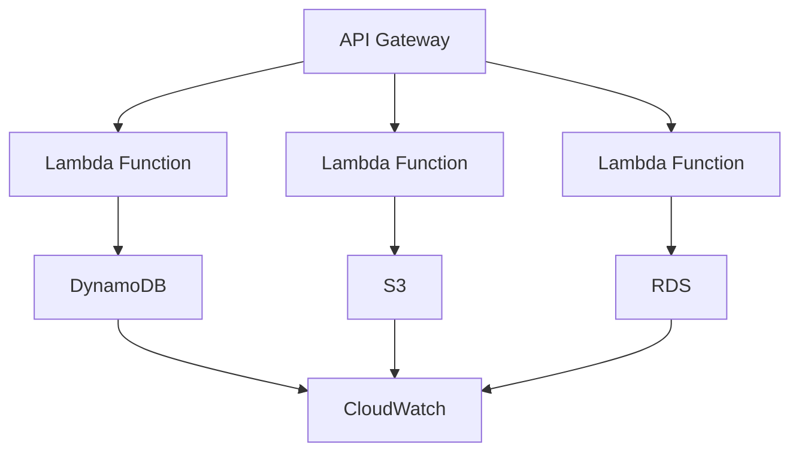

# Cloud Platforms Cheatsheet

## Table of Contents

1. [Quick Reference](#quick-reference)
2. [AWS Services](#aws-services)
3. [Azure Services](#azure-services)
4. [Google Cloud Platform](#google-cloud-platform)
5. [Cloud Architecture Patterns](#cloud-architecture-patterns)
6. [Security](#security)
7. [Cost Optimization](#cost-optimization)
8. [DevOps and Automation](#devops-and-automation)
9. [Monitoring and Logging](#monitoring-and-logging)
10. [Best Practices](#best-practices)

---

## Quick Reference

### Cloud Service Models

```markdown
# IaaS (Infrastructure as a Service)

- Virtual machines, storage, networks
- Examples: AWS EC2, Azure VMs, GCP Compute Engine
- You manage: OS, runtime, middleware, data, applications

# PaaS (Platform as a Service)

- Runtime environment, development tools, database
- Examples: AWS Elastic Beanstalk, Azure App Service, GCP App Engine
- You manage: Applications and data

# SaaS (Software as a Service)

- Complete applications accessible via web
- Examples: Gmail, Office 365, Salesforce
- You manage: User accounts and data

# FaaS (Function as a Service)

- Serverless computing
- Examples: AWS Lambda, Azure Functions, GCP Cloud Functions
- You manage: Code and configuration
```

### Cloud Deployment Models

```markdown
# Public Cloud

- Services offered over public internet
- Multi-tenant infrastructure
- Cost: Pay-as-you-go
- Examples: AWS, Azure, GCP

# Private Cloud

- Dedicated infrastructure for one organization
- Can be on-premises or hosted
- Cost: High upfront investment
- Examples: VMware, OpenStack

# Hybrid Cloud

- Combination of public and private
- Seamless integration between environments
- Cost: Variable
- Use cases: Gradual migration, compliance

# Multi-Cloud

- Using services from multiple cloud providers
- Avoid vendor lock-in
- Cost: Can be higher
- Use cases: Best-of-breed, risk mitigation
```

### Major Cloud Providers Comparison

| Service                 | AWS        | Azure            | GCP                |
| ----------------------- | ---------- | ---------------- | ------------------ |
| Virtual Machines        | EC2        | Virtual Machines | Compute Engine     |
| Object Storage          | S3         | Blob Storage     | Cloud Storage      |
| Relational DB           | RDS        | SQL Database     | Cloud SQL          |
| NoSQL DB                | DynamoDB   | Cosmos DB        | Firestore/Bigtable |
| CDN                     | CloudFront | CDN              | Cloud CDN          |
| Serverless              | Lambda     | Functions        | Cloud Functions    |
| Container Orchestration | EKS        | AKS              | GKE                |
| Load Balancing          | ELB/ALB    | Load Balancer    | Load Balancing     |

---

## AWS Services

### Compute Services

```bash
# EC2 (Elastic Compute Cloud)
# Launch instance
aws ec2 run-instances \
  --image-id ami-0c55b159cbfafe1d0 \
  --instance-type t2.micro \
  --key-name MyKeyPair \
  --security-group-ids sg-12345678

# Stop/Start instance
aws ec2 stop-instances --instance-ids i-1234567890abcdef0
aws ec2 start-instances --instance-ids i-1234567890abcdef0

# Create AMI
aws ec2 create-image \
  --instance-id i-1234567890abcdef0 \
  --name "My-App-AMI"

# Auto Scaling
aws autoscaling create-auto-scaling-group \
  --auto-scaling-group-name my-asg \
  --launch-template LaunchTemplateId=lt-12345678 \
  --min-size 2 --max-size 10 --desired-capacity 3

# Lambda
aws lambda create-function \
  --function-name my-function \
  --runtime python3.8 \
  --role arn:aws:iam::123456789012:role/lambda-role \
  --handler index.handler \
  --zip-file fileb://function.zip

# ECS (Elastic Container Service)
# Create cluster
aws ecs create-cluster --cluster-name production

# Fargate
# Run task
aws ecs run-task \
  --cluster production \
  --task-definition my-task:1 \
  --launch-type FARGATE \
  --network-configuration "awsvpcConfiguration={subnets=[subnet-12345],securityGroups=[sg-12345]}"
```

### Storage Services

```bash
# S3 (Simple Storage Service)
# Create bucket
aws s3 mb s3://my-unique-bucket-name

# Upload file
aws s3 cp local-file.txt s3://my-bucket/

# Sync directory
aws s3 sync local-dir/ s3://my-bucket/

# Set bucket policy
aws s3api put-bucket-policy \
  --bucket my-bucket \
  --policy file://bucket-policy.json

# Lifecycle policy
aws s3api put-bucket-lifecycle-configuration \
  --bucket my-bucket \
  --lifecycle-configuration file://lifecycle.json

# EFS (Elastic File System)
# Create file system
aws efs create-file-system \
  --creation-token unique-token \
  --performance-mode generalPurpose

# EBS (Elastic Block Store)
# Create volume
aws ec2 create-volume \
  --availability-zone us-east-1a \
  --size 100 \
  --volume-type gp2
```

### Database Services

```bash
# RDS (Relational Database Service)
# Create DB instance
aws rds create-db-instance \
  --db-instance-identifier mydbinstance \
  --db-instance-class db.t3.micro \
  --engine mysql \
  --engine-version 8.0.25 \
  --master-username admin \
  --master-user-password secretpassword \
  --allocated-storage 20

# Create read replica
aws rds create-db-instance-read-replica \
  --db-instance-identifier mydbinstance-replica \
  --source-db-instance-identifier mydbinstance

# DynamoDB
# Create table
aws dynamodb create-table \
  --table-name Users \
  --attribute-definitions AttributeName=user_id,AttributeType=S \
  --key-schema AttributeName=user_id,KeyType=HASH \
  --billing-mode PAY_PER_REQUEST

# Put item
aws dynamodb put-item \
  --table-name Users \
  --item '{"user_id": {"S": "123"}, "name": {"S": "John Doe"}}'

# Query
aws dynamodb query \
  --table-name Users \
  --key-condition-expression "user_id = :uid" \
  --expression-attribute-values '{":uid": {"S": "123"}}'
```

### Networking Services

```bash
# VPC (Virtual Private Cloud)
# Create VPC
aws ec2 create-vpc \
  --cidr-block 10.0.0.0/16 \
  --tag-specifications 'ResourceType=vpc,Tags=[{Key=Name,Value=MyVPC}]'

# Create subnet
aws ec2 create-subnet \
  --vpc-id vpc-12345678 \
  --cidr-block 10.0.1.0/24 \
  --availability-zone us-east-1a

# Internet Gateway
aws ec2 create-internet-gateway --tag-specifications 'ResourceType=internet-gateway,Tags=[{Key=Name,Value=MyIGW}]'
aws ec2 attach-internet-gateway --vpc-id vpc-12345678 --internet-gateway-id igw-12345678

# Route Table
aws ec2 create-route-table --vpc-id vpc-12345678
aws ec2 create-route --route-table-id rtb-12345678 --destination-cidr-block 0.0.0.0/0 --gateway-id igw-12345678

# Security Group
aws ec2 create-security-group \
  --group-name my-sg \
  --description "My security group" \
  --vpc-id vpc-12345678

# Add rules
aws ec2 authorize-security-group-ingress \
  --group-id sg-12345678 \
  --protocol tcp \
  --port 80 \
  --cidr 0.0.0.0/0

# Load Balancer
aws elbv2 create-load-balancer \
  --name my-alb \
  --subnets subnet-12345 subnet-67890 \
  --security-groups sg-12345678
```

### Serverless/Function Services

```javascript
// Lambda function example
exports.handler = async (event) => {
  // Parse the event
  const { httpMethod, path, body, headers } = event;

  // Handle different routes
  if (httpMethod === "GET" && path === "/health") {
    return {
      statusCode: 200,
      headers: {
        "Content-Type": "application/json",
        "Access-Control-Allow-Origin": "*",
      },
      body: JSON.stringify({ status: "healthy" }),
    };
  }

  if (httpMethod === "POST" && path === "/users") {
    const userData = JSON.parse(body);

    // Process user data
    const result = await processUser(userData);

    return {
      statusCode: 201,
      headers: {
        "Content-Type": "application/json",
        "Access-Control-Allow-Origin": "*",
      },
      body: JSON.stringify(result),
    };
  }

  return {
    statusCode: 404,
    body: JSON.stringify({ error: "Not found" }),
  };
};

async function processUser(userData) {
  // Your business logic here
  return {
    id: generateId(),
    ...userData,
    createdAt: new Date().toISOString(),
  };
}
```

### CloudFormation Templates

```yaml
# Basic CloudFormation template
AWSTemplateFormatVersion: "2010-09-09"
Description: "Simple web application"

Resources:
  # VPC
  MyVPC:
    Type: AWS::EC2::VPC
    Properties:
      CidrBlock: 10.0.0.0/16
      EnableDnsHostnames: true
      EnableDnsSupport: true
      Tags:
        - Key: Name
          Value: MyVPC

  # Subnet
  MySubnet:
    Type: AWS::EC2::Subnet
    Properties:
      VpcId: !Ref MyVPC
      CidrBlock: 10.0.1.0/24
      AvailabilityZone: !Select [0, !GetAZs ""]
      MapPublicIpOnLaunch: true
      Tags:
        - Key: Name
          Value: MySubnet

  # Internet Gateway
  MyIGW:
    Type: AWS::EC2::InternetGateway
    Properties:
      Tags:
        - Key: Name
          Value: MyIGW

  # Route Table
  MyRouteTable:
    Type: AWS::EC2::RouteTable
    Properties:
      VpcId: !Ref MyVPC
      Tags:
        - Key: Name
          Value: MyRouteTable

  # Route
  MyRoute:
    Type: AWS::EC2::Route
    DependsOn: MyIGW
    Properties:
      RouteTableId: !Ref MyRouteTable
      DestinationCidrBlock: 0.0.0.0/0
      GatewayId: !Ref MyIGW

  # Security Group
  MySecurityGroup:
    Type: AWS::EC2::SecurityGroup
    Properties:
      GroupDescription: Security group for web server
      VpcId: !Ref MyVPC
      SecurityGroupIngress:
        - IpProtocol: tcp
          FromPort: 80
          ToPort: 80
          CidrIp: 0.0.0.0/0
        - IpProtocol: tcp
          FromPort: 22
          ToPort: 22
          CidrIp: 0.0.0.0/0
      SecurityGroupEgress:
        - IpProtocol: tcp
          FromPort: 80
          ToPort: 80
          CidrIp: 0.0.0.0/0

  # EC2 Instance
  MyInstance:
    Type: AWS::EC2::Instance
    Properties:
      InstanceType: t2.micro
      ImageId: ami-0c55b159cbfafe1d0
      KeyName: MyKeyPair
      SecurityGroupIds:
        - !Ref MySecurityGroup
      SubnetId: !Ref MySubnet
      UserData: !Base64 |
        #!/bin/bash
        yum update -y
        yum install -y httpd
        systemctl start httpd
        systemctl enable httpd
        echo "Hello from CloudFormation" > /var/www/html/index.html
      Tags:
        - Key: Name
          Value: MyInstance

Outputs:
  InstanceId:
    Description: EC2 Instance ID
    Value: !Ref MyInstance
    Export:
      Name: !Sub "${AWS::StackName}-InstanceId"
```

---

## Azure Services

### Compute Services

```powershell
# Virtual Machines
# Create resource group
New-AzResourceGroup -Name "MyResourceGroup" -Location "East US"

# Create VM
New-AzVm `
  -ResourceGroupName "MyResourceGroup" `
  -Name "MyVM" `
  -Location "East US" `
  -ImageName "Win2016Datacenter" `
  -Size "Standard_B2s" `
  -Credential (Get-Credential)

# VMSS (Virtual Machine Scale Set)
New-AzVmss `
  -ResourceGroupName "MyResourceGroup" `
  -Location "East US" `
  -VMScaleSetName "MyVMScaleSet" `
  -VirtualNetworkName "MyVnet" `
  -SubnetName "default" `
  -PublicIpAddressName "MyVMScaleSet-PIP"

# App Service
New-AzAppServicePlan `
  -Name "MyAppServicePlan" `
  -Location "East US" `
  -Tier "Free" `
  -NumberofWorkers 1 `
  -WorkerSize "Small"

New-AzWebApp `
  -Name "MyWebApp" `
  -ResourceGroupName "MyResourceGroup" `
  -AppServicePlan "MyAppServicePlan"

# Azure Functions
# Create function app
New-AzFunctionApp `
  -Name "MyFunctionApp" `
  -ResourceGroupName "MyResourceGroup" `
  -StorageAccount "mystorageaccount" `
  -ConsumptionPlanLocation "East US" `
  -Runtime "node"
```

### Storage Services

```powershell
# Storage Account
New-AzStorageAccount `
  -Name "mystorageaccount" `
  -ResourceGroupName "MyResourceGroup" `
  -Location "East US" `
  -SkuName "Standard_GRS"

# Blob Storage
$context = New-AzStorageContext -StorageAccountName "mystorageaccount" -StorageAccountKey (Get-AzStorageAccountKey -AccountName "mystorageaccount" -ResourceGroupName "MyResourceGroup")[0].Value

# Upload blob
Set-AzStorageBlobContent `
  -ContainerName "mycontainer" `
  -File "C:\local\path\file.txt" `
  -Blob "file.txt" `
  -Context $context

# List blobs
Get-AzStorageBlob -ContainerName "mycontainer" -Context $context

# File Share
New-AzStorageShare -Name "myshare" -Context $context
```

### Database Services

```powershell
# SQL Database
New-AzSqlServer `
  -ServerName "myserver" `
  -Location "East US" `
  -SqlAdministratorCredentials (Get-Credential)

New-AzSqlDatabase `
  -ServerName "myserver" `
  -DatabaseName "mydatabase" `
  -RequestedServiceObjectiveName "S0"

# Cosmos DB
New-AzCosmosDBAccount `
  -Name "mycosmosdb" `
  -ResourceGroupName "MyResourceGroup" `
  -Location "East US" `
  -DefaultConsistencyLevel "Session" `
  -EnableAutomaticFailover:$true

# Create SQL API database and container
New-AzCosmosDBSqlDatabase `
  -AccountName "mycosmosdb" `
  -ResourceGroupName "MyResourceGroup" `
  -Name "mydatabase"

New-AzCosmosDBSqlContainer `
  -AccountName "mycosmosdb" `
  -ResourceGroupName "MyResourceGroup" `
  -DatabaseName "mydatabase" `
  -Name "mycontainer" `
  -PartitionKeyPath "/id"
```

### Networking Services

```powershell
# Virtual Network
$vnet = New-AzVirtualNetwork `
  -ResourceGroupName "MyResourceGroup" `
  -Name "MyVnet" `
  -AddressPrefix 10.0.0.0/16 `
  -Location "East US"

# Subnet
$subnet = Add-AzVirtualNetworkSubnetConfig `
  -Name "default" `
  -AddressPrefix 10.0.1.0/24 `
  -VirtualNetwork $vnet

# Set VNet
$vnet | Set-AzVirtualNetwork

# Application Gateway
$pip = New-AzPublicIpAddress `
  -ResourceGroupName "MyResourceGroup" `
  -Name "MyAG-PIP" `
  -Location "East US" `
  -AllocationMethod Dynamic

# Create application gateway
$gateway = New-AzApplicationGateway `
  -Name "MyAppGateway" `
  -ResourceGroupName "MyResourceGroup" `
  -Location "East US" `
  -SkuName "WAF_Medium" `
  -Tier "WAF" `
  -Force

# Traffic Manager
New-AzTrafficManagerProfile `
  -Name "myTMProfile" `
  -ResourceGroupName "MyResourceGroup" `
  -TrafficRoutingMethod "Performance" `
  -RelativeDnsName "myapp" `
  -Ttl 60 `
  -MonitorProtocol "Http" `
  -MonitorPort 80 `
  -MonitorPath "/"
```

### ARM Templates

```json
{
  "$schema": "https://schema.management.azure.com/schemas/2019-04-01/deploymentTemplate.json#",
  "contentVersion": "1.0.0.0",
  "parameters": {
    "vmName": {
      "type": "string",
      "defaultValue": "myVM"
    },
    "vmSize": {
      "type": "string",
      "defaultValue": "Standard_D2s_v3"
    },
    "adminUsername": {
      "type": "string"
    },
    "adminPassword": {
      "type": "securestring"
    }
  },
  "variables": {
    "vmName": "[parameters('vmName')]",
    "vmSize": "[parameters('vmSize')]",
    "imagePublisher": "MicrosoftWindowsServer",
    "imageOffer": "WindowsServer",
    "imageSKU": "2019-Datacenter"
  },
  "resources": [
    {
      "type": "Microsoft.Compute/virtualMachines",
      "apiVersion": "2019-07-01",
      "name": "[variables('vmName')]",
      "location": "[resourceGroup().location]",
      "properties": {
        "hardwareProfile": {
          "vmSize": "[variables('vmSize')]"
        },
        "osProfile": {
          "computerName": "[variables('vmName')]",
          "adminUsername": "[parameters('adminUsername')]",
          "adminPassword": "[parameters('adminPassword')]"
        },
        "storageProfile": {
          "imageReference": {
            "publisher": "[variables('imagePublisher')]",
            "offer": "[variables('imageOffer')]",
            "sku": "[variables('imageSKU')]",
            "version": "latest"
          },
          "osDisk": {
            "name": "[concat(variables('vmName'),'_OSDisk')]",
            "createOption": "FromImage"
          }
        },
        "networkProfile": {
          "networkInterfaces": [
            {
              "id": "[resourceId('Microsoft.Network/networkInterfaces', concat(variables('vmName'),'-nic'))]"
            }
          ]
        }
      }
    }
  ],
  "outputs": {
    "vmName": {
      "type": "string",
      "value": "[variables('vmName')]"
    }
  }
}
```

---

## Google Cloud Platform

### Compute Services

```bash
# Compute Engine
# Create instance
gcloud compute instances create my-vm \
  --zone=us-central1-a \
  --machine-type=e2-micro \
  --image-family=ubuntu-2004-lts \
  --image-project=ubuntu-os-cloud

# Create instance template
gcloud compute instance-templates create-with-container my-website \
  --machine-type=e2-micro \
  --image-family=container-optimized-os-stable \
  --image-project=cos-cloud \
  --container-image=gcr.io/my-project/my-website:latest

# Create managed instance group
gcloud compute instance-groups managed create my-mig \
  --zone=us-central1-a \
  --size=3 \
  --template=my-website

# App Engine
# Deploy application
gcloud app deploy app.yaml

# Cloud Run
# Deploy service
gcloud run deploy my-service \
  --image=gcr.io/my-project/my-app:latest \
  --platform=managed \
  --region=us-central1

# Cloud Functions
# Create function
gcloud functions deploy my-function \
  --trigger-http \
  --runtime=python39 \
  --entry-point=main
```

### Storage Services

```bash
# Cloud Storage
# Create bucket
gsutil mb gs://my-bucket

# Upload file
gsutil cp file.txt gs://my-bucket/

# Download file
gsutil cp gs://my-bucket/file.txt .

# Make bucket public
gsutil iam ch allUsers:objectViewer gs://my-bucket

# Cloud SQL
# Create instance
gcloud sql instances create my-instance \
  --database-version=POSTGRES_13 \
  --cpu=2 \
  --memory=7680MB \
  --region=us-central1

# Create database
gcloud sql databases create my-db --instance=my-instance

# BigQuery
# Create dataset
bq mk my_dataset

# Create table
bq mk my_dataset.my_table schema.json
```

### Kubernetes Engine (GKE)

```bash
# Create cluster
gcloud container clusters create my-cluster \
  --zone=us-central1-a \
  --num-nodes=3 \
  --enable-autoscaling \
  --min-nodes=2 \
  --max-nodes=5

# Get credentials
gcloud container clusters get-credentials my-cluster \
  --zone=us-central1-a

# Deploy application
kubectl create deployment my-app --image=gcr.io/my-project/my-app:latest
kubectl expose deployment my-app --type=LoadBalancer --port=80

# Autoscale
kubectl autoscale deployment my-app --cpu-percent=50 --min=1 --max=10
```

### Serverless Functions

```python
# Cloud Function example (Python)
def main(request):
    """HTTP Cloud Function."""
    request_json = request.get_json()

    if request.method == 'OPTIONS':
        # Handle CORS preflight request
        return ('', 204, {
            'Access-Control-Allow-Origin': '*',
            'Access-Control-Allow-Headers': 'Content-Type',
            'Access-Control-Allow-Methods': 'GET, POST, OPTIONS'
        })

    if request_json and 'name' in request_json:
        name = request_json['name']
        return (f'Hello {name}!', 200, {
            'Access-Control-Allow-Origin': '*',
            'Content-Type': 'application/json'
        })
    else:
        error_message = 'Missing name in request body' if request_json else 'Invalid request'
        return (error_message, 400, {
            'Access-Control-Allow-Origin': '*',
            'Content-Type': 'application/json'
        })
```

### Terraform for GCP

```hcl
# provider.tf
terraform {
  required_providers {
    google = {
      source  = "hashicorp/google"
      version = "~> 4.0"
    }
  }
}

provider "google" {
  project = var.project_id
  region  = var.region
}

# variables.tf
variable "project_id" {
  description = "GCP Project ID"
  type        = string
}

variable "region" {
  description = "GCP Region"
  type        = string
  default     = "us-central1"
}

variable "environment" {
  description = "Environment name"
  type        = string
}

# main.tf
resource "google_project" "project" {
  name       = "My Project"
  project_id = var.project_id
  org_id     = "123456789"
}

resource "google_project_services" "project_services" {
  project  = var.project_id
  services = [
    "compute.googleapis.com",
    "storage.googleapis.com",
    "sql.googleapis.com"
  ]
}

resource "google_container_cluster" "primary" {
  name     = "my-gke-cluster"
  location = var.region

  # Remove default node pool
  remove_default_node_pool = true
  initial_node_count       = 1

  network    = google_compute_network.vpc.name
  subnetwork = google_compute_subnetwork.subnet.name

  ip_allocation_policy {}

  addons_config {
    horizontal_pod_autoscaling {
      disabled = false
    }
  }
}

resource "google_compute_network" "vpc" {
  name                    = "my-vpc"
  auto_create_subnetworks = false
}

resource "google_compute_subnetwork" "subnet" {
  name          = "my-subnet"
  ip_cidr_range = "10.0.0.0/24"
  region        = var.region
  network       = google_compute_network.vpc.id
}
```

---

## Cloud Architecture Patterns

### Serverless Architecture



### Microservices Architecture


### Event-Driven Architecture


### CQRS (Command Query Responsibility Segregation)


---

## Security

### IAM Policies

```json
{
  "Version": "2012-10-17",
  "Statement": [
    {
      "Effect": "Allow",
      "Action": ["s3:GetObject", "s3:PutObject", "s3:DeleteObject"],
      "Resource": "arn:aws:s3:::my-bucket/*"
    },
    {
      "Effect": "Allow",
      "Action": ["dynamodb:GetItem", "dynamodb:PutItem", "dynamodb:Query"],
      "Resource": "arn:aws:dynamodb:us-east-1:123456789012:table/Users"
    },
    {
      "Effect": "Deny",
      "Action": ["s3:DeleteObject"],
      "Resource": "arn:aws:s3:::my-bucket/production/*"
    }
  ]
}
```

### Security Groups Configuration

```bash
# Web tier security group
aws ec2 create-security-group \
  --group-name web-tier-sg \
  --description "Security group for web tier"

aws ec2 authorize-security-group-ingress \
  --group-name web-tier-sg \
  --protocol tcp \
  --port 80 \
  --cidr 0.0.0.0/0

aws ec2 authorize-security-group-ingress \
  --group-name web-tier-sg \
  --protocol tcp \
  --port 443 \
  --cidr 0.0.0.0/0

# App tier security group
aws ec2 create-security-group \
  --group-name app-tier-sg \
  --description "Security group for app tier"

aws ec2 authorize-security-group-ingress \
  --group-name app-tier-sg \
  --protocol tcp \
  --port 8080 \
  --source-group web-tier-sg

# Database tier security group
aws ec2 create-security-group \
  --group-name db-tier-sg \
  --description "Security group for database tier"

aws ec2 authorize-security-group-ingress \
  --group-name db-tier-sg \
  --protocol tcp \
  --port 3306 \
  --source-group app-tier-sg
```

### Encryption Configuration

```yaml
# S3 server-side encryption
aws s3api put-bucket-encryption \
  --bucket my-bucket \
  --server-side-encryption-configuration '{
    "Rules": [
      {
        "ApplyServerSideEncryptionByDefault": {
          "SSEAlgorithm": "AES256"
        }
      }
    ]
  }'

# EBS encryption
aws ec2 create-volume \
  --availability-zone us-east-1a \
  --size 100 \
  --encrypted \
  --kms-key-id alias/my-kms-key

# RDS encryption
aws rds create-db-instance \
  --db-instance-identifier mydbinstance \
  --db-instance-class db.t3.micro \
  --engine mysql \
  --engine-version 8.0.25 \
  --allocated-storage 20 \
  --storage-encrypted \
  --kms-key-id alias/my-kms-key
```

### VPC Security Best Practices

```yaml
# VPC with private and public subnets
Resources:
  VPC:
    Type: AWS::EC2::VPC
    Properties:
      CidrBlock: 10.0.0.0/16
      EnableDnsHostnames: true
      EnableDnsSupport: true
      Tags:
        - Key: Name
          Value: Production VPC

  # Public subnets
  PublicSubnet1:
    Type: AWS::EC2::Subnet
    Properties:
      VpcId: !Ref VPC
      CidrBlock: 10.0.1.0/24
      AvailabilityZone: !Select [0, !GetAZs ""]
      MapPublicIpOnLaunch: true
      Tags:
        - Key: Name
          Value: Public Subnet 1

  # Private subnets
  PrivateSubnet1:
    Type: AWS::EC2::Subnet
    Properties:
      VpcId: !Ref VPC
      CidrBlock: 10.0.2.0/24
      AvailabilityZone: !Select [0, !GetAZs ""]
      Tags:
        - Key: Name
          Value: Private Subnet 1

  # Internet Gateway
  InternetGateway:
    Type: AWS::EC2::InternetGateway
    Properties:
      Tags:
        - Key: Name
          Value: Production IGW

  # NAT Gateway (for private subnet outbound internet)
  NATGateway1EIP:
    Type: AWS::EC2::EIP
    DependsOn: InternetGateway
    Properties:
      Domain: vpc
      Tags:
        - Key: Name
          Value: NAT Gateway EIP

  NATGateway1:
    Type: AWS::EC2::NatGateway
    Properties:
      AllocationId: !GetAtt NATGateway1EIP.AllocationId
      SubnetId: !Ref PublicSubnet1
      Tags:
        - Key: Name
          Value: NAT Gateway 1

  # Route tables
  PublicRouteTable:
    Type: AWS::EC2::RouteTable
    Properties:
      VpcId: !Ref VPC
      Tags:
        - Key: Name
          Value: Public Route Table

  PublicRoute:
    Type: AWS::EC2::Route
    DependsOn: InternetGateway
    Properties:
      RouteTableId: !Ref PublicRouteTable
      DestinationCidrBlock: 0.0.0.0/0
      GatewayId: !Ref InternetGateway

  PrivateRouteTable:
    Type: AWS::EC2::RouteTable
    Properties:
      VpcId: !Ref VPC
      Tags:
        - Key: Name
          Value: Private Route Table

  PrivateRoute:
    Type: AWS::EC2::Route
    DependsOn: NATGateway1
    Properties:
      RouteTableId: !Ref PrivateRouteTable
      DestinationCidrBlock: 0.0.0.0/0
      NatGatewayId: !Ref NATGateway1
```

---

## Cost Optimization

### Reserved Instances Planning

```python
import pandas as pd
import boto3
from datetime import datetime, timedelta

def analyze_reserved_instance_opportunities():
    """Analyze EC2 usage to find Reserved Instance opportunities"""
    ce = boto3.client('ce')  # Cost Explorer

    # Get EC2 usage for last 3 months
    end_date = datetime.now().strftime('%Y-%m-%d')
    start_date = (datetime.now() - timedelta(days=90)).strftime('%Y-%m-%d')

    response = ce.get_cost_and_usage(
        TimePeriod={
            'Start': start_date,
            'End': end_date
        },
        Granularity='DAILY',
        Metrics=['UsageQuantity'],
        GroupBy=[
            {
                'Type': 'DIMENSION',
                'Key': 'USAGE_TYPE'
            }
        ],
        Filter={
            'Dimensions': {
                'Key': 'SERVICE',
                'Values': ['AmazonEC2']
            }
        }
    )

    # Analyze usage patterns
    usage_data = []
    for result in response['ResultsByTime']:
        date = result['TimePeriod']['Start']
        for group in result['Groups']:
            if 'BoxUsage' in group['Keys'][0]:
                usage_quantity = float(group['Metrics']['UsageQuantity']['Amount'])
                usage_data.append({
                    'date': date,
                    'usage_type': group['Keys'][0],
                    'usage_hours': usage_quantity
                })

    df = pd.DataFrame(usage_data)

    # Calculate monthly averages
    monthly_avg = df.groupby('usage_type')['usage_hours'].mean().reset_index()
    monthly_avg['monthly_hours'] = monthly_avg['usage_hours'] * 24 * 30

    # Identify opportunities (usage > 200 hours/month consistently)
    opportunities = monthly_avg[monthly_avg['monthly_hours'] >= 200]

    return opportunities

def calculate_ri_savings(instance_type, hours_per_month, term=1):
    """Calculate potential savings with Reserved Instances"""
    # Get on-demand price
    pricing = boto3.client('pricing')

    response = pricing.get_products(
        ServiceCode='AmazonEC2',
        Filters=[
            {'Type': 'TERM', 'Field': 'termType', 'Value': 'OnDemand'},
            {'Type': 'TERM', 'Field': 'instanceType', 'Value': instance_type}
        ],
        MaxResults=1
    )

    on_demand_price = float(response['PriceList'][0]['product']['terms']['OnDemand']['priceDimensions']['pricePerUnit']['USD'])

    # Reserved instance prices (simplified)
    ri_prices = {
        1: on_demand_price * 0.3,  # 70% savings
        3: on_demand_price * 0.15  # 85% savings
    }

    on_demand_monthly = on_demand_price * hours_per_month
    ri_monthly = ri_prices[term] * hours_per_month
    monthly_savings = on_demand_monthly - ri_monthly
    total_savings = monthly_savings * 12 * term

    return {
        'instance_type': instance_type,
        'monthly_hours': hours_per_month,
        'on_demand_monthly_cost': on_demand_monthly,
        'ri_monthly_cost': ri_monthly,
        'monthly_savings': monthly_savings,
        'total_savings': total_savings,
        'savings_percentage': (monthly_savings / on_demand_monthly) * 100
    }
```

### S3 Lifecycle Policies

```json
{
  "Rules": [
    {
      "ID": "StandardToGlacierTransition",
      "Status": "Enabled",
      "Filter": {
        "Prefix": "logs/"
      },
      "Transitions": [
        {
          "Days": 30,
          "StorageClass": "STANDARD_IA"
        },
        {
          "Days": 90,
          "StorageClass": "GLACIER"
        }
      ]
    },
    {
      "ID": "DeleteOldBackups",
      "Status": "Enabled",
      "Filter": {
        "Prefix": "backups/"
      },
      "Expiration": {
        "Days": 90
      }
    }
  ]
}
```

### Auto-scaling Optimization

```python
def optimize_auto_scaling():
    """Optimize auto-scaling based on usage patterns"""
    cloudwatch = boto3.client('cloudwatch')

    # Get CPU utilization statistics
    end_time = datetime.now()
    start_time = end_time - timedelta(days=7)

    metrics = cloudwatch.get_metric_statistics(
        Namespace='AWS/EC2',
        MetricName='CPUUtilization',
        Dimensions=[
            {
                'Name': 'AutoScalingGroupName',
                'Value': 'my-asg'
            }
        ],
        StartTime=start_time,
        EndTime=end_time,
        Period=3600,  # 1 hour
        Statistics=['Average', 'Maximum']
    )

    # Analyze patterns
    cpu_data = metrics['Datapoints']
    cpu_data.sort(key=lambda x: x['Timestamp'])

    # Find utilization patterns
    low_utilization_periods = []
    high_utilization_periods = []

    for datapoint in cpu_data:
        if datapoint['Average'] < 20:
            low_utilization_periods.append(datapoint)
        elif datapoint['Average'] > 80:
            high_utilization_periods.append(datapoint)

    # Calculate optimal scaling parameters
    min_instances = max(1, len(low_utilization_periods) // 24)  # At least 1 instance
    max_instances = min(20, len(high_utilization_periods) // 6)  # Reasonable upper limit

    return {
        'recommended_min_size': min_instances,
        'recommended_max_size': max_instances,
        'current_utilization_patterns': {
            'low_utilization_hours': len(low_utilization_periods),
            'high_utilization_hours': len(high_utilization_periods)
        }
    }
```

---

## DevOps and Automation

### CI/CD Pipeline (GitHub Actions)

```yaml
name: CI/CD Pipeline

on:
  push:
    branches: [main, develop]
  pull_request:
    branches: [main]

env:
  AWS_REGION: us-east-1
  ECR_REPOSITORY: my-app
  ECS_CLUSTER: my-cluster
  ECS_SERVICE: my-service

jobs:
  test:
    runs-on: ubuntu-latest
    steps:
      - uses: actions/checkout@v2

      - name: Set up Python
        uses: actions/setup-python@v2
        with:
          python-version: "3.9"

      - name: Install dependencies
        run: |
          python -m pip install --upgrade pip
          pip install -r requirements.txt
          pip install pytest pytest-cov

      - name: Run tests
        run: |
          pytest tests/ --cov=src/ --cov-report=xml

      - name: Upload coverage
        uses: codecov/codecov-action@v1

  build-and-push:
    needs: test
    runs-on: ubuntu-latest
    if: github.ref == 'refs/heads/main'

    steps:
      - uses: actions/checkout@v2

      - name: Configure AWS credentials
        uses: aws-actions/configure-aws-credentials@v1
        with:
          aws-access-key-id: ${{ secrets.AWS_ACCESS_KEY_ID }}
          aws-secret-access-key: ${{ secrets.AWS_SECRET_ACCESS_KEY }}
          aws-region: ${{ env.AWS_REGION }}

      - name: Login to Amazon ECR
        id: login-ecr
        run: |
          aws ecr get-login-password --region $AWS_REGION | docker login --username AWS --password-stdin $ECR_REGISTRY

      - name: Build, tag, and push image to Amazon ECR
        id: build-image
        run: |
          IMAGE_TAG=${{ github.sha }}
          docker build -t $ECR_REGISTRY/$ECR_REPOSITORY:$IMAGE_TAG .
          docker push $ECR_REGISTRY/$ECR_REPOSITORY:$IMAGE_TAG
          echo "image=$ECR_REGISTRY/$ECR_REPOSITORY:$IMAGE_TAG" >> $GITHUB_OUTPUT

  deploy:
    needs: build-and-push
    runs-on: ubuntu-latest
    if: github.ref == 'refs/heads/main'

    steps:
      - name: Configure AWS credentials
        uses: aws-actions/configure-aws-credentials@v1
        with:
          aws-access-key-id: ${{ secrets.AWS_ACCESS_KEY_ID }}
          aws-secret-access-key: ${{ secrets.AWS_SECRET_ACCESS_KEY }}
          aws-region: ${{ env.AWS_REGION }}

      - name: Deploy to Amazon ECS
        uses: aws-actions/amazon-ecs-deploy-task-definition@v1
        with:
          task-definition: task-definition.json
          service: ${{ env.ECS_SERVICE }}
          cluster: ${{ env.ECS_CLUSTER }}
          container-name: web
          container-image: ${{ needs.build-and-push.outputs.image }}
```

### Infrastructure as Code (Terraform)

```hloc
# main.tf - Complete infrastructure setup
terraform {
  required_providers {
    aws = {
      source  = "hashicorp/aws"
      version = "~> 4.0"
    }
  }

  backend "s3" {
    bucket = "my-terraform-state"
    key    = "prod/terraform.tfstate"
    region = "us-east-1"
  }
}

provider "aws" {
  region = var.aws_region
}

# VPC and networking
resource "aws_vpc" "main" {
  cidr_block           = var.vpc_cidr
  enable_dns_hostnames = true
  enable_dns_support   = true

  tags = {
    Name        = "${var.environment}-vpc"
    Environment = var.environment
  }
}

resource "aws_internet_gateway" "main" {
  vpc_id = aws_vpc.main.id

  tags = {
    Name        = "${var.environment}-igw"
    Environment = var.environment
  }
}

resource "aws_subnet" "public" {
  count = 2

  vpc_id                  = aws_vpc.main.id
  cidr_block              = var.public_subnet_cidrs[count.index]
  availability_zone       = data.aws_availability_zones.available.names[count.index]
  map_public_ip_on_launch = true

  tags = {
    Name        = "${var.environment}-public-subnet-${count.index + 1}"
    Environment = var.environment
  }
}

resource "aws_subnet" "private" {
  count = 2

  vpc_id            = aws_vpc.main.id
  cidr_block        = var.private_subnet_cidrs[count.index]
  availability_zone = data.aws_availability_zones.available.names[count.index]

  tags = {
    Name        = "${var.environment}-private-subnet-${count.index + 1}"
    Environment = var.environment
  }
}

# EKS cluster
resource "aws_eks_cluster" "main" {
  name     = "${var.environment}-cluster"
  role_arn = aws_iam_role.eks_cluster.arn
  version  = "1.21"

  vpc_config {
    subnet_ids              = aws_subnet.public[*].id
    endpoint_private_access = true
    endpoint_public_access  = true
    public_access_cidrs     = ["0.0.0.0/0"]
  }

  tags = {
    Name        = "${var.environment}-eks"
    Environment = var.environment
  }
}

# EKS node group
resource "aws_eks_node_group" "main" {
  cluster_name    = aws_eks_cluster.main.name
  node_group_name = "${var.environment}-node-group"
  node_role       = aws_iam_role.eks_node.arn
  subnet_ids      = aws_subnet.private[*].id

  instance_types = [var.node_instance_type]

  scaling_config {
    desired_size = var.node_desired_capacity
    max_size     = var.node_max_capacity
    min_size     = var.node_min_capacity
  }

  tags = {
    Name        = "${var.environment}-node-group"
    Environment = var.environment
  }
}
```

### Kubernetes Manifests

```yaml
# deployment.yaml
apiVersion: apps/v1
kind: Deployment
metadata:
  name: web-app
  namespace: production
  labels:
    app: web-app
    tier: frontend
spec:
  replicas: 3
  strategy:
    type: RollingUpdate
    rollingUpdate:
      maxSurge: 1
      maxUnavailable: 0
  selector:
    matchLabels:
      app: web-app
  template:
    metadata:
      labels:
        app: web-app
        tier: frontend
    spec:
      containers:
        - name: web-app
          image: my-registry/web-app:latest
          ports:
            - containerPort: 8080
              name: http
          env:
            - name: DATABASE_URL
              valueFrom:
                secretKeyRef:
                  name: app-secrets
                  key: database-url
            - name: API_KEY
              valueFrom:
                secretKeyRef:
                  name: app-secrets
                  key: api-key
          resources:
            requests:
              memory: "256Mi"
              cpu: "250m"
            limits:
              memory: "512Mi"
              cpu: "500m"
          livenessProbe:
            httpGet:
              path: /health
              port: 8080
            initialDelaySeconds: 30
            periodSeconds: 10
            timeoutSeconds: 5
            failureThreshold: 3
          readinessProbe:
            httpGet:
              path: /ready
              port: 8080
            initialDelaySeconds: 5
            periodSeconds: 5
            timeoutSeconds: 3
            failureThreshold: 3
          securityContext:
            allowPrivilegeEscalation: false
            runAsNonRoot: true
            runAsUser: 1000
            readOnlyRootFilesystem: true
            capabilities:
              drop:
                - ALL

---
# service.yaml
apiVersion: v1
kind: Service
metadata:
  name: web-app-service
  namespace: production
  labels:
    app: web-app
spec:
  type: LoadBalancer
  selector:
    app: web-app
  ports:
    - port: 80
      targetPort: 8080
      protocol: TCP
      name: http

---
# ingress.yaml
apiVersion: networking.k8s.io/v1
kind: Ingress
metadata:
  name: web-app-ingress
  namespace: production
  annotations:
    kubernetes.io/ingress.class: "nginx"
    cert-manager.io/cluster-issuer: "letsencrypt-prod"
    nginx.ingress.kubernetes.io/rate-limit: "100"
    nginx.ingress.kubernetes.io/rate-limit-window: "1m"
spec:
  tls:
    - hosts:
        - myapp.example.com
      secretName: web-app-tls
  rules:
    - host: myapp.example.com
      http:
        paths:
          - path: /
            pathType: Prefix
            backend:
              service:
                name: web-app-service
                port:
                  number: 80

---
# hpa.yaml
apiVersion: autoscaling/v2
kind: HorizontalPodAutoscaler
metadata:
  name: web-app-hpa
  namespace: production
spec:
  scaleTargetRef:
    apiVersion: apps/v1
    kind: Deployment
    name: web-app
  minReplicas: 3
  maxReplicas: 20
  metrics:
    - type: Resource
      resource:
        name: cpu
        target:
          type: Utilization
          averageUtilization: 70
    - type: Resource
      resource:
        name: memory
        target:
          type: Utilization
          averageUtilization: 80
  behavior:
    scaleDown:
      stabilizationWindowSeconds: 300
      policies:
        - type: Percent
          value: 50
          periodSeconds: 60
    scaleUp:
      stabilizationWindowSeconds: 60
      policies:
        - type: Percent
          value: 100
          periodSeconds: 15
```

---

## Monitoring and Logging

### CloudWatch Monitoring

```python
import boto3
import json
from datetime import datetime, timedelta

def setup_application_monitoring():
    """Set up comprehensive monitoring for application"""
    cloudwatch = boto3.client('cloudwatch')
    cw_events = boto3.client('events')

    # Create custom metrics
    custom_metrics = [
        {
            'Namespace': 'MyApp/Performance',
            'MetricData': [
                {
                    'MetricName': 'ResponseTime',
                    'Value': 250.5,
                    'Unit': 'Milliseconds',
                    'Dimensions': [
                        {
                            'Name': 'Service',
                            'Value': 'UserService'
                        }
                    ]
                }
            ]
        },
        {
            'Namespace': 'MyApp/Business',
            'MetricData': [
                {
                    'MetricName': 'OrdersProcessed',
                    'Value': 150,
                    'Unit': 'Count',
                    'Dimensions': [
                        {
                            'Name': 'Service',
                            'Value': 'OrderService'
                        }
                    ]
                }
            ]
        }
    ]

    # Put custom metrics
    for metric in custom_metrics:
        cloudwatch.put_metric_data(
            Namespace=metric['Namespace'],
            MetricData=metric['MetricData']
        )

    # Create alarms
    alarms = [
        {
            'AlarmName': 'HighCPUUtilization',
            'ComparisonOperator': 'GreaterThanThreshold',
            'EvaluationPeriods': 2,
            'MetricName': 'CPUUtilization',
            'Namespace': 'AWS/EC2',
            'Period': 300,
            'Statistic': 'Average',
            'Threshold': 80.0,
            'ActionsEnabled': True,
            'AlarmActions': ['arn:aws:sns:us-east-1:123456789012:alarms'],
            'AlarmDescription': 'Alarm when CPU exceeds 80%'
        },
        {
            'AlarmName': 'HighErrorRate',
            'ComparisonOperator': 'GreaterThanThreshold',
            'EvaluationPeriods': 1,
            'MetricName': 'ErrorRate',
            'Namespace': 'MyApp/Performance',
            'Period': 300,
            'Statistic': 'Average',
            'Threshold': 5.0,
            'ActionsEnabled': True,
            'AlarmActions': ['arn:aws:sns:us-east-1:123456789012:alarms'],
            'AlarmDescription': 'Alarm when error rate exceeds 5%'
        }
    ]

    for alarm in alarms:
        cloudwatch.put_metric_alarm(**alarm)

    # Set up log groups
    log_groups = [
        'MyApp/Application',
        'MyApp/Access',
        'MyApp/Error'
    ]

    for group in log_groups:
        cloudwatch.create_log_group(logGroupName=group)
        cloudwatch.put_retention_policy(
            logGroupName=group,
            retentionInDays=30
        )

    return {
        'status': 'monitoring_setup_complete',
        'custom_metrics': len(custom_metrics),
        'alarms': len(alarms),
        'log_groups': len(log_groups)
    }

def send_custom_metric(metric_name, value, namespace, dimensions=None):
    """Send custom metric to CloudWatch"""
    cloudwatch = boto3.client('cloudwatch')

    metric_data = {
        'MetricName': metric_name,
        'Value': value,
        'Unit': 'Count',
        'Timestamp': datetime.now()
    }

    if dimensions:
        metric_data['Dimensions'] = dimensions

    cloudwatch.put_metric_data(
        Namespace=namespace,
        MetricData=[metric_data]
    )
```

### Structured Logging

```python
import logging
import json
import boto3
from datetime import datetime

class CloudWatchLogger:
    def __init__(self, log_group_name='MyApp', log_stream_name=None):
        self.log_group_name = log_group_name
        self.log_stream_name = log_stream_name or f"app-{datetime.now().strftime('%Y%m%d')}"
        self.cloudwatch_logs = boto3.client('logs')

        # Ensure log group exists
        self._ensure_log_group()

    def _ensure_log_group(self):
        """Ensure log group exists"""
        try:
            self.cloudwatch_logs.create_log_group(logGroupName=self.log_group_name)
        except self.cloudwatch_logs.exceptions.ResourceAlreadyExistsException:
            pass

    def _format_log_entry(self, level, message, **kwargs):
        """Format log entry as JSON"""
        log_entry = {
            'timestamp': datetime.now().isoformat(),
            'level': level,
            'message': message,
            'service': 'my-app',
            'version': '1.0.0'
        }

        # Add additional context
        for key, value in kwargs.items():
            log_entry[key] = value

        return json.dumps(log_entry)

    def info(self, message, **kwargs):
        """Log info message"""
        log_entry = self._format_log_entry('INFO', message, **kwargs)
        self._send_log(log_entry)

    def error(self, message, error=None, **kwargs):
        """Log error message"""
        context = kwargs.copy()
        if error:
            context['error_type'] = type(error).__name__
            context['error_message'] = str(error)

        log_entry = self._format_log_entry('ERROR', message, **context)
        self._send_log(log_entry)

    def warning(self, message, **kwargs):
        """Log warning message"""
        log_entry = self._format_log_entry('WARNING', message, **kwargs)
        self._send_log(log_entry)

    def debug(self, message, **kwargs):
        """Log debug message"""
        log_entry = self._format_log_entry('DEBUG', message, **kwargs)
        self._send_log(log_entry)

    def _send_log(self, log_entry):
        """Send log entry to CloudWatch"""
        try:
            self.cloudwatch_logs.put_log_events(
                logGroupName=self.log_group_name,
                logStreamName=self.log_stream_name,
                logEvents=[
                    {
                        'timestamp': int(datetime.now().timestamp() * 1000),
                        'message': log_entry
                    }
                ]
            )
        except Exception as e:
            # Fallback to console logging
            print(f"Failed to send to CloudWatch: {e}")
            print(log_entry)

# Usage example
logger = CloudWatchLogger()

# Application startup
logger.info("Application started",
           version="1.0.0",
           environment="production")

# User action
logger.info("User login successful",
           user_id="user123",
           session_id="session456")

# Error handling
try:
    result = risky_operation()
except Exception as e:
    logger.error("Operation failed",
                error=e,
                operation="risky_operation",
                user_id="user123")
```

### Health Checks and Uptime Monitoring

```python
import boto3
import requests
import json
from datetime import datetime, timedelta

class HealthChecker:
    def __init__(self, endpoints):
        self.endpoints = endpoints
        self.cloudwatch = boto3.client('cloudwatch')

    def check_endpoint(self, endpoint):
        """Check health of a single endpoint"""
        try:
            start_time = datetime.now()
            response = requests.get(endpoint['url'], timeout=30)
            end_time = datetime.now()

            response_time = (end_time - start_time).total_seconds() * 1000
            status_code = response.status_code
            is_healthy = 200 <= status_code < 300

            # Send metrics to CloudWatch
            self.cloudwatch.put_metric_data(
                Namespace='MyApp/Health',
                MetricData=[
                    {
                        'MetricName': 'ResponseTime',
                        'Value': response_time,
                        'Unit': 'Milliseconds',
                        'Dimensions': [
                            {'Name': 'Endpoint', 'Value': endpoint['name']}
                        ]
                    },
                    {
                        'MetricName': 'StatusCode',
                        'Value': status_code,
                        'Dimensions': [
                            {'Name': 'Endpoint', 'Value': endpoint['name']}
                        ]
                    }
                ]
            )

            return {
                'endpoint': endpoint['name'],
                'url': endpoint['url'],
                'status': 'healthy' if is_healthy else 'unhealthy',
                'status_code': status_code,
                'response_time_ms': response_time,
                'timestamp': end_time.isoformat()
            }

        except requests.exceptions.RequestException as e:
            # Handle network errors
            self.cloudwatch.put_metric_data(
                Namespace='MyApp/Health',
                MetricData=[
                    {
                        'MetricName': 'StatusCode',
                        'Value': 0,  # Error
                        'Dimensions': [
                            {'Name': 'Endpoint', 'Value': endpoint['name']}
                        ]
                    }
                ]
            )

            return {
                'endpoint': endpoint['name'],
                'url': endpoint['url'],
                'status': 'error',
                'error': str(e),
                'timestamp': datetime.now().isoformat()
            }

    def check_all_endpoints(self):
        """Check health of all configured endpoints"""
        results = []

        for endpoint in self.endpoints:
            result = self.check_endpoint(endpoint)
            results.append(result)

        return results

    def generate_health_report(self, results):
        """Generate health report"""
        healthy_count = len([r for r in results if r['status'] == 'healthy'])
        total_count = len(results)

        health_percentage = (healthy_count / total_count) * 100 if total_count > 0 else 0

        report = {
            'timestamp': datetime.now().isoformat(),
            'overall_health': 'healthy' if health_percentage >= 90 else 'unhealthy',
            'health_percentage': health_percentage,
            'summary': {
                'total_endpoints': total_count,
                'healthy_endpoints': healthy_count,
                'unhealthy_endpoints': total_count - healthy_count
            },
            'endpoints': results
        }

        return report

# Example usage
endpoints = [
    {'name': 'API', 'url': 'https://api.example.com/health'},
    {'name': 'Website', 'url': 'https://example.com'},
    {'name': 'Database', 'url': 'https://db.example.com/status'}
]

health_checker = HealthChecker(endpoints)
results = health_checker.check_all_endpoints()
report = health_checker.generate_health_report(results)

print(json.dumps(report, indent=2))
```

This comprehensive cloud platforms cheatsheet covers all major cloud services, architecture patterns, security configurations, cost optimization strategies, and monitoring solutions. It provides practical code examples and configuration snippets that can be directly used in real cloud implementations.
