# Cloud Platforms Interview Questions

## Table of Contents

1. [Basic Cloud Computing Concepts](#basic-cloud-computing-concepts)
2. [Cloud Service Models and Deployment](#cloud-service-models-and-deployment)
3. [Cloud Provider Services](#cloud-provider-services)
4. [Cloud Architecture and Design Patterns](#cloud-architecture-and-design-patterns)
5. [Security and Compliance](#security-and-compliance)
6. [Scalability and High Availability](#scalability-and-high-availability)
7. [Cost Management and Optimization](#cost-management-and-optimization)
8. [DevOps and Automation](#devops-and-automation)
9. [Cloud Migration Strategies](#cloud-migration-strategies)
10. [Troubleshooting and Performance](#troubleshooting-and-performance)
11. [Scenario-Based Questions](#scenario-based-questions)
12. [Technical Implementation Questions](#technical-implementation-questions)

---

## Basic Cloud Computing Concepts

### Question 1: What is cloud computing and what are its key characteristics?

**Sample Answer:**
Cloud computing is the delivery of computing services including servers, storage, databases, networking, software, analytics, and intelligence over the Internet ("the cloud") to offer faster innovation, flexible resources, and economies of scale.

**Key Characteristics:**

1. **On-Demand Self-Service**: Users can provision computing capabilities automatically without requiring human interaction with each service provider.

2. **Broad Network Access**: Capabilities are available over the network and accessed through standard mechanisms that promote use by heterogeneous thin or thick client platforms.

3. **Resource Pooling**: The provider's computing resources are pooled to serve multiple consumers using a multi-tenant model, with different physical and virtual resources dynamically assigned and reassigned.

4. **Rapid Elasticity**: Capabilities can be elastically provisioned and released to scale rapidly outward and inward commensurate with demand.

5. **Measured Service**: Resource usage is monitored, controlled, and reported automatically, providing transparency for both the provider and consumer.

**Benefits of Cloud Computing:**

- **Cost Savings**: Pay-as-you-go pricing models eliminate capital expenses
- **Scalability**: Scale resources up or down based on demand
- **Reliability**: Built-in redundancy and disaster recovery
- **Performance**: Global reach and optimized infrastructure
- **Security**: Enterprise-grade security features
- **Speed**: Rapid deployment of resources
- **Maintenance**: Reduced IT maintenance and overhead

**Key Points to Mention:**

- The five essential characteristics of cloud computing
- How each characteristic benefits users
- Business and technical benefits
- Real-world examples of cloud adoption

### Question 2: Explain the difference between scalability and elasticity in cloud computing.

**Sample Answer:**
Both scalability and elasticity relate to a system's ability to handle changing workloads, but they have distinct characteristics:

**Scalability:**

- **Definition**: The ability of a system to handle increased load by adding resources
- **Types**:
  - **Vertical Scaling (Scale Up)**: Increasing the capacity of existing resources (more CPU, RAM, storage)
  - **Horizontal Scaling (Scale Out)**: Adding more instances of resources
- **Characteristics**:
  - Can be planned and predictable
  - Manual or automated
  - Often pre-planned for known traffic patterns
- **Examples**: Adding more servers to handle expected Black Friday traffic

**Elasticity:**

- **Definition**: The ability to automatically scale resources up or down in real-time based on actual demand
- **Characteristics**:
  - Automatic and reactive
  - Handles unpredictable spikes and drops
  - Matches resource allocation to demand exactly
  - Optimizes costs by scaling down when demand decreases
- **Examples**: Auto-scaling groups responding to CPU utilization changes

**Key Differences:**

| Aspect       | Scalability                    | Elasticity                         |
| ------------ | ------------------------------ | ---------------------------------- |
| **Timing**   | Can be planned                 | Always automatic                   |
| **Trigger**  | Predicted or manual            | Real-time demand                   |
| **Purpose**  | Handle expected growth         | Handle unpredictable changes       |
| **Examples** | Weekly scaling, planned growth | Instant response to traffic spikes |
| **Cost**     | May maintain unused capacity   | Only pays for used capacity        |

**Real-World Example:**

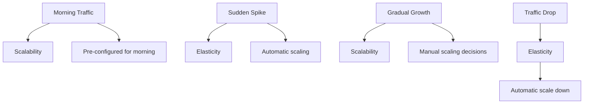

**Best Practices:**

- Use scalability for predictable growth patterns
- Use elasticity for variable and unpredictable workloads
- Combine both approaches for optimal resource management
- Monitor usage patterns to determine the right strategy

**Key Points to Mention:**

- Clear distinction between the two concepts
- When to use each approach
- Cost implications
- Real-world examples and use cases

### Question 3: What is the shared responsibility model in cloud computing?

**Sample Answer:**
The shared responsibility model is a framework that defines which security aspects are managed by the cloud service provider and which are managed by the customer. This model helps clarify security responsibilities and ensures both parties take appropriate measures to protect the cloud environment.

**Provider Responsibilities (Security OF the cloud):**

**Physical Security:**

- Data center physical access controls
- Environmental controls (power, cooling, fire suppression)
- Network infrastructure security
- Server hardware security
- Storage device security

**Infrastructure Security:**

- Hypervisor security
- Network infrastructure protection
- DDoS protection
- Infrastructure monitoring
- Compliance certifications (SOC, ISO, PCI DSS)

**Customer Responsibilities (Security IN the cloud):**

**Application Security:**

- Application code security
- Application-level access controls
- Input validation and sanitization
- Authentication and authorization logic
- Secure API development

**Data Security:**

- Data classification and handling
- Data encryption (at rest and in transit)
- Data loss prevention
- Backup and recovery procedures
- Data retention policies

**Operating System Security:**

- OS configuration and hardening
- Security patches and updates
- Access controls and permissions
- Monitoring and logging
- Antivirus and security software

**Identity and Access Management:**

- User account management
- Access controls and permissions
- Multi-factor authentication
- Password policies
- Privileged access management

**Network Security:**

- Firewall configuration
- Network segmentation
- VPN and private connectivity
- Security group configuration
- Network monitoring

**Visual Representation:**

| Security Domain        | Cloud Provider | Customer |
| ---------------------- | -------------- | -------- |
| Physical Security      | ✅             | ❌       |
| Network Infrastructure | ✅             | ❌       |
| Hypervisor             | ✅             | ❌       |
| Operating System       | ❌             | ✅       |
| Applications           | ❌             | ✅       |
| Data                   | ❌             | ✅       |
| User Access            | ❌             | ✅       |
| End-user Devices       | ❌             | ✅       |

**Service Model Impact:**

**IaaS (Infrastructure as a Service):**

- Provider: Physical security, networking, storage, compute virtualization
- Customer: OS, middleware, runtime, data, applications

**PaaS (Platform as a Service):**

- Provider: IaaS + OS, middleware, runtime, development tools
- Customer: Applications, data, user access management

**SaaS (Software as a Service):**

- Provider: IaaS + PaaS + Applications
- Customer: Data, user access management, endpoint devices

**Best Practices:**

- Understand your specific responsibilities
- Implement appropriate security controls
- Regular security assessments and audits
- Use managed services when possible
- Leverage provider security tools and services
- Document security responsibilities and controls

**Key Points to Mention:**

- Clear explanation of the model
- Specific examples of provider vs customer responsibilities
- How the model varies by service type
- Best practices for implementation

---

## Cloud Service Models and Deployment

### Question 4: Compare and contrast IaaS, PaaS, SaaS, and FaaS.

**Sample Answer:**
These are the four main cloud service models, each offering different levels of control and abstraction:

**IaaS (Infrastructure as a Service):**

**What it provides:**

- Virtual machines
- Storage (block and object)
- Networks and load balancers
- Basic operating systems

**Customer manages:**

- Operating systems and patches
- Applications and runtime
- Data and security
- User access management

**Examples:**

- AWS EC2, Azure Virtual Machines, Google Compute Engine
- Use cases: Web hosting, development/test environments, legacy application migration

**Characteristics:**

- Maximum control and flexibility
- Requires system administration skills
- Pay-per-use pricing
- Most similar to traditional hosting

---

**PaaS (Platform as a Service):**

**What it provides:**

- Development frameworks
- Database management systems
- Middleware and integration tools
- Business analytics and development tools

**Customer manages:**

- Applications and data
- User access management

**Examples:**

- AWS Elastic Beanstalk, Azure App Service, Google App Engine
- Use cases: Web application development, mobile app backends, API development

**Characteristics:**

- Accelerated development process
- Built-in scalability
- Vendor lock-in risk
- Focus on code, not infrastructure

---

**SaaS (Software as a Service):**

**What it provides:**

- Complete software applications
- User interface and experience
- Data storage and processing
- Business functionality

**Customer manages:**

- User accounts and data

**Examples:**

- Gmail, Office 365, Salesforce, Slack
- Use cases: Email, productivity tools, CRM, collaboration

**Characteristics:**

- No installation or maintenance required
- Subscription-based pricing
- Highest level of abstraction
- Easy to adopt and use

---

**FaaS (Function as a Service):**

**What it provides:**

- Serverless compute execution
- Event-driven execution
- Auto-scaling
- Pay-per-execution pricing

**Customer manages:**

- Application code
- Function logic
- Event triggers

**Examples:**

- AWS Lambda, Azure Functions, Google Cloud Functions
- Use cases: API endpoints, data processing, webhook handlers, scheduled tasks

**Characteristics:**

- No server management
- Automatic scaling
- Event-driven architecture
- Cost-effective for variable workloads

---

**Comparison Table:**

| Feature              | IaaS             | PaaS        | SaaS         | FaaS              |
| -------------------- | ---------------- | ----------- | ------------ | ----------------- |
| **Control Level**    | High             | Medium      | Low          | Low               |
| **Abstraction**      | Virtual Hardware | Platform    | Application  | Function          |
| **Management**       | OS + Runtime     | Runtime     | None         | Code              |
| **Scalability**      | Manual/Auto      | Automatic   | Automatic    | Automatic         |
| **Development Time** | Slowest          | Fast        | N/A          | Fast              |
| **Cost Model**       | Pay-per-use      | Pay-per-use | Subscription | Pay-per-execution |
| **Lock-in Risk**     | Low              | Medium      | High         | Medium            |
| **Typical Users**    | System Admins    | Developers  | End Users    | Developers        |

**When to Use Each:**

**Choose IaaS when:**

- You need maximum control over the environment
- You have existing applications to migrate
- You need specific OS or software configurations
- You have DevOps expertise

**Choose PaaS when:**

- You want to focus on application development
- You need built-in scalability
- You don't want to manage infrastructure
- You want rapid development and deployment

**Choose SaaS when:**

- You need ready-to-use applications
- You don't want to maintain software
- You prefer subscription pricing
- You need quick implementation

**Choose FaaS when:**

- You have event-driven workloads
- You want to pay only for execution time
- You need automatic scaling
- You want minimal operational overhead

**Migration Path Example:**

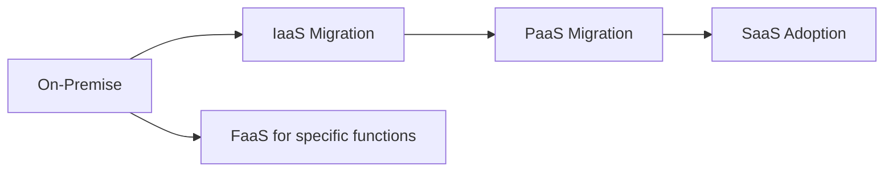

**Key Points to Mention:**

- Clear comparison of all four models
- Real-world examples for each
- When to choose each service model
- Trade-offs and considerations

### Question 5: Explain the different cloud deployment models.

**Sample Answer:**
Cloud deployment models define where cloud infrastructure is located, who manages it, and how it is accessed. There are four main deployment models:

**Public Cloud:**

**Definition:**
Cloud computing services offered over the public internet and available to anyone who wants to purchase or use them.

**Characteristics:**

- **Shared Infrastructure**: Resources shared among multiple customers
- **Internet-based**: Accessible via public internet
- **Pay-as-you-go**: Consumption-based pricing
- **Provider Managed**: Cloud provider manages all infrastructure

**Advantages:**

- Cost-effective with no capital investment
- Scalability and global reach
- Access to latest technology and services
- Reduced maintenance and management overhead

**Disadvantages:**

- Security and compliance concerns
- Potential for vendor lock-in
- Limited control over infrastructure
- Internet dependency

**Use Cases:**

- Startups and small businesses
- Web applications and websites
- Development and testing environments
- Disaster recovery and backup

**Examples:**

- AWS, Microsoft Azure, Google Cloud Platform
- Services: S3, EC2, Lambda, Blob Storage, Virtual Machines

---

**Private Cloud:**

**Definition:**
Cloud computing resources dedicated to a single organization and not shared with other organizations.

**Characteristics:**

- **Dedicated Infrastructure**: Resources for one organization only
- **Controlled Environment**: Organization has full control
- **Enhanced Security**: Higher security and compliance
- **Customization**: Can be customized to specific needs

**Deployment Options:**

- **On-Premises Private Cloud**: Located in organization's data center
- **Hosted Private Cloud**: Located in third-party data center but dedicated

**Advantages:**

- Enhanced security and compliance
- Customization to specific requirements
- Data control and sovereignty
- Performance consistency
- Integration with existing systems

**Disadvantages:**

- High capital and operational costs
- Requires cloud management expertise
- Limited scalability (constrained by physical resources)
- Longer implementation time

**Use Cases:**

- Regulated industries (healthcare, finance, government)
- Large enterprises with specific requirements
- Organizations with strict data privacy requirements
- Companies needing integration with legacy systems

**Technologies:**

- VMware vSphere, Microsoft Azure Stack
- OpenStack, Nutanix, Red Hat OpenShift

---

**Hybrid Cloud:**

**Definition:**
A computing environment that combines on-premises infrastructure, private cloud services, and public cloud services with orchestration between the platforms.

**Characteristics:**

- **Multiple Environments**: Combines private and public clouds
- **Orchestration**: Manages workloads across environments
- **Flexibility**: Move workloads between environments
- **Unified Management**: Single pane of glass for management

**Common Strategies:**

**1. Cloud Bursting:**

- Run normal workloads in private cloud
- Burst to public cloud during peak demand
- Return to private cloud when demand decreases

**2. Data Synchronization:**

- Keep data synchronized between environments
- Use replication for disaster recovery
- Ensure compliance with data residency requirements

**3. Workload Migration:**

- Gradually migrate workloads to public cloud
- Keep sensitive workloads in private cloud
- Use hybrid for phased migration

**Advantages:**

- Flexibility in workload placement
- Cost optimization by using most appropriate environment
- Risk mitigation and vendor independence
- Gradual migration to cloud
- Compliance with regulations

**Disadvantages:**

- Complex to manage and monitor
- Integration challenges between environments
- Potential network latency
- Multiple skill sets required
- Tool proliferation

**Use Cases:**

- Disaster recovery solutions
- Development/testing in public cloud, production in private
- Burst computing for peak loads
- Legacy application modernization
- Data analytics requiring cloud compute power

---

**Multi-Cloud:**

**Definition:**
The use of multiple cloud computing services in a single architecture to reduce reliance on any single vendor, increase flexibility, and mitigate risk.

**Characteristics:**

- **Multiple Providers**: Services from different cloud providers
- **Vendor Independence**: Reduce dependency on single provider
- **Best-of-Breed**: Use best services from each provider
- **Risk Distribution**: Distribute risk across providers

**Strategies:**

**1. Service Selection:**

- Use AWS for compute and storage
- Use Google Cloud for AI/ML services
- Use Azure for Microsoft integration
- Use specialized providers for specific services

**2. Geographic Distribution:**

- Deploy in multiple regions for redundancy
- Meet data residency requirements
- Optimize for performance and latency

**3. Workload Distribution:**

- Different workloads on different providers
- Migrate based on cost and performance
- Use provider strengths for specific tasks

**Advantages:**

- Vendor independence and flexibility
- Best-of-breed services selection
- Risk mitigation across providers
- Cost optimization opportunities
- Access to latest innovations

**Disadvantages:**

- Highly complex to manage
- Requires expertise in multiple platforms
- Integration challenges between services
- Data consistency and synchronization issues
- Potentially higher overall costs

**Use Cases:**

- Large enterprises with diverse needs
- Organizations operating in multiple regions
- Companies with specific compliance requirements
- Disaster recovery across providers
- Innovation and access to cutting-edge technologies

---

**Comparison Table:**

| Aspect                      | Public Cloud             | Private Cloud                  | Hybrid Cloud      | Multi-Cloud              |
| --------------------------- | ------------------------ | ------------------------------ | ----------------- | ------------------------ |
| **Infrastructure Location** | Provider's data center   | Organization's or hosted       | Both              | Multiple providers       |
| **Management**              | Provider                 | Organization                   | Shared            | Multiple organizations   |
| **Cost Model**              | OPEX (Operating Expense) | CAPEX (Capital Expense) + OPEX | Mixed             | Mixed                    |
| **Scalability**             | Excellent                | Limited by physical capacity   | Excellent         | Excellent                |
| **Security Control**        | Shared                   | Full control                   | Shared/Full       | Shared/Full              |
| **Complexity**              | Low                      | Medium                         | High              | Very High                |
| **Vendor Lock-in**          | High                     | Low                            | Medium            | Low                      |
| **Best For**                | Cost-effective scaling   | Compliance/control             | Gradual migration | Flexibility/optimization |

**Decision Matrix:**

**Choose Public Cloud when:**

- You need cost-effective scaling
- You don't have strict compliance requirements
- You want to focus on business value
- You have variable workloads

**Choose Private Cloud when:**

- You have strict security and compliance requirements
- You need maximum control over infrastructure
- You have existing data center investments
- You have specific customization needs

**Choose Hybrid Cloud when:**

- You want to gradually migrate to cloud
- You have some workloads that must remain on-premises
- You need disaster recovery solutions
- You have variable performance requirements

**Choose Multi-Cloud when:**

- You want to avoid vendor lock-in
- You need best-of-breed services
- You operate in multiple regions
- You want maximum flexibility and resilience

**Key Points to Mention:**

- Clear definition of each deployment model
- Advantages and disadvantages of each
- Real-world use cases and examples
- Decision criteria for choosing the right model
- How models can be combined

---

## Cloud Provider Services

### Question 6: Compare the major cloud providers (AWS, Azure, GCP) and their strengths.

**Sample Answer:**
Each major cloud provider has unique strengths and characteristics that make them suitable for different use cases and organizational needs.

**Amazon Web Services (AWS):**

**Market Position:**

- First-mover advantage with largest market share
- Most comprehensive and mature service portfolio
- Extensive global infrastructure (30+ regions, 96+ availability zones)

**Strengths:**

1. **Service Breadth**: Over 200 fully featured services
2. **Market Leadership**: Largest ecosystem and community
3. **Documentation**: Excellent documentation and tutorials
4. **Innovation**: First to market with many new services
5. **Maturity**: Most battle-tested and proven in production
6. **Partner Ecosystem**: Largest third-party integration ecosystem

**Core Services:**

- **Compute**: EC2, Lambda, ECS, EKS, Fargate
- **Storage**: S3, EBS, EFS, FSx
- **Database**: RDS, DynamoDB, Aurora, Redshift
- **Networking**: VPC, CloudFront, Route 53, Direct Connect
- **AI/ML**: SageMaker, Rekognition, Comprehend

**Best For:**

- Startups and rapid prototyping
- Machine learning and AI workloads
- Web applications and APIs
- DevOps and CI/CD pipelines
- Organizations wanting the most services

**Pricing:**

- On-demand, Reserved Instances, Spot Instances
- Free tier for new users
- Complex but flexible pricing

---

**Microsoft Azure:**

**Market Position:**

- Second-largest cloud provider
- Strong enterprise focus and Microsoft integration
- Excellent hybrid cloud capabilities

**Strengths:**

1. **Microsoft Integration**: Seamless integration with Microsoft products
2. **Enterprise Features**: Strong enterprise-grade capabilities
3. **Hybrid Cloud**: Best-in-class hybrid cloud solutions
4. **Active Directory**: Enterprise identity and access management
5. **Compliance**: Extensive compliance certifications
6. **Government Cloud**: Dedicated government cloud services

**Core Services:**

- **Compute**: Virtual Machines, App Service, Functions, AKS
- **Storage**: Blob Storage, File Storage, Disk Storage
- **Database**: SQL Database, Cosmos DB, MySQL Database
- **Networking**: Virtual Network, Load Balancer, Application Gateway
- **AI/ML**: Cognitive Services, Machine Learning, Bot Service

**Best For:**

- Organizations using Microsoft stack
- Enterprise applications requiring hybrid cloud
- Companies with existing Microsoft investments
- Government and regulated industries
- DevOps with Visual Studio integration

**Pricing:**

- Pay-as-you-go, Reserved VM Instances, Spot VMs
- Azure Hybrid Benefit for existing licenses
- Enterprise agreements available

---

**Google Cloud Platform (GCP):**

**Market Position:**

- Third-largest but fastest-growing cloud provider
- Strong in data analytics and machine learning
- Technical innovation and cutting-edge technology

**Strengths:**

1. **Data Analytics**: Industry-leading BigQuery and analytics
2. **Machine Learning**: Advanced AI/ML services and tools
3. **Networking**: Superior global network and edge computing
4. **Open Source**: Strong open source community support
5. **Innovation**: Cutting-edge technology adoption
6. **Pricing**: Competitive pricing with sustained use discounts

**Core Services:**

- **Compute**: Compute Engine, App Engine, Cloud Functions, GKE
- **Storage**: Cloud Storage, Persistent Disk, Filestore
- **Database**: Cloud SQL, Firestore, Bigtable, Spanner
- **Networking**: VPC, Cloud CDN, Cloud DNS, Interconnect
- **AI/ML**: Vertex AI, AutoML, Document AI, Vision API

**Best For:**

- Data analytics and big data processing
- Machine learning and AI development
- Organizations prioritizing data and analytics
- Developers and data scientists
- High-performance computing workloads

**Pricing:**

- Sustained use discounts (automatic)
- Committed use discounts for predictable workloads
- Competitive pricing model

---

**Comparative Analysis:**

| Category                 | AWS          | Azure     | GCP       |
| ------------------------ | ------------ | --------- | --------- |
| **Market Share**         | 32%          | 21%       | 10%       |
| **Service Count**        | 200+         | 100+      | 50+       |
| **Global Regions**       | 30+          | 60+       | 35+       |
| **Pricing Model**        | Most complex | Moderate  | Simple    |
| **Innovation Speed**     | Fast         | Moderate  | Very Fast |
| **Enterprise Focus**     | Good         | Excellent | Good      |
| **Developer Experience** | Good         | Excellent | Excellent |
| **Documentation**        | Excellent    | Good      | Good      |
| **Partner Ecosystem**    | Largest      | Large     | Growing   |

**Provider Selection Criteria:**

**Choose AWS if:**

- You need the most services and options
- You're building machine learning applications
- You want proven, battle-tested services
- You have a startup or are moving fast

**Choose Azure if:**

- You're using Microsoft products
- You need strong enterprise features
- You have hybrid cloud requirements
- You're in a regulated industry

**Choose GCP if:**

- You prioritize data analytics
- You're doing machine learning and AI
- You want simpler, more intuitive services
- You have data-heavy workloads

**Multi-Cloud Strategy:**
Many organizations use multiple cloud providers:

- **AWS for production workloads**
- **Azure for Microsoft integration**
- **GCP for analytics and ML**

**Migration Considerations:**

- **Vendor Lock-in**: Consider portability requirements
- **Skill Requirements**: Team expertise and training needs
- **Integration**: Existing systems and tools
- **Compliance**: Regulatory and data residency requirements
- **Cost Analysis**: Total cost of ownership comparison

**Future Considerations:**

- **Edge Computing**: All providers expanding edge capabilities
- **Serverless**: Growing focus on serverless architectures
- **AI/ML**: Increasing focus on artificial intelligence services
- **Sustainability**: Green cloud initiatives and carbon neutrality
- **Industry Clouds**: Vertical-specific cloud solutions

**Key Points to Mention:**

- Individual strengths of each provider
- How to evaluate providers for specific needs
- Real-world selection criteria
- Multi-cloud strategies
- Future trends in cloud computing

### Question 7: What are the core compute services across different cloud providers?

**Sample Answer:**
Compute services are fundamental to cloud computing, providing the processing power needed to run applications. Each cloud provider offers various compute services with different characteristics and use cases.

**Virtual Machines (VMs):**

**AWS EC2 (Elastic Compute Cloud):**

```yaml
Service Type: IaaS
Purpose: Virtual servers in the cloud
Key Features:
  - Wide range of instance types
  - Auto Scaling Groups
  - Load Balancers
  - Security Groups
  - Key Pair Authentication
Instance Types:
  - General Purpose: t3, m5, m6
  - Compute Optimized: c5, c6
  - Memory Optimized: r5, x1
  - Storage Optimized: i3, d2
  - GPU Instances: p3, p4
Use Cases:
  - Web hosting
  - Application servers
  - Development/test environments
  - Legacy application migration
```

**Azure Virtual Machines:**

```yaml
Service Type: IaaS
Purpose: Virtual machines in Microsoft cloud
Key Features:
  - Integration with Microsoft ecosystem
  - Azure Hybrid Benefit
  - Availability Sets and Zones
  - Azure Backup
  - Managed Disks
VM Series:
  - General Purpose: B, Dsv3, Dv3
  - Compute Optimized: Fsv2
  - Memory Optimized: Esv3, M
  - Storage Optimized: Lsv2
  - GPU: NC, NV
Use Cases:
  - Windows-based applications
  - SQL Server hosting
  - Development environments
  - Legacy Windows applications
```

**GCP Compute Engine:**

```yaml
Service Type: IaaS
Purpose: Virtual machines in Google cloud
Key Features:
  - Custom machine types
  - Sole-tenant nodes
  - Preemptible instances
  - Live migration
  - Automatic restarts
Machine Types:
  - Standard: n1, n2
  - High-memory: n1-highmem, n2-highmem
  - High-CPU: n1-highcpu, n2-highcpu
  - Memory-optimized: n1-ultramem
  - Compute-optimized: c2
Use Cases:
  - High-performance computing
  - Web applications
  - Data processing
  - Machine learning workloads
```

**Serverless Computing:**

**AWS Lambda:**

```yaml
Service Type: FaaS (Function as a Service)
Purpose: Run code without servers
Key Features:
  - Event-driven execution
  - Automatic scaling
  - Pay-per-execution pricing
  - Multiple runtime support
  - Integration with AWS services
Supported Runtimes:
  - Node.js, Python, Java, Go, C#, Ruby, Custom
Execution Environment:
  - Memory: 128MB - 10GB
  - Timeout: 15 minutes maximum
  - Storage: 512MB /tmp directory
Use Cases:
  - API endpoints
  - Data processing
  - File processing
  - Scheduled tasks
  - Event processing
```

**Azure Functions:**

```yaml
Service Type: FaaS
Purpose: Event-driven serverless compute
Key Features:
  - Multiple triggers and bindings
  - Durable Functions for stateful workflows
  - Integration with Azure services
  - Consumption and Premium plans
Triggers:
  - HTTP triggers
  - Timer triggers
  - Queue triggers
  - Blob triggers
  - Event Hub triggers
Runtime Support:
  - .NET, Node.js, Python, Java, PowerShell
Use Cases:
  - Webhook processing
  - File processing
  - Data transformation
  - Scheduled tasks
  - Event-driven architectures
```

**GCP Cloud Functions:**

```yaml
Service Type: FaaS
Purpose: Serverless functions in Google cloud
Key Features:
  - Event-driven execution
  - Multiple triggers
  - Automatic scaling
  - Integration with GCP services
  - Simple pricing
Triggers:
  - HTTP triggers
  - Cloud Storage triggers
  - Pub/Sub triggers
  - Firestore triggers
  - Cloud Scheduler triggers
Supported Languages:
  - Node.js, Python, Go, Java, .NET, Ruby, PHP
Execution Environment:
  - Memory: 128MB - 8GB
  - Timeout: 9 minutes maximum
  - Storage: 512MB /tmp directory
Use Cases:
  - API endpoints
  - Data processing
  - Image processing
  - Event processing
  - Scheduled tasks
```

**Container Services:**

**AWS ECS (Elastic Container Service):**

```yaml
Service Type: Container orchestration
Purpose: Run and manage Docker containers
Deployment Options:
  - EC2 Launch Type: Manage EC2 instances
  - Fargate Launch Type: Serverless containers
Key Features:
  - Service Discovery
  - Load Balancing
  - Auto Scaling
  - Task Definitions
  - Blue/Green Deployments
Use Cases:
  - Microservices architectures
  - Batch processing
  - Web applications
  - Background workers
```

**Azure Container Instances:**

```yaml
Service Type: Container hosting
Purpose: Run containers without managing VMs
Key Features:
  - Simple deployment
  - No cluster management
  - Persistent storage
  - Virtual network integration
  - Container groups
Use Cases:
  - Microservices
  - Batch jobs
  - Dev/test environments
  - Simple web applications
```

**GCP Cloud Run:**

```yaml
Service Type: Serverless containers
Purpose: Run stateless containers on a fully managed platform
Key Features:
  - No infrastructure management
  - Automatic scaling
  - Pay-per-request
  - Custom runtimes
  - Source-to-URL deployment
Use Cases:
  - Web APIs
  - Microservices
  - Batch jobs
  - Event processing
```

**Managed Kubernetes:**

**AWS EKS (Elastic Kubernetes Service):**

```yaml
Service Type: Managed Kubernetes
Purpose: Kubernetes container orchestration
Key Features:
  - Integration with AWS services
  - Fargate for serverless Kubernetes
  - Multiple deployment options
  - Built-in security features
  - Cost optimization tools
Use Cases:
  - Complex microservices
  - CI/CD pipelines
  - Stateful applications
  - Multi-tenant applications
```

**Azure Kubernetes Service (AKS):**

```yaml
Service Type: Managed Kubernetes
Purpose: Kubernetes service on Azure
Key Features:
  - Azure integration
  - Dev Spaces for development
  - Virtual nodes for serverless
  - Security center integration
  - Azure DevOps integration
Use Cases:
  - Enterprise applications
  - DevOps workflows
  - Multi-cloud deployments
  - Hybrid cloud scenarios
```

**Google Kubernetes Engine (GKE):**

```yaml
Service Type: Managed Kubernetes
Purpose: Production-ready Kubernetes
Key Features:
  - Autopilot for serverless Kubernetes
  - Multi-zone clusters
  - Built-in logging and monitoring
  - Automatic upgrades
  - Cloud-native development
Use Cases:
  - Scalable web applications
  - Machine learning pipelines
  - Data processing workflows
  - Microservices architectures
```

**Comparison Table:**

| Service Type             | AWS               | Azure               | GCP             | Best For                             |
| ------------------------ | ----------------- | ------------------- | --------------- | ------------------------------------ |
| **Virtual Machines**     | EC2               | Virtual Machines    | Compute Engine  | Legacy apps, maximum control         |
| **Serverless Functions** | Lambda            | Functions           | Cloud Functions | Event-driven, cost optimization      |
| **Containers (Simple)**  | ECS/Fargate       | Container Instances | Cloud Run       | Simple container deployment          |
| **Kubernetes**           | EKS               | AKS                 | GKE             | Complex microservices, orchestration |
| **PaaS**                 | Elastic Beanstalk | App Service         | App Engine      | Rapid development, focus on code     |

**Selection Criteria:**

**Choose Virtual Machines when:**

- You need maximum control over the environment
- You have legacy applications
- You need specific OS or software configurations
- You have complex networking requirements

**Choose Serverless when:**

- You have event-driven workloads
- You want to minimize operational overhead
- You have variable traffic patterns
- You want cost optimization

**Choose Containers when:**

- You want application portability
- You have microservices architectures
- You need consistent deployment environments
- You want efficient resource utilization

**Choose Kubernetes when:**

- You have complex container orchestration needs
- You need advanced networking and storage
- You have stateful applications
- You need enterprise-grade features

**Key Points to Mention:**

- Core compute services across providers
- When to choose each service type
- Strengths and limitations of each
- Real-world use cases
- Migration considerations

---

## Cloud Architecture and Design Patterns

### Question 8: Explain common cloud architecture patterns and their use cases.

**Sample Answer:**
Cloud architecture patterns provide proven solutions to common design problems in cloud-based systems. Understanding these patterns is crucial for building scalable, reliable, and maintainable applications.

**1. Microservices Architecture:**

**Definition:**
An architectural style that structures an application as a collection of loosely coupled, independently deployable services.

**Characteristics:**

- **Loose Coupling**: Services are independent and can be developed/deployed separately
- **Business Capabilities**: Each service represents a specific business function
- **Data Autonomy**: Each service manages its own database
- **Technology Diversity**: Different services can use different technologies
- **Team Autonomy**: Different teams can own different services

**Benefits:**

- Independent scaling of services
- Technology flexibility
- Faster development and deployment
- Better fault isolation
- Easier to understand and maintain

**Challenges:**

- Network latency between services
- Distributed transaction complexity
- Service discovery and communication
- Data consistency across services
- Increased operational complexity

**Example Implementation:**

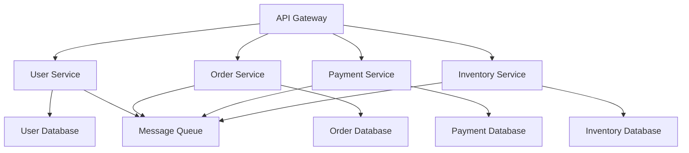

**Use Cases:**

- Large, complex applications with multiple teams
- Applications with varying scalability requirements
- Organizations adopting DevOps practices
- Systems requiring technology diversity

---

**2. Event-Driven Architecture:**

**Definition:**
An architectural pattern where system components communicate by producing and consuming events.

**Characteristics:**

- **Asynchronous Communication**: Services communicate through events
- **Loose Coupling**: Producers and consumers are independent
- **Scalability**: Each component can scale independently
- **Resilience**: System continues operating even if some components fail
- **Real-time Processing**: Events are processed in real-time

**Components:**

- **Event Producers**: Generate events
- **Event Consumers**: Process events
- **Event Bus/Message Broker**: Routes events
- **Event Store**: Stores event history

**Example Implementation:**

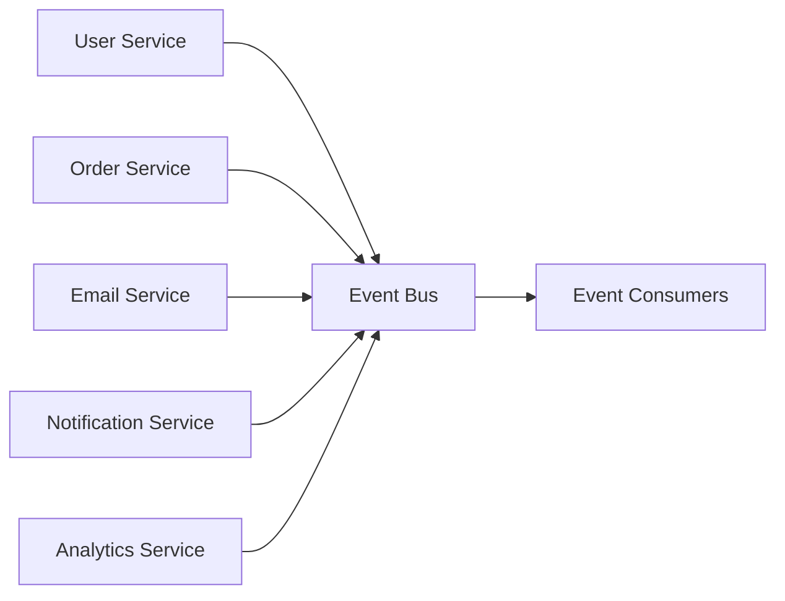

**Use Cases:**

- Real-time data processing
- System integration
- Audit and logging systems
- Event sourcing and CQRS
- IoT applications

---

**3. Serverless Architecture:**

**Definition:**
An architectural pattern where the cloud provider manages the infrastructure, and applications are broken down into small, stateless functions.

**Characteristics:**

- **No Server Management**: Provider handles all infrastructure
- **Event-driven**: Functions are triggered by events
- **Automatic Scaling**: Scaling happens automatically
- **Pay-per-execution**: Only pay for compute time used
- **Stateless Functions**: Each function execution is independent

**Benefits:**

- Reduced operational overhead
- Automatic scaling
- Cost optimization for variable workloads
- Faster time to market
- Focus on business logic

**Challenges:**

- Cold start latency
- Execution time limits
- Vendor lock-in
- Debugging complexity
- State management

**Example Implementation:**

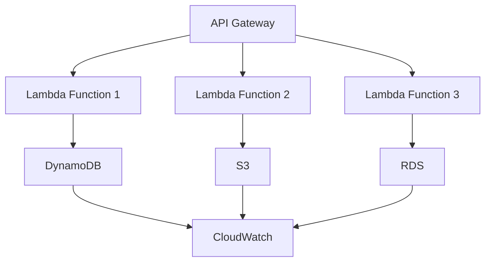

**Use Cases:**

- API backends
- Data processing pipelines
- Webhook handlers
- Scheduled tasks
- IoT data processing

---

**4. CQRS (Command Query Responsibility Segregation):**

**Definition:**
An architectural pattern that separates read and write operations for a data store.

**Characteristics:**

- **Command Side**: Handles commands (writes) and updates the write database
- **Query Side**: Handles queries (reads) from the read database
- **Event Synchronization**: Events keep read and write databases in sync
- **Optimized Data Models**: Different data models for reading vs writing
- **Scalability**: Read and write operations can scale independently

**Components:**

- **Command Side**: Handles business logic and commands
- **Event Store**: Stores all events
- **Read Model Updater**: Updates read database based on events
- **Query Side**: Handles queries and returns data

**Example Implementation:**

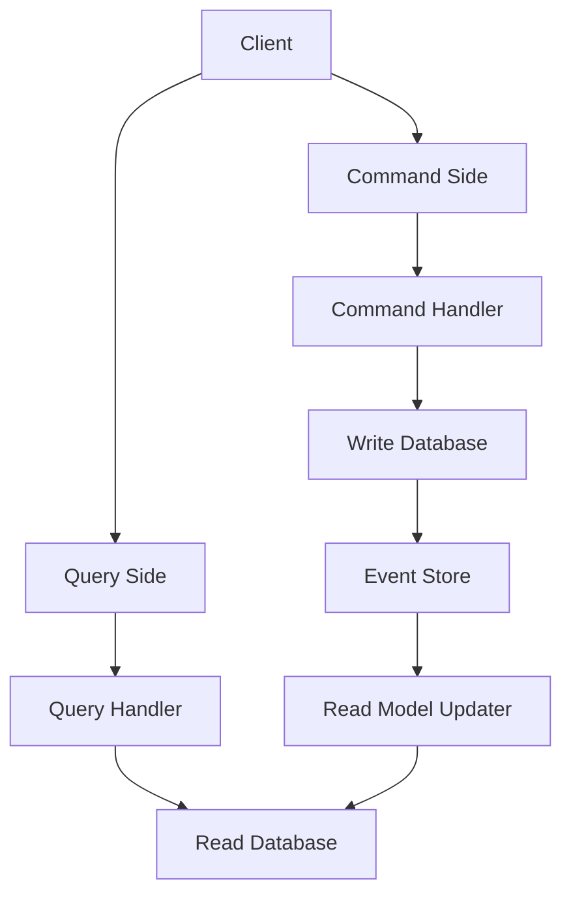

**Benefits:**

- Optimized read and write performance
- Better scalability
- Flexibility in data models
- Better separation of concerns
- Event sourcing capability

**Use Cases:**

- High-read, high-write applications
- Applications with complex business logic
- Systems requiring real-time analytics
- Event sourcing implementations

---

**5. Lambda Architecture:**

**Definition:**
A data processing architecture that combines batch and stream processing to provide comprehensive and accurate views of data.

**Characteristics:**

- **Batch Layer**: Processes complete historical data
- **Speed Layer**: Processes real-time streaming data
- **Serving Layer**: Merges results from batch and speed layers
- **Fault Tolerance**: Robust handling of failures
- **Scalability**: Can handle large-scale data processing

**Components:**

- **Batch Layer**: Batch processing engine (Hadoop, Spark)
- **Speed Layer**: Stream processing engine (Storm, Spark Streaming)
- **Serving Layer**: Query engine (Cassandra, HBase)
- **Master Dataset**: Immutable, raw data storage

**Use Cases:**

- Big data analytics
- Real-time data processing
- Machine learning pipelines
- IoT data analysis

---

**6. Strangler Fig Pattern:**

**Definition:**
A migration pattern that gradually replaces functionality with new systems, reducing risk and enabling incremental migration.

**Characteristics:**

- **Incremental Migration**: Replace functionality piece by piece
- **Parallel Operation**: Old and new systems operate simultaneously
- **Risk Mitigation**: Reduces risk of big-bang migration
- **User Experience**: Minimal disruption to users
- **Validation**: Each migration step can be validated

**Process:**

1. Route traffic to both old and new systems
2. Gradually shift functionality to new system
3. Remove old system components after validation
4. Continue until complete migration

**Use Cases:**

- Modernizing legacy systems
- Migrating to cloud
- Technology stack upgrades
- Domain-driven design implementation

---

**7. Circuit Breaker Pattern:**

**Definition:**
A design pattern that prevents an application from repeatedly trying to execute an operation that's likely to fail.

**Characteristics:**

- **Failure Detection**: Monitors service calls for failures
- **Circuit States**: Closed (normal), Open (failing), Half-Open (testing)
- **Automatic Recovery**: Attempts to close circuit after timeout
- **Fallback Mechanisms**: Provides alternative responses
- **Failure Prevention**: Stops cascading failures

**States:**

- **Closed**: Normal operation, calls pass through
- **Open**: Service calls are blocked, fallback is used
- **Half-Open**: Limited calls allowed to test recovery

**Benefits:**

- Prevents cascading failures
- Improves system resilience
- Provides fallback options
- Reduces response times for failing services

**Use Cases:**

- Microservices communication
- External service integration
- Database connection management
- API gateway implementations

---

**Pattern Selection Guide:**

| Pattern             | Best For             | Complexity | Scalability | Use When                              |
| ------------------- | -------------------- | ---------- | ----------- | ------------------------------------- |
| **Microservices**   | Complex applications | High       | High        | Multiple teams, different tech stacks |
| **Event-Driven**    | Real-time processing | Medium     | High        | Asynchronous communication needed     |
| **Serverless**      | Variable workloads   | Low        | Automatic   | Pay-per-use, minimal ops              |
| **CQRS**            | High read/write apps | High       | High        | Optimized read/write needed           |
| **Lambda**          | Big data processing  | High       | High        | Batch and stream processing           |
| **Strangler Fig**   | Legacy modernization | Medium     | Medium      | Incremental migration needed          |
| **Circuit Breaker** | Service resilience   | Low        | Medium      | Preventing cascading failures         |

**Key Points to Mention:**

- Common cloud architecture patterns
- When to use each pattern
- Benefits and challenges of each
- Real-world implementation examples
- Pattern selection criteria

### Question 9: What is the difference between synchronous and asynchronous communication in cloud architectures?

**Sample Answer:**
Synchronous and asynchronous communication are two fundamental communication patterns in cloud architectures, each with distinct characteristics and use cases.

**Synchronous Communication:**

**Definition:**
A communication pattern where the sender waits for a response before continuing execution.

**Characteristics:**

- **Blocking Operation**: Sender blocks until response is received
- **Real-time Response**: Immediate feedback expected
- **Point-to-point**: Direct communication between components
- **Tight Coupling**: Components are dependent on each other's availability
- **Request-Response Pattern**: Standard HTTP request/response model

**Advantages:**

- **Simplicity**: Easier to understand and debug
- **Real-time Feedback**: Immediate confirmation of success/failure
- **Transaction Integrity**: Easier to maintain transactional consistency
- **User Experience**: Direct response for user actions

**Disadvantages:**

- **Tight Coupling**: Components must be available simultaneously
- **Resource Consumption**: Resources are held during waiting
- **Scalability Challenges**: Difficult to scale when requests block
- **Failure Propagation**: Failures can cascade through the system

**Example Implementation:**

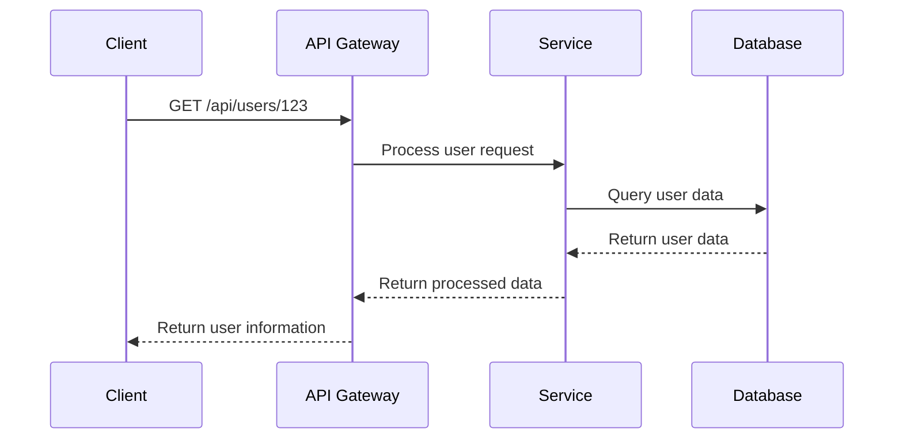

**Real-world Examples:**

- REST API calls
- Database queries
- User interface interactions
- Payment processing
- Real-time chat applications

**Use Cases:**

- User interface interactions
- Critical business operations
- Transaction processing
- Real-time data access
- System administration commands

---

**Asynchronous Communication:**

**Definition:**
A communication pattern where the sender doesn't wait for an immediate response and can continue with other operations.

**Characteristics:**

- **Non-blocking Operation**: Sender continues immediately after sending
- **Message-based**: Communication through messages or events
- **Loose Coupling**: Components are independent and can operate asynchronously
- **Queue-based**: Messages are queued and processed asynchronously
- **Event-driven**: Responses are triggered by events

**Advantages:**

- **Loose Coupling**: Components can operate independently
- **Better Scalability**: Components can scale independently
- **Fault Tolerance**: System continues operating even if some components fail
- **Resource Efficiency**: Better resource utilization
- **Resilience**: System is more resilient to failures

**Disadvantages:**

- **Complexity**: More complex to design and debug
- **Eventual Consistency**: Data consistency is eventual, not immediate
- **Debugging Challenges**: Harder to trace request flows
- **No Immediate Feedback**: Users don't get immediate confirmation

**Example Implementation:**

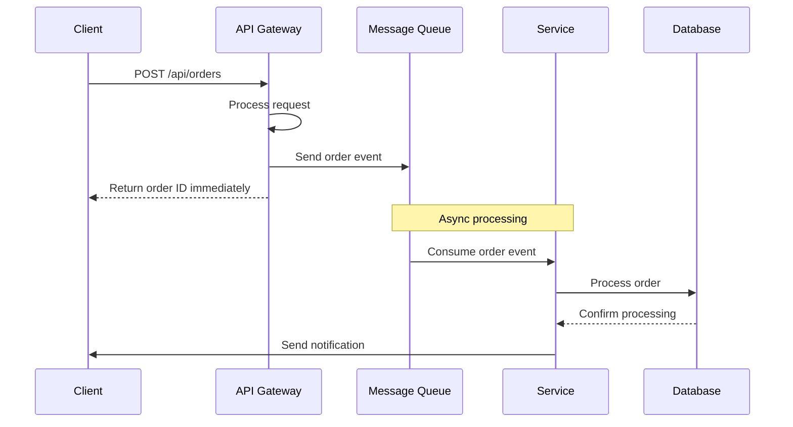

**Real-world Examples:**

- Email sending
- Background job processing
- Event streaming
- Webhook notifications
- File processing
- Analytics data processing

**Technologies:**

- Message queues (RabbitMQ, AWS SQS, Azure Service Bus)
- Event streaming (Apache Kafka, AWS Kinesis, Azure Event Hubs)
- Pub/Sub systems (Google Pub/Sub, AWS SNS)
- Workflow engines (AWS Step Functions, Azure Logic Apps)

**Use Cases:**

- Background processing
- Event-driven architectures
- High-throughput systems
- Integration between systems
- Long-running operations
- Real-time notifications

---

**Communication Pattern Comparison:**

| Aspect             | Synchronous | Asynchronous |
| ------------------ | ----------- | ------------ |
| **Response Time**  | Immediate   | Delayed      |
| **Coupling**       | Tight       | Loose        |
| **Scalability**    | Harder      | Easier       |
| **Complexity**     | Lower       | Higher       |
| **Reliability**    | Lower       | Higher       |
| **Resource Usage** | Higher      | Lower        |
| **Debugging**      | Easier      | Harder       |
| **Consistency**    | Strong      | Eventual     |

**Hybrid Approach:**

Many architectures use a combination of both patterns:

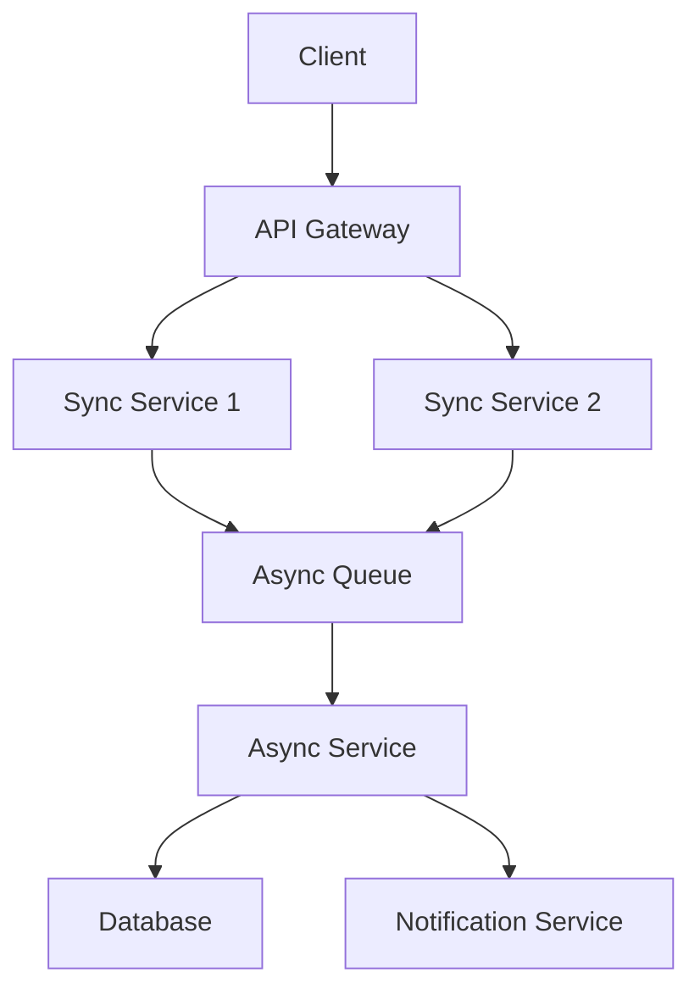

**Use Case Decision Tree:**

**Choose Synchronous when:**

- User needs immediate feedback
- You need transactional integrity
- Operations are short-lived
- You need strong consistency
- Debugging is critical

**Choose Asynchronous when:**

- Operations are long-running
- You need better scalability
- You want loose coupling
- You can tolerate eventual consistency
- High throughput is important

**Performance Considerations:**

**Synchronous Performance:**

- Network latency impacts response time
- Thread pools can become bottlenecks
- Database connection pool exhaustion
- Memory usage during blocking operations

**Asynchronous Performance:**

- Message queue throughput limits
- Consumer scaling requirements
- Event processing latency
- Storage requirements for queues

**Best Practices:**

**For Synchronous Communication:**

- Use connection pooling
- Implement timeouts
- Add circuit breakers
- Monitor response times
- Use caching where appropriate

**For Asynchronous Communication:**

- Design for idempotency
- Implement retry logic
- Handle duplicate messages
- Monitor queue depths
- Plan for message ordering

**Error Handling:**

**Synchronous Error Handling:**

```python
try:
    response = service_call()
    return process_response(response)
except ServiceUnavailableError:
    return fallback_response()
except TimeoutError:
    return retry_with_backoff()
except Exception as e:
    return error_response(str(e))
```

**Asynchronous Error Handling:**

```python
# In message consumer
try:
    process_message(message)
    ack_message(message)
except RetryableError:
    retry_message_with_backoff(message)
except PermanentError:
    dead_letter_queue(message)
except Exception as e:
    log_error(e)
    dead_letter_queue(message)
```

**Key Points to Mention:**

- Clear distinction between synchronous and asynchronous patterns
- Advantages and disadvantages of each
- Real-world examples and use cases
- When to choose each pattern
- Hybrid approaches and best practices

---

## Security and Compliance

### Question 10: Explain the shared responsibility model with specific examples.

**Sample Answer:**
The shared responsibility model is a security framework that clearly defines which security controls are the responsibility of the cloud service provider and which are the responsibility of the customer. This model is essential for understanding security obligations and implementing appropriate controls.

**Provider Responsibilities (Security OF the Cloud):**

**1. Physical Security:**

- **Data Centers**: Physical access controls, surveillance, security personnel
- **Environmental Controls**: Power systems, cooling, fire suppression
- **Network Infrastructure**: Network hardware, DDoS protection, routing
- **Hardware Security**: Server hardware, storage device protection
- **Compliance Certifications**: SOC 1, SOC 2, ISO 27001, PCI DSS

**2. Infrastructure Security:**

- **Hypervisor Security**: Virtualization layer protection
- **Network Segmentation**: VPC isolation, security groups
- **Global Infrastructure**: Edge location security, CDN protection
- **Service Availability**: Service level agreements, uptime guarantees
- **Patch Management**: Infrastructure software updates

**Customer Responsibilities (Security IN the Cloud):**

**1. Data Security:**

- **Data Classification**: Identify and classify sensitive data
- **Data Encryption**: Encrypt data at rest and in transit
- **Data Loss Prevention**: Implement DLP policies and controls
- **Backup and Recovery**: Data backup and disaster recovery procedures
- **Data Retention**: Implement data retention and deletion policies

**2. Application Security:**

- **Secure Coding**: Write secure code, input validation
- **Application Testing**: Security testing, vulnerability assessments
- **Third-party Dependencies**: Secure dependency management
- **API Security**: API authentication, authorization, rate limiting
- **Session Management**: Secure session handling

**3. Identity and Access Management:**

- **User Management**: User account lifecycle management
- **Access Controls**: Principle of least privilege implementation
- **Authentication**: Multi-factor authentication, strong passwords
- **Authorization**: Role-based access control, permission management
- **Privileged Access**: Management of administrative access

**4. Operating System Security:**

- **System Hardening**: OS configuration and security settings
- **Patch Management**: OS updates and security patches
- **Access Controls**: File system permissions, user accounts
- **Monitoring**: System monitoring and log analysis
- **Antivirus**: Endpoint protection and malware detection

**Service Model Impact on Responsibilities:**

**IaaS Responsibilities:**

| Security Domain         | Provider | Customer |
| ----------------------- | -------- | -------- |
| Physical Security       | ✅       | ❌       |
| Network Infrastructure  | ✅       | ❌       |
| Hypervisor              | ✅       | ❌       |
| **Operating System**    | ❌       | ✅       |
| **Runtime/Middleware**  | ❌       | ✅       |
| **Applications**        | ❌       | ✅       |
| **Data**                | ❌       | ✅       |
| **Identity Management** | ❌       | ✅       |

**PaaS Responsibilities:**

| Security Domain         | Provider | Customer |
| ----------------------- | -------- | -------- |
| Physical Security       | ✅       | ❌       |
| Network Infrastructure  | ✅       | ❌       |
| Hypervisor              | ✅       | ❌       |
| Operating System        | ✅       | ❌       |
| **Runtime Environment** | ✅       | ❌       |
| **Applications**        | ❌       | ✅       |
| **Data**                | ❌       | ✅       |
| **Identity Management** | ❌       | ✅       |

**SaaS Responsibilities:**

| Security Domain        | Provider | Customer |
| ---------------------- | -------- | -------- |
| Physical Security      | ✅       | ❌       |
| Network Infrastructure | ✅       | ❌       |
| Operating System       | ✅       | ❌       |
| Runtime Environment    | ✅       | ❌       |
| **Applications**       | ✅       | ❌       |
| **Data**               | ❌       | ✅       |
| **User Management**    | ❌       | ✅       |
| **Endpoint Security**  | ❌       | ✅       |

**Specific Examples:**

**1. Web Application Hosting:**

**IaaS (AWS EC2) Example:**

```yaml
Provider Responsibilities:
  - Physical data center security
  - EC2 hypervisor security
  - Network infrastructure
  - Storage encryption at hardware level

Customer Responsibilities:
  - Security Groups configuration
  - OS patching and hardening
  - Web application security
  - Database encryption
  - SSL/TLS certificate management
  - WAF configuration
  - User access management
```

**PaaS (AWS Elastic Beanstalk) Example:**

```yaml
Provider Responsibilities:
  - Platform security
  - Runtime environment security
  - Automatic patching
  - Managed load balancers

Customer Responsibilities:
  - Application code security
  - Database configuration
  - Environment variables security
  - Custom security groups
  - SSL certificate management
```

**2. Data Storage:**

**Customer Data Protection Example:**

```python
# Customer responsibility - data encryption
import boto3
import base64
from cryptography.fernet import Fernet

class DataEncryption:
    def __init__(self, kms_key_id):
        self.kms = boto3.client('kms')
        self.cipher = None
        self._initialize_cipher(kms_key_id)

    def _initialize_cipher(self, kms_key_id):
        # Generate data key
        response = self.kms.generate_data_key(
            KeyId=kms_key_id,
            KeySpec='AES_256'
        )

        # Initialize cipher with data key
        plaintext_key = response['Plaintext']
        encrypted_key = response['CiphertextBlob']

        self.cipher = Fernet(plaintext_key)
        self.encrypted_key = encrypted_key

    def encrypt_data(self, data):
        # Encrypt data
        encrypted_data = self.cipher.encrypt(data.encode())

        return {
            'encrypted_data': base64.b64encode(encrypted_data).decode(),
            'encrypted_key': base64.b64encode(self.encrypted_key).decode()
        }

    def decrypt_data(self, encrypted_package):
        # Decrypt data key using KMS
        plaintext_key = self.kms.decrypt(
            CiphertextBlob=base64.b64decode(encrypted_package['encrypted_key'])
        )['Plaintext']

        # Decrypt data
        cipher = Fernet(plaintext_key)
        decrypted_data = cipher.decrypt(
            base64.b64decode(encrypted_package['encrypted_data'])
        )

        return decrypted_data.decode()
```

**3. Identity and Access Management:**

**Customer IAM Responsibility Example:**

```yaml
# Customer responsibility - IAM configuration
IAM_Policy_Example:
  - Implement least privilege principle
  - Use IAM roles for applications
  - Enable MFA for privileged accounts
  - Regular access reviews
  - Use service-linked roles
  - Monitor API calls with CloudTrail
  - Implement conditional access
  - Use AWS Organizations for account management
```

**4. Network Security:**

**Shared Network Security Example:**

```yaml
Provider Responsibilities:
  - Global network infrastructure
  - DDoS protection
  - Network routing and switching
  - Internet connectivity

Customer Responsibilities:
  - VPC configuration
  - Security groups
  - Network ACLs
  - Private subnets
  - VPN/Direct Connect setup
  - WAF configuration
  - Traffic encryption
```

**Common Security Mistakes:**

**1. Assuming Provider Handles Everything:**

- **Mistake**: Not implementing application-level security
- **Consequence**: Vulnerable applications despite secure infrastructure
- **Solution**: Implement comprehensive security at all layers

**2. Misconfigured Access Controls:**

- **Mistake**: Overprivileged IAM policies
- **Consequence**: Security breaches through excessive permissions
- **Solution**: Implement principle of least privilege

**3. Inadequate Data Protection:**

- **Mistake**: Not encrypting sensitive data
- **Consequence**: Data breaches and compliance violations
- **Solution**: Encrypt data at rest and in transit

**4. Poor Monitoring:**

- **Mistake**: Not monitoring security events
- **Consequence**: Delayed incident detection and response
- **Solution**: Implement comprehensive logging and monitoring

**Best Practices:**

**1. Defense in Depth:**

- Implement security at multiple layers
- Don't rely on a single security control
- Monitor and validate security continuously

**2. Automation:**

- Use Infrastructure as Code for security configurations
- Automate compliance checking
- Implement automated incident response

**3. Regular Assessments:**

- Conduct security assessments regularly
- Review and update security policies
- Test incident response procedures

**4. Training and Awareness:**

- Train teams on security responsibilities
- Maintain security awareness programs
- Keep up with security best practices

**Key Points to Mention:**

- Clear explanation of shared responsibility
- Specific examples for different service models
- Real-world implementation examples
- Common mistakes and how to avoid them
- Best practices for security implementation

---

## Scalability and High Availability

### Question 11: How do you design for high availability in cloud environments?

**Sample Answer:**
High availability ensures that systems remain operational and accessible despite failures. Designing for high availability in cloud environments requires understanding failure modes and implementing appropriate redundancy and failover mechanisms.

**High Availability Principles:**

**1. Eliminate Single Points of Failure:**

- Redundant components at all levels
- No single component whose failure causes system downtime
- Distribution across multiple failure domains

**2. Design for Failure:**

- Assume components will fail
- Implement graceful degradation
- Design for recovery

**3. Implement Redundancy:**

- Multiple instances of critical components
- Geographic distribution
- Redundant data storage

**4. Ensure Automatic Failover:**

- Detection of failures
- Automatic switching to backup systems
- Minimal recovery time

**Availability Tiers:**

| Tier       | Availability % | Downtime per Year | Characteristics             |
| ---------- | -------------- | ----------------- | --------------------------- |
| **Tier 1** | 99.9%          | 8.77 hours        | Basic redundancy            |
| **Tier 2** | 99.95%         | 4.38 hours        | Redundant power and cooling |
| **Tier 3** | 99.98%         | 1.05 hours        | Redundant components        |
| **Tier 4** | 99.995%        | 26.3 minutes      | Fault-tolerant systems      |

**High Availability Architecture Components:**

**1. Multi-Zone Deployment:**

```yaml
Multi_Region_Architecture:
  Primary_Region:
    - Zone A: Primary compute and data
    - Zone B: Standby compute
    - Zone C: Standby compute

  Secondary_Region:
    - Zone A: Replicated data
    - Zone B: Standby compute
    - Zone C: Standby compute

  Components:
    - Load Balancers: Distribute traffic across zones
    - Database: Multi-AZ deployment with automatic failover
    - Storage: Cross-region replication
    - Compute: Auto-scaling across zones
```

**2. Load Balancing:**

```yaml
Load_Balancing_Configuration:
  Application_Load_Balancer:
    Type: Layer 7 (HTTP/HTTPS)
    Features:
      - Health checks
      - SSL termination
      - Session affinity
      - Content-based routing

  Network_Load_Balancer:
    Type: Layer 4 (TCP/UDP)
    Features:
      - High throughput
      - Ultra-low latency
      - Static IP addresses

  Cross_Zone_Load_Balancing:
    Enabled: true
    Distributes: Evenly across all availability zones
```

**3. Database High Availability:**

**RDS Multi-AZ Deployment:**

```yaml
RDS_Configuration:
  Multi_AZ: true
  Failover_Mechanism: Automatic
  Failover_Time: 1-2 minutes
  Read_Replicas:
    - Cross-zone replicas
    - Automated backups
    - Performance monitoring
```

**DynamoDB Global Tables:**

```yaml
DynamoDB_Global_Tables:
  Replication: Multi-region
  Consistency: Eventual consistency
  Conflict_Resolution: Last writer wins
  Use_Cases:
    - Global applications
    - Multi-region data access
    - Disaster recovery
```

**4. Auto-Scaling Configuration:**

```yaml
Auto_Scaling_Group:
  Min_Size: 2
  Max_Size: 20
  Desired_Capacity: 4

  Scaling_Policies:
    - CPU_Utilization:
        Target: 70%
        Scale_Up: Add 2 instances
        Scale_Down: Remove 1 instance

    - Request_Count:
        Target: 1000 requests per instance
        Cooldown_Period: 300 seconds

  Health_Checks:
    - ELB_Health_Check: Enabled
    - EC2_Health_Check: Enabled
    - Unhealthy_Threshold: 2
    - Healthy_Threshold: 10
```

**High Availability Patterns:**

**1. Active-Passive Pattern:**

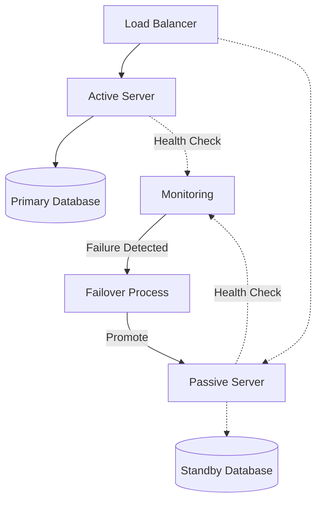

**2. Active-Active Pattern:**

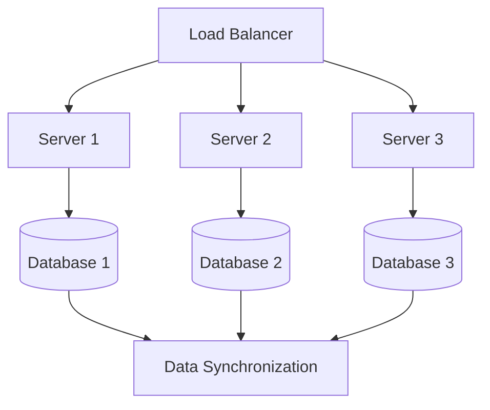

**3. Circuit Breaker Pattern:**

```python
import time
import random
from enum import Enum

class CircuitState(Enum):
    CLOSED = 1  # Normal operation
    OPEN = 2    # Failing, reject requests
    HALF_OPEN = 3  # Testing recovery

class CircuitBreaker:
    def __init__(self, failure_threshold=5, recovery_timeout=60):
        self.failure_threshold = failure_threshold
        self.recovery_timeout = recovery_timeout
        self.failure_count = 0
        self.last_failure_time = None
        self.state = CircuitState.CLOSED

    def call(self, func, *args, **kwargs):
        if self.state == CircuitState.OPEN:
            if time.time() - self.last_failure_time > self.recovery_timeout:
                self.state = CircuitState.HALF_OPEN
            else:
                raise Exception("Circuit breaker is OPEN - service unavailable")

        try:
            result = func(*args, **kwargs)
            if self.state == CircuitState.HALF_OPEN:
                self.state = CircuitState.CLOSED
                self.failure_count = 0
            return result
        except Exception as e:
            self.failure_count += 1
            self.last_failure_time = time.time()

            if self.failure_count >= self.failure_threshold:
                self.state = CircuitState.OPEN
            raise e
```

**4. Bulkhead Pattern:**

```python
import threading
from concurrent.futures import ThreadPoolExecutor

class BulkheadExecutor:
    def __init__(self, max_workers_dict):
        self.executors = {
            service: ThreadPoolExecutor(max_workers=max_workers)
            for service, max_workers in max_workers_dict.items()
        }
        self.locks = {service: threading.Lock() for service in max_workers_dict}

    def submit(self, service, func, *args, **kwargs):
        if service not in self.executors:
            raise ValueError(f"Service {service} not configured")

        with self.locks[service]:
            return self.executors[service].submit(func, *args, **kwargs)
```

**Database High Availability Strategies:**

**1. Read Replicas:**

```yaml
Read_Replica_Strategy:
  Primary_Database:
    - Multi-AZ deployment
    - Automated backups
    - Point-in-time recovery

  Read_Replicas:
    - Cross-zone placement
    - Load balancing reads
    - Automatic failover to primary

  Configuration:
    - Read replica lag monitoring
    - Connection pooling
    - Read/write splitting
```

**2. Database Clustering:**

```yaml
Database_Clustering:
  PostgreSQL_Cluster:
    Primary: Master node for writes
    Standby: Standby nodes for reads
    Synchronous_Replication: Required
    Failover: Automatic via Pacemaker/Corosync

  MySQL_Cluster:
    Data_Nodes: Distributed data storage
    API_Nodes: Application access layer
    Management_Nodes: Cluster management
    Automatic_Sharding: Built-in
```

**Monitoring and Alerting:**

**1. Health Check Implementation:**

```python
import requests
import boto3
from datetime import datetime, timedelta

class HealthChecker:
    def __init__(self, endpoints):
        self.endpoints = endpoints
        self.cloudwatch = boto3.client('cloudwatch')
        self.elb = boto3.client('elbv2')

    def check_service_health(self):
        results = []
        for endpoint in self.endpoints:
            try:
                start_time = datetime.now()
                response = requests.get(endpoint['url'], timeout=30)
                end_time = datetime.now()

                response_time = (end_time - start_time).total_seconds() * 1000
                status_code = response.status_code
                is_healthy = 200 <= status_code < 300

                # Send metrics to CloudWatch
                self.cloudwatch.put_metric_data(
                    Namespace='MyApp/Health',
                    MetricData=[
                        {
                            'MetricName': 'ResponseTime',
                            'Value': response_time,
                            'Unit': 'Milliseconds',
                            'Dimensions': [
                                {'Name': 'Endpoint', 'Value': endpoint['name']}
                            ]
                        },
                        {
                            'MetricName': 'StatusCode',
                            'Value': 1 if is_healthy else 0,
                            'Dimensions': [
                                {'Name': 'Endpoint', 'Value': endpoint['name']}
                            ]
                        }
                    ]
                )

                results.append({
                    'endpoint': endpoint['name'],
                    'status': 'healthy' if is_healthy else 'unhealthy',
                    'response_time_ms': response_time
                })

            except Exception as e:
                results.append({
                    'endpoint': endpoint['name'],
                    'status': 'error',
                    'error': str(e)
                })

        return results
```

**2. Automated Recovery:**

```python
import boto3
import json

class AutoRecovery:
    def __init__(self):
        self.ec2 = boto3.client('ec2')
        self.asg = boto3.client('autoscaling')
        self.elb = boto3.client('elbv2')

    def handle_instance_failure(self, instance_id, asg_name):
        # Terminate failed instance
        self.ec2.terminate_instances(InstanceIds=[instance_id])

        # Wait for ASG to create replacement
        print(f"Instance {instance_id} failed, waiting for replacement...")

        # Verify replacement instance is healthy
        self.wait_for_healthy_instance(asg_name)

    def handle_elb_failure(self, elb_name, target_group_arn):
        # Get unhealthy targets
        response = self.elb.describe_target_health(
            TargetGroupArn=target_group_arn
        )

        unhealthy_targets = [
            target for target in response['TargetHealthDescriptions']
            if target['TargetHealth']['State'] == 'unhealthy'
        ]

        for target in unhealthy_targets:
            target_id = target['Target']['Id']
            port = target['Target']['Port']

            # Remove from target group
            self.elb.deregister_targets(
                TargetGroupArn=target_group_arn,
                Targets=[{
                    'Id': target_id,
                    'Port': port
                }]
            )

    def wait_for_healthy_instance(self, asg_name, timeout=600):
        # Wait for new instance to become healthy
        start_time = datetime.now()

        while (datetime.now() - start_time).seconds < timeout:
            response = self.asg.describe_auto_scaling_groups(
                AutoScalingGroupNames=[asg_name]
            )

            instances = response['AutoScalingGroups'][0]['Instances']
            healthy_instances = [
                instance for instance in instances
                if instance['LifecycleState'] == 'InService'
            ]

            if len(healthy_instances) > 0:
                print("Replacement instance is healthy")
                return True

            time.sleep(30)

        raise Exception("Timeout waiting for healthy instance")
```

**Disaster Recovery Strategies:**

**1. Backup and Restore:**

- **RTO**: Hours to days
- **RPO**: Hours
- **Cost**: Lowest
- **Process**: Regular backups, restore when needed

**2. Pilot Light:**

- **RTO**: Minutes to hours
- **RPO**: Minutes
- **Cost**: Low to moderate
- **Process**: Keep critical services running, scale up during disaster

**3. Warm Standby:**

- **RTO**: Minutes
- **RPO**: Minutes
- **Cost**: Moderate
- **Process**: Keep scaled-down version running, scale up during disaster

**4. Multi-site:**

- **RTO**: Seconds
- **RPO**: Seconds
- **Cost**: High
- **Process**: Run full-scale application in multiple regions

**Key Points to Mention:**

- High availability principles and tiers
- Redundancy and failover strategies
- Monitoring and automated recovery
- Database high availability
- Disaster recovery options
- Real-world implementation examples

This completes the comprehensive cloud platforms interview questions section. The questions cover fundamental concepts, service comparisons, architecture patterns, security, scalability, and practical implementation scenarios that are commonly asked in cloud computing interviews.
