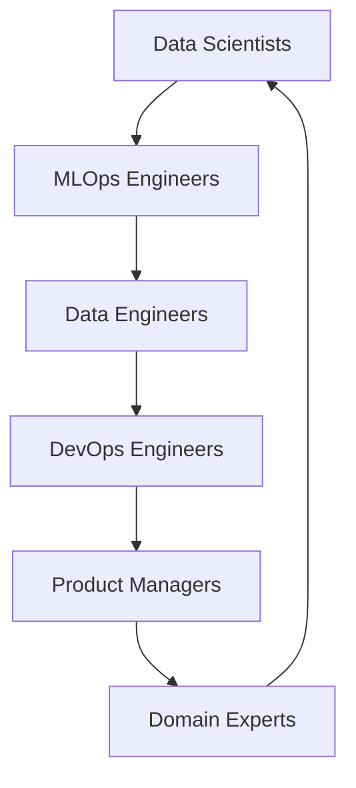

# MLOps Fundamentals: Theory and Core Principles

## Table of Contents

1. [Introduction to MLOps](#introduction-to-mlops)
2. [MLOps vs DevOps: Key Differences](#mlops-vs-devops-key-differences)
3. [Core MLOps Principles](#core-mlops-principles)
4. [MLOps Lifecycle and Components](#mlops-lifecycle-and-components)
5. [MLOps Architecture Patterns](#mlops-architecture-patterns)
6. [Data Management in MLOps](#data-management-in-mlops)
7. [Model Development and Training](#model-development-and-training)
8. [Model Deployment and Serving](#model-deployment-and-serving)
9. [Monitoring and Maintenance](#monitoring-and-maintenance)
10. [MLOps Maturity Models](#mlops-maturity-models)
11. [Challenges and Solutions](#challenges-and-solutions)
12. [Future of MLOps](#future-of-mlops)

## Introduction to MLOps

MLOps (Machine Learning Operations) is a set of practices that aims to deploy and maintain machine learning models in production reliably and efficiently. It combines Machine Learning, DevOps, and Data Engineering to create a comprehensive framework for managing the entire ML lifecycle.

### The Need for MLOps

Traditional software development faces unique challenges when dealing with machine learning systems:

#### 1. **Data Dependency**

- ML models are fundamentally different from traditional software because they depend on data
- Data quality, distribution, and availability directly impact model performance
- Data versioning and lineage tracking become critical

#### 2. **Model Complexity**

- Models involve multiple components: data preprocessing, feature engineering, model training, and inference
- Each component can fail independently, creating complex failure modes
- Models can degrade over time due to changing data distributions

#### 3. **Iterative Nature**

- ML development is inherently experimental and iterative
- Models require continuous retraining and improvement
- Version control becomes more complex with models, data, and code

#### 4. **Deployment Challenges**

- Models need to be deployed across diverse environments
- Inference latency and scalability requirements vary by use case
- Model interpretability and explainability are often required

### What MLOps Encompasses

MLOps is not just about deploying models—it's about creating a complete system for:

- **Data Pipeline Management**: Automated data ingestion, validation, and transformation
- **Model Development**: Standardized development workflows and experimentation
- **Model Deployment**: Automated deployment across various environments
- **Model Monitoring**: Continuous monitoring of model performance and data drift
- **Model Governance**: Managing model versions, approvals, and compliance
- **Infrastructure Management**: Scalable and reliable infrastructure for ML workloads

### MLOps Value Proposition

#### For Business

- **Faster Time-to-Market**: Reduced time from model development to production deployment
- **Improved Model Reliability**: Consistent model performance and reduced failure rates
- **Cost Optimization**: Efficient resource utilization and automated processes
- **Risk Mitigation**: Better governance and compliance with regulations

#### for ML Teams

- **Standardized Workflows**: Consistent processes for development, testing, and deployment
- **Reduced Manual Work**: Automation of repetitive tasks and processes
- **Better Collaboration**: Improved communication between data scientists, engineers, and operations
- **Enhanced Productivity**: Focus on model development rather than infrastructure management

## MLOps vs DevOps: Key Differences

While MLOps builds upon DevOps principles, it has unique characteristics due to the nature of machine learning.

### Similarities with DevOps

| Aspect            | DevOps                     | MLOps                                     |
| ----------------- | -------------------------- | ----------------------------------------- |
| **Goal**          | Faster software delivery   | Faster ML model deployment                |
| **Automation**    | CI/CD pipelines            | CI/CD for ML workflows                    |
| **Monitoring**    | Application performance    | Model performance and data drift          |
| **Collaboration** | Development and Operations | Data Science, Engineering, and Operations |

### Key Differences

#### 1. **Data as a First-Class Citizen**

**Traditional Software:**

```python
# Traditional application
def process_user_data(user_id):
    # Deterministic function
    user_data = database.get_user(user_id)
    processed_data = transform(user_data)
    return processed_data
```

**ML System:**

```python
# ML-based system
def predict_customer_churn(customer_id):
    # Non-deterministic due to data dependency
    customer_data = get_customer_features(customer_id)
    model = load_model('churn_model_v2.1')
    prediction = model.predict(customer_data)
    return prediction
```

#### 2. **Version Control Complexity**

**DevOps:**

- Code versions (Git)
- Infrastructure as Code (Terraform, CloudFormation)

**MLOps:**

- Code versions (Git)
- Data versions (DVC, Pachyderm)
- Model versions (MLflow, Weights & Biases)
- Feature versions (Feast, Tecton)
- Pipeline versions (Kubeflow, Airflow)

#### 3. **Testing and Validation**

**DevOps:**

```python
# Traditional testing
def test_user_registration():
    user = create_user("john@example.com", "password123")
    assert user.email == "john@example.com"
    assert user.is_active == True
```

**MLOps:**

```python
# ML testing includes data validation
def test_churn_model():
    # Test model performance
    assert model.accuracy > 0.85
    assert model.f1_score > 0.80

    # Test data drift
    new_data_stats = calculate_data_statistics(recent_data)
    historical_stats = load_historical_statistics()
    assert drift_score(new_data_stats, historical_stats) < 0.1

    # Test fairness
    assert demographic_parity_score(model, protected_groups) > 0.8
```

#### 4. **Monitoring and Alerting**

**DevOps:**

- CPU/memory usage
- Response times
- Error rates
- Application logs

**MLOps:**

- Model accuracy and performance metrics
- Data distribution and drift
- Feature importance changes
- Prediction confidence distributions
- Bias and fairness metrics

## Core MLOps Principles

### 1. **Collaboration and Communication**

MLOps requires close collaboration between different teams:



#### Key Collaboration Patterns:

**1. Cross-functional Teams**

- Include data scientists, ML engineers, and domain experts
- Regular sync meetings and shared documentation
- Common tools and platforms for collaboration

**2. Shared Responsibilities**

- Data scientists focus on model development and experimentation
- ML engineers handle deployment and infrastructure
- Data engineers manage data pipelines and quality
- DevOps engineers provide platform and tooling support

**3. Communication Protocols**

```yaml
# Example: Model handoff protocol
handoff_checklist:
  - model_documentation: complete
  - data_requirements: documented
  - performance_thresholds: defined
  - monitoring_setup: implemented
  - rollback_procedure: documented
  - stakeholder_approval: obtained
```

### 2. **Automation First**

Automation is fundamental to MLOps success:

#### Data Pipeline Automation

```python
# Automated data validation
class DataValidator:
    def validate_data_quality(self, data):
        checks = [
            self.check_null_values,
            self.check_data_types,
            self.check_value_ranges,
            self.check_uniqueness,
            self.check_statistical_properties
        ]

        for check in checks:
            result = check(data)
            if not result.passed:
                self.alert_team(result)
                self.trigger_data_quality_workflow(result)

        return all(check(data).passed for check in checks)
```

#### Model Training Automation

```yaml
# Automated training pipeline
training_pipeline:
  trigger:
    - schedule: "0 2 * * *" # Daily at 2 AM
    - data_drift_detected: true
    - performance_degradation: true

  steps:
    - data_preparation:
        source: "data_warehouse"
        validation: true
        feature_engineering: true

    - model_training:
        algorithm: "random_forest"
        hyperparameter_tuning: true
        cross_validation: true

    - model_evaluation:
        metrics: ["accuracy", "precision", "recall", "f1"]
        threshold: 0.85
        compare_with_baseline: true

    - model_registration:
        model_name: "churn_prediction"
        version: "v{date}"
        tags: ["automated", "daily"]
```

#### Deployment Automation

```python
# Automated deployment with canary releases
class AutomatedDeployment:
    def deploy_model(self, model_version, environment):
        deployment_config = {
            'model_version': model_version,
            'environment': environment,
            'deployment_strategy': 'canary',
            'canary_traffic_split': 0.1,  # Start with 10% traffic
            'monitoring_period': '24h',
            'rollback_threshold': {
                'accuracy_drop': 0.05,
                'error_rate': 0.02
            }
        }

        # Execute deployment
        deployment_result = self.execute_deployment(deployment_config)

        if deployment_result.success:
            self.start_monitoring(deployment_result)
            self.schedule_evaluation(deployment_result)

        return deployment_result
```

### 3. **Version Control and Reproducibility**

#### Comprehensive Versioning Strategy

```python
# Version control for ML artifacts
class MLVersionControl:
    def __init__(self):
        self.artifacts = {
            'code': GitRepository(),
            'data': DVCRepository(),
            'models': MLflowTracking(),
            'features': FeastRegistry(),
            'pipelines': KubeflowPipelines()
        }

    def create_experiment_version(self, experiment_config):
        """Create a complete version snapshot"""

        version_id = self.generate_version_id()

        # Version code
        code_version = self.artifacts['code'].commit(
            message=f"Experiment {version_id}",
            author=experiment_config['author']
        )

        # Version data
        data_version = self.artifacts['data'].commit_data(
            data_path=experiment_config['data_path'],
            version_id=version_id
        )

        # Version model
        model_version = self.artifacts['models'].register_model(
            model_path=experiment_config['model_path'],
            version_id=version_id
        )

        # Create experiment snapshot
        experiment_snapshot = {
            'version_id': version_id,
            'timestamp': datetime.now(),
            'artifacts': {
                'code': code_version,
                'data': data_version,
                'model': model_version
            },
            'configuration': experiment_config
        }

        return experiment_snapshot

    def reproduce_experiment(self, version_id):
        """Reproduce experiment from version snapshot"""

        snapshot = self.get_experiment_snapshot(version_id)

        # Restore code
        self.artifacts['code'].checkout(snapshot['artifacts']['code'])

        # Restore data
        self.artifacts['data'].checkout(snapshot['artifacts']['data'])

        # Restore model (for analysis, not retraining)
        self.artifacts['models'].checkout(snapshot['artifacts']['model'])

        return snapshot
```

### 4. **Continuous Monitoring and Feedback**

#### Multi-dimensional Monitoring

```python
# Comprehensive monitoring system
class MLMonitoringSystem:
    def __init__(self):
        self.monitors = {
            'performance': PerformanceMonitor(),
            'data_quality': DataQualityMonitor(),
            'data_drift': DataDriftMonitor(),
            'concept_drift': ConceptDriftMonitor(),
            'business_metrics': BusinessMetricMonitor(),
            'system_health': SystemHealthMonitor()
        }

    def monitor_model_deployment(self, model_id):
        """Monitor deployed model across multiple dimensions"""

        monitoring_results = {}

        for monitor_type, monitor in self.monitors.items():
            try:
                result = monitor.check(model_id)
                monitoring_results[monitor_type] = result

                if result.alert_needed:
                    self.trigger_alert(monitor_type, result)

            except Exception as e:
                monitoring_results[monitor_type] = {
                    'status': 'error',
                    'error': str(e)
                }

        return monitoring_results

    def auto_remediation(self, monitoring_results):
        """Automatic remediation based on monitoring results"""

        actions = []

        for monitor_type, result in monitoring_results.items():
            if result.alert_needed:
                action = self.determine_remediation_action(monitor_type, result)
                actions.append(action)

        # Execute remediation actions
        for action in actions:
            self.execute_action(action)

        return actions

# Specific monitoring implementations
class PerformanceMonitor:
    def check(self, model_id):
        """Monitor model performance metrics"""

        metrics = self.get_model_metrics(model_id)
        thresholds = self.get_performance_thresholds(model_id)

        alerts = []

        if metrics['accuracy'] < thresholds['accuracy_min']:
            alerts.append({
                'type': 'performance_degradation',
                'metric': 'accuracy',
                'current': metrics['accuracy'],
                'threshold': thresholds['accuracy_min']
            })

        if metrics['precision'] < thresholds['precision_min']:
            alerts.append({
                'type': 'performance_degradation',
                'metric': 'precision',
                'current': metrics['precision'],
                'threshold': thresholds['precision_min']
            })

        return {
            'alerts': alerts,
            'alert_needed': len(alerts) > 0,
            'metrics': metrics
        }

class DataDriftMonitor:
    def check(self, model_id):
        """Monitor for data distribution changes"""

        # Get reference data distribution
        reference_distribution = self.get_reference_distribution(model_id)

        # Get current data distribution
        current_distribution = self.get_current_distribution(model_id)

        # Calculate drift metrics
        drift_score = self.calculate_drift_score(
            reference_distribution,
            current_distribution
        )

        drift_threshold = self.get_drift_threshold(model_id)

        return {
            'drift_score': drift_score,
            'threshold': drift_threshold,
            'drift_detected': drift_score > drift_threshold,
            'reference_distribution': reference_distribution,
            'current_distribution': current_distribution
        }
```

### 5. **Governance and Compliance**

#### Model Governance Framework

```python
# Model governance and compliance system
class ModelGovernance:
    def __init__(self):
        self.approval_workflows = {
            'model_deployment': ModelDeploymentWorkflow(),
            'model_update': ModelUpdateWorkflow(),
            'data_access': DataAccessWorkflow()
        }

        self.compliance_checks = {
            'gdpr': GDPRComplianceCheck(),
            'hipaa': HIPAAComplianceCheck(),
            'sox': SOXComplianceCheck(),
            'ccpa': CCPAComplianceCheck()
        }

    def approve_model_deployment(self, model_info):
        """Comprehensive model deployment approval"""

        approval_process = {
            'technical_review': self.technical_review(model_info),
            'compliance_check': self.compliance_review(model_info),
            'security_review': self.security_review(model_info),
            'business_approval': self.business_review(model_info),
            'stakeholder_signoff': self.stakeholder_review(model_info)
        }

        # Check if all approvals are obtained
        all_approved = all(
            approval['status'] == 'approved'
            for approval in approval_process.values()
        )

        if all_approved:
            return self.generate_deployment_approval(model_info)
        else:
            return self.request_additional_approvals(approval_process)

    def audit_model_lineage(self, model_id):
        """Generate comprehensive audit trail"""

        lineage = self.get_model_lineage(model_id)

        audit_report = {
            'model_id': model_id,
            'creation_date': lineage['creation_date'],
            'data_sources': lineage['data_sources'],
            'feature_engineering_steps': lineage['feature_steps'],
            'training_process': lineage['training_details'],
            'validation_results': lineage['validation_results'],
            'deployment_history': lineage['deployment_history'],
            'performance_history': lineage['performance_history'],
            'modifications': lineage['modifications']
        }

        return audit_report

    def compliance_review(self, model_info):
        """Check compliance across multiple regulations"""

        compliance_results = {}

        for regulation, checker in self.compliance_checks.items():
            try:
                result = checker.check(model_info)
                compliance_results[regulation] = result
            except Exception as e:
                compliance_results[regulation] = {
                    'status': 'error',
                    'error': str(e)
                }

        # Overall compliance status
        compliant = all(
            result.get('compliant', True)
            for result in compliance_results.values()
        )

        return {
            'compliant': compliant,
            'regulation_results': compliance_results
        }
```

## MLOps Lifecycle and Components

The MLOps lifecycle encompasses the entire journey from data ingestion to model retirement:

### 1. **Data Management Phase**

```python
# Data pipeline architecture
class DataPipeline:
    def __init__(self):
        self.ingestion = DataIngestionLayer()
        self.validation = DataValidationLayer()
        self.transformation = DataTransformationLayer()
        self.storage = DataStorageLayer()
        self.governance = DataGovernanceLayer()

    def process_data(self, raw_data):
        """End-to-end data processing pipeline"""

        # Step 1: Data Ingestion
        ingested_data = self.ingestion.extract(raw_data)

        # Step 2: Data Validation
        validation_result = self.validation.validate(ingested_data)
        if not validation_result.is_valid:
            return self.handle_validation_failure(validation_result)

        # Step 3: Data Transformation
        transformed_data = self.transformation.transform(ingested_data)

        # Step 4: Data Storage
        stored_data = self.storage.store(transformed_data)

        # Step 5: Data Governance
        governance_result = self.governance.apply_policies(stored_data)

        return {
            'processed_data': stored_data,
            'validation_result': validation_result,
            'governance_result': governance_result
        }
```

#### Data Ingestion Layer

```python
class DataIngestionLayer:
    def __init__(self):
        self.connectors = {
            'database': DatabaseConnector(),
            'api': APIConnector(),
            'file_system': FileSystemConnector(),
            'streaming': StreamingConnector(),
            'cloud_storage': CloudStorageConnector()
        }

    def extract(self, data_sources):
        """Extract data from multiple sources"""

        extracted_data = {}

        for source_config in data_sources:
            source_type = source_config['type']

            if source_type in self.connectors:
                connector = self.connectors[source_type]
                data = connector.extract(source_config)
                extracted_data[source_config['name']] = data
            else:
                raise ValueError(f"Unsupported source type: {source_type}")

        return extracted_data
```

#### Data Validation Layer

```python
class DataValidationLayer:
    def __init__(self):
        self.validators = [
            SchemaValidator(),
            QualityValidator(),
            StatisticalValidator(),
            BusinessRuleValidator()
        ]

    def validate(self, data):
        """Comprehensive data validation"""

        validation_results = {}

        for validator in self.validators:
            result = validator.validate(data)
            validation_results[validator.__class__.__name__] = result

        # Overall validation status
        is_valid = all(result.is_valid for result in validation_results.values())

        return DataValidationResult(
            is_valid=is_valid,
            results=validation_results,
            summary=self.generate_validation_summary(validation_results)
        )
```

### 2. **Feature Engineering Phase**

```python
# Feature engineering pipeline
class FeatureEngineeringPipeline:
    def __init__(self):
        self.feature_store = FeatureStore()
        self.feature_transformers = FeatureTransformers()
        self.feature_validation = FeatureValidation()

    def create_features(self, data, feature_config):
        """Create features from raw data"""

        features = {}

        # Apply feature transformations
        for feature_name, transformer_config in feature_config.items():
            transformer = self.feature_transformers.get_transformer(
                transformer_config['type']
            )

            feature_data = transformer.transform(data, transformer_config)
            features[feature_name] = feature_data

        # Validate features
        validation_result = self.feature_validation.validate(features)

        if not validation_result.is_valid:
            features = self.handle_feature_validation_failure(features, validation_result)

        # Store features in feature store
        self.feature_store.store(features)

        return features
```

### 3. **Model Development Phase**

```python
# Model development pipeline
class ModelDevelopmentPipeline:
    def __init__(self):
        self.experiment_tracker = ExperimentTracker()
        self.hyperparameter_tuner = HyperparameterTuner()
        self.model_trainer = ModelTrainer()
        self.model_evaluator = ModelEvaluator()

    def develop_model(self, experiment_config):
        """End-to-end model development"""

        # Initialize experiment
        experiment = self.experiment_tracker.create_experiment(
            name=experiment_config['name'],
            tags=experiment_config.get('tags', [])
        )

        # Hyperparameter tuning
        tuning_result = self.hyperparameter_tuner.tune(
            data=experiment_config['data'],
            algorithm=experiment_config['algorithm'],
            tuning_config=experiment_config['tuning_config']
        )

        # Model training
        training_result = self.model_trainer.train(
            data=experiment_config['data'],
            hyperparameters=tuning_result.best_hyperparameters,
            experiment_id=experiment.id
        )

        # Model evaluation
        evaluation_result = self.model_evaluator.evaluate(
            model=training_result.model,
            test_data=experiment_config['test_data'],
            metrics=experiment_config['metrics']
        )

        # Register model if it meets criteria
        if evaluation_result.meets_requirements():
            registered_model = self.register_model(training_result, evaluation_result)
            return registered_model
        else:
            return self.handle_model_failure(evaluation_result)
```

### 4. **Model Deployment Phase**

```python
# Model deployment pipeline
class ModelDeploymentPipeline:
    def __init__(self):
        self.deployment_strategies = {
            'blue_green': BlueGreenDeployment(),
            'canary': CanaryDeployment(),
            'rolling': RollingDeployment(),
            'shadow': ShadowDeployment()
        }

        self.model_serving = ModelServing()
        self.load_balancer = LoadBalancer()

    def deploy_model(self, model_info, deployment_config):
        """Deploy model using specified strategy"""

        strategy_name = deployment_config['strategy']
        strategy = self.deployment_strategies[strategy_name]

        # Prepare deployment
        deployment_prep = self.prepare_deployment(model_info, deployment_config)

        # Execute deployment
        deployment_result = strategy.deploy(deployment_prep)

        # Configure serving
        serving_config = self.model_serving.configure(
            model=deployment_result.model,
            config=deployment_config['serving_config']
        )

        # Setup load balancing
        load_balancer_config = self.load_balancer.configure(
            serving_endpoints=serving_config.endpoints,
            routing_rules=deployment_config['routing_rules']
        )

        return ModelDeployment(
            model=deployment_result.model,
            endpoints=serving_config.endpoints,
            load_balancer=load_balancer_config,
            deployment_strategy=strategy_name
        )
```

### 5. **Model Monitoring Phase**

```python
# Model monitoring system
class ModelMonitoringPipeline:
    def __init__(self):
        self.monitors = {
            'performance': PerformanceMonitor(),
            'data_drift': DataDriftMonitor(),
            'concept_drift': ConceptDriftMonitor(),
            'business_metrics': BusinessMetricsMonitor(),
            'system_health': SystemHealthMonitor()
        }

        self.alerting_system = AlertingSystem()
        self.auto_scaling = AutoScalingSystem()

    def monitor_model(self, model_id):
        """Comprehensive model monitoring"""

        monitoring_results = {}

        for monitor_name, monitor in self.monitors.items():
            try:
                result = monitor.monitor(model_id)
                monitoring_results[monitor_name] = result

                if result.requires_alert():
                    self.alerting_system.send_alert(
                        model_id=model_id,
                        monitor=monitor_name,
                        result=result
                    )

                if result.requires_action():
                    self.execute_remediation_action(model_id, monitor_name, result)

            except Exception as e:
                monitoring_results[monitor_name] = MonitorError(error=str(e))

        # Check for auto-scaling needs
        if self.should_auto_scale(monitoring_results):
            self.auto_scaling.adjust_capacity(model_id, monitoring_results)

        return monitoring_results

    def execute_remediation_action(self, model_id, monitor_name, result):
        """Execute automatic remediation actions"""

        actions = {
            'performance_degradation': self.trigger_model_retraining,
            'data_drift': self.trigger_feature_update,
            'concept_drift': self.trigger_model_reevaluation,
            'system_health': self.trigger_infrastructure_scaling
        }

        if monitor_name in actions:
            actions[monitor_name](model_id, result)
```

This comprehensive foundation covers the essential theoretical concepts of MLOps. In practice, these principles are implemented through various tools, frameworks, and platforms, which we'll explore in the following sections. The key is to start with these fundamental concepts and gradually build complexity as your organization matures in its MLOps journey.

The next sections will dive deeper into specific implementation patterns, architectural considerations, and practical examples that bring these theoretical concepts to life.
