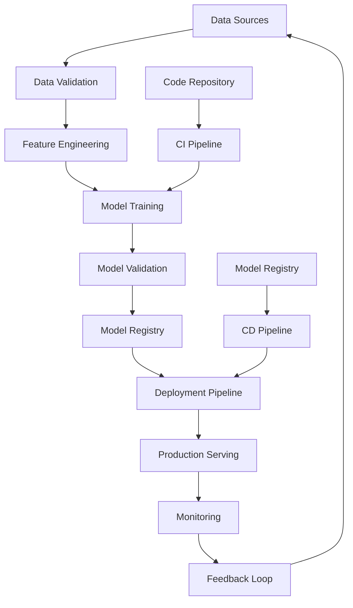

# CI/CD for Machine Learning: Practical Implementation

## Table of Contents

1. [Introduction to ML CI/CD](#introduction-to-ml-cicd)
2. [ML CI/CD Pipeline Architecture](#ml-cicd-pipeline-architecture)
3. [Continuous Integration for ML](#continuous-integration-for-ml)
4. [Continuous Delivery/Deployment for ML](#continuous-deliverydeployment-for-ml)
5. [Data and Model Versioning](#data-and-model-versioning)
6. [Automated Testing Strategies](#automated-testing-strategies)
7. [Model Validation and Approval](#model-validation-and-approval)
8. [Deployment Strategies](#deployment-strategies)
9. [Pipeline Orchestration](#pipeline-orchestration)
10. [Monitoring and Feedback Loops](#monitoring-and-feedback-loops)
11. [Security and Compliance](#security-and-compliance)
12. [Best Practices and Anti-patterns](#best-practices-and-anti-patterns)

## Introduction to ML CI/CD

Traditional CI/CD focuses on code integration and deployment, but ML CI/CD must also handle data, models, and features. This creates unique challenges and opportunities for automation.

### Key Differences from Traditional CI/CD

| Aspect                | Traditional CI/CD      | ML CI/CD                       |
| --------------------- | ---------------------- | ------------------------------ |
| **Primary Artifact**  | Code                   | Code + Data + Model            |
| **Build Process**     | Compile/Build          | Train/Evaluate Model           |
| **Testing Scope**     | Unit/Integration Tests | Data Tests + Model Tests       |
| **Deployment Target** | Application Servers    | Model Serving Infrastructure   |
| **Rollback Strategy** | Code Rollback          | Model + Data Rollback          |
| **Monitoring Focus**  | System Metrics         | Model Performance + Data Drift |

### ML CI/CD Value Proposition

#### 1. **Rapid Experimentation**

```python
# Traditional: Manual experimentation
data_scientist_workflow = {
    'step_1': 'Develop model locally',
    'step_2': 'Train on local machine',
    'step_3': 'Test on sample data',
    'step_4': 'Deploy manually to staging',
    'step_5': 'Wait for manual approval',
    'step_6': 'Deploy to production (manual)',
    'duration': '2-4 weeks'
}

# ML CI/CD: Automated experimentation
automated_workflow = {
    'step_1': 'Commit code to Git',
    'step_2': 'Automated pipeline triggers',
    'step_3': 'Data validation + model training',
    'step_4': 'Automated testing + validation',
    'step_5': 'Auto-deployment to staging',
    'step_6': 'Automated monitoring setup',
    'step_7': 'Production deployment (if approved)',
    'duration': '2-4 hours'
}
```

#### 2. **Quality Assurance**

- **Data Quality Gates**: Automated validation of data schema, quality, and distribution
- **Model Performance Gates**: Automatic testing against performance thresholds
- **Bias and Fairness Testing**: Automated fairness metrics evaluation
- **Regression Testing**: Continuous validation against historical performance

#### 3. **Risk Mitigation**

- **Canary Deployments**: Gradual rollout with monitoring
- **Automatic Rollbacks**: Triggered by performance degradation
- **Shadow Deployments**: Testing new models alongside production
- **A/B Testing**: Statistical testing of model performance

## ML CI/CD Pipeline Architecture

### High-Level Architecture



### Pipeline Components

#### 1. **Data Pipeline**

```python
# Data pipeline in CI/CD
class DataPipeline:
    def __init__(self):
        self.data_validator = DataValidator()
        self.data_transformer = DataTransformer()
        self.feature_store = FeatureStore()

    def run_data_pipeline(self, pipeline_config):
        """Execute data pipeline with validation"""

        results = {}

        # Step 1: Data Validation
        validation_result = self.data_validator.validate(
            source=pipeline_config['data_source'],
            schema=pipeline_config['data_schema'],
            quality_rules=pipeline_config['quality_rules']
        )

        if not validation_result.is_valid:
            raise DataValidationError(validation_result.errors)

        results['validation'] = validation_result

        # Step 2: Data Transformation
        transformed_data = self.data_transformer.transform(
            data=validation_result.validated_data,
            transformations=pipeline_config['transformations']
        )

        results['transformation'] = transformed_data

        # Step 3: Feature Engineering
        features = self.feature_store.create_features(
            data=transformed_data,
            feature_configs=pipeline_config['feature_configs']
        )

        results['features'] = features

        # Step 4: Store for Training
        training_dataset = self.store_training_data(features)
        results['training_dataset'] = training_dataset

        return results
```

#### 2. **Training Pipeline**

```python
# Model training pipeline
class TrainingPipeline:
    def __init__(self):
        self.experiment_tracker = ExperimentTracker()
        self.hyperparameter_tuner = HyperparameterTuner()
        self.model_trainer = ModelTrainer()
        self.model_evaluator = ModelEvaluator()

    def run_training_pipeline(self, training_config):
        """Execute model training pipeline"""

        # Step 1: Initialize Experiment
        experiment = self.experiment_tracker.start_experiment(
            name=training_config['experiment_name'],
            parameters=training_config['parameters']
        )

        # Step 2: Hyperparameter Tuning (optional)
        if training_config.get('hyperparameter_tuning', False):
            tuning_result = self.hyperparameter_tuner.tune(
                data=training_config['training_data'],
                algorithm=training_config['algorithm'],
                search_space=training_config['search_space']
            )
            best_params = tuning_result.best_parameters
        else:
            best_params = training_config['parameters']

        # Step 3: Model Training
        training_result = self.model_trainer.train(
            data=training_config['training_data'],
            hyperparameters=best_params,
            experiment_id=experiment.id
        )

        # Step 4: Model Evaluation
        evaluation_result = self.model_evaluator.evaluate(
            model=training_result.model,
            test_data=training_config['test_data'],
            metrics=training_config['metrics']
        )

        # Step 5: Register Model
        if evaluation_result.meets_requirements():
            registered_model = self.register_model(
                model=training_result.model,
                evaluation_result=evaluation_result,
                experiment=experiment
            )

            return {
                'model': registered_model,
                'evaluation': evaluation_result,
                'experiment': experiment,
                'status': 'success'
            }
        else:
            return {
                'model': None,
                'evaluation': evaluation_result,
                'experiment': experiment,
                'status': 'failed',
                'reason': 'performance_below_threshold'
            }
```

#### 3. **Deployment Pipeline**

```python
# Model deployment pipeline
class DeploymentPipeline:
    def __init__(self):
        self.deployment_strategies = {
            'blue_green': BlueGreenDeployment(),
            'canary': CanaryDeployment(),
            'rolling': RollingDeployment()
        }

        self.model_serving = ModelServing()
        self.monitoring_setup = MonitoringSetup()

    def run_deployment_pipeline(self, deployment_config):
        """Execute model deployment pipeline"""

        # Step 1: Pre-deployment Validation
        validation_result = self.pre_deployment_validation(deployment_config)
        if not validation_result.passed:
            raise DeploymentError(f"Pre-deployment validation failed: {validation_result.errors}")

        # Step 2: Prepare Deployment
        deployment_prep = self.prepare_deployment(deployment_config)

        # Step 3: Execute Deployment Strategy
        strategy = self.deployment_strategies[deployment_config['strategy']]
        deployment_result = strategy.deploy(deployment_prep)

        # Step 4: Setup Monitoring
        monitoring_config = self.monitoring_setup.configure(
            model=deployment_result.model,
            endpoints=deployment_result.endpoints
        )

        # Step 5: Health Check
        health_check = self.health_check_endpoints(deployment_result.endpoints)
        if not health_check.healthy:
            # Rollback if health check fails
            strategy.rollback(deployment_result)
            raise DeploymentError("Health check failed after deployment")

        return {
            'deployment': deployment_result,
            'monitoring': monitoring_config,
            'status': 'success'
        }
```

## Continuous Integration for ML

### Code Integration

#### GitHub Actions for ML

```yaml
# .github/workflows/ml-ci.yml
name: ML Continuous Integration

on:
  push:
    branches: [main, develop]
  pull_request:
    branches: [main]

jobs:
  lint-and-test:
    runs-on: ubuntu-latest

    steps:
      - uses: actions/checkout@v3

      - name: Set up Python
        uses: actions/setup-python@v4
        with:
          python-version: "3.9"

      - name: Install dependencies
        run: |
          pip install -r requirements.txt
          pip install -r requirements-dev.txt

      - name: Lint with flake8
        run: |
          flake8 . --count --select=E9,F63,F7,F82 --show-source --statistics
          flake8 . --count --exit-zero --max-complexity=10 --max-line-length=127 --statistics

      - name: Type check with mypy
        run: mypy src/

      - name: Test with pytest
        run: |
          pytest tests/unit/ --cov=src/ --cov-report=xml

  data-validation:
    runs-on: ubuntu-latest

    steps:
      - uses: actions/checkout@v3

      - name: Set up Python
        uses: actions/setup-python@v4
        with:
          python-version: "3.9"

      - name: Install dependencies
        run: pip install pandas great-expectations

      - name: Validate data schema
        run: |
          python scripts/validate_data_schema.py

      - name: Check data quality
        run: |
          python scripts/check_data_quality.py

      - name: Validate feature definitions
        run: |
          python scripts/validate_features.py

  model-training:
    runs-on: ubuntu-latest
    needs: [lint-and-test, data-validation]

    strategy:
      matrix:
        experiment: [experiment_1, experiment_2, experiment_3]

    steps:
      - uses: actions/checkout@v3

      - name: Set up Python
        uses: actions/setup-python@v4
        with:
          python-version: "3.9"

      - name: Cache dependencies
        uses: actions/cache@v3
        with:
          path: ~/.cache/pip
          key: ${{ runner.os }}-pip-${{ hashFiles('**/requirements.txt') }}
          restore-keys: |
            ${{ runner.os }}-pip-

      - name: Install dependencies
        run: pip install -r requirements.txt

      - name: Train model
        run: |
          python scripts/train_model.py \
            --experiment ${{ matrix.experiment }} \
            --config configs/${{ matrix.experiment }}.yaml \
            --output-dir outputs/${{ matrix.experiment }}

      - name: Evaluate model
        run: |
          python scripts/evaluate_model.py \
            --model outputs/${{ matrix.experiment }}/model.pkl \
            --test-data data/test/test_data.csv \
            --metrics accuracy,precision,recall,f1

      - name: Upload model artifacts
        uses: actions/upload-artifact@v3
        with:
          name: model-${{ matrix.experiment }}
          path: |
            outputs/${{ matrix.experiment }}/
          retention-days: 30

  integration-tests:
    runs-on: ubuntu-latest
    needs: [model-training]

    steps:
      - uses: actions/checkout@v3

      - name: Set up Python
        uses: actions/setup-python@v4
        with:
          python-version: "3.9"

      - name: Download model artifacts
        uses: actions/download-artifact@v3
        with:
          name: model-experiment_1
          path: model_artifacts/

      - name: Run integration tests
        run: |
          python tests/integration/test_model_serving.py \
            --model-path model_artifacts/model.pkl

      - name: Run end-to-end tests
        run: |
          python tests/e2e/test_complete_pipeline.py
```

#### Jenkins Pipeline for ML

```groovy
// Jenkinsfile for ML CI/CD
pipeline {
    agent any

    environment {
        MLFLOW_TRACKING_URI = credentials('mlflow-tracking-uri')
        DOCKER_REGISTRY = credentials('docker-registry')
        MODEL_REGISTRY = credentials('model-registry')
    }

    stages {
        stage('Checkout') {
            steps {
                checkout scm
            }
        }

        stage('Environment Setup') {
            steps {
                sh '''
                    python -m venv venv
                    source venv/bin/activate
                    pip install --upgrade pip
                    pip install -r requirements.txt
                    pip install -r requirements-dev.txt
                '''
            }
        }

        stage('Data Validation') {
            steps {
                sh '''
                    source venv/bin/activate
                    python scripts/validate_data.py \
                        --input-path data/raw/ \
                        --schema-path schemas/data_schema.yaml \
                        --quality-rules configs/data_quality.yaml
                '''
            }
        }

        stage('Unit Tests') {
            steps {
                sh '''
                    source venv/bin/activate
                    pytest tests/unit/ \
                        --cov=src/ \
                        --cov-report=html \
                        --cov-report=xml \
                        --junitxml=test-results.xml
                '''
            }
            post {
                always {
                    publishHTML([
                        allowMissing: false,
                        alwaysLinkToLastBuild: true,
                        keepAll: true,
                        reportDir: 'htmlcov',
                        reportFiles: 'index.html',
                        reportName: 'Coverage Report'
                    ])
                }
            }
        }

        stage('Model Training') {
            steps {
                script {
                    def experiments = ['baseline', 'enhanced', 'experimental']

                    parallel {
                        experiments.collect { experiment ->
                            stage("Train ${experiment}") {
                                sh """
                                    source venv/bin/activate
                                    python scripts/train_model.py \
                                        --experiment ${experiment} \
                                        --config configs/${experiment}.yaml \
                                        --mlflow-tracking-uri ${MLFLOW_TRACKING_URI} \
                                        --output-dir outputs/${experiment}
                                """
                            }
                        }
                    }
                }
            }
        }

        stage('Model Evaluation') {
            steps {
                sh '''
                    source venv/bin/activate
                    python scripts/evaluate_all_models.py \
                        --models-dir outputs/ \
                        --test-data data/test/test_data.csv \
                        --output-dir evaluation_results/
                '''
            }
        }

        stage('Build Docker Image') {
            steps {
                script {
                    def imageTag = "${BUILD_NUMBER}-${env.BRANCH_NAME}"
                    docker.build("ml-model:${imageTag}", "-f Dockerfile .")

                    if (env.BRANCH_NAME == 'main') {
                        docker.image("ml-model:${imageTag}").push()
                    }
                }
            }
        }

        stage('Security Scan') {
            steps {
                sh '''
                    source venv/bin/activate
                    safety check --json --output safety-report.json
                    bandit -r src/ -f json -o bandit-report.json
                '''

                archiveArtifacts artifacts: 'safety-report.json,bandit-report.json'
            }
        }
    }

    post {
        always {
            archiveArtifacts artifacts: '**/test-results.xml,**/coverage.xml', allowEmptyArchive: true
        }
        success {
            emailext (
                subject: "Build Success: ${env.JOB_NAME} - ${env.BUILD_NUMBER}",
                body: "Build completed successfully. Check the console output at ${env.BUILD_URL}",
                to: "${env.CHANGE_AUTHOR_EMAIL}"
            )
        }
        failure {
            emailext (
                subject: "Build Failed: ${env.JOB_NAME} - ${env.BUILD_NUMBER}",
                body: "Build failed. Check the console output at ${env.BUILD_URL}",
                to: "${env.CHANGE_AUTHOR_EMAIL}"
            )
        }
    }
}
```

### Data Validation in CI

#### Great Expectations Integration

```python
# Data validation in CI pipeline
class DataValidationPipeline:
    def __init__(self):
        self.ge = GreatExpectations()
        self.validator = None

    def validate_training_data(self, data_path, schema_config):
        """Validate training data using Great Expectations"""

        # Load data
        df = pd.read_csv(data_path)

        # Create expectation suite
        expectation_suite = self.create_expectation_suite(schema_config)

        # Validate data
        validator = self.ge.get_context().get_validator(
            batch=df,
            expectation_suite=expectation_suite
        )

        # Check results
        validation_result = validator.validate()

        if not validation_result.success:
            # Log validation failures
            self.log_validation_failures(validation_result)

            # Fail the pipeline if critical validations fail
            critical_failures = self.get_critical_failures(validation_result)
            if critical_failures:
                raise DataValidationError(f"Critical validation failures: {critical_failures}")

        return validation_result

    def create_expectation_suite(self, schema_config):
        """Create expectation suite from schema configuration"""

        suite = ExpectationSuite(expectation_suite_name="training_data_suite")

        # Add column expectations
        for column_name, column_config in schema_config['columns'].items():
            # Column existence
            suite.expect_column_to_exist(column_name)

            # Data type expectations
            if 'data_type' in column_config:
                suite.expect_column_values_to_be_of_type(
                    column_name,
                    column_config['data_type']
                )

            # Null value expectations
            if 'nullable' in column_config and not column_config['nullable']:
                suite.expect_column_values_to_not_be_null(column_name)

            # Value range expectations
            if 'min_value' in column_config:
                suite.expect_column_values_to_be_greater_than(
                    column_name,
                    column_config['min_value']
                )

            if 'max_value' in column_config:
                suite.expect_column_values_to_be_less_than(
                    column_name,
                    column_config['max_value']
                )

            # Unique value expectations
            if 'unique' in column_config and column_config['unique']:
                suite.expect_column_values_to_be_unique(column_name)

        # Add dataset-level expectations
        if 'row_count' in schema_config:
            suite.expect_table_row_count_to_be_between(
                min_value=schema_config['row_count']['min'],
                max_value=schema_config['row_count']['max']
            )

        return suite
```

#### Data Drift Detection

```python
# Data drift detection in CI
class DataDriftDetection:
    def __init__(self):
        self.drift_detectors = {
            'statistical': StatisticalDriftDetector(),
            'ml_based': MLBasedDriftDetector(),
            'domain_specific': DomainSpecificDriftDetector()
        }

    def detect_data_drift(self, current_data, reference_data, detector_types=None):
        """Detect data drift using multiple methods"""

        if detector_types is None:
            detector_types = list(self.drift_detectors.keys())

        drift_results = {}

        for detector_type in detector_types:
            if detector_type in self.drift_detectors:
                detector = self.drift_detectors[detector_type]
                result = detector.detect_drift(current_data, reference_data)
                drift_results[detector_type] = result

        # Combine results
        overall_drift_score = self.calculate_overall_drift_score(drift_results)

        return {
            'drift_detected': overall_drift_score > 0.1,
            'drift_score': overall_drift_score,
            'individual_results': drift_results,
            'recommendations': self.get_drift_recommendations(drift_results)
        }

class StatisticalDriftDetector:
    """Statistical tests for data drift detection"""

    def __init__(self):
        self.statistical_tests = {
            'ks_test': KolmogorovSmirnovTest(),
            'chi2_test': ChiSquareTest(),
            'jensen_shannon': JensenShannonDivergence(),
            'population_stability_index': PopulationStabilityIndex()
        }

    def detect_drift(self, current_data, reference_data):
        """Detect drift using statistical tests"""

        results = {}

        for column in current_data.columns:
            if column in reference_data.columns:
                current_values = current_data[column].dropna()
                reference_values = reference_data[column].dropna()

                column_results = {}

                # Kolmogorov-Smirnov test for continuous variables
                if self.is_continuous(current_values):
                    ks_result = self.statistical_tests['ks_test'].test(
                        current_values, reference_values
                    )
                    column_results['ks_test'] = ks_result

                # Chi-square test for categorical variables
                elif self.is_categorical(current_values):
                    chi2_result = self.statistical_tests['chi2_test'].test(
                        current_values, reference_values
                    )
                    column_results['chi2_test'] = chi2_result

                # Population Stability Index
                psi_result = self.statistical_tests['population_stability_index'].calculate(
                    current_values, reference_values
                )
                column_results['psi'] = psi_result

                results[column] = column_results

        return results
```

## Continuous Delivery/Deployment for ML

### Model Registry Integration

#### MLflow Model Registry

```python
# MLflow model registry integration
class MLflowModelRegistry:
    def __init__(self, tracking_uri):
        self.mlflow = mlflow
        self.mlflow.set_tracking_uri(tracking_uri)
        self.registry_client = mlflow.tracking.MlflowClient(tracking_uri)

    def register_model(self, model_path, model_name, experiment_id, tags=None):
        """Register model in MLflow registry"""

        # Create model version
        model_version = self.mlflow.register_model(
            model_uri=model_path,
            name=model_name,
            tags=tags or {}
        )

        # Add metadata
        self.add_model_metadata(model_version, experiment_id)

        # Setup model stage transitions
        self.setup_stage_transitions(model_version)

        return model_version

    def promote_model(self, model_name, version, target_stage):
        """Promote model to target stage"""

        # Validate promotion criteria
        validation_result = self.validate_promotion_criteria(model_name, version, target_stage)

        if not validation_result.passed:
            raise ModelPromotionError(f"Promotion validation failed: {validation_result.errors}")

        # Execute promotion
        self.registry_client.transition_model_version_stage(
            name=model_name,
            version=version,
            stage=target_stage
        )

        # Log promotion event
        self.log_promotion_event(model_name, version, target_stage)

        return True

    def validate_promotion_criteria(self, model_name, version, target_stage):
        """Validate model meets criteria for promotion"""

        model_info = self.registry_client.get_model_version(model_name, version)

        validation_checks = {
            'performance_requirements': self.check_performance_requirements(model_info),
            'bias_requirements': self.check_bias_requirements(model_info),
            'security_scan': self.check_security_scan(model_info),
            'documentation': self.check_documentation(model_info),
            'testing_coverage': self.check_testing_coverage(model_info)
        }

        passed_checks = [check['passed'] for check in validation_checks.values()]

        return ModelPromotionValidation(
            passed=all(passed_checks),
            checks=validation_checks,
            summary=f"{sum(passed_checks)}/{len(validation_checks)} checks passed"
        )
```

#### Custom Model Registry

```python
# Custom model registry implementation
class CustomModelRegistry:
    def __init__(self, database_url):
        self.db = create_database_connection(database_url)
        self.storage_backend = CloudStorageBackend()
        self.metadata_store = MetadataStore(self.db)

    def register_model(self, model_info):
        """Register model with comprehensive metadata"""

        # Validate model metadata
        validation_result = self.validate_model_metadata(model_info)
        if not validation_result.is_valid:
            raise InvalidModelMetadataError(validation_result.errors)

        # Store model artifacts
        storage_path = self.storage_backend.store_model_artifacts(
            artifacts=model_info['artifacts'],
            model_id=model_info['model_id']
        )

        # Store model metadata
        model_record = {
            'model_id': model_info['model_id'],
            'name': model_info['name'],
            'version': model_info['version'],
            'algorithm': model_info['algorithm'],
            'hyperparameters': model_info['hyperparameters'],
            'metrics': model_info['metrics'],
            'training_data_info': model_info['training_data_info'],
            'feature_info': model_info['feature_info'],
            'storage_path': storage_path,
            'created_at': datetime.utcnow(),
            'created_by': model_info['created_by'],
            'status': 'registered'
        }

        model_id = self.metadata_store.insert_model(model_record)

        # Setup model lineage
        self.setup_model_lineage(model_id, model_info.get('lineage', []))

        return model_id

    def get_model_for_deployment(self, model_name, stage, version=None):
        """Get model ready for deployment"""

        if version:
            model = self.metadata_store.get_model_by_version(model_name, version)
        else:
            model = self.metadata_store.get_latest_model_by_stage(model_name, stage)

        if not model:
            raise ModelNotFoundError(f"Model {model_name} not found in stage {stage}")

        # Load model artifacts
        model_artifacts = self.storage_backend.load_model_artifacts(model['storage_path'])

        # Setup model serving configuration
        serving_config = self.generate_serving_config(model)

        return {
            'model': model,
            'artifacts': model_artifacts,
            'serving_config': serving_config
        }
```

### Deployment Automation

#### Kubernetes Deployment

```yaml
# Kubernetes deployment for ML model
apiVersion: apps/v1
kind: Deployment
metadata:
  name: ml-model-serving
  namespace: ml-production
  labels:
    app: ml-model
    version: v1.0.0
spec:
  replicas: 3
  selector:
    matchLabels:
      app: ml-model
  template:
    metadata:
      labels:
        app: ml-model
        version: v1.0.0
    spec:
      containers:
        - name: ml-model-container
          image: ml-model:v1.0.0
          ports:
            - containerPort: 8080
          env:
            - name: MODEL_NAME
              value: "churn-prediction"
            - name: MODEL_VERSION
              value: "1.0.0"
            - name: LOG_LEVEL
              value: "INFO"
          resources:
            requests:
              memory: "512Mi"
              cpu: "250m"
            limits:
              memory: "1Gi"
              cpu: "500m"
          livenessProbe:
            httpGet:
              path: /health
              port: 8080
            initialDelaySeconds: 30
            periodSeconds: 10
          readinessProbe:
            httpGet:
              path: /ready
              port: 8080
            initialDelaySeconds: 5
            periodSeconds: 5
          volumeMounts:
            - name: model-storage
              mountPath: /app/models
      volumes:
        - name: model-storage
          persistentVolumeClaim:
            claimName: ml-model-pvc
---
apiVersion: v1
kind: Service
metadata:
  name: ml-model-service
  namespace: ml-production
spec:
  selector:
    app: ml-model
  ports:
    - port: 80
      targetPort: 8080
  type: ClusterIP
---
apiVersion: autoscaling/v2
kind: HorizontalPodAutoscaler
metadata:
  name: ml-model-hpa
  namespace: ml-production
spec:
  scaleTargetRef:
    apiVersion: apps/v1
    kind: Deployment
    name: ml-model-serving
  minReplicas: 3
  maxReplicas: 10
  metrics:
    - type: Resource
      resource:
        name: cpu
        target:
          type: Utilization
          averageUtilization: 70
    - type: Resource
      resource:
        name: memory
        target:
          type: Utilization
          averageUtilization: 80
```

#### Deployment Script

```python
# Automated deployment script
class ModelDeploymentOrchestrator:
    def __init__(self, config):
        self.k8s_client = KubernetesClient()
        self.mlflow_client = MLflowClient(config.mlflow_tracking_uri)
        self.helm_chart_path = config.helm_chart_path
        self.namespace = config.namespace

    def deploy_model(self, deployment_request):
        """Orchestrate complete model deployment"""

        # Step 1: Prepare deployment
        deployment_prep = self.prepare_deployment(deployment_request)

        # Step 2: Deploy to staging
        staging_result = self.deploy_to_staging(deployment_prep)

        # Step 3: Run staging tests
        staging_tests_passed = self.run_staging_tests(staging_result)

        if not staging_tests_passed:
            self.cleanup_failed_deployment(staging_result)
            raise DeploymentError("Staging tests failed")

        # Step 4: Production deployment
        production_result = self.deploy_to_production(deployment_prep)

        # Step 5: Verify production deployment
        verification_result = self.verify_production_deployment(production_result)

        if not verification_result.successful:
            self.rollback_production_deployment(production_result)
            raise DeploymentError("Production verification failed")

        # Step 6: Setup monitoring
        self.setup_monitoring(production_result)

        return {
            'deployment_id': deployment_prep.deployment_id,
            'staging_result': staging_result,
            'production_result': production_result,
            'monitoring_config': verification_result.monitoring_config
        }

    def deploy_to_staging(self, deployment_prep):
        """Deploy model to staging environment"""

        # Create staging namespace if it doesn't exist
        self.k8s_client.create_namespace(f"{self.namespace}-staging")

        # Deploy using Helm
        helm_values = {
            'image': {
                'repository': deployment_prep.model_registry_url,
                'tag': deployment_prep.model_version
            },
            'model': {
                'name': deployment_prep.model_name,
                'version': deployment_prep.model_version
            },
            'resources': deployment_prep.staging_resources,
            'autoscaling': {
                'enabled': True,
                'minReplicas': 1,
                'maxReplicas': 3
            }
        }

        helm_result = self.k8s_client.helm_upgrade(
            release_name=f"{deployment_prep.model_name}-staging",
            chart_path=self.helm_chart_path,
            namespace=f"{self.namespace}-staging",
            values=helm_values
        )

        return helm_result

    def deploy_to_production(self, deployment_prep):
        """Deploy model to production using canary strategy"""

        # Initial deployment with 10% traffic
        canary_config = {
            'traffic_split': {
                'current_model': 90,
                'new_model': 10
            },
            'monitoring_period': '2h',
            'rollback_threshold': {
                'error_rate_increase': 0.02,
                'latency_increase': 0.5,
                'accuracy_decrease': 0.05
            }
        }

        # Deploy canary version
        canary_result = self.deploy_canary_model(deployment_prep, canary_config)

        # Monitor canary deployment
        monitoring_result = self.monitor_canary_deployment(
            canary_result,
            canary_config['monitoring_period']
        )

        # If canary performs well, increase traffic
        if monitoring_result.success:
            traffic_increase_result = self.increase_canary_traffic(
                canary_result,
                target_traffic=50  # 50% traffic
            )

            # Continue monitoring and gradually increase to 100%
            return self.graduate_canary_to_production(traffic_increase_result)

        else:
            # Rollback canary deployment
            self.rollback_canary_deployment(canary_result)
            raise CanaryDeploymentError("Canary deployment failed")
```

### Rollback Mechanisms

#### Automated Rollback

```python
# Automated rollback system
class ModelRollbackSystem:
    def __init__(self, config):
        self.mlflow_client = MLflowClient(config.mlflow_tracking_uri)
        self.k8s_client = KubernetesClient()
        self.monitoring_client = MonitoringClient()
        self.rollback_policies = config.rollback_policies

    def monitor_and_rollback(self, model_name, current_version):
        """Monitor model performance and trigger rollback if needed"""

        monitoring_config = self.rollback_policies[model_name]

        # Start monitoring
        monitor_task = self.start_performance_monitoring(
            model_name=model_name,
            version=current_version,
            metrics=monitoring_config['metrics'],
            thresholds=monitoring_config['thresholds']
        )

        # Monitor for specified period
        for _ in range(monitoring_config['monitoring_duration_minutes']):
            time.sleep(60)  # Check every minute

            current_metrics = self.get_current_metrics(model_name, current_version)
            baseline_metrics = self.get_baseline_metrics(model_name)

            # Check if rollback criteria are met
            rollback_required = self.evaluate_rollback_criteria(
                current_metrics,
                baseline_metrics,
                monitoring_config['thresholds']
            )

            if rollback_required:
                rollback_reason = self.determine_rollback_reason(
                    current_metrics,
                    baseline_metrics,
                    monitoring_config['thresholds']
                )

                # Execute rollback
                rollback_result = self.execute_rollback(
                    model_name=model_name,
                    current_version=current_version,
                    reason=rollback_reason
                )

                # Notify stakeholders
                self.notify_rollback_stakeholders(
                    model_name, current_version, rollback_reason, rollback_result
                )

                return rollback_result

        # No rollback needed
        return RollbackResult(
            rollback_required=False,
            reason="Performance within acceptable limits"
        )

    def execute_rollback(self, model_name, current_version, reason):
        """Execute model rollback"""

        # Get previous stable version
        previous_version = self.mlflow_client.get_previous_stable_version(
            model_name=model_name,
            current_version=current_version
        )

        if not previous_version:
            raise RollbackError("No previous stable version found")

        # Prepare rollback deployment
        rollback_request = RollbackRequest(
            model_name=model_name,
            target_version=previous_version,
            rollback_reason=reason,
            rollback_type='automatic'
        )

        # Execute rollback deployment
        rollback_deployment = self.deploy_model(rollback_request)

        # Verify rollback
        verification_result = self.verify_rollback(
            model_name, previous_version
        )

        if not verification_result.successful:
            # If rollback verification fails, escalate to manual intervention
            self.escalate_rollback_failure(model_name, current_version, previous_version)
            raise RollbackError("Rollback verification failed")

        # Log rollback event
        self.log_rollback_event(
            model_name=model_name,
            from_version=current_version,
            to_version=previous_version,
            reason=reason,
            timestamp=datetime.utcnow()
        )

        return RollbackResult(
            rollback_required=True,
            from_version=current_version,
            to_version=previous_version,
            reason=reason,
            successful=True
        )
```

## Data and Model Versioning

### DVC (Data Version Control) Integration

#### DVC Pipeline Configuration

```yaml
# dvc.yaml - DVC pipeline for ML workflow
stages:
  prepare_data:
    cmd: python scripts/prepare_data.py
    deps:
      - data/raw/dataset.csv
      - scripts/prepare_data.py
    outs:
      - data/prepared/train.csv
      - data/prepared/val.csv
      - data/prepared/test.csv
    params:
      - data.split.ratio
      - data.random_seed

  feature_engineering:
    cmd: python scripts/feature_engineering.py
    deps:
      - data/prepared/train.csv
      - scripts/feature_engineering.py
    outs:
      - data/features/train_features.csv
      - data/features/val_features.csv
      - data/features/test_features.csv
    params:
      - features.selected_features
      - features.normalization_method

  train_model:
    cmd: python scripts/train_model.py
    deps:
      - data/features/train_features.csv
      - data/features/val_features.csv
      - scripts/train_model.py
    outs:
      - models/model.pkl
      - models/metrics.json
    params:
      - model.algorithm
      - model.hyperparams

  evaluate_model:
    cmd: python scripts/evaluate_model.py
    deps:
      - models/model.pkl
      - data/features/test_features.csv
      - scripts/evaluate_model.py
    outs:
      - evaluation/test_results.json
    params:
      - evaluation.metrics

plots:
  - evaluation/test_results.json:
      x: epoch
      y:
        - accuracy
        - loss
      title: Training Metrics
```

#### DVC Integration in CI/CD

```python
# DVC integration for CI/CD pipeline
class DVCIntegration:
    def __init__(self, dvc_repo_path):
        self.repo_path = dvc_repo_path
        self.dvc = DVCLive()

    def setup_dvc_pipeline(self):
        """Setup DVC pipeline for ML workflow"""

        # Initialize DVC repo
        subprocess.run(['dvc', 'init'], cwd=self.repo_path, check=True)

        # Setup DVC remote storage
        subprocess.run([
            'dvc', 'remote', 'add', '-d', 'storage',
            's3://my-ml-data-bucket/dvc-storage'
        ], cwd=self.repo_path, check=True)

        # Configure S3 credentials
        subprocess.run([
            'dvc', 'remote', 'modify', 'storage',
            'access_key_id', os.environ['AWS_ACCESS_KEY_ID']
        ], cwd=self.repo_path, check=True)

    def version_data(self, data_file, version_message):
        """Version data using DVC"""

        # Add data file to DVC
        subprocess.run([
            'dvc', 'add', data_file
        ], cwd=self.repo_path, check=True)

        # Commit changes
        subprocess.run([
            'git', 'add', f'{data_file}.dvc', '.gitignore'
        ], cwd=self.repo_path, check=True)

        subprocess.run([
            'git', 'commit', '-m', f'Version data: {version_message}'
        ], cwd=self.repo_path, check=True)

    def reproduce_pipeline(self):
        """Reproduce DVC pipeline"""

        # Pull latest data
        subprocess.run(['dvc', 'pull'], cwd=self.repo_path, check=True)

        # Reproduce pipeline
        subprocess.run(['dvc', 'repro'], cwd=self.repo_path, check=True)

        # Push updated artifacts
        subprocess.run(['dvc', 'push'], cwd=self.repo_path, check=True)
```

### MLflow Tracking Integration

#### MLflow Experiment Tracking

```python
# MLflow experiment tracking
import mlflow
import mlflow.sklearn
from mlflow.tracking import MlflowClient

class MLflowExperimentTracker:
    def __init__(self, tracking_uri, experiment_name):
        self.tracking_uri = tracking_uri
        self.experiment_name = experiment_name

        # Setup MLflow
        mlflow.set_tracking_uri(tracking_uri)

        # Create or get experiment
        self.experiment = mlflow.get_experiment_by_name(experiment_name)
        if self.experiment is None:
            self.experiment_id = mlflow.create_experiment(experiment_name)
        else:
            self.experiment_id = self.experiment.experiment_id

    def start_run(self, run_name=None, tags=None):
        """Start MLflow run"""

        run = mlflow.start_run(
            experiment_id=self.experiment_id,
            run_name=run_name,
            tags=tags or {}
        )

        return run.info.run_id

    def log_parameters(self, parameters):
        """Log parameters to MLflow"""

        mlflow.log_params(parameters)

    def log_metrics(self, metrics, step=None):
        """Log metrics to MLflow"""

        for metric_name, metric_value in metrics.items():
            mlflow.log_metric(metric_name, metric_value, step=step)

    def log_model(self, model, model_name, metadata=None):
        """Log model to MLflow"""

        # Log model with sklearn flavor
        mlflow.sklearn.log_model(
            model,
            model_name,
            registered_model_name=model_name,
            metadata=metadata
        )

    def log_artifact(self, artifact_path, artifact_name=None):
        """Log artifact to MLflow"""

        mlflow.log_artifact(artifact_path, artifact_name)

    def compare_experiments(self, run_ids):
        """Compare multiple experiment runs"""

        client = MlflowClient()

        comparison_data = []

        for run_id in run_ids:
            run = client.get_run(run_id)

            run_data = {
                'run_id': run_id,
                'experiment_id': run.info.experiment_id,
                'status': run.info.status,
                'start_time': run.info.start_time,
                'end_time': run.info.end_time,
                'metrics': run.data.metrics,
                'params': run.data.params,
                'tags': run.data.tags
            }

            comparison_data.append(run_data)

        return comparison_data
```

## Automated Testing Strategies

### Model Testing Framework

#### Unit Testing for ML Components

```python
# Unit tests for ML pipeline components
import pytest
import pandas as pd
import numpy as np
from unittest.mock import Mock, patch

class TestDataValidator:
    """Test data validation components"""

    def test_schema_validation(self):
        """Test schema validation logic"""

        validator = DataValidator()

        # Valid data
        valid_data = pd.DataFrame({
            'feature1': [1.0, 2.0, 3.0],
            'feature2': ['A', 'B', 'C'],
            'target': [0, 1, 0]
        })

        schema = {
            'feature1': {'type': 'float', 'nullable': False},
            'feature2': {'type': 'string', 'nullable': False},
            'target': {'type': 'integer', 'nullable': False}
        }

        result = validator.validate_schema(valid_data, schema)
        assert result.is_valid is True

        # Invalid data
        invalid_data = pd.DataFrame({
            'feature1': [1.0, None, 3.0],  # Null value in non-nullable column
            'feature2': ['A', 'B', 'C'],
            'target': [0, 1, 0]
        })

        result = validator.validate_schema(invalid_data, schema)
        assert result.is_valid is False
        assert any('feature1' in error for error in result.errors)

    def test_data_quality_checks(self):
        """Test data quality validation"""

        validator = DataValidator()

        # Test duplicate detection
        data_with_duplicates = pd.DataFrame({
            'id': [1, 2, 2, 3],
            'value': [10, 20, 20, 30]
        })

        result = validator.check_duplicates(data_with_duplicates)
        assert result.has_duplicates is True
        assert result.duplicate_count == 1

    def test_outlier_detection(self):
        """Test outlier detection"""

        validator = DataValidator()

        # Data with outliers
        data_with_outliers = pd.DataFrame({
            'feature': [1, 2, 3, 4, 5, 100]  # 100 is an outlier
        })

        result = validator.detect_outliers(data_with_outliers, 'feature')
        assert result.has_outliers is True
        assert 100 in result.outlier_values

class TestFeatureEngineer:
    """Test feature engineering components"""

    def test_normalization(self):
        """Test feature normalization"""

        engineer = FeatureEngineer()

        # Test data
        data = pd.DataFrame({
            'feature1': [1, 2, 3, 4, 5],
            'feature2': [10, 20, 30, 40, 50]
        })

        # Min-max normalization
        normalized_data = engineer.normalize_features(
            data,
            method='min_max',
            columns=['feature1', 'feature2']
        )

        # Check that values are in [0, 1] range
        assert normalized_data['feature1'].min() == 0.0
        assert normalized_data['feature1'].max() == 1.0
        assert normalized_data['feature2'].min() == 0.0
        assert normalized_data['feature2'].max() == 1.0

    def test_encoding(self):
        """Test categorical encoding"""

        engineer = FeatureEngineer()

        # Test data with categorical variable
        data = pd.DataFrame({
            'category': ['A', 'B', 'C', 'A', 'B'],
            'numeric': [1, 2, 3, 4, 5]
        })

        # One-hot encoding
        encoded_data = engineer.encode_categorical(
            data,
            column='category',
            method='one_hot'
        )

        # Check that categorical column is replaced
        assert 'category' not in encoded_data.columns
        assert 'category_A' in encoded_data.columns
        assert 'category_B' in encoded_data.columns
        assert 'category_C' in encoded_data.columns

class TestModelTrainer:
    """Test model training components"""

    @patch('sklearn.ensemble.RandomForestClassifier')
    def test_model_training(self, mock_model_class):
        """Test model training logic"""

        # Mock model instance
        mock_model = Mock()
        mock_model_class.return_value = mock_model

        trainer = ModelTrainer()

        # Test data
        X_train = pd.DataFrame({
            'feature1': [1, 2, 3, 4, 5],
            'feature2': [10, 20, 30, 40, 50]
        })
        y_train = pd.Series([0, 1, 0, 1, 0])

        # Train model
        result = trainer.train_model(
            X_train=X_train,
            y_train=y_train,
            algorithm='random_forest',
            hyperparameters={'n_estimators': 100}
        )

        # Verify model training was called
        mock_model.fit.assert_called_once_with(X_train, y_train)

        assert result.model is mock_model
        assert result.training_successful is True

    def test_cross_validation(self):
        """Test cross-validation functionality"""

        trainer = ModelTrainer()

        # Test data
        X = pd.DataFrame({
            'feature1': np.random.rand(100),
            'feature2': np.random.rand(100)
        })
        y = pd.Series(np.random.randint(0, 2, 100))

        # Perform cross-validation
        cv_results = trainer.cross_validate(
            X=X,
            y=y,
            algorithm='random_forest',
            cv_folds=5
        )

        assert 'accuracy' in cv_results
        assert 'precision' in cv_results
        assert 'recall' in cv_results
        assert 'f1' in cv_results

        # Check that we have results for all folds
        assert len(cv_results['accuracy']) == 5
```

#### Integration Testing

```python
# Integration tests for ML pipeline
class TestMLPipelineIntegration:
    """End-to-end integration tests"""

    @pytest.fixture
    def sample_data(self):
        """Generate sample data for testing"""

        np.random.seed(42)
        n_samples = 1000

        data = pd.DataFrame({
            'feature1': np.random.randn(n_samples),
            'feature2': np.random.randn(n_samples),
            'feature3': np.random.choice(['A', 'B', 'C'], n_samples),
            'target': np.random.randint(0, 2, n_samples)
        })

        return data

    def test_end_to_end_pipeline(self, sample_data):
        """Test complete ML pipeline"""

        # Step 1: Data validation
        validator = DataValidator()
        schema = {
            'feature1': {'type': 'float', 'nullable': False},
            'feature2': {'type': 'float', 'nullable': False},
            'feature3': {'type': 'string', 'nullable': False},
            'target': {'type': 'integer', 'nullable': False}
        }

        validation_result = validator.validate_schema(sample_data, schema)
        assert validation_result.is_valid is True

        # Step 2: Feature engineering
        engineer = FeatureEngineer()

        # Encode categorical variable
        processed_data = engineer.encode_categorical(
            sample_data,
            column='feature3',
            method='one_hot'
        )

        # Split features and target
        X = processed_data.drop('target', axis=1)
        y = processed_data['target']

        # Step 3: Model training
        trainer = ModelTrainer()

        # Split data
        X_train, X_test, y_train, y_test = train_test_split(
            X, y, test_size=0.2, random_state=42
        )

        # Train model
        training_result = trainer.train_model(
            X_train=X_train,
            y_train=y_train,
            algorithm='random_forest',
            hyperparameters={'n_estimators': 10, 'random_state': 42}
        )

        assert training_result.training_successful is True

        # Step 4: Model evaluation
        evaluator = ModelEvaluator()

        evaluation_result = evaluator.evaluate_model(
            model=training_result.model,
            X_test=X_test,
            y_test=y_test,
            metrics=['accuracy', 'precision', 'recall', 'f1']
        )

        # Check that model performs reasonably well
        assert evaluation_result.metrics['accuracy'] > 0.5  # Should be better than random

        # Step 5: Model inference
        predictions = training_result.model.predict(X_test[:10])

        assert len(predictions) == 10
        assert all(pred in [0, 1] for pred in predictions)  # Binary predictions

    def test_data_drift_detection_integration(self, sample_data):
        """Test data drift detection in pipeline"""

        # Create reference data
        reference_data = sample_data.iloc[:-100].copy()  # All but last 100 samples

        # Create current data with drift (different distribution)
        current_data = sample_data.iloc[-100:].copy()
        current_data['feature1'] = current_data['feature1'] + 2  # Shift distribution

        # Test drift detection
        drift_detector = DataDriftDetection()

        drift_result = drift_detector.detect_data_drift(
            current_data=current_data,
            reference_data=reference_data
        )

        # Should detect drift in feature1 due to distribution shift
        assert drift_result.drift_detected is True
        assert 'feature1' in str(drift_result.individual_results)

class TestModelDeploymentIntegration:
    """Test model deployment integration"""

    def test_model_serving_health_check(self):
        """Test model serving health check"""

        # This would test against actual serving infrastructure
        # For now, we'll test the health check logic

        serving_client = ModelServingClient(
            endpoint='http://localhost:8080',
            timeout=30
        )

        # Test health endpoint
        health_result = serving_client.health_check()

        # In a real test environment, this would check actual service health
        assert health_result.status in ['healthy', 'unhealthy']  # Either state is acceptable

    def test_model_prediction_endpoint(self):
        """Test model prediction endpoint"""

        serving_client = ModelServingClient(
            endpoint='http://localhost:8080',
            timeout=30
        )

        # Test prediction with sample data
        sample_input = {
            'feature1': 1.5,
            'feature2': 2.5,
            'feature3': 'A'
        }

        # This would test actual prediction in a real environment
        # For integration tests, we'd mock the serving layer or use test containers
        try:
            prediction_result = serving_client.predict(sample_input)
            assert 'prediction' in prediction_result
            assert 'confidence' in prediction_result
        except ConnectionError:
            # Skip if serving is not available (acceptable in CI)
            pytest.skip("Model serving not available for integration test")
```

### Performance Testing

#### Load Testing for Model Serving

```python
# Performance testing for model serving
import asyncio
import aiohttp
import time
from concurrent.futures import ThreadPoolExecutor
import statistics

class ModelServingLoadTester:
    def __init__(self, model_endpoint, test_config):
        self.endpoint = model_endpoint
        self.config = test_config

    async def single_prediction_request(self, session, payload):
        """Make a single prediction request"""

        start_time = time.time()

        try:
            async with session.post(
                f"{self.endpoint}/predict",
                json=payload,
                headers={'Content-Type': 'application/json'}
            ) as response:

                if response.status == 200:
                    result = await response.json()
                    end_time = time.time()

                    return {
                        'success': True,
                        'response_time': end_time - start_time,
                        'result': result,
                        'status_code': response.status
                    }
                else:
                    end_time = time.time()
                    return {
                        'success': False,
                        'response_time': end_time - start_time,
                        'error': f"HTTP {response.status}",
                        'status_code': response.status
                    }

        except Exception as e:
            end_time = time.time()
            return {
                'success': False,
                'response_time': end_time - start_time,
                'error': str(e),
                'status_code': None
            }

    async def run_load_test(self, test_payloads):
        """Run load test with concurrent requests"""

        async with aiohttp.ClientSession() as session:

            # Create tasks for concurrent requests
            tasks = []
            for payload in test_payloads:
                task = self.single_prediction_request(session, payload)
                tasks.append(task)

            # Execute all requests concurrently
            results = await asyncio.gather(*tasks)

            # Analyze results
            return self.analyze_load_test_results(results)

    def analyze_load_test_results(self, results):
        """Analyze load test results"""

        successful_requests = [r for r in results if r['success']]
        failed_requests = [r for r in results if not r['success']]

        if successful_requests:
            response_times = [r['response_time'] for r in successful_requests]

            analysis = {
                'total_requests': len(results),
                'successful_requests': len(successful_requests),
                'failed_requests': len(failed_requests),
                'success_rate': len(successful_requests) / len(results),

                'response_time_stats': {
                    'mean': statistics.mean(response_times),
                    'median': statistics.median(response_times),
                    'min': min(response_times),
                    'max': max(response_times),
                    'p95': self.percentile(response_times, 95),
                    'p99': self.percentile(response_times, 99)
                },

                'performance_grade': self.calculate_performance_grade(
                    response_times, len(failed_requests), len(results)
                )
            }
        else:
            analysis = {
                'total_requests': len(results),
                'successful_requests': 0,
                'failed_requests': len(failed_requests),
                'success_rate': 0.0,
                'error': 'All requests failed'
            }

        return analysis

    def calculate_performance_grade(self, response_times, failed_count, total_count):
        """Calculate overall performance grade"""

        # Performance criteria
        avg_response_time = statistics.mean(response_times)
        success_rate = (total_count - failed_count) / total_count

        # Grade calculation logic
        if success_rate >= 0.99 and avg_response_time < 0.1:
            return 'A+'
        elif success_rate >= 0.98 and avg_response_time < 0.2:
            return 'A'
        elif success_rate >= 0.95 and avg_response_time < 0.5:
            return 'B'
        elif success_rate >= 0.90 and avg_response_time < 1.0:
            return 'C'
        else:
            return 'F'

    def percentile(self, data, percentile):
        """Calculate percentile of data"""

        sorted_data = sorted(data)
        index = (percentile / 100) * (len(sorted_data) - 1)

        if index.is_integer():
            return sorted_data[int(index)]
        else:
            lower_index = int(index)
            upper_index = min(lower_index + 1, len(sorted_data) - 1)
            weight = index - lower_index

            return sorted_data[lower_index] * (1 - weight) + sorted_data[upper_index] * weight

# Usage example
async def run_performance_tests():
    """Run comprehensive performance tests"""

    test_config = {
        'concurrent_users': 50,
        'requests_per_user': 100,
        'test_duration': 300,  # 5 minutes
        'payload_size': 'medium'
    }

    # Generate test payloads
    test_payloads = generate_test_payloads(test_config)

    # Run load test
    load_tester = ModelServingLoadTester(
        model_endpoint='http://localhost:8080',
        test_config=test_config
    )

    results = await load_tester.run_load_test(test_payloads)

    # Evaluate results
    if results['performance_grade'] in ['A+', 'A']:
        print(f"✅ Performance test passed with grade: {results['performance_grade']}")
    else:
        print(f"❌ Performance test failed with grade: {results['performance_grade']}")
        print(f"Issues: {results}")

    return results
```

This comprehensive guide to CI/CD for ML covers the essential practical aspects of implementing automated pipelines for machine learning systems. The key to success is starting with simple automation and gradually adding complexity as your organization and use cases evolve.

The next sections will build upon these foundations to cover more advanced topics like monitoring, security, and scaling CI/CD pipelines for enterprise environments.
