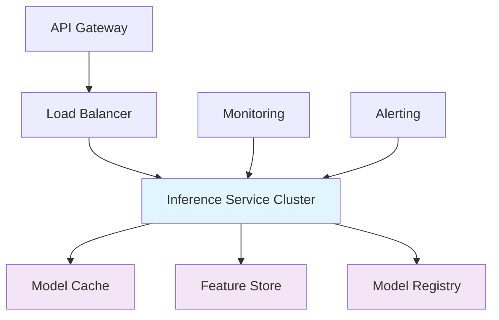
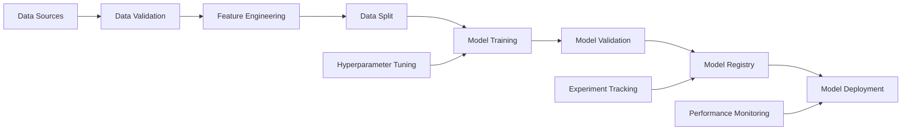
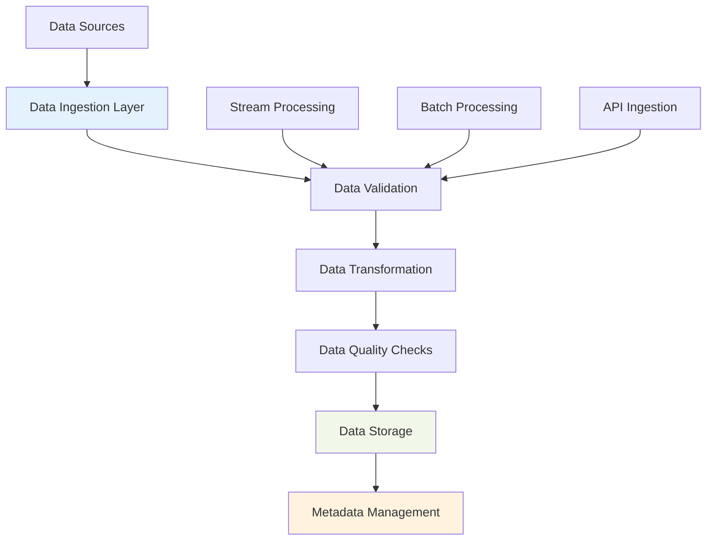

# MLOps Interview Preparation: Technical Questions and Scenarios

## Table of Contents

1. [Technical Fundamentals](#technical-fundamentals)
2. [Architecture and Design Questions](#architecture-and-design-questions)
3. [Tools and Technologies](#tools-and-technologies)
4. [Data Pipeline Questions](#data-pipeline-questions)
5. [Model Deployment Scenarios](#model-deployment-scenarios)
6. [Monitoring and Operations](#monitoring-and-operations)
7. [Security and Compliance](#security-and-compliance)
8. [Troubleshooting Scenarios](#troubleshooting-scenarios)
9. [System Design Problems](#system-design-problems)
10. [Behavioral Questions](#behavioral-questions)
11. [Coding Challenges](#coding-challenges)
12. [Case Studies](#case-studies)

## Technical Fundamentals

### Q1: Explain the differences between DevOps and MLOps.

**Answer:**
While DevOps and MLOps share common principles, they differ in several key aspects:

| Aspect                | DevOps                          | MLOps                                             |
| --------------------- | ------------------------------- | ------------------------------------------------- |
| **Primary Artifact**  | Code and applications           | Code, data, and models                            |
| **Testing Scope**     | Unit, integration, system tests | Data validation, model performance, bias testing  |
| **Deployment Target** | Application servers             | Model serving infrastructure                      |
| **Version Control**   | Code, infrastructure            | Code, data, models, features, pipelines           |
| **Monitoring Focus**  | System metrics                  | Model performance, data drift, prediction quality |
| **Rollback Strategy** | Code rollback                   | Model + data rollback                             |
| **Automation**        | CI/CD for code                  | CI/CD for data + models + code                    |

**Key Differences:**

- **Data Dependency**: ML models depend on data quality and distribution
- **Non-deterministic Nature**: Models produce probabilistic outputs
- **Continuous Training**: Models require periodic retraining
- **Complex Validation**: Need to validate data, features, and model performance

### Q2: What are the main components of an MLOps pipeline?

**Answer:**
An end-to-end MLOps pipeline consists of:

1. **Data Pipeline**
   - Data ingestion and validation
   - Feature engineering and transformation
   - Data versioning and lineage tracking
   - Quality monitoring and alerting

2. **Model Development Pipeline**
   - Experiment tracking and management
   - Hyperparameter optimization
   - Model training and validation
   - Model comparison and selection

3. **Model Deployment Pipeline**
   - Model packaging and containerization
   - Environment configuration
   - Deployment strategy (blue-green, canary, rolling)
   - Health checks and validation

4. **Monitoring and Operations**
   - Model performance monitoring
   - Data drift detection
   - System health monitoring
   - Automated retraining triggers

5. **Governance and Compliance**
   - Model versioning and lineage
   - Approval workflows
   - Audit trails
   - Compliance reporting

### Q3: How do you handle data drift in production?

**Answer:**
Data drift is handled through a multi-layered approach:

#### 1. **Detection Methods**

- **Statistical Tests**: Kolmogorov-Smirnov, Chi-square, Jensen-Shannon divergence
- **Population Stability Index (PSI)**: Measures distribution changes
- **Machine Learning-based**: Train a classifier to detect drift
- **Business Metrics**: Monitor feature importance changes

#### 2. **Implementation Strategy**

```python
class DataDriftDetector:
    def __init__(self, reference_data, threshold=0.1):
        self.reference_data = reference_data
        self.threshold = threshold

    def detect_drift(self, current_data):
        drift_scores = {}

        for column in current_data.columns:
            if self.is_continuous(current_data[column]):
                # KS test for continuous variables
                ks_stat, p_value = stats.ks_2samp(
                    self.reference_data[column],
                    current_data[column]
                )
                drift_scores[column] = {
                    'test': 'ks_test',
                    'statistic': ks_stat,
                    'p_value': p_value,
                    'drift_detected': p_value < 0.05
                }

        return drift_scores

    def handle_drift(self, drift_results):
        severe_drift = [
            col for col, result in drift_results.items()
            if result['drift_detected'] and result['statistic'] > self.threshold
        ]

        if severe_drift:
            self.trigger_alerts(severe_drift)
            self.initiate_model_retraining()
            self.update_feature_pipeline()
```

#### 3. **Remediation Actions**

- **Immediate**: Route to human review for high-confidence drift
- **Short-term**: Use ensemble models or fallback to previous version
- **Long-term**: Retrain model with new data distribution
- **Prevention**: Update feature engineering pipeline

### Q4: What is model versioning and why is it important?

**Answer:**
Model versioning tracks different iterations of machine learning models throughout their lifecycle.

#### **Why Model Versioning is Critical:**

1. **Reproducibility**: Ability to reproduce exact model used for specific predictions
2. **Rollback**: Quick reversion to previous model versions when issues arise
3. **A/B Testing**: Compare performance between different model versions
4. **Compliance**: Maintain audit trail for regulatory requirements
5. **Collaboration**: Enable team collaboration without conflicts

#### **Versioning Strategy:**

```python
class ModelVersionManager:
    def __init__(self):
        self.model_registry = MLflowClient()
        self.versioning_scheme = {
            'major': 1,  # Breaking changes
            'minor': 0,  # New features, backward compatible
            'patch': 0   # Bug fixes
        }

    def create_model_version(self, model, experiment_info):
        version_id = self.generate_version_id()

        # Register model with version
        model_version = self.model_registry.register_model(
            model_uri=f"models:/{model.name}/{version_id}",
            name=model.name
        )

        # Store metadata
        metadata = {
            'version_id': version_id,
            'training_data_hash': self.calculate_data_hash(experiment_info['data']),
            'algorithm': model.algorithm,
            'hyperparameters': model.hyperparameters,
            'performance_metrics': model.metrics,
            'created_by': experiment_info['created_by'],
            'lineage': experiment_info.get('lineage', [])
        }

        return ModelVersion(model_version, metadata)

    def rollback_model(self, model_name, target_version):
        """Rollback to previous model version"""
        current_version = self.model_registry.get_latest_version(model_name)

        # Transition target version to production
        self.model_registry.transition_model_version_stage(
            name=model_name,
            version=target_version,
            stage="Production"
        )

        # Transition current version to staging
        self.model_registry.transition_model_version_stage(
            name=model_name,
            version=current_version,
            stage="Staging"
        )

        return f"Rolled back from {current_version} to {target_version}"
```

## Architecture and Design Questions

### Q5: Design a real-time ML inference system.

**Answer:**
A real-time ML inference system requires careful consideration of latency, throughput, and reliability.

#### **System Architecture:**



#### **Key Components:**

1. **API Gateway**
   - Request routing and rate limiting
   - Authentication and authorization
   - Request/response transformation
   - API versioning

2. **Load Balancer**
   - Distribute traffic across inference instances
   - Health check integration
   - Auto-scaling triggers

3. **Inference Service**
   - Model loading and caching
   - Feature retrieval and preprocessing
   - Prediction generation
   - Response formatting

4. **Supporting Services**
   - **Feature Store**: Low-latency feature access
   - **Model Registry**: Dynamic model updates
   - **Caching Layer**: Model and prediction caching

#### **Implementation Example:**

```python
class RealTimeInferenceService:
    def __init__(self, config):
        self.model_registry = ModelRegistry(config.registry_url)
        self.feature_store = FeatureStore(config.feature_store_url)
        self.cache = RedisCache(config.redis_url)
        self.metrics = PrometheusMetrics()

    async def predict(self, request: PredictionRequest):
        start_time = time.time()

        try:
            # 1. Authenticate and validate request
            user = await self.authenticate(request.auth_token)
            await self.validate_request(request)

            # 2. Retrieve features
            features = await self.get_features(request.user_id)

            # 3. Check cache for recent prediction
            cache_key = self.get_cache_key(features)
            cached_prediction = await self.cache.get(cache_key)

            if cached_prediction:
                self.metrics.record_cache_hit()
                return cached_prediction

            # 4. Load model
            model = await self.model_registry.get_current_model(
                request.model_name
            )

            # 5. Make prediction
            prediction = await self.model.predict(features)

            # 6. Cache prediction
            await self.cache.set(
                cache_key,
                prediction,
                ttl=config.prediction_cache_ttl
            )

            # 7. Log prediction
            await self.log_prediction(request, prediction, time.time() - start_time)

            return prediction

        except Exception as e:
            self.metrics.record_error()
            raise InferenceError(f"Prediction failed: {str(e)}")

    def get_cache_key(self, features):
        """Generate cache key based on feature values"""
        feature_hash = hashlib.md5(
            json.dumps(features, sort_keys=True).encode()
        ).hexdigest()
        return f"prediction:{feature_hash}"
```

#### **Performance Considerations:**

- **Latency Budget**: < 100ms for most real-time applications
- **Throughput**: Handle 1000+ requests/second
- **Availability**: 99.9%+ uptime requirement
- **Scalability**: Horizontal scaling with load distribution

### Q6: How would you design a model training pipeline?

**Answer:**
A model training pipeline should be automated, reproducible, and scalable.

#### **Pipeline Architecture:**



#### **Implementation:**

```python
class ModelTrainingPipeline:
    def __init__(self, config):
        self.config = config
        self.mlflow_tracker = MLflowTracker(config.mlflow_uri)
        self.data_validator = DataValidator()
        self.feature_engineer = FeatureEngineer()
        self.model_trainer = ModelTrainer()
        self.model_evaluator = ModelEvaluator()

    async def run_training_pipeline(self, pipeline_config):
        """Execute complete training pipeline"""

        # Initialize experiment
        experiment = self.mlflow_tracker.start_experiment(
            name=pipeline_config['experiment_name'],
            tags=pipeline_config.get('tags', {})
        )

        try:
            # Step 1: Data Validation
            print("🔍 Validating data...")
            validation_result = await self.data_validator.validate(
                data_source=pipeline_config['data_source'],
                schema=pipeline_config['data_schema']
            )

            if not validation_result.is_valid:
                raise PipelineError(f"Data validation failed: {validation_result.errors}")

            # Step 2: Feature Engineering
            print("⚙️ Engineering features...")
            features = await self.feature_engineer.create_features(
                data=validation_result.validated_data,
                feature_config=pipeline_config['feature_config']
            )

            # Step 3: Data Splitting
            print("📊 Splitting data...")
            train_data, val_data, test_data = self.split_data(
                features,
                split_ratio=pipeline_config.get('split_ratio', [0.7, 0.15, 0.15])
            )

            # Step 4: Hyperparameter Tuning (optional)
            if pipeline_config.get('hyperparameter_tuning'):
                print("🎯 Tuning hyperparameters...")
                tuning_result = await self.hyperparameter_tuning(
                    train_data, val_data, pipeline_config
                )
                best_params = tuning_result.best_params
            else:
                best_params = pipeline_config['model_params']

            # Step 5: Model Training
            print("🤖 Training model...")
            training_result = await self.model_trainer.train(
                train_data=train_data,
                validation_data=val_data,
                hyperparameters=best_params,
                experiment_id=experiment.run_id
            )

            # Step 6: Model Evaluation
            print("📈 Evaluating model...")
            evaluation_result = await self.model_evaluator.evaluate(
                model=training_result.model,
                test_data=test_data,
                metrics=pipeline_config['evaluation_metrics']
            )

            # Step 7: Model Registration
            if evaluation_result.meets_requirements():
                print("📋 Registering model...")
                registered_model = await self.register_model(
                    model=training_result.model,
                    evaluation_result=evaluation_result,
                    experiment=experiment
                )

                return PipelineResult(
                    status='success',
                    model=registered_model,
                    metrics=evaluation_result.metrics,
                    experiment_id=experiment.run_id
                )
            else:
                raise PipelineError(
                    f"Model does not meet requirements: {evaluation_result.failing_metrics}"
                )

        except Exception as e:
            # Log failure and cleanup
            await self.mlflow_tracker.log_failure(experiment.run_id, str(e))
            raise PipelineError(f"Training pipeline failed: {str(e)}")

    async def hyperparameter_tuning(self, train_data, val_data, config):
        """Perform hyperparameter tuning"""

        search_space = config['hyperparameter_search_space']
        tuning_algorithm = config.get('tuning_algorithm', 'random_search')

        if tuning_algorithm == 'optuna':
            import optuna
            study = optuna.create_study(direction='maximize')

            def objective(trial):
                params = {
                    param_name: trial.suggest_categorical(param_name, param_values)
                    for param_name, param_values in search_space.items()
                }

                model = self.model_trainer.create_model(params)
                model.fit(train_data.features, train_data.labels)

                score = model.score(val_data.features, val_data.labels)
                return score

            study.optimize(objective, n_trials=config.get('n_trials', 50))

            return TuningResult(
                best_params=study.best_params,
                best_score=study.best_value,
                study=study
            )
```

## Tools and Technologies

### Q7: Compare different model serving frameworks.

**Answer:**
Several frameworks are available for model serving, each with different strengths:

#### **Comparison Matrix:**

| Framework              | Deployment Ease | Performance | Scalability | Features            | Best Use Case          |
| ---------------------- | --------------- | ----------- | ----------- | ------------------- | ---------------------- |
| **TensorFlow Serving** | Medium          | High        | High        | TensorFlow specific | TensorFlow models      |
| **TorchServe**         | Medium          | High        | High        | PyTorch specific    | PyTorch models         |
| **KServe**             | Hard            | High        | Very High   | Multi-framework     | Kubernetes deployments |
| **Seldon Core**        | Hard            | High        | Very High   | Enterprise features | Enterprise MLOps       |
| **MLflow**             | Easy            | Medium      | Medium      | Experiment tracking | Simple deployments     |
| **BentoML**            | Medium          | High        | High        | Framework agnostic  | General purpose        |
| **FastAPI**            | Easy            | High        | Medium      | Python ecosystem    | Custom APIs            |

#### **Detailed Comparison:**

**1. TensorFlow Serving**

```python
# Configuration for TensorFlow Serving
model_config_list: [
  {
    name: "classification_model",
    base_path: "/models/classification",
    model_platform: "tensorflow",
    model_version_policy: {all: {}}
  }
]

# Client usage
import grpc
from tensorflow_serving.apis import predict_pb2
from tensorflow_serving.apis import prediction_service_pb2_grpc

channel = grpc.insecure_channel('localhost:8500')
stub = prediction_service_pb2_grpc.PredictionServiceStub(channel)

request = predict_pb2.PredictRequest()
request.model_spec.name = 'classification_model'
request.model_spec.signature_name = 'serving_default'

# Add input data
request.inputs['input_tensor'].CopyFrom(
    tf.make_tensor_proto(input_data, shape=[1, 224, 224, 3])
)

response = stub.Predict(request, timeout=10.0)
```

**2. KServe (formerly KFServing)**

```yaml
# KServe inference service
apiVersion: serving.kserve.io/v1beta1
kind: InferenceService
metadata:
  name: ml-model
spec:
  predictor:
    pytorch:
      storageUri: "s3://models/ml-model/"
      resources:
        limits:
          cpu: "1"
          memory: 2Gi
        requests:
          cpu: "500m"
          memory: 1Gi
```

**3. BentoML**

```python
# BentoML service definition
from bentoml importbentoml
from bentoml.io import JSON

@bentoml.service
class MLModelService:
    def __init__(self):
        self.model = bentoml.mlflow.load_model("ml_model:latest")

    @bentoml.api(input=JSON(), output=JSON())
    async def predict(self, input_data):
        features = self.preprocess(input_data)
        prediction = self.model.predict(features)
        return self.postprocess(prediction)
```

### Q8: What are the trade-offs between different feature store solutions?

**Answer:**
Feature stores solve the problem of feature management and serving in ML systems.

#### **Feature Store Comparison:**

| Feature Store        | Type      | Real-time Support | Batch Support | Open Source     | Best For            |
| -------------------- | --------- | ----------------- | ------------- | --------------- | ------------------- |
| **Feast**            | Both      | ✅                | ✅            | ✅              | General purpose     |
| **Tecton**           | Both      | ✅                | ✅            | ❌ (Enterprise) | Enterprise          |
| **Hopsworks**        | Both      | ✅                | ✅            | ✅              | Research/Production |
| **AWS SageMaker**    | Managed   | ✅                | ✅            | ❌              | AWS ecosystem       |
| **Azure ML**         | Managed   | ✅                | ✅            | ❌              | Azure ecosystem     |
| **Google Vertex AI** | Managed   | ✅                | ✅            | ❌              | GCP ecosystem       |
| **Custom Redis**     | Real-time | ✅                | ❌            | ✅              | Simple real-time    |

#### **Implementation Example with Feast:**

```python
from feast import FeatureStore
from feast.feature_store import FeatureStore
from feast.feature_view import FeatureView
from feast.entity import Entity
from feast.field import Field
from feast.types import Float32, Int64, String
from datetime import datetime, timedelta

# Define entities
customer_entity = Entity(name="customer_id", description="Customer ID")

# Define feature views
customer_features = FeatureView(
    name="customer_features",
    entities=["customer_id"],
    ttl=timedelta(days=30),
    schema=[
        Field(name="total_purchases", dtype=Int64),
        Field(name="avg_purchase_amount", dtype=Float32),
        Field(name="customer_segment", dtype=String),
    ],
    online=True,
    source=TableSource(
        table_ref="customer_features",
        created_timestamp_column="created_at",
    ),
)

# Initialize feature store
fs = FeatureStore(repo_path="feature_store/")

# Apply feature definitions
fs.apply([customer_entity, customer_features])

# Write to offline store (batch)
fs.write_to_offline_store(
    feature_view="customer_features",
    df=batch_data,
)

# Read from online store (real-time)
training_df = fs.get_historical_features(
    features=[
        "customer_features:total_purchases",
        "customer_features:avg_purchase_amount",
    ],
    entity_df=entity_df,
).to_df()

# Get features for online serving
feature_vector = fs.get_online_features(
    features=[
        "customer_features:total_purchases",
        "customer_features:avg_purchase_amount",
    ],
    entity_rows=[
        {"customer_id": 123},
        {"customer_id": 456},
    ],
).to_dict()
```

#### **Selection Criteria:**

1. **Real-time Requirements**: Need for low-latency feature serving
2. **Team Expertise**: Technical skills and infrastructure knowledge
3. **Integration**: Compatibility with existing ML stack
4. **Cost**: Open source vs. enterprise licensing
5. **Scalability**: Expected data volume and query load

## Data Pipeline Questions

### Q9: How do you handle data quality issues in production?

**Answer:**
Data quality issues are common in production ML systems and require systematic handling.

#### **Data Quality Framework:**

```python
class DataQualityManager:
    def __init__(self, config):
        self.validator = DataValidator()
        self.alerting = AlertingSystem()
        self.remediation = DataRemediation()

    def monitor_data_quality(self, data_batch):
        """Monitor data quality for a batch of data"""

        quality_report = QualityReport()

        # 1. Schema validation
        schema_result = self.validator.validate_schema(data_batch)
        quality_report.add_check('schema', schema_result)

        # 2. Data type validation
        type_result = self.validator.validate_data_types(data_batch)
        quality_report.add_check('data_types', type_result)

        # 3. Value range validation
        range_result = self.validator.validate_value_ranges(data_batch)
        quality_report.add_check('value_ranges', range_result)

        # 4. Completeness check
        completeness_result = self.validator.check_completeness(data_batch)
        quality_report.add_check('completeness', completeness_result)

        # 5. Uniqueness check
        uniqueness_result = self.validator.check_uniqueness(data_batch)
        quality_report.add_check('uniqueness', uniqueness_result)

        # 6. Business rule validation
        business_result = self.validator.validate_business_rules(data_batch)
        quality_report.add_check('business_rules', business_result)

        # Handle quality issues
        if not quality_report.is_passing:
            self.handle_quality_issues(quality_report)

        return quality_report

    def handle_quality_issues(self, quality_report):
        """Handle detected data quality issues"""

        issues = quality_report.get_failing_checks()

        for issue in issues:
            severity = self.determine_severity(issue)

            if severity == 'critical':
                # Stop processing and alert
                self.alerting.send_critical_alert(issue)
                raise DataQualityError(f"Critical data quality issue: {issue}")

            elif severity == 'high':
                # Quarantine data and alert
                self.remediation.quarantine_data(issue.data)
                self.alerting.send_high_alert(issue)

            elif severity == 'medium':
                # Clean data and continue
                cleaned_data = self.remediation.clean_data(issue.data, issue)
                self.remediation.replace_data(issue.data, cleaned_data)
                self.alerting.send_medium_alert(issue)

            else:
                # Log for analysis
                self.remediation.log_issue(issue)
```

#### **Data Validation Rules:**

```python
# Great Expectations integration
import great_expectations as ge

class GreatExpectationsValidator:
    def __init__(self, expectation_suite_name):
        self.expectation_suite_name = expectation_suite_name

    def create_expectation_suite(self, data_schema):
        """Create expectation suite from schema"""

        suite = ge.core.ExpectationSuite(
            expectation_suite_name=self.expectation_suite_name
        )

        # Add column expectations
        for column, rules in data_schema.items():
            # Column existence
            suite.expect_column_to_exist(column)

            # Data type
            if 'type' in rules:
                suite.expect_column_values_to_be_of_type(column, rules['type'])

            # Nullability
            if 'nullable' in rules and not rules['nullable']:
                suite.expect_column_values_to_not_be_null(column)

            # Value ranges
            if 'min' in rules:
                suite.expect_column_values_to_be_greater_than(column, rules['min'])
            if 'max' in rules:
                suite.expect_column_values_to_be_less_than(column, rules['max'])

            # Unique values
            if rules.get('unique', False):
                suite.expect_column_values_to_be_unique(column)

            # Allowed values
            if 'allowed_values' in rules:
                suite.expect_column_values_to_be_in_set(
                    column, rules['allowed_values']
                )

        return suite

    def validate_data(self, data, expectation_suite):
        """Validate data against expectation suite"""

        context = ge.get_context()
        validator = context.get_validator(
            batch=data,
            expectation_suite=expectation_suite
        )

        results = validator.validate()

        return DataValidationResult(
            success=results['success'],
            results=results['results'],
            summary=results['statistics']
        )
```

### Q10: Design a data ingestion pipeline for ML.

**Answer:**
A robust data ingestion pipeline must handle various data sources, formats, and quality requirements.

#### **Pipeline Architecture:**



#### **Implementation:**

```python
class DataIngestionPipeline:
    def __init__(self, config):
        self.config = config
        self.connectors = {
            'database': DatabaseConnector(),
            'api': APIConnector(),
            'streaming': StreamingConnector(),
            'file': FileConnector()
        }
        self.validator = DataValidator()
        self.transformer = DataTransformer()
        self.storage = DataStorage()
        self.metadata = MetadataManager()

    async def ingest_data(self, ingestion_config):
        """Execute data ingestion pipeline"""

        ingestion_id = str(uuid.uuid4())

        try:
            # Step 1: Initialize metadata
            metadata = await self.metadata.create_ingestion_metadata(
                ingestion_id=ingestion_id,
                source_config=ingestion_config['source']
            )

            # Step 2: Extract data
            print(f"📥 Extracting data from {ingestion_config['source']['type']}")
            raw_data = await self.extract_data(ingestion_config['source'])

            # Step 3: Validate data
            print("🔍 Validating data...")
            validation_result = await self.validator.validate(
                data=raw_data,
                schema=ingestion_config['schema']
            )

            if not validation_result.is_valid:
                await self.handle_validation_failure(validation_result, ingestion_id)
                return

            # Step 4: Transform data
            print("⚙️ Transforming data...")
            transformed_data = await self.transformer.transform(
                data=validation_result.validated_data,
                transformations=ingestion_config.get('transformations', [])
            )

            # Step 5: Quality checks
            print("✅ Performing quality checks...")
            quality_result = await self.perform_quality_checks(transformed_data)

            # Step 6: Store data
            print("💾 Storing data...")
            storage_result = await self.storage.store(
                data=transformed_data,
                metadata=metadata,
                storage_config=ingestion_config['storage']
            )

            # Step 7: Update metadata
            await self.metadata.complete_ingestion_metadata(
                ingestion_id=ingestion_id,
                storage_info=storage_result,
                quality_info=quality_result
            )

            print(f"✅ Data ingestion completed: {ingestion_id}")

        except Exception as e:
            await self.metadata.mark_ingestion_failed(ingestion_id, str(e))
            raise DataIngestionError(f"Ingestion failed: {str(e)}")

    async def extract_data(self, source_config):
        """Extract data from source"""

        source_type = source_config['type']

        if source_type not in self.connectors:
            raise ValueError(f"Unsupported source type: {source_type}")

        connector = self.connectors[source_type]
        return await connector.extract(source_config)

    async def perform_quality_checks(self, data):
        """Perform comprehensive data quality checks"""

        checks = [
            self.check_data_volume,
            self.check_data_freshness,
            self.check_data_distribution,
            self.check_business_rules,
            self.check_duplicate_records
        ]

        results = {}

        for check in checks:
            try:
                result = await check(data)
                results[check.__name__] = result
            except Exception as e:
                results[check.__name__] = {'status': 'error', 'error': str(e)}

        return QualityCheckResult(results)

    async def check_data_volume(self, data):
        """Check if data volume meets expectations"""

        expected_min_rows = self.config.get('min_rows', 0)
        actual_rows = len(data)

        if actual_rows < expected_min_rows:
            return {
                'status': 'warning',
                'message': f"Low data volume: {actual_rows} rows (expected min: {expected_min_rows})",
                'severity': 'medium'
            }

        return {
            'status': 'success',
            'message': f"Data volume OK: {actual_rows} rows",
            'row_count': actual_rows
        }
```

#### **Real-time vs Batch Processing:**

```python
# Real-time streaming ingestion
class StreamingIngestionPipeline(DataIngestionPipeline):
    async def start_streaming(self, stream_config):
        """Start real-time data streaming"""

        stream_processor = StreamingProcessor(stream_config)

        async for data_batch in stream_processor.stream():
            try:
                await self.ingest_data({
                    'source': {'type': 'stream', 'data': data_batch},
                    'schema': stream_config['schema'],
                    'transformations': stream_config.get('transformations', []),
                    'storage': stream_config['storage']
                })
            except Exception as e:
                logger.error(f"Streaming ingestion error: {e}")
                # Continue with next batch

# Batch processing ingestion
class BatchIngestionPipeline(DataIngestionPipeline):
    async def schedule_batch_processing(self, schedule_config):
        """Schedule periodic batch processing"""

        import asyncio
        from datetime import datetime, timedelta

        while True:
            next_run = datetime.now() + timedelta(
                minutes=schedule_config['interval_minutes']
            )

            # Wait until next run time
            await asyncio.sleep(max(0, (next_run - datetime.now()).total_seconds()))

            try:
                await self.ingest_data(schedule_config)
            except Exception as e:
                logger.error(f"Batch ingestion error: {e}")

            # Log completion
            logger.info(f"Batch processing completed at {datetime.now()}")
```

## Model Deployment Scenarios

### Q11: How would you deploy a model to production with zero downtime?

**Answer:**
Zero-downtime deployment requires careful planning and execution of deployment strategies.

#### **Deployment Strategies:**

1. **Blue-Green Deployment**
2. **Canary Deployment**
3. **Rolling Deployment**
4. **Shadow Deployment**

#### **Blue-Green Implementation:**

```python
class BlueGreenDeployment:
    def __init__(self, k8s_client, deployment_config):
        self.k8s_client = k8s_client
        self.config = deployment_config

    async def deploy_model(self, model_info):
        """Execute blue-green deployment"""

        # Step 1: Deploy to green environment
        green_deployment = await self.deploy_to_green(model_info)

        # Step 2: Validate green deployment
        validation_result = await self.validate_green_deployment(green_deployment)

        if not validation_result.success:
            await self.cleanup_failed_deployment(green_deployment)
            raise DeploymentError(f"Green deployment validation failed: {validation_result.errors}")

        # Step 3: Switch traffic to green
        traffic_switch_result = await self.switch_traffic_to_green()

        if not traffic_switch_result.success:
            # Rollback traffic to blue
            await self.switch_traffic_to_blue()
            raise DeploymentError("Traffic switch failed, rolled back to blue")

        # Step 4: Monitor green deployment
        monitoring_result = await self.monitor_green_deployment(
            green_deployment, duration_minutes=30
        )

        # Step 5: Promote or rollback
        if monitoring_result.success:
            await self.promote_green_to_blue(green_deployment)
            return DeploymentResult(status='success', environment='green')
        else:
            await self.rollback_to_blue(green_deployment)
            raise DeploymentError("Green deployment monitoring failed")

    async def deploy_to_green(self, model_info):
        """Deploy model to green environment"""

        # Create green deployment
        green_deployment = {
            'metadata': {
                'name': f"{model_info['name']}-green",
                'labels': {
                    'version': 'green',
                    'model': model_info['name']
                }
            },
            'spec': {
                'replicas': self.config.get('replicas', 3),
                'selector': {
                    'matchLabels': {
                        'app': model_info['name'],
                        'version': 'green'
                    }
                },
                'template': {
                    'metadata': {
                        'labels': {
                            'app': model_info['name'],
                            'version': 'green'
                        }
                    },
                    'spec': {
                        'containers': [{
                            'name': 'model-container',
                            'image': model_info['image_url'],
                            'env': [
                                {'name': 'MODEL_VERSION', 'value': 'green'},
                                {'name': 'MODEL_PATH', 'value': model_info['model_path']}
                            ],
                            'resources': self.config.get('resources', {}),
                            'livenessProbe': {
                                'httpGet': {
                                    'path': '/health',
                                    'port': 8080
                                },
                                'initialDelaySeconds': 30,
                                'periodSeconds': 10
                            }
                        }]
                    }
                }
            }
        }

        # Apply green deployment
        result = await self.k8s_client.create_deployment(green_deployment)

        # Wait for green deployment to be ready
        await self.k8s_client.wait_for_deployment_ready(
            deployment_name=f"{model_info['name']}-green"
        )

        return result

    async def switch_traffic_to_green(self):
        """Switch service routing to green deployment"""

        service_patch = {
            'spec': {
                'selector': {
                    'version': 'green'
                }
            }
        }

        result = await self.k8s_client.patch_service(
            service_name=self.config['service_name'],
            patch=service_patch
        )

        return result
```

#### **Canary Deployment Implementation:**

```python
class CanaryDeployment:
    def __init__(self, k8s_client, config):
        self.k8s_client = k8s_client
        self.config = config

    async def deploy_model_canary(self, model_info):
        """Execute canary deployment with traffic splitting"""

        # Step 1: Deploy canary version (small percentage of traffic)
        canary_deployment = await self.deploy_canary_model(model_info)

        # Step 2: Setup traffic splitting
        traffic_splitter = TrafficSplitter(self.k8s_client)
        await traffic_splitter.configure_traffic_split(
            primary_weight=90,  # 90% to current version
            canary_weight=10    # 10% to canary
        )

        # Step 3: Monitor canary performance
        monitoring_result = await self.monitor_canary_performance(
            canary_deployment,
            monitoring_duration_minutes=60
        )

        # Step 4: Gradual traffic increase if successful
        if monitoring_result.success:
            traffic_levels = [25, 50, 75, 100]  # Gradual increase

            for traffic_level in traffic_levels:
                # Increase canary traffic
                await traffic_splitter.update_traffic_split(
                    primary_weight=100 - traffic_level,
                    canary_weight=traffic_level
                )

                # Monitor at each level
                level_monitoring = await self.monitor_canary_performance(
                    canary_deployment,
                    monitoring_duration_minutes=30
                )

                if not level_monitoring.success:
                    # Rollback to previous traffic level
                    await self.rollback_canary_traffic(canary_deployment)
                    raise CanaryError(f"Canary failed at {traffic_level}% traffic")

            # Promote canary to production
            await self.promote_canary_to_production(canary_deployment)

        else:
            # Remove canary deployment
            await self.remove_canary_deployment(canary_deployment)
            raise CanaryError("Canary deployment failed")

    async def monitor_canary_performance(self, canary_deployment, monitoring_duration_minutes):
        """Monitor canary deployment performance"""

        monitoring_client = MonitoringClient()

        start_time = time.time()
        end_time = start_time + (monitoring_duration_minutes * 60)

        performance_metrics = {
            'request_count': 0,
            'error_count': 0,
            'latency_samples': [],
            'accuracy_samples': []
        }

        while time.time() < end_time:
            # Collect metrics
            metrics = await monitoring_client.get_deployment_metrics(
                deployment_name=canary_deployment['metadata']['name']
            )

            # Update counters
            performance_metrics['request_count'] += metrics.get('requests', 0)
            performance_metrics['error_count'] += metrics.get('errors', 0)
            performance_metrics['latency_samples'].extend(metrics.get('latencies', []))

            # Check if canary meets performance criteria
            if self.canary_meets_criteria(performance_metrics):
                await asyncio.sleep(30)  # Check every 30 seconds
            else:
                return CanaryResult(success=False, reason="Performance criteria not met")

        # Final evaluation
        return CanaryResult(
            success=self.evaluate_canary_final_metrics(performance_metrics),
            metrics=performance_metrics
        )

    def canary_meets_criteria(self, metrics):
        """Check if canary meets performance criteria"""

        if metrics['request_count'] == 0:
            return False

        error_rate = metrics['error_count'] / metrics['request_count']
        avg_latency = np.mean(metrics['latency_samples']) if metrics['latency_samples'] else float('inf')

        # Check error rate (should be < 2%)
        if error_rate > 0.02:
            return False

        # Check latency (should be < 500ms average)
        if avg_latency > 500:
            return False

        return True
```

### Q12: How do you handle model versioning and rollback?

**Answer:**
Effective model versioning and rollback mechanisms are crucial for production ML systems.

#### **Model Versioning System:**

```python
class ModelVersionManager:
    def __init__(self, mlflow_client, kubernetes_client):
        self.mlflow_client = mlflow_client
        self.k8s_client = kubernetes_client
        self.versioning_policy = VersioningPolicy()

    async def deploy_model_version(self, model_name, version, deployment_config):
        """Deploy specific model version"""

        # Get model from registry
        model_info = await self.mlflow_client.get_model_version(model_name, version)

        if not model_info:
            raise ModelNotFoundError(f"Model {model_name}:{version} not found")

        # Validate model for deployment
        validation_result = await self.validate_model_for_deployment(model_info)

        if not validation_result.is_valid:
            raise ModelValidationError(f"Model validation failed: {validation_result.errors}")

        # Create deployment with version label
        deployment_spec = {
            'metadata': {
                'name': f"{model_name}-{version}",
                'labels': {
                    'model-name': model_name,
                    'model-version': version,
                    'deployed-at': datetime.utcnow().isoformat()
                }
            },
            'spec': deployment_config
        }

        deployment_result = await self.k8s_client.create_deployment(deployment_spec)

        # Update model registry
        await self.mlflow_client.transition_model_version_stage(
            name=model_name,
            version=version,
            stage="Production"
        )

        # Setup routing rules
        await self.setup_version_routing(model_name, version, deployment_config)

        return DeploymentResult(
            status='success',
            deployment_name=deployment_result.metadata.name,
            model_version=version
        )

    async def rollback_model(self, model_name, target_version):
        """Rollback to previous model version"""

        # Get current production version
        current_version = await self.get_current_production_version(model_name)

        if current_version == target_version:
            raise ValueError(f"Target version {target_version} is already in production")

        # Validate target version exists and is ready
        target_model = await self.mlflow_client.get_model_version(model_name, target_version)

        if not target_model:
            raise ModelNotFoundError(f"Target version {target_version} not found")

        # Get target deployment
        target_deployment = await self.k8s_client.get_deployment(
            f"{model_name}-{target_version}"
        )

        if not target_deployment:
            # Deploy target version if not already deployed
            await self.deploy_model_version(model_name, target_version, {})
            target_deployment = await self.k8s_client.get_deployment(
                f"{model_name}-{target_version}"
            )

        # Update routing to point to target version
        await self.update_routing_to_version(model_name, target_version)

        # Update model registry
        await self.mlflow_client.transition_model_version_stage(
            name=model_name,
            version=current_version,
            stage="Archived"
        )

        await self.mlflow_client.transition_model_version_stage(
            name=model_name,
            version=target_version,
            stage="Production"
        )

        # Log rollback event
        await self.log_rollback_event(
            model_name=model_name,
            from_version=current_version,
            to_version=target_version,
            timestamp=datetime.utcnow()
        )

        return RollbackResult(
            status='success',
            from_version=current_version,
            to_version=target_version
        )

    async def get_rollback_candidates(self, model_name):
        """Get list of rollback candidates for a model"""

        # Get all versions of the model
        versions = await self.mlflow_client.search_model_versions(f"name='{model_name}'")

        # Filter versions that are eligible for rollback
        candidates = []

        for version in versions:
            # Skip if already in production
            if version.current_stage == 'Production':
                continue

            # Check if version has been deployed before
            deployment = await self.k8s_client.get_deployment(
                f"{model_name}-{version.version}"
            )

            if deployment and deployment.status.available_replicas > 0:
                candidates.append({
                    'version': version.version,
                    'stage': version.current_stage,
                    'last_deployed': deployment.metadata.creation_timestamp,
                    'performance_score': await self.get_version_performance_score(version)
                })

        # Sort by deployment date (newest first)
        candidates.sort(key=lambda x: x['last_deployed'], reverse=True)

        return candidates
```

#### **Automated Rollback Triggers:**

```python
class AutomatedRollbackSystem:
    def __init__(self, monitoring_client, version_manager):
        self.monitoring_client = monitoring_client
        self.version_manager = version_manager
        self.rollback_thresholds = {
            'error_rate': 0.05,  # 5% error rate
            'latency_increase': 0.5,  # 50% latency increase
            'accuracy_drop': 0.1,  # 10% accuracy drop
            'deployment_age_minutes': 60  # Minimum deployment age before rollback
        }

    async def monitor_and_rollback(self, model_name, deployment_name):
        """Monitor model deployment and trigger rollback if needed"""

        deployment_start_time = await self.get_deployment_start_time(deployment_name)

        while True:
            current_time = datetime.utcnow()
            deployment_age = (current_time - deployment_start_time).total_seconds() / 60

            # Only consider rollback after minimum deployment age
            if deployment_age < self.rollback_thresholds['deployment_age_minutes']:
                await asyncio.sleep(60)
                continue

            # Get current performance metrics
            metrics = await self.monitoring_client.get_deployment_metrics(deployment_name)

            # Check for rollback conditions
            rollback_conditions = await self.evaluate_rollback_conditions(metrics)

            if rollback_conditions['should_rollback']:
                # Determine rollback target
                rollback_target = await self.determine_rollback_target(model_name)

                # Execute rollback
                await self.version_manager.rollback_model(model_name, rollback_target)

                # Send notification
                await self.send_rollback_notification(
                    model_name=model_name,
                    deployment_name=deployment_name,
                    reason=rollback_conditions['reason']
                )

                break

            # Wait before next check
            await asyncio.sleep(300)  # Check every 5 minutes

    async def evaluate_rollback_conditions(self, metrics):
        """Evaluate if rollback conditions are met"""

        conditions = {
            'error_rate_check': False,
            'latency_check': False,
            'accuracy_check': False
        }

        # Check error rate
        if metrics['error_rate'] > self.rollback_thresholds['error_rate']:
            conditions['error_rate_check'] = True

        # Check latency increase
        baseline_latency = await self.get_baseline_latency(metrics['model_name'])
        if baseline_latency and metrics['avg_latency'] > baseline_latency * (1 + self.rollback_thresholds['latency_increase']):
            conditions['latency_check'] = True

        # Check accuracy drop (if accuracy metrics are available)
        if 'accuracy' in metrics:
            baseline_accuracy = await self.get_baseline_accuracy(metrics['model_name'])
            if baseline_accuracy and metrics['accuracy'] < baseline_accuracy * (1 - self.rollback_thresholds['accuracy_drop']):
                conditions['accuracy_check'] = True

        should_rollback = any(conditions.values())

        if should_rollback:
            reasons = [condition for condition, triggered in conditions.items() if triggered]
            return {
                'should_rollback': True,
                'reason': f"Rollback triggered by: {', '.join(reasons)}",
                'conditions': conditions
            }

        return {'should_rollback': False, 'conditions': conditions}
```

## Monitoring and Operations

### Q13: How do you monitor model performance in production?

**Answer:**
Model performance monitoring in production requires tracking multiple dimensions of performance.

#### **Comprehensive Monitoring Framework:**

```python
class ModelPerformanceMonitor:
    def __init__(self, config):
        self.config = config
        self.metrics_collector = MetricsCollector()
        self.alerting_system = AlertingSystem()
        self.drift_detector = DataDriftDetector()
        self.performance_analyzer = PerformanceAnalyzer()

    async def monitor_model(self, model_id):
        """Comprehensive model performance monitoring"""

        monitoring_tasks = [
            self.collect_performance_metrics(model_id),
            self.detect_data_drift(model_id),
            self.check_prediction_quality(model_id),
            self.monitor_system_health(model_id),
            self.analyze_user_feedback(model_id)
        ]

        results = await asyncio.gather(*monitoring_tasks, return_exceptions=True)

        # Aggregate results
        performance_report = PerformanceReport(
            model_id=model_id,
            timestamp=datetime.utcnow(),
            metrics=results[0],
            drift_analysis=results[1],
            quality_metrics=results[2],
            system_health=results[3],
            feedback_analysis=results[4]
        )

        # Check for alerts
        await self.evaluate_alerts(performance_report)

        return performance_report

    async def collect_performance_metrics(self, model_id):
        """Collect core performance metrics"""

        metrics = {}

        # 1. Prediction metrics
        prediction_metrics = await self.metrics_collector.get_prediction_metrics(model_id)
        metrics.update(prediction_metrics)

        # 2. Latency metrics
        latency_metrics = await self.metrics_collector.get_latency_metrics(model_id)
        metrics.update(latency_metrics)

        # 3. Throughput metrics
        throughput_metrics = await self.metrics_collector.get_throughput_metrics(model_id)
        metrics.update(throughput_metrics)

        # 4. Accuracy metrics (if ground truth is available)
        if self.has_ground_truth(model_id):
            accuracy_metrics = await self.metrics_collector.get_accuracy_metrics(model_id)
            metrics.update(accuracy_metrics)

        return metrics

    async def detect_data_drift(self, model_id):
        """Detect data distribution drift"""

        # Get reference data distribution
        reference_distribution = await self.get_reference_distribution(model_id)

        # Get current data distribution
        current_distribution = await self.get_current_data_distribution(model_id)

        # Calculate drift metrics
        drift_analysis = self.drift_detector.analyze_drift(
            reference_distribution,
            current_distribution
        )

        return drift_analysis

    async def check_prediction_quality(self, model_id):
        """Check prediction quality using various methods"""

        quality_metrics = {}

        # 1. Confidence score analysis
        confidence_metrics = await self.analyze_confidence_scores(model_id)
        quality_metrics['confidence'] = confidence_metrics

        # 2. Prediction distribution analysis
        distribution_metrics = await self.analyze_prediction_distribution(model_id)
        quality_metrics['distribution'] = distribution_metrics

        # 3. Edge case detection
        edge_case_metrics = await self.detect_edge_cases(model_id)
        quality_metrics['edge_cases'] = edge_case_metrics

        return quality_metrics
```

#### **Prometheus Monitoring Setup:**

```python
# Model monitoring with Prometheus
from prometheus_client import Counter, Histogram, Gauge, CollectorRegistry

class ModelMonitoringPrometheus:
    def __init__(self):
        # Model-specific metrics
        self.prediction_counter = Counter(
            'model_predictions_total',
            'Total predictions made',
            ['model_name', 'model_version', 'prediction_class']
        )

        self.prediction_latency = Histogram(
            'model_prediction_duration_seconds',
            'Time spent making predictions',
            ['model_name', 'model_version']
        )

        self.model_accuracy = Gauge(
            'model_accuracy_current',
            'Current model accuracy',
            ['model_name', 'model_version']
        )

        self.data_drift_score = Gauge(
            'model_data_drift_score',
            'Current data drift score',
            ['model_name', 'feature_name']
        )

        self.prediction_confidence = Histogram(
            'model_prediction_confidence',
            'Distribution of prediction confidence scores',
            ['model_name', 'model_version']
        )

    def record_prediction(self, model_name, model_version, prediction, confidence, latency):
        """Record a prediction"""

        # Increment prediction counter
        self.prediction_counter.labels(
            model_name=model_name,
            model_version=model_version,
            prediction_class=str(prediction)
        ).inc()

        # Record latency
        self.prediction_latency.labels(
            model_name=model_name,
            model_version=model_version
        ).observe(latency)

        # Record confidence
        self.prediction_confidence.labels(
            model_name=model_name,
            model_version=model_version
        ).observe(confidence)

    def update_accuracy(self, model_name, model_version, accuracy):
        """Update model accuracy metric"""

        self.model_accuracy.labels(
            model_name=model_name,
            model_version=model_version
        ).set(accuracy)

    def update_drift_score(self, model_name, feature_name, drift_score):
        """Update data drift score"""

        self.data_drift_score.labels(
            model_name=model_name,
            feature_name=feature_name
        ).set(drift_score)
```

### Q14: What are common alerting strategies for ML systems?

**Answer:**
ML systems require sophisticated alerting strategies that go beyond traditional system monitoring.

#### **Alert Categories and Strategies:**

```python
class MLAlertingSystem:
    def __init__(self, config):
        self.config = config
        self.alert_manager = AlertManager()
        self.severity_classifier = SeverityClassifier()
        self.alert_aggregator = AlertAggregator()

    async def process_alerts(self, monitoring_data):
        """Process and route alerts based on monitoring data"""

        alerts = []

        # 1. Model Performance Alerts
        performance_alerts = await self.check_model_performance_alerts(monitoring_data)
        alerts.extend(performance_alerts)

        # 2. Data Quality Alerts
        data_quality_alerts = await self.check_data_quality_alerts(monitoring_data)
        alerts.extend(data_quality_alerts)

        # 3. System Health Alerts
        system_alerts = await self.check_system_health_alerts(monitoring_data)
        alerts.extend(system_alerts)

        # 4. Business Impact Alerts
        business_alerts = await self.check_business_impact_alerts(monitoring_data)
        alerts.extend(business_alerts)

        # 5. Security Alerts
        security_alerts = await self.check_security_alerts(monitoring_data)
        alerts.extend(security_alerts)

        # Aggregate and route alerts
        await self.route_alerts(alerts)

        return alerts

    async def check_model_performance_alerts(self, monitoring_data):
        """Check for model performance-related alerts"""

        alerts = []

        # Accuracy degradation alert
        if monitoring_data.get('accuracy'):
            accuracy_threshold = self.config.get('accuracy_degradation_threshold', 0.05)
            current_accuracy = monitoring_data['accuracy']['current']
            baseline_accuracy = monitoring_data['accuracy']['baseline']

            if current_accuracy < baseline_accuracy * (1 - accuracy_threshold):
                alerts.append(Alert(
                    type='accuracy_degradation',
                    severity='high',
                    title=f"Model accuracy degraded by {((baseline_accuracy - current_accuracy) / baseline_accuracy * 100):.1f}%",
                    description=f"Current accuracy: {current_accuracy:.3f}, Baseline: {baseline_accuracy:.3f}",
                    model_id=monitoring_data['model_id'],
                    recommended_action="Consider model retraining or rollback"
                ))

        # High latency alert
        if monitoring_data.get('latency'):
            latency_threshold = self.config.get('high_latency_threshold', 1.0)  # 1 second
            current_latency = monitoring_data['latency']['p95']

            if current_latency > latency_threshold:
                alerts.append(Alert(
                    type='high_latency',
                    severity='medium',
                    title=f"High prediction latency detected",
                    description=f"P95 latency: {current_latency:.3f}s (threshold: {latency_threshold}s)",
                    model_id=monitoring_data['model_id'],
                    recommended_action="Check system resources and optimize model inference"
                ))

        # High error rate alert
        if monitoring_data.get('error_rate'):
            error_rate_threshold = self.config.get('error_rate_threshold', 0.02)
            current_error_rate = monitoring_data['error_rate']

            if current_error_rate > error_rate_threshold:
                alerts.append(Alert(
                    type='high_error_rate',
                    severity='critical',
                    title=f"High prediction error rate",
                    description=f"Error rate: {current_error_rate:.1%} (threshold: {error_rate_threshold:.1%})",
                    model_id=monitoring_data['model_id'],
                    recommended_action="Investigate root cause and consider immediate rollback"
                ))

        return alerts

    async def check_data_quality_alerts(self, monitoring_data):
        """Check for data quality-related alerts"""

        alerts = []

        # Data drift alert
        if monitoring_data.get('drift_analysis'):
            drift_threshold = self.config.get('data_drift_threshold', 0.1)

            for feature, drift_info in monitoring_data['drift_analysis'].items():
                if drift_info['drift_score'] > drift_threshold:
                    alerts.append(Alert(
                        type='data_drift',
                        severity='medium',
                        title=f"Data drift detected in feature '{feature}'",
                        description=f"Drift score: {drift_info['drift_score']:.3f} (threshold: {drift_threshold})",
                        model_id=monitoring_data['model_id'],
                        recommended_action="Review data sources and update feature engineering pipeline"
                    ))

        # Missing data alert
        if monitoring_data.get('missing_data_rate'):
            missing_threshold = self.config.get('missing_data_threshold', 0.05)
            missing_rate = monitoring_data['missing_data_rate']

            if missing_rate > missing_threshold:
                alerts.append(Alert(
                    type='high_missing_data',
                    severity='medium',
                    title=f"High missing data rate",
                    description=f"Missing data rate: {missing_rate:.1%} (threshold: {missing_threshold:.1%})",
                    model_id=monitoring_data['model_id'],
                    recommended_action="Investigate data pipeline and implement missing data handling"
                ))

        return alerts

    async def route_alerts(self, alerts):
        """Route alerts to appropriate channels"""

        for alert in alerts:
            # Classify alert severity and urgency
            urgency = self.severity_classifier.classify_urgency(alert)
            channels = self.determine_notification_channels(alert, urgency)

            # Send notifications
            for channel in channels:
                await self.alert_manager.send_alert(alert, channel)

            # Create incident if needed
            if alert.severity == 'critical':
                await self.create_incident(alert)

    def determine_notification_channels(self, alert, urgency):
        """Determine appropriate notification channels for an alert"""

        channels = []

        # Base channels based on severity
        if alert.severity == 'critical':
            channels = ['slack', 'email', 'pagerduty', 'sms']
        elif alert.severity == 'high':
            channels = ['slack', 'email']
        elif alert.severity == 'medium':
            channels = ['slack']
        else:
            channels = ['email']  # Low severity alerts

        # Adjust based on urgency and business hours
        if urgency == 'urgent' and alert.severity in ['critical', 'high']:
            channels = [ch for ch in channels if ch != 'email']  # Skip email for urgent alerts

        # Business hours consideration
        current_hour = datetime.now().hour
        if not (9 <= current_hour <= 17):  # Outside business hours
            if 'sms' not in channels:
                channels.append('sms')  # Add SMS for after-hours critical alerts

        return channels
```

#### **Alert Templates:**

```yaml
# Alert templates for different scenarios
alert_templates:
  model_accuracy_degradation:
    title: "⚠️ Model Accuracy Degradation - {{ model_name }}"
    description: |
      Model {{ model_name }} (version {{ model_version }}) has experienced significant accuracy degradation.

      **Current Metrics:**
      - Accuracy: {{ current_accuracy | round(3) }}
      - Baseline: {{ baseline_accuracy | round(3) }}
      - Degradation: {{ degradation_percentage | round(1) }}%

      **Recommended Actions:**
      1. Review recent data changes
      2. Consider model retraining
      3. Evaluate rollback to previous version

    severity: "high"
    urgency: "medium"

  data_drift_detected:
    title: "📊 Data Drift Detected - {{ model_name }}"
    description: |
      Significant data drift detected in model {{ model_name }}.

      **Drifted Features:**
      
      - {{ feature }}: {{ score | round(3) }}
      

      **Recommended Actions:**
      1. Investigate data source changes
      2. Update feature engineering pipeline
      3. Consider model retraining

    severity: "medium"
    urgency: "low"

  system_resource_exhaustion:
    title: "🚨 System Resource Exhaustion - {{ model_name }}"
    description: |
      System resources are being exhausted for model {{ model_name }}.

      **Resource Usage:**
      - CPU: {{ cpu_usage | round(1) }}%
      - Memory: {{ memory_usage | round(1) }}%
      - GPU: {{ gpu_usage | round(1) }}%

      **Recommended Actions:**
      1. Scale up resources immediately
      2. Optimize model inference
      3. Review resource allocation

    severity: "critical"
    urgency: "high"
```

This comprehensive interview preparation guide covers the essential technical concepts, practical scenarios, and problem-solving approaches that are crucial for MLOps roles. The questions progress from basic concepts to complex system design problems, providing a thorough foundation for technical interviews in the MLOps field.

Remember that real-world MLOps often involves dealing with ambiguity and trade-offs, so be prepared to discuss not just the "how" but also the "why" behind your solutions.
