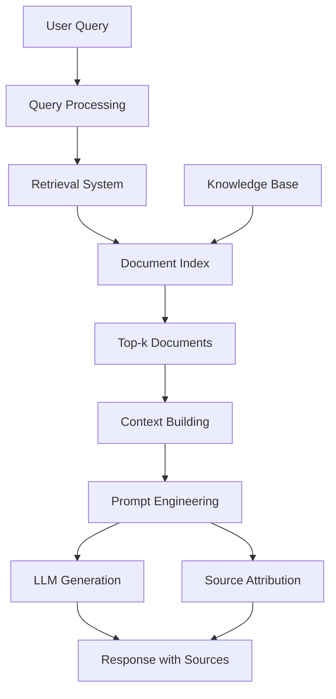

# 📚 **RAG Fundamentals & Theory**

_Complete theoretical foundation for Retrieval-Augmented Generation systems_

---

## 📖 **Table of Contents**

1. [Introduction to RAG](#1-introduction-to-rag)
2. [Core RAG Architecture](#2-core-rag-architecture)
3. [RAG Components Deep Dive](#3-rag-components-deep-dive)
4. [RAG Pipeline Implementation](#4-rag-pipeline-implementation)
5. [Advanced RAG Techniques](#5-advanced-rag-techniques)
6. [RAG vs Traditional LLMs](#6-rag-vs-traditional-llms)
7. [RAG Evaluation and Metrics](#7-rag-evaluation-and-metrics)
8. [Production RAG Systems](#8-production-rag-systems)
9. [RAG Security and Privacy](#9-rag-security-and-privacy)
10. [Future RAG Trends](#10-future-rag-trends)

---

## **1. Introduction to RAG**

### **1.1 What is Retrieval-Augmented Generation?**

**Retrieval-Augmented Generation (RAG)** is a hybrid AI approach that combines the generative capabilities of large language models with the knowledge retrieval from external information sources. The fundamental concept is simple yet powerful: instead of relying solely on the model's training data, RAG systems dynamically retrieve relevant information from knowledge bases to enhance and ground the generation process.

**Core Principle:**

```
RAG = Retrieval + Augmentation + Generation
```

**Traditional LLM vs RAG Comparison:**

| **Aspect**              | **Traditional LLM**    | **RAG System**                  |
| ----------------------- | ---------------------- | ------------------------------- |
| **Knowledge Source**    | Static training data   | Dynamic external retrieval      |
| **Knowledge Freshness** | Fixed at training time | Real-time/updated               |
| **Factuality**          | May hallucinate        | Grounded in retrieved sources   |
| **Transparency**        | Black box              | Source attribution possible     |
| **Customization**       | Requires fine-tuning   | Can add new knowledge instantly |
| **Scalability**         | Limited by model size  | Leverages external knowledge    |

### **1.2 RAG Problem Statement**

**The Knowledge Challenge:**

- LLMs have knowledge cutoffs (e.g., GPT-4: April 2024)
- Fine-tuning is expensive and time-consuming
- Models may hallucinate or provide outdated information
- Domain-specific knowledge is difficult to encode

**The RAG Solution:**

- Retrieve up-to-date, relevant information on-demand
- Ground generation in factual sources
- Enable continuous knowledge updates without retraining
- Provide transparency through source attribution

### **1.3 RAG Use Cases and Applications**

**Primary Use Cases:**

1. **Question Answering Systems**
   - Customer support chatbots
   - Educational assistants
   - Knowledge base interfaces

2. **Document Analysis and Summarization**
   - Research paper analysis
   - Legal document review
   - Medical record processing

3. **Content Generation**
   - News article writing with sources
   - Technical documentation
   - Marketing content with citations

4. **Enterprise Applications**
   - Internal knowledge management
   - Policy and procedure retrieval
   - Compliance checking

5. **Research and Development**
   - Literature review assistance
   - Hypothesis generation
   - Cross-domain knowledge synthesis

---

## **2. Core RAG Architecture**

### **2.1 High-Level RAG Architecture**



### **2.2 RAG Architecture Components**

**1. Query Processing Layer**

- **Purpose**: Understand and optimize user queries
- **Components**:
  - Query expansion and reformulation
  - Intent classification
  - Query normalization

**2. Retrieval Layer**

- **Purpose**: Find relevant documents efficiently
- **Components**:
  - Vector embeddings
  - Search indices
  - Ranking algorithms
  - Query-document similarity scoring

**3. Knowledge Storage Layer**

- **Purpose**: Store and organize external knowledge
- **Components**:
  - Document repositories
  - Vector databases
  - Knowledge graphs
  - Metadata management

**4. Context Building Layer**

- **Purpose**: Create optimal context for generation
- **Components**:
  - Document chunking
  - Context window management
  - Relevance filtering
  - Redundancy removal

**5. Generation Layer**

- **Purpose**: Produce final responses
- **Components**:
  - Prompt templates
  - LLM integration
  - Response formatting
  - Source attribution

### **2.3 RAG Data Flow**

```
1. INPUT: User Query (Q)
   ↓
2. PROCESSING: Query Embedding (E(Q))
   ↓
3. RETRIEVAL: Document Search (E(Q) ↔ Documents)
   ↓
4. FILTERING: Top-k Relevant Documents (D₁, D₂, ..., Dₖ)
   ↓
5. CONTEXT: Context Assembly (Q + Context[D₁..Dₖ])
   ↓
6. GENERATION: LLM Response (R = LLM(Q + Context))
   ↓
7. OUTPUT: Response + Sources (R + [D₁..Dₖ])
```

---

## **3. RAG Components Deep Dive**

### **3.1 Document Processing and Chunking**

**Document Processing Pipeline:**

```python
class DocumentProcessor:
    def __init__(self):
        self.splitters = {
            'semantic': SemanticSplitter(),
            'fixed': FixedSizeSplitter(),
            'sliding': SlidingWindowSplitter()
        }

    def process_document(self, document, split_strategy='semantic'):
        # 1. Document parsing
        text = self.parse_document(document)

        # 2. Chunking strategy selection
        chunks = self.splitters[split_strategy].split(text)

        # 3. Metadata extraction
        processed_chunks = []
        for chunk in chunks:
            metadata = self.extract_metadata(chunk, document)
            processed_chunks.append({
                'text': chunk,
                'metadata': metadata,
                'embedding': self.embed_chunk(chunk)
            })

        return processed_chunks
```

**Chunking Strategies:**

1. **Fixed-Size Chunking**
   - Split by character/word count
   - Simple and fast
   - May break semantic units

2. **Semantic Chunking**
   - Split at semantic boundaries
   - Preserves meaning coherence
   - Requires more processing

3. **Sliding Window Chunking**
   - Overlapping chunks
   - Better context preservation
   - Increased storage overhead

**Chunk Optimization Best Practices:**

```python
# Optimal chunk sizes by use case
CHUNK_STRATEGIES = {
    'qa_pairs': {'size': 128, 'overlap': 20},
    'document_qa': {'size': 256, 'overlap': 40},
    'summarization': {'size': 512, 'overlap': 80},
    'code_analysis': {'size': 400, 'overlap': 50}
}
```

### **3.2 Embedding Models and Vector Representations**

**Embedding Model Selection:**

| **Model**         | **Dimensions** | **Specialization**  | **Use Case**       |
| ----------------- | -------------- | ------------------- | ------------------ |
| **OpenAI Ada**    | 1536           | General purpose     | Cross-domain       |
| **OpenAI E5**     | 1024           | Instruction-tuned   | Query-doc matching |
| **Sentence-BERT** | 768-1024       | Sentence similarity | Multi-lingual      |
| **ColBERT**       | 128            | Late interaction    | Large corpora      |
| **BGE**           | 768-1024       | Bilingual           | Chinese/English    |

**Vector Database Integration:**

```python
class VectorStore:
    def __init__(self, model_name='text-embedding-ada-002'):
        self.embedding_model = SentenceTransformer(model_name)
        self.vector_db = self._init_vector_db()

    def _init_vector_db(self):
        # Support multiple vector databases
        return {
            'faiss': self._init_faiss(),
            'chroma': self._init_chroma(),
            'pinecone': self._init_pinecone(),
            'weaviate': self._init_weaviate()
        }

    def add_documents(self, documents):
        # Generate embeddings
        embeddings = self.embedding_model.encode(documents)

        # Store in vector database
        self.vector_db['chroma'].add(
            embeddings=embeddings,
            documents=documents
        )

    def similarity_search(self, query, k=5):
        query_embedding = self.embedding_model.encode([query])
        results = self.vector_db['chroma'].query(
            query_embeddings=query_embedding,
            n_results=k
        )
        return results
```

### **3.3 Retrieval Strategies**

**Dense Retrieval:**

- Uses semantic embeddings
- Captures semantic similarity
- Better handling of paraphrases

**Sparse Retrieval:**

- Traditional keyword matching (BM25, TF-IDF)
- Fast and efficient
- Good for exact term matching

**Hybrid Retrieval:**

```python
class HybridRetriever:
    def __init__(self):
        self.dense_retriever = DenseRetriever()
        self.sparse_retriever = BM25Retriever()
        self.fusion_strategy = 'rrf'  # Reciprocal Rank Fusion

    def retrieve(self, query, k=10):
        # Get results from both retrievers
        dense_results = self.dense_retriever.search(query, k*2)
        sparse_results = self.sparse_retriever.search(query, k*2)

        # Fusion strategy
        return self.fusion_results(dense_results, sparse_results)

    def rrf_fusion(self, dense, sparse, k=60):
        # Reciprocal Rank Fusion
        combined_scores = {}

        for i, (doc_id, score) in enumerate(dense):
            combined_scores[doc_id] = 1.0 / (k + i + 1)

        for i, (doc_id, score) in enumerate(sparse):
            if doc_id in combined_scores:
                combined_scores[doc_id] += 1.0 / (k + i + 1)
            else:
                combined_scores[doc_id] = 1.0 / (k + i + 1)

        # Return top k
        sorted_docs = sorted(combined_scores.items(),
                           key=lambda x: x[1], reverse=True)
        return sorted_docs[:10]
```

---

## **4. RAG Pipeline Implementation**

### **4.1 Basic RAG Pipeline**

```python
class BasicRAGPipeline:
    def __init__(self,
                 embedding_model="text-embedding-ada-002",
                 llm_model="gpt-3.5-turbo",
                 chunk_size=512,
                 chunk_overlap=50):

        self.embedding_model = self._load_embedding_model(embedding_model)
        self.llm = self._load_llm(llm_model)
        self.chunk_size = chunk_size
        self.chunk_overlap = chunk_overlap

        # Initialize components
        self.document_processor = DocumentProcessor(chunk_size, chunk_overlap)
        self.vector_store = VectorStore(embedding_model)
        self.retriever = HybridRetriever()

    def index_documents(self, documents):
        """Index a collection of documents"""
        for doc in documents:
            # Process document into chunks
            chunks = self.document_processor.process(doc)

            # Store chunks and embeddings
            for chunk in chunks:
                self.vector_store.add_document(
                    text=chunk['text'],
                    metadata=chunk['metadata']
                )

        print(f"Indexed {len(documents)} documents")

    def query(self, question, top_k=5):
        """Answer a question using RAG"""

        # 1. Retrieve relevant documents
        relevant_docs = self.retriever.search(question, top_k)

        # 2. Build context
        context = self._build_context(relevant_docs)

        # 3. Generate prompt
        prompt = self._create_prompt(question, context)

        # 4. Generate response
        response = self.llm.generate(prompt)

        # 5. Add source attribution
        response_with_sources = self._format_with_sources(
            response, relevant_docs
        )

        return response_with_sources

    def _build_context(self, relevant_docs):
        """Build context from retrieved documents"""
        context_parts = []
        for i, (doc, score) in enumerate(relevant_docs):
            context_parts.append(f"[{i+1}] {doc['text']}")

        return "\n\n".join(context_parts)

    def _create_prompt(self, question, context):
        """Create prompt for LLM generation"""
        return f"""
Use the following context to answer the question.
Cite your sources using the [n] format.

Context:
{context}

Question: {question}

Answer:
"""
```

### **4.2 Advanced RAG Pipeline with Streaming**

```python
class StreamingRAGPipeline(BasicRAGPipeline):
    def __init__(self, *args, **kwargs):
        super().__init__(*args, **kwargs)
        self.cache = LRUCache(maxsize=1000)

    async def stream_query(self, question, top_k=5):
        """Stream response with incremental updates"""

        # Check cache first
        cache_key = f"{question}_{top_k}"
        if cache_key in self.cache:
            yield f"📚 Found cached result\n\n"
            yield self.cache[cache_key]
            return

        yield f"🔍 Searching for relevant information...\n\n"

        # Step 1: Retrieve documents
        relevant_docs = await self._async_retrieve(question, top_k)
        yield f"✅ Found {len(relevant_docs)} relevant documents\n\n"

        # Step 2: Build context
        context = self._build_context(relevant_docs)
        yield f"📝 Building context from {len(relevant_docs)} sources\n\n"

        # Step 3: Stream LLM response
        async for chunk in self.llm.stream_generate(
            question, context, relevant_docs
        ):
            yield chunk

        # Cache result
        final_response = self.cache[cache_key]  # Would be constructed properly
        self.cache[cache_key] = final_response

    async def _async_retrieve(self, question, top_k):
        """Async retrieval for better performance"""
        # Implementation would use async vector DB operations
        pass
```

---

## **5. Advanced RAG Techniques**

### **5.1 Multi-Hop Reasoning**

**Concept**: Enable RAG systems to reason through multiple retrieval steps to answer complex questions.

```python
class MultiHopRAG:
    def __init__(self, max_hops=3):
        self.max_hops = max_hops
        self.hop_threshold = 0.7

    def query(self, question):
        """Multi-hop reasoning pipeline"""
        current_question = question
        evidence_chain = []

        for hop in range(self.max_hops):
            # Retrieve evidence for current question
            evidence = self.retriever.search(current_question, k=3)

            # Check if we have enough evidence
            if self._sufficient_evidence(evidence):
                break

            # Generate next question based on evidence
            next_question = self._generate_follow_up_question(
                current_question, evidence
            )

            evidence_chain.append({
                'hop': hop + 1,
                'question': current_question,
                'evidence': evidence,
                'confidence': self._calculate_confidence(evidence)
            })

            current_question = next_question

        # Final answer generation with all evidence
        return self._generate_final_answer(question, evidence_chain)

    def _generate_follow_up_question(self, question, evidence):
        """Generate next question based on retrieved evidence"""
        context = self._format_evidence_for_questioning(evidence)

        prompt = f"""
        Given the question "{question}" and the following evidence:
        {context}

        What follow-up question should we ask to get more information?
        Focus on filling knowledge gaps.
        """

        return self.llm.generate(prompt)
```

### **5.2 RAG Fusion with Knowledge Graphs**

```python
class GraphRAG:
    def __init__(self):
        self.knowledge_graph = self._load_knowledge_graph()
        self.rag = BasicRAGPipeline()

    def query(self, question):
        """RAG with knowledge graph enhancement"""

        # Step 1: Extract entities and relationships from question
        entities = self._extract_entities(question)

        # Step 2: Retrieve from knowledge graph
        graph_context = self._retrieve_from_graph(entities)

        # Step 3: Traditional document retrieval
        doc_context = self.rag.retriever.search(question, k=5)

        # Step 4: Fusion of graph and document evidence
        fused_context = self._fuse_contexts(graph_context, doc_context)

        # Step 5: Generate answer with graph-aware prompt
        return self._generate_graph_aware_answer(question, fused_context)

    def _extract_entities(self, text):
        """Extract named entities and relationships"""
        # Use NLP to extract entities
        entities = self.nlp.extract_entities(text)
        return entities

    def _retrieve_from_graph(self, entities):
        """Query knowledge graph for related information"""
        graph_paths = []
        for entity in entities:
            paths = self.knowledge_graph.find_paths(entity)
            graph_paths.extend(paths)

        return self._format_graph_paths(graph_paths)

    def _fuse_contexts(self, graph_context, doc_context):
        """Intelligent fusion of graph and document contexts"""
        # Score and rank combined evidence
        fusion_scores = self._calculate_fusion_scores(
            graph_context, doc_context
        )

        # Return top-k fused context
        return self._select_top_fused_context(fusion_scores)
```

### **5.3 Adaptive RAG with Self-Reflection**

```python
class AdaptiveRAG:
    def __init__(self):
        self.rag = BasicRAGPipeline()
        self.reflection_model = ReflectionModel()
        self.answer_scorer = AnswerScorer()

    def query_with_reflection(self, question):
        """RAG with iterative self-improvement"""

        # Initial answer
        initial_answer = self.rag.query(question)

        # Evaluate initial answer quality
        quality_score = self.answer_scorer.evaluate(question, initial_answer)

        # If quality is poor, try to improve
        if quality_score < 0.7:
            # Reflect on what's missing or wrong
            reflection = self.reflection_model.analyze(question, initial_answer)

            # Generate improved query based on reflection
            improved_query = self._improve_query(question, reflection)

            # Retry with improved query
            improved_answer = self.rag.query(improved_query)

            # Combine insights from both attempts
            final_answer = self._combine_answers(
                initial_answer, improved_answer, reflection
            )

            return final_answer

        return initial_answer

    def _improve_query(self, original_question, reflection):
        """Generate improved query based on reflection"""
        prompt = f"""
        Original question: "{original_question}"
        Reflection on answer quality: {reflection}

        Generate an improved, more specific question that would help
        get better information.
        """

        return self.reflection_model.generate(prompt)
```

---

## **6. RAG vs Traditional LLMs**

### **6.1 Comparison Framework**

| **Dimension**              | **Traditional LLM**   | **RAG System**               |
| -------------------------- | --------------------- | ---------------------------- |
| **Knowledge Freshness**    | Training cutoff date  | Real-time knowledge          |
| **Knowledge Scope**        | Fixed training corpus | Unlimited external knowledge |
| **Factuality**             | May hallucinate       | Grounded in sources          |
| **Customization**          | Requires fine-tuning  | Add knowledge instantly      |
| **Source Transparency**    | Black box             | Full source attribution      |
| **Domain Adaptation**      | Expensive retraining  | Simple knowledge addition    |
| **Hallucination Risk**     | High for new domains  | Reduced with retrieval       |
| **Computational Cost**     | Single inference      | Retrieval + inference        |
| **Development Complexity** | Simple API usage      | Multi-component system       |
| **Maintenance**            | Model updates needed  | Knowledge base updates       |

### **6.2 When to Use RAG**

**Choose RAG When:**

- ✅ Knowledge changes frequently
- ✅ Need source attribution
- ✅ Working with domain-specific documents
- ✅ Requiring factuality guarantees
- ✅ Need to cite external sources
- ✅ Dealing with large document corpora
- ✅ Building enterprise knowledge systems

**Choose Traditional LLM When:**

- ✅ Knowledge is relatively static
- ✅ Creativity is more important than factuality
- ✅ No source attribution needed
- ✅ Working with general knowledge
- ✅ Simple Q&A without citations
- ✅ Speed is critical
- ✅ Budget is limited

### **6.3 Hybrid Approaches**

**Fine-tuned RAG:**

```python
class FineTunedRAG:
    def __init__(self):
        # Base RAG capabilities
        self.rag = BasicRAGPipeline()

        # Domain-specific fine-tuning
        self.fine_tuned_llm = self._load_fine_tuned_model()

    def query(self, question):
        # Try RAG first for factual grounding
        rag_answer = self.rag.query(question)

        # Enhance with fine-tuned model capabilities
        enhanced_answer = self.fine_tuned_llm.enhance_response(
            question, rag_answer
        )

        return enhanced_answer
```

---

## **7. RAG Evaluation and Metrics**

### **7.1 RAG Evaluation Framework**

**Evaluation Dimensions:**

1. **Retrieval Quality**
   - Relevance scoring
   - Recall and precision
   - Coverage analysis

2. **Generation Quality**
   - Groundedness
   - Faithfulness to sources
   - Answer completeness

3. **System Performance**
   - Response time
   - Throughput
   - Resource utilization

### **7.2 Automated Evaluation Metrics**

```python
class RAGEvaluator:
    def __init__(self):
        self.metrics = {
            'retrieval': RetrievalMetrics(),
            'generation': GenerationMetrics(),
            'performance': PerformanceMetrics()
        }

    def evaluate_rag_system(self, test_dataset):
        results = {}

        for query, expected_answer, expected_sources in test_dataset:
            # Get RAG response
            rag_response = self.rag.query(query)

            # Evaluate retrieval
            retrieval_score = self.metrics['retrieval'].evaluate(
                query, rag_response.sources
            )

            # Evaluate generation
            generation_score = self.metrics['generation'].evaluate(
                query, rag_response.answer, expected_answer
            )

            # Calculate groundedness
            groundedness = self._calculate_groundedness(
                rag_response.answer, rag_response.sources
            )

            results[query] = {
                'retrieval_score': retrieval_score,
                'generation_score': generation_score,
                'groundedness': groundedness,
                'response_time': rag_response.time_taken
            }

        return self._aggregate_results(results)

    def _calculate_groundedness(self, answer, sources):
        """Calculate how well the answer is grounded in sources"""
        # Use NLP to check factual alignment
        factual_alignment = self.nlp.check_factual_alignment(
            answer, sources
        )

        # Check for unsupported claims
        unsupported_claims = self.nlp.find_unsupported_claims(
            answer, sources
        )

        return factual_alignment - 0.1 * unsupported_claims
```

### **7.3 Human Evaluation Protocols**

**Human Evaluation Categories:**

1. **Answer Quality**
   - Accuracy (0-5 scale)
   - Completeness (0-5 scale)
   - Clarity (0-5 scale)

2. **Source Quality**
   - Relevance (0-5 scale)
   - Credibility (0-5 scale)
   - Diversity (0-5 scale)

3. **User Experience**
   - Helpfulness (0-5 scale)
   - Trustworthiness (0-5 scale)
   - Satisfaction (0-5 scale)

**Evaluation Template:**

```markdown
# RAG System Evaluation

## Query: [User Question]

## RAG Response: [System Response]

## Source Documents:

1. [Source 1 with metadata]
2. [Source 2 with metadata]
   ...

## Human Evaluation:

### Answer Quality

- Accuracy: \_\_\_/5
- Completeness: \_\_\_/5
- Clarity: \_\_\_/5

### Source Quality

- Relevance: \_\_\_/5
- Credibility: \_\_\_/5
- Diversity: \_\_\_/5

### User Experience

- Helpfulness: \_\_\_/5
- Trustworthiness: \_\_\_/5
- Satisfaction: \_\_\_/5

### Overall Rating: \_\_\_/5

## Comments:

[Human feedback and specific issues]
```

---

## **8. Production RAG Systems**

### **8.1 Scalability Architecture**

```python
class ProductionRAGSystem:
    def __init__(self, config):
        self.config = config

        # Microservices architecture
        self.retrieval_service = RetrievalService()
        self.generation_service = GenerationService()
        self.cache_service = CacheService()
        self.monitoring_service = MonitoringService()

        # Load balancing and scaling
        self.load_balancer = LoadBalancer()

    async def handle_query(self, request):
        """Production query handling with scaling"""

        # Start monitoring
        start_time = time.time()

        try:
            # Cache check
            cached_result = self.cache_service.get(request.query)
            if cached_result:
                return CachedResponse(cached_result)

            # Route to appropriate service instance
            retriever = self.load_balancer.get_retrieval_instance()
            generator = self.load_balancer.get_generation_instance()

            # Parallel processing for performance
            retrieval_task = asyncio.create_task(
                retriever.retrieve(request.query)
            )

            # Stream results back
            async for partial_result in self._stream_pipeline(
                request, retriever, generator
            ):
                yield partial_result

            # Cache successful results
            final_result = await self._get_final_result(request)
            self.cache_service.set(request.query, final_result)

        except Exception as e:
            await self.monitoring_service.log_error(request, e)
            raise
        finally:
            await self.monitoring_service.log_performance(
                request, time.time() - start_time
            )
```

### **8.2 Performance Optimization**

**Caching Strategies:**

```python
class RAGCache:
    def __init__(self):
        self.query_cache = LRUCache(maxsize=10000)
        self.embedding_cache = LRUCache(maxsize=50000)
        self.result_cache = RedisCache(ttl=3600)

    def get_cached_answer(self, query):
        """Multi-level caching for performance"""

        # Level 1: Fast in-memory cache
        cached = self.query_cache.get(query)
        if cached:
            return cached

        # Level 2: Persistent cache
        cached = self.result_cache.get(query)
        if cached:
            self.query_cache.set(query, cached)
            return cached

        return None

    def cache_answer(self, query, answer, ttl=3600):
        """Cache answer with TTL"""
        self.query_cache.set(query, answer)
        self.result_cache.set(query, answer, ttl=ttl)
```

**Index Optimization:**

```python
class OptimizedIndex:
    def __init__(self):
        self.primary_index = FaissIndex()
        self.approximate_index = HNSWIndex()
        self.hybrid_index = HybridIndex()

    def optimize_for_query_type(self, query, query_type):
        """Route queries to optimized indices"""

        if query_type == 'semantic':
            return self.hybrid_index.search(query)
        elif query_type == 'exact':
            return self.primary_index.search(query)
        elif query_type == 'approximate':
            return self.approximate_index.search(query)
```

### **8.3 Monitoring and Observability**

```python
class RAGMonitoring:
    def __init__(self):
        self.metrics = {
            'query_latency': Histogram('rag_query_duration'),
            'retrieval_latency': Histogram('rag_retrieval_duration'),
            'generation_latency': Histogram('rag_generation_duration'),
            'cache_hit_rate': Gauge('rag_cache_hit_rate'),
            'answer_quality': Gauge('rag_answer_quality'),
            'user_satisfaction': Gauge('rag_user_satisfaction')
        }

    def log_query_metrics(self, query, response):
        """Log comprehensive metrics for each query"""

        # Performance metrics
        self.metrics['query_latency'].observe(response.total_time)
        self.metrics['retrieval_latency'].observe(response.retrieval_time)
        self.metrics['generation_latency'].observe(response.generation_time)

        # Quality metrics
        if hasattr(response, 'quality_score'):
            self.metrics['answer_quality'].set(response.quality_score)

        # Cache metrics
        cache_hit = 1 if response.cached else 0
        self.metrics['cache_hit_rate'].observe(cache_hit)

        # Log detailed information
        self.log_structured_data({
            'query': query,
            'response_length': len(response.answer),
            'sources_count': len(response.sources),
            'model_used': response.model,
            'timestamp': time.time()
        })
```

---

## **9. RAG Security and Privacy**

### **9.1 Data Privacy in RAG**

**Privacy-Preserving RAG:**

```python
class PrivateRAG:
    def __init__(self):
        self.encryption_service = EncryptionService()
        self.privacy_filter = PrivacyFilter()
        self.anonymizer = DataAnonymizer()

    def secure_retrieval(self, query):
        """Retrieve information while preserving privacy"""

        # Anonymize sensitive information in query
        anonymized_query = self.anonymizer.anonymize(query)

        # Apply privacy filters
        filtered_query = self.privacy_filter.filter(anonymized_query)

        # Perform retrieval
        results = self.retriever.search(filtered_query)

        # Filter results for privacy compliance
        secure_results = []
        for result in results:
            # Check for sensitive information
            if self.privacy_filter.contains_pii(result):
                # Anonymize or exclude
                sanitized = self.privacy_filter.sanitize(result)
                secure_results.append(sanitized)
            else:
                secure_results.append(result)

        return secure_results

    def encrypt_documents(self, documents):
        """Encrypt sensitive documents before indexing"""
        encrypted_docs = []

        for doc in documents:
            # Encrypt document content
            encrypted_content = self.encryption_service.encrypt(doc.content)

            # Create encrypted document
            encrypted_doc = EncryptedDocument(
                content=encrypted_content,
                metadata=doc.metadata,
                encryption_key=doc.encryption_key
            )

            encrypted_docs.append(encrypted_doc)

        return encrypted_docs
```

### **9.2 Access Control and Authorization**

```python
class SecureRAG:
    def __init__(self):
        self.access_control = AccessControl()
        self.document_classifier = DocumentClassifier()
        self.audit_logger = AuditLogger()

    def authorize_query(self, user, query):
        """Ensure user has access to requested information"""

        # Log query attempt
        self.audit_logger.log_query_attempt(user, query)

        # Check user permissions
        if not self.access_control.has_permission(user, query):
            raise AccessDeniedError(f"User {user} not authorized for query")

        # Classify query sensitivity
        sensitivity_level = self.document_classifier.classify(query)

        # Check user clearance level
        user_clearance = self.access_control.get_clearance(user)

        if user_clearance < sensitivity_level:
            raise InsufficientClearanceError(
                f"User clearance {user_clearance} < required {sensitivity_level}"
            )

        # Retrieve documents based on permissions
        authorized_docs = self.retriever.search_with_permissions(
            query, user
        )

        return authorized_docs

    def audit_access(self, user, query, results):
        """Log all document access for audit purposes"""
        self.audit_logger.log_document_access({
            'user': user.id,
            'query': query,
            'documents_accessed': [doc.id for doc in results],
            'timestamp': time.time(),
            'ip_address': user.ip_address,
            'user_agent': user.user_agent
        })
```

---

## **10. Future RAG Trends**

### **10.1 Next-Generation RAG (RAG 2.0)**

**Advanced RAG Features (2025-2030):**

1. **Real-Time Knowledge Integration**
   - Continuous knowledge updates
   - Streaming document ingestion
   - Dynamic knowledge graphs

2. **Multi-Modal RAG**
   - Text + Image + Audio retrieval
   - Cross-modal understanding
   - Unified embedding spaces

3. **Adaptive and Personalized RAG**
   - User-specific knowledge bases
   - Learning from user feedback
   - Personalized retrieval strategies

4. **Explainable RAG**
   - Transparent reasoning chains
   - Decision explanation
   - Bias detection and mitigation

### **10.2 RAG Integration with AI Agents**

```python
class AgenticRAG:
    def __init__(self):
        self.rag = RAGSystem()
        self.agent_planner = AgentPlanner()
        self.task_executor = TaskExecutor()

    async def agentic_query(self, user_request):
        """RAG-powered AI agent for complex tasks"""

        # Plan approach
        plan = self.agent_planner.create_plan(user_request)

        results = []
        for step in plan.steps:
            if step.requires_knowledge:
                # Use RAG for knowledge-dependent steps
                knowledge = self.rag.query(step.knowledge_query)
                step_result = await self.task_executor.execute(
                    step, knowledge
                )
                results.append(step_result)
            else:
                # Direct execution for non-knowledge steps
                step_result = await self.task_executor.execute(step)
                results.append(step_result)

        # Synthesize final response
        return self._synthesize_agentic_response(results)
```

### **10.3 Emerging RAG Architectures**

**Hierarchical RAG:**

- Multi-level document organization
- Hierarchical retrieval strategies
- Efficient large-scale indexing

**Federated RAG:**

- Distributed knowledge sources
- Privacy-preserving retrieval
- Collaborative learning

**Quantum-Enhanced RAG:**

- Quantum computing for optimization
- Quantum search algorithms
- Advanced similarity computations

---

## **🎯 Summary**

RAG (Retrieval-Augmented Generation) represents a paradigm shift in how AI systems access and utilize knowledge. By combining the generative power of large language models with dynamic retrieval from external knowledge sources, RAG systems address key limitations of traditional AI while opening new possibilities for knowledge-intensive applications.

**Key Takeaways:**

- **Foundation**: RAG combines retrieval, augmentation, and generation for grounded AI responses
- **Architecture**: Multi-component systems with document processing, vector storage, and LLM integration
- **Implementation**: Range from basic pipelines to advanced multi-hop reasoning and agentic systems
- **Evaluation**: Comprehensive metrics covering retrieval quality, generation quality, and performance
- **Production**: Requires scalability, security, privacy, and monitoring considerations
- **Future**: Moving toward real-time, multi-modal, and explainable RAG systems

**Next Steps:**

- Explore hands-on implementations in RAG Practice Exercises
- Review quick reference materials in RAG Cheatsheet
- Prepare for technical interviews using RAG Interview Preparation

---

_This comprehensive theory foundation provides the conceptual framework needed to understand, build, and optimize RAG systems across various domains and use cases._
