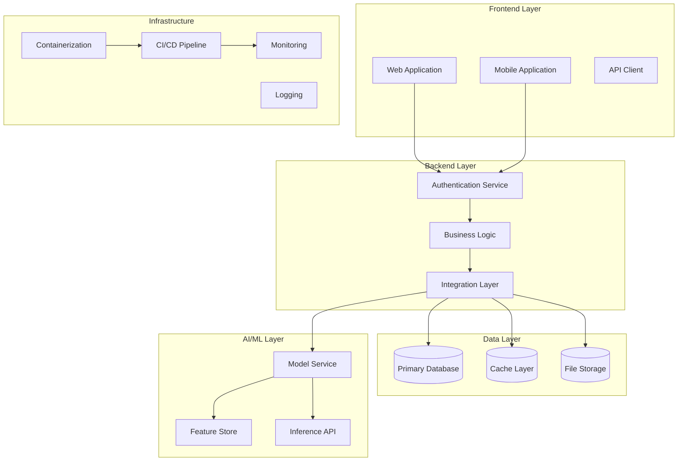

# Project 1: Capstone Project Planning and Execution

## Capstone Domain - Project Orchestration and Portfolio Development

### 1.1 Business Case and Problem Statement

#### The Capstone Challenge

The capstone project represents the culmination of all technical skills developed throughout the learning journey. Unlike previous projects that focus on specific technical domains, the capstone requires orchestrating multiple technologies, methodologies, and tools into a coherent, production-ready system that demonstrates professional competency. This challenge is fundamentally different because it requires not just technical implementation but project planning, stakeholder management, scope control, and portfolio-quality deliverables that can serve as the centerpiece of a professional portfolio.

Many technical learners struggle with the transition from guided exercises to self-directed project development. The absence of explicit instructions, predefined requirements, and clear success criteria creates anxiety and often leads to either scope creep or insufficient ambition. The capstone addresses this by providing a structured planning framework while leaving implementation decisions to the learner, creating a realistic simulation of professional project management.

The portfolio value of a well-executed capstone extends far beyond the learning experience. Recruiters and hiring managers consistently report that concrete project demonstrations are among the most influential factors in technical hiring decisions. A capstone project that addresses a real problem, demonstrates production-grade engineering practices, and includes comprehensive documentation can significantly accelerate career advancement and open doors to opportunities that purely theoretical knowledge cannot access.

This project guides learners through the complete capstone lifecycle: from initial idea generation and requirements definition through architecture design, implementation planning, execution, and final presentation. The output is not just a working application but a portfolio-ready demonstration of professional-level capabilities across the full software development lifecycle.

#### Market Context and Opportunity

The technology industry continues to experience significant talent shortages across multiple specializations, with employers increasingly prioritizing practical demonstration of skills over credential-based evaluation. Open source contributions, published projects, and demonstrated implementation experience consistently outperform traditional evaluation methods in predicting job performance and cultural fit.

The portfolio economy has transformed how technical professionals market themselves. Platforms like GitHub, LinkedIn, and personal websites serve as primary professional identities for developers, data scientists, and engineers. A standout capstone project can generate ongoing visibility, networking opportunities, and career advancement that compounds over time.

For those pursuing entrepreneurship, the capstone serves as a potential foundation for MVP development. Many successful technology ventures began as capstone or thesis projects that demonstrated market fit and technical feasibility. The skills developed in scope management, MVP definition, and rapid iteration transfer directly to startup contexts.

#### Success Metrics and Acceptance Criteria

The capstone project must demonstrate professional-level execution across multiple dimensions. Technical implementation must include at least three integrated technologies working together cohesively. The application must be deployable to production infrastructure with automated deployment pipelines. Documentation must meet professional standards including architecture decision records, API documentation, and user guides.

Project management criteria include clear scope definition with documented boundaries, realistic timeline planning with milestone tracking, risk identification and mitigation planning, and regular progress tracking with adjustment capability. The project must demonstrate ability to make and defend technical decisions under uncertainty.

Portfolio-quality deliverables include public GitHub repository with professional README, deployed application accessible via public URL, video demonstration of key features, architecture documentation, and retrospective analysis of lessons learned. The capstone should be presentable in technical interview contexts and serve as a foundation for professional portfolio development.

### 1.2 Architecture Design

#### System Overview

The capstone architecture depends heavily on the specific project chosen, but all capstones share common structural requirements. The system must include a frontend component providing user interface functionality, a backend component handling business logic and data management, a data layer for persistent storage, and an AI/ML component demonstrating intelligent behavior. Integration between these components must follow industry-standard patterns with appropriate error handling and monitoring.

The architecture must support production deployment considerations including containerization, environment configuration, secrets management, and scalability design. Even if deployed at minimal scale for demonstration purposes, the architecture should reflect production-readiness principles that enable future scaling without fundamental redesign.



#### Technology Stack Selection Framework

The capstone should leverage technologies learned throughout the program while demonstrating ability to learn and integrate new technologies as needed. The following framework guides technology selection:

| Component | Recommended Technologies | Selection Criteria |
|-----------|-------------------------|-------------------|
| Frontend | React, Vue, Next.js | Match project requirements, demonstrate modern practices |
| Backend | Python/FastAPI, Node.js/Express, Go | Align with team skills, performance requirements |
| Database | PostgreSQL, MongoDB, Redis | Match data model and access patterns |
| AI/ML | TensorFlow, PyTorch, Hugging Face | Match use case and performance requirements |
| Infrastructure | Docker, Kubernetes, AWS/GCP/Azure | Match deployment goals, learning objectives |
| CI/CD | GitHub Actions, GitLab CI, Jenkins | Match version control platform |

Technology selection should be documented in an architecture decision record that captures the problem being solved, alternatives considered, evaluation criteria, and rationale for the final choice.

#### Data Flow Architecture

Data flow design must consider the complete lifecycle from user input through processing to storage and display. The architecture should demonstrate understanding of synchronous versus asynchronous processing patterns, event-driven architectures where appropriate, and appropriate use of caching to optimize performance.

### 1.3 Implementation Guide

#### Project Structure

```
capstone-project/
├── frontend/                          # Frontend application
│   ├── src/
│   │   ├── components/               # Reusable UI components
│   │   ├── pages/                    # Page components
│   │   ├── services/                 # API integration
│   │   ├── hooks/                    # Custom React hooks
│   │   ├── utils/                    # Utility functions
│   │   └── stores/                   # State management
│   ├── public/                       # Static assets
│   ├── tests/                        # Frontend tests
│   ├── Dockerfile                    # Container configuration
│   └── package.json                  # Dependencies
│
├── backend/                          # Backend application
│   ├── src/
│   │   ├── routes/                   # API endpoints
│   │   ├── controllers/              # Request handlers
│   │   ├── services/                 # Business logic
│   │   ├── models/                   # Data models
│   │   ├── middleware/               # Custom middleware
│   │   ├── utils/                    # Utility functions
│   │   └── config/                   # Configuration
│   ├── tests/                        # Backend tests
│   ├── Dockerfile                    # Container configuration
│   └── requirements.txt              # Python dependencies
│
├── ml/                               # Machine learning components
│   ├── src/
│   │   ├── models/                   # Model implementations
│   │   ├── training/                 # Training scripts
│   │   ├── evaluation/               # Evaluation scripts
│   │   └── serving/                  # Model serving
│   ├── data/                         # Training data
│   ├── notebooks/                    # Exploration notebooks
│   ├── tests/                        # ML tests
│   └── Dockerfile                    # ML serving container
│
├── infrastructure/                   # Infrastructure as code
│   ├── terraform/                    # Terraform configurations
│   ├── kubernetes/                   # K8s configurations
│   ├── docker-compose.yml           # Local orchestration
│   └── ansible/                     # Configuration management
│
├── docs/                             # Documentation
│   ├── architecture/                 # Architecture decision records
│   ├── api/                          # API documentation
│   ├── user-guides/                  # User documentation
│   └── deployment/                   # Deployment guides
│
├── scripts/                          # Utility scripts
│   ├── setup.sh                     # Environment setup
│   ├── test.sh                      # Test execution
│   └── deploy.sh                    # Deployment automation
│
├── .github/
│   └── workflows/                    # CI/CD workflows
│
├── .env.example                     # Environment template
├── .gitignore                       # Git ignore rules
├── docker-compose.yml               # Full stack orchestration
├── Makefile                         # Development commands
├── README.md                        # Project overview
└── LICENSE                          # Project license
```

#### Core API Implementation

```python
# backend/src/config/settings.py
from pydantic_settings import BaseSettings
from typing import List
from functools import lru_cache


class Settings(BaseSettings):
    """Application settings with environment variable support."""
    
    # Application
    app_name: str = "Capstone Project"
    debug: bool = False
    api_version: str = "v1"
    
    # Security
    secret_key: str
    jwt_algorithm: str = "HS256"
    jwt_expiration_hours: int = 24
    
    # Database
    database_url: str
    redis_url: str = "redis://localhost:6379"
    
    # External Services
    openai_api_key: str = ""
    aws_access_key_id: str = ""
    aws_secret_access_key: str = ""
    
    # CORS
    cors_origins: List[str] = ["http://localhost:3000"]
    
    class Config:
        env_file = ".env"
        env_file_encoding = "utf-8"


@lru_cache()
def get_settings() -> Settings:
    """Get cached settings instance."""
    return Settings()


# backend/src/api/deps.py
from typing import Generator, Optional
from fastapi import Depends, HTTPException, status
from sqlalchemy.orm import Session
from jose import jwt, JWTError
from redis import Redis

from app.core.security import verify_password, create_access_token
from app.core.config import get_settings
from app.db.session import get_db
from app.db.cache import get_redis
from app.models.user import User


async def get_current_user(
    token: str = Depends(oauth2_scheme),
    db: Session = Depends(get_db)
) -> User:
    """Validate JWT token and return current user."""
    credentials_exception = HTTPException(
        status_code=status.HTTP_401_UNAUTHORIZED,
        detail="Could not validate credentials",
        headers={"WWW-Authenticate": "Bearer"},
    )
    
    try:
        settings = get_settings()
        payload = jwt.decode(
            token, 
            settings.secret_key, 
            algorithms=[settings.jwt_algorithm]
        )
        user_id: str = payload.get("sub")
        if user_id is None:
            raise credentials_exception
    except JWTError:
        raise credentials_exception
    
    user = db.query(User).filter(User.id == user_id).first()
    if user is None:
        raise credentials_exception
    
    return user


async def get_current_active_user(
    current_user: User = Depends(get_current_user)
) -> User:
    """Verify user is active."""
    if not current_user.is_active:
        raise HTTPException(
            status_code=status.HTTP_400_BAD_REQUEST,
            detail="Inactive user"
        )
    return current_user


# backend/src/api/routes/users.py
from fastapi import APIRouter, Depends, HTTPException
from sqlalchemy.orm import Session
from typing import List

from app.api.deps import get_current_active_user, get_db
from app.schemas.user import UserCreate, UserUpdate, UserResponse
from app.services.user import UserService

router = APIRouter()


@router.post("/users", response_model=UserResponse, status_code=201)
async def create_user(
    user_data: UserCreate,
    db: Session = Depends(get_db)
) -> UserResponse:
    """Create new user account."""
    user_service = UserService(db)
    
    # Check if email exists
    existing = user_service.get_by_email(user_data.email)
    if existing:
        raise HTTPException(
            status_code=status.HTTP_400_BAD_REQUEST,
            detail="Email already registered"
        )
    
    user = user_service.create(user_data)
    return UserResponse.from_orm(user)


@router.get("/users/me", response_model=UserResponse)
async def get_current_user_info(
    current_user: User = Depends(get_current_active_user)
) -> UserResponse:
    """Get current authenticated user information."""
    return UserResponse.from_orm(current_user)


@router.put("/users/me", response_model=UserResponse)
async def update_current_user(
    user_data: UserUpdate,
    current_user: User = Depends(get_current_active_user),
    db: Session = Depends(get_db)
) -> UserResponse:
    """Update current user profile."""
    user_service = UserService(db)
    user = user_service.update(current_user.id, user_data)
    return UserResponse.from_orm(user)


# frontend/src/services/api.ts
import axios, { AxiosInstance, AxiosError } from 'axios';
import { useAuthStore } from '@/stores/auth';

class ApiClient {
    private client: AxiosInstance;

    constructor() {
        this.client = axios.create({
            baseURL: import.meta.env.VITE_API_URL || 'http://localhost:8000/api/v1',
            timeout: 30000,
            headers: {
                'Content-Type': 'application/json',
            },
        });

        this.client.interceptors.request.use(
            (config) => {
                const token = useAuthStore.getState().token;
                if (token) {
                    config.headers.Authorization = `Bearer ${token}`;
                }
                return config;
            },
            (error) => Promise.reject(error)
        );

        this.client.interceptors.response.use(
            (response) => response,
            async (error: AxiosError) => {
                if (error.response?.status === 401) {
                    useAuthStore.getState().logout();
                    window.location.href = '/login';
                }
                return Promise.reject(error);
            }
        );
    }

    async get<T>(url: string, params?: object): Promise<T> {
        const response = await this.client.get<T>(url, { params });
        return response.data;
    }

    async post<T>(url: string, data?: object): Promise<T> {
        const response = await this.client.post<T>(url, data);
        return response.data;
    }

    async put<T>(url: string, data?: object): Promise<T> {
        const response = await this.client.put<T>(url, data);
        return response.data;
    }

    async delete<T>(url: string): Promise<T> {
        const response = await this.client.delete<T>(url);
        return response.data;
    }
}

export const api = new ApiClient();
export default api;
```

#### Project Planning Framework

```python
# scripts/capstone_planner.py
"""
Capstone Project Planning Framework

Helps structure the capstone project from ideation through execution.
"""
from dataclasses import dataclass, field
from typing import List, Dict, Optional
from datetime import datetime, timedelta
from enum import Enum


class ProjectPhase(Enum):
    IDEATION = "ideation"
    PLANNING = "planning"
    DEVELOPMENT = "development"
    TESTING = "testing"
    DEPLOYMENT = "deployment"
    DOCUMENTATION = "documentation"
    PRESENTATION = "presentation"


@dataclass
class ProjectIdea:
    """Represents a potential capstone project idea."""
    title: str
    description: str
    problem_statement: str
    target_users: List[str]
    key_features: List[str]
    technologies: List[str]
    data_requirements: str
    ai_ml_components: str
    complexity_score: int  # 1-10
    portfolio_impact: int  # 1-10
    feasibility_score: int  # 1-10


@dataclass
class ScopeDefinition:
    """Defines project scope boundaries."""
    in_scope: List[str] = field(default_factory=list)
    out_of_scope: List[str] = field(default_factory=list)
    mvp_features: List[str] = field(default_factory=list)
    stretch_goals: List[str] = field(default_factory=list)
    technical_constraints: List[str] = field(default_factory=list)
    resource_constraints: List[str] = field(default_factory=list)


@dataclass
class Milestone:
    """Represents a project milestone."""
    name: str
    description: str
    target_date: datetime
    deliverables: List[str]
    dependencies: List[str] = field(default_factory=list)
    status: str = "pending"
    completion_date: Optional[datetime] = None


@dataclass
class Risk:
    """Represents an identified project risk."""
    description: str
    probability: str  # low, medium, high
    impact: str  # low, medium, high
    mitigation_strategy: str
    contingency_plan: str
    owner: str


class CapstonePlanner:
    """
    Helps plan and track capstone project execution.
    """
    
    def __init__(self, project_name: str, start_date: datetime, end_date: datetime):
        self.project_name = project_name
        self.start_date = start_date
        self.end_date = end_date
        self.duration_days = (end_date - start_date).days
        
        self.ideas: List[ProjectIdea] = []
        self.scope = ScopeDefinition()
        self.milestones: List[Milestone] = []
        self.risks: List[Risk] = []
        self.current_phase = ProjectPhase.IDEATION
    
    def add_idea(self, idea: ProjectIdea):
        """Add a project idea for evaluation."""
        self.ideas.append(idea)
    
    def evaluate_idea(self, idea_title: str) -> Dict:
        """Evaluate an idea against selection criteria."""
        idea = next((i for i in self.ideas if i.title == idea_title), None)
        if not idea:
            return {"error": "Idea not found"}
        
        # Calculate overall score
        overall_score = (
            idea.complexity_score * 0.2 +
            idea.portfolio_impact * 0.4 +
            idea.feasibility_score * 0.4
        )
        
        # Check resource requirements
        resource_check = self._check_resources(idea)
        
        # Generate recommendations
        recommendations = []
        if idea.complexity_score > 8:
            recommendations.append("Consider reducing scope for MVP")
        if idea.feasibility_score < 5:
            recommendations.append("Evaluate technology learning curve")
        if idea.data_requirements == "external":
            recommendations.append("Verify data access before committing")
        
        return {
            "title": idea.title,
            "overall_score": round(overall_score, 2),
            "strengths": self._identify_strengths(idea),
            "concerns": self._identify_concerns(idea),
            "resource_feasibility": resource_check,
            "recommendations": recommendations
        }
    
    def _check_resources(self, idea: ProjectIdea) -> Dict:
        """Check if idea fits within resource constraints."""
        return {
            "technical_stack": "Feasible" if len(idea.technologies) <= 5 else "Complex",
            "data_needs": "Feasible" if idea.data_requirements in ["none", "generated"] else "Verify access",
            "time_estimate": self._estimate_time(idea)
        }
    
    def _estimate_time(self, idea: ProjectIdea) -> str:
        """Estimate time required based on complexity."""
        base_weeks = idea.complexity_score * 2
        if idea.data_requirements == "external":
            base_weeks += 2
        if idea.ai_ml_components:
            base_weeks += 3
        
        if base_weeks > self.duration_days / 7:
            return f"May exceed timeline ({base_weeks} weeks estimated)"
        return f"Feasible ({base_weeks} weeks estimated)"
    
    def _identify_strengths(self, idea: ProjectIdea) -> List[str]:
        """Identify strengths of the idea."""
        strengths = []
        if idea.portfolio_impact >= 8:
            strengths.append("High portfolio impact")
        if idea.complexity_score >= 6:
            strengths.append("Demonstrates advanced skills")
        if "production" in idea.key_features:
            strengths.append("Includes deployment experience")
        if idea.ai_ml_components:
            strengths.append("Includes AI/ML component")
        return strengths
    
    def _identify_concerns(self, idea: ProjectIdea) -> List[str]:
        """Identify concerns with the idea."""
        concerns = []
        if idea.feasibility_score < 6:
            concerns.append("Technical feasibility concerns")
        if idea.data_requirements == "external":
            concerns.append("External data dependency")
        if len(idea.technologies) > 6:
            concerns.append("Multiple new technologies")
        return concerns
    
    def define_scope(self, scope: ScopeDefinition):
        """Set the project scope."""
        self.scope = scope
    
    def generate_milestones(self):
        """Generate standard milestone timeline."""
        # Calculate milestone dates
        weeks_total = self.duration_days / 7
        week_per_phase = {
            ProjectPhase.PLANNING: 1,
            ProjectPhase.DEVELOPMENT: weeks_total * 0.6,
            ProjectPhase.TESTING: weeks_total * 0.15,
            ProjectPhase.DEPLOYMENT: weeks_total * 0.1,
            ProjectPhase.DOCUMENTATION: weeks_total * 0.1,
            ProjectPhase.PRESENTATION: 1,
        }
        
        current_date = self.start_date
        phase_order = [
            ProjectPhase.PLANNING,
            ProjectPhase.DEVELOPMENT,
            ProjectPhase.TESTING,
            ProjectPhase.DEPLOYMENT,
            ProjectPhase.DOCUMENTATION,
            ProjectPhase.PRESENTATION,
        ]
        
        for phase in phase_order:
            duration_weeks = week_per_phase[phase]
            target_date = current_date + timedelta(weeks=duration_weeks)
            
            milestone = Milestone(
                name=f"{phase.value.title()} Complete",
                description=f"Complete {phase.value} phase",
                target_date=target_date,
                deliverables=self._get_phase_deliverables(phase)
            )
            
            self.milestones.append(milestone)
            current_date = target_date
    
    def _get_phase_deliverables(self, phase: ProjectPhase) -> List[str]:
        """Get standard deliverables for each phase."""
        deliverables = {
            ProjectPhase.PLANNING: [
                "Project proposal document",
                "Architecture design",
                "Scope definition",
                "Development environment setup"
            ],
            ProjectPhase.DEVELOPMENT: [
                "Core feature implementation",
                "Unit tests (80%+ coverage)",
                "Integration tests",
                "API documentation"
            ],
            ProjectPhase.TESTING: [
                "End-to-end test scenarios",
                "Performance testing",
                "Security testing",
                "Bug fixes and stabilization"
            ],
            ProjectPhase.DEPLOYMENT: [
                "Production deployment",
                "Monitoring setup",
                "Documentation complete",
                "Deployment runbook"
            ],
            ProjectPhase.DOCUMENTATION: [
                "Architecture decision records",
                "User guides",
                "API reference",
                "README updates"
            ],
            ProjectPhase.PRESENTATION: [
                "Demo video",
                "Presentation deck",
                "Portfolio update",
                "Code repository cleanup"
            ]
        }
        return deliverables.get(phase, [])
    
    def add_risk(self, risk: Risk):
        """Add an identified risk."""
        self.risks.append(risk)
    
    def generate_risk_report(self) -> Dict:
        """Generate risk assessment report."""
        risk_matrix = {"low": [], "medium": [], "high": []}
        
        for risk in self.risks:
            key = risk.probability if risk.probability in ["low", "medium", "high"] else "medium"
            risk_matrix[key].append({
                "description": risk.description,
                "impact": risk.impact,
                "mitigation": risk.mitigation_strategy,
                "contingency": risk.contingency_plan
            })
        
        return {
            "total_risks": len(self.risks),
            "by_severity": {
                "high": len(risk_matrix["high"]),
                "medium": len(risk_matrix["medium"]),
                "low": len(risk_matrix["low"])
            },
            "high_priority_actions": [
                r["description"] for r in risk_matrix["high"]
            ],
            "risk_matrix": risk_matrix
        }
    
    def generate_plan_summary(self) -> Dict:
        """Generate comprehensive project plan summary."""
        return {
            "project_name": self.project_name,
            "timeline": {
                "start_date": self.start_date.isoformat(),
                "end_date": self.end_date.isoformat(),
                "duration_weeks": round(self.duration_days / 7, 1)
            },
            "scope": {
                "in_scope": self.scope.in_scope,
                "out_of_scope": self.scope.out_of_scope,
                "mvp_features": self.scope.mvp_features,
                "stretch_goals": self.scope.stretch_goals
            },
            "milestones": [
                {
                    "name": m.name,
                    "target_date": m.target_date.isoformat(),
                    "status": m.status
                }
                for m in self.milestones
            ],
            "risk_summary": self.generate_risk_report()
        }
```

### 1.4 Common Pitfalls and Solutions

#### Pitfall 1: Scope Creep

The capstone provides flexibility that can lead to expanding requirements beyond reasonable completion within the timeline. New features are continuously added, technologies are swapped mid-project, and the MVP definition keeps moving.

**Detection:** Track feature additions against original scope document. Monitor time allocation across features. Compare planned versus actual velocity. Set up regular scope review meetings.

**Solution:** Define MVP clearly with explicit feature boundaries. Use change control process for scope modifications that requires removing equivalent scope for any addition. Set technology freeze dates. Maintain living document of scope with version tracking.

#### Pitfall 2: Technology Over-Engineering

Enthusiasm for new technologies can lead to unnecessary complexity. The latest framework, database, or infrastructure choice may not be appropriate for the actual project requirements.

**Detection:** Track technology learning time versus implementation time. Compare estimated complexity against actual complexity. Monitor for framework switches mid-project.

**Solution:** Document technology selection rationale before implementation. Use proven technologies for core functionality. Limit new technology adoption to non-critical components. Create spike proofs for unfamiliar technologies.

#### Pitfall 3: Documentation Debt

Documentation is often deferred in favor of feature development, leading to incomplete or outdated documentation that fails to add portfolio value.

**Detection:** Track documentation completeness against templates. Review documentation during milestones. Measure time spent on documentation.

**Solution:** Implement documentation-as-you-go approach with PR requirements. Create documentation templates before development. Schedule documentation sprints. Include documentation in definition of done.

### 1.5 Extension Opportunities

#### Extension 1: Open Source Contribution

Transform capstone components into open source contributions. This extends portfolio impact, builds community presence, and demonstrates contribution workflow understanding.

Technical approach: Identify reusable components suitable for open source. Create appropriate licensing and contribution guidelines. Publish to GitHub with proper documentation. Engage with community feedback.

#### Extension 2: Publication and Thought Leadership

Convert capstone learnings into blog posts, conference presentations, or technical articles. This builds professional visibility and demonstrates communication skills.

Technical approach: Identify unique insights from capstone development. Create detailed technical blog posts. Submit to relevant conferences or meetups. Build personal brand through content.

#### Extension 3: Production Scale Development

Extend deployed capstone to handle production traffic with appropriate scaling, monitoring, and reliability engineering.

Technical approach: Implement auto-scaling based on metrics. Add comprehensive monitoring and alerting. Conduct load testing and performance optimization. Implement chaos engineering for reliability.

### 1.6 Code Review Checklist

#### Project Planning

- Project proposal with clear problem statement and objectives
- Architecture design with component diagrams
- Technology selection with rationale documentation
- Scope definition with explicit boundaries
- Timeline with milestone tracking
- Risk identification and mitigation planning

#### Technical Implementation

- Clean code with consistent style and conventions
- Comprehensive unit and integration test coverage
- Error handling and logging
- Security considerations in authentication and data handling
- Performance optimization where applicable
- Containerization for deployment

#### Documentation

- Professional README with setup instructions
- Architecture decision records
- API documentation
- User guides
- Deployment runbook
- Retrospective and lessons learned

### 1.7 Project Presentation Guidelines

#### Structure

1. **Project Overview (3 minutes)**
   - Problem statement and motivation
   - Solution approach and key features
   - Target users and use cases

2. **Technical Deep-Dive (7 minutes)**
   - Architecture design decisions
   - Key technical challenges and solutions
   - AI/ML integration approach
   - Data flow and storage strategy

3. **Demo (5 minutes)**
   - Live demonstration of key features
   - Show production deployment
   - Highlight user experience

4. **Challenges and Learnings (3 minutes)**
   - Major challenges encountered
   - Solutions and workarounds
   - Key lessons learned
   - What would be done differently

5. **Future Enhancements (2 minutes)**
   - Planned improvements
   - Scalability considerations
   - Additional features

#### Presentation Requirements

- Professional slides with consistent formatting
- Live demo or recorded demonstration
- Architecture diagrams
- Code samples where relevant
- Clear, confident delivery
- Time management within allocation

### 1.8 Capstone Project Ideas

#### Idea 1: Intelligent Document Management System

Build a document management system with AI-powered search, classification, and summarization. Users can upload documents, which are automatically tagged, indexed, and made searchable using natural language queries. The system uses embeddings for semantic search and generates summaries for document preview.

**Complexity:** 7 | **Portfolio Impact:** 9 | **Feasibility:** 8

**Technologies:** React, FastAPI, PostgreSQL, Redis, OpenAI/HuggingFace embeddings, Elasticsearch

**Key Features:** Document upload and processing, automatic tagging, semantic search, summarization, user collections and sharing, version control

#### Idea 2: Predictive Maintenance Dashboard

Create an IoT analytics platform for predictive maintenance. Connect to simulated sensor data streams, train models to predict equipment failures, and provide dashboards showing equipment health and maintenance predictions.

**Complexity:** 8 | **Portfolio Impact:** 9 | **Feasibility:** 7

**Technologies:** React, FastAPI, PostgreSQL, TimescaleDB, PyTorch, Grafana, Docker

**Key Features:** Sensor data ingestion, anomaly detection, failure prediction, maintenance scheduling, alert management, reporting

#### Idea 3: Personalized Learning Platform

Build an adaptive learning platform that personalizes educational content based on user performance. The system tracks learning progress, identifies knowledge gaps, and recommends content to address weaknesses.

**Complexity:** 8 | **Portfolio Impact:** 8 | **Feasibility:** 7

**Technologies:** Next.js, FastAPI, PostgreSQL, Redis, PyTorch, Stripe (for premium features)

**Key Features:** User profiles and progress tracking, content management, adaptive learning algorithm, quiz and assessment system, recommendations, achievement system

#### Idea 4: Real-Time Collaboration Platform

Create a collaborative workspace with real-time updates, video conferencing, and shared document editing. The platform enables distributed teams to work together effectively.

**Complexity:** 9 | **Portfolio Impact:** 10 | **Feasibility:** 6

**Technologies:** Next.js, FastAPI, PostgreSQL, Redis, WebRTC, Socket.IO, WebSockets

**Key Features:** Real-time document editing, video/audio chat, presence indicators, task management, file sharing, team spaces

#### Idea 5: Financial Portfolio Optimizer

Develop an investment portfolio analysis and optimization tool. Users can track investments, visualize performance, and receive AI-powered recommendations for rebalancing based on risk tolerance and financial goals.

**Complexity:** 7 | **Portfolio Impact:** 8 | **Feasibility:** 8

**Technologies:** React, FastAPI, PostgreSQL, Redis, NumPy/SciPy, Plotly, Alpha Vantage API

**Key Features:** Portfolio tracking, performance visualization, risk analysis, optimization algorithms, rebalancing recommendations, market data integration

### 1.9 Open Source Contribution Guide

#### Contribution Areas

**Documentation Improvements**
- Add detailed setup guides for different environments
- Improve API documentation with examples
- Create troubleshooting guides

**Feature Development**
- Implement new features from issue backlog
- Improve existing functionality
- Fix bugs and security issues

**Testing and Quality**
- Add unit and integration tests
- Improve test coverage
- Implement continuous integration

**Community**
- Answer questions in issues
- Review pull requests
- Improve contributor guidelines

#### Contribution Process

1. Fork the repository
2. Create feature branch
3. Make changes following coding standards
4. Add tests for new functionality
5. Run full test suite
6. Submit pull request with description
7. Address reviewer feedback

#### Good First Issues

- Documentation improvements
- Test additions
- Bug fixes with clear reproduction steps
- Small feature enhancements
- Code refactoring for clarity
