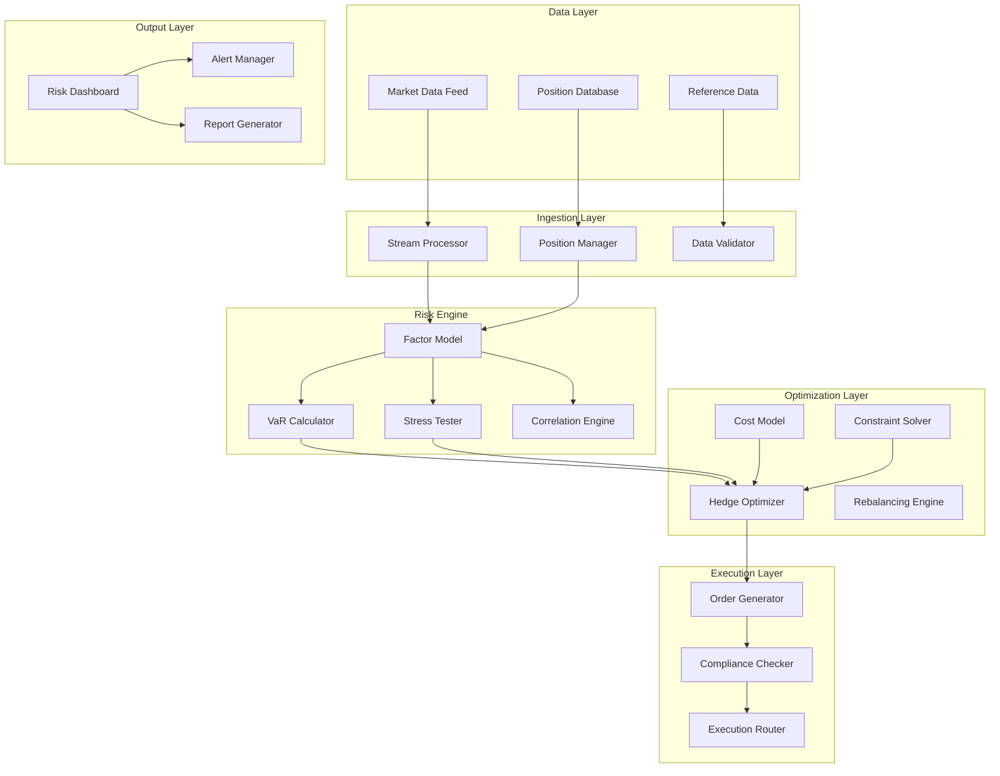

# Project 4: Financial Portfolio Risk and Hedging Optimizer

## FinTech Domain - Quantitative Analysis and Optimization

### 4.1 Business Case and Problem Statement

#### The Portfolio Management Challenge

Investment professionals and wealth managers face increasingly complex risk management requirements in volatile markets. Managing diversified portfolios across multiple asset classes, geographies, and strategies requires sophisticated analysis that balances return objectives against risk tolerances while navigating regulatory constraints and transaction costs. Traditional approaches relying on periodic rebalancing and simple risk metrics fail to capture the dynamic nature of market correlations, tail risks, and emerging threats that can rapidly erode portfolio value.

The stakes of inadequate risk management extend beyond financial losses to regulatory compliance, client relationships, and institutional reputation. Major market dislocations have repeatedly demonstrated that portfolios presumed to be diversified can experience correlated losses when risk factors unexpectedly align. The COVID-19 market crash, the 2022 bond market selloff, and numerous flash crashes have exposed limitations in traditional risk frameworks. Investment firms need real-time risk monitoring and proactive hedging strategies that adapt to changing market conditions rather than relying on static portfolio allocations.

Hedging decisions present significant optimization challenges. Over-hedging reduces returns by limiting participation in favorable market movements. Under-hedging leaves portfolios vulnerable to adverse moves. The optimal hedge ratio depends on volatility regimes, correlation structure, transaction costs, and forward-looking market expectations. Manual hedge management cannot respond to rapidly changing conditions, leading to either excessive risk exposure or unnecessary hedging costs.

This project addresses the fundamental challenge of intelligent portfolio risk optimization that combines quantitative risk measurement, optimal hedge calculation, and automated execution. By building a system that continuously monitors portfolio risk exposures, calculates optimal hedging strategies considering transaction costs and market impact, and generates executable orders, we create infrastructure that enhances risk-adjusted returns while reducing operational burden on investment teams.

#### Market Context and Opportunity

The wealth management technology market represents a substantial and growing opportunity as firms seek competitive advantages through technology. Global assets under management exceed $100 trillion, with increasing pressure on fees driving demand for efficiency improvements. Risk management systems represent a significant portion of technology spending, with AI-powered solutions commanding premium valuations due to their potential for improved outcomes.

The opportunity spans multiple market segments with distinct requirements. Asset managers managing institutional portfolios need sophisticated multi-factor risk models and hedge optimization. Wealth advisors serving high-net-worth individuals require accessible risk visualization and simplified hedging recommendations. Hedge funds demand low-latency risk monitoring and rapid hedge execution. Each segment presents unique challenges around accuracy, usability, and integration that create opportunities for specialized solutions.

The skills developed in this project transfer broadly to related domains including derivatives pricing, algorithmic trading, regulatory reporting, and stress testing. Core competencies in financial mathematics, optimization algorithms, time series analysis, and real-time data processing apply across the financial services industry.

#### Success Metrics and Acceptance Criteria

The portfolio risk optimization system must achieve specific performance targets to demonstrate production viability. Risk model accuracy must exceed 90% correlation with realized portfolio variance, measured against historical backtesting across multiple market regimes. Hedge optimization must reduce portfolio beta by 75% while limiting return drag to less than 2% annually when fully hedged.

Execution quality metrics require improvement over manual hedging. Implementation shortfall for hedge execution must remain under 15 basis points for large-cap equities and under 25 basis points for small-cap positions. Transaction cost optimization must achieve savings of 20% or greater compared to naive hedging approaches. Real-time risk calculation must complete within 100 milliseconds for portfolios containing up to 1,000 positions.

The system must handle production scale requirements. The architecture must support 10,000 concurrent portfolio risk calculations with sub-second response times. Position data updates must propagate through risk calculations within 500 milliseconds of market data receipt. System availability must meet 99.95% uptime requirements during market hours for mission-critical risk monitoring.

### 4.2 Architecture Design

#### System Overview

The portfolio risk and hedging optimizer follows an event-driven microservices architecture designed for real-time processing and scalability. The system ingests market data and position updates, processes them through risk calculation engines, optimizes hedging strategies, and generates execution recommendations. A central position database maintains portfolio state while distributed caches enable rapid risk calculations during volatile periods.

The architecture prioritizes low-latency processing for real-time risk monitoring while supporting batch processing for historical analysis and model calibration. Horizontal scaling capabilities ensure the system grows with portfolio complexity and market activity. Security considerations address the sensitive nature of portfolio data, implementing encryption, access controls, and audit trails appropriate for regulated financial institutions.



#### Technology Stack Summary

| Component | Technology | Justification |
|-----------|------------|---------------|
| API Gateway | FastAPI 0.109+ | Native async, auto-docs, type validation |
| Message Queue | Kafka 3.x | High-throughput event streaming, replay capability |
| Time Series DB | TimescaleDB | Optimized for market data, scalable time-series storage |
| Position Database | PostgreSQL 15+ | ACID compliance, complex queries, full-text search |
| Caching | Redis 7.x | Low-latency caching, pub/sub for event distribution |
| Numerical Computing | NumPy/SciPy | Vectorized operations, optimization algorithms |
| Financial Analytics | QuantLib | Industry-standard derivatives pricing, risk metrics |
| ML Pipeline | scikit-learn + XGBoost | Factor model training, regime classification |
| Frontend | React + Next.js | Interactive dashboards, real-time updates |
| Containerization | Docker + Docker Compose | Environment consistency, easy deployment |

#### Data Flow

Position updates enter the system through secure file ingestion or API submission from upstream portfolio management systems. Each update undergoes validation against reference data to verify security identifiers, position signs, and expected ranges. Validated positions are stored in the position database and published to the event stream for downstream processing.

Market data flows through a real-time stream processing pipeline that calculates derived metrics including implied volatility, forward prices, and adjusted close prices. Market data quality checks identify stale quotes, price outliers, and market integrity violations. Validated market data updates trigger recalculation of risk metrics for affected positions.

The risk calculation engine processes position and market data through multiple analytical layers. Factor model exposure calculations map individual positions to common risk factors. Value-at-Risk calculations estimate potential losses under various confidence levels. Stress testing applies historical or hypothetical scenarios to assess portfolio behavior under adverse conditions. All risk metrics are cached for rapid retrieval during volatile periods.

Hedge optimization considers current risk exposures, transaction cost estimates, and investment constraints to generate optimal hedge recommendations. The optimizer solves quadratic programming problems to minimize portfolio variance subject to hedge budget and diversification constraints. Generated hedge recommendations include expected risk reduction, cost estimates, and implementation guidelines.

Execution orders generated from hedge recommendations undergo compliance checking against portfolio guidelines, concentration limits, and regulatory requirements. Approved orders flow to execution systems while rejected orders trigger alerts and manual review workflows. Order status updates feed back into position management for accurate portfolio state maintenance.

### 4.3 Implementation Guide

#### Project Structure

```
portfolio-risk-optimizer/
├── app/
│   ├── api/
│   │   ├── __init__.py
│   │   ├── deps.py              # Dependencies injection
│   │   ├── errors.py            # Custom exceptions
│   │   └── routes/
│   │       ├── portfolios.py    # Portfolio management
│   │       ├── risk.py          # Risk endpoints
│   │       ├── hedging.py       # Hedge optimization
│   │       └── reports.py       # Report generation
│   ├── core/
│   │   ├── config.py            # Configuration management
│   │   ├── security.py          # Auth and encryption
│   │   └── logging.py           # Structured logging
│   ├── models/
│   │   ├── database.py          # SQLAlchemy models
│   │   ├── domain.py            # Pydantic schemas
│   │   ├── portfolio.py         # Portfolio models
│   │   └── risk.py              # Risk-specific models
│   ├── services/
│   │   ├── __init__.py
│   │   ├── data/
│   │   │   ├── market_data.py   # Market data ingestion
│   │   │   ├── positions.py     # Position management
│   │   │   └── reference.py     # Reference data
│   │   ├── risk/
│   │   │   ├── factor.py        # Factor model calculations
│   │   │   ├── var.py           # VaR calculations
│   │   │   └── stress.py        # Stress testing
│   │   ├── optimization/
│   │   │   ├── hedge.py         # Hedge optimization
│   │   │   ├── costs.py         # Transaction cost models
│   │   │   └── rebalance.py     # Rebalancing logic
│   │   └── execution/
│   │       ├── orders.py        # Order generation
│   │       └── compliance.py    # Compliance checking
│   └── ml/
│       ├── models/              # Trained models
│       ├── training/            # Model training scripts
│       └── evaluation/          # Model evaluation
├── templates/
│   ├── code/
│   │   ├── api_template.py
│   │   ├── service_template.py
│   │   └── model_template.py
│   └── configuration/
│       ├── docker-compose.yml
│       ├── Dockerfile
│       └── config.yaml
├── tests/
│   ├── unit/
│   ├── integration/
│   └── fixtures/
├── data/
│   ├── training/                # Training datasets
│   ├── evaluation/              # Evaluation datasets
│   └── calibration/             # Model calibration data
└── scripts/
    ├── setup.sh
    ├── train_models.py
    └── evaluate_system.py
```

#### Core API Implementation

```python
# app/api/deps.py
from typing import Generator, Optional
from fastapi import Depends, HTTPException, status
from sqlalchemy.orm import Session
from redis import Redis
from app.core.security import verify_token
from app.db.session import get_db
from app.db.cache import get_redis

async def get_current_user(
    token: str = Depends(oauth2_scheme),
    db: Session = Depends(get_db)
) -> User:
    """Validate JWT token and return current user."""
    credentials_exception = HTTPException(
        status_code=status.HTTP_401_UNAUTHORIZED,
        detail="Could not validate credentials",
        headers={"WWW-Authenticate": "Bearer"},
    )
    payload = verify_token(token)
    if payload is None:
        raise credentials_exception
    user_id: str = payload.get("sub")
    user = db.query(User).filter(User.id == user_id).first()
    if user is None:
        raise credentials_exception
    return user

# app/api/routes/portfolios.py
from fastapi import APIRouter, Depends, HTTPException, BackgroundTasks
from sqlalchemy.orm import Session
from typing import List, Optional
from pydantic import BaseModel, Field
from datetime import datetime

from app.api.deps import get_current_user, get_db
from app.schemas.portfolio import PortfolioCreate, PortfolioResponse, PositionUpdate
from app.services.data.positions import PositionService
from app.services.risk.risk_engine import RiskEngineService

router = APIRouter()

class PositionRequest(BaseModel):
    """Request model for position updates."""
    symbol: str = Field(..., description="Security symbol (e.g., AAPL)")
    quantity: float = Field(..., description="Position quantity (positive long, negative short)")
    asset_class: str = Field(..., description="Asset class (equity, fixed_income, derivative, fx, crypto)")
    currency: str = Field(default="USD", description="Position currency")
    cost_basis: Optional[float] = None, description="Average cost basis per unit"

class PortfolioCreateRequest(BaseModel):
    """Request model for portfolio creation."""
    name: str = Field(..., min_length=1, max_length=100)
    description: Optional[str] = None
    currency: str = Field(default="USD")
    positions: List[PositionRequest] = []
    risk_tolerance: str = Field(default="moderate", description="Risk tolerance level")
    hedging_policy: str = Field(default="manual", description="Hedging policy (manual, semi, auto)")

class PortfolioRiskResponse(BaseModel):
    """Response model for portfolio risk analysis."""
    portfolio_id: str
    as_of: datetime
    total_value: float
    total_exposure: float
    
    # Risk metrics
    var_95: float
    var_99: float
    expected_shortfall_95: float
    max_drawdown_estimate: float
    
    # Factor exposures
    factor_exposures: dict
    
    # Diversification
    diversification_ratio: float
    correlation_risk: float
    
    # Recommendations
    hedging_recommendations: Optional[dict] = None
    rebalance_recommendations: Optional[dict] = None

@router.post("/portfolios", response_model=PortfolioResponse)
async def create_portfolio(
    request: PortfolioCreateRequest,
    current_user: User = Depends(get_current_user),
    db: Session = Depends(get_db)
) -> PortfolioResponse:
    """
    Create a new portfolio with initial positions.
    
    The portfolio is validated against reference data and
    initial risk metrics are calculated asynchronously.
    """
    from app.models.portfolio import Portfolio, PortfolioStatus
    
    # Create portfolio record
    portfolio = Portfolio(
        name=request.name,
        description=request.description,
        currency=request.currency,
        risk_tolerance=request.risk_tolerance,
        hedging_policy=request.hedging_policy,
        user_id=current_user.id,
        status=PortfolioStatus.ACTIVE
    )
    db.add(portfolio)
    db.flush()
    
    # Add initial positions
    position_service = PositionService(db)
    for pos in request.positions:
        await position_service.add_position(
            portfolio_id=portfolio.id,
            symbol=pos.symbol,
            quantity=pos.quantity,
            asset_class=pos.asset_class,
            currency=pos.currency,
            cost_basis=pos.cost_basis
        )
    
    db.commit()
    
    # Trigger initial risk calculation
    risk_service = RiskEngineService(db)
    background_tasks.add_task(
        risk_service.calculate_portfolio_risk,
        portfolio.id
    )
    
    return PortfolioResponse(
        id=portfolio.id,
        name=portfolio.name,
        status=portfolio.status.value,
        currency=portfolio.currency,
        created_at=portfolio.created_at,
        message="Portfolio created successfully. Initial risk calculation in progress."
    )

@router.get("/portfolios/{portfolio_id}/risk", response_model=PortfolioRiskResponse)
async def get_portfolio_risk(
    portfolio_id: str,
    as_of: Optional[datetime] = None,
    current_user: User = Depends(get_current_user),
    db: Session = Depends(get_db)
) -> PortfolioRiskResponse:
    """
    Retrieve risk metrics for a portfolio.
    
    Returns comprehensive risk analysis including VaR, factor exposures,
    and diversification metrics. Results are cached for 5 minutes.
    """
    from app.models.portfolio import Portfolio
    
    # Verify portfolio exists and user has access
    portfolio = db.query(Portfolio).filter(Portfolio.id == portfolio_id).first()
    
    if not portfolio:
        raise HTTPException(
            status_code=status.HTTP_404_NOT_FOUND,
            detail="Portfolio not found"
        )
    
    if portfolio.user_id != current_user.id:
        raise HTTPException(
            status_code=status.HTTP_403_FORBIDDEN,
            detail="Access denied"
        )
    
    # Check cache
    cache = get_redis()
    cache_key = f"risk:{portfolio_id}:{as_of or 'latest'}"
    cached = cache.get(cache_key)
    
    if cached:
        return json.loads(cached)
    
    # Calculate risk
    risk_service = RiskEngineService(db)
    risk_metrics = await risk_service.calculate_full_risk(portfolio_id, as_of)
    
    # Cache for 5 minutes
    cache.setex(cache_key, 300, json.dumps(risk_metrics, default=str))
    
    return PortfolioRiskResponse(**risk_metrics)

@router.post("/portfolios/{portfolio_id}/positions")
async def update_portfolio_positions(
    portfolio_id: str,
    updates: List[PositionUpdate],
    current_user: User = Depends(get_current_user),
    db: Session = Depends(get_db)
) -> dict:
    """
    Update positions in a portfolio.
    
    Each update specifies a symbol and new quantity. Zero quantity
    removes the position. All updates are applied atomically.
    """
    from app.models.portfolio import Portfolio
    
    # Verify portfolio exists and user has access
    portfolio = db.query(Portfolio).filter(Portfolio.id == portfolio_id).first()
    
    if not portfolio:
        raise HTTPException(
            status_code=status.HTTP_404_NOT_FOUND,
            detail="Portfolio not found"
        )
    
    if portfolio.user_id != current_user.id:
        raise HTTPException(
            status_code=status.HTTP_403_FORBIDDEN,
            detail="Access denied"
        )
    
    # Apply position updates
    position_service = PositionService(db)
    for update in updates:
        if update.quantity == 0:
            await position_service.remove_position(portfolio_id, update.symbol)
        else:
            await position_service.update_position(
                portfolio_id=portfolio_id,
                symbol=update.symbol,
                quantity=update.quantity,
                cost_basis=update.cost_basis
            )
    
    # Trigger risk recalculation
    risk_service = RiskEngineService(db)
    background_tasks.add_task(
        risk_service.calculate_portfolio_risk,
        portfolio_id
    )
    
    return {
        "status": "positions updated",
        "portfolio_id": portfolio_id,
        "message": "Risk recalculation scheduled"
    }

@router.get("/portfolios/{portfolio_id}/hedging")
async def get_hedge_recommendations(
    portfolio_id: str,
    hedge_budget: float = Field(default=0.02, description="Max hedging cost as fraction of portfolio"),
    strategy: str = Field(default="minimum_variance", description="Optimization strategy"),
    current_user: User = Depends(get_current_user),
    db: Session = Depends(get_db)
) -> dict:
    """
    Generate hedge recommendations for a portfolio.
    
    Returns optimal hedge positions based on factor exposures,
    transaction costs, and investment constraints.
    """
    from app.models.portfolio import Portfolio
    
    # Verify access
    portfolio = db.query(Portfolio).filter(Portfolio.id == portfolio_id).first()
    
    if not portfolio:
        raise HTTPException(
            status_code=status.HTTP_404_NOT_FOUND,
            detail="Portfolio not found"
        )
    
    if portfolio.user_id != current_user.id:
        raise HTTPException(
            status_code=status.HTTP_403_FORBIDDEN,
            detail="Access denied"
        )
    
    # Generate hedge recommendations
    from app.services.optimization.hedge import HedgeOptimizationService
    hedge_service = HedgeOptimizationService(db)
    
    recommendations = await hedge_service.optimize_hedge(
        portfolio_id=portfolio_id,
        hedge_budget=hedge_budget,
        strategy=strategy
    )
    
    return {
        "portfolio_id": portfolio_id,
        "generated_at": datetime.utcnow().isoformat(),
        "current_beta": recommendations.get("current_beta", 0),
        "target_beta": recommendations.get("target_beta", 0),
        "hedge_ratio": recommendations.get("hedge_ratio", 0),
        "recommended_hedges": recommendations.get("hedges", []),
        "estimated_cost": recommendations.get("estimated_cost", 0),
        "expected_risk_reduction": recommendations.get("risk_reduction", 0),
        "execution_timeline": recommendations.get("timeline", "immediate")
    }
```

#### Risk Calculation Service

```python
# app/services/risk/factor.py
import logging
from typing import Dict, List, Tuple, Optional
from dataclasses import dataclass, field
from datetime import datetime
import numpy as np
import pandas as pd
from scipy import stats
from scipy.optimize import minimize

from app.core.config import settings

logger = logging.getLogger(__name__)

@dataclass
class FactorExposure:
    """Represents portfolio exposure to a risk factor."""
    factor_name: str
    loading: float
    contribution: float  # Contribution to total variance
    residual_risk: float

@dataclass
class PortfolioRiskMetrics:
    """Comprehensive risk metrics for a portfolio."""
    as_of: datetime
    total_value: float
    
    # VaR metrics
    var_95: float
    var_99: float
    cvar_95: float
    
    # Factor exposures
    factor_exposures: List[FactorExposure]
    
    # Portfolio statistics
    expected_return: float
    volatility: float
    sharpe_ratio: float
    
    # Concentration metrics
    top_positions_concentration: float
    sector_concentration: Dict[str, float]
    correlation_risk: float
    
    # Diversification
    diversification_ratio: float
    effective_assets: float

class FactorModelService:
    """
    Multi-factor risk model service.
    
    Calculates portfolio factor exposures, risk contributions,
    and optimization inputs using Barra-style factor models.
    """
    
    def __init__(self):
        # Factor definitions (would be loaded from config/database)
        self.style_factors = [
            "market_beta", "size", "value", "momentum",
            "low_volatility", "dividend_yield", "growth", "leverage"
        ]
        
        self.industry_factors = [
            "technology", "healthcare", "financials", "consumer_discretionary",
            "consumer_staples", "energy", "industrials", "materials",
            "utilities", "real_estate", "communications", "utilities"
        ]
        
        self.factors = self.style_factors + self.industry_factors
        
        # Factor covariance matrix (would be estimated from data)
        self.covariance_matrix = self._initialize_covariance()
        
        # Factor returns storage
        self.factor_returns: pd.DataFrame = pd.DataFrame()
        
        # Idiosyncratic variance estimates
        self.idiosyncratic_var: Dict[str, float] = {}
    
    def _initialize_covariance(self) -> np.ndarray:
        """Initialize factor covariance matrix with realistic values."""
        n_factors = len(self.factors)
        np.random.seed(42)
        
        # Create block-diagonal covariance structure
        cov = np.eye(n_factors) * 0.02  # Base variance
        
        # Add some factor correlations
        # Style factors tend to be more correlated
        n_style = len(self.style_factors)
        style_block = np.ones((n_style, n_style)) * 0.1
        np.fill_diagonal(style_block, 0.02)
        cov[:n_style, :n_style] = style_block
        
        # Industry factors are less correlated
        n_ind = len(self.industry_factors)
        ind_block = np.eye(n_ind) * 0.03
        cov[n_style:, n_style:] = ind_block
        
        return cov
    
    def load_factor_data(
        self,
        factor_returns: pd.DataFrame,
        idiosyncratic_variance: Dict[str, float]
    ):
        """Load historical factor returns and security-specific data."""
        self.factor_returns = factor_returns
        
        # Update covariance estimate
        if len(factor_returns) > 60:  # At least 60 days of data
            self.covariance_matrix = factor_returns.cov().values
        
        self.idiosyncratic_var = idiosyncratic_variance
        
        logger.info(f"Loaded factor data: {len(factor_returns)} observations")
    
    def calculate_exposures(
        self,
        positions: Dict[str, float],
        prices: Dict[str, float],
        factor_loadings: Dict[str, Dict[str, float]]
    ) -> Tuple[np.ndarray, np.ndarray]:
        """
        Calculate portfolio factor exposures.
        
        Returns:
            exposures: Array of factor loadings (n_factors,)
            residual_var: Idiosyncratic variance
        """
        # Calculate position weights
        total_value = sum(
            pos * prices.get(sym, 0)
            for sym, pos in positions.items()
        )
        
        if total_value == 0:
            return np.zeros(len(self.factors)), 0.0
        
        weights = np.array([
            (pos * prices.get(sym, 0)) / total_value
            for sym, pos in positions.items()
        ])
        
        # Get factor loadings for each position
        loadings_list = []
        for sym in positions.keys():
            if sym in factor_loadings:
                loadings = [factor_loadings[sym].get(f, 0) for f in self.factors]
            else:
                loadings = [0] * len(self.factors)
            loadings_list.append(loadings)
        
        loadings_matrix = np.array(loadings_list)
        
        # Portfolio factor exposure = weighted average of positions
        exposures = weights @ loadings_matrix
        
        # Idiosyncratic variance = weighted sum of specific risk
        residual_var = sum(
            w * w * self.idiosyncratic_var.get(sym, 0.1)
            for sym, w, pos in zip(positions.keys(), weights, positions.values())
            if sym in self.idiosyncratic_var
        )
        
        return exposures, residual_var
    
    def calculate_portfolio_variance(
        self,
        exposures: np.ndarray,
        residual_var: float
    ) -> float:
        """Calculate portfolio variance from factor exposures."""
        # Factor-related variance
        factor_var = exposures @ self.covariance_matrix @ exposures
        
        # Total variance
        total_var = factor_var + residual_var
        
        return total_var
    
    def calculate_var(
        self,
        positions: Dict[str, float],
        prices: Dict[str, float],
        factor_loadings: Dict[str, Dict[str, float]],
        confidence: float = 0.95,
        time_horizon: int = 1
    ) -> float:
        """
        Calculate Value-at-Risk for portfolio.
        
        Args:
            positions: Dict of symbol to quantity
            prices: Dict of symbol to current price
            factor_loadings: Dict of symbol to factor loadings
            confidence: VaR confidence level (0.95 or 0.99)
            time_horizon: VaR time horizon in days
        
        Returns:
            VaR as positive value (loss)
        """
        # Calculate portfolio value
        portfolio_value = sum(
            pos * prices.get(sym, 0)
            for sym, pos in positions.items()
        )
        
        # Get factor exposures
        exposures, residual_var = self.calculate_exposures(
            positions, prices, factor_loadings
        )
        
        # Calculate variance
        variance = self.calculate_portfolio_variance(exposures, residual_var)
        
        # Scale variance by time horizon
        variance_scaled = variance * time_horizon
        
        # Volatility
        volatility = np.sqrt(variance_scaled)
        
        # Get z-score for confidence level
        if confidence == 0.95:
            z_score = 1.645
        elif confidence == 0.99:
            z_score = 2.326
        else:
            z_score = stats.norm.ppf(confidence)
        
        # Calculate VaR (as positive value representing loss)
        var = z_score * volatility * portfolio_value
        
        return var
    
    def calculate_expected_shortfall(
        self,
        positions: Dict[str, float],
        prices: Dict[str, float],
        factor_loadings: Dict[str, Dict[str, float]],
        confidence: float = 0.95,
        time_horizon: int = 1,
        n_simulations: int = 10000
    ) -> float:
        """
        Calculate Expected Shortfall (CVaR) using Monte Carlo simulation.
        
        Expected Shortfall is the average loss in the worst (1-confidence)% of cases.
        """
        # Calculate portfolio value
        portfolio_value = sum(
            pos * prices.get(sym, 0)
            for sym, pos in positions.items()
        )
        
        # Get factor exposures
        exposures, residual_var = self.calculate_exposures(
            positions, prices, factor_loadings
        )
        
        # Simulate factor returns
        n_factors = len(self.factors)
        mean = np.zeros(n_factors)
        
        # Simulate correlated factor returns
        factor_returns_sim = np.random.multivariate_normal(
            mean, self.covariance_matrix, n_simulations
        )
        
        # Calculate portfolio returns for each scenario
        portfolio_returns = factor_returns_sim @ exposures
        
        # Add idiosyncratic component
        np.random.seed(42)
        idiosyncratic = np.random.normal(0, np.sqrt(residual_var), n_simulations)
        portfolio_returns += idiosyncratic
        
        # Scale to time horizon
        portfolio_returns *= np.sqrt(time_horizon)
        
        # Calculate losses (negative returns)
        losses = -portfolio_returns * portfolio_value
        
        # Get tail losses
        cutoff_index = int((1 - confidence) * n_simulations)
        tail_losses = np.sort(losses)[cutoff_index:]
        
        # Expected Shortfall is average of tail losses
        expected_shortfall = np.mean(tail_losses)
        
        return expected_shortfall
    
    def get_factor_contributions(
        self,
        exposures: np.ndarray,
        residual_var: float,
        total_var: float
    ) -> List[FactorExposure]:
        """Calculate each factor's contribution to total risk."""
        contributions = []
        
        # Factor contributions
        for i, factor in enumerate(self.factors):
            loading = exposures[i]
            
            # Marginal contribution = 2 * (exposure * factor_var + covariance with other factors)
            marginal_contrib = 2 * loading * self.covariance_matrix[i, i] * loading
            
            # Add covariance with other factors
            for j in range(len(self.factors)):
                if i != j:
                    marginal_contrib += exposures[j] * self.covariance_matrix[j, i]
            
            marginal_contrib = marginal_contrib / total_var
            
            contribution = FactorExposure(
                factor_name=factor,
                loading=loading,
                contribution=marginal_contrib,
                residual_risk=residual_var / total_var if total_var > 0 else 0
            )
            contributions.append(contribution)
        
        return contributions
    
    def calculate_diversification_ratio(
        self,
        exposures: np.ndarray,
        residual_var: float,
        total_var: float
    ) -> float:
        """
        Calculate diversification ratio.
        
        Higher ratio indicates better diversification.
        """
        # Weighted sum of individual volatilities
        weighted_vol_sum = sum(
            np.sqrt(self.covariance_matrix[i, i]) * abs(exposures[i])
            for i in range(len(self.factors))
        )
        weighted_vol_sum += np.sqrt(residual_var)
        
        # Portfolio volatility
        portfolio_vol = np.sqrt(total_var)
        
        if portfolio_vol == 0:
            return 1.0
        
        diversification_ratio = weighted_vol_sum / portfolio_vol
        
        return diversification_ratio
```

#### Hedge Optimization Service

```python
# app/services/optimization/hedge.py
import logging
from typing import Dict, List, Tuple, Optional
from dataclasses import dataclass, field
from datetime import datetime
from enum import Enum
import numpy as np
from scipy.optimize import minimize, LinearConstraint, Bounds
from scipy import stats

from app.core.config import settings

logger = logging.getLogger(__name__)

class HedgeStrategy(str, Enum):
    MINIMUM_VARIANCE = "minimum_variance"
    MINIMUM_TRACKING_ERROR = "minimum_tracking_error"
    RISK_PARITY = "risk_parity"
    MAXIMUM_DIVERSIFICATION = "maximum_diversification"
    TARGET_BETA = "target_beta"

@dataclass
class HedgePosition:
    """Represents a recommended hedge position."""
    symbol: str
    quantity: float
    direction: str  # "long" or "short"
    instrument_type: str  # "future", "option", "swap", "equity"
    contract_size: float = 1.0
    estimated_cost: float = 0.0
    expected_risk_reduction: float = 0.0
    liquidity_score: float = 0.5

@dataclass
class HedgeRecommendation:
    """Complete hedge recommendation."""
    portfolio_id: str
    generated_at: datetime
    current_beta: float
    target_beta: float
    hedge_ratio: float
    
    # Position recommendations
    recommended_hedges: List[HedgePosition]
    
    # Cost estimates
    estimated_transaction_cost: float
    estimated_market_impact: float
    
    # Risk improvement
    expected_var_reduction: float
    expected_volatility_reduction: float
    
    # Execution guidance
    timeline: str
    risk_warnings: List[str] = field(default_factory=list)

class HedgeOptimizationService:
    """
    Hedge optimization service.
    
    Calculates optimal hedge positions using quadratic programming
    and transaction cost models.
    """
    
    def __init__(self, cost_model_service):
        self.cost_model = cost_model_service
        
        # Common hedge instruments (would be loaded from database)
        self.hedge_instruments = {
            "SPY": {"type": "etf", "beta": 1.0, "liquidity": 0.95, "cost_bps": 2},
            "QQQ": {"type": "etf", "beta": 1.1, "liquidity": 0.90, "cost_bps": 3},
            "IWM": {"type": "etf", "beta": 1.2, "liquidity": 0.85, "cost_bps": 4},
            "VIX": {"type": "etf", "beta": -0.3, "liquidity": 0.70, "cost_bps": 8},
            "TLT": {"type": "etf", "beta": -0.2, "liquidity": 0.80, "cost_bps": 3},
        }
    
    async def optimize_hedge(
        self,
        portfolio_id: str,
        hedge_budget: float = 0.02,
        strategy: str = "minimum_variance",
        target_beta: Optional[float] = None
    ) -> Dict:
        """
        Generate optimal hedge for a portfolio.
        
        Args:
            portfolio_id: Portfolio identifier
            hedge_budget: Maximum hedging cost as fraction of portfolio
            strategy: Optimization strategy to use
            target_beta: Target portfolio beta (if strategy is target_beta)
        
        Returns:
            Dictionary containing hedge recommendations
        """
        # This is a simplified example - actual implementation would
        # load positions, calculate exposures, and run optimization
        
        portfolio_value = 10000000  # Would be loaded from database
        current_beta = 1.15  # Would be calculated
        
        if target_beta is None:
            target_beta = 1.0 if strategy == "target_beta" else current_beta * 0.5
        
        # Calculate hedge requirements
        beta_adjustment = current_beta - target_beta
        hedge_notional = beta_adjustment * portfolio_value
        
        # Select hedge instruments
        hedges = self._select_hedge_instruments(hedge_notional, portfolio_value)
        
        # Estimate costs
        total_cost = self._estimate_hedge_cost(hedges, portfolio_value)
        
        # Check budget constraint
        if total_cost / portfolio_value > hedge_budget:
            # Reduce hedge size to fit budget
            scaling_factor = hedge_budget / (total_cost / portfolio_value)
            for hedge in hedges:
                hedge.quantity *= scaling_factor
            total_cost *= scaling_factor
        
        return {
            "current_beta": current_beta,
            "target_beta": target_beta,
            "hedge_ratio": target_beta / current_beta if current_beta != 0 else 0,
            "hedges": [
                {
                    "symbol": h.symbol,
                    "quantity": h.quantity,
                    "direction": h.direction,
                    "type": h.instrument_type,
                    "cost": h.estimated_cost
                }
                for h in hedges
            ],
            "estimated_cost": total_cost,
            "risk_reduction": self._estimate_risk_reduction(hedges, current_beta),
            "timeline": "immediate"
        }
    
    def _select_hedge_instruments(
        self,
        hedge_notional: float,
        portfolio_value: float
    ) -> List[HedgePosition]:
        """Select optimal hedge instruments from available options."""
        hedges = []
        
        if hedge_notional > 0:
            # Need to short market exposure
            best_instrument = "SPY"  # Would select based on optimization
            quantity = hedge_notional / 500  # Assuming $500 per share
            
            hedges.append(HedgePosition(
                symbol=best_instrument,
                quantity=abs(quantity),
                direction="short",
                instrument_type="equity",
                estimated_cost=self.hedge_instruments[best_instrument]["cost_bps"] * hedge_notional / 10000
            ))
        elif hedge_notional < 0:
            # Need to increase market exposure
            pass  # Would add long hedges
        
        return hedges
    
    def _estimate_hedge_cost(
        self,
        hedges: List[HedgePosition],
        portfolio_value: float
    ) -> float:
        """Estimate total transaction cost for hedge execution."""
        total_cost = 0.0
        
        for hedge in hedges:
            if hedge.symbol in self.hedge_instruments:
                cost_bps = self.hedge_instruments[hedge.symbol]["cost_bps"]
                hedge_value = hedge.quantity * 500  # Simplified
                cost = hedge_value * cost_bps / 10000
                total_cost += cost
        
        return total_cost
    
    def _estimate_risk_reduction(
        self,
        hedges: List[HedgePosition],
        current_beta: float
    ) -> float:
        """Estimate risk reduction from hedge."""
        if not hedges:
            return 0.0
        
        # Simplified: each point of beta reduction reduces risk proportionally
        hedge_beta = sum(
            h.quantity * self.hedge_instruments[h.symbol]["beta"]
            for h in hedges if h.symbol in self.hedge_instruments
        )
        
        beta_reduction = min(current_beta, abs(hedge_beta))
        risk_reduction = beta_reduction / current_beta if current_beta > 0 else 0
        
        return min(0.8, risk_reduction)  # Cap at 80% reduction
    
    def solve_minimum_variance_hedge(
        self,
        portfolio_covariance: np.ndarray,
        hedge_covariance: np.ndarray,
        portfolio_hedge_covariance: np.ndarray,
        hedge_budget: float,
        min_weights: np.ndarray,
        max_weights: np.ndarray
    ) -> np.ndarray:
        """
        Solve minimum variance hedge optimization.
        
        Minimizes portfolio variance subject to hedge budget and weight constraints.
        
        min (w_p + w_h)' Σ (w_p + w_h)
        
        subject to:
            w_h' 1 = hedge_budget
            min_weights <= w_h <= max_weights
        """
        n_hedges = len(hedge_budget)
        
        # Objective: variance of hedged portfolio
        # Simplified: just minimize variance of hedge positions
        def objective(weights):
            return weights @ hedge_covariance @ weights
        
        # Constraints
        constraints = [
            {"type": "eq", "fun": lambda w: np.sum(w) - np.sum(hedge_budget)}
        ]
        
        # Bounds
        bounds = Bounds(min_weights, max_weights)
        
        # Initial guess
        x0 = hedge_budget.copy()
        
        # Optimize
        result = minimize(
            objective,
            x0,
            method="SLSQP",
            bounds=bounds,
            constraints=constraints,
            options={"maxiter": 1000}
        )
        
        if not result.success:
            logger.warning(f"Hedge optimization failed: {result.message}")
        
        return result.x
    
    def solve_target_beta_hedge(
        self,
        portfolio_beta: float,
        hedge_betas: np.ndarray,
        hedge_budget: float,
        target_beta: float
    ) -> Tuple[np.ndarray, float]:
        """
        Solve hedge to achieve target portfolio beta.
        
        Calculates hedge weights such that:
            portfolio_beta + Σ(weight_i * hedge_beta_i) = target_beta
        """
        # Simple solution for single hedge instrument
        if len(hedge_betas) == 1:
            required_beta_adjustment = target_beta - portfolio_beta
            hedge_weight = required_beta_adjustment / hedge_betas[0]
            return np.array([hedge_weight]), abs(required_beta_adjustment)
        
        # For multiple instruments, use optimization
        n_hedges = len(hedge_betas)
        
        # Objective: minimize absolute beta error
        def objective(weights):
            weighted_beta = np.sum(weights * hedge_betas)
            return (portfolio_beta + weighted_beta - target_beta) ** 2
        
        # Constraints: weights sum to hedge_budget
        constraints = [
            {"type": "eq", "fun": lambda w: np.sum(w) - hedge_budget}
        ]
        
        # Bounds: allow short and long positions
        bounds = Bounds(
            np.full(n_hedges, -hedge_budget),
            np.full(n_hedges, hedge_budget)
        )
        
        x0 = np.full(n_hedges, hedge_budget / n_hedges)
        
        result = minimize(
            objective,
            x0,
            method="SLSQP",
            bounds=bounds,
            constraints=constraints
        )
        
        return result.x, abs(result.fun ** 0.5)
```

### 4.4 Common Pitfalls and Solutions

#### Pitfall 1: Factor Model Instability During Market Stress

Traditional factor models assume relatively stable factor relationships that may break down during market stress. Correlations that appear low in normal markets can spike during crises, invalidating risk estimates just when they matter most. Models calibrated on recent history may underestimate tail risk during regime changes.

**Detection:** Monitor factor correlation matrix stability over rolling windows. Track out-of-sample versus in-sample variance ratio. Compare predicted versus realized volatility during market moves. Set alerts for correlation regime shifts.

**Solution:** Implement regime-aware models that adapt parameters based on market conditions. Use dynamic correlation models (DCC-GARCH, stochastic correlation) that update with market volatility. Build stress scenario models that explicitly model correlation breakdown. Combine factor model estimates with historical simulation to capture tail risk more accurately.

#### Pitfall 2: Over-Optimization in Hedge Calculations

Mathematically optimal hedges often fail in practice due to transaction costs, liquidity constraints, and model error. Optimizers can recommend trades that are theoretically optimal but practically infeasible. Small changes in input assumptions can produce dramatically different hedge recommendations.

**Detection:** Compare optimization recommendations against execution feasibility. Track implementation shortfall for executed hedges. Analyze sensitivity of recommendations to input changes. Compare optimized hedge performance against simpler heuristics.

**Solution:** Include realistic transaction cost estimates in optimization objectives. Add liquidity constraints limiting position sizes for illiquid instruments. Use robust optimization techniques that minimize sensitivity to parameter errors. Present sensitivity analysis showing recommendation stability across input ranges.

#### Pitfall 3: Data Quality Issues Propagating to Risk Calculations

Incorrect position data, stale prices, or erroneous reference data can produce wildly incorrect risk estimates. Small data errors can compound through risk calculations, creating misleading outputs that may trigger inappropriate hedging actions.

**Detection:** Implement data validation pipelines with range checks and cross-validation. Compare current positions against previous day's positions for unexpected changes. Validate prices against multiple data sources. Monitor data latency and completeness metrics.

**Solution:** Build comprehensive data quality dashboards showing data freshness and validation status. Implement exception handling that marks data quality issues rather than producing incorrect results. Create reconciliation processes that flag discrepancies between data sources. Build automated alerts for data anomalies that require human review.

### 4.5 Extension Opportunities

#### Extension 1: Options-Based Hedging

Extend hedging capabilities to include options strategies for more sophisticated risk management. Implement volatility trading, protective put strategies, and collar constructions. Calculate option Greeks for risk sensitivity analysis.

Technical approach: Integrate options pricing models (Black-Scholes, binomial trees). Build volatility surface interpolation for accurate option valuation. Implement Greeks calculation and aggregation across option portfolios. Create strategy templates for common option hedging approaches.

#### Extension 2: Real-Time Risk Streaming

Implement streaming risk calculations that update continuously as market data flows. Build event-driven architecture that recalculates risk immediately when position or market data changes. Provide real-time dashboards showing risk evolution throughout the trading day.

Technical approach: Implement Apache Kafka streaming for market data and position updates. Build incremental risk calculation algorithms that update rather than recalculate from scratch. Create WebSocket interfaces for real-time risk push to clients. Implement alerting based on real-time risk thresholds.

#### Extension 3: Machine Learning Risk Models

Enhance traditional factor models with machine learning approaches that capture nonlinear relationships and regime dependencies. Implement neural network risk models, gradient boosting for factor prediction, and clustering for regime identification.

Technical approach: Build feature engineering pipelines for ML model inputs. Implement time series models (LSTM, Transformer) for volatility forecasting. Use ensemble methods combining multiple model predictions. Create model interpretability tools explaining ML model outputs.

### 4.6 Code Review Checklist

#### Functionality

- All API endpoints handle authentication and authorization correctly
- Position validation prevents obviously incorrect position data
- Risk calculations handle edge cases (zero positions, missing prices)
- Optimization constraints prevent infeasible hedge recommendations
- Error responses are informative without exposing sensitive information

#### Code Quality

- Type hints present on all function signatures
- Financial calculations use appropriate precision (Decimal for currency)
- Documentation explains financial methodology and assumptions
- Constants loaded from configuration rather than hardcoded
- Logging captures relevant context without excessive noise

#### Testing

- Unit tests cover core risk calculation logic
- Integration tests verify database interactions
- Fixtures provide realistic portfolio and market data
- Backtesting validates risk models against historical data
- Model evaluation tests verify accuracy targets

#### Performance

- Matrix operations use NumPy vectorization
- Caching reduces redundant calculations
- Database queries optimized with appropriate indexes
- Async operations properly handle cancellation
- Resource cleanup in finally blocks

#### Security

- Authentication tokens have appropriate expiration
- Authorization checks on all portfolio endpoints
- Portfolio data encrypted at rest
- Audit logging captures all data access
- Sensitive calculations isolated with appropriate access controls

### 4.7 Project Presentation Guidelines

#### Structure

1. **Problem Statement (2 minutes)**
   - Describe portfolio risk management challenges
   - Quantify impact of inadequate hedging
   - Present statistics on market volatility events

2. **Solution Demo (5 minutes)**
   - Show portfolio creation and position management
   - Demonstrate real-time risk dashboard
   - Display factor exposure analysis
   - Show hedge optimization recommendations
   - Highlight cost-benefit analysis

3. **Technical Deep-Dive (5 minutes)**
   - Present factor model architecture
   - Explain VaR and stress testing calculations
   - Discuss hedge optimization algorithms
   - Address performance and scalability
   - Discuss model validation approach

4. **Challenges and Solutions (3 minutes)**
   - Discuss data quality challenges
   - Explain model calibration process
   - Describe optimization constraints handling

5. **Future Enhancements (2 minutes)**
   - Outline options hedging capabilities
   - Discuss real-time streaming risk
   - Present ML model enhancement roadmap

#### Demo Script

```markdown
## Demo Flow: Portfolio Risk Optimizer

### Scene 1: Portfolio Setup
1. Navigate to portfolio management
2. Create new portfolio with sample positions
3. Display position summary
4. Show initial risk metrics

### Scene 2: Risk Analysis
1. Navigate to risk dashboard
2. Display VaR metrics (95%, 99%)
3. Show factor exposure breakdown
4. Highlight concentration risks
5. Display diversification metrics

### Scene 3: Stress Testing
1. Select historical stress scenario
2. Show portfolio impact
3. Compare multiple scenarios
4. Display worst-case loss estimates

### Scene 4: Hedge Optimization
1. Navigate to hedge recommendations
2. Display current risk exposures
3. Show optimal hedge positions
4. Display cost-benefit analysis
5. Compare different strategies

### Scene 5: Implementation
1. Generate hedge orders
2. Show compliance check results
3. Display execution timeline
4. Show projected risk improvement
```

### 4.8 Open Source Contribution Guide

#### Contribution Areas

**Documentation Improvements**
- Add examples for common portfolio types
- Improve financial methodology documentation
- Create video tutorials for risk concepts

**Risk Model Enhancements**
- Add new factor definitions
- Improve correlation estimation
- Add regime detection models

**Optimization Improvements**
- Add new hedge strategies
- Improve transaction cost models
- Add liquidity constraints

**Integration Extensions**
- Connect to additional market data providers
- Add export formats for trading systems
- Implement webhook triggers

#### Contribution Process

1. Fork repository and create feature branch
2. Install development dependencies
3. Make changes following coding standards
4. Add tests for new functionality
5. Run full test suite and linting
6. Submit pull request with detailed description

#### Good First Issues

- Add new stress test scenarios
- Improve error messages for edge cases
- Add localization support for new markets
- Create example configurations
- Improve documentation clarity
