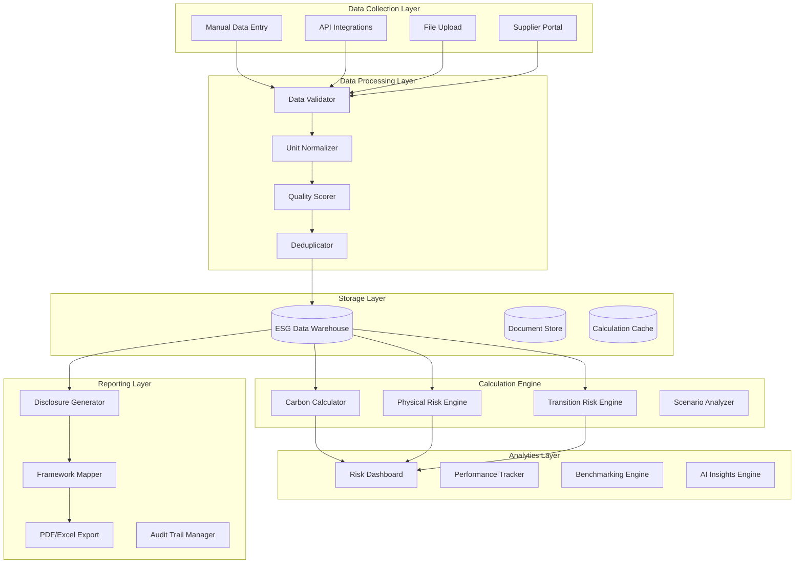

# Project 6: Climate Risk and ESG Compliance Platform

## Sustainability Domain - Risk Modeling and Regulatory Reporting

### 6.1 Business Case and Problem Statement

#### The Climate Risk Challenge

Organizations worldwide face mounting pressure to measure, manage, and disclose climate-related risks and environmental, social, and governance performance. Regulatory requirements are intensifying rapidly, with mandates like the EU's Sustainable Finance Disclosure Regulation, the SEC's climate disclosure rules, and the International Sustainability Standards Board's standards creating compliance obligations for organizations of all sizes. Investors increasingly integrate ESG factors into capital allocation decisions, with sustainable investment assets exceeding $40 trillion globally.

Beyond compliance, climate risks present material financial threats that require sophisticated analysis. Physical risks from extreme weather events, rising sea levels, and supply chain disruptions can impact operations, assets, and communities. Transition risks from policy changes, technology shifts, and market repositioning can strand assets and transform competitive landscapes. Organizations need tools to assess both exposure and resilience across their operations, portfolios, and value chains.

ESG reporting presents significant complexity. Multiple frameworks and standards exist with varying requirements, from GRI and SASB to TCFD and CSRD. Data collection spans organizational boundaries, requiring engagement with suppliers, partners, and portfolio companies. Quantification of environmental impacts requires specialized methodologies for carbon accounting, water usage, waste generation, and biodiversity. Assurance and verification add additional layers of complexity and cost.

This project addresses the fundamental challenge of comprehensive climate risk and ESG management that combines regulatory compliance, risk assessment, and performance improvement. By building a system that collects ESG data across organizational boundaries, calculates climate exposures using established methodologies, generates compliant disclosures, and provides actionable insights for risk mitigation, we create infrastructure that transforms compliance burden into competitive advantage.

#### Market Context and Opportunity

The ESG software and analytics market represents a substantial and growing opportunity as organizations seek to meet disclosure requirements and investor expectations. Market size exceeds $10 billion with double-digit growth as regulatory mandates expand and voluntary adoption increases. Organizations that effectively manage ESG performance attract capital, reduce regulatory risk, and enhance brand value.

The opportunity spans multiple segments with distinct requirements. Financial institutions need portfolio climate risk analytics for lending and investment decisions. Large corporations need enterprise-wide ESG reporting and supply chain engagement. Asset managers need climate scenario analysis for stewardship and disclosure. Governments and NGOs need benchmarking and progress tracking capabilities.

The skills developed in this project transfer broadly to sustainability consulting, environmental risk modeling, regulatory compliance, and corporate ESG strategy. Core competencies in data aggregation, risk quantification, reporting automation, and stakeholder engagement apply across industries facing increasing sustainability scrutiny.

#### Success Metrics and Acceptance Criteria

The climate risk and ESG platform must achieve specific performance targets to demonstrate production viability. Data collection coverage must exceed 95% of material Scope 1 and 2 emission sources, with 80% coverage of material Scope 3 categories. Data quality scores must achieve 85% completeness and 90% accuracy based on verification sampling.

Climate risk calculation accuracy must meet regulatory acceptance criteria. Physical risk scores must correlate with recognized hazard databases. Transition risk assessments must incorporate recognized scenario pathways. Scenario analysis must follow TCFD-recommended approaches with documented methodologies.

Reporting efficiency must demonstrate significant improvement over manual processes. Disclosure generation time must decrease by 70% compared to manual approaches. Multiple framework reporting must be automated with 90% reuse of collected data. Audit preparation time must decrease by 50% through systematic evidence management.

### 6.2 Architecture Design

#### System Overview

The climate risk and ESG platform follows a comprehensive data management architecture designed for regulatory compliance and risk analytics. The system ingests data from diverse organizational sources, normalizes and validates measurements, calculates emissions and risk metrics, and generates compliant disclosures. A central ESG data warehouse maintains historical records while distributed processing enables complex analytics at scale.

The architecture balances real-time data collection with batch processing for complex calculations. Horizontal scaling ensures the system grows with data volume and organizational complexity. Security considerations address the sensitive nature of ESG data, implementing access controls, audit trails, and compliance frameworks appropriate for regulated reporting.



#### Technology Stack Summary

| Component | Technology | Justification |
|-----------|------------|---------------|
| API Gateway | FastAPI 0.109+ | Native async, auto-docs, type validation |
| Data Processing | Pandas + Polars | Efficient tabular data manipulation |
| Emissions Calculation | Brightway2 | Open-source life cycle assessment |
| Time Series DB | TimescaleDB | Optimized for emissions data |
| Document Storage | PostgreSQL + S3 | Structured data and file storage |
| Frontend | React + Next.js | Interactive dashboards, real-time updates |
| Caching | Redis 7.x | Calculation caching, session management |
| Calculation Engine | Dask | Distributed emissions calculations |
| Visualization | Plotly + Dash | Interactive ESG visualizations |
| Containerization | Docker + Docker Compose | Environment consistency |

#### Data Flow

ESG data enters the system through multiple collection mechanisms. Manual data entry through web forms captures activity data not available through automated sources. API integrations pull consumption and production data from utility providers, enterprise systems, and third-party platforms. File uploads enable bulk data submission from suppliers and partners. Supplier portals engage value chain partners in data collection through tailored interfaces.

Collected data undergoes validation and normalization. Format validation ensures data meets expected schemas and ranges. Unit conversion normalizes diverse measurement units to standard baselines. Quality scoring assesses completeness, timeliness, and reliability. Deduplication prevents double-counting across collection channels.

Validated data flows to calculation engines. Carbon accounting applies emission factors to activity data following GHG Protocol methodologies. Physical risk assessment combines asset exposure with hazard databases and climate projections. Transition risk analysis maps policy and market scenarios to sector and geographic exposures. Scenario analysis projects outcomes across multiple climate pathways.

Calculation results feed both operational dashboards and regulatory reporting. Real-time dashboards visualize current performance against targets and benchmarks. Reporting engines generate framework-specific disclosures with supporting evidence. Audit trails maintain comprehensive lineage from source data to disclosed metrics.

### 6.3 Implementation Guide

#### Project Structure

```
climate-esg-platform/
├── app/
│   ├── api/
│   │   ├── __init__.py
│   │   ├── deps.py              # Dependencies injection
│   │   ├── errors.py            # Custom exceptions
│   │   └── routes/
│   │       ├── data.py          # Data collection endpoints
│   │       ├── emissions.py     # Emissions calculations
│   │       ├── risks.py         # Risk assessment endpoints
│   │       ├── reports.py       # Disclosure generation
│   │       └── benchmarks.py    # Benchmark comparisons
│   ├── core/
│   │   ├── config.py            # Configuration management
│   │   ├── security.py          # Auth and encryption
│   │   └── logging.py           # Structured logging
│   ├── models/
│   │   ├── database.py          # SQLAlchemy models
│   │   ├── domain.py            # Pydantic schemas
│   │   ├── esg.py               # ESG-specific models
│   │   └── risks.py             # Risk-specific models
│   ├── services/
│   │   ├── __init__.py
│   │   ├── data/
│   │   │   ├── collection.py    # Data collection services
│   │   │   ├── validation.py    # Data validation
│   │   │   └── normalization.py # Unit normalization
│   │   ├── calculations/
│   │   │   ├── carbon.py        # Carbon accounting
│   │   │   ├── physical.py      # Physical risk
│   │   │   └── transition.py    # Transition risk
│   │   ├── reporting/
│   │   │   ├── tcfd.py          # TCFD reporting
│   │   │   ├── gri.py           # GRI reporting
│   │   │   └── cdp.py           # CDP reporting
│   │   └── analytics/
│   │       ├── dashboard.py     # Dashboard data
│   │       └── insights.py      # AI insights
│   └── ml/
│       ├── models/              # Trained models
│       ├── training/            # Model training scripts
│       └── evaluation/          # Model evaluation
├── templates/
│   ├── code/
│   │   ├── api_template.py
│   │   ├── service_template.py
│   │   └── model_template.py
│   └── configuration/
│       ├── docker-compose.yml
│       ├── Dockerfile
│       └── config.yaml
├── tests/
│   ├── unit/
│   ├── integration/
│   └── fixtures/
├── data/
│   ├── factors/                 # Emission factors database
│   ├── benchmarks/              # Industry benchmarks
│   └── scenarios/               # Climate scenarios
└── scripts/
    ├── setup.sh
    ├── load_factors.py
    └── generate_report.py
```

#### Core API Implementation

```python
# app/api/deps.py
from typing import Generator, Optional
from fastapi import Depends, HTTPException, status
from sqlalchemy.orm import Session
from redis import Redis
from app.core.security import verify_token
from app.db.session import get_db
from app.db.cache import get_redis

async def get_current_user(
    token: str = Depends(oauth2_scheme),
    db: Session = Depends(get_db)
) -> User:
    """Validate JWT token and return current user."""
    credentials_exception = HTTPException(
        status_code=status.HTTP_401_UNAUTHORIZED,
        detail="Could not validate credentials",
        headers={"WWW-Authenticate": "Bearer"},
    )
    payload = verify_token(token)
    if payload is None:
        raise credentials_exception
    user_id: str = payload.get("sub")
    user = db.query(User).filter(User.id == user_id).first()
    if user is None:
        raise credentials_exception
    return user

# app/api/routes/emissions.py
from fastapi import APIRouter, Depends, HTTPException
from sqlalchemy.orm import Session
from typing import List, Optional
from pydantic import BaseModel, Field
from datetime import datetime
from enum import Enum

from app.api.deps import get_current_user, get_db
from app.schemas.emissions import (
    EmissionEntryCreate, EmissionEntryResponse,
    EmissionsSummary, ScopeBreakdown
)
from app.services.calculations.carbon import CarbonAccountingService

router = APIRouter()

class EmissionDataRequest(BaseModel):
    """Request model for emission data submission."""
    source_type: str = Field(..., description="e.g., electricity, natural_gas, fleet")
    quantity: float = Field(..., description="Amount consumed")
    unit: str = Field(..., description="e.g., kWh, therms, gallons")
    facility_id: Optional[str] = None
    accounting_period: str = Field(..., description="Month in YYYY-MM format")
    notes: Optional[str] = None

class EmissionsCalculationRequest(BaseModel):
    """Request model for emissions calculation."""
    scope: str = Field(..., description="Scope 1, 2, or 3")
    start_date: datetime
    end_date: datetime
    granularity: str = Field(default="monthly", description="monthly, quarterly, annual")
    include_sources: Optional[List[str]] = None
    exclude_sources: Optional[List[str]] = None

@router.post("/emissions/data", response_model=EmissionEntryResponse)
async def submit_emission_data(
    data: EmissionDataRequest,
    current_user: User = Depends(get_current_user),
    db: Session = Depends(get_db)
) -> EmissionEntryResponse:
    """
    Submit emission activity data.
    
    Data is validated, normalized, and stored for calculation.
    """
    from app.models.esg import EmissionEntry, EmissionSource
    
    # Validate source type
    valid_sources = ["electricity", "natural_gas", "diesel", "gasoline", 
                     "propane", "coal", "refrigerants", "fleet_vehicles"]
    if data.source_type not in valid_sources:
        raise HTTPException(
            status_code=status.HTTP_400_BAD_REQUEST,
            detail=f"Invalid source type. Must be one of: {valid_sources}"
        )
    
    # Create entry
    entry = EmissionEntry(
        organization_id=current_user.organization_id,
        source_type=data.source_type,
        quantity=data.quantity,
        unit=data.unit,
        facility_id=data.facility_id,
        accounting_period=data.accounting_period,
        submitted_by=current_user.id,
        status="pending"
    )
    db.add(entry)
    db.commit()
    db.refresh(entry)
    
    # Trigger calculation
    calc_service = CarbonAccountingService(db)
    background_tasks.add_task(
        calc_service.calculate_entry_emissions,
        entry.id
    )
    
    return EmissionEntryResponse(
        id=entry.id,
        source_type=entry.source_type,
        quantity=entry.quantity,
        unit=entry.unit,
        status=entry.status,
        calculated_emissions=entry.calculated_emissions,
        submitted_at=entry.created_at
    )

@router.post("/emissions/calculate", response_model=EmissionsSummary)
async def calculate_emissions(
    request: EmissionsCalculationRequest,
    current_user: User = Depends(get_current_user),
    db: Session = Depends(get_db)
) -> EmissionsSummary:
    """
    Calculate emissions for a time period.
    
    Returns comprehensive emissions summary by scope and source.
    """
    calc_service = CarbonAccountingService(db)
    
    results = await calc_service.calculate_period_emissions(
        organization_id=current_user.organization_id,
        scope=request.scope,
        start_date=request.start_date,
        end_date=request.end_date,
        granularity=request.granularity,
        include_sources=request.include_sources,
        exclude_sources=request.exclude_sources
    )
    
    return EmissionsSummary(
        organization_id=current_user.organization_id,
        period_start=request.start_date,
        period_end=request.end_date,
        total_emissions=results["total_emissions"],
        unit="tCO2e",
        scope_breakdown=results["by_scope"],
        source_breakdown=results["by_source"],
        time_series=results["time_series"],
        calculated_at=datetime.utcnow()
    )

@router.get("/emissions/summary")
async def get_emissions_summary(
    year: int,
    current_user: User = Depends(get_current_user),
    db: Session = Depends(get_db)
) -> dict:
    """
    Get annual emissions summary.
    
    Returns Scope 1, 2, and 3 breakdown with YoY comparison.
    """
    calc_service = CarbonAccountingService(db)
    
    summary = await calc_service.get_annual_summary(
        organization_id=current_user.organization_id,
        year=year
    )
    
    return summary

@router.get("/emissions/targets")
async def get_emission_targets(
    current_user: User = Depends(get_current_user),
    db: Session = Depends(get_db)
) -> dict:
    """
    Get emission reduction targets and progress.
    
    Returns current status against science-based targets.
    """
    calc_service = CarbonAccountingService(db)
    
    targets = await calc_service.assess_target_progress(
        organization_id=current_user.organization_id
    )
    
    return targets

@router.post("/emissions/verify")
async def request_verification(
    year: int,
    current_user: User = Depends(get_current_user),
    db: Session = Depends(get_db)
) -> dict:
    """
    Request third-party verification for emissions data.
    
    Initiates verification workflow and generates evidence package.
    """
    from app.models.esg import VerificationRequest, VerificationStatus
    
    # Generate evidence package
    evidence = await generate_evidence_package(
        organization_id=current_user.organization_id,
        year=year
    )
    
    # Create verification request
    request = VerificationRequest(
        organization_id=current_user.organization_id,
        year=year,
        status=VerificationStatus.PENDING,
        evidence_package=evidence,
        requested_by=current_user.id
    )
    db.add(request)
    db.commit()
    
    return {
        "verification_id": request.id,
        "status": "pending",
        "message": "Verification request submitted",
        "evidence_summary": evidence["summary"]
    }

async def generate_evidence_package(
    organization_id: str,
    year: int
) -> dict:
    """Generate evidence package for verification."""
    # This would include:
    # - Data collection summaries
    # - Calculation methodologies
    # - Quality scores
    # - Supporting documentation
    return {
        "summary": "Evidence package generated",
        "data_sources": [],
        "calculation_methodology": "GHG Protocol",
        "quality_scores": {}
    }
```

#### Carbon Accounting Service

```python
# app/services/calculations/carbon.py
import logging
from typing import Dict, List, Optional, Tuple
from dataclasses import dataclass, field
from datetime import datetime
import pandas as pd
import numpy as np

from app.core.config import settings

logger = logging.getLogger(__name__)

@dataclass
class EmissionFactor:
    """Represents an emission factor."""
    source_type: str
    factor: float  # kg CO2e per unit
    unit: str
    region: str
    year: int
    scope: int  # 1, 2, or 3
    source: str  # EPA, IEA, DEFRA, etc.
    uncertainty: Optional[float] = None

@dataclass
class EmissionResult:
    """Represents calculation result for a single entry."""
    entry_id: str
    source_type: str
    activity_data: float
    activity_unit: str
    emission_factor: float
    calculated_emissions: float  # tCO2e
    scope: int
    uncertainty: Optional[float] = None
    calculation_timestamp: datetime

@dataclass
class EmissionsSummary:
    """Complete emissions summary for a period."""
    organization_id: str
    period_start: datetime
    period_end: datetime
    total_emissions: float
    unit: str = "tCO2e"
    by_scope: Dict[str, float] = field(default_factory=dict)
    by_source: Dict[str, float] = field(default_factory=dict)
    time_series: List[Dict] = field(default_factory=list)
    quality_score: float = 0.0

class CarbonAccountingService:
    """
    Carbon accounting service.
    
    Implements GHG Protocol methodologies for emission calculation
    from activity data.
    """
    
    def __init__(self, db_session):
        self.db = db_session
        self.emission_factors = self._load_emission_factors()
    
    def _load_emission_factors(self) -> Dict[str, List[EmissionFactor]]:
        """Load emission factor database."""
        # This would load from database or file
        # Simplified example with common factors
        factors = {
            "electricity": [
                EmissionFactor(
                    source_type="electricity",
                    factor=0.42,  # kg CO2e per kWh (US average)
                    unit="kWh",
                    region="US",
                    year=2023,
                    scope=2,
                    source="EPA eGRID"
                ),
                EmissionFactor(
                    source_type="electricity",
                    factor=0.35,  # kg CO2e per kWh (EU average)
                    unit="kWh",
                    region="EU",
                    year=2023,
                    scope=2,
                    source="IEA"
                ),
                EmissionFactor(
                    source_type="electricity",
                    factor=0.50,  # kg CO2e per kWh (Global average)
                    unit="kWh",
                    region="Global",
                    year=2023,
                    scope=2,
                    source="IPCC"
                ),
            ],
            "natural_gas": [
                EmissionFactor(
                    source_type="natural_gas",
                    factor=2.0,  # kg CO2e per therm
                    unit="therm",
                    region="US",
                    year=2023,
                    scope=1,
                    source="EPA"
                ),
                EmissionFactor(
                    source_type="natural_gas",
                    factor=2.0,  # kg CO2e per kWh (converted)
                    unit="kWh",
                    region="EU",
                    year=2023,
                    scope=1,
                    source="DEFRA"
                ),
            ],
            "diesel": [
                EmissionFactor(
                    source_type="diesel",
                    factor=2.68,  # kg CO2e per gallon
                    unit="gallon",
                    region="US",
                    year=2023,
                    scope=1,
                    source="EPA"
                ),
            ],
            "gasoline": [
                EmissionFactor(
                    source_type="gasoline",
                    factor=2.31,  # kg CO2e per gallon
                    unit="gallon",
                    region="US",
                    year=2023,
                    scope=1,
                    source="EPA"
                ),
            ],
            "fleet_vehicles": [
                EmissionFactor(
                    source_type="fleet_vehicles",
                    factor=2.5,  # kg CO2e per mile (average fleet)
                    unit="mile",
                    region="US",
                    year=2023,
                    scope=1,
                    source="EPA"
                ),
            ],
        }
        
        return factors
    
    def get_emission_factor(
        self,
        source_type: str,
        region: str = "US",
        year: int = 2023
    ) -> Optional[EmissionFactor]:
        """Get appropriate emission factor for source and region."""
        if source_type not in self.emission_factors:
            return None
        
        factors = self.emission_factors[source_type]
        
        # Prefer exact region match
        for factor in factors:
            if factor.region == region and factor.year == year:
                return factor
        
        # Fall back to global/default
        for factor in factors:
            if factor.region == "Global":
                return factor
        
        # Return first available
        return factors[0] if factors else None
    
    def normalize_unit(self, quantity: float, from_unit: str, to_unit: str) -> float:
        """Convert between units."""
        conversions = {
            # Energy
            "kWh_to_MWh": 0.001,
            "MWh_to_kWh": 1000,
            "therm_to_kWh": 29.3,
            "kWh_to_therm": 0.0341,
            "GJ_to_kWh": 277.78,
            "kWh_to_GJ": 0.0036,
            
            # Volume
            "gallon_to_liter": 3.785,
            "liter_to_gallon": 0.264,
            "gallon_to_m3": 0.003785,
            
            # Distance
            "mile_to_km": 1.609,
            "km_to_mile": 0.621,
        }
        
        conversion_key = f"{from_unit}_to_{to_unit}"
        if conversion_key in conversions:
            return quantity * conversions[conversion_key]
        
        logger.warning(f"Unknown unit conversion: {from_unit} to {to_unit}")
        return quantity
    
    def calculate_emissions(
        self,
        source_type: str,
        quantity: float,
        unit: str,
        region: str = "US",
        year: int = 2023
    ) -> Optional[EmissionResult]:
        """Calculate emissions for a single activity."""
        # Get emission factor
        factor = self.get_emission_factor(source_type, region, year)
        
        if not factor:
            logger.warning(f"No emission factor found for {source_type}")
            return None
        
        # Normalize to factor units
        normalized_quantity = self.normalize_unit(quantity, unit, factor.unit)
        
        # Calculate emissions (convert to tonnes)
        emissions_kg = normalized_quantity * factor.factor
        emissions_tonnes = emissions_kg / 1000
        
        return EmissionResult(
            entry_id="",
            source_type=source_type,
            activity_data=quantity,
            activity_unit=unit,
            emission_factor=factor.factor,
            calculated_emissions=emissions_tonnes,
            scope=factor.scope,
            uncertainty=factor.uncertainty,
            calculation_timestamp=datetime.utcnow()
        )
    
    async def calculate_entry_emissions(self, entry_id: str):
        """Calculate and update emissions for a database entry."""
        from app.models.esg import EmissionEntry
        
        entry = self.db.query(EmissionEntry).filter(
            EmissionEntry.id == entry_id
        ).first()
        
        if not entry:
            logger.error(f"Entry {entry_id} not found")
            return
        
        # Get facility region if available
        region = "US"  # Would get from facility data
        
        result = self.calculate_emissions(
            source_type=entry.source_type,
            quantity=entry.quantity,
            unit=entry.unit,
            region=region
        )
        
        if result:
            entry.calculated_emissions = result.calculated_emissions
            entry.emission_factor = result.emission_factor
            entry.scope = result.scope
            entry.status = "calculated"
            entry.calculated_at = datetime.utcnow()
        
        self.db.commit()
    
    async def calculate_period_emissions(
        self,
        organization_id: str,
        scope: str,
        start_date: datetime,
        end_date: datetime,
        granularity: str = "monthly",
        include_sources: Optional[List[str]] = None,
        exclude_sources: Optional[List[str]] = None
    ) -> Dict:
        """Calculate comprehensive emissions for a time period."""
        from app.models.esg import EmissionEntry
        
        # Query entries
        query = self.db.query(EmissionEntry).filter(
            EmissionEntry.organization_id == organization_id,
            EmissionEntry.accounting_period >= start_date.strftime("%Y-%m"),
            EmissionEntry.accounting_period <= end_date.strftime("%Y-%m"),
            EmissionEntry.status == "calculated"
        )
        
        if scope != "all":
            query = query.filter(EmissionEntry.scope == int(scope))
        
        if include_sources:
            query = query.filter(EmissionEntry.source_type.in_(include_sources))
        
        if exclude_sources:
            query = query.filter(~EmissionEntry.source_type.in_(exclude_sources))
        
        entries = query.all()
        
        # Aggregate by source
        by_source = {}
        by_scope = {1: 0, 2: 0, 3: 0}
        
        for entry in entries:
            source = entry.source_type
            emissions = entry.calculated_emissions or 0
            
            by_source[source] = by_source.get(source, 0) + emissions
            by_scope[entry.scope] = by_scope.get(entry.scope, 0) + emissions
        
        # Total emissions
        total_emissions = sum(by_scope.values())
        
        # Generate time series
        time_series = self._generate_time_series(
            entries, granularity, start_date, end_date
        )
        
        return {
            "total_emissions": total_emissions,
            "by_scope": by_scope,
            "by_source": by_source,
            "time_series": time_series,
            "entry_count": len(entries)
        }
    
    def _generate_time_series(
        self,
        entries: List,
        granularity: str,
        start_date: datetime,
        end_date: datetime
    ) -> List[Dict]:
        """Generate time series from entries."""
        # Group by period
        by_period = {}
        
        for entry in entries:
            period = entry.accounting_period
            emissions = entry.calculated_emissions or 0
            
            if period not in by_period:
                by_period[period] = {"emissions": 0, "entries": 0}
            
            by_period[period]["emissions"] += emissions
            by_period[period]["entries"] += 1
        
        # Convert to time series format
        time_series = []
        for period, data in by_period.items():
            time_series.append({
                "period": period,
                "emissions": round(data["emissions"], 2),
                "data_points": data["entries"]
            })
        
        # Sort by period
        time_series.sort(key=lambda x: x["period"])
        
        return time_series
    
    async def get_annual_summary(
        self,
        organization_id: str,
        year: int
    ) -> Dict:
        """Get annual emissions summary with YoY comparison."""
        # Calculate current year
        current_year = await self.calculate_period_emissions(
            organization_id=organization_id,
            scope="all",
            start_date=datetime(year, 1, 1),
            end_date=datetime(year, 12, 31)
        )
        
        # Calculate previous year for comparison
        prev_year = await self.calculate_period_emissions(
            organization_id=organization_id,
            scope="all",
            start_date=datetime(year - 1, 1, 1),
            end_date=datetime(year - 1, 12, 31)
        )
        
        current_total = current_year["total_emissions"]
        prev_total = prev_year["total_emissions"]
        
        yoy_change = 0
        if prev_total > 0:
            yoy_change = ((current_total - prev_total) / prev_total) * 100
        
        return {
            "year": year,
            "total_emissions": current_total,
            "unit": "tCO2e",
            "by_scope": current_year["by_scope"],
            "yoy_change_percent": round(yoy_change, 2),
            "previous_year_emissions": prev_total,
            "trend": "increasing" if yoy_change > 0 else "decreasing"
        }
    
    async def assess_target_progress(
        self,
        organization_id: str
    ) -> Dict:
        """Assess progress against science-based targets."""
        # Get baseline and current emissions
        baseline_year = 2020
        target_year = 2030
        target_reduction = 0.50  # 50% reduction target
        
        baseline = await self.get_annual_summary(organization_id, baseline_year)
        current = await self.get_annual_summary(organization_id, 2024)
        
        baseline_total = baseline["total_emissions"]
        current_total = current["total_emissions"]
        
        if baseline_total == 0:
            return {"error": "No baseline data available"}
        
        # Calculate required trajectory
        years_elapsed = 2024 - baseline_year
        total_years = target_year - baseline_year
        required_reduction = (target_reduction * baseline_total) / total_years
        required_cumulative = required_reduction * years_elapsed
        
        # Current position
        actual_reduction = baseline_total - current_total
        on_track = actual_reduction >= required_cumulative
        
        # Calculate remaining budget
        target_total = baseline_total * (1 - target_reduction)
        remaining_budget = target_total - current_total
        
        return {
            "baseline_year": baseline_year,
            "baseline_emissions": baseline_total,
            "current_year": 2024,
            "current_emissions": current_total,
            "target_year": target_year,
            "target_reduction_percent": target_reduction * 100,
            "on_track": on_track,
            "emissions_reduced": actual_reduction,
            "remaining_budget": remaining_budget,
            "annual_reduction_required": required_reduction,
            "status": "on_track" if on_track else "behind_target"
        }
```

#### Climate Risk Assessment Service

```python
# app/services/calculations/physical_risk.py
import logging
from typing import Dict, List, Optional, Tuple
from dataclasses import dataclass
from datetime import datetime
import numpy as np

from app.core.config import settings

logger = logging.getLogger(__name__)

@dataclass
class PhysicalRiskExposure:
    """Represents physical climate risk exposure for a location."""
    location_id: str
    latitude: float
    longitude: float
    asset_value: float
    
    # Risk scores (0-1, higher is worse)
    flood_risk: float = 0.0
    heat_risk: float = 0.0
    drought_risk: float = 0.0
    wildfire_risk: float = 0.0
    storm_risk: float = 0.0
    sea_level_risk: float = 0.0
    
    # Climate scenarios
    risk_2030: Dict[str, float] = None
    risk_2050: Dict[str, float] = None
    risk_2100: Dict[str, float] = None

@dataclass
class PhysicalRiskResult:
    """Complete physical risk assessment result."""
    organization_id: str
    assessment_date: datetime
    
    # Aggregate scores
    overall_risk_score: float
    acute_risk_score: float
    chronic_risk_score: float
    
    # Financial exposure
    total_asset_value: float
    at_risk_value: float
    at_risk_percentage: float
    
    # By category
    by_hazard: Dict[str, Dict[str, float]]
    by_region: Dict[str, Dict[str, float]]
    
    # Recommendations
    adaptation_measures: List[str]
    priority_assets: List[Dict]

class PhysicalRiskEngine:
    """
    Physical climate risk assessment engine.
    
    Evaluates organizational exposure to climate-related
    physical risks using hazard data and climate projections.
    """
    
    def __init__(self):
        # Simplified hazard data (would integrate with专业数据源)
        self.hazard_databases = self._load_hazard_data()
    
    def _load_hazard_data(self) -> Dict:
        """Load hazard exposure databases."""
        # This would load from external APIs or databases
        # Simplified example
        return {
            "flood": {
                "US_EastCoast": {"base_risk": 0.3, "trend": "increasing"},
                "US_Midwest": {"base_risk": 0.2, "trend": "stable"},
                "US_WestCoast": {"base_risk": 0.25, "trend": "increasing"},
                "EU_Central": {"base_risk": 0.15, "trend": "stable"},
                "EU_Mediterranean": {"base_risk": 0.35, "trend": "increasing"},
            },
            "heat": {
                "US_South": {"base_risk": 0.4, "trend": "increasing"},
                "US_North": {"base_risk": 0.2, "trend": "increasing"},
                "EU_South": {"base_risk": 0.45, "trend": "increasing"},
                "EU_North": {"base_risk": 0.15, "trend": "increasing"},
            },
            "wildfire": {
                "US_West": {"base_risk": 0.5, "trend": "increasing"},
                "US_East": {"base_risk": 0.1, "trend": "stable"},
                "EU_Mediterranean": {"base_risk": 0.35, "trend": "increasing"},
            },
        }
    
    def _get_location_risk(
        self,
        latitude: float,
        longitude: float,
        hazard_type: str
    ) -> float:
        """Get base risk score for a location."""
        # Simplified regional mapping
        # Would use actual GIS data in production
        
        # Determine region from coordinates
        if latitude > 0:  # Northern Hemisphere
            if longitude < -100:  # Americas
                if latitude > 40:
                    region = "US_West" if longitude < -115 else "US_North"
                else:
                    region = "US_South" if latitude > 30 else "US_East"
            elif longitude < 60:  # Europe
                region = "EU_North" if latitude > 50 else "EU_Central"
            else:  # Asia
                region = "Asia"
        else:  # Southern Hemisphere
            region = "Southern_Hemisphere"
        
        # Get hazard data
        if hazard_type not in self.hazard_databases:
            return 0.1  # Default low risk
        
        hazard_data = self.hazard_databases[hazard_type]
        
        # Find matching region
        for region_pattern, data in hazard_data.items():
            if region_pattern in region:
                return data["base_risk"]
        
        return 0.2  # Default moderate risk
    
    def _project_risk(
        self,
        base_risk: float,
        scenario: str,
        year: int
    ) -> float:
        """Project risk under climate scenario."""
        # Simplified projection factors
        projection_factors = {
            "SSP1-2.6": {  # Optimistic scenario
                2030: 1.05,
                2050: 1.10,
                2100: 1.00
            },
            "SSP2-4.5": {  # Middle-of-the-road
                2030: 1.10,
                2050: 1.25,
                2100: 1.60
            },
            "SSP5-8.5": {  # Pessimistic scenario
                2030: 1.15,
                2050: 1.50,
                2100: 2.50
            }
        }
        
        scenario_factors = projection_factors.get(scenario, projection_factors["SSP2-4.5"])
        factor = scenario_factors.get(year, 1.0)
        
        return min(1.0, base_risk * factor)
    
    def assess_exposure(
        self,
        assets: List[Dict]
    ) -> List[PhysicalRiskExposure]:
        """Assess physical risk for a list of assets."""
        exposures = []
        
        for asset in assets:
            exposure = PhysicalRiskExposure(
                location_id=asset.get("id", ""),
                latitude=asset.get("latitude", 0),
                longitude=asset.get("longitude", 0),
                asset_value=asset.get("value", 0)
            )
            
            # Calculate individual hazard risks
            for hazard in ["flood", "heat", "wildfire", "storm"]:
                base_risk = self._get_location_risk(
                    exposure.latitude,
                    exposure.longitude,
                    hazard
                )
                
                # Set current and projected risks
                risk_value = getattr(exposure, f"{hazard}_risk", 0)
                setattr(exposure, f"{hazard}_risk", base_risk)
            
            exposures.append(exposure)
        
        return exposures
    
    def calculate_risk_scores(
        self,
        exposures: List[PhysicalRiskExposure]
    ) -> PhysicalRiskResult:
        """Calculate aggregate risk scores from exposures."""
        if not exposures:
            return None
        
        total_value = sum(e.asset_value for e in exposures)
        
        if total_value == 0:
            return None
        
        # Calculate aggregate scores by hazard
        by_hazard = {}
        for hazard in ["flood", "heat", "wildfire", "storm", "drought"]:
            risks = [getattr(e, f"{hazard}_risk", 0) for e in exposures]
            weighted_risk = sum(r * e.asset_value for r, e in zip(risks, exposures)) / total_value
            
            by_hazard[hazard] = {
                "score": round(weighted_risk, 3),
                "description": self._get_hazard_description(hazard, weighted_risk)
            }
        
        # Calculate acute vs chronic risk
        acute_hazards = ["flood", "wildfire", "storm"]
        chronic_hazards = ["heat", "drought"]
        
        acute_score = sum(
            by_hazard.get(h, {"score": 0})["score"] for h in acute_hazards
        ) / len(acute_hazards)
        
        chronic_score = sum(
            by_hazard.get(h, {"score": 0})["score"] for h in chronic_hazards
        ) / len(chronic_hazards)
        
        # Overall risk score
        overall_score = (acute_score * 0.6 + chronic_score * 0.4)
        
        # Calculate at-risk value (assets with risk > 0.3)
        at_risk_value = sum(
            e.asset_value for e in exposures
            if any(getattr(e, f"{h}_risk", 0) > 0.3 for h in ["flood", "heat", "wildfire", "storm"])
        )
        
        # Generate recommendations
        adaptation_measures = self._generate_adaptation_recommendations(by_hazard)
        
        # Identify priority assets (highest risk)
        priority_assets = [
            {
                "id": e.location_id,
                "risk_score": max(
                    getattr(e, h, 0) for h in ["flood", "heat", "wildfire", "storm"]
                ),
                "value": e.asset_value
            }
            for e in sorted(
                exposures,
                key=lambda x: max(
                    getattr(x, h, 0) for h in ["flood", "heat", "wildfire", "storm"]
                ),
                reverse=True
            )[:5]
        ]
        
        return PhysicalRiskResult(
            organization_id="",  # Would be passed in
            assessment_date=datetime.utcnow(),
            overall_risk_score=round(overall_score, 3),
            acute_risk_score=round(acute_score, 3),
            chronic_risk_score=round(chronic_score, 3),
            total_asset_value=total_value,
            at_risk_value=at_risk_value,
            at_risk_percentage=round(at_risk_value / total_value * 100, 1),
            by_hazard=by_hazard,
            by_region={},
            adaptation_measures=adaptation_measures,
            priority_assets=priority_assets
        )
    
    def _get_hazard_description(
        self,
        hazard: str,
        risk_score: float
    ) -> str:
        """Get description for hazard risk level."""
        if risk_score < 0.2:
            return "Low exposure"
        elif risk_score < 0.4:
            return "Moderate exposure"
        elif risk_score < 0.6:
            return "Elevated exposure"
        elif risk_score < 0.8:
            return "High exposure"
        else:
            return "Very high exposure"
    
    def _generate_adaptation_recommendations(
        self,
        by_hazard: Dict[str, Dict[str, float]]
    ) -> List[str]:
        """Generate adaptation measure recommendations."""
        recommendations = []
        
        if by_hazard.get("flood", {}).get("score", 0) > 0.3:
            recommendations.extend([
                "Elevate critical equipment and infrastructure",
                "Implement flood barriers and waterproofing",
                "Develop flood emergency response plans",
                "Consider relocation of high-value assets from flood zones"
            ])
        
        if by_hazard.get("heat", {}).get("score", 0) > 0.3:
            recommendations.extend([
                "Install cooling systems and improve building insulation",
                "Implement heat stress management programs",
                "Review supply chain vulnerability to heat events",
                "Optimize working hours to avoid extreme heat"
            ])
        
        if by_hazard.get("wildfire", {}).get("score", 0) > 0.3:
            recommendations.extend([
                "Create defensible space around facilities",
                "Use fire-resistant building materials",
                "Implement early warning systems",
                "Review insurance coverage for wildfire risk"
            ])
        
        if by_hazard.get("storm", {}).get("score", 0) > 0.3:
            recommendations.extend([
                "Reinforce building structures for wind resistance",
                "Secure outdoor equipment and materials",
                "Develop storm response and business continuity plans",
                "Ensure backup power and communication systems"
            ])
        
        return recommendations[:10]  # Limit to top 10 recommendations
```

### 6.4 Common Pitfalls and Solutions

#### Pitfall 1: Data Quality and Completeness

ESG data collection spans organizational boundaries with varying data quality and timeliness. Incomplete data leads to underestimation of emissions and risks. Inconsistent methodologies create comparability issues across time and entities.

**Detection:** Implement data quality scores that assess completeness, accuracy, and timeliness. Monitor coverage rates across material emission sources and risk categories. Compare submitted data against historical patterns to identify anomalies.

**Solution:** Build comprehensive data collection interfaces with validation and guidance. Implement automated quality scoring with clear improvement pathways. Create supplier engagement programs with data quality requirements. Maintain methodological consistency through centralized calculation engines.

#### Pitfall 2: Scope 3 Data Challenges

Scope 3 emissions represent the vast majority of organizational carbon footprints but present significant data collection challenges. Supplier data availability varies dramatically. Emission factors differ across regions and technologies. Double-counting risks exist across value chain boundaries.

**Detection:** Track supplier data coverage rates by category. Monitor emission factor quality and applicability. Validate against industry benchmarks and peer comparisons. Identify potential double-counting through value chain analysis.

**Solution:** Prioritize material Scope 3 categories for focused engagement. Use hybrid approaches combining primary supplier data with industry averages. Implement spend-based calculations when activity data is unavailable. Build supplier portals that simplify data submission while ensuring consistency.

#### Pitfall 3: Scenario Analysis Complexity

Climate scenario analysis requires integrating complex climate models, economic projections, and organizational vulnerability assessments. Multiple scenarios with different assumptions create confusion. Results interpretation requires specialized expertise.

**Detection:** Track scenario analysis completion rates and stakeholder understanding. Compare scenario outputs against historical outcomes. Monitor for inconsistent assumptions across analyses.

** Solution:** Provide clear scenario selection guidance based on organizational context. Implement standardized methodologies following TCFD recommendations. Create visualization tools that communicate results clearly. Build interpretation guidance for non-expert stakeholders.

### 6.5 Extension Opportunities

#### Extension 1: Supply Chain Engagement

Extend the platform to enable comprehensive supply chain emissions management. Implement supplier data collection portals with tiered requirements. Build supply chain emissions mapping and hotspot identification. Create supplier engagement programs with reduction targets.

Technical approach: Build multi-tier supplier data collection workflows. Implement spend-based Scope 3 calculation with product-level emission factors. Create supplier scorecards and benchmarking. Integrate with procurement systems for supplier selection.

#### Extension 2: Science-Based Target Validation

Add capabilities for science-based target setting and validation. Implement sector-specific pathway calculators. Integrate with SBTi validation requirements. Create target tracking and progress reporting.

Technical approach: Build sector decarbonization pathway databases. Implement well-below-2°C and 1.5°C trajectory calculators. Create target setting wizards aligned with SBTi criteria. Build progress tracking against approved targets.

#### Extension 3: Carbon Removal Management

Expand capabilities to manage carbon removal and offset strategies. Track removal projects and credits. Calculate permanence and additionality. Manage portfolio of removal investments.

Technical approach: Build carbon project databases with quality ratings. Implement credit lifecycle tracking. Create offset strategy optimization. Integrate with carbon market data for pricing.

### 6.6 Code Review Checklist

#### Functionality

- All API endpoints handle authentication and authorization
- Data validation prevents clearly incorrect submissions
- Calculation methods follow GHG Protocol standards
- Reporting outputs align with framework requirements
- Error responses are informative without exposing sensitive information

#### Code Quality

- Type hints present on all function signatures
- Emissions calculations handle edge cases gracefully
- Unit conversions are accurate and documented
- Logging captures relevant context without excessive noise
- Configuration externalized for different emission factors

#### Testing

- Unit tests cover calculation methods
- Integration tests verify data flows
- Fixtures provide realistic emission scenarios
- Validation tests verify calculation accuracy
- Scenario analysis tests verify methodology

#### Performance

- Batch calculations optimized for large datasets
- Caching reduces redundant calculations
- Database queries optimized for time-series data
- Async operations handle long-running calculations
- Resource cleanup in finally blocks

#### Security

- Authentication tokens have appropriate expiration
- Authorization checks on all data endpoints
- Supplier data properly isolated
- Audit logging captures all data modifications
- Compliance with data retention policies

### 6.7 Project Presentation Guidelines

#### Structure

1. **Problem Statement (2 minutes)**
   - Describe climate risk and ESG compliance challenges
   - Quantify regulatory and investor pressure
   - Present statistics on reporting requirements

2. **Solution Demo (5 minutes)**
   - Show data collection and validation
   - Demonstrate emissions calculation
   - Display physical risk assessment
   - Generate framework disclosure
   - Show target tracking dashboard

3. **Technical Deep-Dive (5 minutes)**
   - Present system architecture
   - Explain GHG Protocol methodology
   - Discuss climate risk calculation approach
   - Address data quality management
   - Discuss framework mapping

4. **Challenges and Solutions (3 minutes)**
   - Discuss Scope 3 data challenges
   - Explain scenario analysis methodology
   - Describe supplier engagement approach

5. **Future Enhancements (2 minutes)**
   - Outline supply chain capabilities
   - Discuss science-based target tools
   - Present carbon removal management

#### Demo Script

```markdown
## Demo Flow: Climate Risk Platform

### Scene 1: Data Collection
1. Navigate to data input dashboard
2. Enter activity data (electricity, fuel)
3. Upload supplier data file
4. Show data validation feedback

### Scene 2: Emissions Dashboard
1. View emissions by scope
2. Show source breakdown
3. Display time series trends
4. Compare to targets

### Scene 3: Physical Risk Assessment
1. View asset locations on map
2. Show hazard exposure scores
3. Display climate projections
4. Review adaptation recommendations

### Scene 4: Disclosure Generation
1. Select reporting framework (TCFD, GRI)
2. Generate disclosure draft
3. Export to PDF/Excel
4. Show evidence trail

### Scene 5: Target Tracking
1. View science-based targets
2. Show progress against trajectory
3. Display reduction initiatives
4. Generate target report
```

### 6.8 Open Source Contribution Guide

#### Contribution Areas

**Documentation Improvements**
- Add methodology documentation for calculations
- Improve framework requirement guides
- Create sector-specific implementation guides

**Calculation Enhancements**
- Add new emission factors
- Improve calculation methodologies
- Add new climate scenarios

**Reporting Extensions**
- Add new framework templates
- Improve disclosure generation
- Add localization support

**Integration Extensions**
- Connect to new data providers
- Add export formats
- Implement webhook triggers

#### Contribution Process

1. Fork repository and create feature branch
2. Install development dependencies
3. Make changes following coding standards
4. Add tests for new functionality
5. Run full test suite and linting
6. Submit pull request with detailed description

#### Good First Issues

- Add new emission factors
- Improve error messages
- Add new framework templates
- Create example configurations
- Improve documentation clarity
